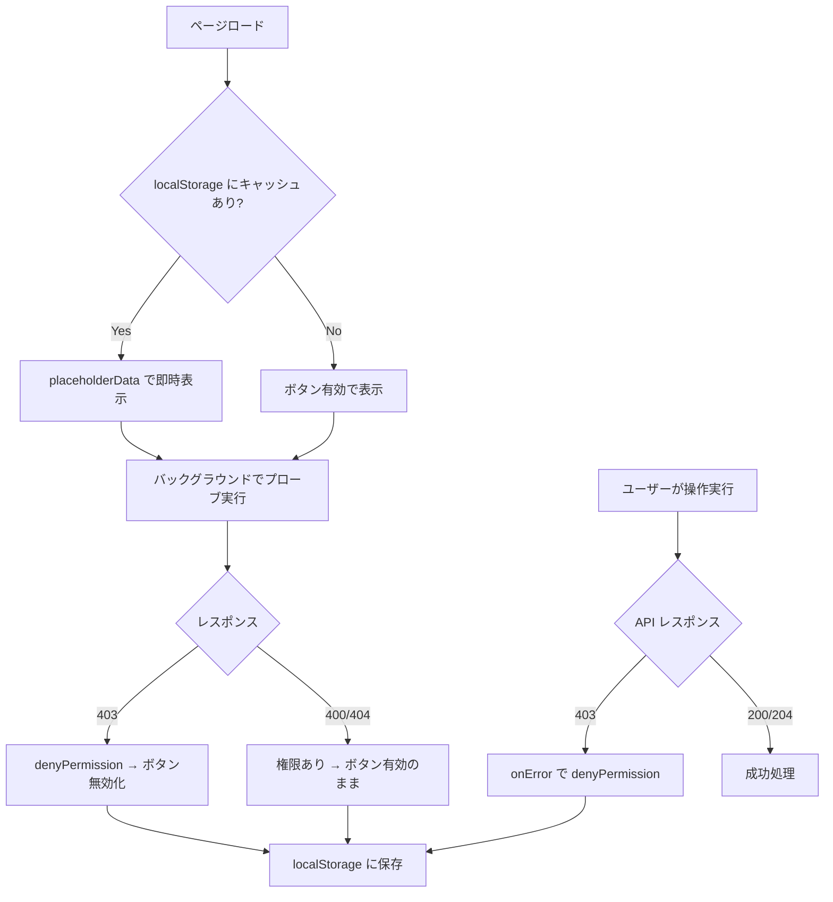
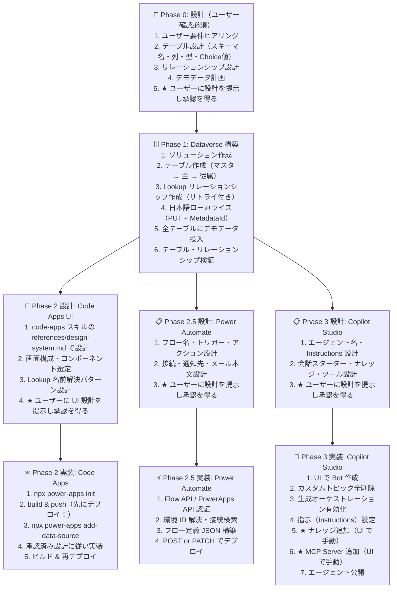


# skill
## README
# Power Platform Skills カタログ

Power Platform コードファースト開発で使用するスキル群。
Anthropic「The Complete Guide to Building Skills for Claude」の Planning and Design チャプターに基づき構成。

## スキル構成規約

### フォルダ構成（Progressive Disclosure モデル）

各スキルは以下の 3 層構造に従う:

```
skill-name/
  SKILL.md              # Level 1-2: フロントマター（常時読込）+ 本体（トリガー時読込）
  scripts/              # Level 3: デプロイ・ユーティリティスクリプト（オンデマンド読込）
    deploy_xxx.py
    check_xxx.py
  references/           # Level 3: 補足ドキュメント（オンデマンド読込）
    build-reference.md
    troubleshooting.md
```

### 統合方針

関連するスキルは **製品単位** で 1 つのスキルに統合する。
統合前に独立スキルだった内容は `references/` に配置し、メインの `SKILL.md` からリンクする。

```
例: code-apps/
  SKILL.md                          # 開発・デプロイの本体（旧 code-apps-dev）
  references/
    design-system.md                # UI 設計パターン（旧 code-apps-design）
    csp.md                          # CSP 構成（旧 code-apps-csp）
    mail-pdf.md                     # PDF メール送信（旧 code-apps-mail）
    component-catalog.md            # コンポーネントカタログ
    japan-map-pattern.md            # 日本地図パターン
    build-reference.md              # ビルドリファレンス
  scripts/
    add_app_to_solution.py
```

### YAML フロントマター規約

```yaml
---
name: skill-name              # kebab-case 識別子（必須）
description: "短い説明文"      # スキルの目的を簡潔に（必須）。トリガーキーワードは含めない
category: カテゴリ名           # 分類タグ（必須）: architecture / data / ui / automation / ai
argument-hint: "引数の説明"    # ユーザー入力を受け付ける場合のみ（任意）
user-invocable: true           # ユーザーが直接呼び出せる場合のみ（任意）
triggers:                      # スキル発動条件キーワード（必須）
  - "キーワード1"
  - "キーワード2"
---
```

### 命名規則

| 対象 | 規則 | 例 |
|------|------|-----|
| スキルディレクトリ名 | kebab-case | `copilot-studio` |
| YAML `name` フィールド | kebab-case（ディレクトリ名と一致） | `copilot-studio` |
| Python スクリプト | snake_case | `deploy_agent.py` |
| リファレンスドキュメント | kebab-case | `build-reference.md` |
| カテゴリ名 | 英小文字 | `architecture`, `data`, `ui`, `automation`, `ai` |

---

## スキル一覧（11 スキル）

### architecture — アーキテクチャ・基盤

| スキル | 説明 |
|--------|------|
| [architecture](architecture/SKILL.md) | Power Platform 全体の構成方針を設計し、最適なコンポーネント構成を決定する。 |
| [standard](standard/SKILL.md) | 共通認証・環境変数・ソリューション運用など、全スキル共通の開発基盤を提供する。 |

### data — データ層

| スキル | 説明 |
|--------|------|
| [dataverse](dataverse/SKILL.md) | Dataverse のテーブル設計・構築・デモデータ投入・権限設定を一括で実施する。 |

### ui — UI / フロントエンド

| スキル | 説明 |
|--------|------|
| [code-apps](code-apps/SKILL.md) | Code Apps を TypeScript/React ベースで開発し、UI 設計からデプロイまで対応する。 |
| [power-pages](power-pages/SKILL.md) | Power Pages コードサイトを pac pages CLI で開発・ビルド・デプロイする。 |
| [generative-page](generative-page/SKILL.md) | Generative Pages（genux）を開発・デバッグし、モデル駆動型アプリへデプロイする。 |
| [model-driven-app](model-driven-app/SKILL.md) | モデル駆動型アプリを作成・構成し、公開まで実行する。 |

### automation — 自動化

| スキル | 説明 |
|--------|------|
| [copilot-studio](copilot-studio/SKILL.md) | Copilot Studio エージェントを生成オーケストレーション前提で構築・運用する。 |
| [power-automate](power-automate/SKILL.md) | Power Automate クラウドフローをソリューション対応で作成・デプロイする。 |

### ai — AI / プロンプト

| スキル | 説明 |
|--------|------|
| [ai-builder](ai-builder/SKILL.md) | AI Builder の AI プロンプトを作成し、エージェントのツールとして組み込む。 |
| [spec-to-markdown](spec-to-markdown/SKILL.md) | PDF・PowerPoint・Excel 等の仕様書を markdown 化し、Power Platform 開発向けの factsheet / document を整理する。 |

---

## 推奨開発フロー

```
0. spec-to-markdown   → 既存仕様書を factsheet / document に正規化（必要時）
1. architecture       → 全体設計・コンポーネント選定
2. standard           → 共通基盤の確認（.env・認証）
3. dataverse          → テーブル設計・構築・セキュリティロール設定
4. code-apps          → Code Apps UI 設計・開発・デプロイ
   OR power-pages     → Power Pages コードサイト開発・デプロイ
   OR generative-page → Generative Pages 開発
   OR model-driven-app → モデル駆動型アプリ構築
5. power-automate     → フロー作成
6. copilot-studio     → エージェント構築・トリガー追加
7. ai-builder         → AI プロンプト追加
```


# フォルダ: ai-builder
## SKILL
---
name: ai-builder
description: "AI Builder の AI プロンプト（GPT Dynamic Prompt）を Dataverse API で作成し、Copilot Studio エージェントにツール（アクション）として追加する。Power Automate フローとの統合パターンも含む。"
category: ai
triggers:
  - "AI Builder"
  - "AI プロンプト"
  - "GPT Prompt"
  - "AIプロンプト作成"
  - "エージェントツール追加"
  - "msdyn_aimodel"
  - "InvokeAIBuilderModelTaskAction"
  - "プロンプトデプロイ"
  - "AI Prompt"
  - "aibuilderpredict"
  - "フロー AI Builder"
---

# AI Builder AI プロンプト構築スキル

AI Builder の **AI プロンプト（GPT Dynamic Prompt）** を Dataverse API で作成し、
Copilot Studio エージェントに **ツール（アクション）** として追加する。
Power Automate フローから **aibuilderpredict_customprompt** で呼び出すパターンも含む。

## 基本方針: AI プロンプトを常にプレビルトモデルより優先する

```
AI Builder で AI 処理を実装する場合、以下の方針に従う:

✅ AI プロンプト（カスタムプロンプト）を常に第一選択肢とする
  - 請求書処理、ドキュメント情報抽出、分類、要約 等すべて
  - プロンプトテキスト + document/image 入力で柔軟に対応
  - トレーニングデータ不要、即座にデプロイ・更新可能
  - プロンプト変更だけで出力形式・抽出項目を自由に調整

❌ プレビルトモデル（請求書処理モデル等）は原則使用しない
  - 従来型のプレビルトモデルやカスタムモデルはトレーニング（学習）が必要
  - AI プロンプトで同等の処理がプロンプトだけで実現できる

⚠ プレビルトモデルを使う例外ケース（稀）
  - 手書き文字の高精度 OCR が必須で AI プロンプトでは精度不足の場合
  - 既存のプレビルトモデルが組み込まれたワークフローを維持する必要がある場合
```

## 前提: 設計フェーズ完了後に構築に入る（必須）

**AI プロンプトを構築する前に、プロンプト設計をユーザーに提示し承認を得ていること。**

設計提示時に含める内容:

| 項目               | 内容                                                 |
| ------------------ | ---------------------------------------------------- |
| プロンプト名       | 英語推奨（スキーマ名に使用される）                   |
| プロンプトテキスト | リテラルテキスト＋入力変数の組み合わせ               |
| 入力変数           | 名前・型（text / document / image）・説明・テスト値  |
| 出力形式           | text or json（JSON の場合はスキーマ＋サンプル）      |
| モデルパラメータ   | モデル種別（gpt-41-mini 等）・temperature            |
| 利用先             | Copilot Studio ツール or Power Automate フロー       |
| shouldPromptUser   | 各入力変数をユーザーに自動的に尋ねるか（true/false） |

## 重要事項: AIModelPublish 1ステップ・アクティベーション

**2026-04-15 検証済み: `AIModelPublish` アクションは1ステップでモデルを完全にアクティブ化する。**

```
従来（旧パターン — ❌ 複雑で環境差異に弱い）:
  1. Create Model
  2. Create Training Config (statecode=2, statuscode=6 を指定)
  3. Create Run Config (statecode=2, statuscode=7 を指定)
  4. PATCH Model (_msdyn_activerunconfigurationid_value + statecode=1)
  → 環境によって statecode/statuscode 指定や _value PATCH が拒否される

正解（新パターン — ✅ シンプルで確実）:
  1. Create Model（msdyn_TemplateId@odata.bind 形式）
  2. AIModelPublish（msdyn_ プレフィックスなし unbound action）
     → Published Training Config (state=2, status=6) を自動生成
     → Run Config (state=2, status=7) を自動生成（RunConfigurationId の値が ID になる）
     → Model を Active (state=1, status=1) に自動変更
  → 完了! わずか 2 API コール

更新時:
  1. 既存 Model を検索 → Active Run Config の ID を取得
  2. Run Config の msdyn_customconfiguration を PATCH
  → 完了!（再公開不要）
```

### AIModelPublish の呼び出し方

```python
import requests

token = get_token()
headers = {
    "Authorization": f"Bearer {token}",
    "OData-MaxVersion": "4.0",
    "OData-Version": "4.0",
    "Content-Type": "application/json; charset=utf-8",
}
r = requests.post(
    f"{DATAVERSE_URL}/api/data/v9.2/AIModelPublish",  # ★ msdyn_ プレフィックスなし!
    headers=headers,
    json={
        "TemplateId": GPT_TEMPLATE_ID,       # GPT Dynamic Prompt テンプレート固定値
        "ModelId": model_id,                  # 作成した Model の GUID
        "RunConfigurationId": model_id,       # ★ model_id を渡すと Run Config ID = model_id
        "ModelName": PROMPT_NAME,
        "CustomConfiguration": custom_config_json_str,
        "RunConfiguration": custom_config_json_str,
    },
)
assert r.status_code < 400, f"AIModelPublish 失敗: {r.status_code}"
# → Model が Active、activeRun = model_id
```

### 重要な注意点

| 項目 | 説明 |
|------|------|
| アクション名 | `AIModelPublish`（`msdyn_AIModelPublish` ではない! プレフィックスなし） |
| RunConfigurationId | `model_id` を渡すと Run Config がその ID で自動作成される |
| 自動生成物 | Published Training (state=2,status=6) + Run Config (state=2,status=7) |
| 結果 | Model が state=1（Active）に自動変更される |
| 副作用 | Published Training Config は DELETE 不可（405）→ 無害 |
| 失敗時 | 既に Active な Run Config がある場合 `AnotherRunConfigAlreadyPublished` |

## Dataverse データ構造

AI Builder の AI プロンプトは **3 つの Dataverse テーブル** + **1 つの botcomponent** で構成される。

```
┌─────────────────────────┐
│  msdyn_aimodel          │  ← AI プロンプト本体
│  (msdyn_aimodels)       │
│                         │
│  msdyn_name             │  プロンプト名
│  _msdyn_templateid_value│  GPT Prompt テンプレート ID
│  _msdyn_activerunconfigurationid_value │  → Run Config
│  statecode=1 (Active)   │
└──────────┬──────────────┘
           │ 1:N
           ▼
┌─────────────────────────┐
│  msdyn_aiconfiguration  │  ← 設定（AIModelPublish で自動生成）
│  (msdyn_aiconfigurations│
│                         │
│  Training (type=190690000, state=2, status=6) │  Published Training
│  Run     (type=190690001, state=2, status=7)  │  Active Run Config
│    msdyn_customconfiguration = JSON            │  ← プロンプト定義本体
└─────────────────────────┘

┌─────────────────────────┐
│  botcomponent           │  ← エージェントとの紐付け（Copilot Studio 利用時のみ）
│  (botcomponents)        │
│                         │
│  componenttype=9        │  トピックと同じ型
│  kind: TaskDialog       │  AI プロンプトアクション
│  action.aIModelId       │  → msdyn_aimodel の GUID
│  _parentbotid_value     │  → エージェント (bots)
└─────────────────────────┘
```

### テンプレート ID（固定値）

| テンプレート名     | ID                                     |
| ------------------ | -------------------------------------- |
| GPT Dynamic Prompt | `edfdb190-3791-45d8-9a6c-8f90a37c278a` |

### msdyn_customconfiguration の JSON 構造

```json
{
  "version": "GptDynamicPrompt-2",
  "prompt": [
    { "type": "literal", "text": "以下の情報を分析してください: " },
    { "type": "inputVariable", "id": "input_text" },
    { "type": "literal", "text": " を基にレポートを作成。" }
  ],
  "definitions": {
    "inputs": [
      {
        "id": "input_text",
        "text": "input_text",
        "type": "text",
        "quickTestValue": "テスト用のサンプルテキスト"
      }
    ],
    "formulas": [],
    "data": [],
    "output": {
      "formats": ["json"],
      "jsonSchema": {
        "type": "object",
        "properties": {
          "summary": { "type": "string" },
          "key_points": { "type": "array", "items": { "type": "string" } }
        }
      },
      "jsonExamples": [
        { "summary": "出力例", "key_points": ["ポイント1", "ポイント2"] }
      ]
    }
  },
  "modelParameters": {
    "modelType": "gpt-41-mini",
    "gptParameters": { "temperature": 0 }
  },
  "settings": {
    "recordRetrievalLimit": 30,
    "shouldPreserveRecordLinks": null,
    "runtime": null
  },
  "code": "",
  "signature": ""
}
```

#### prompt 配列の要素型

| type            | 説明             | 必須フィールド |
| --------------- | ---------------- | -------------- |
| `literal`       | 固定テキスト     | `text`         |
| `inputVariable` | 入力変数への参照 | `id`           |

#### definitions.inputs の型

| type       | 説明             | 備考                        |
| ---------- | ---------------- | --------------------------- |
| `text`     | テキスト入力     | `quickTestValue` でテスト値 |
| `document` | ドキュメント入力 | ファイルアップロード        |
| `image`    | 画像入力         | 画像ファイル                |

#### definitions.output の形式

| formats    | 説明         | 追加フィールド                     |
| ---------- | ------------ | ---------------------------------- |
| `["text"]` | テキスト出力 | なし                               |
| `["json"]` | JSON 出力    | `jsonSchema` + `jsonExamples` 必須 |

#### modelParameters.modelType の値

| 値            | モデル       |
| ------------- | ------------ |
| `gpt-41-mini` | GPT-4.1 mini |
| `gpt-41`      | GPT-4.1      |
| `o3-mini`     | o3-mini      |

### botcomponent の YAML 構造（kind: TaskDialog）

```yaml
kind: TaskDialog

inputs:
  - kind: AutomaticTaskInput
    propertyName: text
    name: text
    shouldPromptUser: true

modelDisplayName: AI Prompt Sample

modelDescription: AI Prompt Sample

action:
  kind: InvokeAIBuilderModelTaskAction
  aIModelId: 5f6a74ff-cd92-4f6b-a7f2-37e2be122105

outputMode: All
```

## 構築手順

詳細な構築手順・デプロイスクリプトテンプレートは [構築リファレンス](references/build-reference.md) を参照。

## Power Automate フローからの AI Builder 呼び出し

AI Builder プロンプトを **Power Automate フロー内で呼び出す** パターン。
Copilot Studio ツールではなく、Dataverse トリガー等と組み合わせて自動実行する場合に使う。

詳細は [Power Automate 連携リファレンス](references/power-automate-integration.md) を参照。

## 必須要件

### AI Model 作成【必須】

```
✅ テンプレート ID は固定値 edfdb190-3791-45d8-9a6c-8f90a37c278a（GPT Dynamic Prompt）
✅ Model 作成は msdyn_TemplateId@odata.bind 形式を使用
✅ AIModelPublish (msdyn_ プレフィックスなし) で1ステップ完全アクティブ化
✅ RunConfigurationId に model_id を渡す → Run Config がその ID で作成される
✅ 更新時は Active Run Config の msdyn_customconfiguration を PATCH するだけ
❌ _msdyn_templateid_value を使う → 一部環境で拒否される
❌ _msdyn_activerunconfigurationid_value を直接 PATCH → 一部環境で拒否される
❌ statecode/statuscode を Config 作成時に指定 → 一部環境で拒否される
❌ PublishAIConfiguration を新規モデルに使う → AIModelPublish 単体で十分
❌ msdyn_AIModelPublish（msdyn_ プレフィックス付き）→ 404
❌ msdyn_Publish → 404
❌ SetState → 404
```

### プロンプト定義

```
✅ prompt 配列は literal と inputVariable を交互に配置
✅ inputVariable の id は definitions.inputs の id と一致させる
✅ JSON 出力の場合は jsonSchema + jsonExamples の両方を定義
✅ modelType は有効な値を使用（gpt-41-mini, gpt-41, o3-mini）
✅ temperature は 0〜1 の float 値
```

### botcomponent（エージェント追加）

```
✅ componenttype=9（トピックと同じ型番）
✅ schemaname は {botSchema}.action.{PromptNameNoSpaces} 形式
✅ YAML の kind は TaskDialog
✅ action.kind は InvokeAIBuilderModelTaskAction
✅ action.aIModelId は msdyn_aimodel の GUID（ハイフン付き小文字）
✅ inputs の propertyName は customconfiguration の inputs.id と一致
✅ shouldPromptUser: true でエージェントがユーザーに入力を求める
❌ yaml.dump() で YAML を生成 → PVA パーサーと非互換
❌ componenttype を間違える → エージェントに表示されない
```

### ソリューション管理

```
✅ msdyn_aimodel の作成は solution ヘッダー付きで POST
✅ AIModelPublish 後、自動生成された Config もソリューションに含まれる
✅ AddSolutionComponent (componenttype=401) で検証・補完
❌ デフォルトソリューションに入ったままにする → 環境間移行不可
```

### Power Automate フロー連携

```
✅ aibuilderpredict_customprompt で Active Model を参照（recordId パラメータ）
✅ Model が Active でないとフロー有効化時に GetPredictionSchema 検証で失敗
✅ Model → Flow の順でデプロイ（Model が Active 必須）
✅ フロー定義の dict キーに動的値を使う場合は f-string 必須
✅ 新しい Dataverse 列を追加した後は PublishAllXml でコネクタメタデータ更新
❌ Draft Model を参照するフローを有効化 → "GetPredictionSchema failed"
```

## ファイル入力（Image or Document Input）の制限事項

公式ドキュメント: https://learn.microsoft.com/en-us/microsoft-copilot-studio/add-inputs-prompt#limitations

### 対応ファイル形式

| 条件                          | 対応形式                                                                  |
| ----------------------------- | ------------------------------------------------------------------------- |
| 標準（Code Interpreter オフ） | **PNG, JPG, JPEG, PDF** のみ                                              |
| Code Interpreter オン         | 上記 + **Word (.doc/.docx), Excel (.xls/.xlsx), PowerPoint (.ppt/.pptx)** |

### サイズ・ページ数・時間制限

| 制限項目           | 値                                         |
| ------------------ | ------------------------------------------ |
| ファイルサイズ合計 | **25 MB 未満**（全ファイル合計）           |
| ページ数           | **50 ページ未満**                          |
| 処理タイムアウト   | **100 秒**（超過するとタイムアウトエラー） |

### その他の制限

- **Copilot Studio エージェントのツールとしての AI プロンプト**では画像/ドキュメント入力は**未対応**
  - ファイル処理が必要な場合は **Power Automate フロー経由**で AI プロンプトを呼び出す
- 非対応ファイル形式の回避策: OneDrive for Business `ConvertFile` で PDF 変換してから渡す

## .env 追加パラメータ

```env
# AI Builder AI Prompt 用（既存 .env に追加）
AI_PROMPT_NAME=AI Prompt Sample
AI_PROMPT_BOT_ID=https://copilotstudio.../bots/xxxxxxxx-xxxx-.../overview
# ↑ BOT_ID と異なるエージェントに追加する場合のみ指定
```

## デプロイ・トラブルシューティング

- [構築リファレンス](references/build-reference.md) — デプロイスクリプト・トラブルシューティング
- [Power Automate 連携リファレンス](references/power-automate-integration.md) — フロー統合パターン


# フォルダ: references
## build-reference
# AI Builder プロンプト 構築リファレンス

## ★ デプロイフロー概要

```
新規作成:
  Model POST → AIModelPublish → Done! (わずか2 APIコール)

更新:
  Model 検索 → Run Config PATCH → Done! (わずか2 APIコール)

削除＋再作成:
  Draft Configs DELETE → Model DELETE → 新規作成フロー
  ※ Published Training Config (state=2) は DELETE 不可 (405) → 無害
```

## 構築手順

### Step 1: AI Model 作成

```python
import json
import os
import requests
import time
from auth_helper import api_get, api_post, api_patch, api_delete, get_token, DATAVERSE_URL

SOLUTION_NAME = os.environ["SOLUTION_NAME"]
GPT_TEMPLATE_ID = "edfdb190-3791-45d8-9a6c-8f90a37c278a"

# ★ msdyn_TemplateId@odata.bind 形式を使用
#    _msdyn_templateid_value 形式は一部環境で拒否される
model_body = {
    "msdyn_name": PROMPT_NAME,
    "msdyn_TemplateId@odata.bind": f"/msdyn_aitemplates({GPT_TEMPLATE_ID})",
    "msdyn_sharewithorganizationoncreate": False,
}
model_id = api_post("msdyn_aimodels", model_body, solution=SOLUTION_NAME)
print(f"AI Model created: {model_id}")
time.sleep(3)  # メタデータ伝播待ち
```

### Step 2: AIModelPublish で1ステップ完全アクティブ化

```python
custom_config_str = json.dumps(CUSTOM_CONFIG, ensure_ascii=False)
token = get_token()
headers = {
    "Authorization": f"Bearer {token}",
    "OData-MaxVersion": "4.0",
    "OData-Version": "4.0",
    "Content-Type": "application/json; charset=utf-8",
}

# ★ AIModelPublish — msdyn_ プレフィックスなし!
# ★ RunConfigurationId に model_id を渡す → Run Config がその ID で作成される
r = requests.post(
    f"{DATAVERSE_URL}/api/data/v9.2/AIModelPublish",
    headers=headers,
    json={
        "TemplateId": GPT_TEMPLATE_ID,
        "ModelId": model_id,
        "RunConfigurationId": model_id,   # ← model_id を渡すのがポイント
        "ModelName": PROMPT_NAME,
        "CustomConfiguration": custom_config_str,
        "RunConfiguration": custom_config_str,
    },
)
if r.status_code >= 400:
    raise RuntimeError(f"AIModelPublish failed: {r.status_code} - {r.text[:300]}")
time.sleep(5)  # アクティベーション完了待ち

# 検証
model_state = api_get(
    f"msdyn_aimodels({model_id})?$select=statecode,_msdyn_activerunconfigurationid_value"
)
assert model_state["statecode"] == 1, "Model is not Active!"
print(f"Model Active! activeRun={model_state['_msdyn_activerunconfigurationid_value']}")
```

### Step 3: botcomponent 作成（Copilot Studio エージェント利用時のみ）

```python
# Bot の schemaname を取得して component schemaname を構築
bot_data = api_get(f"bots({bot_id})?$select=schemaname")
bot_schema = bot_data.get("schemaname", "")
action_name = PROMPT_NAME.replace(" ", "")
comp_schemaname = f"{bot_schema}.action.{action_name}"

# 既存コンポーネントを検索（べき等）
existing_comp = api_get(
    f"botcomponents?$filter=schemaname eq '{comp_schemaname}'"
    "&$select=botcomponentid"
)

# inputs YAML を構築（PVA ダブル改行フォーマット）
inputs_yaml_lines = []
for inp in INPUT_DEFINITIONS:
    inputs_yaml_lines.append("  - kind: AutomaticTaskInput")
    inputs_yaml_lines.append(f"    propertyName: {inp['id']}")
    inputs_yaml_lines.append(f"    name: {inp['id']}")
    inputs_yaml_lines.append("    shouldPromptUser: true")
    inputs_yaml_lines.append("")
inputs_yaml = "\n".join(inputs_yaml_lines)

# ★ yaml.dump() は使わない — PVA パーサーと非互換
comp_data = (
    "kind: TaskDialog\n\n"
    f"inputs:\n{inputs_yaml}\n\n"
    f"modelDisplayName: {PROMPT_NAME}\n\n"
    f"modelDescription: {PROMPT_DESCRIPTION}\n\n"
    "action:\n"
    "  kind: InvokeAIBuilderModelTaskAction\n"
    f"  aIModelId: {model_id}\n\n"
    "outputMode: All\n\n"
)

if existing_comp.get("value"):
    comp_id = existing_comp["value"][0]["botcomponentid"]
    api_patch(f"botcomponents({comp_id})", {"data": comp_data})
else:
    comp_body = {
        "name": PROMPT_NAME,
        "schemaname": comp_schemaname,
        "componenttype": 9,
        "_parentbotid_value": bot_id,
        "data": comp_data,
        "description": PROMPT_DESCRIPTION,
    }
    comp_id = api_post("botcomponents", comp_body, solution=SOLUTION_NAME)

# エージェント再公開
api_post(f"bots({bot_id})/Microsoft.Dynamics.CRM.PvaPublish", {})
```

## 既存 AI プロンプトの更新パターン

```python
# ★ プロンプト内容の更新は Run Config の PATCH だけで完了
existing = api_get(
    f"msdyn_aimodels?$filter=msdyn_name eq '{PROMPT_NAME}'"
    "&$select=msdyn_aimodelid,_msdyn_activerunconfigurationid_value,statecode"
)
if existing.get("value"):
    model = existing["value"][0]
    model_id = model["msdyn_aimodelid"]
    run_config_id = model["_msdyn_activerunconfigurationid_value"]

    if model["statecode"] == 1 and run_config_id:
        # Active Model → Run Config を PATCH するだけ
        api_patch(f"msdyn_aiconfigurations({run_config_id})", {
            "msdyn_customconfiguration": json.dumps(updated_config, ensure_ascii=False),
        })
        print("Prompt updated successfully")
    else:
        # Draft Model → 削除して再作成が確実
        _delete_model_and_configs(model_id)
        # → 新規作成フローに進む
```

## べき等デプロイ（推奨パターン）

```python
def deploy_ai_prompt():
    """AI Model をべき等でデプロイする。"""
    # 既存検索
    existing = api_get(
        f"msdyn_aimodels?$filter=msdyn_name eq '{PROMPT_NAME}'"
        "&$select=msdyn_aimodelid,statecode,_msdyn_activerunconfigurationid_value"
    )

    if existing.get("value"):
        model = existing["value"][0]
        model_id = model["msdyn_aimodelid"]

        if model["statecode"] == 1 and model.get("_msdyn_activerunconfigurationid_value"):
            # ケース 1: 既に Active → プロンプト更新のみ
            run_config_id = model["_msdyn_activerunconfigurationid_value"]
            api_patch(f"msdyn_aiconfigurations({run_config_id})", {
                "msdyn_customconfiguration": json.dumps(CUSTOM_CONFIG, ensure_ascii=False),
            })
            return model_id
        else:
            # ケース 2: Draft → 削除して再作成
            _delete_model_and_configs(model_id)

    # ケース 3: 存在しない → 新規作成
    return _create_and_activate()


def _create_and_activate():
    """Model 作成 → AIModelPublish → Active"""
    model_body = {
        "msdyn_name": PROMPT_NAME,
        "msdyn_TemplateId@odata.bind": f"/msdyn_aitemplates({GPT_TEMPLATE_ID})",
        "msdyn_sharewithorganizationoncreate": False,
    }
    model_id = api_post("msdyn_aimodels", model_body, solution=SOLUTION_NAME)
    time.sleep(3)

    custom_config_str = json.dumps(CUSTOM_CONFIG, ensure_ascii=False)
    token = get_token()
    headers = {
        "Authorization": f"Bearer {token}",
        "OData-MaxVersion": "4.0",
        "OData-Version": "4.0",
        "Content-Type": "application/json; charset=utf-8",
    }
    r = requests.post(
        f"{DATAVERSE_URL}/api/data/v9.2/AIModelPublish",
        headers=headers,
        json={
            "TemplateId": GPT_TEMPLATE_ID,
            "ModelId": model_id,
            "RunConfigurationId": model_id,
            "ModelName": PROMPT_NAME,
            "CustomConfiguration": custom_config_str,
            "RunConfiguration": custom_config_str,
        },
    )
    if r.status_code >= 400:
        raise RuntimeError(f"AIModelPublish failed: {r.status_code} - {r.text[:300]}")
    time.sleep(5)
    return model_id


def _delete_model_and_configs(model_id):
    """Model と関連 Config を削除（Published Training は 405 で無視）"""
    configs = api_get(
        f"msdyn_aiconfigurations?$filter=_msdyn_aimodelid_value eq '{model_id}'"
        "&$select=msdyn_aiconfigurationid,statecode"
    )
    for c in configs.get("value", []):
        try:
            api_delete(f"msdyn_aiconfigurations({c['msdyn_aiconfigurationid']})")
        except Exception:
            pass  # Published Training (state=2) は 405 → 無視
    time.sleep(2)
    try:
        api_delete(f"msdyn_aimodels({model_id})")
    except Exception:
        pass
    time.sleep(3)
```

## ファイル入力（Image or Document Input）の制限事項

公式ドキュメント: https://learn.microsoft.com/en-us/microsoft-copilot-studio/add-inputs-prompt#limitations

### 対応ファイル形式

| 条件                          | 対応形式                                                                  |
| ----------------------------- | ------------------------------------------------------------------------- |
| 標準（Code Interpreter オフ） | **PNG, JPG, JPEG, PDF** のみ                                              |
| Code Interpreter オン         | 上記 + **Word (.doc/.docx), Excel (.xls/.xlsx), PowerPoint (.ppt/.pptx)** |

### サイズ・ページ数・時間制限

| 制限項目           | 値                              |
| ------------------ | ------------------------------- |
| ファイルサイズ合計 | **25 MB 未満**（全ファイル合計）|
| ページ数           | **50 ページ未満**               |
| 処理タイムアウト   | **100 秒**                      |

### その他の制限

- **Copilot Studio エージェントのツール**ではファイル入力は未対応 → Power Automate フロー経由
- 非対応ファイル形式は OneDrive for Business `ConvertFile` で PDF 変換してから渡す

## トラブルシューティング

### AIModelPublish 関連

| エラー | 原因 | 対策 |
|--------|------|------|
| 404 Not Found | `msdyn_AIModelPublish` を使っている | `AIModelPublish`（プレフィックスなし）を使う |
| `AnotherRunConfigAlreadyPublished` | 既に Active Run Config がある | 更新パターンを使う（Run Config PATCH）|
| 400 Bad Request | TemplateId or ModelId が不正 | GUID 形式を確認 |

### Model 作成関連

| エラー | 原因 | 対策 |
|--------|------|------|
| `CRM do not support direct update of Entity Reference` | `_msdyn_templateid_value` を使っている | `msdyn_TemplateId@odata.bind` を使う |
| `Unexpected parameter(s) statuscode` | Config 作成時に statecode/statuscode 指定 | 指定しない（AIModelPublish が設定する）|
| `undeclared property` | 存在しない nav property を使っている | `msdyn_AIModelId@odata.bind` を使う |
| 403 Forbidden | AI Builder が環境で無効 | Power Platform 管理センターで有効化 |

### botcomponent 関連

| エラー | 原因 | 対策 |
|--------|------|------|
| Duplicate schemaname | 同じ schemaname が存在 | 既存を検索して PATCH で更新 |
| YAML parse error | yaml.dump() を使った | 手動でダブル改行フォーマット構築 |
| エージェントに表示されない | componenttype が 9 でない | componenttype=9 を確認 |
| エージェントに表示されない | PvaPublish していない | 再公開する |

### フロー有効化関連

| エラー | 原因 | 対策 |
|--------|------|------|
| `GetPredictionSchema failed with BadRequest` | Model が Draft 状態 | 先に AIModelPublish で Active 化 |
| `does not contain a definition for parameter` | f-string 未使用のキー | dict キーに `f"..."` を使う |
| `InvalidOpenApiFlow` (0x80060467) | フロー定義の操作パラメータが不正 | 操作スキーマを確認 |

### 環境差異に関する既知の問題

```
以下の操作は環境によって動作が異なる:

1. _msdyn_xxx_value 形式の PATCH
   - 一部環境: 成功
   - 一部環境: "CRM do not support direct update of Entity Reference properties"
   → 解決: @odata.bind 形式を常に使う

2. Config 作成時の statecode/statuscode 指定
   - 一部環境: 成功
   - 一部環境: "Unexpected parameter(s) statuscode"
   → 解決: AIModelPublish に任せる（指定しない）

3. msdyn_ プレフィックス付きアクション (msdyn_Publish, msdyn_AIModelPublish 等)
   - 全環境: 404 Not Found
   → 解決: AIModelPublish（プレフィックスなし）を使う

4. SetState アクション
   - 全環境: 404 Not Found
   → 解決: AIModelPublish に任せる

5. PublishAIConfiguration (bound action on Run Config)
   - 新規 Model + AIModelPublish 済み: AnotherRunConfigAlreadyPublished
   - 既存 Draft Model に手動 Run Config を作った場合: 成功
   → 解決: 新規は AIModelPublish のみ。PublishAIConfiguration は不要
```

## 完全なアンチパターン集

```
❌ msdyn_AIModelPublish (msdyn_ プレフィックス付き) → 常に 404
❌ msdyn_Publish → 常に 404
❌ SetState → 常に 404
❌ PerformBoundAction → 作成自体が失敗
❌ _msdyn_templateid_value を Model POST に含める → 一部環境で拒否
❌ statecode/statuscode を Config POST に含める → 一部環境で拒否
❌ msdyn_modelrundataspecification を Config POST に含める → 400
❌ _msdyn_activerunconfigurationid_value を直接 PATCH → 一部環境で拒否
❌ msdyn_TrainingConfigurationId@odata.bind → undeclared property
❌ AIModelPublish 後に PublishAIConfiguration → AnotherRunConfigAlreadyPublished
❌ yaml.dump() で botcomponent YAML を生成 → PVA パーサーで失敗
❌ Draft Model を参照するフローを有効化 → GetPredictionSchema failed
```


# フォルダ: references
## power-automate-integration
# AI Builder + Power Automate 連携リファレンス

Power Automate フロー内で AI Builder プロンプト (`aibuilderpredict_customprompt`) を呼び出し、
Dataverse レコードの自動分析・自動更新を行うパターン。

## デプロイ順序【必須】

```
1. AI Model を作成 + AIModelPublish でアクティブ化（MUST BE FIRST）
2. 接続参照を作成（Dataverse コネクタ用）
3. フロー定義を構築してデプロイ
4. フローを有効化
5. Webhook /start を呼び出し（Dataverse トリガーの場合）

★ Model が Active でないとフロー有効化が失敗する
  → "GetPredictionSchema failed with BadRequest"
```

## フロー定義の構造

### 接続参照の構成（2 つ必要）

AI Builder 呼び出しには Dataverse コネクタの接続参照が **2 つ** 必要:

```python
# 1. メインの Dataverse 接続（トリガー・レコード操作用）
CONNREF_DV = f"{PREFIX}_sharedcommondataserviceforapps_{FEATURE_NAME}"

# 2. AI Builder 用の Dataverse 接続（aibuilderpredict 用）
CONNREF_DV_AI = f"{PREFIX}_sharedcommondataserviceforapps_{FEATURE_NAME}_ai"
```

### connectionReferences セクション

```python
clientdata = {
    "properties": {
        "definition": flow_definition,
        "connectionReferences": {
            # メイン接続（トリガー・ListRecords・GetItem・UpdateRecord）
            CONNECTOR_DV: {
                "runtimeSource": "embedded",
                "connection": {"connectionReferenceLogicalName": CONNREF_DV},
                "api": {"name": CONNECTOR_DV},
            },
            # AI Builder 用接続（aibuilderpredict_customprompt）
            f"{CONNECTOR_DV}_1": {
                "runtimeSource": "embedded",
                "connection": {"connectionReferenceLogicalName": CONNREF_DV_AI},
                "api": {"name": CONNECTOR_DV},
            },
        },
    },
    "schemaVersion": "1.0.0.0",
}
```

### aibuilderpredict_customprompt アクション

```python
{
    "Run_AI_Prompt": {
        "type": "OpenApiConnection",
        "inputs": {
            "host": {
                "apiId": f"/providers/Microsoft.PowerApps/apis/{CONNECTOR_DV}",
                "operationId": "aibuilderpredict_customprompt",
                "connectionName": f"{CONNECTOR_DV}_1",  # ★ AI Builder 用接続を使う
            },
            "parameters": {
                "recordId": ai_model_id,  # ★ Active な msdyn_aimodel の GUID
                "item/requestv2/input_var_name": "@{...}",  # 入力変数
            },
            "authentication": "@parameters('$authentication')",
        },
        "runAfter": {"Previous_Action": ["Succeeded"]},
    },
}
```

### レスポンスの参照

```
# テキスト出力の場合
@outputs('Run_AI_Prompt')?['body/responsev2/predictionOutput/text']

# JSON 出力の場合も同じパスで JSON 文字列が返る
```

## ★ f-string 必須ルール（dict キーに動的値）

Python の dict キーに変数を含める場合、**f-string が必須**:

```python
# ❌ 誤り — PREFIX が展開されない
parameters = {
    "item/{PREFIX}_aiinsights": "..."  # → リテラル文字列 "{PREFIX}_aiinsights" になる
}

# ✅ 正解 — f-string で変数を展開
parameters = {
    f"item/{PREFIX}_aiinsights": "..."  # → "item/geek_aiinsights" になる
}
```

このバグはエラーメッセージが明確:
```
does not contain a definition for parameter 'item/{PREFIX}_aiinsights'
```

## 接続の検索（PowerApps API）

```python
def find_dataverse_connection(env_id: str) -> str:
    """PowerApps API で Dataverse 接続を検索（リトライ付き）"""
    token = get_token(scope="https://service.powerapps.com/.default")  # ★ PowerApps スコープ
    for attempt in range(3):
        try:
            r = requests.get(
                f"https://api.powerapps.com/providers/Microsoft.PowerApps"
                f"/apis/{CONNECTOR_DV}/connections",
                headers={"Authorization": f"Bearer {token}"},
                params={
                    "api-version": "2016-11-01",
                    "$filter": f"environment eq '{env_id}'",
                },
                timeout=120,  # ★ 長めのタイムアウト必須
            )
        except requests.exceptions.Timeout:
            time.sleep(15 * (attempt + 1))
            continue
        if r.status_code == 504:  # ★ 504 が頻発する
            time.sleep(15 * (attempt + 1))
            continue
        if r.ok:
            for conn in r.json().get("value", []):
                status = conn.get("properties", {}).get("statuses", [{}])[0].get("status", "")
                if status == "Connected":
                    return conn["name"]
            break
    raise RuntimeError("Dataverse 接続が見つかりません")
```

## 環境 ID の解決

```python
def resolve_environment_id() -> str:
    """DATAVERSE_URL から環境 ID を逆引き"""
    token = get_token(scope="https://service.flow.microsoft.com/.default")  # ★ Flow スコープ
    r = requests.get(
        "https://api.flow.microsoft.com/providers/Microsoft.ProcessSimple/environments"
        "?api-version=2016-11-01",
        headers={"Authorization": f"Bearer {token}"},
        timeout=60,
    )
    r.raise_for_status()
    dv_url = DATAVERSE_URL.rstrip("/")
    for env in r.json().get("value", []):
        instance_url = (
            env.get("properties", {})
            .get("linkedEnvironmentMetadata", {})
            .get("instanceUrl", "")
            or ""
        ).rstrip("/")
        if instance_url == dv_url:
            return env["name"]
    raise RuntimeError(f"環境が見つかりません: {dv_url}")
```

## フロー有効化 + Webhook 登録

```python
# フロー有効化（statecode=1, statuscode=2）
api_patch(f"workflows({workflow_id})", {"statecode": 1, "statuscode": 2})

# Dataverse WebHook トリガーの場合は /start が必要
token = get_token(scope="https://service.flow.microsoft.com/.default")
requests.post(
    f"https://api.flow.microsoft.com/providers/Microsoft.ProcessSimple"
    f"/environments/{env_id}/flows/{workflow_id}/start?api-version=2016-11-01",
    headers={"Authorization": f"Bearer {token}"},
    timeout=60,
)
```

## API スコープの使い分け（重要）

| 操作 | スコープ |
|------|----------|
| Dataverse API（テーブル操作） | DATAVERSE_URL + `/.default`（auth_helper デフォルト） |
| Flow API（環境一覧、フロー /start） | `https://service.flow.microsoft.com/.default` |
| PowerApps API（接続検索） | `https://service.powerapps.com/.default` |

## Dataverse WebHook トリガー定義

```python
{
    "triggers": {
        "When_record_changed": {
            "type": "OpenApiConnectionWebhook",
            "inputs": {
                "host": {
                    "apiId": f"/providers/Microsoft.PowerApps/apis/{CONNECTOR_DV}",
                    "connectionName": CONNECTOR_DV,
                    "operationId": "SubscribeWebhookTrigger",
                },
                "parameters": {
                    "subscriptionRequest/message": 4,  # 1=Create, 2=Delete, 3=Update, 4=Create+Update
                    "subscriptionRequest/entityname": f"{PREFIX}_tablename",
                    "subscriptionRequest/scope": 4,    # Organization
                    "subscriptionRequest/filteringattributes": "col1,col2,col3",
                    "subscriptionRequest/runas": 3,    # Modifying user
                },
                "authentication": "@parameters('$authentication')",
            },
        },
    },
}
```

## 完全なデプロイスクリプト構造

```python
"""
AI Builder + Power Automate 統合デプロイ
"""
import json, os, time, requests
from dotenv import load_dotenv
load_dotenv()
from auth_helper import api_get, api_post, api_patch, api_delete, get_token, DATAVERSE_URL

# ── Phase 1: AI Builder Model デプロイ ──
def deploy_ai_model() -> str:
    # 1. べき等チェック（既存 Active Model 検索）
    # 2. Model 作成 (msdyn_TemplateId@odata.bind)
    # 3. AIModelPublish (1ステップ Active 化)
    # 4. 検証 (statecode == 1)
    ...

# ── Phase 2: Power Automate フロー デプロイ ──
def deploy_flow(env_id: str, ai_model_id: str) -> str:
    # 1. 接続検索 (PowerApps API, リトライ付き)
    # 2. 接続参照作成 (2つ: メイン + AI Builder)
    # 3. フロー定義構築 + POST (workflows テーブル)
    # 4. 有効化 + /start
    ...

# ── メイン ──
def main():
    model_id = deploy_ai_model()
    env_id = resolve_environment_id()
    deploy_flow(env_id, model_id)

if __name__ == "__main__":
    main()
```

## トラブルシューティング

### フロー有効化失敗

| エラー | 原因 | 対策 |
|--------|------|------|
| `GetPredictionSchema failed with BadRequest` | Model が Draft | 先に AIModelPublish |
| `does not contain a definition for parameter` | f-string 忘れ | dict キーを f"..." に |
| `InvalidOpenApiFlow` (0x80060467) | 操作パラメータ不正 | 操作スキーマを確認 |
| 504 Gateway Timeout（接続検索） | PowerApps API が遅い | 3回リトライ + timeout=120 |

### 接続参照作成失敗

| エラー | 原因 | 対策 |
|--------|------|------|
| 接続が見つからない | 環境に接続未作成 | Power Automate UI で事前作成 |
| connectionid が空 | 接続ステータスが Connected でない | UI で再認証 |

### Teams PostMessageToConversation 注意

```
❌ body/subject パラメータを指定 → InvalidOpenApiFlow
   操作スキーマに body/subject は存在しない

✅ 使用可能パラメータのみ:
   - poster
   - location
   - body/recipient/groupId
   - body/recipient/channelId
   - body/messageBody
```


# フォルダ: architecture
## SKILL
---
name: architecture
description: "Power Platform ソリューションの全体アーキテクチャを設計する。Copilot Studio / Power Automate / Code Apps / Power Pages / AI Builder の使い分け判断、コンポーネント選定、統合パターンを決定する。"
category: architecture
triggers:
  - "アーキテクチャ設計"
  - "全体設計"
  - "コンポーネント選定"
  - "技術選定"
  - "Copilot Studio vs Power Automate"
  - "Code Apps vs Canvas Apps"
  - "AI Builder"
  - "統合パターン"
  - "設計判断"
  - "どれを使う"
  - "使い分け"
---

# Power Platform 共通アーキテクチャデザインスキル

ユーザー要件から **Power Platform のどのコンポーネントを使うか** を判断し、全体アーキテクチャを設計する。
各コンポーネントの得意領域・制約・統合パターンを把握し、**迷わず最適な構成を選定**するためのスキル。

> **このスキルの位置づけ**: Phase 0（設計）の最初に読む。個別コンポーネントのスキル（`copilot-studio`, `power-automate` 等）に入る前に、全体像を確定させる。

---

## 1. コンポーネント早見表

| コンポーネント        | 得意なこと                                                                                   | 苦手なこと                                                     |
| --------------------- | -------------------------------------------------------------------------------------------- | -------------------------------------------------------------- |
| **Copilot Studio**    | 自然言語対話、ナレッジ検索、LLM による推論・要約、ツール呼び出しの自律的オーケストレーション | 確定的なフロー制御、大量データの一括処理、トランザクション保証 |
| **Power Automate**    | イベント駆動の自動化、確定的なワークフロー、コネクタ経由の外部連携、条件分岐・ループ         | 自然言語対話、あいまいな入力の解釈、自律的判断                 |
| **Code Apps**         | リッチ UI、複雑なデータ操作画面、カスタムビジュアル、オフライン対応                          | ノーコードでの素早いプロトタイプ、モバイルネイティブ           |
| **Canvas Apps**       | 素早いプロトタイプ、モバイル対応、ノーコード/ローコード UI                                   | 複雑な UI カスタマイズ、外部 JS ライブラリ利用                 |
| **Model-Driven Apps** | Dataverse 標準 UI、フォーム/ビュー/ダッシュボードの自動生成、ビジネスルール統合              | カスタムビジュアル、外部 JS ライブラリ、ノーコード開発者       |
| **Power Pages**       | 外部ユーザー向けポータル・公開サイト、認証/匿名アクセス、Dataverse 連携、テーブル権限による公開制御 | 複雑なサーバーサイド処理、SSR/ISR、内部業務向けの複雑なリッチ UI |
| **AI Builder**        | 定型 AI タスク（分類・抽出・要約）、再利用可能な AI プロンプト、エージェントのツール化 | リアルタイム対話、複雑な推論チェーン（★ §6 参照: AI プロンプト優先） |
| **Dataverse**         | リレーショナルデータ、行レベルセキュリティ、監査、ビジネスルール                             | 大量ログデータ、非構造化データ、全文検索                       |

---

## 2. 判断フローチャート

### 2.1 メイン判断: 「何を実現したいか？」

```
ユーザー要件
    │
    ├─ 対話型の体験が必要？ ──→ YES ──→ 【Copilot Studio】（§3 へ）
    │                          NO
    │                          ↓
    ├─ イベント/条件に基づく自動処理？ ──→ YES ──→ 【Power Automate】（§4 へ）
    │                                     NO
    │                                     ↓
    ├─ データの閲覧・編集 UI が必要？ ──→ YES ──→ 【Code Apps / Power Pages / Canvas Apps / Model-Driven Apps】（§5 へ）
    │                                    NO
    │                                    ↓
    ├─ 再利用可能な AI 処理が必要？ ──→ YES ──→ 【AI Builder】（§6 へ）
    │                                   NO
    │                                   ↓
    └─ データモデル/ストレージが必要？ ──→ YES ──→ 【Dataverse のみ】
```

### 2.2 複合パターン（最も多い）

多くの要件は **複数コンポーネントの組み合わせ** になる。以下のパターンで判断する:

| パターン                | 構成                                                     | 典型的なユースケース                  |
| ----------------------- | -------------------------------------------------------- | ------------------------------------- |
| **CRUD + 通知**         | Code Apps / Model-Driven Apps + Power Automate           | インシデント管理、資産管理、申請管理  |
| **対話 + データ操作**   | Copilot Studio + Dataverse（ナレッジ）                   | ヘルプデスク、FAQ、データ照会         |
| **対話 + 外部連携**     | Copilot Studio + MCP Server / コネクタ                   | メール処理、ドキュメント分析          |
| **対話 + 定期実行**     | Copilot Studio + Power Automate（スケジュールトリガー）  | ニュース配信、定期レポート            |
| **対話 + イベント駆動** | Copilot Studio + Power Automate（メール/Teams トリガー） | メール自動応答、問い合わせ対応        |
| **AI 分析 + 対話**      | AI Builder + Copilot Studio                              | ドキュメント分類 + 対話で結果説明     |
| **外部ポータル + データ操作** | Power Pages + Dataverse + Power Automate            | 顧客向けポータル、パートナーサイト、公開フォーム |
| **フルスタック**        | Dataverse + Code Apps + Power Automate + Copilot Studio  | 業務アプリ + 自動化 + AI アシスタント |

---

## 3. Copilot Studio を使う判断ポイント

### 使う場面（✅）

| 判断ポイント                                    | 具体例                                            |
| ----------------------------------------------- | ------------------------------------------------- |
| ユーザーが **自然言語で質問・指示** する        | 「今月の未対応インシデントを教えて」              |
| **あいまいな入力** を解釈する必要がある         | 件名だけのメールから意図を推測                    |
| **複数のツールを状況に応じて使い分ける**        | RSS 検索 → Web 検索 → メール送信を LLM が判断     |
| **ナレッジベース検索**（社内ドキュメント・FAQ） | SharePoint / Dataverse のドキュメントから回答生成 |
| **要約・分析・レポート生成**                    | ニュース記事の要約、データの傾向分析              |
| **Teams / Web チャット** で利用者に公開         | Teams にエージェントを公開して全社利用            |

### 使わない場面（❌）

| 判断ポイント                       | 代替手段                                 |
| ---------------------------------- | ---------------------------------------- |
| 決まった手順を100%確実に実行したい | → **Power Automate**（確定的フロー）     |
| 大量データの一括処理（1000件+）    | → **Power Automate**（ループ + バッチ）  |
| LLM を使わない単純な条件分岐       | → **Power Automate**（コスト効率が良い） |
| UI でのデータ入力・編集            | → **Code Apps / Canvas Apps**            |
| 認証・承認ワークフロー             | → **Power Automate**（承認コネクタ）     |

### 構築モード: 生成オーケストレーション一択

```
❌ トピックベース開発（Classic PVA）は行わない
✅ 生成オーケストレーション（Generative Orchestration）モード一択
   — LLM が Instructions に基づいてツール呼び出しを自律的に判断
```

---

## 4. Power Automate を使う判断ポイント

### 使う場面（✅）

| 判断ポイント                          | 具体例                                      |
| ------------------------------------- | ------------------------------------------- |
| **イベント駆動** で自動実行したい     | レコード変更時、メール受信時、スケジュール  |
| **確定的な手順** を毎回同じように実行 | ステータス変更 → メール通知 → Teams 投稿    |
| **コネクタ経由の外部連携** がメイン   | Outlook メール送信、SharePoint ファイル操作 |
| **承認ワークフロー**                  | 上長承認 → 次のステップ                     |
| **データの一括処理**                  | CSVインポート、レコード一括更新             |
| **トランザクション的な処理** が必要   | 失敗時ロールバック、リトライ                |

### 使わない場面（❌）

| 判断ポイント               | 代替手段                           |
| -------------------------- | ---------------------------------- |
| ユーザーとの対話が必要     | → **Copilot Studio**               |
| あいまいな入力の解釈が必要 | → **Copilot Studio**（LLM で判断） |
| 自然言語でのレポート生成   | → **Copilot Studio**               |
| リッチな UI が必要         | → **Code Apps**                    |

### Power Automate 単体 vs Copilot Studio + トリガーの判断

これが**最も迷いやすいポイント**。以下の判断ロジックに従う:

```
「メールを受信したら処理する」要件の場合:

┌──────────────────────────────────────────────────────────────┐
│ Step 1: Copilot Studio でしかできないアクションがあるか？     │
├──────────────────────────────────────────────────────────────┤
│                                                              │
│ YES → ✅ Power Automate(トリガー) + Copilot Studio(処理)    │
│                                                              │
│   Copilot Studio 必須のアクション:                           │
│   ・Web 検索を実行する                                       │
│   ・ナレッジ（SharePoint / Dataverse）を検索・参照する       │
│   ・ニュースから経営に関係ある情報をピックアップ・分析する    │
│   ・Work IQ Word MCP で Word ファイルを作成する              │
│   ・MCP Server のツールを利用する                             │
│   ・あいまいな入力から意図を推測して自律的に判断する         │
│   ・自然言語でレポートや応答文を生成する                     │
│   ・複数ツールを状況に応じて使い分ける                       │
│                                                              │
│ NO → Step 2 へ                                               │
├──────────────────────────────────────────────────────────────┤
│ Step 2: コンテンツ（添付ファイル・本文テキスト）を            │
│         確定的な手順で加工・転送するか？                      │
├──────────────────────────────────────────────────────────────┤
│                                                              │
│ YES → ✅ Power Automate 単体で十分                           │
│                                                              │
│   Power Automate 単体で処理する例:                           │
│   ・メール受信 → 添付ファイルを SharePoint に保存            │
│   ・メール受信 → 件名で分類 → 担当者に転送                  │
│   ・メール受信 → 本文から特定の値を抽出 → Dataverse に登録  │
│   ・メール受信 → PDF を OneDrive に保存 → Teams に通知       │
│   ・条件分岐が固定（3 個以下）で判断が属人的でない処理      │
│                                                              │
│ NO → Step 3 へ                                               │
├──────────────────────────────────────────────────────────────┤
│ Step 3: LLM の判断・生成が必要か？                           │
├──────────────────────────────────────────────────────────────┤
│                                                              │
│ YES → ✅ Power Automate(トリガー) + Copilot Studio(処理)    │
│ NO  → ✅ Power Automate 単体                                 │
└──────────────────────────────────────────────────────────────┘
```

#### 判断の要約

| 判断基準                               | Power Automate 単体 | Copilot Studio + トリガー |
| -------------------------------------- | ------------------- | ------------------------- |
| コンテンツ（添付・本文）の転送・保存   | ✅                  | ❌ 不要                   |
| 固定条件での分岐・ルーティング         | ✅                  | ❌ 不要                   |
| Web 検索                               | ❌ 不可             | ✅                        |
| ナレッジ検索（SharePoint / Dataverse） | ❌ 不可             | ✅                        |
| Word ファイル作成（Work IQ MCP）       | ❌ 不可             | ✅                        |
| MCP Server ツール利用                  | ❌ 不可             | ✅                        |
| ニュース分析・経営向けピックアップ     | ❌ 不可             | ✅                        |
| 自然言語での応答・レポート生成         | ❌ 不可             | ✅                        |
| あいまいな入力の解釈                   | ❌ 困難             | ✅                        |

### Power Automate の役割パターン

| 役割                          | 説明                       | フロー内容                     |
| ----------------------------- | -------------------------- | ------------------------------ |
| **スタンドアロン**            | フロー単体で処理完結       | トリガー → アクション群 → 完了 |
| **Copilot Studio のトリガー** | エージェント起動のきっかけ | トリガー → ExecuteCopilot のみ |
| **Copilot Studio のツール**   | エージェントが呼び出す処理 | 手動トリガー → 処理 → 応答     |

---

## 5. UI コンポーネント選定

```
Q: 対象ユーザーは？

├─ 外部ユーザー（顧客・パートナー・匿名アクセス含む）
│   └─ → Power Pages（Dataverse 連携 + テーブル権限で公開制御）
│
└─ 内部ユーザー
    └─ Q: UI の複雑さは？

        ├─ 標準的な業務フォーム（Dataverse テーブルの CRUD が中心）
        │   └─ Q: カスタム UI が必要？
        │       ├─ 不要。標準ビュー/フォームで十分 → Model-Driven Apps
        │       └─ 必要 → 下記へ
        │
        ├─ シンプル（一覧 + フォーム程度）
        │   └─ Q: 開発チームの技術スタック？
        │       ├─ ローコード寄り → Canvas Apps
        │       └─ コードファースト寄り → Code Apps
        │
        ├─ 中程度（ダッシュボード + 複数画面 + フィルタ）
        │   └─ → Code Apps（shadcn/ui のコンポーネントが活きる）
        │
        └─ 複雑（カンバン + ガントチャート + インライン編集 + カスタムビジュアル）
            └─ → Code Apps 一択（Canvas Apps / Model-Driven Apps では実現困難）
```

### Power Pages を選ぶ条件

**Power Pages は対象ユーザーが外部（顧客・パートナー・匿名含む）の場合に選択する**:

```
Power Pages を選ぶ条件（すべて該当する場合のみ）:
  ① 対象ユーザーが外部（顧客・パートナー・一般公開含む）
  ② Dataverse のデータを外部公開したい、またはテーブル権限で公開範囲を制御したい
  ③ 認証（Azure AD B2C 等）または匿名アクセスが必要

上記に該当しない（内部ユーザー向け）→ Code Apps / Canvas Apps / Model-Driven Apps
```

> 詳細な開発・デプロイ手順は [power-pages/SKILL.md](../power-pages/SKILL.md) を参照。

> **⚠️ Power Pages を選択した場合の開発フロー注意**:
> Power Pages はプロビジョニングに **10〜20 分** かかる。設計承認（Phase 0）直後に **Phase 0.5** として
> プレースホルダー SPA を先行デプロイし、Phase 1（Dataverse 構築）と並行してインフラ確保を開始する。
> 詳細は `power-pages` スキルの Step 0 を参照。

### 内部ユーザー向け: Code Apps vs Canvas Apps vs Model-Driven Apps

| 判断ポイント                                         | Code Apps              | Canvas Apps          | Model-Driven Apps             |
| ---------------------------------------------------- | ---------------------- | -------------------- | ----------------------------- |
| カスタム UI コンポーネント                           | ✅ 自由（React + OSS） | ❌ 制約あり          | ❌ 標準 UI のみ               |
| ダーク/ライトモード                                  | ✅ Tailwind で容易     | △ 手動実装           | ✅ システム設定に従う         |
| TanStack Table（ソート・フィルタ・ページネーション） | ✅ ネイティブ          | ❌ 非対応            | ✅ 標準ビューで自動提供       |
| インライン編集                                       | ✅ InlineEditTable     | △ 手動実装           | ✅ Editable Grid で可能       |
| ドラッグ&ドロップ（カンバン等）                      | ✅ dnd-kit             | ❌ 非対応            | ❌ 非対応                     |
| ガントチャート・ツリー構造                           | ✅ 実装可能            | ❌ 困難              | ❌ 困難                       |
| モバイルネイティブ体験                               | △ レスポンシブ         | ✅ モバイル最適化    | ✅ Dynamics 365 モバイル      |
| 開発スピード（プロトタイプ）                         | △ コード記述必要       | ✅ ドラッグ&ドロップ | ✅✅ テーブル定義から自動生成 |
| 市民開発者が保守可能                                 | ❌ TypeScript 必要     | ✅ ローコード        | ✅ フォームエディタで編集     |
| Dataverse ビジネスルール連携                         | △ 手動実装             | △ 限定的             | ✅ ネイティブ統合             |
| セキュリティロール連携                               | △ 手動実装             | △ 手動実装           | ✅ ネイティブ統合             |
| ビュー/ダッシュボード自動生成                        | ❌ 手動実装            | ❌ 手動実装          | ✅ テーブルから自動生成       |

### このプロジェクトの標準: Code Apps

本プロジェクトでは **Code Apps（TypeScript + React + Tailwind + shadcn/ui）** を標準とする。
Canvas Apps を選択するのは、**以下の条件をすべて満たす場合に限る**:

```
Canvas Apps を選ぶ 3 条件（すべて該当する場合のみ）:
  ① ユーザー数が十数人程度（〜20人）
  ② 画面数が数画面（〜5画面）で機能がシンプル
  ③ コア業務ではない（補助的・部門限定の業務）

上記を 1 つでも満たさない場合 → Code Apps
```

### Model-Driven Apps を選ぶ条件

**Model-Driven Apps は以下の条件をすべて満たす場合に選択する**:

```
Model-Driven Apps を選ぶ 4 条件（すべて該当する場合のみ）:
  ① Dataverse テーブルの標準 CRUD が主要な操作（ビュー + フォーム中心）
  ② カスタムビジュアル（カンバン・ガントチャート等）が不要
  ③ Dataverse のビジネスルール・セキュリティロールをフル活用したい
  ④ テーブル定義から自動生成される UI で十分（最速デプロイ優先）

上記を 1 つでも満たさない場合 → Code Apps
```

> **判断の理由**: Model-Driven Apps はテーブル定義からビュー・フォーム・ナビゲーションが自動生成されるため、
> 標準的な業務データ管理アプリを最速で構築できる。ビジネスルール・セキュリティロールとのネイティブ統合も強み。
> ただし UI のカスタマイズ性は限定的なため、独自のビジュアルが必要な場合は Code Apps を選択する。

> **Code Apps との使い分け**: Code Apps は保守性・拡張性・UI カスタマイズ性に優れる。
> Canvas Apps は「小規模・シンプル・非コア」の 3 条件が揃った場合のみコスト効率で勝る。
> 迷ったら Code Apps を選択する。

---

## 6. AI Builder を使う判断ポイント

### 基本方針: AI プロンプト（カスタムプロンプト）を常に優先する

```
AI Builder には「プレビルトモデル / カスタムモデル」と「AI プロンプト（カスタムプロンプト）」がある。
ここでは、AI 処理の実装方式としてどちらを選ぶかの判断基準を示す。

■ プレビルトモデル / カスタムモデル（請求書処理、名刺読み取り、テキスト認識 等）
  - 事前学習済みのモデルを呼び出す方式
  - カスタムモデルではトレーニングデータの準備・学習が必要で手間がかかる
  - モデルの再学習・精度チューニングにも時間とコストがかかる

■ AI プロンプト（カスタムプロンプト）
  - GPT ベースのプロンプトだけで AI 処理を実現する方式
  - プロンプトテキストの変更だけで柔軟に対応可能
  - トレーニングデータ不要、即座にデプロイ・更新できる

★ 方針: AI プロンプト（カスタムプロンプト）を常に優先する
  - 請求書処理・ドキュメント抽出等も、まず AI プロンプト + document 入力で実現を検討する
  - プレビルトモデルでしか実現できない場合（OCR 精度が必須等）のみプレビルトを使う
  - 理由: プロンプトだけで実現できる方が導入・保守コストが圧倒的に低い
```

### 使う場面（✅）

| 判断ポイント                                         | 具体例                                                 |
| ---------------------------------------------------- | ------------------------------------------------------ |
| **定型の AI 処理**を再利用可能にしたい               | メール分類、テキスト要約、感情分析                     |
| **エージェントのツール**として AI 処理を呼び出したい | ドキュメント分析プロンプトをエージェントのアクションに |
| **入力→出力が明確**な AI タスク                      | テキスト入力 → JSON 出力（構造化抽出）                 |
| **Power Automate のアクション**として使いたい        | フロー内で AI 分析を実行                               |
| **請求書・領収書等のドキュメントから情報を抽出**     | AI プロンプト + document 入力で構造化 JSON を出力      |

### 使わない場面（❌）

| 判断ポイント                       | 代替手段                                            |
| ---------------------------------- | --------------------------------------------------- |
| 対話形式で AI を使いたい           | → **Copilot Studio**（Instructions で制御）         |
| リアルタイムの対話応答に AI が必要 | → **Copilot Studio**（基盤モデルが直接応答）        |
| 1回限りの分析                      | → **Copilot Studio** に直接指示（プロンプト化不要） |

### Copilot Studio の Instructions vs AI Builder プロンプトの判断

```
Q: その AI 処理は再利用するか？

├─ エージェントの対話内で直接使う（1つのエージェント専用）
│   └─ → Instructions に記述（AI Builder 不要）
│
├─ 複数のエージェント / フローから呼び出す
│   └─ → AI Builder プロンプト（ツール化して共有）
│
└─ 構造化された入出力（JSON スキーマ）が必要
    └─ → AI Builder プロンプト（output.formats: ["json"]）
```

---


## 統合パターン・テンプレート

統合アーキテクチャパターン集・設計アウトプットテンプレート・よくある判断ミスは [設計リファレンス](references/design-patterns.md) を参照。

## 10. 判断チェックリスト（設計開始時に確認）

設計を始める前に、以下を順番に確認する:

- [ ] **外部ユーザー向け UI か？** → YES なら Power Pages を含む構成
- [ ] **自然言語対話が必要か？** → YES なら Copilot Studio を含む構成
- [ ] **イベント駆動の自動処理が必要か？** → YES なら Power Automate を含む構成
- [ ] **データ操作 UI が必要か？** → YES で外部ユーザー向けなら Power Pages、内部ユーザー向けなら Code Apps / Canvas Apps / Model-Driven Apps を含む構成
- [ ] **標準ビュー/フォームで十分か？** → YES なら Model-Driven Apps が最速。カスタム UI なら Code Apps
- [ ] **再利用可能な AI 処理が必要か？** → YES なら AI Builder を含む構成
- [ ] **確定的な処理か、LLM 判断が必要か？** → 確定的なら Power Automate、LLM なら Copilot Studio
- [ ] **応答文の生成が必要か？** → YES なら Copilot Studio
- [ ] **外部トリガー（メール/スケジュール）でエージェントを起動するか？** → YES なら Power Automate + Copilot Studio
- [ ] **複数エージェント/フローから共用する AI 処理があるか？** → YES なら AI Builder で共通化


# フォルダ: references
## design-patterns
# アーキテクチャ設計 リファレンス

## 7. 統合アーキテクチャパターン集

### パターン A: 業務アプリ（CRUD + 通知）

```
[Dataverse] ←→ [Code Apps]     ← ユーザーがデータ操作
      ↓ レコード変更
[Power Automate] → メール/Teams 通知
```

**使うスキル**: `code-apps` → `power-automate`

### パターン A2: 業務アプリ（Model-Driven + 通知）

```
[Dataverse] ←→ [Model-Driven Apps]  ← テーブル定義から自動生成 UI
      ↓ レコード変更
[Power Automate] → メール/Teams 通知
```

**使うスキル**: `model-driven-app` → `power-automate`

> **パターン A vs A2 の判断**: カスタム UI が不要で標準ビュー/フォームで十分なら A2（最速）。
> カンバン・ダッシュボード・カスタムビジュアルが必要なら A。

### パターン B: AI アシスタント（対話 + ナレッジ）

```
[Teams / Web] → [Copilot Studio]
                    ↓
              [Dataverse ナレッジ] + [SharePoint ナレッジ]
```

**使うスキル**: `copilot-studio`

### パターン C: イベント駆動 AI 処理（トリガー + エージェント）

```
[メール受信 / スケジュール]
      ↓
[Power Automate] → ExecuteCopilot
      ↓
[Copilot Studio] → ツール呼び出し（MCP / コネクタ）
      ↓
応答処理（メール返信 / Teams 投稿）
```

**使うスキル**: `copilot-studio`（[trigger.md](../../copilot-studio/references/trigger.md) を参照）

### パターン D: 定期レポート配信

```
[Power Automate: Recurrence トリガー]
      ↓
[Copilot Studio] → RSS/Web 検索 → レポート生成 → メール送信
```

**使うスキル**: `copilot-studio`（[market-research-report.md](../../copilot-studio/references/market-research-report.md) を参照）

### パターン E: フルスタック業務システム

```
[Dataverse]
    ↑↓
[Code Apps] ←→ ユーザー操作
    ↓ レコード変更
[Power Automate] → 通知 / 承認 / 外部連携
    ↓
[Copilot Studio] ← Teams から対話
    ↓
[AI Builder] ← エージェントのツールとして分析
```

**使うスキル**: 全フェーズスキルを順番に適用

---

## 8. 設計アウトプットテンプレート

このスキルで判断した結果は、以下のテンプレートでユーザーに提示する:

```markdown
## アーキテクチャ設計書

### 1. 要件サマリー

- 管理対象: {何を管理するか}
- 主なユーザー: {誰が使うか}
- 主要操作: {何をするか}

### 2. アーキテクチャパターン

**パターン {A/B/C/D/E}**: {パターン名}

### 3. コンポーネント構成

| コンポーネント | 用途                 | 必要性  |
| -------------- | -------------------- | ------- |
| Dataverse      | {テーブル構成の概要} | ✅ 必須 |
| Code Apps      | {画面の概要}         | ✅ / ❌ |
| Model-Driven   | {アプリの概要}       | ✅ / ❌ |
| Power Automate | {フローの概要}       | ✅ / ❌ |
| Copilot Studio | {エージェントの概要} | ✅ / ❌ |
| AI Builder     | {プロンプトの概要}   | ✅ / ❌ |

### 4. 判断根拠

- {なぜこのコンポーネントを選んだか}
- {なぜ代替案を選ばなかったか}

### 5. 構築フェーズ

1. Phase 1: Dataverse — {テーブル数}テーブル
2. Phase 2: Code Apps — {画面数}画面（※ 不要なら省略）
   2'. Phase 2: Model-Driven Apps — テーブルから自動生成（※ Code Apps と排他）
3. Phase 2.5: Power Automate — {フロー数}フロー（※ 不要なら省略）
4. Phase 3: Copilot Studio — {エージェント数}エージェント（※ 不要なら省略）
5. Phase 4: AI Builder — {プロンプト数}プロンプト（※ 不要なら省略）

この設計で進めてよいですか？
```

---

## 9. よくある判断ミスと対策

| ミス                                                             | 正しい判断                                                                 |
| ---------------------------------------------------------------- | -------------------------------------------------------------------------- |
| 通知だけなのに Copilot Studio を使う                             | Power Automate 単体で十分。LLM が不要なら使わない                          |
| 確定的な処理に Copilot Studio を使う                             | 条件分岐が固定なら Power Automate。LLM のハルシネーションリスクを避ける    |
| Power Automate で自然言語処理を頑張る                            | Copilot Studio に任せる。フローの条件分岐で自然言語を扱うのは脆い          |
| AI Builder で対話機能を作ろうとする                              | Copilot Studio を使う。AI Builder は単発の入力→出力処理向き                |
| Canvas Apps で複雑な UI を作る                                   | Code Apps に切り替える。ドラッグ&ドロップのカンバンは Canvas Apps では困難 |
| 標準 CRUD だけなのに Code Apps でフルスクラッチ                  | Model-Driven Apps なら自動生成で最速。カスタム UI 不要なら MDA を検討      |
| 全要件に Copilot Studio を使う                                   | 対話が不要な部分は Power Automate / Code Apps で。適材適所                 |
| Power Automate フロー内に AI Builder アクションを API でデプロイ | API では `InvalidOpenApiFlow` エラー。AI Builder ステップは UI で手動追加  |

---


# フォルダ: code-apps
## SKILL
---
name: code-apps
description: "Power Apps Code Apps（コードファースト）の初期化・Dataverse 接続・UI 設計・開発・デプロイ。TypeScript + React + Tailwind CSS + shadcn/ui で開発する。CSP 構成・メール送信パターンも含む。"
category: ui
triggers:
  - "Code Apps"
  - "power-apps init"
  - "power-apps push"
  - "add-data-source"
  - "DataverseService"
  - "Tailwind"
  - "shadcn"
  - "React"
  - "TypeScript"
  - "Vite"
  - "Code Apps デプロイ"
  - "nameUtils パッチ"
  - "日本語サニタイズ"
  - "Code Apps デザイン"
  - "UI 設計"
  - "コンポーネント選定"
  - "画面レイアウト"
  - "ギャラリー"
  - "テーブル"
  - "カンバン"
  - "ガントチャート"
  - "ダッシュボード"
  - "フォーム"
  - "デザイン例"
  - "iframe"
  - "embed"
  - "埋め込み"
  - "CSP"
  - "Content Security Policy"
  - "frame-src"
  - "connect-src"
  - "メール送信"
  - "PDF添付"
  - "PDF生成"
  - "htmlToPdfBase64"
  - "ContentBytes"
  - "base64"
  - "html2canvas"
  - "jsPDF"
  - "日本地図"
  - "地図"
  - "マップ"
  - "JapanMap"
  - "add-flow"
  - "list-flows"
  - "フロー呼び出し"
  - "フロー連携"
  - "AI Builder"
  - "executeAsync"
  - "dataSourcesInfo"
  - "Copilot Studio コネクタ"
  - "Copilot Studio 直接"
  - "ExecuteCopilotAsyncV2"
  - "shared_microsoftcopilotstudio"
  - "エージェント呼び出し"
  - "会話継続"
  - "conversationId"
  - "デプロイして"
  - "プッシュして"
  - "ディープリンク"
  - "deep link"
  - "queryParams"
  - "パラメータ渡し"
  - "URL パラメータ"
---

# Code Apps 開発スキル

Power Apps Code Apps（コードファースト）を **TypeScript + React + Tailwind CSS + shadcn/ui** で開発する。
UI 設計・CSP 構成・メール送信パターンまで Code Apps 開発の全領域をカバーする統合スキル。

> [!NOTE]
> Microsoft Learn の現行概要では、Code Apps は **React / Vue などの SPA を Power Apps 上でホストする仕組み** とされている。
> この開発標準はその中でも **React ベース実装に標準化**したガイドであり、他フレームワーク一般論ではなく、このリポジトリのテンプレートと運用実績に基づく推奨事項をまとめている。

## 公式概要との整合メモ（2026-05 時点）

- Code Apps は **Single-Page Application (SPA)** を対象とする。
- Microsoft の推奨 CLI は `npx power-apps` 系で、`pac code` は将来廃止予定。
- ただし本スキルでは、`npx power-apps push` のテナント解決不具合に当たる場合のみ `pac code push` を **暫定ワークアラウンド** として許容する。
- 利用者には **Power Apps Premium ライセンス** が必要。
- Power Apps mobile / Windows アプリ、Power Platform Git integration、SharePoint forms integration など、Code Apps では未対応の機能がある前提で設計する。

## サブリファレンス（必要に応じて参照）

| リファレンス | 内容 |
|---|---|
| [デザインシステム](references/design-system.md) | shadcn/ui + Tailwind CSS v4 のコンポーネント選定・画面設計パターン |
| [コンポーネントカタログ](references/component-catalog.md) | 全コンポーネントの詳細仕様・使用例 |
| [CSP 構成](references/csp.md) | iframe 埋め込み・外部 API 接続時の Content Security Policy 設定 |
| [コネクタリファレンス](references/connector-reference.md) | Code Apps で利用する主要コネクタの追加方法・使用例 |
| [メール・PDF 送信](references/mail-pdf.md) | HTML→PDF 変換・Power Automate 経由メール添付送信パターン |
| [日本地図パターン](references/japan-map-pattern.md) | SVG 都道府県地図の実装パターン |
| [高度な実装パターン](references/advanced-patterns.md) | マルチ環境・オフライン・i18n・パフォーマンス最適化パターン |
| [ビルドリファレンス](references/build-reference.md) | ビルド・デプロイの詳細手順 |
| [フロー連携](references/flow-integration.md) | Power Automate フロー呼び出し・AI Builder JSON パース・dataSourcesInfo 統合 |
| [Copilot Studio コネクタ](references/copilot-studio-connector.md) | Copilot Studio エージェント直接呼び出し・会話継続・レスポンス解析 |
| [プレデプロイレビュー](references/pre-deploy-review.md) | 「デプロイして」「プッシュして」時の自動チェック手順 |
| [ディープリンク](references/deep-link.md) | MDA / Power Automate から Code Apps の特定ページにパラメータ付きで遷移するパターン |
| [トラブルシューティング](references/troubleshooting.md) | 頻出エラーと対処法（日本語サニタイズ・GUID フィルタ・orderBy 等） |

> [!NOTE]
> 本スキル内のコード例は **インシデント管理サンプル** を題材としています。
> `geek_incident` / `Geek_incidents` 等のテーブル名・型名は、あなたのプロジェクトのエンティティに読み替えてください。
> パターン（Lookup 名前解決、SDK ラッパー、useMemo マップ等）はそのまま適用できます。

## 前提: 設計フェーズ完了後に実装に入る（必須）

**このスキルでコードを書く前に、[デザインシステム](references/design-system.md) を参照して UI 設計を行い、ユーザーの承認を得ていること。**

```
① デザインシステムリファレンス（references/design-system.md）を読み込む
② 画面構成・コンポーネント選定・Lookup 名前解決パターンを設計
③ ユーザーに設計を提示し、「この設計で進めてよいですか？」と承認を得る
④ 承認後、このスキルに従って実装
```

> **設計で提示する内容**: 画面一覧（ページ名・ルート）、各画面のコンポーネント構成（ListTable / InlineEditTable / StatsCards / FormModal 等）、
> カラム定義、Lookup 名前解決の方法（`_xxx_value` + `useMemo` Map）、ナビゲーション構造

## 大前提: 一つのソリューション内に開発

Dataverse テーブル・Code Apps・Power Automate フロー・Copilot Studio エージェントは **すべて同一のソリューション内** に含める。

```
SOLUTION_NAME={YourSolutionName}  ← .env で定義。全フェーズで同じ値を使用
PUBLISHER_PREFIX={prefix}          ← ソリューション発行者の prefix
```

- Code Apps は `npx power-apps push` でソリューション内にデプロイされる（環境 ID で紐づけ）
- Dataverse データソース追加時はソリューション内のテーブルを参照
- 開発・テスト・本番の環境間移行はソリューションのエクスポート/インポートで行う

## 必須要件

### 環境の前提条件（デプロイ前に必ず確認）

```
1. Power Platform 管理センターで「コード アプリを許可する」がオン
   → オフの場合: CodeAppOperationNotAllowedInEnvironment (403) エラー

2. PAC CLI 認証プロファイルが対象環境用に作成済み
   pac auth create --name {profile-name} --environment {ENVIRONMENT_ID}
   pac auth list  # * が付いているのがアクティブ

3. power.config.json は npx power-apps init で生成する
   → テンプレートから手動コピーしない
   → 別環境の appId が残っていると: AppLeaseMissing (409) エラー
   → 新規環境では必ず npx power-apps init で新規生成
```

### `npx power-apps init` でスキャフォールドされるファイル（手動作成禁止）

`npx power-apps init` は以下のファイルを自動生成する。**これらを手動作成・他プロジェクトからコピーしてはならない。**

| ファイル | 役割 | カスタマイズ |
|---|---|---|
| `power.config.json` | 環境 ID・アプリ ID（環境固有） | ❌ 禁止 |
| `plugins/plugin-power-apps.ts` | Vite 開発サーバー用 Power Apps プラグイン（CORS・ミドルウェア・起動 URL 表示） | ❌ 不要 |
| `vite.config.ts` | Vite 設定（power-apps プラグイン組み込み済み） | ⚠ `manualChunks` 等の追加のみ |
| `tsconfig.json` / `tsconfig.app.json` / `tsconfig.node.json` | TypeScript 設定 | ⚠ パスエイリアス等の追加のみ |
| `eslint.config.js` | ESLint 設定 | ⚠ ルール追加のみ |
| `index.html` | エントリ HTML | ❌ 不要 |
| `package.json` | 依存関係（`@microsoft/power-apps` 等） | ⚠ 依存追加のみ |
| `src/main.tsx` / `src/App.tsx` / `src/index.css` | React エントリポイント | ✅ 自由にカスタマイズ |
| `components.json` | shadcn/ui 設定 | ⚠ 通常変更不要 |

> **原則**: SDK がスキャフォールドしたインフラファイル（`plugin-power-apps.ts`、`power.config.json`）は変更しない。開発者がカスタマイズするのは `src/` 配下のアプリコードのみ。

### .power/ と src/generated/ は SDK コマンドで生成（手動作成禁止）

`.power/` は `.gitignore` で除外されているため、git clone 後は `dataSourcesInfo.ts` が存在しない。
**カスタムスクリプトで生成せず、SDK コマンドで必ず再生成すること。**

```
❌ git clone 直後に npm run build
   → TS2307: Cannot find module '../../../.power/schemas/appschemas/dataSourcesInfo'

❌ カスタムスクリプト（generate_datasources_info.py 等）で手動生成
   → SDK が管理するファイルを自前で作ると整合性が崩れる

✅ npx power-apps add-data-source で各テーブルを再追加
   → .power/schemas/appschemas/dataSourcesInfo.ts が自動生成される
   → src/generated/ のモデル・サービスも同時に再生成される
   → その後 npm run build が成功する
```

### 標準ワークフロー（この順序で進める）

以下が **上から順に実行すれば問題なく動く** 統一フローである。

```bash
# ── Step 1: スキャフォールド ──
npx power-apps init --display-name "アプリ名" --environment-id {ENVIRONMENT_ID} --non-interactive
npm install

# ── Step 2: テンプレートクリーンアップ ──
# ※ サンプルページを削除するが use-theme.ts は保護すること（変更禁止）
Remove-Item "src/pages/incidents.tsx","src/pages/incident-detail.tsx","src/pages/kanban.tsx","src/pages/assets.tsx" -Force -ErrorAction SilentlyContinue
Remove-Item "src/types/incident.ts" -Force -ErrorAction SilentlyContinue
# ❌ Remove-Item "src/hooks/*" は禁止（use-theme.ts が消える）

# ── Step 3: 初回ビルド＆デプロイ ──
npm run build
pac code push -env {ENVIRONMENT_ID} -s {SOLUTION_NAME}
# この時点で Power Platform にアプリが登録され Dataverse 接続が確立
# power.config.json が自動生成される

# ── Step 4: データソース追加 ──
node patch-nameutils.cjs   # 日本語パッチ（npm install 後に毎回必要）
npx power-apps add-data-source --api-id dataverse \
  --resource-name {table_logical_name} \
  --org-url {DATAVERSE_URL} --non-interactive
# 全テーブルに対して繰り返す

# ── Step 5: 開発 → 再デプロイ ──
# src/ 配下のアプリコードを実装
npm run build && pac code push -env {ENVIRONMENT_ID} -s {SOLUTION_NAME}
```

```
❌ ローカルで全部作ってから最後にデプロイ
   → Dataverse 接続が確立されず add-data-source が失敗する

❌ テンプレートの src/hooks/ をワイルドカード削除
   → use-theme.ts が消えてビルドが壊れる
```

### デプロイコマンドの選択（pac code push を標準とする）

| コマンド | 認証基盤 | テナント問題 | 推奨度 |
|---|---|---|---|
| `pac code push -env {ID} -s {SOL}` | PAC CLI プロファイル | なし | ✅ 標準 |
| `npx power-apps push` | npm パッケージ独自キャッシュ | 403/404 頻発 | ⚠ 動くならOK |

> **注**: Microsoft は `npx power-apps` を推奨ツールとしているが、テナント解決の不具合が
> 2026-05 時点で未修正のため、本開発標準では `pac code push` を標準採用する。
> `npx power-apps push` が正常動作する環境ではそちらを使っても良い。

### データソース追加の判断フロー

```
┌─ npx power-apps add-data-source --org-url {DATAVERSE_URL}
│   └─ 成功 → 完了（Model/Service ファイルも生成される）✅
│
├─ 失敗: 403 テナント不一致
│   └─ pac code add-data-source -a dataverse -t {table}
│       └─ 成功 → 完了（最小構成のみ生成、後述の自前サービス層が必要）✅
│       └─ 失敗: "Failed to sanitize string 顧客一覧"
│           └─ toggle_table_lang.py ワークアラウンド適用（後述）
│               python toggle_table_lang.py en
│               pac code add-data-source -a dataverse -t {table}
│               python toggle_table_lang.py jp
└─────────────────────────────────────────────────────────────
```

**原則**: `npx power-apps add-data-source --org-url` を最初に試す。
フォールバックとして `pac code add-data-source` + `toggle_table_lang.py` を使用する。

### 日本語 DisplayName サニタイズエラーの回避

```
問題: テーブルの日本語表示名で "Failed to sanitize string インシデント" エラー
原因: nameUtils.js が ASCII 文字のみ許容
```

**修正対象**: `node_modules/@microsoft/power-apps-actions/dist/CodeGen/shared/nameUtils.js`

```javascript
// ❌ 元のコード
name = name.replace(/[^a-zA-Z0-9_$]/g, "_");

// ✅ 修正後（CJK・Unicode 文字を許容）
name = name.replace(
  /[^a-zA-Z0-9_$\u00C0-\u024F\u0370-\u03FF\u0400-\u04FF\u3000-\u9FFF\uAC00-\uD7AF\uF900-\uFAFF]/g,
  "_",
);
```

**パッチ適用方法（重要）**: PowerShell では `$` のエスケープ問題でパッチが適用されないことがある。
**必ず Node.js スクリプト（`patch-nameutils.cjs`）を使うこと。**

```javascript
// patch-nameutils.cjs — プロジェクトルートに配置
const fs = require('fs');
const p = 'node_modules/@microsoft/power-apps-actions/dist/CodeGen/shared/nameUtils.js';
let c = fs.readFileSync(p, 'utf8');
const oldPat = "[^a-zA-Z0-9_$]/g, '_')";
const newPat = "[^a-zA-Z0-9_$\\u00C0-\\u024F\\u0370-\\u03FF\\u0400-\\u04FF\\u3000-\\u9FFF\\uAC00-\\uD7AF\\uF900-\\uFAFF]/g, '_')";
if (c.includes(oldPat)) {
  c = c.replace(oldPat, newPat);
  fs.writeFileSync(p, c);
  console.log('Patched successfully');
} else {
  console.log('Already patched or pattern not found');
}
```

```bash
# パッチ適用コマンド
node patch-nameutils.cjs

# 検証
node -e "const c=require('fs').readFileSync('node_modules/@microsoft/power-apps-actions/dist/CodeGen/shared/nameUtils.js','utf8');c.split('\n').forEach((l,i)=>{if(l.includes('replace')&&l.includes('a-zA-Z'))console.log(i+':',l.trim())})"
```

```
❌ PowerShell の文字列置換（$, バッククォート, 正規表現のエスケープが競合）
   → パッチが適用されたように見えて実際には変更されていないケースがある

✅ Node.js スクリプト（patch-nameutils.cjs）で確実に適用
   → 適用後に Select-String または node -e で検証必須
```

> `npm install` で node_modules が再生成されるとパッチが消える。データソース追加のたびに `node patch-nameutils.cjs` を実行すること。

### 日本語 DisplayName: PAC CLI がパッチを無視する場合のワークアラウンド（検証済 2026-05-21）

`patch-nameutils.cjs` は `npx power-apps add-data-source`（node_modules 経由）のパッチ。
**`pac code add-data-source` は PAC CLI 独自の .NET 内蔵ランタイムを使用する**ため、
Node.js パッチが適用されても「Failed to sanitize string 顧客一覧」が解消しないケースがある。

```
❌ PAC CLI 内部の nameUtils.js をパッチ
   → PAC の .stage ディレクトリ内にも複数バージョンが存在
   → パッチ適用しても PAC が別のランタイムパスを使用
   → node -e でパッチ検証しても PAC 実行時には効かない

✅ テーブル表示名を一時的に英語に切り替えてからコマンド実行
   → API で DisplayName/DisplayCollectionName を英語に変更
   → pac code add-data-source を実行
   → API で日本語に復元
```

**ワークアラウンドスクリプト（`toggle_table_lang.py`）**:

```python
"""
テーブル表示名を英語⇔日本語で切り替えるユーティリティ。
pac code add-data-source の日本語サニタイズ問題の回避用。
"""
import sys
from auth_helper import api_get, api_request

PREFIX = "geek"  # ← プロジェクトに合わせて変更

TABLES_EN = [
    (f"{PREFIX}_customer", "Customer", "Customers"),
    (f"{PREFIX}_opportunity", "Opportunity", "Opportunities"),
    (f"{PREFIX}_activity", "Activity", "Activities"),
]

TABLES_JP = [
    (f"{PREFIX}_customer", "顧客", "顧客一覧"),
    (f"{PREFIX}_opportunity", "商談", "商談一覧"),
    (f"{PREFIX}_activity", "活動履歴", "活動履歴一覧"),
]


def label(text, lang=1033):
    return {"LocalizedLabels": [{"Label": text, "LanguageCode": lang}]}


def label_jp(text):
    return {"LocalizedLabels": [{"Label": text, "LanguageCode": 1041}]}


def set_display_names(tables, use_jp=False):
    for logical, disp, plural in tables:
        data = api_get(
            f"EntityDefinitions(LogicalName='{logical}')?$select=MetadataId"
        )
        mid = data["MetadataId"]
        lbl = label_jp if use_jp else label
        body = {
            "@odata.type": "#Microsoft.Dynamics.CRM.EntityMetadata",
            "MetadataId": mid,
            "DisplayName": lbl(disp),
            "DisplayCollectionName": lbl(plural),
        }
        api_request(f"EntityDefinitions({mid})", body, method="PUT")
        print(f"  {logical} → {disp} / {plural}")


if __name__ == "__main__":
    mode = sys.argv[1] if len(sys.argv) > 1 else "en"
    if mode == "en":
        print("=== テーブル表示名を英語に変更 ===")
        set_display_names(TABLES_EN, use_jp=False)
    elif mode == "jp":
        print("=== テーブル表示名を日本語に復元 ===")
        set_display_names(TABLES_JP, use_jp=True)
    else:
        print("Usage: python toggle_table_lang.py [en|jp]")
```

**使い方:**

```bash
# 1. 英語に切り替え
python toggle_table_lang.py en

# 2. データソース追加（全テーブル）
pac code add-data-source -a dataverse -t {prefix}_customer
pac code add-data-source -a dataverse -t {prefix}_opportunity
pac code add-data-source -a dataverse -t {prefix}_activity

# 3. 日本語に復元
python toggle_table_lang.py jp
```

**重要**: `npx power-apps add-data-source` がテナント不一致で使えない環境で、
`pac code add-data-source` を使わざるを得ない場合の確実な回避策。

### スキーマ名は英語のみ

```
✅ テーブル: {prefix}_yourtable  列: {prefix}_description
❌ テーブル: {prefix}_テーブル名  列: {prefix}_説明
→ 日本語スキーマ名は pac code add-data-source で失敗する
```

### Power Apps CSP（Content Security Policy）違反の回避

Power Apps ランタイムは厳格な CSP を適用し、**デフォルトでは** 外部 API への `fetch`/`XMLHttpRequest` はブロックされる（`connect-src 'none'`）。
環境管理者が CSP を明示設定した場合は例外を許可できるが、本スキルでは **既定の閉域前提** で設計し、詳細は [CSP 構成](references/csp.md) を参照する。

```
❌ fetch("https://learn.microsoft.com/api/learn/catalog")
   → Connecting to '...' violates Content Security Policy: "connect-src 'none'"

❌ window.open("https://外部サイト") を含むページ
   → CSP または Power Apps の制約でブロック

✅ Dataverse SDK（getClient()）経由のデータアクセスのみ
   → Power Apps SDK は CSP の制約を受けない内部通信
```

**CodeAppsStarter テンプレートにはデモ用の外部 API 呼び出しが含まれる**ため、必ず削除すること。

### ログインユーザーの systemuserid 取得（検証済 2026-04-25）

Code Apps でログインユーザーの Dataverse `systemuserid` を取得するには、以下の **唯一の確実な方法** を使う。

```
❌ Xrm.Utility.getGlobalContext().userSettings.userId
   → Code Apps では Xrm オブジェクトは利用不可（undefined）

❌ fetch("/api/data/v9.2/WhoAmI")
   → CSP connect-src: 'none' でブロックされる（Code Apps はデフォルトで全 fetch を禁止）

❌ WhoAmIService.WhoAmI()（npx power-apps add-dataverse-api -n WhoAmI で生成）
   → executeAsync は内部的に fetch を使うため、CSP でブロックされる
   → {"success":false,"error":{}} が返る

❌ SDK getContext().user.objectId をそのまま使う
   → これは Entra AAD Object ID であり、Dataverse systemuserid ではない
   → bookableresource._userid_value 等と一致しない

✅ SDK getContext() → Entra objectId 取得 → systemuser テーブルクエリで systemuserid を解決
   → retrieveMultipleRecordsAsync は postMessage ベースのため CSP 制約を受けない
```

**前提: systemuser をデータソースに追加**

```bash
npx power-apps add-data-source --api-id dataverse \
  --resource-name systemuser \
  --org-url {DATAVERSE_URL}
```

`src/generated/appschemas/dataSourcesInfo.ts` に `systemusers` エントリが自動追加される。
追加されない場合は手動で追記:

```typescript
"systemusers": {
  "tableId": "systemuser",
  "version": "",
  "primaryKey": "systemuserid",
  "dataSourceType": "Dataverse",
  "apis": {}
}
```

**実装パターン（最小構成）:**

```typescript
// src/services/booking-service.ts（または user-service.ts）

// --- SDK App Context ---
// @ts-ignore - resolved at runtime by Power Apps host
import { getContext } from "@microsoft/power-apps/app";
import type { IContext } from "@microsoft/power-apps/app";

let _sdkContext: IContext | null = null;
async function getSdkContext(): Promise<IContext | null> {
  if (_sdkContext) return _sdkContext;
  try {
    _sdkContext = await getContext();
    return _sdkContext;
  } catch { return null; }
}

/**
 * ログインユーザーの Dataverse systemuserid を取得する。
 * SDK getContext() で Entra objectId を取得し、systemuser テーブルから systemuserid を解決。
 * retrieveMultipleRecordsAsync は postMessage ベースのため CSP の影響を受けない。
 */
export async function getCurrentUserId(): Promise<string | null> {
  try {
    const ctx = await getSdkContext();
    if (ctx?.user?.objectId) {
      const entraId = ctx.user.objectId;
      console.log("[getCurrentUserId] Entra objectId:", entraId);

      const client = await getClient();  // SDK DataClient
      const result = await client.retrieveMultipleRecordsAsync(
        "systemusers",
        {
          select: ["systemuserid"],
          filter: `azureactivedirectoryobjectid eq '${entraId}'`,
          top: 1,
        }
      );
      if (result?.success && result.data?.length > 0) {
        const uid = result.data[0]?.systemuserid;
        if (uid) return uid.toLowerCase();
      }
    }
  } catch (e) {
    console.warn("[getCurrentUserId] failed:", e);
  }
  return null;
}
```

**TanStack React Query フック:**

```typescript
// src/hooks/use-bookings.ts（または use-user.ts）
export function useCurrentUserId() {
  return useQuery({
    queryKey: ["currentUserId"],
    queryFn: getCurrentUserId,
    staleTime: Infinity,  // ユーザー ID はセッション中変わらない
    retry: 2,
  });
}
```

**ページでの使用パターン（予約フィルタ）:**

```typescript
export default function BookingsPage() {
  const { data: bookings = [] } = useBookings();
  const { data: resources = [] } = useBookableResources();
  const { data: currentUserId } = useCurrentUserId();

  // systemuserid → bookableresourceid を解決
  const currentResourceId = useMemo(() => {
    if (!currentUserId) return null;
    const uid = currentUserId.toLowerCase();
    const res = resources.find((r) => r._userid_value?.toLowerCase() === uid);
    return res?.bookableresourceid ?? null;
  }, [currentUserId, resources]);

  // 自分の予約のみ表示（未解決時は空配列）
  const myBookings = useMemo(() => {
    if (!currentResourceId) return [];
    return bookings.filter((b) => b._resource_value === currentResourceId);
  }, [bookings, currentResourceId]);
}
```

**重要な教訓:**
- **GUID の大文字/小文字は統一する**: Dataverse API は大文字小文字混在で返すことがある。比較時は必ず `.toLowerCase()` を使う
- **systemuserid が取れない場合は空配列を返す**: null フォールバックで全データ表示しない（セキュリティリスク）
- **`IContext.user.objectId` は Entra AAD Object ID**: Dataverse の `systemuserid` とは異なる値。`azureactivedirectoryobjectid` 列でマッピングが必要
- **`executeAsync` も CSP でブロックされる**: `add-dataverse-api` で生成した WhoAmI サービスは `executeAsync` を使うが、これも内部で `fetch()` を使用しておりCSPでブロックされる。`retrieveMultipleRecordsAsync` だけが postMessage ベースで CSP 安全

### ディープリンク: 外部から Code Apps の特定ページに遷移（検証済 2026-05-13）

Code Apps は cross-origin iframe（`powerplatformusercontent.com`）で動作するため、親ウィンドウの URL パラメータに直接アクセスできない。
**SDK の `getContext().app.queryParams` が唯一の方法**。

```
❌ window.location.search    → iframe 自身の URL（親のパラメータなし）
❌ window.parent.location    → SecurityError（cross-origin）
❌ document.referrer         → origin のみ（パラメータなし）
❌ URL パスに /records/{id}  → Power Apps ホストが不明パスとしてエラー

✅ getContext().app.queryParams → SDK が postMessage で親 URL 情報を橋渡し
```

**呼び出し URL 形式:**
```
https://apps.powerapps.com/play/e/{ENV_ID}/app/{APP_ID}?tenantId={TENANT_ID}&Bookingid={GUID}
```

**Code Apps 側の実装（ルーター index で自動遷移）:**
```typescript
function DeepLinkRedirect() {
  const [target, setTarget] = useState<string | null>(null);
  const [checked, setChecked] = useState(false);

  useEffect(() => {
    let cancelled = false;
    (async () => {
      try {
        const { getContext } = await import("@microsoft/power-apps/app");
        const ctx = await getContext();
        const params = ctx?.app?.queryParams;
        // パラメータ名は大文字小文字の揺れに対応
        const bookingId = params?.["Bookingid"] ?? params?.["bookingid"];
        if (bookingId && !cancelled) {
          setTarget(`/bookings/${bookingId}`);
        }
      } catch (e) {
        console.log("[DeepLink] getContext failed (local dev?):", e);
      }
      if (!cancelled) setChecked(true);
    })();
    return () => { cancelled = true; };
  }, []);

  if (!checked) return null;
  if (target) return <Navigate to={target} replace />;
  return <Navigate to="/dashboard" replace />;
}
```

**重要な教訓:**
- **`queryParams` のキー名は URL に指定した通りの大文字小文字**: `?Bookingid=xxx` と `?bookingid=xxx` は異なるキー。複数ケースにフォールバックする
- **ローカル開発では `getContext()` が失敗する**: `try/catch` で囲み、失敗時はデフォルトページに遷移
- **AppId は環境間で変わる**: ハードコードすると環境移行で動かなくなる。環境変数で管理する
- **Power Automate フローから呼び出す場合**: フロー定義の HTML リンクに `&Bookingid=@{triggerOutputs()?['body/bookableresourcebookingid']}` を埋め込む

詳細は **[ディープリンクリファレンス](references/deep-link.md)** を参照。

### 基本設計方針: モーダル操作 + z-index ルール

**新規作成・編集・削除はすべてモーダル（Dialog / AlertDialog）で操作する。**
別ページに遷移させない。サイドバーのメニューは機能名のみ（「一覧」「新規作成」等の動詞を付けない）。

```
❌ /{entities}/new → 別ページで新規作成フォーム
❌ サイドバーに「{エンティティ}一覧」「新規作成」を個別メニュー

✅ /{entities} ページ内で「新規作成」ボタン → Dialog モーダル表示
✅ 一覧テーブルで行クリック → 詳細ページ（閲覧+インライン編集）
✅ 削除ボタン → ConfirmDialog（AlertDialog）で確認
✅ サイドバーには「{エンティティ名}」のみ表示
```

**z-index ルール（サイドバーとモーダルの重なり問題回避）**:

```
サイドバー:       z-40（固定メニュー）
Dialog Overlay:   z-[300]（モーダル背景）
Dialog Content:   z-[400]（モーダル本体）
AlertDialog:      z-[300] / z-[400]（Dialog と同階層）

❌ サイドバー z-[100] + AlertDialog z-50
   → モーダル表示時にサイドバーがシャドウレイヤーの上に表示される

✅ サイドバー z-40 + AlertDialog/Dialog z-[300]/z-[400]
   → モーダルが常にサイドバーの上に表示される
```

### SDK 生成サービス必須（カスタム getClient() / dataSourcesInfo 禁止）

`npx power-apps add-data-source` で生成される **`src/generated/` のサービスと型を必ず使用する**。
カスタムの `getClient()` や自前の `dataSourcesInfo` でのデータ取得は禁止。

```
❌ カスタム dataSourcesInfo を自前で定義して getClient() に渡す
   → Power Apps ランタイムで Dataverse 接続が確立されない
   → ローカルでは動くがデプロイ後にデータ取得できない

✅ src/generated/services/ の SDK 生成サービスを使用
   → .power/schemas/appschemas/dataSourcesInfo.ts を経由
   → Power Apps ランタイムが自動で Dataverse 接続を解決
```

#### ★ 例外: フロー連携時は統合 dataSourcesInfo が必須

`npx power-apps add-flow` で追加したフローを使う場合、SDK の `getClient` シングルトン問題が発生する。
詳細は **[フロー連携リファレンス](references/flow-integration.md)** を参照。

```
問題: getClient() はシングルトン。最初に src/generated 版（テーブルのみ）で初期化されると
      フローの Connector データソースが見つからない。
      → "Data source not found: Unable to find data source: {flowName}"

解決: src/lib/dataSourcesInfo.ts で両方をマージし、全コードで統合版を使用
```

```typescript
// src/lib/dataSourcesInfo.ts（フロー連携時に作成）
import { dataSourcesInfo as generatedInfo } from "@/generated/appschemas/dataSourcesInfo";
import { dataSourcesInfo as powerInfo } from "../../.power/schemas/appschemas/dataSourcesInfo";

export const dataSourcesInfo = {
  ...generatedInfo,
  ...powerInfo,
} as typeof generatedInfo & typeof powerInfo;
```

**SDK 生成コードの構成**（`npx power-apps add-data-source` 実行後に生成される）:

```
src/generated/
├── index.ts                                 # 全モデル・サービスの re-export
├── models/
│   ├── CommonModels.ts                      # IGetOptions, IGetAllOptions
│   ├── {Prefix}_{entities}Model.ts          # エンティティ型 + Choice 値（例: Geek_incidentsModel.ts）
│   ├── {Prefix}_{categories}Model.ts        # 関連テーブルの型
│   └── SystemusersModel.ts
└── services/
    ├── {Prefix}_{entities}Service.ts        # create/update/delete/get/getAll
    ├── {Prefix}_{categories}Service.ts
    └── SystemusersService.ts
.power/schemas/appschemas/
└── dataSourcesInfo.ts                       # SDK が内部で使用（直接参照不要）
```

#### ★ 例外: `pac code add-data-source` が最小構成のみ生成する場合（検証済 2026-05-21）

`pac code add-data-source` を使用した場合（`npx power-apps add-data-source` がテナント不一致で
使えない環境）、**per-table の Model/Service ファイルが生成されない**ことがある。

```
生成される最小構成（pac code add-data-source の場合）:
src/generated/
├── models/
│   └── CommonModels.ts              # IGetOptions, IGetAllOptions のみ
└── services/                         # ← 空（サービスファイルなし）

.power/schemas/
├── appschemas/
│   └── dataSourcesInfo.ts           # テーブルエントリ（primaryKey等）
└── dataverse/
    ├── customers.Schema.json        # テーブルスキーマ（列定義・Choice値）
    ├── opportunities.Schema.json
    └── activities.Schema.json
```

**この場合は `getClient(dataSourcesInfo)` を直接使用してサービスレイヤーを自前構築する。**
`dataSourcesInfo.ts` は SDK が管理するため、手動の `dataSourcesInfo` 定義は禁止（この原則は変わらない）。

**サービスレイヤー実装パターン:**

```typescript
// src/services/dataverse-service.ts
import { getClient } from "@microsoft/power-apps/data";
import { dataSourcesInfo } from "../../.power/schemas/appschemas/dataSourcesInfo";
import type { Customer, Opportunity, Activity } from "@/types/dataverse";

function client() {
  return getClient(dataSourcesInfo);
}

// ── 顧客 ──
export async function getCustomers(): Promise<Customer[]> {
  const result = await client().retrieveMultipleRecordsAsync<Customer>(
    "geek_customers",  // ← EntitySetName（dataSourcesInfo のキー）
    {
      select: [
        "geek_customerid", "geek_name", "geek_industry",
        "geek_contactperson", "geek_email", "geek_phone",
        "geek_address", "createdon",
      ],
      orderBy: ["geek_name asc"],
    }
  );
  if (!result.success) throw result.error;
  return result.data ?? [];
}

export async function createCustomer(data: CustomerCreate) {
  const result = await client().createRecordAsync<CustomerCreate, Customer>(
    "geek_customers",
    data
  );
  if (!result.success) throw result.error;
  return result.data;
}

export async function updateCustomer(id: string, data: Partial<CustomerCreate>) {
  const result = await client().updateRecordAsync<Partial<CustomerCreate>, Customer>(
    "geek_customers",
    id,
    data
  );
  if (!result.success) throw result.error;
  return result.data;
}

export async function deleteCustomer(id: string) {
  const result = await client().deleteRecordAsync("geek_customers", id);
  if (!result.success) throw result.error;
}
```

**SDK DataClient API（`@microsoft/power-apps/data`）:**

| メソッド | 署名 | CSP 安全 |
|---|---|---|
| `retrieveMultipleRecordsAsync` | `<T>(tableName, options?) → IOperationResult<T[]>` | ✅ postMessage |
| `retrieveRecordAsync` | `<T>(tableName, id, options?) → IOperationResult<T>` | ✅ postMessage |
| `createRecordAsync` | `<TIn, TOut>(tableName, record) → IOperationResult<TOut>` | ✅ postMessage |
| `updateRecordAsync` | `<TIn, TOut>(tableName, id, changes) → IOperationResult<TOut>` | ✅ postMessage |
| `deleteRecordAsync` | `(tableName, id) → IOperationResult<void>` | ✅ postMessage |
| `executeAsync` | `<TReq, TRes>(operation) → IOperationResult<TRes>` | ❌ CSP ブロック |

**`IOperationOptions` パラメータ:**

```typescript
interface IOperationOptions {
  maxPageSize?: number;
  select?: string[];
  filter?: string;
  orderBy?: string[];
  top?: number;
  skip?: number;
  count?: boolean;
  skipToken?: string;
}
```

**型定義の注意点 — `ListTable<T>` 互換性:**

テンプレートの `ListTable` コンポーネントは `T extends Record<string, unknown>` 制約を持つ。
カスタム型を `ListTable` に渡すには **インデックスシグネチャが必須**。

```typescript
// ❌ ListTable<Customer> → TS2344: Type 'Customer' does not satisfy the constraint
export interface Customer {
  geek_customerid: string;
  geek_name: string;
}

// ✅ インデックスシグネチャを追加
export interface Customer {
  [key: string]: unknown;
  geek_customerid: string;
  geek_name: string;
}
```

**推奨アーキテクチャ**: SDK 生成サービスの薄いラッパーを作成する。
**Lookup の名前表示は必ずクライアントサイド名前解決パターンを使う。**

```typescript
// src/services/incident-service.ts — SDK生成サービスのラッパー
import { Geek_incidentsService } from "@/generated/services/Geek_incidentsService";
import { SystemusersService } from "@/generated/services/SystemusersService";
import { Geek_incidentcategoriesService } from "@/generated/services/Geek_incidentcategoriesService";
import type {
  Geek_incidents,
  Geek_incidentsBase,
} from "@/generated/models/Geek_incidentsModel";

// システムフィールドは Dataverse が自動設定 → Create 時は除外
type SystemFields =
  | "geek_incidentid"
  | "ownerid"
  | "owneridtype"
  | "statecode"
  | "statuscode";
export type CreatePayload = Omit<Geek_incidentsBase, SystemFields> &
  Partial<
    Pick<
      Geek_incidentsBase,
      "ownerid" | "owneridtype" | "statecode" | "statuscode"
    >
  >;

// ★ select に Lookup GUID（_xxx_value）を必ず含める
export async function getIncidents(): Promise<Geek_incidents[]> {
  const result = await Geek_incidentsService.getAll({
    select: [
      "geek_incidentid", "geek_name", "geek_description",
      "geek_status", "geek_priority", "createdon",
      "_geek_incidentcategoryid_value", "_geek_assignedtoid_value",
      "_geek_itassetid_value", "_createdby_value",
    ],
    orderBy: ["createdon desc"],
  });
  return result.data;
}

// 名前解決用: systemuser 一覧を取得
export async function getSystemUsers() {
  const result = await SystemusersService.getAll({
    select: ["systemuserid", "fullname", "internalemailaddress"],
    filter: "isdisabled eq false and accessmode ne 3 and accessmode ne 4",
    orderBy: ["fullname asc"],
  });
  return result.data;
}

// 名前解決用: カテゴリ一覧を取得
export async function getCategories() {
  const result = await Geek_incidentcategoriesService.getAll({
    select: ["geek_incidentcategoryid", "geek_name"],
    orderBy: ["geek_name asc"],
  });
  return result.data;
}
```

**SDK 生成型の注意点（最初の実装から適用すること）**:

- **Lookup 名フィールド（`createdbyname`, `geek_assignedtoidname` 等）は SDK が返さない**
  → `_xxx_value`（GUID）+ クライアントサイド名前解決が必須（下記パターン参照）
- `createdon`, `modifiedon` は `string | undefined` → null チェック必須
- `geek_status`, `geek_priority` は `number | undefined` → null チェック必須
- Choice 値マップ（`Geek_incidentsgeek_status` 等）は SDK が生成するが、UI ラベルは別途定義

### Lookup 名はクライアントサイド名前解決が必須【必須】

SDK 生成サービスの `getAll()` / `get()` は **フォーマット済み Lookup 名フィールド**
（`createdbyname`, `geek_assignedtoidname`, `geek_incidentcategoryidname` 等）を
**返さない**。最初のページ実装から以下のパターンを適用すること。

```
❌ Lookup 名フィールドに依存して表示（初回デプロイから壊れる）
   → item.createdbyname → undefined → 「-」や空白になる
   → item.geek_assignedtoidname → undefined → 担当者列が空
   → item.geek_incidentcategoryidname → undefined → カテゴリが空

✅ _xxx_value（GUID）+ useMemo で名前解決マップ（正しいパターン）
   → 関連テーブル（systemuser, category, itasset 等）を hooks で取得
   → useMemo で Map<GUID, 名前> を構築
   → テーブルカラムの render で GUID → 名前変換して表示
```

**ページ実装の推奨パターン（一覧ページ）**:

```typescript
// ① hooks で関連テーブルを取得
const { data: incidents = [] } = useIncidents()
const { data: users = [] } = useSystemUsers()
const { data: categories = [] } = useCategories()

// ② useMemo で GUID → 名前の Map を構築
const userMap = useMemo(() => {
  const m = new Map<string, string>()
  users.forEach((u) => m.set(u.systemuserid, u.fullname || u.internalemailaddress || ""))
  return m
}, [users])

const categoryMap = useMemo(() => {
  const m = new Map<string, string>()
  categories.forEach((c) => m.set(c.geek_incidentcategoryid, c.geek_name))
  return m
}, [categories])

// ③ テーブルカラムで render 関数を使って GUID → 名前を解決
const columns = [
  { key: "geek_name", label: "タイトル", sortable: true },
  {
    key: "_geek_incidentcategoryid_value",
    label: "カテゴリ",
    render: (item) => {
      const v = item._geek_incidentcategoryid_value as string | undefined
      return v ? categoryMap.get(v) || "" : ""
    },
  },
  {
    key: "_geek_assignedtoid_value",
    label: "担当者",
    render: (item) => {
      const v = item._geek_assignedtoid_value as string | undefined
      return v ? userMap.get(v) || "" : ""
    },
  },
  {
    key: "_createdby_value",
    label: "報告者",
    render: (item) => {
      const v = item._createdby_value as string | undefined
      return v ? userMap.get(v) || "" : ""
    },
  },
]
```

**詳細ページの推奨パターン**:

```typescript
// 詳細ページも同様に useMemo マップで解決
<FormColumns columns={2}>
  <div>
    <Label className="text-muted-foreground text-xs">担当者</Label>
    <p className="font-medium">
      {(incident._geek_assignedtoid_value && userMap.get(incident._geek_assignedtoid_value)) || "未割当"}
    </p>
  </div>
  <div>
    <Label className="text-muted-foreground text-xs">報告者</Label>
    <p className="font-medium">
      {(incident._createdby_value && userMap.get(incident._createdby_value)) || "-"}
    </p>
  </div>
</FormColumns>
```

### データソース未登録テーブルの Lookup 名前解決（OData FormattedValue 活用）

`npx power-apps add-data-source` でデータソースを追加しても、**Power Apps ランタイムで「Data source not found」エラー**が発生し、そのテーブルの SDK サービスが使えないケースがある。

```
❌ データソース追加・ビルド・デプロイしても解決しない
   → "Data source not found: Unable to find data source: {tableName} in data sources info."
   → SDK 生成サービス（{Table}Service.getAll()）も getClient().retrieveMultipleRecordsAsync() も同じエラー
   → dataSourcesInfo.ts にエントリが存在しても、ランタイム側のデータソース登録が反映されない

✅ OData FormattedValue アノテーションを使って Lookup 名を取得する
   → 登録済みデータソースから取得したレコードの Lookup 列には、自動で名前が付与される
   → SDK の retrieveMultipleRecordsAsync が返す raw オブジェクトに含まれる
```

**原因**: Power Apps Code Apps のランタイムが管理するデータソースレジストリと、ローカルの `dataSourcesInfo.ts` が同期しないプラットフォーム問題。一部のテーブル（特に後から追加したもの）で発生する。

**解決パターン 1: Lookup 列の FormattedValue から名前を取得**

Dataverse の OData API は、Lookup 列（`_xxx_value`）に対応するフォーマット済み値を
`_xxx_value@OData.Community.Display.V1.FormattedValue` プロパティとして自動的に返す。
SDK 生成サービスの型定義にはこのプロパティが含まれないが、**raw オブジェクトには存在する**。

```typescript
// 例: 登録済みテーブル（例: 在庫テーブル）のレコードから、
//      未登録テーブル（例: 倉庫テーブル）の名前を取得する

// --- パターン A: 一覧取得時に Lookup 名を付与 ---
export async function getRecordsWithLookupNames(): Promise<MyRecord[]> {
  const client = await getClient();
  const result = await client.retrieveMultipleRecordsAsync(
    "registeredtablename",  // ← データソース登録済みテーブル
    {
      select: [
        "primaryid", "name",
        "_lookupfield_value",  // ← 未登録テーブルへの Lookup GUID
      ],
      filter: "statecode eq 0",
    }
  );
  if (!result.success) throw result.error;

  // eslint-disable-next-line @typescript-eslint/no-explicit-any
  return (result.data ?? []).map((raw: any) => {
    const record = raw as MyRecord;
    // OData FormattedValue アノテーションから Lookup 先の名前を取得
    const lookupName = raw["_lookupfield_value@OData.Community.Display.V1.FormattedValue"];
    if (lookupName) record._lookupfield_name = lookupName;
    return record;
  });
}
```

```typescript
// --- パターン B: 登録済みテーブルから未登録テーブルの名前マップを構築 ---
// Lookup 先テーブルが未登録でも、Lookup 元テーブルが登録済みなら名前を取得可能

export interface LookupInfo {
  id: string;
  name: string;
}

export async function getLookupNamesFromRegisteredTable(): Promise<LookupInfo[]> {
  const result = await RegisteredTableService.getAll({
    select: ["primaryid", "_lookupfield_value"],
    filter: "statecode eq 0",
  });
  if (!result.success || !result.data) return [];

  const nameMap = new Map<string, string>();
  // eslint-disable-next-line @typescript-eslint/no-explicit-any
  for (const raw of result.data as any[]) {
    const id = raw._lookupfield_value as string | undefined;
    const name = raw["_lookupfield_value@OData.Community.Display.V1.FormattedValue"] as string | undefined;
    if (id && name && !nameMap.has(id.toLowerCase())) {
      nameMap.set(id.toLowerCase(), name);
    }
  }

  return Array.from(nameMap.entries())
    .map(([id, name]) => ({ id, name }))
    .sort((a, b) => a.name.localeCompare(b.name));
}
```

**型定義の拡張:**

```typescript
// Dataverse が返す raw レコードには FormattedValue が含まれるが、
// SDK 生成型には定義されない。型に手動で追加する。
export interface MyRecord {
  primaryid: string;
  name: string;
  _lookupfield_value?: string;
  _lookupfield_name?: string;  // ← FormattedValue から取得した名前用
}
```

**UI での使い方:**

```typescript
// FormattedValue 由来の名前を第一候補、useMemo マップをフォールバック
{record._lookupfield_value && (
  <span>
    {record._lookupfield_name
      ?? lookupNameMap.get(record._lookupfield_value.toLowerCase())
      ?? "不明"}
  </span>
)}
```

**重要な注意事項:**
- **FormattedValue はランタイムの Dataverse OData API が自動付与する** — `select` に指定する必要はない。Lookup 列（`_xxx_value`）を `select` に含めれば自動で返される
- **SDK 生成サービスの型（TypeScript）にはこのプロパティがない** — `any` キャストで raw オブジェクトからアクセスする必要がある
- **データソース登録済みテーブル経由でのみ取得可能** — 未登録テーブルに直接クエリはできない。登録済みテーブルの Lookup 列を経由して名前を取得する
- **この問題は `npx power-apps add-data-source` の再実行・`pac code push` の再デプロイでは解決しない** — プラットフォーム側のデータソースレジストリが更新されないため

### CodeAppsStarter テンプレートのクリーンアップ（必須）

CodeAppsStarter からプロジェクトを作成した場合、テンプレートのデモページ・コンポーネントが残る。
**アプリのテーマに無関係な要素はすべて削除**し、ユーザーのプロンプトに準拠したアプリのみ残す。

```
削除対象（インシデント管理の例）:
├── src/pages/home.tsx            ← テンプレートホーム（ロゴ表示）
├── src/pages/design-examples.tsx ← デザインショーケース（外部API呼出=CSP違反）
├── src/pages/guide.tsx           ← テンプレートガイド
├── src/pages/feedback.tsx        ← フィードバックページ
├── src/hooks/use-learn-catalog.ts ← Microsoft Learn API（CSP違反）
├── src/lib/learn-client.ts        ← 外部API呼出（CSP違反の根本原因）
├── src/lib/gallery-utils.ts       ← テンプレート専用ユーティリティ
├── src/lib/table-utils.tsx
├── src/lib/project-management-*.ts
├── src/components/chart-dashboard.tsx  ← recharts 依存
├── src/components/gantt-chart.tsx      ← テンプレートデモ
├── src/components/kanban-*.tsx         ← テンプレートデモ
├── src/components/tree-structure.tsx   ← mermaid 依存
├── src/components/gallery-*.ts(x)     ← テンプレートデモ
├── src/components/stats-cards.tsx      ← テンプレートデモ
├── src/components/*-gallery.tsx        ← テンプレートデモ
├── src/components/link-confirm-modal.tsx
├── src/components/code-block.tsx
├── src/components/hamburger-menu.tsx
├── src/components/csv-import-export.tsx
└── src/components/ui/chart.tsx    ← recharts 依存
```

**修正手順**:

1. `router.tsx`: テンプレートページのルートを削除、`/` を `/incidents` にリダイレクト
2. `_layout.tsx`: ヘッダーのアプリ名をテーマに合わせ変更、テンプレート外部リンク・フッター削除
3. `sidebar.tsx`: ナビゲーションをアプリのテーマに限定
4. テンプレート専用ファイルを削除
5. `npm remove mermaid recharts`（テンプレートデモ専用パッケージ）
6. `inline-edit-table.tsx` / `list-table.tsx` から `csv-import-export` 参照を削除
7. ビルド → 0 エラー確認 → デプロイ

> **残すコンポーネント**: `form-modal.tsx`, `inline-edit-table.tsx`, `list-table.tsx`, `loading-skeleton.tsx`,
> `fullscreen-wrapper.tsx`, `sidebar-layout.tsx`, `sidebar.tsx`, `mode-toggle.tsx`, `ui/` 配下全て。
> これらは将来の画面実装で活用できる汎用コンポーネント。


## 構築手順

詳細な構築手順（初期化・Dataverse 接続・ビルド・デプロイ）は [構築リファレンス](references/build-reference.md) を参照。

## 技術スタック

| レイヤー       | 技術                                   |
| -------------- | -------------------------------------- |
| UI             | React 18 + TypeScript                  |
| スタイリング   | Tailwind CSS + shadcn/ui               |
| データフェッチ | TanStack React Query                   |
| ルーティング   | React Router                           |
| ビルド         | Vite                                   |
| 状態管理       | React Query キャッシュ + React Context |
| Dataverse 通信 | DataverseService パターン              |

## TanStack React Query パターン

```typescript
// hooks/useIncidents.ts
import { useQuery, useMutation, useQueryClient } from "@tanstack/react-query";

export function useIncidents() {
  return useQuery({
    queryKey: ["incidents"],
    queryFn: () =>
      DataverseService.GetItems(
        "geek_incidents",
        "$select=geek_name,geek_status&$orderby=createdon desc",
      ),
  });
}

export function useCreateIncident() {
  const queryClient = useQueryClient();
  return useMutation({
    mutationFn: (data: CreateIncidentInput) =>
      DataverseService.PostItem("geek_incidents", data),
    onSuccess: () => queryClient.invalidateQueries({ queryKey: ["incidents"] }),
  });
}
```


## プレデプロイレビュー（「デプロイして」「プッシュして」時の必須チェック）

**「デプロイして」「プッシュして」が指示されたとき、ビルドの前に必ず以下のレビューを実行する。**
詳細手順は [プレデプロイレビューリファレンス](references/pre-deploy-review.md) を参照。

```
実行フロー:
  「デプロイして」/「プッシュして」
    │
    ├─ ① dataSourcesInfo 整合性チェック
    │     コード内の retrieveMultipleRecordsAsync/retrieveRecordAsync で使用されている
    │     テーブル名が dataSourcesInfo に登録されているか確認
    │     → 未登録があれば src/generated/appschemas/dataSourcesInfo.ts に追記
    │
    ├─ ② 統合 dataSourcesInfo インポートチェック【必須】
    │     全 .ts/.tsx が @/lib/dataSourcesInfo（統合版）を使っているか確認
    │     → @/generated/appschemas/dataSourcesInfo を直接参照していれば修正
    │     ⚠ 実障害: booking-service が generated 版を直接使用
    │       → getClient シングルトンに Copilot Studio コネクタが含まれず
    │       → ExecuteCopilotAsyncV2 が {"success":false,"error":{}} を返した
    │
    ├─ ③ SDK 生成サービスのインポート元チェック
    │     src/generated/services/*.ts が ../../lib/dataSourcesInfo を使っているか確認
    │     → add-data-source 実行後に ../appschemas/ に戻ることがある
    │
    ├─ ④ カスタム getClient() の引数チェック
    │     全ての getClient(dataSourcesInfo) 呼び出しが統合版を使用しているか確認
    │
    ├─ ⑤ ルーター種別チェック（createHashRouter 必須）
    │     createBrowserRouter を使っていたら createHashRouter に修正
    │     → BrowserRouter は Power Apps iframe 内で初期ロード 404 になる
    │
    ├─ ⑥ サイドバー fixed レイアウトチェック
    │     Sidebar が fixed + 固定幅（w-64）であることを確認
    │     メインコンテンツに md:ml-64 オフセットがあることを確認
    │     → flex 内に幅指定なしだとページ遷移で幅が崩れる
    │
    ├─ ⑦ npm run build（TypeScript エラーチェック）
    │
    └─ ⑧ npx power-apps push / pac code push
```

> **理由**: `getClient()` はシングルトンのため、初回に渡す `dataSourcesInfo` に
> 全データソース（Dataverse テーブル + フロー + Copilot Studio）が含まれていないと、
> ランタイムで「Data source not found」エラーや `{"success":false,"error":{}}` になる。

## ビルド・デプロイの注意事項（検証済 2026-04-22）

### TypeScript ビルドエラー: 未使用 import

データソース追加やコンポーネント変更後に `npm run build` で `TS6133: 'xxx' is declared but its value is never read` が出る場合がある。
**tsconfig の `noUnusedLocals: true` が有効**のため、使わなくなった import は即座に削除する。

```
❌ npm run build → TS6133 エラーで失敗
   → import を整理せずに新機能を追加

✅ コンポーネント変更後は必ず不要 import を確認・削除してから build
```

### `npm run build` のコマンド結合に注意

PowerShell で `npm run build 2>&1` の後にテキストを付けると Vite の入力パスとして解釈される。

```
❌ npm run build 2>&1Check-Success?
   → Vite が "Check-Success?/index.html" を探しに行きビルド失敗

✅ npm run build 2>&1
   → $LASTEXITCODE で結果を確認
```

## .env 必須項目

```env
DATAVERSE_URL=https://xxx.crm7.dynamics.com
ENVIRONMENT_ID=xxxxxxxx-xxxx-xxxx-xxxx-xxxxxxxxxxxx  # pac code push -env で使用
SOLUTION_NAME=SolutionName
PUBLISHER_PREFIX=prefix
```

> **ENVIRONMENT_ID** はセッション詳細の `Environment ID` から取得。`pac code push -env` と `npx power-apps add-data-source --org-url` で使用する。

## Power Automate フロー統合（検証済 2026-04-30）

### フロー追加は `add-flow` を使う（`add-data-source --api-id logicflows` は旧方式）

Code Apps から Power Automate フロー（Copilot Studio エージェント呼び出し等）を利用する場合、**必ず `npx power-apps add-flow` を使用する**。

> 公式ドキュメント: https://learn.microsoft.com/ja-jp/power-apps/developer/code-apps/how-to/add-flows

```
❌ npx power-apps add-data-source --api-id logicflows --resource-name {flowname} --org-url {URL}
   → 旧方式。power.config.json に workflowDetails が生成されない
   → API Hub の接続解決が不十分で 502 BadGateway / NoResponse エラーが頻発
   → Copilot Studio エージェント呼び出し時にタイムアウトでフォールバックされる

✅ npx power-apps add-flow --flow-id {flow-id}
   → 新方式。power.config.json に workflowDetails（workflowEntityId, workflowName, workflowDisplayName）が追加
   → .power/schemas/logicflows/ に OpenAPI スキーマファイルが生成
   → API Hub 接続が正しく解決され、502 エラーが解消
```

**手順:**

```bash
# 1. 利用可能なフロー一覧を表示（ソリューション対応フローのみ）
npx power-apps list-flows
npx power-apps list-flows --search {name}  # 名前でフィルタ

# 2. フローを追加（Flow ID を指定）
npx power-apps add-flow --flow-id {flow-id}

# 3. フロー定義が変更された場合は再実行（アイデンポテント）
npx power-apps add-flow --flow-id {flow-id}

# 4. フローを削除する場合
npx power-apps remove-flow --flow-name {datasource-name}
npx power-apps remove-flow --flow-id {flow-id}
```

**生成されるファイル構成:**

```
power.config.json                              ← workflowDetails が追加される
.power/schemas/logicflows/{name}.Schema.json   ← OpenAPI スキーマ
.power/schemas/appschemas/dataSourcesInfo.ts   ← Connector エントリが追加
src/generated/services/{Name}Service.ts        ← 型付きサービスクラス
src/generated/models/{Name}Model.ts            ← 入出力の TypeScript 型
```

**power.config.json の違い（旧方式 vs 新方式）:**

```jsonc
// ❌ 旧方式: workflowDetails がない
{
  "connectionReferences": {
    "uuid": {
      "id": "/providers/Microsoft.PowerApps/apis/shared_logicflows",
      "displayName": "Logic flows",
      "dataSources": ["myflow"]
    }
  }
}

// ✅ 新方式: workflowDetails で接続が正しく紐付く
{
  "connectionReferences": {
    "uuid": {
      "id": "/providers/Microsoft.PowerApps/apis/shared_logicflows",
      "displayName": "Logic flows",
      "dataSources": ["myflow"],
      "workflowDetails": {
        "workflowEntityId": "xxxxxxxx-xxxx-xxxx-xxxx-xxxxxxxxxxxx",
        "workflowDisplayName": "myflow",
        "workflowName": "xxxxxxxx-xxxx-xxxx-xxxx-xxxxxxxxxxxx"
      }
    }
  }
}
```

**旧方式から新方式への移行手順:**

1. `power.config.json` の `connectionReferences` からフロー関連エントリを削除
2. `npx power-apps add-flow --flow-id {flow-id}` で再追加
3. `npm run build && npx power-apps push`（または `pac code push`）でデプロイ

### フロー呼び出しの制約事項

```
・PowerApps トリガー（手動フロー）のみサポート
  → スケジュール・自動化・PowerApps 以外のトリガーは非対応
・ソリューション対応フローのみ
  → list-flows で表示されないフローはソリューションに追加してから add-flow
・フロー定義変更時は手動で再追加が必要
  → add-flow --flow-id を再実行してサービスファイルを再生成
```

### Copilot Studio エージェント呼び出しフローの応答パース（検証済 2026-04-30）

Copilot Studio の `ExecuteCopilotAsyncV2`（エージェントを実行して待機する）アクションは、`body/responses` を **JSON 配列文字列** で返す。Power Automate の「Power App またはフローに応答する」で `@{outputs('...')?['body/responses']}` と文字列補間すると、Code Apps 側には `["応答テキスト"]` という配列ラッパー付き文字列が届く。

```
❌ flowResult.data.response をそのまま表示
   → ["応答テキスト"] とブラケット付きで表示される

✅ JSON.parse() → 配列の最初の要素を取得
   → パースエラー時はフォールバックで生文字列を使用
```

**実装パターン:**

```typescript
// Copilot Studio フローの応答をパースするヘルパー
function parseCopilotResponse(raw: string): string {
  try {
    const parsed = JSON.parse(raw);
    if (Array.isArray(parsed) && parsed.length > 0) {
      return String(parsed[0]);
    }
    if (typeof parsed === "string") {
      return parsed;
    }
  } catch {
    // JSON パース失敗 → 生文字列をそのまま使用
  }
  return raw;
}

// フロー呼び出し後の応答処理
const flowResult = await MyFlowService.Run({ text: query, text_1: context });
if (flowResult.success && flowResult.data?.response) {
  const answer = parseCopilotResponse(flowResult.data.response);
  // answer は Markdown 形式のテキスト（参照リンク付き）
}
```

**フロー定義側の注意:**

```jsonc
// Power Automate「Power App またはフローに応答する」アクション
{
  "body": {
    // body/responses は JSON 配列 → 文字列補間で配列ごと入る
    "response": "@{outputs('エージェントを実行して待機する')?['body/responses']}"
  }
}
```

### Copilot Studio フロー呼び出しのエラーハンドリング

Copilot Studio エージェントの応答には数十秒かかる場合がある（検証では約 48 秒）。API Hub のゲートウェイタイムアウトで 502 エラーが発生しうるため、**ローカル検索へのフォールバック**を必ず実装する。

```typescript
try {
  const { MyFlowService } = await import("@/generated/services/MyFlowService");
  const flowResult = await MyFlowService.Run({ text: query, text_1: context });

  if (flowResult.success && flowResult.data?.response) {
    answer = parseCopilotResponse(flowResult.data.response);
    format = "markdown";
  } else {
    throw new Error(`Flow failed: ${JSON.stringify(flowResult)}`);
  }
} catch (err) {
  // 502 BadGateway / タイムアウト時はローカル検索にフォールバック
  console.warn("[Copilot] Flow call failed, falling back to local search:", err);
  const result = localSearch(query);
  answer = result.answer;
  format = "plain";
}
```

---

## Code Apps 開発 Tips（検証済み 2026-05-21）

### 初回デプロイ: `pac code push` を使う

`npx power-apps push` はテナント不一致で 403 になるケースがある（troubleshooting.md #10 参照）。
**初回デプロイは `pac code push` を推奨**:

```bash
pac code push -env {ENVIRONMENT_ID} -s {SOLUTION_NAME}
```

- `power.config.json` が未存在でも `-env` + `-s` 指定で初回デプロイ可能
- 初回デプロイ後に `power.config.json` が自動生成される（appId が記録される）
- 2回目以降は引数省略可能

### Dataverse テーブル作成時のメタデータロック回避

`setup_dataverse.py` でテーブルを連続作成するとメタデータロック `0x80040237` が発生する。

```python
# テーブル作成間: 10 秒待機
time.sleep(10)

# 列追加間: 5 秒待機
time.sleep(5)
```

リトライは累進的 sleep（10s → 20s → 30s）で最大 3 回。

### CSP 安全な SDK メソッド一覧

Code Apps iframe は `connect-src: 'none'` のため、**postMessage ベースのメソッドのみ使用可能**:

| メソッド | 安全 | 備考 |
|---|---|---|
| `retrieveMultipleRecordsAsync` | ✅ | 一覧取得 |
| `retrieveRecordAsync` | ✅ | 単一取得 |
| `createRecordAsync` | ✅ | 作成 |
| `updateRecordAsync` | ✅ | 更新 |
| `deleteRecordAsync` | ✅ | 削除 |
| `executeAsync` | ❌ | fetch ベース → CSP ブロック |
| `fetch()` 直接 | ❌ | CSP ブロック |

`WhoAmI` は使えないため、`systemuser` テーブルの `azureactivedirectoryobjectid` で
`getContext().user.objectId`（AAD Object ID）→ `systemuserid` をマッピングする。

### GUID 比較は `.toLowerCase()` で統一

Dataverse API は GUID を大文字小文字混在で返す。全ての GUID 比較で統一する:

```typescript
// ✅ 正しい
records.filter(r => r._ownerid_value?.toLowerCase() === userId.toLowerCase());

// ❌ 危険: 大文字小文字の不一致でフィルタが効かない
records.filter(r => r._ownerid_value === userId);
```

### テンプレートファイル削除の注意点

テンプレートのサンプルページを削除する際、`src/hooks/use-theme.ts` を巻き添えにしない:

```powershell
# ✅ 個別ファイルを明示
Remove-Item "src/pages/incidents.tsx","src/pages/kanban.tsx","src/pages/assets.tsx" -Force

# ❌ ワイルドカード禁止
Remove-Item "src/hooks/*" -Force   # use-theme.ts が消えてビルド壊れる
```


# フォルダ: references
## advanced-patterns
# 高度な実装パターン

Power Apps Code Apps で活用できる高度な実装パターンを紹介します。

---

## 目次

- [マルチ環境設定](#マルチ環境設定)
- [オフラインファースト](#オフラインファースト)
- [国際化（i18n）](#国際化i18n)
- [テーマシステム](#テーマシステム)
- [アニメーション](#アニメーション)
- [パフォーマンス最適化](#パフォーマンス最適化)
- [カスタムフックパターン](#カスタムフックパターン)

---

## マルチ環境設定

開発・テスト・本番環境で異なる設定を管理するパターンです。

### 環境変数の活用

```typescript
// src/utils/config.ts

interface AppConfig {
  environment: "development" | "staging" | "production";
  apiTimeout: number;
  maxRetries: number;
  enableDebugLogging: boolean;
}

const configs: Record<string, AppConfig> = {
  development: {
    environment: "development",
    apiTimeout: 30000,
    maxRetries: 1,
    enableDebugLogging: true,
  },
  staging: {
    environment: "staging",
    apiTimeout: 15000,
    maxRetries: 2,
    enableDebugLogging: true,
  },
  production: {
    environment: "production",
    apiTimeout: 10000,
    maxRetries: 3,
    enableDebugLogging: false,
  },
};

export const appConfig: AppConfig =
  configs[import.meta.env.MODE] ?? configs["production"]!;
```

> ⚠️ **注意**: 機密データは環境変数やアプリコードに保存せず、必ずデータソース（Dataverse など）に保存してください。

---

## オフラインファースト

ネットワーク接続が不安定な環境での利用を想定したパターンです。

### ローカルストレージキャッシュ

```typescript
// src/utils/cache.ts

interface CacheEntry<T> {
  data: T;
  timestamp: number;
  ttl: number;
}

export class LocalCache {
  static set<T>(key: string, data: T, ttlMs: number = 300000): void {
    const entry: CacheEntry<T> = {
      data,
      timestamp: Date.now(),
      ttl: ttlMs,
    };
    localStorage.setItem(`cache_${key}`, JSON.stringify(entry));
  }

  static get<T>(key: string): T | null {
    const raw = localStorage.getItem(`cache_${key}`);
    if (!raw) return null;

    const entry: CacheEntry<T> = JSON.parse(raw) as CacheEntry<T>;
    if (Date.now() - entry.timestamp > entry.ttl) {
      localStorage.removeItem(`cache_${key}`);
      return null;
    }
    return entry.data;
  }

  static clear(prefix?: string): void {
    const keys = Object.keys(localStorage);
    for (const key of keys) {
      if (key.startsWith(`cache_${prefix ?? ""}`)) {
        localStorage.removeItem(key);
      }
    }
  }
}
```

### キャッシュ付きコネクタフック

```typescript
// src/hooks/useCachedConnector.ts
import { useState, useCallback } from "react";
import { LocalCache } from "../utils/cache";

export function useCachedConnector<T>(cacheKey: string, ttlMs: number = 300000) {
  const [data, setData] = useState<T | null>(() => LocalCache.get<T>(cacheKey));
  const [isLoading, setIsLoading] = useState(false);
  const [error, setError] = useState<Error | null>(null);

  const execute = useCallback(
    async (operation: () => Promise<T>, forceRefresh: boolean = false) => {
      if (!forceRefresh) {
        const cached = LocalCache.get<T>(cacheKey);
        if (cached) {
          setData(cached);
          return cached;
        }
      }

      setIsLoading(true);
      setError(null);
      try {
        const result = await operation();
        LocalCache.set(cacheKey, result, ttlMs);
        setData(result);
        return result;
      } catch (err) {
        setError(err instanceof Error ? err : new Error(String(err)));
        // オフライン時はキャッシュからフォールバック
        const fallback = LocalCache.get<T>(cacheKey);
        if (fallback) {
          setData(fallback);
          return fallback;
        }
        throw err;
      } finally {
        setIsLoading(false);
      }
    },
    [cacheKey, ttlMs]
  );

  return { data, isLoading, error, execute };
}
```

---

## 国際化（i18n）

多言語対応の基本構造です。

### メッセージファイル

```typescript
// src/i18n/messages.ts

export type Locale = "ja" | "en";

const messages: Record<Locale, Record<string, string>> = {
  ja: {
    "app.title": "Power Apps Code App",
    "common.loading": "読み込み中...",
    "common.error": "エラーが発生しました",
    "common.retry": "再試行",
    "common.save": "保存",
    "common.cancel": "キャンセル",
    "common.delete": "削除",
    "profile.title": "ユーザープロフィール",
    "profile.noPhoto": "写真未設定",
  },
  en: {
    "app.title": "Power Apps Code App",
    "common.loading": "Loading...",
    "common.error": "An error occurred",
    "common.retry": "Retry",
    "common.save": "Save",
    "common.cancel": "Cancel",
    "common.delete": "Delete",
    "profile.title": "User Profile",
    "profile.noPhoto": "No photo set",
  },
};

export function t(key: string, locale: Locale = "ja"): string {
  return messages[locale]?.[key] ?? key;
}
```

---

## テーマシステム

ライト/ダークモード切り替えの実装パターンです。

```tsx
// src/hooks/useTheme.ts
import { useState, useCallback } from "react";
import { webLightTheme, webDarkTheme } from "@fluentui/react-components";
import type { Theme } from "@fluentui/react-components";

type ThemeMode = "light" | "dark" | "system";

export function useTheme() {
  const [mode, setMode] = useState<ThemeMode>(() => {
    return (localStorage.getItem("theme-mode") as ThemeMode) ?? "system";
  });

  const theme: Theme = (() => {
    if (mode === "dark") return webDarkTheme;
    if (mode === "light") return webLightTheme;
    // system
    return window.matchMedia("(prefers-color-scheme: dark)").matches
      ? webDarkTheme
      : webLightTheme;
  })();

  const setThemeMode = useCallback((newMode: ThemeMode) => {
    setMode(newMode);
    localStorage.setItem("theme-mode", newMode);
  }, []);

  return { theme, mode, setThemeMode };
}
```

使用例:

```tsx
const App = () => {
  const { theme, mode, setThemeMode } = useTheme();

  return (
    <FluentProvider theme={theme}>
      <Switch
        label="ダークモード"
        checked={mode === "dark"}
        onChange={(_, data) => setThemeMode(data.checked ? "dark" : "light")}
      />
      {/* コンテンツ */}
    </FluentProvider>
  );
};
```

---

## アニメーション

`framer-motion` を使用したアニメーションパターンです。

> **注意**: `framer-motion` はオプションの依存関係です。使用する場合は `npm install framer-motion` でインストールしてください。

```tsx
import { motion, AnimatePresence } from "framer-motion";

// フェードイン
const FadeIn = ({ children }) => (
  <motion.div
    initial={{ opacity: 0, y: 20 }}
    animate={{ opacity: 1, y: 0 }}
    transition={{ duration: 0.3 }}
  >
    {children}
  </motion.div>
);

// リスト項目のアニメーション
const AnimatedList = ({ items }) => (
  <AnimatePresence>
    {items.map((item, index) => (
      <motion.div
        key={item.id}
        initial={{ opacity: 0, x: -20 }}
        animate={{ opacity: 1, x: 0 }}
        exit={{ opacity: 0, x: 20 }}
        transition={{ delay: index * 0.05 }}
      >
        {item.content}
      </motion.div>
    ))}
  </AnimatePresence>
);
```

---

## パフォーマンス最適化

### React.memo によるコンポーネントの最適化

```tsx
import React, { memo } from "react";

interface UserCardProps {
  name: string;
  email: string;
}

export const UserCard = memo<UserCardProps>(({ name, email }) => (
  <Card>
    <CardHeader header={<Text>{name}</Text>} description={<Text>{email}</Text>} />
  </Card>
));

UserCard.displayName = "UserCard";
```

### コネクタ呼び出しのデバウンス

```typescript
// src/utils/debounce.ts

export function debounce<T extends (...args: Parameters<T>) => void>(
  fn: T,
  delayMs: number
): (...args: Parameters<T>) => void {
  let timeoutId: ReturnType<typeof setTimeout>;
  return (...args: Parameters<T>) => {
    clearTimeout(timeoutId);
    timeoutId = setTimeout(() => fn(...args), delayMs);
  };
}
```

---

## カスタムフックパターン

### ページネーション対応フック

```typescript
// src/hooks/usePagination.ts
import { useState, useCallback } from "react";

interface PaginationState<T> {
  items: T[];
  currentPage: number;
  hasMore: boolean;
  isLoading: boolean;
  error: Error | null;
}

export function usePagination<T>(pageSize: number = 50) {
  const [state, setState] = useState<PaginationState<T>>({
    items: [],
    currentPage: 0,
    hasMore: true,
    isLoading: false,
    error: null,
  });

  const loadPage = useCallback(
    async (fetcher: (skip: number, top: number) => Promise<T[]>) => {
      setState((prev) => ({ ...prev, isLoading: true, error: null }));
      try {
        const skip = state.currentPage * pageSize;
        const newItems = await fetcher(skip, pageSize);
        setState((prev) => ({
          items: [...prev.items, ...newItems],
          currentPage: prev.currentPage + 1,
          hasMore: newItems.length === pageSize,
          isLoading: false,
          error: null,
        }));
      } catch (err) {
        setState((prev) => ({
          ...prev,
          isLoading: false,
          error: err instanceof Error ? err : new Error(String(err)),
        }));
      }
    },
    [state.currentPage, pageSize]
  );

  const reset = useCallback(() => {
    setState({
      items: [],
      currentPage: 0,
      hasMore: true,
      isLoading: false,
      error: null,
    });
  }, []);

  return { ...state, loadPage, reset };
}
```


# フォルダ: references
## build-reference
# Code Apps 構築リファレンス

## 構築手順

### Step 1: プロジェクト初期化

```bash
npx power-apps init --display-name "アプリ名" \
  --environment-id {ENVIRONMENT_ID} --non-interactive
npm install
```

### Step 2: 先にビルド＆デプロイ

```bash
npm run build
npx power-apps push --non-interactive
```

### Step 3: Dataverse データソース追加

```bash
# テーブルごとに実行
npx power-apps add-data-source --api-id dataverse \
  --resource-name geek_incident \
  --org-url https://xxx.crm7.dynamics.com --non-interactive

# 日本語エラーが出たら nameUtils.js をパッチしてリトライ
```

### Step 4: 技術スタック導入

```bash
# Tailwind CSS
npm install -D tailwindcss @tailwindcss/vite

# shadcn/ui
npx shadcn@latest init
npx shadcn@latest add button card dialog table tabs badge input select textarea

# TanStack React Query
npm install @tanstack/react-query

# React Router
npm install react-router
```

> **重要**: ルーター生成は必ず `createHashRouter` を使用すること。
> `createBrowserRouter` は Power Apps iframe 内で初期ロード時に 404 になる。
> 詳細は [トラブルシューティング #14](troubleshooting.md#14-createbrowserrouter-で初期画面が-404-になる検証済-2026-05-28) を参照。

```typescript
// src/router.tsx — 必ず createHashRouter を使用
import { createHashRouter, Navigate } from "react-router-dom";

export const router = createHashRouter([
  {
    path: "/",
    element: <Layout />,
    children: [
      { index: true, element: <Navigate to="/dashboard" replace /> },
      { path: "dashboard", element: <DashboardPage /> },
      // ...
    ],
  },
]);
```

### Step 5: DataverseService パターンで CRUD 実装

```typescript
import { DataverseService } from "../services/DataverseService";

// 一覧取得
const incidents = await DataverseService.GetItems(
  "geek_incidents",
  "$select=geek_name,geek_status,geek_priority" +
    "&$expand=geek_incidentcategoryid($select=geek_name)" +
    "&$expand=createdby($select=fullname)" +
    "&$orderby=createdon desc",
);

// レコード作成（Lookup は @odata.bind で設定）
await DataverseService.PostItem("geek_incidents", {
  geek_name: "ネットワーク障害",
  geek_description: "本社3Fで接続不可",
  geek_priority: 100000000, // 緊急
  geek_status: 100000000, // 新規
  "geek_incidentcategoryid@odata.bind": `/geek_incidentcategories(${categoryId})`,
  "geek_assignedtoid@odata.bind": `/systemusers(${userId})`,
});

// レコード更新
await DataverseService.PatchItem("geek_incidents", incidentId, {
  geek_status: 100000001, // 対応中
});

// レコード削除
await DataverseService.DeleteItem("geek_incidents", incidentId);
```

### Step 6: 型定義

```typescript
// Choice 値は 100000000 始まり
export enum IncidentStatus {
  NEW = 100000000,
  IN_PROGRESS = 100000001,
  ON_HOLD = 100000002,
  RESOLVED = 100000003,
  CLOSED = 100000004,
}

export const statusLabels: Record<IncidentStatus, string> = {
  [IncidentStatus.NEW]: "新規",
  [IncidentStatus.IN_PROGRESS]: "対応中",
  [IncidentStatus.ON_HOLD]: "保留",
  [IncidentStatus.RESOLVED]: "解決済",
  [IncidentStatus.CLOSED]: "クローズ",
};

// Tailwind クラスも型安全に
export const statusColors: Record<IncidentStatus, string> = {
  [IncidentStatus.NEW]: "bg-blue-100 text-blue-800",
  [IncidentStatus.IN_PROGRESS]: "bg-yellow-100 text-yellow-800",
  [IncidentStatus.ON_HOLD]: "bg-gray-100 text-gray-800",
  [IncidentStatus.RESOLVED]: "bg-green-100 text-green-800",
  [IncidentStatus.CLOSED]: "bg-red-100 text-red-800",
};
```

### Step 7: ビルド＆再デプロイ

```bash
npm run build
npx power-apps push --non-interactive
```

### Step 7.1: ビルド後検証 — Circular chunk 警告チェック（必須）

`npm run build` の出力に **`Circular chunk`** 警告が含まれていないか確認する。
この警告があると Power Apps ランタイムで `ReferenceError: Cannot access 'X' before initialization` が発生し、アプリが起動しない。

```
⚠️ Circular chunk: vendor -> react-vendor -> vendor.
   Please adjust the manual chunk logic for these chunks.
```

**原因**: `vite.config.ts` の `manualChunks` で React 関連を `react-vendor` に分離すると、
`vendor` チャンクに残った `@microsoft/power-apps` SDK 等が React に依存しているため循環参照が発生する。

**修正**: React 依存パッケージをすべて同一チャンクに統合する。
巨大ライブラリ（mermaid, cytoscape, katex, recharts, @dnd-kit）と
React 非依存ユーティリティ（clsx, tailwind-merge, date-fns）のみ分離可能。

```typescript
// vite.config.ts — ✅ 正しい manualChunks 設定
build: {
  rollupOptions: {
    output: {
      manualChunks: (id) => {
        if (id.includes('node_modules')) {
          if (id.includes('mermaid')) return 'mermaid-vendor'
          if (id.includes('cytoscape')) return 'cytoscape-vendor'
          if (id.includes('katex')) return 'katex-vendor'
          if (id.includes('recharts')) return 'chart-vendor'
          if (id.includes('@dnd-kit')) return 'dnd-vendor'
          if (id.includes('clsx') || id.includes('tailwind-merge') ||
              id.includes('date-fns') || id.includes('class-variance-authority')) {
            return 'utils-vendor'
          }
          // React + @radix-ui + @tanstack + @microsoft/power-apps 等は
          // すべて同一チャンクに統合（循環参照回避）
          return 'vendor'
        }
      },
    },
  },
}
```

```
❌ react-vendor と vendor を分離
   → @microsoft/power-apps が vendor に残り React を参照 → 循環参照 → ランタイムエラー

✅ 巨大ライブラリのみ分離、React 依存は全て vendor に統合
   → Circular chunk 警告なし → Power Apps で正常動作
```

### Step 7.2: ビルド後検証 — CSP 違反チェック（必須）

ビルド成功後、デプロイ前に以下を検証する:

```bash
# ① 外部 API 呼び出しがないこと（Dataverse SDK 経由以外の fetch/XMLHttpRequest）
grep -r "fetch(" src/ --include="*.ts" --include="*.tsx" | grep -v node_modules | grep -v "getClient"

# ② learn.microsoft.com 等の外部 URL への接続がないこと
grep -rn "https://" src/ --include="*.ts" --include="*.tsx" | grep -v "// " | grep -v "crm7.dynamics.com"
```

上記に該当するコードが残っていたら削除する。Power Apps ランタイムは `connect-src 'none'` で外部通信をすべてブロックする。

### Step 7.3: テンプレート残留チェック（必須）

```bash
# テンプレートページが残っていないこと
ls src/pages/ | grep -v "incident\|not-found\|_layout"

# テンプレート専用コンポーネントが残っていないこと
grep -rn "learn-client\|learn-catalog\|chart-dashboard\|gantt-chart\|kanban-board\|tree-structure" src/ --include="*.ts" --include="*.tsx"
```


# フォルダ: references
## component-catalog
# Code Apps コンポーネントカタログ

## コンポーネントカタログ

### ページレイアウト

| コンポーネント | インポート | 用途 |
|--------------|-----------|------|
| `SidebarLayout` + `Sidebar` | `@/components/sidebar-layout`, `@/components/sidebar` | サイドバー付きレイアウト。`SidebarProvider` でラップし `useSidebarContext` で制御 |
| `HamburgerMenu` | `@/components/hamburger-menu` | モバイル用ハンバーガーメニュー |
| `FullscreenWrapper` | `@/components/fullscreen-wrapper` | コンテンツをフルスクリーン表示するラッパー |
| `ModeToggle` | `@/components/mode-toggle` | ダーク/ライト/システムテーマ切替 |

### データ表示 — テーブル系

| コンポーネント | インポート | 用途 | 主な Props |
|--------------|-----------|------|-----------|
| `ListTable` | `@/components/list-table` | 検索・ソート・ページネーション付きテーブル | `data: T[]`, `columns: TableColumn<T>[]`, `filters?: FilterConfig<T>[]`, `searchKeys?: string[]` |
| `InlineEditTable` | `@/components/inline-edit-table` | インライン編集テーブル（text/textarea/lookup/select）、行追加・削除、CSV インポート対応 | `data: T[]`, `columns: EditableColumn<T>[]`, `onUpdate`, `onAdd`, `onDelete` |

#### ListTable の列定義

```typescript
import { ListTable } from "@/components/list-table"
import type { TableColumn } from "@/components/list-table"

// 例: 任意のテーブルの列定義（{prefix} とテーブル名はプロジェクトに合わせて置き換え）
const columns: TableColumn<YourEntity>[] = [
  { key: "{prefix}_name", label: "タイトル", sortable: true },
  { key: "{prefix}_status", label: "ステータス", sortable: true,
    render: (value) => renderStatusBadge(value) },
  { key: "{prefix}_priority", label: "優先度", sortable: true,
    render: (value) => renderPriorityBadge(value) },
  { key: "createdon", label: "作成日", sortable: true,
    render: (value) => new Date(value).toLocaleDateString("ja-JP") },
]
```

#### InlineEditTable の列定義

```typescript
import { InlineEditTable } from "@/components/inline-edit-table"
import type { EditableColumn } from "@/components/inline-edit-table"

const columns: EditableColumn<Employee>[] = [
  { key: "id", label: "ID", editable: false, type: "text", width: "w-20" },
  { key: "name", label: "名前", editable: true, type: "text", width: "w-32" },
  { key: "department", label: "部署", editable: true, type: "lookup", width: "w-40",
    options: [
      { value: "dev", label: "開発部" },
      { value: "design", label: "デザイン部" },
    ],
    placeholder: "部署を選択",
    searchPlaceholder: "部署を検索...",
  },
  { key: "role", label: "役職", editable: true, type: "select", width: "w-40",
    options: [
      { value: "engineer", label: "エンジニア" },
      { value: "manager", label: "マネージャー" },
    ],
    placeholder: "役職を選択",
  },
]
```

### データ表示 — ギャラリー系

| コンポーネント | インポート | 用途 | 主な Props |
|--------------|-----------|------|-----------|
| `SearchFilterGallery` | `@/components/search-filter-gallery` | 検索＋フィルタ＋カードギャラリー＋ページネーション＋追加ボタン（オールインワン） | `items: GalleryItem[]`, `filters?: FilterConfig[]`, `showAddButton?`, `onAddItem?` |
| `FilterableGallery` | `@/components/filterable-gallery` | 検索＋マルチフィルタドロップダウン＋ページネーション | `items: GalleryItem[]`, `filters?: FilterConfig[]`, `columns?: 2\|3\|4` |
| `PaginatedGallery` | `@/components/paginated-gallery` | ページネーション付きカードギャラリー | `items: GalleryItem[]`, `itemsPerPage?`, `columns?: 2\|3\|4` |
| `GalleryGrid` | `@/components/gallery-grid` | シンプルなカードグリッド | `items: GalleryItem[]`, `columns?: 2\|3\|4` |
| `StatsCards` | `@/components/gallery-components` | 統計メトリクスカード（アイコン、値、トレンド） | `cards: StatCardData[]` |

#### ギャラリーの一括インポート

```typescript
// gallery-components.ts から主要コンポーネントを一括インポート
import {
  StatsCards, GalleryGrid, PaginatedGallery,
  FilterableGallery, SearchFilterGallery
} from "@/components/gallery-components"
import type { StatCardData, GalleryItem, FilterConfig } from "@/components/search-filter-gallery"
```

#### SearchFilterGallery の使い方

```typescript
const filters: FilterConfig[] = [
  { key: "status", label: "ステータス",
    options: [
      { value: "新規", label: "新規" },
      { value: "対応中", label: "対応中" },
    ]
  },
]

<SearchFilterGallery
  items={galleryItems}
  filters={filters}
  showAddButton={true}
  onAddItem={() => setShowCreateModal(true)}
  searchPlaceholder="レコードを検索..."
/>
```

#### StatsCards の使い方

```typescript
import { AlertCircle, Clock, Target } from "lucide-react"

// 例: ダッシュボード用統計カード（プロジェクトの KPI に合わせて置き換え）
const stats: StatCardData[] = [
  {
    title: "新規登録",
    value: "12",
    description: "今月の新規件数",
    icon: AlertCircle,
    trend: { value: 15, label: "先月比", isPositive: false },
  },
  {
    title: "対応中",
    value: "8",
    description: "現在対応中の件数",
    icon: Clock,
  },
]
<StatsCards cards={stats} />
```

### プロジェクト管理系

| コンポーネント | インポート | 用途 | 主な Props |
|--------------|-----------|------|-----------|
| `KanbanBoard` | `@/components/kanban-board` | ドラッグ＆ドロップカンバンボード（todo/in-progress/done）| `KanbanTask[]`, CRUD + モーダルフォーム内蔵 |
| `TaskPriorityList` | `@/components/task-priority-list` | 優先度別ドラッグソートリスト（フィルタ＋CRUD） | タスク配列, ドラッグ並び替え, モーダル編集 |
| `GanttChart` | `@/components/gantt-chart` | ガントチャート（ドラッグリサイズ、タイムスケール切替） | `GanttTask[]`, スケール: list/1month/3months/6months/1year |
| `TreeStructure` | `@/components/tree-structure` | 階層ツリービュー（追加/削除/ドラッグ並替、Mermaid エクスポート） | `TreeNode[]`, assembly/part/material タイプ |

#### プロジェクト管理コンポーネントの一括インポート

```typescript
// project-management-components.ts から一括インポート
import {
  KanbanBoard, KanbanColumn, KanbanTaskCard,
  TaskPriorityList, GanttChart
} from "@/components/project-management-components"
import type {
  TaskPriority, TaskStatus, TaskCategory,
  KanbanTask, GanttTask
} from "@/components/project-management-components"
import {
  TaskConverter, getPriorityLabel, getCategoryConfig,
  calculateDuration, formatProgress, sortByPriority, groupByStatus
} from "@/components/project-management-components"
```

### フォーム・モーダル系

| コンポーネント | インポート | 用途 | 主な Props |
|--------------|-----------|------|-----------|
| `FormModal` | `@/components/form-modal` | モーダルダイアログ（スクロール対応、保存/キャンセル） | `open`, `onOpenChange`, `title`, `maxWidth?`, `onSave?` |
| `FormSection` | `@/components/form-modal` | フォーム内セクション区切り | `title`, `children` |
| `FormColumns` | `@/components/form-modal` | フォーム内の複数カラムレイアウト | `columns?: 2\|3`, `children` |
| `LinkConfirmModal` | `@/components/link-confirm-modal` | 外部リンク遷移確認ダイアログ | `isOpen`, `onClose`, `url`, `title` |
| `CsvImportExport` | `@/components/csv-import-export` | CSVインポート/エクスポート/バリデーション | `CsvColumn<T>[]`, `CsvOperationType` |

#### フォームモーダルの使い方

```tsx
import { FormModal, FormSection, FormColumns } from "@/components/form-modal"

// 例: title と description はプロジェクトのエンティティ名に合わせて置き換え
<FormModal
  open={isOpen}
  onOpenChange={setIsOpen}
  title="レコード作成"
  description="新しいレコードを登録します"
  maxWidth="max-w-2xl"
  onSave={handleSave}
  saveLabel="作成"
>
  <FormSection title="基本情報">
    <FormColumns columns={2}>
      <div>
        <Label>タイトル</Label>
        <Input value={title} onChange={...} />
      </div>
      <div>
        <Label>優先度</Label>
        <Select value={priority} onValueChange={...}>
          <SelectTrigger><SelectValue placeholder="選択" /></SelectTrigger>
          <SelectContent>
            <SelectItem value="100000000">緊急</SelectItem>
            <SelectItem value="100000001">高</SelectItem>
          </SelectContent>
        </Select>
      </div>
    </FormColumns>
  </FormSection>
  <FormSection title="詳細">
    <Label>説明</Label>
    <Textarea value={description} onChange={...} />
  </FormSection>
</FormModal>
```

### ビジュアライゼーション

| コンポーネント | インポート | 用途 |
|--------------|-----------|------|
| `ChartDashboard` | `@/components/chart-dashboard` | 集計ダッシュボード（棒・折れ線・円グラフ） |
| `CodeBlock` | `@/components/code-block` | シンタックスハイライト付きコードブロック |
| `LoadingSkeletonGrid` | `@/components/loading-skeleton` | ローディングスケルトン |

### shadcn/ui プリミティブ（24 種）

すべて `@/components/ui/` からインポート:

| カテゴリ | コンポーネント |
|---------|--------------|
| **ボタン・入力** | `Button`, `Input`, `Textarea`, `Checkbox`, `Label`, `Select`, `Combobox` |
| **表示** | `Badge`, `Card`, `Table`, `Tabs`, `Separator`, `Progress`, `Skeleton`, `Tooltip` |
| **オーバーレイ** | `Dialog`, `AlertDialog`, `ConfirmDialog`, `DropdownMenu`, `Popover`, `Command` |
| **ナビゲーション** | `ScrollArea` |
| **日付** | `Calendar` |
| **チャート** | `ChartContainer`, `ChartTooltip`, `ChartTooltipContent` |

## ユーティリティ

| ファイル | インポート | 関数 |
|---------|-----------|------|
| `utils.ts` | `@/lib/utils` | `cn()` — clsx + tailwind-merge でクラス名結合 |
| `gallery-utils.ts` | `@/lib/gallery-utils` | `getBadgeColorClass(text)` — テキストからバッジ色クラス取得, `flattenItems<T>()` — ネスト配列のフラット化 |
| `table-utils.tsx` | `@/lib/table-utils` | `renderPriorityBadge(value)`, `renderStatusBadge(value)` — テーブル用バッジレンダラー |
| `project-management-utils.ts` | `@/lib/project-management-utils` | `getPriorityLabel()`, `getPriorityColorClass()`, `getCategoryConfig()`, `getStatusColorClass()`, `calculateDuration()`, `formatDate()`, `formatProgress()`, `sortByPriority()`, `groupByStatus()` |
| `project-management-types.ts` | `@/lib/project-management-types` | `TaskPriority`, `TaskStatus`, `TaskCategory`, `BaseTask`, `KanbanTask`, `GanttTask`, `TaskConverter` |

## テーマ・カスタムプロパティ

テーマカラーは `styles/index.pcss` の CSS カスタムプロパティで定義:

```css
:root {
  --primary: #3b82f6;    /* blue-500 */
  --secondary: #dbeafe;  /* blue-100 */
  --accent: #60a5fa;     /* blue-400 */
  --destructive: #ef4444; /* red-500 */
  --chart-1 ~ --chart-5: グラデーションブルー
  --badge-beginner / --badge-intermediate / --badge-advanced / --badge-administrator
}
```

ダーク/ライトは `ThemeProvider` + `useTheme()` フック + `ModeToggle` で切替。

## Provider 階層（App.tsx）

```tsx
PowerProvider → ThemeProvider → SonnerProvider → QueryProvider → RouterProvider
```

## 画面設計パターン

### パターン 1: 一覧画面（テーブル + フィルタ + 作成ボタン）

```tsx
// ページ構成: StatsCards → ListTable + フィルタ + 作成ボタン
<div className="space-y-6">
  <StatsCards cards={stats} />
  <Card>
    <CardHeader>
      <CardTitle>レコード一覧</CardTitle>
      <Button onClick={() => setShowCreateModal(true)}>新規作成</Button>
    </CardHeader>
    <CardContent>
      <ListTable
        data={items}
        columns={columns}
        searchKeys={["{prefix}_name", "{prefix}_description"]}
      />
    </CardContent>
  </Card>
</div>
```

### パターン 2: ダッシュボード画面

```tsx
// StatsCards → ChartDashboard → 最近のアクティビティ
<div className="space-y-6">
  <StatsCards cards={summaryStats} />
  <div className="grid grid-cols-1 md:grid-cols-2 gap-6">
    <Card><ChartDashboard /></Card>
    <Card><ListTable data={recentItems} columns={recentColumns} /></Card>
  </div>
</div>
```

### パターン 3: カード型ギャラリー画面

```tsx
// SearchFilterGallery = 検索 + フィルタ + カード + ページネーション
<SearchFilterGallery
  items={items}
  filters={filterConfigs}
  showAddButton={true}
  onAddItem={handleAdd}
/>
```

### パターン 4: プロジェクト管理画面

```tsx
// Tabs で KanbanBoard / GanttChart / TaskPriorityList を切替
<Tabs defaultValue="kanban">
  <TabsList>
    <TabsTrigger value="kanban">カンバン</TabsTrigger>
    <TabsTrigger value="gantt">ガントチャート</TabsTrigger>
    <TabsTrigger value="list">タスクリスト</TabsTrigger>
  </TabsList>
  <TabsContent value="kanban"><KanbanBoard /></TabsContent>
  <TabsContent value="gantt"><GanttChart tasks={ganttTasks} /></TabsContent>
  <TabsContent value="list"><TaskPriorityList /></TabsContent>
</Tabs>
```

### パターン 5: 詳細画面（フォーム + 関連データ）

```tsx
// Card で基本情報 + Tabs で関連テーブル
<div className="space-y-6">
  <Card>
    <CardHeader>
      <CardTitle>{item.{prefix}_name}</CardTitle>
      <Badge>{statusLabels[item.{prefix}_status]}</Badge>
    </CardHeader>
    <CardContent>
      <FormColumns columns={2}>
        <div><Label>優先度</Label><p>{priorityLabels[item.{prefix}_priority]}</p></div>
        <div><Label>カテゴリ</Label><p>{categoryMap.get(item._{prefix}_categoryid_value)}</p></div>
      </FormColumns>
    </CardContent>
  </Card>
  <Tabs defaultValue="comments">
    <TabsList><TabsTrigger value="comments">コメント</TabsTrigger></TabsList>
    <TabsContent value="comments">
      <InlineEditTable data={comments} columns={commentColumns} />
    </TabsContent>
  </Tabs>
</div>
```

### パターン 6: 日本地図ダッシュボード

詳細な実装パターン・コンポーネント定義・Dataverse 連携は [日本地図パターン](japan-map-pattern.md) を参照。
SVG アセットは `public/maps/` に格納（map-full.svg / map-mobile.svg / map-circle.svg / map-polygon.svg）。

```tsx
// ページ構成: StatsCards → JapanMap + 詳細パネル + ListTable
<div className="space-y-6">
  <StatsCards cards={regionStats} />
  <div className="grid grid-cols-1 lg:grid-cols-3 gap-6">
    <Card className="lg:col-span-2">
      <CardHeader className="flex flex-row items-center justify-between">
        <CardTitle>地域別データ</CardTitle>
        <Select value={selectedRegion} onValueChange={setSelectedRegion}>
          <SelectTrigger className="w-40"><SelectValue placeholder="地方を選択" /></SelectTrigger>
          <SelectContent>
            <SelectItem value="all">全国</SelectItem>
            <SelectItem value="hokkaido">北海道</SelectItem>
            <SelectItem value="tohoku">東北</SelectItem>
            <SelectItem value="kanto">関東</SelectItem>
            <SelectItem value="chubu">中部</SelectItem>
            <SelectItem value="kinki">近畿</SelectItem>
            <SelectItem value="chugoku">中国</SelectItem>
            <SelectItem value="shikoku">四国</SelectItem>
            <SelectItem value="kyushu-okinawa">九州・沖縄</SelectItem>
          </SelectContent>
        </Select>
      </CardHeader>
      <CardContent>
        <JapanMap data={prefectureData} selectedRegion={selectedRegion} onPrefectureClick={setSelectedPrefecture} />
        <MapLegend items={legendItems} />
      </CardContent>
    </Card>
    <Card>
      <CardHeader><CardTitle>{selectedPrefecture ? prefectureNames[selectedPrefecture] : "都道府県を選択"}</CardTitle></CardHeader>
      <CardContent><PrefectureDetail code={selectedPrefecture} data={prefectureData} /></CardContent>
    </Card>
  </div>
  <Card>
    <CardContent>
      <ListTable data={tableData} columns={prefectureColumns} searchKeys={["name"]} />
    </CardContent>
  </Card>
</div>
```

### パターン 7: Copilot Studio チャット UI

詳細な実装パターン・コンポーネント定義・Copilot Studio 連携は [Copilot チャットパターン](copilot-chat-pattern.md) を参照。
Copilot Studio コネクタの設定は [copilot-studio-connector.md](copilot-studio-connector.md) を参照。

```tsx
// ページ構成: ヘッダー + チャット領域 + 入力フォーム
// Copilot Studio エージェントと直接対話するフルスクリーンチャット
<div className="flex flex-col overflow-hidden" style={{ height: "calc(100dvh - 64px - 2rem)" }}>
  {/* ヘッダー */}
  <div className="px-4 pt-3 pb-2 border-b bg-background shrink-0">
    <div className="flex items-center justify-end gap-2">
      <Button variant="ghost" size="sm" onClick={handleResetChat}>
        <RotateCcw className="h-3 w-3" /> リセット
      </Button>
      {/* ★ 追加アクションボタン */}
    </div>
    <div className="flex items-center gap-1.5 mt-2">
      <Bot className="h-4 w-4 text-primary" />
      <span className="text-sm font-medium">Copilot</span>
    </div>
  </div>

  {/* チャット領域 */}
  <div className="flex-1 min-h-0 overflow-y-auto px-4 py-3 space-y-3">
    {/* 初期画面: Bot アイコン + クイックアクション */}
    {/* メッセージバブル: user=bg-primary / assistant=bg-muted+Markdown */}
    {/* 思考中インジケーター */}
  </div>

  {/* 入力フォーム */}
  <div className="px-4 py-3 border-t bg-background shrink-0">
    <form className="flex items-center gap-2">
      <Input placeholder="質問を入力..." className="pl-10" />
      <Button type="submit" size="icon"><Send className="h-4 w-4" /></Button>
    </form>
  </div>
</div>
```

### パターン 8: オーナーガード（読み取り専用制御）

レコードの担当者とログインユーザーを比較し、他のユーザーのレコードを読み取り専用にするパターン。
承認ワークフロー・タスク再割当・チーム共有ビューで使用。
詳細な実装・SDK 制約・カスタマイズガイドは [オーナーガードパターン](owner-guard-pattern.md) を参照。

```tsx
// 1. ユーザー → 担当者 ID 解決（queryFn 内）
const currentUserId = await getCurrentUserId().catch(() => null);
const myRecordId = currentUserId
  ? await getMyRecordId(currentUserId, "bookableresources", "bookableresourceid").catch(() => null)
  : null;

// 2. オーナー判定
const isOwnRecord = !myRecordId
  || myRecordId.toLowerCase() === record._owner_value.toLowerCase();
const isReadOnly = statusId === COMPLETED || statusId === CANCELED || !isOwnRecord;

// 3. amber バナー（他の担当者）
{!isOwnRecord && (
  <div className="flex items-center gap-2 text-sm text-amber-700 dark:text-amber-400
    bg-amber-50 dark:bg-amber-950/30 p-3 rounded-lg
    border border-amber-200 dark:border-amber-800">
    <Info className="h-4 w-4 shrink-0" />
    <span className="flex-1">
      このレコードは別の担当者（{ownerName}）に割り当てられています。読み取り専用です。
    </span>
  </div>
)}

// 4. アクションボタン非表示
const renderActions = () => {
  if (isReadOnly) return null;
  return (
    <div className="flex gap-2">
      <Button onClick={handleApprove}>承認</Button>
      <Button variant="destructive" onClick={handleReject}>差戻し</Button>
    </div>
  );
};
```


# フォルダ: references
## connector-reference
# コネクタ設定 詳細リファレンス

Power Apps Code Apps でサポートされるコネクタの設定方法と使用例を記載します。

---

## 目次

- [コネクタ追加の基本手順](#コネクタ追加の基本手順)
- [Office 365 Users](#office-365-users)
- [SQL Server / Azure SQL](#sql-server--azure-sql)
- [SharePoint](#sharepoint)
- [Dataverse](#dataverse)
- [OneDrive for Business](#onedrive-for-business)
- [Microsoft Teams](#microsoft-teams)
- [MSN Weather](#msn-weather)
- [Microsoft Translator V2](#microsoft-translator-v2)
- [Azure Data Explorer](#azure-data-explorer)
- [Office 365 Groups](#office-365-groups)

---

## コネクタ追加の基本手順

すべてのコネクタは以下の統一手順で追加します:

```bash
# 1. 接続 ID を確認
pac connection list

# 2. コネクタを追加
pac code add-data-source -a {api-name} -c {connection-id}
```

追加後、以下が自動生成されます:

- `src/services/{ServiceName}Service.ts` - コネクタ操作のサービスクラス
- `src/models/{ModelName}.ts` - TypeScript 型定義
- `power.config.json` の `dataSources` セクションが更新

---

## Office 365 Users

**API 名**: `shared_office365users`

### セットアップ

```bash
pac code add-data-source -a shared_office365users -c {connection-id}
```

### 主要メソッド

| メソッド                          | 説明                               |
| --------------------------------- | ---------------------------------- |
| `MyProfile_V2(select?)`           | 現在のユーザーのプロフィールを取得 |
| `UserProfile_V2(id, select?)`     | 指定ユーザーのプロフィールを取得   |
| `UserPhoto_V2(id)`                | ユーザーの写真を取得               |
| `SearchUser_V2(searchTerm, top?)` | ユーザーを検索                     |
| `DirectReports_V2(id)`            | 直属の部下を取得                   |
| `Manager_V2(id)`                  | マネージャーを取得                 |

### 使用例

```typescript
import { Office365UsersService } from "../services/Office365UsersService";

// プロフィール取得
const profile = await Office365UsersService.MyProfile_V2(
  "id,displayName,jobTitle,department,mail,userPrincipalName",
);

// ユーザー写真取得
try {
  const photo = await Office365UsersService.UserPhoto_V2(profile.data.id);
  // photo.data を Blob として処理
} catch {
  console.info("ユーザー写真が設定されていません");
}

// ユーザー検索
const results = await Office365UsersService.SearchUser_V2("田中", 10);
```

---

## SQL Server / Azure SQL

**API 名**: `shared_sql`

### セットアップ

```bash
pac code add-data-source -a shared_sql -c {connection-id}
```

### 使用例

```typescript
import { SqlService } from "../services/SqlService";

// テーブルからデータ取得
const items = await SqlService.GetItems("{server}", "{database}", "{table}");

// レコード挿入
await SqlService.PostItem("{server}", "{database}", "{table}", {
  Name: "新規レコード",
  Status: "Active",
});

// レコード更新
await SqlService.PatchItem("{server}", "{database}", "{table}", "{id}", {
  Status: "Completed",
});

// ストアドプロシージャ実行
const result = await SqlService.ExecuteStoredProcedure(
  "{server}",
  "{database}",
  "{procedure}",
  { param1: "value1" },
);
```

---

## SharePoint

**API 名**: `shared_sharepointonline`

### セットアップ

```bash
pac code add-data-source -a shared_sharepointonline -c {connection-id}
```

### 使用例

```typescript
import { SharePointService } from "../services/SharePointService";

// リストアイテム取得
const items = await SharePointService.GetItems(
  "{site-url}",
  "{list-id}",
  "$filter=Status eq 'Active'&$top=100",
);

// リストアイテム作成
await SharePointService.PostItem("{site-url}", "{list-id}", {
  Title: "新規アイテム",
  Status: "Draft",
});
```

---

## Dataverse

**API 名**: `dataverse`

### セットアップ

```bash
# 推奨: npx 経由（SDK v1.0.x 対応）
npx power-apps add-data-source --api-id dataverse \
  --resource-name {table-logical-name} \
  --org-url {DATAVERSE_URL} --non-interactive

# レガシー: pac cli 経由（SDK v0.3.x のみ動作）
pac code add-data-source -a dataverse -t {table-logical-name}
```

> **⚠️ 日本語環境での注意**: テーブルの DisplayName が日本語の場合、`Failed to sanitize string` エラーが発生する。`node_modules/@microsoft/power-apps-actions/dist/CodeGen/shared/nameUtils.js` の `sanitizeName()` 関数内の正規表現を Unicode 対応にパッチすること。詳細は [開発標準 §1.2](../../standard/references/power-platform-development-standard.md) を参照。

### 使用例

```typescript
import { DataverseService } from "../services/DataverseService";

// テーブルからレコード取得
const accounts = await DataverseService.GetItems(
  "accounts",
  "$select=name,revenue&$filter=revenue gt 1000000&$top=50",
);

// レコード作成
await DataverseService.PostItem("accounts", {
  name: "新規取引先",
  revenue: 5000000,
});

// レコード更新
await DataverseService.PatchItem("accounts", "{record-id}", {
  revenue: 7500000,
});

// レコード削除
await DataverseService.DeleteItem("accounts", "{record-id}");
```

---

## OneDrive for Business

**API 名**: `shared_onedriveforbusiness`

### セットアップ

```bash
pac code add-data-source -a shared_onedriveforbusiness -c {connection-id}
```

### 使用例

```typescript
import { OneDriveService } from "../services/OneDriveService";

// ファイル一覧取得
const files = await OneDriveService.ListFolder("{folder-path}");

// ファイルコンテンツ取得
const content = await OneDriveService.GetFileContent("{file-id}");

// ファイルアップロード
await OneDriveService.CreateFile("{folder-path}", "{filename}", fileContent);
```

---

## Microsoft Teams

**API 名**: `shared_teams`

### セットアップ

```bash
pac code add-data-source -a shared_teams -c {connection-id}
```

### 使用例

```typescript
import { TeamsService } from "../services/TeamsService";

// チーム一覧取得
const teams = await TeamsService.GetAllTeams();

// チャネル一覧取得
const channels = await TeamsService.GetChannelsForGroup("{team-id}");

// メッセージ送信
await TeamsService.PostMessageToChannel("{team-id}", "{channel-id}", {
  body: { content: "メッセージ内容" },
});
```

---

## MSN Weather

**API 名**: `shared_msnweather`

### セットアップ

```bash
pac code add-data-source -a shared_msnweather -c {connection-id}
```

### 使用例

```typescript
import { MsnWeatherService } from "../services/MsnWeatherService";

// 現在の天気を取得
const weather = await MsnWeatherService.CurrentWeather("Tokyo, JP", "ja-JP");

// 天気予報を取得
const forecast = await MsnWeatherService.TodaysForecast("Tokyo, JP", "ja-JP");
```

---

## Microsoft Translator V2

**API 名**: `shared_microsofttranslator`

### セットアップ

```bash
pac code add-data-source -a shared_microsofttranslator -c {connection-id}
```

### 使用例

```typescript
import { TranslatorService } from "../services/TranslatorService";

// テキスト翻訳
const translated = await TranslatorService.Translate(
  "Hello, World!",
  "ja", // 翻訳先言語
);
```

---

## Azure Data Explorer

**API 名**: `shared_kusto`

### セットアップ

```bash
pac code add-data-source -a shared_kusto -c {connection-id}
```

### 使用例

```typescript
import { KustoService } from "../services/KustoService";

// KQL クエリ実行
const result = await KustoService.RunQuery(
  "{cluster-url}",
  "{database}",
  "StormEvents | take 10",
);
```

---

## Office 365 Groups

**API 名**: `shared_office365groups`

### セットアップ

```bash
pac code add-data-source -a shared_office365groups -c {connection-id}
```

### 使用例

```typescript
import { Office365GroupsService } from "../services/Office365GroupsService";

// 所属グループ取得
const groups = await Office365GroupsService.ListOwnedGroups();

// グループメンバー取得
const members = await Office365GroupsService.ListGroupMembers("{group-id}");
```


# フォルダ: references
## copilot-chat-pattern
# Code Apps — Copilot Studio チャット UI パターン

Copilot Studio エージェントを Code Apps に統合し、フルスクリーンチャット UI を提供するデザインテンプレート。
Power Automate フローを介さず、`MicrosoftCopilotStudioService.ExecuteCopilotAsyncV2` で直接対話する。

> **前提**: Copilot Studio コネクタの接続設定は [copilot-studio-connector.md](copilot-studio-connector.md) を参照。

## アーキテクチャ概要

```
┌─────────────────────────────┐
│     Code Apps (React UI)    │
│  ┌───────────────────────┐  │
│  │   CopilotChatPage     │  │
│  │  ┌─────────────────┐  │  │
│  │  │ ヘッダー(操作)   │  │  │
│  │  ├─────────────────┤  │  │
│  │  │ チャット領域     │  │  │
│  │  │ (メッセージ一覧) │  │  │
│  │  ├─────────────────┤  │  │
│  │  │ 入力フォーム     │  │  │
│  │  └─────────────────┘  │  │
│  └───────────────────────┘  │
└───────────┬─────────────────┘
            │ ExecuteCopilotAsyncV2
            ▼
┌─────────────────────────────┐
│    Copilot Studio Agent     │
│  (Generative Orchestration) │
│  ナレッジ / MCP / ツール     │
└─────────────────────────────┘
```

## 画面構成

| 領域 | 内容 |
|------|------|
| ヘッダー | リセットボタン、追加アクションボタン（一覧表示・作成等） |
| チャット領域 | メッセージ一覧（ユーザー/アシスタント）、思考中インジケーター |
| 初期画面 | Bot アイコン + 説明テキスト + クイックアクションボタン |
| 入力フォーム | 検索アイコン付き Input + 送信ボタン |

## コンポーネント構成

```
CopilotChatPage (ページコンポーネント)
├── ヘッダー (shrink-0, border-b)
│   ├── Bot アイコン + タイトル
│   ├── リセットボタン (会話あるときのみ表示)
│   └── 追加アクションボタン群
├── チャット領域 (flex-1, overflow-y-auto)
│   ├── 初期画面 (会話なし時)
│   │   ├── Bot アイコン (opacity-20)
│   │   ├── タイトル + 説明
│   │   └── クイックアクションボタン群
│   ├── メッセージバブル群
│   │   ├── ユーザーメッセージ (右寄せ, bg-primary)
│   │   └── アシスタントメッセージ (左寄せ, bg-muted, Markdown)
│   └── 思考中インジケーター
└── 入力フォーム (shrink-0, border-t)
    ├── Search アイコン付き Input
    └── Send ボタン
```

## 完全なテンプレートコード

### 型定義

```typescript
interface ChatMessage {
  id: string;
  role: "user" | "assistant";
  content: string;
  format?: "plain" | "markdown";
  timestamp: Date;
}
```

### 思考中インジケーター

```tsx
const THINKING_MESSAGES = [
  "分析中...",
  "情報を検索しています...",
  "最適な回答を検討中...",
  "回答をまとめています...",
];

function ThinkingIndicator() {
  const [msgIndex, setMsgIndex] = useState(0);
  useEffect(() => {
    const timer = setInterval(
      () => setMsgIndex((p) => (p + 1) % THINKING_MESSAGES.length),
      2500,
    );
    return () => clearInterval(timer);
  }, []);
  return (
    <div className="flex flex-col items-center gap-3 py-2">
      {/* AI グラデーションバー */}
      <div className="w-full h-1 rounded-full overflow-hidden bg-muted">
        <div
          className="h-full w-full rounded-full bg-gradient-to-r from-violet-500 via-blue-500 via-cyan-400 to-violet-500 animate-[gradient-shift_2s_linear_infinite] bg-[length:200%_100%]"
        />
      </div>
      <p
        className="text-xs text-muted-foreground animate-[fade-in_0.3s_ease-out]"
        key={msgIndex}
      >
        {THINKING_MESSAGES[msgIndex]}
      </p>
    </div>
  );
}
```

### Copilot レスポンスパーサー

```typescript
function parseCopilotResponse(raw: string): string {
  try {
    const parsed = JSON.parse(raw);
    if (Array.isArray(parsed) && parsed.length > 0) return String(parsed[0]);
    if (typeof parsed === "string") return parsed;
  } catch {
    /* raw string */
  }
  return raw;
}
```

### Markdown レンダラー

Copilot Studio の応答は Markdown 形式で返されるため、レンダラーが必要。

```tsx
// src/components/markdown-renderer.tsx — 軽量版
// 対応: 見出し(##), 太字(**), リスト(-), リンク([text](url)), コードブロック(```)
// ★ 外部ライブラリ不要。正規表現ベースのシンプルなレンダラー。

function MarkdownRenderer({ content }: { content: string }) {
  const lines = content.split("\n");
  return (
    <div className="space-y-1.5 text-sm leading-relaxed">
      {lines.map((line, i) => {
        // 見出し
        if (line.startsWith("### "))
          return <h4 key={i} className="font-semibold text-sm mt-2">{renderInline(line.slice(4))}</h4>;
        if (line.startsWith("## "))
          return <h3 key={i} className="font-semibold text-base mt-3">{renderInline(line.slice(3))}</h3>;
        // リスト
        if (/^[-*]\s/.test(line))
          return <p key={i} className="pl-3">• {renderInline(line.replace(/^[-*]\s+/, ""))}</p>;
        if (/^\d+\.\s/.test(line))
          return <p key={i} className="pl-3">{renderInline(line)}</p>;
        // 空行
        if (!line.trim()) return <div key={i} className="h-1" />;
        // 通常テキスト
        return <p key={i}>{renderInline(line)}</p>;
      })}
    </div>
  );
}

function renderInline(text: string): React.ReactNode {
  // **bold** → <strong>
  // [text](url) → <a>
  // `code` → <code>
  const parts: React.ReactNode[] = [];
  let remaining = text;
  let key = 0;
  while (remaining) {
    // Bold
    const boldMatch = remaining.match(/\*\*(.+?)\*\*/);
    // Link
    const linkMatch = remaining.match(/\[([^\]]+)\]\(([^)]+)\)/);
    // Code
    const codeMatch = remaining.match(/`([^`]+)`/);

    // 最も早い位置のマッチを処理
    const matches = [
      boldMatch && { type: "bold", index: boldMatch.index!, match: boldMatch },
      linkMatch && { type: "link", index: linkMatch.index!, match: linkMatch },
      codeMatch && { type: "code", index: codeMatch.index!, match: codeMatch },
    ].filter(Boolean).sort((a, b) => a!.index - b!.index);

    if (matches.length === 0) {
      parts.push(remaining);
      break;
    }

    const first = matches[0]!;
    if (first.index > 0) parts.push(remaining.slice(0, first.index));

    if (first.type === "bold") {
      parts.push(<strong key={key++}>{first.match[1]}</strong>);
      remaining = remaining.slice(first.index + first.match[0].length);
    } else if (first.type === "link") {
      parts.push(
        <a key={key++} href={first.match[2]} target="_blank" rel="noopener noreferrer"
           className="text-primary underline hover:opacity-80">
          {first.match[1]}
        </a>
      );
      remaining = remaining.slice(first.index + first.match[0].length);
    } else if (first.type === "code") {
      parts.push(
        <code key={key++} className="px-1 py-0.5 bg-muted rounded text-xs font-mono">
          {first.match[1]}
        </code>
      );
      remaining = remaining.slice(first.index + first.match[0].length);
    }
  }
  return <>{parts}</>;
}
```

### メインページ — CopilotChatPage

```tsx
import { useState, useCallback, useRef, useEffect } from "react";
import { Button } from "@/components/ui/button";
import { Input } from "@/components/ui/input";
import { Skeleton } from "@/components/ui/skeleton";
import { Search, Send, Bot, RotateCcw } from "lucide-react";
// ★ MarkdownRenderer は上記の軽量版 or 独自実装を使用
import { MarkdownRenderer } from "@/components/markdown-renderer";

// ★ エージェントスキーマ名をここで定義
const AGENT_NAME = "cr377_agent"; // ← 環境に合わせて変更

// ★ クイックアクションの定義（業務に合わせてカスタマイズ）
const QUICK_ACTIONS = ["紙詰まり", "搬送", "トナー", "SC コード"];

export default function CopilotChatPage() {
  // チャット状態
  const [chatMessages, setChatMessages] = useState<ChatMessage[]>([]);
  const [chatInput, setChatInput] = useState("");
  const [isThinking, setIsThinking] = useState(false);
  const chatEndRef = useRef<HTMLDivElement>(null);

  // 会話 ID（連続対話）
  const conversationIdRef = useRef<string | undefined>(undefined);

  // スクロール
  useEffect(() => {
    chatEndRef.current?.scrollIntoView({ behavior: "smooth" });
  }, [chatMessages, isThinking]);

  // --- Copilot Studio 直接呼び出し ---
  const callCopilot = useCallback(async (q: string) => {
    const userMsg: ChatMessage = {
      id: crypto.randomUUID(),
      role: "user",
      content: q,
      timestamp: new Date(),
    };
    setChatMessages((prev) => [...prev, userMsg]);
    setIsThinking(true);

    let answer = "";
    let format: "plain" | "markdown" = "plain";

    try {
      const { MicrosoftCopilotStudioService } = await import(
        "@/generated/services/MicrosoftCopilotStudioService"
      );

      const body = {
        message: q,
        notificationUrl: "https://notificationurlplaceholder",
      };

      const result = await MicrosoftCopilotStudioService.ExecuteCopilotAsyncV2(
        AGENT_NAME,
        body,
        conversationIdRef.current,
      );

      // レスポンス解析 — IOperationResult<void> のため型アサーション
      const fullResult = result as unknown as Record<string, unknown>;
      const data = (fullResult.data ?? fullResult) as Record<string, unknown>;

      // conversationId 保持
      const convId =
        (data?.conversationId ?? data?.ConversationId) as string | undefined;
      const nestedBody = data?.body as Record<string, unknown> | undefined;
      const nestedConvId =
        (nestedBody?.conversationId ?? nestedBody?.ConversationId) as
          | string
          | undefined;
      if (convId || nestedConvId) {
        conversationIdRef.current = convId || nestedConvId;
      }

      // テキスト応答取得（優先順位順）
      let responseText = "";
      if (data?.lastResponse) responseText = String(data.lastResponse);
      else if (Array.isArray(data?.responses) && data.responses.length > 0)
        responseText = (data.responses as string[]).join("\n\n");
      else if (data?.text) responseText = String(data.text);
      else if (data?.message) responseText = String(data.message);
      else if (data?.response) responseText = String(data.response);

      if (responseText) {
        answer = parseCopilotResponse(responseText);
        format = "markdown";
      } else {
        throw new Error("Empty response from Copilot Studio agent");
      }
    } catch (err) {
      const errMsg = err instanceof Error ? err.message : String(err);
      console.error("[CopilotChat] Call FAILED:", errMsg, err);
      answer = `**⚠️ エラー**: ${errMsg}`;
      format = "markdown";
    }

    const assistantMsg: ChatMessage = {
      id: crypto.randomUUID(),
      role: "assistant",
      content: answer,
      format,
      timestamp: new Date(),
    };
    setChatMessages((prev) => [...prev, assistantMsg]);
    setIsThinking(false);
  }, []);

  const handleSend = useCallback(() => {
    const q = chatInput.trim();
    if (!q || isThinking) return;
    setChatInput("");
    callCopilot(q);
  }, [chatInput, isThinking, callCopilot]);

  const handleQuickSend = useCallback(
    (text: string) => {
      if (isThinking) return;
      callCopilot(text);
    },
    [isThinking, callCopilot],
  );

  const handleResetChat = useCallback(() => {
    setChatMessages([]);
    setChatInput("");
    conversationIdRef.current = undefined;
  }, []);

  const hasChat = chatMessages.length > 0;

  return (
    <div
      className="flex flex-col overflow-hidden"
      style={{ height: "calc(100dvh - 64px - 2rem)", minHeight: 400 }}
    >
      {/* ヘッダー */}
      <div className="px-4 pt-3 pb-2 border-b bg-background shrink-0">
        <div className="flex items-center justify-end gap-2">
          {hasChat && (
            <Button
              variant="ghost"
              size="sm"
              onClick={handleResetChat}
              className="gap-1 text-xs h-7"
            >
              <RotateCcw className="h-3 w-3" />
              リセット
            </Button>
          )}
          {/* ★ 追加アクションボタン（業務に合わせて配置） */}
        </div>
        <div className="flex items-center gap-1.5 mt-2">
          <Bot className="h-4 w-4 text-primary" />
          <span className="text-sm font-medium">Copilot</span>
        </div>
      </div>

      {/* チャット領域 */}
      <div className="flex-1 flex min-h-0 overflow-hidden">
        <div className="flex flex-col flex-1 min-h-0">
          <div className="flex-1 min-h-0 overflow-y-auto px-4 py-3 space-y-3">
            {/* 初期画面 */}
            {!hasChat && (
              <div className="flex flex-col items-center justify-center h-full text-muted-foreground">
                <Bot className="h-12 w-12 mb-3 opacity-20" />
                <p className="text-sm font-medium">Copilot</p>
                <p className="text-xs mt-1 text-center">
                  {/* ★ 業務に合わせた説明テキスト */}
                  質問を入力してください。
                </p>
                <div className="flex flex-wrap gap-1.5 mt-4 justify-center">
                  {QUICK_ACTIONS.map((q) => (
                    <Button
                      key={q}
                      variant="outline"
                      size="sm"
                      className="text-xs rounded-full h-7"
                      onClick={() => handleQuickSend(q)}
                    >
                      {q}
                    </Button>
                  ))}
                </div>
              </div>
            )}

            {/* メッセージ一覧 */}
            {chatMessages.map((msg) => (
              <div
                key={msg.id}
                className={`flex ${msg.role === "user" ? "justify-end" : "justify-start"}`}
              >
                <div
                  className={`max-w-[85%] rounded-2xl px-3 py-2 text-sm ${
                    msg.role === "user"
                      ? "bg-primary text-primary-foreground rounded-br-md"
                      : "bg-muted rounded-bl-md"
                  }`}
                >
                  {msg.format === "markdown" ? (
                    <MarkdownRenderer content={msg.content} />
                  ) : (
                    <p className="text-sm">{msg.content}</p>
                  )}
                </div>
              </div>
            ))}

            {/* 思考中 */}
            {isThinking && (
              <div className="flex justify-start">
                <div className="bg-muted rounded-2xl rounded-bl-md px-3 py-2">
                  <ThinkingIndicator />
                </div>
              </div>
            )}
            <div ref={chatEndRef} />
          </div>

          {/* 入力フォーム */}
          <div className="px-4 py-3 border-t bg-background shrink-0">
            <form
              onSubmit={(e) => {
                e.preventDefault();
                handleSend();
              }}
              className="flex items-center gap-2"
            >
              <div className="relative flex-1">
                <Search className="absolute left-3 top-1/2 -translate-y-1/2 h-4 w-4 text-muted-foreground" />
                <Input
                  placeholder="質問を入力..."
                  value={chatInput}
                  onChange={(e) => setChatInput(e.target.value)}
                  className="pl-10 text-sm"
                  disabled={isThinking}
                />
              </div>
              <Button
                type="submit"
                size="icon"
                disabled={!chatInput.trim() || isThinking}
                className="h-9 w-9 shrink-0"
              >
                <Send className="h-4 w-4" />
              </Button>
            </form>
          </div>
        </div>
      </div>

      {/* CSS keyframes */}
      <style>{`
        @keyframes gradient-shift {
          0% { background-position: 0% 50%; }
          100% { background-position: 200% 50%; }
        }
        @keyframes fade-in {
          from { opacity: 0; transform: translateY(4px); }
          to { opacity: 1; transform: translateY(0); }
        }
      `}</style>
    </div>
  );
}
```

## カスタマイズポイント

### 1. エージェント名

```typescript
const AGENT_NAME = "cr377_agent"; // ← Copilot Studio のスキーマ名に変更
```

### 2. クイックアクション

初期画面のボタン。業務ドメインに合わせて変更:

```typescript
// ナレッジ検索
const QUICK_ACTIONS = ["紙詰まり", "搬送", "トナー", "SC コード"];

// ヘルプデスク
const QUICK_ACTIONS = ["パスワードリセット", "VPN 接続", "メール設定", "PC トラブル"];

// 営業支援
const QUICK_ACTIONS = ["見積作成", "顧客情報", "在庫確認", "納期回答"];
```

### 3. 思考中メッセージ

```typescript
const THINKING_MESSAGES = [
  "分析中...",
  "ナレッジベースを検索しています...",
  "修理事例を照合しています...",
  "回答をまとめています...",
];
```

### 4. 高さ調整

MDA iframe 内での高さ計算。64px はナビゲーションバー、2rem はパディング:

```typescript
style={{ height: "calc(100dvh - 64px - 2rem)", minHeight: 400 }}
```

### 5. ヘッダーに追加アクションボタン

```tsx
{/* ナレッジ一覧ボタンの例 */}
<Button variant="outline" size="sm" onClick={() => setShowListModal(true)} className="gap-1 h-7 text-xs">
  <BookOpen className="h-3 w-3" />
  ナレッジ一覧
</Button>
```

### 6. タイピングアニメーション（オプション）

アシスタントメッセージを文字ごとに表示する演出:

```tsx
function TypingMarkdown({
  text,
  skip,
  onComplete,
}: {
  text: string;
  skip?: boolean;
  onComplete?: () => void;
}) {
  const [displayedLen, setDisplayedLen] = useState(skip ? text.length : 0);
  const intervalRef = useRef<ReturnType<typeof setInterval> | null>(null);

  useEffect(() => {
    if (skip) { setDisplayedLen(text.length); onComplete?.(); return; }
    setDisplayedLen(0);
    intervalRef.current = setInterval(() => {
      setDisplayedLen((prev) => {
        const next = Math.min(prev + 3, text.length);
        if (next >= text.length) {
          if (intervalRef.current) clearInterval(intervalRef.current);
          onComplete?.();
        }
        return next;
      });
    }, 6);
    return () => { if (intervalRef.current) clearInterval(intervalRef.current); };
  }, [text, skip]);

  return (
    <div className="relative">
      <MarkdownRenderer content={text.slice(0, displayedLen)} />
      {displayedLen < text.length && (
        <span className="inline-block w-0.5 h-4 bg-primary animate-pulse ml-0.5 align-text-bottom" />
      )}
    </div>
  );
}
```

使用時:

```tsx
{msg.role === "assistant" ? (
  <TypingMarkdown text={msg.content} skip={alreadyAnimated} onComplete={markAnimated} />
) : (
  <p className="text-sm">{msg.content}</p>
)}
```

### 7. ローカルフォールバック検索（オプション）

Copilot Studio 呼び出し失敗時にローカルデータで代替回答:

```typescript
} catch (err) {
  // ローカルフォールバック
  const matched = localSearch(allRecords, extractKeywords(q));
  if (matched.length > 0) {
    answer = `**ローカル検索結果（${matched.length}件）:**\n\n` +
      matched.slice(0, 3).map((r, i) =>
        `**${i + 1}. ${r.name}**\n- ${r.summary}`
      ).join("\n\n");
    format = "markdown";
  } else {
    answer = `**⚠️ エラー**: ${errMsg}`;
    format = "markdown";
  }
}
```

## 必要な CSS keyframes

テンプレートで使用する CSS アニメーション。グローバル CSS または `<style>` タグで定義:

```css
@keyframes gradient-shift {
  0% { background-position: 0% 50%; }
  100% { background-position: 200% 50%; }
}

@keyframes fade-in {
  from { opacity: 0; transform: translateY(4px); }
  to { opacity: 1; transform: translateY(0); }
}

/* オプション: メッセージ到着時のグラデーションリング */
@keyframes gradient-ring {
  0% { box-shadow: 0 0 0 0 rgba(139, 92, 246, 0.5); }
  60% { box-shadow: 0 0 0 4px rgba(139, 92, 246, 0.15); }
  100% { box-shadow: 0 0 0 0 rgba(139, 92, 246, 0); }
}
```

## 前提条件チェックリスト

| # | 項目 | 確認方法 |
|---|------|---------|
| 1 | Copilot Studio エージェントが公開済み | Copilot Studio UI でステータス確認 |
| 2 | `shared_microsoftcopilotstudio` コネクタの接続が環境内に存在 | Power Platform 管理センター → 接続 |
| 3 | `npx power-apps add-data-source` でコネクタ追加済み | `src/generated/services/MicrosoftCopilotStudioService.ts` が存在 |
| 4 | `dataSourcesInfo` 統合版を使用 | `src/lib/dataSourcesInfo.ts` で `.power` と `generated` をマージ |
| 5 | 生成サービスのインポートパスが統合版を参照 | `MicrosoftCopilotStudioService.ts` 内の import を確認 |

## 使用コンポーネント

| コンポーネント | shadcn/ui | 用途 |
|-------------|-----------|------|
| `Button` | ✅ | リセット、送信、クイックアクション |
| `Input` | ✅ | チャット入力 |
| `Skeleton` | ✅ | ローディング表示 |
| `Bot` | lucide-react | Bot アイコン |
| `Search` | lucide-react | 入力欄アイコン |
| `Send` | lucide-react | 送信ボタンアイコン |
| `RotateCcw` | lucide-react | リセットボタンアイコン |
| `MarkdownRenderer` | カスタム | Markdown 応答のレンダリング |
| `ThinkingIndicator` | カスタム | 思考中アニメーション |

## レスポンシブ対応

- `100dvh` を使用（モバイル Safari のアドレスバー対応）
- `max-w-[85%]` でメッセージバブルの最大幅を制限
- クイックアクションは `flex-wrap` で折り返し
- 入力フォームは `shrink-0` で常に表示


# フォルダ: references
## copilot-studio-connector
# Code Apps — Copilot Studio 直接コネクタ連携

Code Apps から Microsoft Copilot Studio エージェントを **コネクタ経由で直接呼び出す** パターン。
Power Automate フローを介さずに、Code Apps SDK の `executeAsync` でエージェントと対話する。

## 前提条件

- Copilot Studio エージェントが **Dataverse バック** かつ **Generative Orchestration モード** で公開済み
- 環境内に `shared_microsoftcopilotstudio` コネクタの接続が作成済み
- エージェントのスキーマ名を把握（例: `cr377_agent`）

## データソース追加手順

```bash
# Copilot Studio コネクタを追加
npx power-apps add-data-source \
  --api-id shared_microsoftcopilotstudio \
  --resource-name microsoftcopilotstudio \
  --org-url {DATAVERSE_URL}
```

### 生成されるファイル

```
src/generated/
  services/
    MicrosoftCopilotStudioService.ts  ← ExecuteCopilotAsyncV2 メソッド
  models/
    MicrosoftCopilotStudioModel.ts    ← 型定義
.power/schemas/
  microsoftcopilotstudio/
    microsoftcopilotstudio.Schema.json ← コネクタ OpenAPI スキーマ
  appschemas/
    dataSourcesInfo.ts                 ← コネクタ定義追加
```

### power.config.json の connectionReferences

`add-data-source` 実行後、`power.config.json` に接続参照が追加される:

```json
{
  "connectionReferences": {
    "microsoftcopilotstudio": {
      "connectorId": "/providers/Microsoft.PowerApps/apis/shared_microsoftcopilotstudio",
      "connectionReferenceId": "xxxxxxxx-xxxx-xxxx-xxxx-xxxxxxxxxxxx"
    }
  }
}
```

## 重要制約: dataSourcesInfo の統合（シングルトン問題）

フロー連携と同じく、Copilot Studio コネクタも `.power/schemas/appschemas/dataSourcesInfo.ts` に定義される。
`src/lib/dataSourcesInfo.ts` の統合版を使用すること。

```typescript
// src/lib/dataSourcesInfo.ts
import { dataSourcesInfo as generatedInfo } from "@/generated/appschemas/dataSourcesInfo";
import { dataSourcesInfo as powerInfo } from "../../.power/schemas/appschemas/dataSourcesInfo";

export const dataSourcesInfo = {
  ...generatedInfo,
  ...powerInfo,
} as typeof generatedInfo & typeof powerInfo;
```

**自動生成サービスのインポートパスも変更する:**

```typescript
// src/generated/services/MicrosoftCopilotStudioService.ts

// ❌ 自動生成デフォルト（Dataverse テーブルが含まれない可能性）
import { dataSourcesInfo } from '../../../.power/schemas/appschemas/dataSourcesInfo';

// ✅ 統合版（全テーブル + フロー + Copilot Studio）
import { dataSourcesInfo } from '../../lib/dataSourcesInfo';
```

## ExecuteCopilotAsyncV2 API 仕様

### メソッドシグネチャ

```typescript
MicrosoftCopilotStudioService.ExecuteCopilotAsyncV2(
  Copilot: string,                    // エージェントスキーマ名（パスパラメータ）
  body: Record<string, unknown>,      // リクエストボディ
  x_ms_conversation_id?: string,      // 会話継続用 ID（ヘッダー）
  environmentId?: string              // オプション: 環境 ID
): Promise<IOperationResult<void>>
```

### パラメータ詳細

| パラメータ | 指定場所 | 必須 | 説明 |
|---|---|---|---|
| `Copilot` | パス | ✅ | エージェントのスキーマ名（例: `cr377_agent`） |
| `body.notificationUrl` | ボディ | ✅ | Webhook 通知 URL（プレースホルダー可） |
| `body.message` | ボディ | - | ユーザーメッセージ |
| `body.locale` | ボディ | - | BCP-47 ロケール（例: `ja-JP`） |
| `body.attachments` | ボディ | - | 添付ファイル配列 |
| `x-ms-conversation-id` | ヘッダー | - | 既存会話を継続する場合に指定 |
| `environmentId` | クエリ | - | 環境 ID（省略時はコネクタのデフォルト） |

### ⚠️ 致命的アンチパターン: body に agentName を入れてはいけない

```typescript
// ❌ 失敗する — {"success":false,"error":{}}
const body = {
  message: "質問テキスト",
  notificationUrl: "https://notificationurlplaceholder",
  agentName: "cr377_agent",  // ← スキーマ定義外のフィールド！
};

// ✅ 正しい — agentName は Copilot パスパラメータで指定済み
const body = {
  message: "質問テキスト",
  notificationUrl: "https://notificationurlplaceholder",
};
```

**教訓**: `Copilot` パスパラメータがエージェント指定。body はスキーマ定義の
`notificationUrl` / `message` / `locale` / `attachments` のみ許可。
それ以外のフィールドを含めると `{"success":false,"error":{}}` が返る。

## レスポンス解析

### レスポンス構造（Webhook パターン）

コネクタは **202 Accepted** を返し、内部で Webhook 通知を待機して最終結果を返す。
SDK がこのパターンを透過的に処理し、最終レスポンスが `IOperationResult<void>` として返る。

### Notification スキーマ（実際に返されるデータ）

```typescript
interface CopilotResponse {
  lastResponse: string;      // 最後のテキスト応答
  responses: string[];       // テキスト応答の配列
  conversationId: string;    // 会話 ID（次回リクエストで再利用）
}
```

### レスポンス解析コード

```typescript
const result = await MicrosoftCopilotStudioService.ExecuteCopilotAsyncV2(
  AGENT_NAME,
  body,
  conversationIdRef.current,
);

// IOperationResult<void> のため型アサーションが必要
// eslint-disable-next-line @typescript-eslint/no-explicit-any
const fullResult = result as any;

// data プロパティがある場合とない場合に対応
// eslint-disable-next-line @typescript-eslint/no-explicit-any
const data: any = fullResult?.data ?? fullResult;

// --- conversationId 保持 ---
const convId: string | undefined = data?.conversationId ?? data?.ConversationId;
// ネストされたケースにも対応
// eslint-disable-next-line @typescript-eslint/no-explicit-any
const nestedBody: any = data?.body;
const nestedConvId: string | undefined = nestedBody?.conversationId ?? nestedBody?.ConversationId;
const resolvedConvId = convId || nestedConvId;
if (resolvedConvId) {
  conversationIdRef.current = resolvedConvId;
}

// --- テキスト応答取得（優先順位順） ---
let responseText = "";
if (data?.lastResponse) {
  responseText = String(data.lastResponse);
} else if (Array.isArray(data?.responses) && data.responses.length > 0) {
  responseText = (data.responses as string[]).join("\n\n");
} else if (data?.text) {
  responseText = String(data.text);
} else if (data?.message) {
  responseText = String(data.message);
} else if (data?.response) {
  responseText = String(data.response);
}
```

## 会話継続パターン（useRef）

`conversationId` を `useRef` で保持し、同一セッション内の連続対話を実現する。

```typescript
const conversationIdRef = useRef<string | undefined>(undefined);

// リクエスト時に渡す
const result = await MicrosoftCopilotStudioService.ExecuteCopilotAsyncV2(
  AGENT_NAME,
  body,
  conversationIdRef.current,  // 初回は undefined → 新規会話
);

// レスポンスから conversationId を保存
if (resolvedConvId) {
  conversationIdRef.current = resolvedConvId;
  // 次回以降は同じ会話として継続される
}
```

### ⚠️ useState ではなく useRef を使う理由

- `useState` で conversationId を保持すると、state 更新は次回レンダーまで反映されない
- 高速な連続送信で古い値が使われ、会話が途切れる
- `useRef` は即時反映されるため、連続リクエストでも正しい conversationId が渡る

## 会話リセット

```typescript
const handleResetConversation = () => {
  conversationIdRef.current = undefined;
  setChatMessages([]);
};
```

## エラーハンドリングとフォールバック

```typescript
try {
  const result = await MicrosoftCopilotStudioService.ExecuteCopilotAsyncV2(...);
  // ... レスポンス解析
  if (!responseText) {
    throw new Error("Empty response from Copilot Studio agent");
  }
} catch (err) {
  const errMsg = err instanceof Error ? err.message : String(err);
  console.error("[CopilotStudio] Call FAILED:", errMsg, err);
  
  // ローカルフォールバック検索
  const matched = localSearch(query);
  if (matched.length > 0) {
    answer = formatLocalResults(matched);
  } else {
    answer = `エラー: ${errMsg}`;
  }
}
```

## デバッグログ（開発時）

リクエスト送信前とレスポンス受信後にログを出す:

```typescript
// リクエスト前
console.log("[CopilotStudio] Request:", {
  agent: AGENT_NAME,
  body,
  conversationId: conversationIdRef.current,
});

// レスポンス後
console.log("[CopilotStudio] Full result:", JSON.stringify(fullResult));
```

## 教訓まとめ

| # | 教訓 | 詳細 |
|---|---|---|
| 1 | **body に agentName を入れない** | Copilot パスパラメータで指定済み。body に含めると `{"success":false,"error":{}}` |
| 2 | **notificationUrl は必須** | プレースホルダー `"https://notificationurlplaceholder"` でよい。SDK が内部処理する |
| 3 | **conversationId は useRef** | useState だと連続送信で古い値が使われる |
| 4 | **レスポンスは IOperationResult\<void\>** | 型が void だが実データは入っている。型アサーションで取り出す |
| 5 | **data ?? fullResult パターン** | SDK バージョンにより data でラップされるか直接返るかが変わる |
| 6 | **dataSourcesInfo 統合が必須** | フロー連携と同様、シングルトン問題を回避する統合版を使う |
| 7 | **自動生成サービスのインポートパス変更** | `add-data-source` 再実行で戻るため、再実行後に確認 |
| 8 | **レスポンスフィールド名の大文字小文字** | conversationId / ConversationId 両方に対応する |


# フォルダ: references
## csp
---
name: csp
description: "Code Apps のコンテンツセキュリティポリシー（CSP）を構成する。iframe 埋め込み（Google Maps 等）・外部 API 接続・外部フォント/スクリプト読み込み時に CSP ディレクティブを追加する。"
category: security
triggers:
  - "iframe"
  - "embed"
  - "埋め込み"
  - "地図"
  - "Google Maps"
  - "マップ"
  - "CSP"
  - "Content Security Policy"
  - "frame-src"
  - "connect-src"
  - "frame blocked"
  - "フレームブロック"
  - "Refused to frame"
  - "外部 API"
  - "外部スクリプト"
---

# Code Apps CSP 構成スキル

Code Apps で **iframe 埋め込み**・**外部 API 呼び出し**・**外部リソース読み込み** を行う場合、
CSP（Content Security Policy）ディレクティブの追加が必要。
設定なしでは `Refused to frame` エラーでブロックされる。

> **参考**: https://learn.microsoft.com/ja-jp/power-apps/developer/code-apps/how-to/content-security-policy

## デフォルト CSP ディレクティブ

Code Apps は以下のデフォルト CSP で動作する:

| ディレクティブ | デフォルト値 | 用途 |
|---|---|---|
| `frame-src` | `'self'` | **iframe で読み込める外部サイト** |
| `connect-src` | `'none'` | **fetch/XHR で接続できる外部 API** |
| `script-src` | `'self' <platform>` | 外部 JS スクリプト |
| `img-src` | `'self' data: <platform>` | 外部画像 |
| `style-src` | `'self' 'unsafe-inline'` | 外部 CSS |
| `font-src` | `'self'` | 外部フォント |
| `frame-ancestors` | `'self' https://*.powerapps.com` | Code Apps を iframe に埋め込むホスト |
| `media-src` | `'self' data:` | 動画・音声 |
| `default-src` | `'self'` | 上記以外のデフォルト |

> **重要**: カスタム値はデフォルト値に**マージ**される。デフォルト値が `'none'` の場合はカスタム値で**置換**される。

## よくあるユースケースと必要な設定

### 1. Google Maps iframe 埋め込み（地図表示）

**症状**: `Refused to frame 'https://maps.google.com/'` CSP 違反エラー

**必要な設定**:
| ディレクティブ | 追加するソース |
|---|---|
| `frame-src` | `https://www.google.com` `https://maps.google.com` |

**コード例**（iframe 埋め込み）:
```tsx
const embedUrl = `https://maps.google.com/maps?q=${lat},${lon}&z=16&output=embed`;

<iframe
  src={embedUrl}
  className="w-full h-full"
  style={{ border: 0 }}
  loading="lazy"
  referrerPolicy="no-referrer-when-downgrade"
  title="地図"
  sandbox="allow-scripts allow-same-origin allow-popups"
/>
```

### 2. 外部 API 呼び出し（REST API / GraphQL）

**症状**: `Refused to connect to 'https://api.example.com/'`

**必要な設定**:
| ディレクティブ | 追加するソース |
|---|---|
| `connect-src` | 呼び出し先のドメイン（例: `https://api.example.com`） |

### 3. 外部動画/メディア埋め込み（YouTube 等）

**症状**: `Refused to frame 'https://www.youtube.com/'`

**必要な設定**:
| ディレクティブ | 追加するソース |
|---|---|
| `frame-src` | `https://www.youtube.com` |

### 4. 外部フォント読み込み（Google Fonts 等）

**必要な設定**:
| ディレクティブ | 追加するソース |
|---|---|
| `font-src` | `https://fonts.gstatic.com` |
| `style-src` | `https://fonts.googleapis.com` |

### 5. 外部 CDN スクリプト

**必要な設定**:
| ディレクティブ | 追加するソース |
|---|---|
| `script-src` | CDN ドメイン（例: `https://cdn.jsdelivr.net`） |

## 設定方法

### 方法 A: Power Platform 管理センター（GUI — 推奨）

1. [Power Platform 管理センター](https://admin.powerplatform.microsoft.com/) にサインイン
2. **環境** > 対象環境を選択
3. **設定** > **製品** を展開 > **プライバシー + セキュリティ**
4. **コンテンツ セキュリティ ポリシー** セクション > **アプリ** タブを選択
5. 対象ディレクティブの **「既定値を使用」トグルをオフ** にする
6. 追加したいソース URL を入力
7. **保存**

> **注意**: カスタム値はデフォルト値とマージされる。デフォルトが消えることはない。

### 方法 B: REST API（PowerShell）

Power Platform API で CSP をプログラム的に設定できる。

**1. 認証トークン取得**:
```powershell
$tenantId = "<your-tenant-id>"
$clientId = "9cee029c-6210-4654-90bb-17e6e9d36617"  # Power Platform CLI の client ID
$token = azureauth aad --resource "https://api.powerplatform.com/" --tenant $tenantId --client $clientId --output token | ConvertTo-SecureString -AsPlainText -Force
```

**2. 現在の設定を取得**:
```powershell
# Get-CodeAppContentSecurityPolicy 関数（下記参照）を読み込み済みの前提
Get-CodeAppContentSecurityPolicy -Token $token -Env "<environment-id>"
```

**3. ディレクティブを更新**（例: Google Maps iframe 許可）:
```powershell
$env = "<environment-id>"
$directives = (Get-CodeAppContentSecurityPolicy -Token $token -Env $env).Directives

# frame-src に Google Maps を追加
$directives['Frame-Src'] = @('https://www.google.com', 'https://maps.google.com')

Set-CodeAppContentSecurityPolicy -Token $token -Env $env -Directives $directives
```

> **警告**: `-Directives` はディレクティブコレクション全体を置換する。
> 必ず既存の設定を GET してからマージして PATCH すること。

**PowerShell ヘルパー関数**: https://learn.microsoft.com/ja-jp/power-apps/developer/code-apps/how-to/content-security-policy#powershell-helper-functions

## 実装手順チェックリスト

iframe 埋め込み（地図等）を実装する場合の手順:

1. **CSP 設定を先に追加** — Power Platform 管理センターで `frame-src` にドメインを追加
2. **コード実装** — iframe コンポーネントを作成
3. **ビルド＆デプロイ** — `npm run build && pac code push`
4. **動作確認** — ブラウザの DevTools > Console で CSP 違反エラーがないことを確認

> **重要**: CSP 設定なしでデプロイすると iframe がブロックされて何も表示されない。
> 必ず **CSP 設定 → デプロイ** の順序で行う。

## トラブルシューティング

### iframe が表示されない（白い空白）

1. ブラウザ DevTools > Console を開く
2. `Refused to frame` エラーがあれば **`frame-src`** に該当ドメインを追加
3. CSP 設定後、ブラウザキャッシュをクリアしてリロード

### fetch/API 呼び出しが失敗する

1. Console で `Refused to connect` エラーを確認
2. **`connect-src`** に API ドメインを追加

### CSP 設定が反映されない

- 設定変更後、**数分のラグ** がある場合がある
- ブラウザのハードリロード（Ctrl+Shift+R）を試す
- Power Platform 管理センターで設定が保存されているか再確認

## 教訓（検証済み 2026-04-23）

- **Code Apps の CSP はデフォルトで厳格**。`frame-src: 'self'` のため、外部サイトの iframe は全てブロックされる
- **Google Maps iframe は `https://maps.google.com` と `https://www.google.com` の両方が必要**。リダイレクトで両ドメインを経由する
- **CSP 設定は環境レベル**。同一環境内の全 Code Apps に適用される
- **`sandbox` 属性を適切に設定**。`allow-scripts allow-same-origin allow-popups` で地図操作・ポップアップを許可
- **iframe の代替手段も検討**。CSP 設定が困難な場合は SVG 地図やリンクボタンで代替できる


# フォルダ: references
## deep-link
# ディープリンクパターン — Code Apps へのパラメータ渡し

## 概要

Code Apps は Power Apps の cross-origin iframe 内で動作するため、
親ウィンドウの URL パラメータに直接アクセスすることはできない。

**Code Apps SDK の `getContext().app.queryParams` を使うことで、
Power Apps play URL のクエリパラメータを iframe 内から安全に読み取れる。**

参考: [Diana Birkelbach - How to make Deep Links with Code Apps](https://dianabirkelbach.wordpress.com/2026/02/28/how-to-make-deep-links-with-code-apps-and-call-them-from-model-driven-apps/)

## 仕組み

```
┌─ ブラウザ ──────────────────────────────────────────┐
│                                                      │
│  apps.powerapps.com/play/e/{envId}/app/{appId}       │
│    ?tenantId=xxx                                     │
│    &Bookingid=yyy    ← クエリパラメータ              │
│                                                      │
│  ┌─ iframe (cross-origin) ────────────────────────┐  │
│  │                                                 │  │
│  │  Code Apps (powerplatformusercontent.com)        │  │
│  │                                                 │  │
│  │  ❌ window.location.search  → 空               │  │
│  │  ❌ window.parent.location  → SecurityError     │  │
│  │  ❌ document.referrer       → origin のみ       │  │
│  │  ❌ CSP で解決不可          → Same-Origin Policy │  │
│  │                                                 │  │
│  │  ✅ getContext().app.queryParams → {             │  │
│  │       "Bookingid": "yyy",                       │  │
│  │       "tenantId": "xxx"                         │  │
│  │     }                                           │  │
│  │     → SDK が postMessage 経由で親の情報を橋渡し  │  │
│  └─────────────────────────────────────────────────┘  │
└──────────────────────────────────────────────────────┘
```

## 実装パターン

### 1. ルーターでの自動遷移（推奨）

ルートの index（`/`）で SDK からクエリパラメータを読み取り、
対象ページに `Navigate` する。

```typescript
import { createHashRouter, Navigate } from "react-router-dom";
import { useState, useEffect } from "react";

// ディープリンク: Code Apps SDK の getContext().app.queryParams で
// 親 URL のクエリパラメータを取得して内部ルートに遷移
function DeepLinkRedirect() {
  const [target, setTarget] = useState<string | null>(null);
  const [checked, setChecked] = useState(false);

  useEffect(() => {
    let cancelled = false;
    (async () => {
      try {
        const { getContext } = await import("@microsoft/power-apps/app");
        const ctx = await getContext();
        const params = ctx?.app?.queryParams;
        console.log("[DeepLink] queryParams:", JSON.stringify(params));

        // パラメータ名は大文字小文字の揺れに対応
        const bookingId =
          params?.["Bookingid"] ?? params?.["bookingid"] ?? params?.["bookingId"];
        if (bookingId && !cancelled) {
          console.log("[DeepLink] → navigating to /bookings/" + bookingId);
          setTarget(`/bookings/${bookingId}`);
        }
      } catch (e) {
        console.log("[DeepLink] getContext failed (local dev?):", e);
      }
      if (!cancelled) setChecked(true);
    })();
    return () => { cancelled = true; };
  }, []);

  if (!checked) return null; // SDK 応答待ち
  if (target) return <Navigate to={target} replace />;
  return <Navigate to="/dashboard" replace />;
}

// ルーター定義（createHashRouter 必須 — Power Apps は iframe 内でホストするため BrowserRouter は 404 になる）
export const router = createHashRouter(
  [
    {
      path: "/",
      element: <Layout />,
      children: [
        { index: true, element: <DeepLinkRedirect /> },
        { path: "dashboard", element: <DashboardPage /> },
        { path: "bookings/:id", element: <BookingDetailPage /> },
        // ...
      ],
    },
  ],
);
```

### 2. 任意のページでの useEffect パターン

特定ページ（Welcome ページ等）でパラメータを読み取って遷移する場合:

```typescript
import { getContext } from "@microsoft/power-apps/app";
import { useNavigate } from "react-router-dom";
import { useEffect } from "react";

export function WelcomePage() {
  const navigate = useNavigate();

  useEffect(() => {
    (async () => {
      try {
        const ctx = await getContext();
        const params = ctx.app.queryParams;
        const recordId = params["id"] ?? params["recordId"];
        if (recordId) {
          navigate(`/records/${recordId}`);
        }
      } catch (error) {
        console.error("Error reading queryParams:", error);
      }
    })();
  }, [navigate]);

  return <div>...</div>;
}
```

## 呼び出し元の URL 構成

### Power Automate フローから（Teams 通知等）

```
https://apps.powerapps.com/play/e/{ENV_ID}/app/{APP_ID}
  ?tenantId={TENANT_ID}
  &Bookingid=@{triggerOutputs()?['body/bookableresourcebookingid']}
```

フロー定義の HTML リンク:
```html
<a href="https://apps.powerapps.com/play/e/{ENV_ID}/app/{APP_ID}?tenantId={TENANT_ID}&amp;Bookingid=@{triggerOutputs()?['body/bookableresourcebookingid']}">
  アプリで開く
</a>
```

### MDA フォームの JavaScript ボタンから

```javascript
const APP_ID = "xxxxxxxx-xxxx-xxxx-xxxx-xxxxxxxxxxxx";
const { organizationSettings } = Xrm.Utility.getGlobalContext();
const envId = organizationSettings.bapEnvironmentId;
const recordId = Xrm.Page.data.entity.getId().replace(/[{}]/g, "");

const url = `https://apps.powerapps.com/play/e/${envId}/app/${APP_ID}?id=${recordId}`;
Xrm.Navigation.openUrl(url);
```

## NG パターン（動作しないアプローチ）

```
❌ window.location.search
   → iframe 独自の URL が返る。親 URL のパラメータは含まれない

❌ window.location.hash
   → 同上。iframe 内のハッシュのみ

❌ window.parent.location
   → cross-origin（apps.powerapps.com ↔ powerplatformusercontent.com）で
     SecurityError: Blocked a frame with origin ... from accessing a cross-origin frame

❌ document.referrer
   → "https://apps.powerapps.com/" のみ。パスやパラメータは含まれない

❌ CSP ディレクティブで解決
   → CSP は connect-src / script-src 等を制御するもの。
     Same-Origin Policy はブラウザの根本的なセキュリティ機構であり、
     CSP とは別のレイヤー。CSP で cross-origin iframe のアクセスは許可できない

❌ URL パスに /records/{id} を追加
   → Power Apps ホストが不明なパスとしてホワイトページを返す。
     Code Apps iframe にルートが到達しない

✅ getContext().app.queryParams が唯一の正解
   → SDK が postMessage 経由で親フレームの情報を安全に橋渡しする
```

## 注意事項

### AppId は環境間で変わる

Code Apps の AppId はソリューションの環境間移行時に変更される（by design）。
ハードコードすると移行先で動かなくなる。

**対策**: 環境変数（Environment Variable）に AppId を格納し、動的に取得する。

### queryParams のキー名は大文字小文字を区別する

`ctx.app.queryParams` のキーは、URL に指定した通りの大文字小文字で格納される。
`?Bookingid=xxx` と `?bookingid=xxx` では異なるキーになる。

**対策**: 複数のケースに対応する
```typescript
const id = params?.["Bookingid"] ?? params?.["bookingid"] ?? params?.["bookingId"];
```

### ローカル開発時は getContext が失敗する

`npm run dev` でローカル起動した場合、SDK コンテキストが取得できないことがある。
`try/catch` で囲み、失敗時はデフォルトページに遷移するようにする。

### 検証済み: 2026-05-13

- Power Apps play URL に `?Bookingid={GUID}` を付けて Code Apps を開く
- `getContext().app.queryParams` で `Bookingid` が正しく取得できる
- react-router-dom の `Navigate` で予約詳細ページに自動遷移する


# フォルダ: references
## design-system
---
name: design-system
description: "CodeAppsStarter のデザインシステムを利用して Code Apps の UI を構築する。shadcn/ui + Tailwind CSS v4 のコンポーネントライブラリによる画面設計・コンポーネント選定。"
category: ui
triggers:
  - "Code Apps デザイン"
  - "UI 設計"
  - "コンポーネント選定"
  - "画面レイアウト"
  - "ギャラリー"
  - "テーブル"
  - "カンバン"
  - "ガントチャート"
  - "ダッシュボード"
  - "フォーム"
  - "shadcn"
  - "Tailwind"
  - "デザイン例"
  - "StatsCards"
  - "KanbanBoard"
  - "ListTable"
  - "InlineEditTable"
  - "SearchFilterGallery"
  - "GanttChart"
  - "TreeStructure"
  - "日本地図"
  - "地図"
  - "マップ"
  - "都道府県"
  - "地域別"
  - "JapanMap"
---

# Code Apps デザインシステムスキル

**[CodeAppsStarter](https://github.com/geekfujiwara/CodeAppsStarter)** のコンポーネントライブラリを使い、
Code Apps の画面を設計・実装する。

> **前提**: アプリの初期化・Dataverse 接続・デプロイは `code-apps` スキル（[SKILL.md](../SKILL.md)）を参照。
> このスキルは UI 設計・コンポーネント選定・画面構成に特化。

## 設計フェーズ（ユーザー承認必須）

**このスキルで設計した内容は、ユーザーに提示して承認を得てから実装に進む。**

設計提示時に含める内容:

| 項目 | 内容 |
|------|------|
| 画面一覧 | ページ名・ルート・各画面の役割 |
| コンポーネント選定 | 各画面で使うコンポーネント（ListTable / StatsCards / FormModal / InlineEditTable 等） |
| カラム定義 | テーブルのカラム構成・render 関数 |
| Lookup 名前解決 | `_xxx_value` + `useMemo` Map パターンでどの Lookup を解決するか |
| ナビゲーション | サイドバー項目・ページ遷移 |
| テーマ | ダーク/ライトモード対応 |

```
フロー: code-apps（design-system）で設計 → ユーザー承認 → code-apps で実装
```

## 大前提: 一つのソリューション内に開発

Dataverse テーブル・Code Apps・Power Automate フロー・Copilot Studio エージェントは **すべて同一のソリューション内** に含める。
UI コンポーネントの実装先となる Code Apps も同一ソリューションに所属する。

## 技術スタック

| レイヤー | 技術 |
|---------|------|
| スタイリング | Tailwind CSS v4 + CSS カスタムプロパティ |
| UIプリミティブ | shadcn/ui（Radix UI ベース） |
| アイコン | lucide-react |
| チャート | Recharts |
| ドラッグ＆ドロップ | dnd-kit v6 |
| ダイアグラム | Mermaid |
| 通知 | sonner |
| データテーブル | TanStack React Table v8 |


## コンポーネント・画面パターン

コンポーネントカタログ・ユーティリティ・テーマ変数・画面設計パターンの詳細は [コンポーネントリファレンス](references/component-catalog.md) を参照。

## レスポンシブファースト設計原則

**Code Apps はモバイル（MDA 内 iframe）での利用が主。モバイルファーストで設計し、デスクトップに拡張する。**

### 基本ルール

1. **モバイルレイアウトを最初に設計**。`md:` / `lg:` プレフィックスでデスクトップ拡張
2. **テキスト省略（truncate）を前提にする**。テーブル名・作業指示書名等の長い文字列は `truncate` で `...` 省略。クリックで詳細表示
3. **マルチカラムレイアウト**: モバイル=1カラムずつ表示（ステップ切替）、デスクトップ=`grid grid-cols-N`
4. **カード内テキストは必ず幅制約する**。`min-w-0` + `overflow-hidden` + `truncate` のチェーンを Card → CardContent → flex → text 要素まで通す

### ScrollArea 使用禁止（マルチカラム・truncate 併用時）

**Radix UI `ScrollArea` はテキスト省略（`truncate`）と併用してはならない。**

| 問題 | Radix `ScrollArea` の内部 Viewport が `overflow: scroll` を持ち、コンテンツの水平膨張を許容する |
|------|------|
| 症状 | `truncate`（`text-overflow: ellipsis`）が効かない。テキストが横にはみ出す |
| 原因 | `truncate` の前提は親要素の幅制約（`overflow: hidden`）だが、ScrollArea Viewport が水平スクロールを許可するため幅制約が無効化される |
| 解決策 | `ScrollArea` を素の `div` + `overflow-y-auto overflow-x-hidden` に置き換える |

```tsx
// ❌ NG: ScrollArea + truncate — テキストが省略されない
<ScrollArea className="min-w-0">
  <p className="truncate">長いテキスト...</p>
</ScrollArea>

// ✅ OK: div + overflow 制御 — truncate が正しく動作
<div className="overflow-y-auto overflow-x-hidden min-w-0">
  <p className="truncate">長いテキスト...</p>
</div>
```

> **適用範囲**: グリッドカラム・サイドパネル・カードリスト等、幅が制約された領域で
> テキスト省略が必要な場合すべて。縦スクロールのみが必要な場面では `ScrollArea` を使わず
> 素の `div` を使う。

### truncate チェーン（必須パターン）

`truncate` を効かせるには、**ルート要素から対象テキストまで `min-w-0` チェーンが途切れないこと**が必要:

```tsx
// グリッドセル → スクロール領域 → カード → テキスト の全階層で min-w-0
<div className="grid grid-cols-3 min-h-0 overflow-hidden">
  {/* 各カラム */}
  <div className="min-w-0 overflow-y-auto overflow-x-hidden">
    <Card className="min-w-0 overflow-hidden">
      <CardContent className="min-w-0 overflow-hidden">
        <div className="flex items-center gap-1.5 min-w-0">
          <Icon className="shrink-0" />
          <div className="flex-1 min-w-0 overflow-hidden">
            <p className="truncate">長いテキストが...で省略される</p>
          </div>
        </div>
      </CardContent>
    </Card>
  </div>
</div>
```

**チェックポイント**:
- `flex` / `grid` の子要素に `min-w-0`（flexbox のデフォルト `min-width: auto` を無効化）
- `overflow-hidden` がテキスト要素の直近の祖先にある
- `shrink-0` でアイコン等の固定幅要素が縮まないようにする
- `flex-1 min-w-0` で可変幅テキスト領域を確保

## コンポーネント選定ガイド

| やりたいこと | 推奨コンポーネント |
|------------|-----------------|
| データ一覧を表示 | `ListTable`（検索・ソート・ページネーション付き） |
| データを直接編集 | `InlineEditTable`（インライン編集 + CSV インポート） |
| カード型で一覧 | `SearchFilterGallery`（フル機能）or `FilterableGallery` |
| KPI を表示 | `StatsCards`（アイコン + 数値 + トレンド） |
| カンバンで管理 | `KanbanBoard`（ドラッグ＆ドロップ） |
| スケジュール表示 | `GanttChart`（タイムスケール切替 + ドラッグリサイズ） |
| 優先度管理 | `TaskPriorityList`（ドラッグソート + フィルタ） |
| 階層データ | `TreeStructure`（ツリー + Mermaid エクスポート） |
| レコード作成/編集 | `FormModal` + `FormSection` + `FormColumns` |
| CSV 操作 | `CsvImportExport`（バリデーション付きインポート/エクスポート） |
| 集計チャート | `ChartDashboard`（棒・折れ線・円） |
| 確認ダイアログ | `ConfirmDialog`（destructive 対応）or `AlertDialog` |
| ローディング | `LoadingSkeletonGrid`（variant: default/compact/detailed） |
| コード表示 | `CodeBlock`（コピー機能付き） |
| 地域別データを地図で可視化 | `JapanMap`（SVG 都道府県クリック + 色分け + 地方フィルタ）— [日本地図パターン](references/japan-map-pattern.md) 参照 |
| AI エージェントと対話 | `CopilotChatPage`（Copilot Studio 直接統合チャット UI）— [Copilot チャットパターン](references/copilot-chat-pattern.md) 参照 |
| レコードの読み取り専用制御 | オーナーガード（ログインユーザー vs 担当者の比較で isReadOnly 判定）— [オーナーガードパターン](references/owner-guard-pattern.md) 参照 |


# フォルダ: references
## flow-integration
# Code Apps フロー連携パターン

Code Apps から Power Automate フローを呼び出し、AI Builder の結果を受け取るパターン。

## 前提条件

- フローは **PowerApps (V2) トリガー** を使用するインスタントフロー
- フローはソリューション内に含まれている
- `npx power-apps add-flow` で Code Apps にフローを追加済み
- `@microsoft/power-apps` npm パッケージ v1.1.1 以上

## フロー追加手順

```bash
# 1. 利用可能なフローを一覧表示
npx power-apps list-flows

# 2. フローを Code Apps に追加（Flow ID を指定）
npx power-apps add-flow --flow-id <flow-id>

# 3. ビルド & デプロイ
npm run build
npx power-apps push
```

### 生成されるファイル

```
src/generated/
  services/
    {FlowName}Service.ts       ← 型付きサービスクラス（Run メソッド）
  models/
    {FlowName}Model.ts         ← 入出力の TypeScript 型
.power/schemas/
  appschemas/dataSourcesInfo.ts ← フローの Connector 定義が追加される
  logicflows/
    {flowName}.Schema.json      ← フローの OpenAPI スキーマ
```

## 重要制約: dataSourcesInfo の統合（シングルトン問題）

### 問題

SDK の `getClient()` はシングルトンで、最初に呼ばれた `dataSourcesInfo` で初期化される。

- `src/generated/appschemas/dataSourcesInfo.ts` → Dataverse テーブルのみ（`npx power-apps add-data-source` で生成）
- `.power/schemas/appschemas/dataSourcesInfo.ts` → フローコネクタ含む（`npx power-apps add-flow` で生成）

**アプリ起動時に `src/generated` 版で先に初期化されると、フローサービスが `Data source not found` エラーになる。**

```
Error: Execute operation failure: Data source not found: 
Unable to find data source: {flowName} in data sources info.
```

### 解決策: 統合 dataSourcesInfo を作成

```typescript
// src/lib/dataSourcesInfo.ts
import { dataSourcesInfo as generatedInfo } from "@/generated/appschemas/dataSourcesInfo";
import { dataSourcesInfo as powerInfo } from "../../.power/schemas/appschemas/dataSourcesInfo";

export const dataSourcesInfo = {
  ...generatedInfo,
  ...powerInfo,
} as typeof generatedInfo & typeof powerInfo;
```

### 全コードでこの統合版を使用する

```typescript
// ❌ 手書きコード — これだとフローが見つからない
import { dataSourcesInfo } from "@/generated/appschemas/dataSourcesInfo";

// ✅ 統合版を使う
import { dataSourcesInfo } from "@/lib/dataSourcesInfo";
```

**フローサービス（自動生成）のインポートも変更する:**

```typescript
// src/generated/services/{FlowName}Service.ts

// ❌ 自動生成のデフォルト（Dataverse テーブルが含まれない）
import { dataSourcesInfo } from '../../../.power/schemas/appschemas/dataSourcesInfo';

// ✅ 統合版（全テーブル + フロー）
import { dataSourcesInfo } from '../../lib/dataSourcesInfo';
```

> [!WARNING]
> `npx power-apps add-flow` や `npx power-apps add-data-source` を再実行すると
> 自動生成ファイルが上書きされる。再実行後はフローサービスのインポートパスを再確認すること。

## フロー呼び出しコード

```typescript
import { SomeFlowService } from "@/generated/services/SomeFlowService";

const result = await SomeFlowService.Run({
  text: "パラメータ1",
  text_1: "パラメータ2",
  // ... 入力パラメータは ManualTriggerInput 型で定義
});

if (result.success) {
  console.log("フロー成功:", result.data);
} else {
  console.error("フロー失敗:", result.error);
}
```

## AI Builder 連携時の JSON パース処理

AI Builder のプロンプト出力は以下のいずれかの形式で返る可能性がある:

1. **正しい JSON** — そのまま `JSON.parse()` 可能
2. **\`\`\`json で囲まれた JSON** — コードブロック記号をストリップしてからパース
3. **プレーンテキスト** — JSON パースできないのでフォールバック処理

### 堅牢なパース実装

```typescript
if (flowResult.success && flowResult.data?.airesult) {
  let raw = flowResult.data.airesult.trim();
  
  // ```json ... ``` で囲まれている場合はストリップ
  if (raw.startsWith("```")) {
    raw = raw.replace(/^```(?:json)?\s*/, "").replace(/\s*```$/, "").trim();
  }
  
  let parsed: Record<string, string> | null = null;
  try {
    parsed = JSON.parse(raw);
  } catch {
    // AI がプレーンテキストを返した場合のフォールバック
    console.warn("airesult is not JSON:", raw.slice(0, 100));
  }
  
  if (parsed && typeof parsed === "object") {
    // 正常: JSON フィールドを使用
    result = {
      field1: parsed.field1 ?? "",
      field2: parsed.field2 ?? "",
    };
  } else {
    // フォールバック: テキスト全体を特定フィールドに入れる
    result = {
      field1: "タイトル",
      field2: raw,
    };
  }
}
```

## AI Builder プロンプトに JSON 出力を強制する

AI Builder の `msdyn_customconfiguration` は API で PATCH できない（`Unexpected parameter` エラー）。
代わりに、**フローの Compose ステップで AI Builder に渡すテキストに JSON 出力指示を含める**。

### フロー Compose アクション例

```python
# フロー定義の Compose ステップ
"作業情報を構成": {
    "type": "Compose",
    "inputs": "@concat('以下の情報から修理事例を生成してください。必ずJSON形式のみで返してください。マークダウンのコードブロック記号は含めないでください。', '\\n\\n【情報】\\n項目1: ', triggerBody()?['text'], '\\n項目2: ', triggerBody()?['text_1'], '\\n\\n【出力JSON形式】\\n{\"field1\": \"値1\", \"field2\": \"値2\"}\\n\\n上記JSON形式のみで応答してください。')"
},
```

### ポイント

- プロンプトに「JSON形式のみ」「コードブロック記号を含めない」を明示
- 期待する JSON スキーマをプロンプト内にサンプルとして提示
- `temperature: 0` でモデルの創造性を抑制し、形式遵守を高める
- フロー側でフォールバック処理も実装しておく（上記パース処理）

## フロー応答アクション（PowerApp 応答）の定義

```python
"応答": {
    "runAfter": {"AI_Builder_プロンプト実行": ["Succeeded"]},
    "type": "Response",
    "kind": "PowerApp",
    "inputs": {
        "statusCode": 200,
        "body": {
            "airesult": "@{outputs('AI_Builder_プロンプト実行')?['body/responsev2/predictionOutput/text']}",
            "bookingid": "@{triggerBody()['text']}",
        },
        "schema": {
            "type": "object",
            "properties": {
                "airesult": {
                    "title": "airesult",
                    "type": "string",
                    "x-ms-content-hint": "TEXT",
                    "x-ms-dynamically-added": True,
                },
                "bookingid": {
                    "title": "bookingid",
                    "type": "string",
                    "x-ms-content-hint": "TEXT",
                    "x-ms-dynamically-added": True,
                },
            },
            "additionalProperties": {},
        },
    },
},
```

## 教訓まとめ

| # | 教訓 | 詳細 |
|---|------|------|
| 1 | **dataSourcesInfo シングルトン問題** | SDK の getClient はシングルトン。`src/generated` 版と `.power` 版を統合した `src/lib/dataSourcesInfo.ts` を作り、全コードでそれを使う |
| 2 | **PowerApps トリガー必須** | Code Apps から呼べるのは PowerApps (V2) トリガーのインスタントフローのみ |
| 3 | **AI Builder JSON 出力はプロンプト側で強制** | `msdyn_customconfiguration` は API で更新不可。Compose ステップで JSON 指示を含める |
| 4 | **JSON パースは堅牢に** | AI は \`\`\`json 付き / プレーンテキスト / 正しい JSON のいずれかで返す。全パターン対応 |
| 5 | **add-flow 再実行後はインポートパス確認** | 自動生成ファイルが上書きされるため、フローサービスの dataSourcesInfo インポートを再修正 |
| 6 | **フロー呼び出し用 executeAsync は Dataverse API と別物** | ここでの executeAsync はフロー用コネクタの呼び出しで、Connector 経由（postMessage ベース）。Dataverse API の executeAsync / fetch ベース呼び出しとは別実装であり、この文脈では CSP でブロックされない |


# フォルダ: references
## japan-map-pattern
# 日本地図パターン（Code Apps 向け）

Code Apps（React + TypeScript + Tailwind CSS + shadcn/ui）で日本地図を表示し、都道府県別のデータ可視化を行うデザインパターン。
SVG アセットは `public/maps/` に格納済み。

> **出典**: [geolonia/japanese-prefectures](https://github.com/geolonia/japanese-prefectures)（GFDL ライセンス）

---

## SVG ファイル選定ガイド

| ファイル | パス | 推奨場面 |
|---------|------|---------|
| `map-full.svg` | `/maps/map-full.svg` | デスクトップ向け詳細表示。実際の地形に近いパス |
| `map-mobile.svg` | `/maps/map-mobile.svg` | モバイルレイアウト |
| `map-circle.svg` | `/maps/map-circle.svg` | デフォルメ表示（丸）。ヒートマップ風 |
| `map-polygon.svg` | `/maps/map-polygon.svg` | デフォルメ表示（矩形）。シンプルなエリア色分け |

---

## パターン 6: 日本地図ダッシュボード

**向いている場面**: 地域別売上可視化・拠点管理・設備分布・顧客分布・災害対応マップ

### コンポーネント構成

```tsx
// ページ構成: StatsCards → JapanMap + 詳細パネル + DataGrid
<div className="space-y-6">
  <StatsCards cards={regionStats} />
  <div className="grid grid-cols-1 lg:grid-cols-3 gap-6">
    <Card className="lg:col-span-2">
      <CardHeader>
        <CardTitle>地域別データ</CardTitle>
        {/* 地方フィルタ */}
        <Select value={selectedRegion} onValueChange={setSelectedRegion}>
          <SelectTrigger className="w-40">
            <SelectValue placeholder="地方を選択" />
          </SelectTrigger>
          <SelectContent>
            <SelectItem value="all">全国</SelectItem>
            <SelectItem value="hokkaido">北海道</SelectItem>
            <SelectItem value="tohoku">東北</SelectItem>
            <SelectItem value="kanto">関東</SelectItem>
            <SelectItem value="chubu">中部</SelectItem>
            <SelectItem value="kinki">近畿</SelectItem>
            <SelectItem value="chugoku">中国</SelectItem>
            <SelectItem value="shikoku">四国</SelectItem>
            <SelectItem value="kyushu-okinawa">九州・沖縄</SelectItem>
          </SelectContent>
        </Select>
      </CardHeader>
      <CardContent>
        <JapanMap
          data={prefectureData}
          selectedRegion={selectedRegion}
          onPrefectureClick={setSelectedPrefecture}
        />
        <MapLegend items={legendItems} />
      </CardContent>
    </Card>
    <Card>
      <CardHeader>
        <CardTitle>
          {selectedPrefecture ? prefectureNames[selectedPrefecture] : "都道府県を選択"}
        </CardTitle>
      </CardHeader>
      <CardContent>
        <PrefectureDetail code={selectedPrefecture} data={prefectureData} />
      </CardContent>
    </Card>
  </div>
  <Card>
    <CardHeader><CardTitle>データ一覧</CardTitle></CardHeader>
    <CardContent>
      <ListTable data={tableData} columns={prefectureColumns} searchKeys={["name"]} />
    </CardContent>
  </Card>
</div>
```

### JapanMap コンポーネント実装

```tsx
// src/components/japan-map.tsx
import { useEffect, useRef, useState } from "react"
import { cn } from "@/lib/utils"

interface JapanMapProps {
  /** 都道府県コード → 数値のマッピング */
  data: Record<string, number>
  /** 選択中の地方フィルタ（CSS クラス名）。"all" で全地方表示 */
  selectedRegion?: string
  /** 都道府県クリック時のコールバック（都道府県コード） */
  onPrefectureClick?: (code: string) => void
  /** SVG バリアント（デフォルト: full） */
  variant?: "full" | "mobile" | "circle" | "polygon"
  /** 色分け関数（値 → Tailwind/CSS カラー） */
  colorScale?: (value: number) => string
  className?: string
}

const SVG_PATHS: Record<string, string> = {
  full: "/maps/map-full.svg",
  mobile: "/maps/map-mobile.svg",
  circle: "/maps/map-circle.svg",
  polygon: "/maps/map-polygon.svg",
}

/** デフォルトの5段階カラースケール */
function defaultColorScale(value: number): string {
  if (value >= 80) return "#1a8f6e" // teal
  if (value >= 60) return "#2d5faa" // blue
  if (value >= 40) return "#b8850e" // amber
  if (value >= 20) return "#c4532a" // coral
  return "#c43a3a"                   // red
}

export function JapanMap({
  data,
  selectedRegion = "all",
  onPrefectureClick,
  variant = "full",
  colorScale = defaultColorScale,
  className,
}: JapanMapProps) {
  const containerRef = useRef<HTMLDivElement>(null)
  const [tooltip, setTooltip] = useState<{
    text: string; x: number; y: number
  } | null>(null)

  useEffect(() => {
    const container = containerRef.current
    if (!container) return

    // SVG を fetch してインライン展開
    fetch(SVG_PATHS[variant])
      .then((res) => res.text())
      .then((svgText) => {
        container.innerHTML = svgText

        const prefs = container.querySelectorAll(".prefecture")
        prefs.forEach((pref) => {
          const el = pref as SVGGElement
          const code = el.getAttribute("data-code") || ""
          const titleEl = el.querySelector("title")
          const name = titleEl?.textContent || ""
          const value = data[code]

          // データに基づく色分け
          if (value !== undefined) {
            el.querySelectorAll("path, circle, polygon").forEach((shape) => {
              const s = shape as SVGElement
              s.style.fill = colorScale(value)
              s.style.cursor = "pointer"
              s.style.transition = "fill 0.2s, opacity 0.2s"
            })
          } else {
            el.querySelectorAll("path, circle, polygon").forEach((shape) => {
              const s = shape as SVGElement
              s.style.fill = "#e5e7eb"
              s.style.cursor = "pointer"
              s.style.transition = "fill 0.2s, opacity 0.2s"
            })
          }

          // ホバー
          el.addEventListener("mouseover", (e: Event) => {
            el.querySelectorAll("path, circle, polygon").forEach((shape) => {
              ;(shape as SVGElement).style.opacity = "0.7"
            })
            const rect = container.getBoundingClientRect()
            const me = e as MouseEvent
            setTooltip({
              text: name + (value !== undefined ? `: ${value}` : ""),
              x: me.clientX - rect.left + 10,
              y: me.clientY - rect.top - 10,
            })
          })

          el.addEventListener("mouseleave", () => {
            el.querySelectorAll("path, circle, polygon").forEach((shape) => {
              ;(shape as SVGElement).style.opacity = "1"
            })
            setTooltip(null)
          })

          // クリック
          el.addEventListener("click", () => {
            onPrefectureClick?.(code)
          })
        })
      })

    return () => {
      container.innerHTML = ""
    }
  }, [data, variant, colorScale, onPrefectureClick])

  // 地方フィルタ
  useEffect(() => {
    const container = containerRef.current
    if (!container) return
    const prefs = container.querySelectorAll(".prefecture")
    prefs.forEach((pref) => {
      const el = pref as SVGGElement
      if (selectedRegion === "all" || el.classList.contains(selectedRegion)) {
        el.style.opacity = "1"
      } else {
        el.style.opacity = "0.15"
      }
    })
  }, [selectedRegion])

  return (
    <div className={cn("relative w-full", className)}>
      <div ref={containerRef} className="w-full [&_svg]:w-full [&_svg]:h-auto" />
      {tooltip && (
        <div
          className="absolute pointer-events-none z-50 rounded bg-background text-foreground text-xs font-medium px-2 py-1 shadow-md"
          style={{ left: tooltip.x, top: tooltip.y }}
        >
          {tooltip.text}
        </div>
      )}
    </div>
  )
}
```

### MapLegend コンポーネント

```tsx
// src/components/map-legend.tsx
interface LegendItem {
  color: string
  label: string
}

export function MapLegend({ items }: { items: LegendItem[] }) {
  return (
    <div className="flex gap-4 justify-center mt-3">
      {items.map((item) => (
        <div key={item.label} className="flex items-center gap-1.5 text-xs text-muted-foreground">
          <div
            className="w-3 h-3 rounded-sm"
            style={{ backgroundColor: item.color }}
          />
          <span>{item.label}</span>
        </div>
      ))}
    </div>
  )
}
```

### ページ実装例

```tsx
// src/pages/region-dashboard.tsx
import { useState, useMemo } from "react"
import { useQuery } from "@tanstack/react-query"
import { DataverseService } from "@/services/DataverseService"
import { JapanMap } from "@/components/japan-map"
import { MapLegend } from "@/components/map-legend"
import { Card, CardContent, CardHeader, CardTitle } from "@/components/ui/card"
import { Select, SelectContent, SelectItem, SelectTrigger, SelectValue } from "@/components/ui/select"
import { StatsCards } from "@/components/gallery-components"
import type { StatCardData } from "@/components/search-filter-gallery"
import { ListTable } from "@/components/list-table"
import type { TableColumn } from "@/components/list-table"
import { MapPin, TrendingUp, Building, Users } from "lucide-react"

export default function RegionDashboard() {
  const [selectedRegion, setSelectedRegion] = useState("all")
  const [selectedPrefecture, setSelectedPrefecture] = useState<string | null>(null)

  // Dataverse からデータ取得
  const { data: records = [] } = useQuery({
    queryKey: ["{prefix}_regions"],
    queryFn: () =>
      DataverseService.GetItems(
        "{prefix}_regions",
        "$select={prefix}_prefecturecode,{prefix}_value,{prefix}_name"
      ),
  })

  // 都道府県コード → 値のマッピング
  const prefectureData = useMemo(() => {
    const map: Record<string, number> = {}
    records.forEach((r: any) => {
      const code = String(r["{prefix}_prefecturecode"])
      map[code] = (map[code] || 0) + Number(r["{prefix}_value"] || 0)
    })
    return map
  }, [records])

  // KPI
  const stats: StatCardData[] = [
    { title: "全国合計", value: String(Object.values(prefectureData).reduce((a, b) => a + b, 0)), icon: MapPin },
    { title: "都道府県数", value: String(Object.keys(prefectureData).length), icon: Building },
  ]

  const legendItems = [
    { color: "#1a8f6e", label: "80〜100" },
    { color: "#2d5faa", label: "60〜79" },
    { color: "#b8850e", label: "40〜59" },
    { color: "#c4532a", label: "20〜39" },
    { color: "#c43a3a", label: "0〜19" },
  ]

  return (
    <div className="space-y-6">
      <StatsCards cards={stats} />
      <div className="grid grid-cols-1 lg:grid-cols-3 gap-6">
        <Card className="lg:col-span-2">
          <CardHeader className="flex flex-row items-center justify-between">
            <CardTitle>地域別データ</CardTitle>
            <Select value={selectedRegion} onValueChange={setSelectedRegion}>
              <SelectTrigger className="w-40">
                <SelectValue placeholder="地方を選択" />
              </SelectTrigger>
              <SelectContent>
                <SelectItem value="all">全国</SelectItem>
                <SelectItem value="hokkaido">北海道</SelectItem>
                <SelectItem value="tohoku">東北</SelectItem>
                <SelectItem value="kanto">関東</SelectItem>
                <SelectItem value="chubu">中部</SelectItem>
                <SelectItem value="kinki">近畿</SelectItem>
                <SelectItem value="chugoku">中国</SelectItem>
                <SelectItem value="shikoku">四国</SelectItem>
                <SelectItem value="kyushu-okinawa">九州・沖縄</SelectItem>
              </SelectContent>
            </Select>
          </CardHeader>
          <CardContent>
            <JapanMap
              data={prefectureData}
              selectedRegion={selectedRegion}
              onPrefectureClick={setSelectedPrefecture}
            />
            <MapLegend items={legendItems} />
          </CardContent>
        </Card>
        <Card>
          <CardHeader>
            <CardTitle>
              {selectedPrefecture ? `コード: ${selectedPrefecture}` : "都道府県を選択"}
            </CardTitle>
          </CardHeader>
          <CardContent>
            {selectedPrefecture ? (
              <div className="space-y-2 text-sm">
                <p>値: {prefectureData[selectedPrefecture] ?? "データなし"}</p>
              </div>
            ) : (
              <p className="text-muted-foreground text-sm">地図上の都道府県をクリックしてください</p>
            )}
          </CardContent>
        </Card>
      </div>
    </div>
  )
}
```

---

## コンポーネント選定ガイドへの追加

| やりたいこと | 推奨コンポーネント |
|------------|-----------------|
| 地域別データを地図で可視化 | `JapanMap`（SVG 都道府県クリック + 色分け + 地方フィルタ） |
| 地図の凡例表示 | `MapLegend`（カラースケール + ラベル） |

---

## 都道府県コード一覧

| コード | 都道府県 | 地方 CSS クラス |
|--------|---------|----------------|
| 1 | 北海道 | `hokkaido` |
| 2 | 青森 | `tohoku` |
| 3 | 岩手 | `tohoku` |
| 4 | 宮城 | `tohoku` |
| 5 | 秋田 | `tohoku` |
| 6 | 山形 | `tohoku` |
| 7 | 福島 | `tohoku` |
| 8 | 茨城 | `kanto` |
| 9 | 栃木 | `kanto` |
| 10 | 群馬 | `kanto` |
| 11 | 埼玉 | `kanto` |
| 12 | 千葉 | `kanto` |
| 13 | 東京 | `kanto` |
| 14 | 神奈川 | `kanto` |
| 15 | 新潟 | `chubu` |
| 16 | 富山 | `chubu` |
| 17 | 石川 | `chubu` |
| 18 | 福井 | `chubu` |
| 19 | 山梨 | `chubu` |
| 20 | 長野 | `chubu` |
| 21 | 岐阜 | `chubu` |
| 22 | 静岡 | `chubu` |
| 23 | 愛知 | `chubu` |
| 24 | 三重 | `kinki` |
| 25 | 滋賀 | `kinki` |
| 26 | 京都 | `kinki` |
| 27 | 大阪 | `kinki` |
| 28 | 兵庫 | `kinki` |
| 29 | 奈良 | `kinki` |
| 30 | 和歌山 | `kinki` |
| 31 | 鳥取 | `chugoku` |
| 32 | 島根 | `chugoku` |
| 33 | 岡山 | `chugoku` |
| 34 | 広島 | `chugoku` |
| 35 | 山口 | `chugoku` |
| 36 | 徳島 | `shikoku` |
| 37 | 香川 | `shikoku` |
| 38 | 愛媛 | `shikoku` |
| 39 | 高知 | `shikoku` |
| 40 | 福岡 | `kyushu-okinawa` |
| 41 | 佐賀 | `kyushu-okinawa` |
| 42 | 長崎 | `kyushu-okinawa` |
| 43 | 熊本 | `kyushu-okinawa` |
| 44 | 大分 | `kyushu-okinawa` |
| 45 | 宮崎 | `kyushu-okinawa` |
| 46 | 鹿児島 | `kyushu-okinawa` |
| 47 | 沖縄 | `kyushu-okinawa` |


# フォルダ: references
## mail-pdf
---
name: mail-pdf
description: "Code Apps からの PDF メール添付送信。HTML→PDF 変換（html2canvas + jsPDF）、Power Automate フローの ContentBytes 二重エンコード回避、UTC→JST 時刻変換の検証済みパターン。"
category: integration
triggers:
  - "メール送信"
  - "PDF添付"
  - "PDF生成"
  - "htmlToPdfBase64"
  - "SendEmailV2"
  - "ContentBytes"
  - "base64"
  - "添付ファイル"
  - "メール添付"
  - "PDF破損"
  - "UTC"
  - "JST"
  - "タイムゾーン"
  - "html2canvas"
  - "jsPDF"
---

# Code Apps メール送信スキル（PDF 添付）

Code Apps から Power Automate フロー経由で **PDF 添付メール** を送信するための検証済みパターン。
HTML 帳票を PDF に変換し、Dataverse Memo フィールド経由でフローに渡す方式。

> **2026-04-24 検証済み**: 作業前確認書（A4 ランドスケープ 1100px）・保守レポート（A4 ポートレート 1000px）の
> 両方で PDF 添付メール送信に成功。

## アーキテクチャ

```
Code Apps                          Power Automate                    Outlook
───────                            ──────────                        ───────
1. HTML テンプレート生成
2. html2canvas + jsPDF で PDF base64
3. Dataverse Memo 列に JSON 書き込み
   (pdfBase64 含む)
                                   4. Dataverse トリガーで検知
                                   5. JSON パース
                                   6. base64ToBinary() でバイナリ変換
                                   7. SendEmailV2 で PDF 添付送信
                                                                    8. 受信者が PDF を開く
```

## 必須制約事項（検証済み）

### 1. HTML → PDF 変換: iframe を使わない【必須】

**Code Apps はサンドボックス iframe 内で実行される。**
隠し iframe を追加で作成すると cross-origin 制約で html2canvas が正常動作しない。

```
❌ NG: iframe を作成して HTML を書き込み → html2canvas(iframe.body)
✅ OK: DOMParser + hidden div → html2canvas(container)
```

**正しいパターン（DOMParser + hidden div）:**

```typescript
const parser = new DOMParser();
const parsed = parser.parseFromString(html, "text/html");

const container = document.createElement("div");
container.style.position = "fixed";
container.style.left = "-9999px";
container.style.top = "0";
container.style.width = `${renderWidth}px`;
container.style.background = "#fff";
container.style.zIndex = "-9999";

// <style> タグをコピー
parsed.querySelectorAll("style").forEach((s) => {
  const clone = document.createElement("style");
  clone.textContent = s.textContent;
  container.appendChild(clone);
});

// <body> の中身をコピー
const bodyClone = document.createElement("div");
bodyClone.innerHTML = parsed.body.innerHTML;
container.appendChild(bodyClone);

document.body.appendChild(container);
```

### 2. HTML の幅に応じて iframe/div 幅を動的調整

HTML テンプレートのコンテナ幅（例: `.sheet { width: 1100px }`）が A4 デフォルト幅 (794px) を超える場合、
キャプチャ幅を合わせないとコンテンツが切れて破損 PDF になる。

```typescript
function detectContentWidth(html: string): number {
  const matches = [...html.matchAll(/width\s*:\s*(\d{3,4})px/g)];
  if (matches.length === 0) return 794;
  const maxWidth = Math.max(...matches.map((m) => parseInt(m[1], 10)));
  return maxWidth > 794 ? maxWidth + 40 : 794; // padding 分を加算
}
```

### 3. ランドスケープ/ポートレートの自動検出

`@page { size: A4 landscape }` を正規表現で検出し、jsPDF の orientation と寸法を切り替える。

```typescript
function detectLandscape(html: string): boolean {
  return /size\s*:\s*A4\s+landscape/i.test(html);
}

const isLandscape = detectLandscape(html);
const orientation = isLandscape ? "landscape" : "portrait";
const pageWidth = isLandscape ? 297 : 210;   // mm
const pageHeight = isLandscape ? 210 : 297;
```

### 4. html2canvas パラメータ

```typescript
const canvas = await html2canvas(container, {
  scale: 1.5,           // 2 だとファイルサイズが大きすぎる（Memo 1MB 制限）
  useCORS: true,
  allowTaint: true,
  logging: false,
  width: renderWidth,
  windowWidth: renderWidth,
  backgroundColor: "#ffffff",
});
```

| パラメータ | 値 | 理由 |
|---|---|---|
| `scale` | 1.5 | 2 だと PDF が ~500KB-1MB 超。1.5 で十分な品質 |
| `useCORS` | true | 外部画像（署名 data URL 等）を正しくキャプチャ |
| `allowTaint` | true | data: URL 画像のレンダリングを許可 |

### 5. base64 変換: Blob → FileReader（安全な方式）

`btoa()` は大きなバイナリ文字列でスタックオーバーフローする可能性がある。
`pdf.output("datauristring").split(",")[1]` も不安定。

**正しいパターン（Blob → FileReader）:**

```typescript
const blob = pdf.output("blob");
return new Promise<string>((resolve, reject) => {
  const reader = new FileReader();
  reader.onloadend = () => {
    const dataUrl = reader.result as string;
    const base64 = dataUrl.split(",")[1];
    if (!base64 || base64.length < 100) {
      reject(new Error("PDF base64 conversion failed"));
      return;
    }
    resolve(base64);
  };
  reader.onerror = () => reject(new Error("FileReader error"));
  reader.readAsDataURL(blob);
});
```

### 6. JPEG 品質は 0.7 で十分

```typescript
const imgData = canvas.toDataURL("image/jpeg", 0.7);
```

0.85 だとファイルサイズが大きくなりすぎる。0.7 で視認性に問題なし。

---

## Power Automate フロー側の教訓

### 7. ContentBytes は `base64ToBinary()` で渡す【必須】

**SendEmailV2 の Attachments.ContentBytes に `@{...}` 文字列補間で base64 を渡すと二重エンコードされる。**
Power Automate は ContentBytes を「テキスト」と解釈し、さらに base64 エンコードしてしまう。
結果、受信者が開くと base64 テキスト文字列が見えるだけで PDF として認識されない。

```
❌ NG: "ContentBytes": "@{json(...)['pdfBase64']}"
         → 文字列補間 → PA が再 base64 → 二重エンコード → PDF 破損

✅ OK: "ContentBytes": "@base64ToBinary(json(...)['pdfBase64'])"
         → base64 をバイナリに変換 → PA がそのまま添付 → 正常な PDF
```

**Python フロー定義コード:**

```python
# ❌ NG
"ContentBytes": f"@{{{J}?['pdfBase64']}}",

# ✅ OK
"ContentBytes": f"@base64ToBinary({J}?['pdfBase64'])",
```

### 8. メール本文の時刻は JST（convertTimeZone 必須）

Power Automate の `utcNow()` は UTC を返す。日本のユーザー向けには JST に変換が必要。

```
❌ NG: @{utcNow('yyyy年MM月dd日 HH:mm')}
         → UTC 時刻が表示される（日本時間より 9 時間ずれる）

✅ OK: @{convertTimeZone(utcNow(),'UTC','Tokyo Standard Time','yyyy年MM月dd日 HH:mm')}
         → JST で正しい時刻が表示される
```

**Python フロー定義コード:**

```python
# ❌ NG
f"@{{utcNow('yyyy年MM月dd日 HH:mm')}}"

# ✅ OK
f"@{{convertTimeZone(utcNow(),'UTC','Tokyo Standard Time','yyyy年MM月dd日 HH:mm')}}"
```

> **注意**: `utcNow()` を Dataverse のタイムスタンプ列に書き込む場合は UTC のまま。
> Dataverse が自動的にユーザーのタイムゾーンで表示する。JST 変換が必要なのは **表示用テキスト** のみ。

### 9. Dataverse Memo フィールドの 1MB 制限

`rcwr_pendingemailjson` (Memo, MaxLength=1048576) に JSON を書き込む。
PDF base64 が含まれるため、`scale: 1.5` + `JPEG 0.7` でファイルサイズを抑制する必要がある。

**見積もり:**

| 帳票 | HTML 幅 | scale | JPEG 品質 | PDF base64 サイズ |
|---|---|---|---|---|
| 作業前確認書 (landscape) | 1100px | 1.5 | 0.7 | ~200-400KB |
| 保守レポート (portrait) | 1000px | 1.5 | 0.7 | ~150-300KB |
| JSON ヘッダー | - | - | - | ~1KB |

1MB 制限内に収まる。`scale: 2` + `JPEG 0.85` だと 500KB-1MB 超で危険。

---

## データフロー全体像

### Code Apps 側（sendEmail 関数）

```typescript
// 1. HTML テンプレート生成
const html = generatePreWorkConfirmationHtml({ ... });

// 2. PDF base64 変換
const pdfBase64 = await htmlToPdfBase64(html);

// 3. Dataverse Memo 列に JSON 書き込み（フローがトリガーされる）
await client.updateRecordAsync("bookableresourcebookings", bookingId, {
  rcwr_pendingemailjson: JSON.stringify({
    documentType: "prework",
    toEmail,
    subject: "作業前確認書 — WO-001",
    customerName: "株式会社○○",
    workOrderName: "WO-001",
    resourceName: "鈴木 正平",
    pdfBase64,
  }),
});
```

### Power Automate 側（Dataverse トリガーフロー）

```
トリガー: bookableresourcebooking.rcwr_pendingemailjson 更新時
  ↓
条件: pendingemailjson が空でない
  ↓
SendEmailV2:
  To: json(...)['toEmail']
  Subject: json(...)['subject']
  Body: HTML メールテンプレート
  Attachments:
    Name: 作業前確認書.pdf / 保守レポート.pdf（documentType で分岐）
    ContentBytes: @base64ToBinary(json(...)['pdfBase64'])   ← ★ 必須
  ↓
Dataverse Update: タイムスタンプ更新 + pendingemailjson をクリア
```

---

## トラブルシューティング

| 症状 | 原因 | 対策 |
|---|---|---|
| PDF が破損（開けない） | ContentBytes の二重 base64 エンコード | `@base64ToBinary()` を使う |
| PDF 内に base64 テキストが見える | 同上 | 同上 |
| PDF の右側が切れている | html2canvas のキャプチャ幅が HTML コンテナ幅より小さい | `detectContentWidth()` で動的調整 |
| PDF が空白ページ | iframe 内で html2canvas が失敗 | DOMParser + hidden div 方式に変更 |
| メール時刻が 9 時間ずれる | `utcNow()` が UTC | `convertTimeZone(...,'Tokyo Standard Time')` |
| PDF ファイルサイズが大きすぎる | scale=2, JPEG 0.85 | scale=1.5, JPEG 0.7 に下げる |
| Memo 列に書き込み失敗 | JSON が 1MB 超 | scale/JPEG 品質を下げる |

---

## 依存パッケージ

```json
{
  "jspdf": "^4.2.1",
  "html2canvas": "^1.4.1"
}
```


# フォルダ: references
## owner-guard-pattern
# Code Apps — オーナーガード（読み取り専用制御）パターン

レコードの担当者（所有者）とログインユーザーを比較し、自分のレコードでなければ UI を読み取り専用にするデザインパターン。
承認ワークフロー・タスク再割当・チーム共有ビュー等、**他のユーザーに割り当てられたレコードを閲覧はできるが編集はできない**シナリオで使用する。

## ユースケース

| シナリオ | 説明 |
|---------|------|
| 予約の再割当 | 拒否後に別の担当者にアサインされた予約を読み取り専用で表示 |
| 承認ワークフロー | 次の承認者にアサインされたレコードを、前の承認者は閲覧のみ |
| チーム共有ビュー | チーム全員のタスクが見えるが、自分のタスクだけ編集可能 |
| マネージャービュー | 部下のレコードを参照できるが、直接編集はしない |
| 引継ぎ | 前任者が後任者に引き継いだレコードを読み取り専用で参照 |

## アーキテクチャ概要

```
┌─────────────────────────────────────────────┐
│             Code Apps (React UI)            │
│                                             │
│  ┌───────────────────────────────────────┐  │
│  │  SDK getContext().user.objectId       │  │
│  │  → systemuser テーブルクエリ          │  │
│  │  → systemuserid 取得                 │  │
│  └────────────────┬──────────────────────┘  │
│                   │                         │
│  ┌────────────────▼──────────────────────┐  │
│  │  担当者テーブル (例: bookableresource)│  │
│  │  filter: _userid_value eq {userId}   │  │
│  │  → myResourceId 取得                 │  │
│  └────────────────┬──────────────────────┘  │
│                   │                         │
│  ┌────────────────▼──────────────────────┐  │
│  │  比較: myResourceId vs record.owner   │  │
│  │  → isOwnRecord / isReadOnly 判定     │  │
│  └────────────────┬──────────────────────┘  │
│                   │                         │
│  ┌────────────────▼──────────────────────┐  │
│  │  UI 制御                              │  │
│  │  ・バナー表示（amber: 他の担当者）    │  │
│  │  ・アクションボタン非表示             │  │
│  │  ・フォーム入力 disabled              │  │
│  └───────────────────────────────────────┘  │
└─────────────────────────────────────────────┘
```

## SDK 制約と解決策

### CSP 安全な SDK メソッド（postMessage ベース）

Code Apps は CSP `connect-src: 'none'` のため、`fetch()` / `executeAsync` は使えない。
以下の SDK メソッドのみ使用可能:

- `retrieveMultipleRecordsAsync` / `retrieveRecordAsync`
- `createRecordAsync` / `updateRecordAsync` / `deleteRecordAsync`

### `$select` クォーク（重要）

SDK の `retrieveMultipleRecordsAsync` に `select` を指定すると、**Lookup 値（`_xxx_value`）が返されない**ことがある。
REST API では正しく返されるが、SDK 経由では欠落する。

```typescript
// ❌ NG: select に _userid_value を含めても返されないことがある
const result = await client.retrieveMultipleRecordsAsync("bookableresources", {
  select: ["bookableresourceid", "name", "_userid_value"],
  filter: "statecode eq 0",
});
// result.data[0]._userid_value → undefined（SDK クォーク）

// ✅ OK: filter で _userid_value を使い、select を省略または最小限にする
const result = await client.retrieveMultipleRecordsAsync("bookableresources", {
  filter: `_userid_value eq ${systemUserId} and statecode eq 0`,
  top: 1,
});
// result.data[0].bookableresourceid → 正しく取得できる
```

**原則**: Lookup 値はデータ取得後の `select` ではなく、`filter` 条件として使う。

## テンプレートコード

### 1. ユーザー識別サービス（booking-service.ts 相当）

```typescript
// services/user-identity.ts
import { getClient, getSdkContext } from "./sdk-client";

/**
 * ログインユーザーの systemuserid を取得する。
 * SDK getContext() → Entra objectId → systemuser テーブルで解決。
 */
export async function getCurrentUserId(): Promise<string | null> {
  try {
    const ctx = await getSdkContext();
    if (!ctx?.user?.objectId) return null;

    const entraId = ctx.user.objectId;
    const client = await getClient();
    const result = await client.retrieveMultipleRecordsAsync("systemusers", {
      select: ["systemuserid"],
      filter: `azureactivedirectoryobjectid eq '${entraId}'`,
      top: 1,
    });

    const records = result.data ?? [];
    if (records.length > 0) {
      return (records[0].systemuserid as string)?.toLowerCase() ?? null;
    }
  } catch (e) {
    console.warn("[getCurrentUserId] failed:", e);
  }
  return null;
}

/**
 * systemuserid から担当者テーブルのレコード ID を取得する。
 * _userid_value を filter で使い、$select クォークを回避する。
 *
 * @param systemUserId - systemuser の GUID
 * @param tableName - 担当者テーブル名（例: "bookableresources"）
 * @param idColumn - 主キー列名（例: "bookableresourceid"）
 * @returns 担当者レコードの GUID（小文字）、見つからなければ null
 */
export async function getMyRecordId(
  systemUserId: string,
  tableName: string,
  idColumn: string,
): Promise<string | null> {
  try {
    const client = await getClient();
    const result = await client.retrieveMultipleRecordsAsync(tableName, {
      filter: `_userid_value eq ${systemUserId} and statecode eq 0`,
      top: 1,
    });

    const records = result.data ?? [];
    if (records.length > 0) {
      const id = (records[0] as Record<string, unknown>)[idColumn] as string;
      return id?.toLowerCase() ?? null;
    }
  } catch (e) {
    console.warn(`[getMyRecordId] failed for ${tableName}:`, e);
  }
  return null;
}
```

### 2. ページデータ型定義

```typescript
// types/page-data.ts
interface PageData {
  // ... 既存のデータフィールド
  currentUserId: string | null;
  myRecordId: string | null;  // 自分の担当者レコード ID
}
```

### 3. queryFn でのデータ取得

```typescript
// pages/detail-page.tsx
const { data: page } = useQuery({
  queryKey: ["detailPage", id],
  queryFn: async (): Promise<PageData> => {
    // 0) ログインユーザー → 自分の担当者 ID を解決
    const currentUserId = await getCurrentUserId().catch(() => null);
    const myRecordId = currentUserId
      ? await getMyRecordId(currentUserId, "bookableresources", "bookableresourceid").catch(() => null)
      : null;

    // 1) 他のデータを並列取得
    const [records, statuses, ...rest] = await Promise.all([
      getRecords(),
      getStatuses(),
      // ...
    ]);

    return { records, statuses, currentUserId, myRecordId, ...rest };
  },
});
```

### 4. isOwnRecord / isReadOnly 判定

```typescript
// ── オーナーガード判定 ──
// myRecordId が null の場合（解決失敗）はフォールバックで自分のレコードとして扱う
const isOwnRecord = !page.myRecordId
  || page.myRecordId.toLowerCase() === record._owner_value.toLowerCase();

const isReadOnly =
  record.statecode === COMPLETED
  || record.statecode === CANCELED
  || !isOwnRecord;
```

**GUID 比較は必ず `.toLowerCase()` で統一する。** Dataverse API は大文字小文字混在で GUID を返すことがある。

### 5. UI バナー表示

```tsx
{/* ── ステータスバナー ── */}

{/* 完了/キャンセル時の読み取り専用バナー（自分のレコードのみ） */}
{isReadOnly && isOwnRecord && (
  <div className="flex items-center gap-2 text-sm text-green-700 dark:text-green-400
    bg-green-50 dark:bg-green-950/30 p-3 rounded-lg
    border border-green-200 dark:border-green-800">
    <Lock className="h-4 w-4 shrink-0" />
    <span className="flex-1">
      このレコードは{statusLabel}のため、読み取り専用です。
    </span>
  </div>
)}

{/* 他の担当者のレコード（amber バナー） */}
{!isOwnRecord && (
  <div className="flex items-center gap-2 text-sm text-amber-700 dark:text-amber-400
    bg-amber-50 dark:bg-amber-950/30 p-3 rounded-lg
    border border-amber-200 dark:border-amber-800">
    <Info className="h-4 w-4 shrink-0" />
    <span className="flex-1">
      このレコードは別の担当者（{ownerName ?? "不明"}）に割り当てられています。読み取り専用です。
    </span>
  </div>
)}
```

### 6. アクションボタンのガード

```tsx
const renderActions = () => {
  // 読み取り専用時はアクションボタンを表示しない
  if (isReadOnly) return null;

  return (
    <div className="flex gap-2">
      <Button onClick={handleApprove} disabled={isPending}>
        <CheckCircle2 className="h-5 w-5 mr-2" />
        承認
      </Button>
      <Button variant="destructive" onClick={handleReject} disabled={isPending}>
        <XCircle className="h-5 w-5 mr-2" />
        差戻し
      </Button>
    </div>
  );
};
```

### 7. フォーム入力の制御

```tsx
{/* isReadOnly をフォーム・テーブル・写真撮影等に伝搬 */}
<InlineEditTable
  data={items}
  columns={columns}
  readOnly={isReadOnly}
/>

<PhotoCapture
  recordId={record.id}
  readOnly={isReadOnly}
/>

<ServiceTaskList
  workOrderId={workOrder?.id}
  readOnly={!isInProgress || isReadOnly}
/>
```

## バナーカラー規約

| 状態 | カラー | 用途 |
|------|--------|------|
| 他の担当者 | `amber` | 他のユーザーに割り当てられたレコード |
| 完了/キャンセル | `green` | ステータスによる読み取り専用 |
| キャンセル | `gray` | キャンセル済みレコード |
| 作業待ち | `purple` | ユーザーの確認アクション待ち |
| 情報 | `blue` | 一般的な通知 |

### バナーの共通構造

```tsx
<div className="flex items-center gap-2 text-sm
  text-{color}-700 dark:text-{color}-400
  bg-{color}-50 dark:bg-{color}-950/30
  p-3 rounded-lg
  border border-{color}-200 dark:border-{color}-800">
  <Icon className="h-4 w-4 shrink-0" />
  <span className="flex-1">{メッセージ}</span>
</div>
```

## フォールバック設計

| 状況 | フォールバック | 理由 |
|------|--------------|------|
| `getCurrentUserId()` 失敗 | `myRecordId = null` → `isOwnRecord = true` | ユーザーが操作不能になるのを防ぐ |
| `getMyRecordId()` 失敗 | `myRecordId = null` → `isOwnRecord = true` | 同上 |
| `myRecordId` 取得成功だが一致しない | `isOwnRecord = false` → 読み取り専用 | 正しくガード |

**セキュリティ原則**: ID 解決に失敗した場合は**許可方向**にフォールバックする（操作不能を防止）。
Dataverse 側のセキュリティロールが最終的なアクセス制御を担保する。

## カスタマイズガイド

### 担当者テーブルの変更

`bookableresources` 以外のテーブル（例: カスタム担当者テーブル）を使う場合:

```typescript
// getMyRecordId の引数を変更
const myRecordId = await getMyRecordId(
  currentUserId,
  "cr_customresources",      // テーブル名
  "cr_customresourceid",     // 主キー列名
);
```

### 所有者フィールドの変更

`_resource_value` 以外の Lookup フィールドで所有者を判定する場合:

```typescript
// _ownerid_value を使う例（標準の所有者列）
const isOwnRecord = !myRecordId
  || myRecordId === record._ownerid_value?.toLowerCase();

// カスタム Lookup を使う例
const isOwnRecord = !myRecordId
  || myRecordId === record._cr_assignedto_value?.toLowerCase();
```

### 段階的な読み取り専用

一部のフィールドだけ編集可能にしたい場合（例: コメントは許可、ステータス変更は禁止）:

```typescript
const isFullReadOnly = isReadOnly;
const isStatusLocked = isReadOnly || !isOwnRecord;
const isCommentAllowed = !isReadOnly || isManager;  // マネージャーはコメント可
```

## チェックリスト

- [ ] `systemuser` テーブルをデータソースに追加済み（`npx power-apps add-data-source --resource-name systemuser`）
- [ ] 担当者テーブル（bookableresources 等）をデータソースに追加済み
- [ ] `getCurrentUserId()` → `getMyRecordId()` の 2 段階解決を実装
- [ ] GUID 比較で `.toLowerCase()` を使用
- [ ] `isReadOnly` をアクションボタン・フォーム・写真撮影等に伝搬
- [ ] amber バナーで「他の担当者」を表示
- [ ] フォールバック（ID 解決失敗時）で操作不能にならない設計
- [ ] コンソールログで `isOwnRecord` / `myRecordId` を出力（デバッグ用）


# フォルダ: references
## pre-deploy-review
# プレデプロイレビュー（ビルド前自動チェック）

「デプロイして」「プッシュして」が実行されるたびに、ビルド前に自動で以下のレビューを行う。

## チェック項目

### 1. dataSourcesInfo 整合性チェック

コード内で使用されている全データソース（Dataverse テーブル・Power Automate フロー・Copilot Studio コネクタ）が
`src/generated/appschemas/dataSourcesInfo.ts` または `.power/schemas/appschemas/dataSourcesInfo.ts` に登録されているか確認する。

**チェック方法:**

```bash
# 1. コード内で使用されているテーブル名を抽出
#    retrieveMultipleRecordsAsync / retrieveRecordAsync の第一引数
Get-ChildItem -Path "src" -Recurse -Include *.ts,*.tsx | \
  Select-String -Pattern 'Record(?:s)?Async\("([^"]+)"' -AllMatches | \
  ForEach-Object { $_.Matches | ForEach-Object { $_.Groups[1].Value } } | \
  Sort-Object -Unique

# 2. dataSourcesInfo に登録済みのテーブルを抽出
Select-String -Path "src/generated/appschemas/dataSourcesInfo.ts" \
  -Pattern '^\s+"([a-z_]+)":\s*\{' | \
  ForEach-Object { $_.Matches[0].Groups[1].Value }

# 3. 差分を確認（使用されているが未登録のテーブル）
```

**未登録テーブルが見つかった場合の対処:**

```typescript
// src/generated/appschemas/dataSourcesInfo.ts に手動追記
"opportunities": {
  "tableId": "",
  "version": "",
  "primaryKey": "opportunityid",
  "dataSourceType": "Dataverse",
  "apis": {}
},
```

> 本来は `npx power-apps add-data-source` でテーブルを追加すべきだが、
> 登録済みテーブル経由で OData FormattedValue でアクセスする場合や、
> SDK 追加後も「Data source not found」となるテーブルは手動追記で対応する。

### 2. 統合 dataSourcesInfo インポートチェック【必須】

全サービス・コンポーネントが **統合版 `@/lib/dataSourcesInfo`** をインポートしているか確認する。
`@/generated/appschemas/dataSourcesInfo` を直接インポートしているファイルがあればエラー。

> **実際に発生した障害（2026-05-01）:**
> `src/services/booking-service.ts` が `@/generated/appschemas/dataSourcesInfo`（Dataverse のみ）を直接使用していた。
> `getClient()` はシングルトンのため、booking-service が先に初期化されると `dataSourcesInfo` に
> Copilot Studio コネクタ（`microsoftcopilotstudio`）やフローコネクタ（`logicflows`）が含まれず、
> `MicrosoftCopilotStudioService.ExecuteCopilotAsyncV2` が `{"success":false,"error":{}}` を返した。
> 統合版 `@/lib/dataSourcesInfo` に修正することで解決。

**チェック方法:**

```bash
# アプリコード（src/services, src/components, src/pages 等）で
# generated 版を直接参照しているファイルを検出
# ※ src/lib/dataSourcesInfo.ts 自身と src/generated/ 内は除外
Get-ChildItem -Path "src" -Recurse -Include "*.ts","*.tsx" -File |
  Where-Object { $_.FullName -notlike "*\lib\dataSourcesInfo*" -and $_.FullName -notlike "*\generated\*" } |
  Select-String -Pattern 'from\s+[''"]@/generated/appschemas/dataSourcesInfo[''"]'
```

**違反が見つかった場合:**

```typescript
// ❌ 直接インポート（getClient シングルトン問題でフロー・Copilot Studio が使えなくなる）
import { dataSourcesInfo } from "@/generated/appschemas/dataSourcesInfo";

// ✅ 統合版インポート（Dataverse + フロー + Copilot Studio 全て含む）
import { dataSourcesInfo } from "@/lib/dataSourcesInfo";
```

**なぜ統合版が必要か:**

| ファイル | 含むもの |
|---|---|
| `src/generated/appschemas/dataSourcesInfo.ts` | Dataverse テーブルのみ |
| `.power/schemas/appschemas/dataSourcesInfo.ts` | フロー・Copilot Studio コネクタのみ |
| `src/lib/dataSourcesInfo.ts`（統合版） | 上記両方をマージ（`{...generated, ...power}`） |

### 3. SDK 生成サービスのインポート元チェック

`src/generated/services/` のサービスファイルが `../../lib/dataSourcesInfo` をインポートしていることを確認。
**`npx power-apps add-data-source` でテーブル追加すると、SDK がサービスファイルを再生成し、
インポート先が `../appschemas/dataSourcesInfo` に戻ることがある。**

**チェック方法:**

```bash
# generated サービスが appschemas 版を直接参照していないか確認
Select-String -Path "src/generated/services/*.ts" `
  -Pattern 'from\s+[''"]\.\.\/appschemas\/dataSourcesInfo[''"]'
```

**違反が見つかった場合:**

```typescript
// ❌ SDK 再生成でリセットされた状態
import { dataSourcesInfo } from '../appschemas/dataSourcesInfo';

// ✅ 統合版を参照
import { dataSourcesInfo } from '../../lib/dataSourcesInfo';
```

### 4. カスタム getClient() の dataSourcesInfo 引数チェック

`getClient(dataSourcesInfo)` を呼ぶカスタムサービスが、統合版の `dataSourcesInfo` を使っていることを確認する。

**チェック方法:**

```bash
# getClient を呼んでいるファイルを列挙し、それぞれの dataSourcesInfo の import 元を確認
Get-ChildItem -Path "src" -Recurse -Include "*.ts","*.tsx" -File |
  Where-Object { $_.FullName -notlike "*\generated\*" } |
  Select-String -Pattern 'getClient\(dataSourcesInfo\)' |
  ForEach-Object {
    $file = $_.Path
    $importLine = Select-String -Path $file -Pattern 'import.*dataSourcesInfo.*from' | Select-Object -First 1
    [PSCustomObject]@{ File = $file; Import = $importLine.Line.Trim() }
  } | Format-Table -Wrap
```

### 5. ルーター種別チェック（createHashRouter 必須）

Code Apps は Power Apps iframe 内でホストされるため、`createBrowserRouter`（History API）は初期ロードで 404 になる。
必ず `createHashRouter` を使用すること。

**チェック方法:**

```bash
# createBrowserRouter の使用を検出
Select-String -Path "src/**/*.ts","src/**/*.tsx" -Pattern 'createBrowserRouter' -Recurse
```

**違反が見つかった場合:**

```typescript
// ❌ Power Apps iframe 内で初期ロード 404
import { createBrowserRouter, Navigate } from "react-router-dom";
export const router = createBrowserRouter([...]);

// ✅ Hash ルーティングで確実に動作
import { createHashRouter, Navigate } from "react-router-dom";
export const router = createHashRouter([...]);
```

### 6. サイドバー fixed レイアウトチェック

サイドバーが flex レイアウト内に固定幅なしで配置されていると、ページ遷移時に幅が崩れる。
`fixed` ポジション + 固定幅（`w-64`）が必須。

**チェック方法:**

```bash
# Sidebar コンポーネントが fixed であることを確認
Select-String -Path "src/components/sidebar.tsx" -Pattern 'fixed'

# メインコンテンツに ml-64 オフセットがあることを確認
Select-String -Path "src/pages/_layout.tsx" -Pattern 'ml-64|ml-16'
```

**違反パターン:**

```tsx
// ❌ flex 内に幅指定なし → ページ遷移で崩れる
<div className="flex flex-1">
  <Sidebar />
  <div className="flex-1"><Outlet /></div>
</div>

// ✅ fixed + 固定幅 + margin オフセット
<aside className="fixed top-16 bottom-0 w-64 ...">...</aside>
<div className="flex-1 md:ml-64"><Outlet /></div>
```

## 実行フロー

```
「デプロイして」/「プッシュして」
  │
  ├─ ① dataSourcesInfo 整合性チェック
  │     → 未登録テーブルがあれば追記
  │
  ├─ ② 統合 dataSourcesInfo インポートチェック（アプリコード）
  │     → @/generated 直接参照を @/lib に修正
  │
  ├─ ③ SDK 生成サービスのインポート元チェック
  │     → ../appschemas/ を ../../lib/ に修正
  │
  ├─ ④ カスタム getClient() の引数チェック
  │     → 全て統合版 dataSourcesInfo を使用していることを確認
  │
  ├─ ⑤ ルーター種別チェック（createHashRouter 必須）
  │     → createBrowserRouter を使っていたら createHashRouter に修正
  │
  ├─ ⑥ サイドバー fixed レイアウトチェック
  │     → Sidebar が fixed + 固定幅（w-64）であることを確認
  │     → メインコンテンツに md:ml-64 のオフセットがあることを確認
  │
  ├─ ⑦ npm run build
  │     → TypeScript エラーがあれば修正
  │
  └─ ⑧ npx power-apps push / pac code push
        → デプロイ完了
```

## 理由

- `getClient()` はシングルトンのため、最初に渡される `dataSourcesInfo` に全データソースが含まれていないと、
  後から初期化し直すことができない
- フロー・Copilot Studio コネクタは `.power/schemas/appschemas/dataSourcesInfo.ts` にのみ存在するため、
  `src/generated` 版だけを使うとコネクタが見つからない
- テーブルが `dataSourcesInfo` に未登録だと、ランタイムで「Data source not found」エラーになる
- `{"success":false,"error":{}}` が返る場合、CSP 問題ではなくデータソース未登録が原因であることが多い

## トラブルシューティング

### `{"success":false,"error":{}}` が `executeAsync` / Copilot Studio で返る

1. **最初にチェック**: `dataSourcesInfo` のインポート元（チェック②③④）
2. コネクタが `dataSourcesInfo` 統合版に含まれているか確認
3. `.power/schemas/appschemas/dataSourcesInfo.ts` にコネクタ定義があるか確認
4. なければ `npx power-apps add-data-source --api-id microsoftcopilotstudio ...` で再追加


# フォルダ: references
## troubleshooting
# Code Apps トラブルシューティング

Code Apps（TypeScript + React）開発で頻出する問題と対処法。

> 参考: このリファレンスは [Code Apps スキル一覧](../SKILL.md) から参照する想定です。関連資料や他のリファレンスは `SKILL.md` の冒頭一覧から確認できます。

---

## 1. Dataverse フィルターで GUID にシングルクォートを付けてはいけない

### 症状

`retrieveMultipleRecordsAsync` のフィルターでレコードが 0 件返る。エラーは出ない。

### 原因

Code Apps SDK の OData フィルターでは、GUID 値を文字列としてシングルクォートで囲むと一致しない。
Dataverse Web API / Code Apps SDK では、GUID 比較は **`eq guid-value`（クォートなし）** の形式で書くのが適切。
`eq 'guid-value'` のような書き方は GUID を文字列比較しているように見えやすく、Code Apps SDK では期待どおり動作しない。

### 例

```typescript
// ❌ レコードが返らない
filter: `_parentaccountid_value eq '${accountId}'`

// ✅ 正しい構文
filter: `_parentaccountid_value eq ${accountId}`
```

### 影響範囲

すべてのルックアップ列フィルター（`_xxx_value eq ...`）に共通。
`retrieveMultipleRecordsAsync` / `retrieveRecordAsync` 両方に適用される。

---

## 2. power.config.json の未使用 connectionReferences でデプロイ 400 エラー

### 症状

`pac code push` / `npx power-apps push` で HTTP 400 エラー。

### 原因

`power.config.json` の `connectionReferences` に、環境に存在しない接続参照
（削除済みフロー・Copilot Studio コネクタ等）が残っている。

### 対処

```jsonc
// power.config.json — 使用していない connectionReferences を削除
{
  "connectionReferences": {
    // ❌ 存在しないフロー接続 → 削除する
    // "workflowDetails": { ... }
  }
}
```

### 予防

コネクタやフローを削除した後は、`power.config.json` の `connectionReferences` から
対応エントリを手動削除すること。

---

## 3. pac code push のテレメトリエラーは無視可能

### 症状

デプロイ後に以下のエラーが出力される:
```
CliLogger: failed to initialize OneDS telemetry writer Error: Network request failed
```

### 判断基準

`App pushed successfully` が出力されていればデプロイは成功。
テレメトリ初期化のタイムアウトは pac CLI 内部の telemetry 送信の問題であり、アプリには影響しない。

---

## 4. OData FormattedValue でルックアップ表示名を取得する

### 課題

ルックアップ列（`_ownerid_value` 等）の ID だけでは表示名がわからない。
追加クエリで `systemuser` テーブルを引くのは N+1 問題になる。

### 解決策

`select` にルックアップ列名を含めると、SDK が自動的に OData アノテーションを返す。

```typescript
const result = await client.retrieveMultipleRecordsAsync(
  "opportunities",
  {
    select: ["opportunityid", "name", "_ownerid_value"],  // ← ルックアップ列を含める
    filter: `_parentaccountid_value eq ${accountId}`,
  },
);

const record = result.data[0];

// 表示名の取得
const ownerName = record["_ownerid_value@OData.Community.Display.V1.FormattedValue"];
// → "山田 太郎"
```

### 利用可能なアノテーション

| アノテーション | 内容 |
|---|---|
| `@OData.Community.Display.V1.FormattedValue` | ルックアップ先の表示名 |
| `@Microsoft.Dynamics.CRM.lookuplogicalname` | ルックアップ先のテーブル論理名 |

### 型定義の注意

TypeScript の interface にアノテーション付きプロパティを含める場合:
```typescript
export interface Opportunity {
  opportunityid: string;
  name: string;
  _ownerid_value?: string;
  "_ownerid_value@OData.Community.Display.V1.FormattedValue"?: string;
}
```

---

## 5. MDA レコードフォームへのリンク URL パターン

### 用途

Code Apps から Dynamics 365 / モデル駆動型アプリのレコードフォームを開くリンクを生成する。

### URL パターン

```
https://{org}.crm7.dynamics.com/main.aspx?pagetype=entityrecord&etn={entityLogicalName}&id={recordId}
```

### エンティティ論理名の対応表

| 表示名 | 論理名 |
|---|---|
| 取引先企業 | `account` |
| 営業案件 | `opportunity` |
| 提案製品 | `opportunityproduct` |
| サポート案件 | `incident` |
| 作業指示書 | `msdyn_workorder` |
| 顧客資産 | `msdyn_customerasset` |
| IoT アラート | `msdyn_iotalert` |
| 機能の場所 | `msdyn_functionallocation` |

### 実装例

```typescript
const MDA_BASE = "https://{org}.crm7.dynamics.com/main.aspx";

function getMdaUrl(entityLogicalName: string, recordId: string): string {
  return `${MDA_BASE}?pagetype=entityrecord&etn=${entityLogicalName}&id=${recordId}`;
}
```

> **Note**: `appid` パラメータを省略すると、ユーザーのデフォルト MDA で開く。
> 特定のアプリで開きたい場合は `&appid={app-guid}` を追加する。

---

## 6. orderBy は必ず配列で渡す（文字列不可）

### 症状

`retrieveMultipleRecordsAsync` が `{ success: false, error: {} }` を返し、
コンソールに以下のエラーが表示される:

```
Invalid operation parameters: orderBy must be an array of strings
```

### 原因

Code Apps SDK の `orderBy` パラメータは **文字列の配列** のみ受け付ける。
文字列を直接渡すとバリデーションエラーになり、クエリが実行されない。

### 例

```typescript
// ❌ 文字列 → バリデーションエラー
const result = await client.retrieveMultipleRecordsAsync(
  "opportunities",
  {
    select: ["opportunityid", "name"],
    filter: `_parentaccountid_value eq ${accountId}`,
    orderBy: "createdon desc",  // ← string はダメ
  },
);

// ✅ 配列 → 正常動作
const result = await client.retrieveMultipleRecordsAsync(
  "opportunities",
  {
    select: ["opportunityid", "name"],
    filter: `_parentaccountid_value eq ${accountId}`,
    orderBy: ["createdon desc"],  // ← string[] が必須
  },
);
```

### 補足

- 複数カラムでソートする場合: `orderBy: ["createdon desc", "name asc"]`
- TypeScript の型定義では `string[]` になっているが、コード補完時に文字列を渡しても tsc エラーにならないケースがあるため注意
- このエラーは HTTP 400 ではなく SDK 内部のバリデーションで発生するため、ネットワークタブには何も出ない

---

## 7. `$select` (select オプション) がカスタムテーブルで 0 件を返す

### 症状

`retrieveMultipleRecordsAsync` に `select` オプションを指定すると、
フィルター条件に一致するレコードが存在するにもかかわらず結果が 0 件になる。
`select` を省略すると正常にレコードが返る。

### 原因

一部のカスタムテーブル（特に Lookup 列が多い中間テーブルやリレーションテーブル）で、
Code Apps SDK が `$select` 付き OData クエリを正しく処理できないケースがある。
原因は SDK 内部の列名解決またはメタデータキャッシュに起因すると推測される。

### 影響を受けやすいテーブルの特徴

- カスタムの中間テーブル（N:N リレーション的な用途）
- Lookup 列が 3 つ以上あるテーブル
- ルックアップ値 (`_xxx_value`) をフィルター条件に使用している場合

### 回避策

```typescript
// ❌ select 指定で 0 件になる場合がある
const result = await client.retrieveMultipleRecordsAsync(
  "rcwr_resourceareapriorities",
  {
    select: ["rcwr_name", "_rcwr_resourceid_value", "_rcwr_territoryid_value"],
    filter: `_rcwr_territoryid_value eq ${territoryId} and rcwr_isactive eq true`,
    orderBy: ["rcwr_priority asc"],
  }
);

// ✅ select を省略して全列取得（確実に動作する）
const result = await client.retrieveMultipleRecordsAsync(
  "rcwr_resourceareapriorities",
  {
    filter: `_rcwr_territoryid_value eq ${territoryId} and rcwr_isactive eq true`,
    orderBy: ["rcwr_priority asc"],
  }
);
```

### 注意

- `select` を省略すると全列が返るため、レスポンスサイズが大きくなる。
  レコード数が少ないマスタ系テーブルでは問題にならないが、
  トランザクション系テーブルでは `top` と併用してレコード数を制限する。
- **標準テーブル**（`bookableresourcebookings` 等）では `select` が正常に動作する。
  問題が起きるのは主にカスタムテーブル。

---

## 8. pac code add-data-source が日本語 DisplayName で「Failed to sanitize string」エラー

### 症状

```
Failed to update database references: Failed to sanitize string 顧客一覧
```

`patch-nameutils.cjs` を適用し、`node -e` で検証しても PAC CLI で同じエラーが再現する。

### 原因

`patch-nameutils.cjs` は `node_modules/@microsoft/power-apps-actions/` 内の `nameUtils.js` を修正するが、
**`pac code add-data-source` は PAC CLI 内蔵の .NET ランタイム経由で別の `nameUtils.js` を実行する**。
PAC CLI の `.stage` ディレクトリ配下には複数バージョンが存在し、パッチの到達が不確実。

### 対処: テーブル表示名を一時的に英語に切り替え

```bash
# 1. API で DisplayName/DisplayCollectionName を英語に変更
python toggle_table_lang.py en

# 2. pac code add-data-source 実行
pac code add-data-source -a dataverse -t {prefix}_tablename

# 3. API で日本語に復元
python toggle_table_lang.py jp
```

### 前提

- `auth_helper.py` が設定済み（Dataverse API 認証）
- `toggle_table_lang.py` にプロジェクトのテーブル定義を記述済み

### 備考

- `npx power-apps add-data-source` が正常に使える環境ではこの問題は発生しない
  （`patch-nameutils.cjs` で解決できる）
- この問題が起きるのは `npx power-apps` がテナント不一致で使えず `pac code` を
  使わざるを得ない環境のみ

---

## 9. `pac code add-data-source` がサービスファイルを生成しない

### 症状

`pac code add-data-source -a dataverse -t {table}` は成功するが、
`src/generated/services/` が空のまま。`src/generated/models/CommonModels.ts` のみ存在。

### 原因

`pac code add-data-source` は `npx power-apps add-data-source` と生成物が異なる。
PAC CLI 版は最小構成（スキーマ JSON + `dataSourcesInfo.ts` + `CommonModels.ts`）のみを生成し、
per-table の TypeScript Model/Service ファイルは生成しない。

### 対処

`getClient(dataSourcesInfo)` を直接使用してサービスレイヤーを自前構築する。
Code Apps SKILL.md の「★ 例外: `pac code add-data-source` が最小構成のみ生成する場合」セクションを参照。

### 生成されるファイル比較

| ファイル | `npx power-apps` | `pac code` |
|---|---|---|
| `.power/schemas/dataverse/*.Schema.json` | ✅ | ✅ |
| `.power/schemas/appschemas/dataSourcesInfo.ts` | ✅ | ✅ |
| `src/generated/models/CommonModels.ts` | ✅ | ✅ |
| `src/generated/models/{Table}Model.ts` | ✅ | ❌ |
| `src/generated/services/{Table}Service.ts` | ✅ | ❌ |
| `src/generated/index.ts` | ✅ | ❌ |

---

## 10. `npx power-apps add-data-source` がテナント不一致で 403 エラー

### 症状

```
Error: Request failed with status code 403
```

`--org-url` を指定しても解消しない。内部トークンが別テナント（Power Platform 内部テナント `bffa0856...` 等）に向いている。

### 原因

`npx power-apps add-data-source` は PAC CLI とは**独立した認証コンテキスト**を持つ。
`pac auth create` で正しいテナントに認証していても、`npx power-apps` の内部キャッシュは別テナントのトークンを保持し続ける場合がある。

### 対処

1. `npx power-apps logout` → 再実行しても解消しない場合がある
2. **推奨ワークアラウンド**: `pac code add-data-source` を使用する（認証は PAC CLI プロファイルを使うため正しいテナントに向く）
3. `pac code` で日本語サニタイズ問題が発生した場合は `toggle_table_lang.py` ワークアラウンドを適用

### 教訓

`npx power-apps` と `pac code` は認証基盤が異なる:
- `npx power-apps`: npm パッケージ独自のトークンキャッシュ（制御困難）
- `pac code`: PAC CLI 認証プロファイル（`pac auth list` で確認可能）

---

## 11. テンプレートファイル削除時に `use-theme.ts` が消える

### 症状

テンプレートの不要ページを削除する際に `Remove-Item "src/hooks/*" -Force` を実行すると、
`src/hooks/use-theme.ts` も削除され、ビルドが壊れる。

```
TS2307: Cannot find module '@/hooks/use-theme'
```

### 原因

テンプレートの `src/hooks/` ディレクトリにはプロジェクト共通の `use-theme.ts` が含まれている。
ワイルドカード削除で巻き添えになる。

### 対処

テンプレートのサンプルページを削除する際は、**ファイル単位で明示的に削除**する。
`src/hooks/use-theme.ts` は保護すること（変更禁止）。

```powershell
# ✅ 正しい: 個別ファイルを指定して削除
Remove-Item "src/pages/incidents.tsx","src/pages/incident-detail.tsx","src/pages/kanban.tsx","src/pages/assets.tsx" -Force
Remove-Item "src/types/incident.ts" -Force

# ❌ 危険: ディレクトリごとワイルドカード削除
Remove-Item "src/hooks/*" -Force
```

---

## 12. SDK `executeAsync` が CSP でブロックされる

### 症状

`add-dataverse-api` で生成したサービス（WhoAmI 等）を呼ぶと空エラーが返る。

```typescript
const result = await WhoAmIService.Execute();
// → { success: false, error: {} }
```

ブラウザコンソールに CSP 違反: `Refused to connect to '...' because it violates the document's Content Security Policy`.

### 原因

Code Apps は iframe 内で `connect-src: 'none'` の CSP が適用される。
`executeAsync` は内部で `fetch()` を使用するため CSP でブロックされる。

### 対処

**postMessage ベースの SDK メソッドのみが CSP 安全**:

| メソッド | CSP 安全 | 用途 |
|---|---|---|
| `retrieveMultipleRecordsAsync` | ✅ | 一覧取得 |
| `retrieveRecordAsync` | ✅ | 単一レコード取得 |
| `createRecordAsync` | ✅ | レコード作成 |
| `updateRecordAsync` | ✅ | レコード更新 |
| `deleteRecordAsync` | ✅ | レコード削除 |
| `executeAsync` | ❌ | カスタムアクション（CSP ブロック） |
| `fetch()` 直接 | ❌ | 全て（CSP ブロック） |

`WhoAmI` が必要な場合は `systemuser` テーブルの `azureactivedirectoryobjectid` で
SDK `getContext().user.objectId`（Entra AAD Object ID）から systemuserid をマッピングする。

---

## 13. GUID 比較でフィルタが機能しない

### 症状

Lookup 列の `_xxx_value` でフィルタしても該当レコードが返らない。

```typescript
const myRecords = allRecords.filter(r => r._ownerid_value === currentUserId);
// → 常に空配列
```

### 原因

Dataverse API は GUID を大文字小文字混在で返す（例: `A1B2c3D4-...`）。
JavaScript の `===` 比較は大文字小文字を区別するため一致しない。

### 対処

```typescript
// ✅ 正しい: toLowerCase() で統一
const myRecords = allRecords.filter(
  r => r._ownerid_value?.toLowerCase() === currentUserId.toLowerCase()
);
```

すべての GUID 比較（`_resource_value`, `_userid_value`, `systemuserid` 等）で `.toLowerCase()` を適用する。

---

## 14. 初回デプロイコマンドの選択

### 症状

`npx power-apps push` が認証エラーで失敗する。

### 原因

`npx power-apps push` は npm パッケージの認証を使用し、テナント不一致が発生する場合がある（#10 と同根）。

### 対処

**初回デプロイは `pac code push` を使用する**:

```bash
# ✅ PAC CLI 認証プロファイルを使用（テナント問題なし）
pac code push -env {ENVIRONMENT_ID} -s {SOLUTION_NAME}

# power.config.json が未生成でも -env + -s で初回デプロイ可能
# 初回デプロイ後に power.config.json が自動生成される
```

### 備考

- `pac code push` は `npm run build` の成果物（`dist/`）を Power Platform にアップロードする
- `-env` でターゲット環境、`-s` でソリューションを指定
- 2回目以降は `power.config.json` に appId が記録されるため `-env` `-s` は省略可能

---

## 10. Dataverse ルックアップ書き込み時の odata.bind 形式エラー（0x80048d19）

### 症状

`createRecordAsync` / `updateRecordAsync` で HTTP 400 エラー:
```
code: 0x80048d19
message: "Error identified in Payload provided by the user for Entity..."
```

### 原因

ルックアップ列への書き込み時に **読み取り用のプロパティ名** を使ってしまっている。

- 読み取り時: `_geek_customerid_value` （アンダースコア付き）
- 書き込み時: `geek_customerid@odata.bind` （論理名 + @odata.bind）

### 例

```typescript
// ❌ 読み取り形式で書き込もうとする → 400 エラー
const data = {
  "_geek_customerid_value@odata.bind": `/accounts(${accountId})`,
};

// ✅ 正しい書き込み形式
const data = {
  "geek_customerid@odata.bind": `/accounts(${accountId})`,
};
```

### 汎用ルール

| 操作 | プロパティ形式 | 例 |
|---|---|---|
| 読み取り（select / filter） | `_logicalname_value` | `_geek_customerid_value` |
| 書き込み（create / update） | `logicalname@odata.bind` | `"geek_customerid@odata.bind": "/accounts(guid)"` |

### 注意

- `@odata.bind` の値は **相対 URI**（`/tablename(guid)` 形式）
- 複数のルックアップ列を書き込む場合、すべてのルックアップで同じルールが適用される
- Web API ドキュメントでは `_field_value` はリードオンリーと明記されている

---

## 11. FormModal の保存ボタンが動かない — DOM 操作パターンの罠

### 症状

`FormModal` コンポーネントの保存ボタンをクリックしても、子コンポーネントの submit ロジックが発火しない。

### 失敗パターン（やってはいけない）

```typescript
// ❌ 1. hidden submit ボタン + getElementById
<button type="submit" id="hidden-submit" style={{ display: 'none' }} />
// → Radix Dialog が Portal レンダリングするため getElementById で見つからない

// ❌ 2. form.requestSubmit()
document.getElementById('my-form')?.requestSubmit()
// → 同上。Dialog 内の要素は document.body 直下の Portal にマウントされる

// ❌ 3. formId + HTMLFormElement
<form id={formId}> + <button type="submit" form={formId}>
// → React 19 + Radix Portal で form 属性の関連付けが機能しない
```

### 正解パターン: React Ref で関数を渡す

```typescript
// 親コンポーネント
const submitRef = useRef<(() => void) | null>(null);

<FormModal
  onSave={() => { submitRef.current?.() }}
>
  <MyForm submitRef={submitRef} onSubmit={handleSubmit} />
</FormModal>

// 子コンポーネント（<form> 要素は使わない）
function MyForm({ submitRef, onSubmit }) {
  const [data, setData] = useState(initialData);

  const doSubmit = () => {
    onSubmit(data);
  };

  // ref に submit 関数を登録
  submitRef.current = doSubmit;

  return (
    <div className="space-y-4">
      {/* form fields - <form> タグ不要 */}
    </div>
  );
}
```

### なぜこのパターンが正しいか

1. **Radix Dialog は Portal レンダリング** — Dialog 内のコンテンツは React ツリー外のDOMノードに配置されるため、`getElementById` / `form` 属性によるリンクが機能しない
2. **React の単方向データフロー** — DOM 操作ではなく、state と ref で制御するのが React の設計思想
3. **`<form>` 要素は不要** — ブラウザのフォーム submit イベントに依存せず、JavaScript で直接データを収集・送信する

---

## 12. ScrollArea がモーダル内でスクロールしない

### 症状

`@radix-ui/react-scroll-area`（shadcn/ui の `ScrollArea`）をモーダル内に配置しても、コンテンツが溢れた時にスクロールしない。

### 原因

ScrollArea は内部で独自のスクロールバーを描画するため、親要素の高さ計算が複雑になる。  
Flexbox レイアウト内で `flex-1` を指定しても、`min-height: 0` がないと高さが確定せずスクロールが発生しない。

### 解決策: ネイティブ overflow を使う

```tsx
// ❌ ScrollArea — モーダル内で動作しない場合が多い
<ScrollArea className="flex-1">
  <div className="px-6 py-6">{children}</div>
</ScrollArea>

// ✅ ネイティブ overflow — 確実に動作する
<div className="flex-1 overflow-y-auto min-h-0">
  <div className="px-6 py-6">{children}</div>
</div>
```

### ポイント

- `flex-1` + `min-h-0` + `overflow-y-auto` の3点セットが必須
- `min-h-0` がないと Flexbox が子要素の高さをそのまま伸ばしてしまいスクロールが発生しない
- モーダル全体を `flex flex-col max-h-[90vh]` にし、ヘッダー/フッターに `flex-shrink-0` を付ける

---

## 13. SelectTrigger がグリッドレイアウトで文字溢れする

### 症状

`SelectTrigger` がグリッドセル内で横幅を超えて拡がり、レイアウトが崩れる。選択値が長いテキストの場合にセルからはみ出す。

### 原因

shadcn/ui デフォルトの `SelectTrigger` は `w-fit` + `whitespace-nowrap` が設定されているため、  
コンテンツ幅に応じて無制限に拡がる。

### 修正

```tsx
// SelectTrigger コンポーネントの className を修正
// ❌ w-fit + whitespace-nowrap + line-clamp-1
// ✅ w-full + min-w-0 + truncate

<SelectPrimitive.Trigger
  className={cn(
    // w-full で親幅に従う
    "flex w-full items-center justify-between gap-2 ...",
    // 子要素の値テキストを truncate
    "*:data-[slot=select-value]:min-w-0 *:data-[slot=select-value]:truncate",
    className
  )}
>
```

### ポイント

- `w-full` で親コンテナの幅に収まるようにする
- `*:data-[slot=select-value]:min-w-0` + `truncate` で値テキストを省略表示
- CSS Grid の子要素は `min-width: 0` を明示しないとオーバーフローする（Grid の仕様）

---

## 14. `createBrowserRouter` で初期画面が 404 になる（検証済 2026-05-28）

### 症状

Power Apps にデプロイ後、アプリを開くと初期画面が 404（Not Found）になる。
サイドバーのメニューをクリックするとデータは表示されるが、初回ロード時のみ 404。

### 原因

Power Apps は Code Apps を **iframe 内**の独自パス（`powerplatformusercontent.com`）でホストする。
`createBrowserRouter` は History API を使うため、ブラウザの実際のパスが `/dashboard` ではなく
Power Apps ホストのパスになり、ルーティングが一致しない。

### 対処

**`createHashRouter` を使用する**。URL フラグメント（`#/dashboard`）を使うためホストパスに依存しない。

```typescript
// ❌ Power Apps iframe 内で 404 になる
import { createBrowserRouter, Navigate } from "react-router-dom";
export const router = createBrowserRouter([...]);

// ✅ Hash ルーティングで確実に動作
import { createHashRouter, Navigate } from "react-router-dom";
export const router = createHashRouter([...]);
```

### 補足

- サイドバーの `NavLink` の `to` プロパティはそのまま（`/dashboard` 等）で動作する
- `createHashRouter` は Power Pages でも必須（同じ理由）
- ディープリンクの `basename` 設定は不要になる

---

## 15. サイドバーの幅がページ遷移で崩れる（検証済 2026-05-28）

### 症状

サイドバーのメニューをクリックすると、サイドバーの幅が不安定に変化する。
ページによってはサイドバーが極端に狭くなったり広がったりする。

### 原因

サイドバーが Flex レイアウト内に固定幅なしで配置されている場合、
コンテンツの量に応じて flex アイテムとして伸縮してしまう。

### 対処

**サイドバーを `fixed` ポジション + 固定幅（`w-64`）にする。**
メインコンテンツは `ml-64` でサイドバー分のオフセットを確保する。

```tsx
// ❌ flex 内に幅指定なしで配置 → ページ遷移で幅が崩れる
<div className="flex flex-1">
  <Sidebar />
  <div className="flex-1">
    <Outlet />
  </div>
</div>

// ✅ fixed + 固定幅 → 安定したレイアウト
<aside className={cn(
  "fixed top-16 bottom-0 z-40 flex flex-col border-r border-border bg-background transition-all duration-300 overflow-y-auto",
  isCollapsed ? "w-16" : "w-64",
)}>
  <nav>...</nav>
</aside>

<div className={cn(
  "flex-1 flex flex-col transition-all duration-300",
  isCollapsed ? "md:ml-16" : "md:ml-64"
)}>
  <Outlet />
</div>
```

### ポイント

- `fixed` にすることでフロー外に配置され、メインコンテンツの幅計算に影響しない
- 折りたたみ時は `w-16`（アイコンのみ表示）
- モバイル時はオーバーレイ + スライドイン（`-left-64 md:left-0`）
- メインコンテンツは `md:ml-64` / `md:ml-16` で左マージンを付ける

---

## 16. `useMutation` の `onSuccess` で変数を参照できない（検証済 2026-05-28）

### 症状

`useMutation` の `onSuccess` コールバック内で mutation に渡した変数（ID 等）にアクセスできず、
`undefined` エラーやキャッシュ無効化が不正確になる。

### 原因

`onSuccess` の第1引数は mutation の**レスポンスデータ**であり、入力変数ではない。
入力データ（送信した ID やペイロード）は第2引数 `variables` で取得する。

### 対処

```typescript
// ❌ 第1引数だけ使おうとして variables にアクセスできない
useMutation({
  mutationFn: ({ id, data }) => updateRecord(id, data),
  onSuccess: (result) => {
    // result は API レスポンス。id が取れない
    queryClient.invalidateQueries({ queryKey: ["record", result.id] }); // undefined!
  },
});

// ✅ 第2引数 variables で入力データにアクセス
useMutation({
  mutationFn: ({ id, data }: { id: string; data: UpdateInput }) => updateRecord(id, data),
  onSuccess: (_data, variables) => {
    queryClient.invalidateQueries({ queryKey: ["record", variables.id] });
  },
});
```

### `onSuccess` コールバックの引数

| 引数 | 型 | 内容 |
|---|---|---|
| 第1引数 `data` | `TData` | `mutationFn` の戻り値（API レスポンス） |
| 第2引数 `variables` | `TVariables` | `mutate()` に渡した入力データ |
| 第3引数 `context` | `TContext` | `onMutate` が返した値（楽観的更新用） |

---

## 17. Power Apps プラットフォームのコンソール警告は無視してよい

### 症状

Power Apps 上でアプリを開くとブラウザコンソールに以下のような警告が大量に表示される:

```
Warning: React.createElement: type is invalid -- expected a string or a class/function...
Warning: componentWillReceiveProps has been renamed, and is not recommended for use...
```

### 原因

これらは Power Apps ホストシェル（`es6.webplayer-host-ui.js` / `@fluentui` コンポーネント）から
出力されるものであり、**自アプリのコードが原因ではない**。

### 判断基準

| ソース | 対応 |
|---|---|
| `es6.webplayer-host-ui.js` / `powerapps-client.js` | ✅ 無視 |
| `@fluentui/react` / `office-ui-fabric-react` | ✅ 無視（Power Apps シェル由来） |
| 自アプリの chunk（`index-xxx.js`） | ❌ 調査必要 |

### 対処

ブラウザ DevTools のコンソールフィルタでソースを確認する。
Power Apps プラットフォーム由来の警告はアプリの動作に影響しないため修正不要。


# フォルダ: copilot-studio
## SKILL
---
name: copilot-studio
description: "Copilot Studio エージェントの構築・設定・外部トリガー追加・ニュース配信エージェント等のソリューション構築。生成オーケストレーション（Generative Orchestration）モード一択。"
category: automation
triggers:
  - "Copilot Studio"
  - "エージェント作成"
  - "Bot"
  - "生成オーケストレーション"
  - "Instructions"
  - "指示"
  - "ナレッジ"
  - "MCP Server"
  - "PvaPublish"
  - "ボット設定"
  - "エージェント公開"
  - "Copilot Studio トリガー"
  - "メール受信"
  - "エージェント自動起動"
  - "ExternalTriggerComponent"
  - "ExecuteCopilot"
  - "Power Automate トリガー"
  - "Office 365 Outlook"
  - "OnNewEmailV3"
  - "メールトリガー"
  - "自動リサーチ"
  - "レポート自動生成"
  - "RSS"
  - "Web検索"
  - "定期配信"
  - "スケジュールトリガー"
  - "Work IQ MCP"
  - "ニュースエージェント"
---

# Copilot Studio エージェント構築スキル

Copilot Studio エージェントを **生成オーケストレーション（Generative Orchestration）モード一択** で構築する。
外部トリガー・ニュース配信エージェント等の応用パターンまでカバーする統合スキル。

## サブリファレンス（必要に応じて参照）

| リファレンス | 内容 |
|---|---|
| [構築リファレンス](references/build-reference.md) | 構築手順の詳細・Instructions テンプレート・スクリプトコード |
| [外部トリガー](references/trigger.md) | メール受信・Teams メッセージ・スケジュール等のトリガー追加 |
| [トリガーパターン](references/trigger-patterns.md) | トリガーの設定パターン集 |
| [トリガートラブルシューティング](references/trigger-troubleshooting.md) | トリガー関連のトラブルシューティング |
| [ニュース配信エージェント](references/market-research-report.md) | RSS + Web検索 + Work IQ MCP によるニュース収集・配信エージェント構築 |
| [ニュース配信デプロイガイド](references/market-research-deployment-guide.md) | ニュース配信エージェントのデプロイ手順 |
| [ニュース配信メールテンプレート](references/market-research-email-template.md) | ニュース配信メールの HTML テンプレート |

## 前提: 設計フェーズ完了後に構築に入る（必須）

**エージェントを構築する前に、エージェント設計をユーザーに提示し承認を得ていること。**

設計提示時に含める内容:

| 項目                     | 内容                                                                          |
| ------------------------ | ----------------------------------------------------------------------------- |
| エージェント名・説明     | 名前と役割の説明                                                              |
| Instructions             | 指示テキストの全文案                                                          |
| 推奨プロンプト           | 3〜5 個のタイトル＋プロンプト文（GPT コンポーネントの conversationStarters）  |
| 会話の開始のメッセージ   | エージェントに合った挨拶テキスト（ConversationStart トピックの SendActivity） |
| 会話の開始のクイック返信 | 3〜5 個のクイック返信テキスト（ConversationStart トピックの quickReplies）    |
| ナレッジ                 | データソース（Dataverse テーブル / SharePoint / ファイル等）                  |
| ツール                   | MCP Server の接続先・用途                                                     |
| チャネル公開設定         | 簡単な説明・詳細な説明・背景色・開発者名（デフォルト値を提案）                |

```
フロー: 設計提示 → ユーザー承認 → アイコン画像提案 → ユーザー選択 → UI で Bot 作成 → スクリプトで設定適用
```

## アイコン画像提案（設計承認後・構築前）

> **アイコンの設計・生成・登録の詳細は `standard` スキルの [アイコン作成リファレンス](../standard/references/icon-creation.md) を参照。**
> ここではエージェント固有の手順のみ記載する。

エージェント設計が承認されたら、**Bot 作成前にアイコン画像を提案**する。
`standard` スキルの [アイコン作成リファレンス](../standard/references/icon-creation.md) のアイコン画像提案フローに従い、3〜4 パターンを提案 → ユーザー選択 → PNG 3 サイズ生成（240, 192, 32）→ `bots.iconbase64` + Teams マニフェストに API 登録。

## 大前提: 一つのソリューション内に開発

Dataverse テーブル・Code Apps・Power Automate フロー・Copilot Studio エージェントは **すべて同一のソリューション内** に含める。

```
SOLUTION_NAME=IncidentManagement  ← .env で定義。全フェーズで同じ値を使用
PUBLISHER_PREFIX=geek              ← ソリューション発行者の prefix
```

- API ヘッダーに `MSCRM.SolutionName: {SOLUTION_NAME}` を付けることでソリューション内に作成

> **認証**: Python スクリプトの認証は `standard` スキルの `auth_helper.py` を使用。
> `from auth_helper import get_token, get_session, api_get, api_post, api_patch` で利用する。

- Bot 作成時（Copilot Studio UI）は「エージェント設定」でソリューションを明示的に選択
- ソリューション外で作成したコンポーネントはリリース管理・環境間移行ができない

## 必須要件

### Bot 作成は API 不可 → Copilot Studio UI 必須

```
❌ Dataverse bots テーブルへの直接 INSERT
   → PVA Bot Management Service にプロビジョニングされない
   → Copilot Studio UI で「エージェントの作成中に問題が発生しました」エラー
   → botroutinginfo が 404 になる

✅ Copilot Studio UI で手動作成 → API で設定変更のみ
```

### GPT コンポーネント（componenttype=15）の扱い

1. **UI が作成したコンポーネントを特定して更新する**
   - `bots(id)?$select=configuration` → `configuration.gPTSettings.defaultSchemaName` で UI コンポーネントの schemaname を取得
   - API で新しい GPT コンポーネントを INSERT すると UI と API で別々のコンポーネントが存在し、UI は自分のコンポーネントしか読まない

2. **configuration を PATCH する際は既存値をディープマージする**
   - `configuration` を丸ごと上書きすると `gPTSettings.defaultSchemaName` やモデル設定が消える
   - 必ず GET → ディープマージ → PATCH
   - `optInUseLatestModels` は明示的に `False` を設定 — `True` だと UI で選択した基盤モデル（Claude Sonnet 等）が GPT に強制変更される
   - `aISettings` も丸ごと上書きせずディープマージで既存のモデル選択を保持

3. **余分な GPT コンポーネントは削除する**
   - `componenttype eq 15` で全取得 → `defaultSchemaName` と一致するものを UI コンポーネントとして特定 → それ以外を削除

### 指示（Instructions）の YAML 形式 — PVA ダブル改行フォーマット

PVA パーサーは標準 YAML のシングル改行 (`\n`) を**構造行**として認識しない。
YAML の**構造行**（kind, displayName, conversationStarters 等）はダブル改行 (`\n\n`) で区切る必要がある。
ただし `instructions: |-` ブロック内のテキストはシングル改行で記述する。

```python
# ✅ 正しい構築方法
def _build_gpt_yaml():
    # instructions ブロック（シングル改行）
    inst_block = "\n".join(f"  {line}" for line in GPT_INSTRUCTIONS.splitlines())

    # conversationStarters（ダブル改行）
    starter_lines = []
    for p in PREFERRED_PROMPTS:
        starter_lines.append(f"  - title: {p['title']}")
        starter_lines.append(f"    text: {p['text']}")
    starters_block = "\n\n".join(starter_lines)

    return (
        "kind: GptComponentMetadata\n\n"
        f"displayName: {BOT_NAME}\n\n"
        f"instructions: |-\n{inst_block}\n\n"
        f"conversationStarters:\n\n{starters_block}\n\n"
    )
```

```
❌ yaml.dump() → PVA パーサーと非互換
❌ 全行シングル改行 → conversationStarters / quickReplies が UI に反映されない
❌ 全行ダブル改行 → instructions テキストが空行だらけになる
❌ conversationStarters の title/text をダブルクォートで囲む → PVA に反映されない
✅ 構造行はダブル改行、instructions ブロック内はシングル改行
✅ conversationStarters の title/text はクォートなし
✅ displayName キーを含める（UI が表示に使用）
✅ instructions 内で単一波括弧 {変数名} を使わない → PVA が Power Fx 式として解釈し IdentifierNotRecognized エラー。自然言語で記述する
```

### ConversationStart トピックの YAML 形式

ConversationStart トピック（componenttype=9）も同じダブル改行フォーマット。

```python
lines = []
lines.append("kind: AdaptiveDialog")
lines.append("beginDialog:")
lines.append("  kind: OnConversationStart")
lines.append("  id: main")
lines.append("  actions:")
lines.append("    - kind: SendActivity")
lines.append(f"      id: {send_id}")
lines.append("      activity:")
lines.append("        text:")
lines.append(f"          - {greeting_text}")  # クォートなし
lines.append("        speak:")
lines.append(f'          - "{greeting_text}"')
lines.append("        quickReplies:")
for qr in QUICK_REPLIES:
    lines.append(f"          - kind: MessageBack")
    lines.append(f"            text: {qr}")
# ダブル改行で結合
new_data = "\n\n".join(lines) + "\n\n"
```

```
❌ シングル改行 → 送信ノードが消え、quickReplies が UI に反映されない
❌ 挨拶テキストに生改行 \n を含める → YAML が壊れる（スペースに置換する）
✅ 全行ダブル改行で結合
✅ actions 配下は 4 スペースインデント
```

### 基盤モデル選択の保持（aISettings）

PVA は GPT コンポーネントの `data` YAML 末尾に基盤モデル情報を格納する:

```yaml
aISettings:
  model:
    modelNameHint: Sonnet46
```

GPT コンポーネントの `data` を上書きすると、この `aISettings` セクションが消えて
デフォルトモデル（GPT 4.1）に戻る。

```python
# ✅ 更新前に既存データから aISettings セクションを抽出 → 新 YAML の末尾に付加
existing_data = ui_comp.get("data", "")
ai_idx = existing_data.find("\naISettings:")
if ai_idx < 0:
    ai_idx = existing_data.find("aISettings:")
if ai_idx >= 0:
    ai_settings_section = existing_data[ai_idx:].rstrip()
    final_yaml = new_yaml.rstrip("\n") + "\n\n" + ai_settings_section + "\n\n"
```

```
❌ GPT data を丸ごと上書き → 基盤モデルがデフォルトに戻る
✅ 更新前に aISettings セクションを抽出して保持
✅ 初回デプロイ後にユーザーが UI でモデルを設定 → 2 回目以降のデプロイで保持される
```

### 説明（Description）の保存場所

```
❌ YAML 内の description キー → UI が読まない
❌ bot エンティティの description プロパティ → 存在しない
✅ botcomponents テーブルの description カラム

注意: data PATCH の非同期処理が description を上書きする
→ 対策: publish 後に description を別途 PATCH する
```


## 構築手順

詳細な構築手順・スクリプトコードは [構築リファレンス](references/build-reference.md) を参照。

高レベルの手順:

1. **Step 0**: Copilot Studio UI で Bot 作成（ユーザー手動）
2. **Step 1-1.5**: Bot 検索 + プロビジョニング完了待ち
3. **Step 2**: カスタムトピック削除（システムトピック保護）
4. **Step 3**: 生成オーケストレーション有効化
5. **Step 4-4.5**: Instructions + 会話の開始設定
6. **Step 5-6**: エージェント公開 + 説明設定
7. **Step 7-8**: Teams / Copilot チャネル公開設定
8. **Step 9**: ナレッジ・ツール・トリガーの手動追加案内

Instructions テンプレート・既存エージェント改善パターンは [構築リファレンス](references/build-reference.md#instructions-テンプレート) を参照。

## .env 必須項目

```env
DATAVERSE_URL=https://xxx.crm7.dynamics.com
SOLUTION_NAME=SolutionName
PUBLISHER_PREFIX=prefix
BOT_ID=https://copilotstudio.../bots/xxxxxxxx-xxxx-.../overview
# ↑ Copilot Studio URL をそのまま貼り付け可。GUID だけでも OK
```


# フォルダ: references
## build-reference
# Copilot Studio エージェント構築リファレンス

## 構築手順

### Step 0: Copilot Studio UI での Bot 作成（ユーザー手動）

ユーザーに依頼する際は、ソリューションの **スキーマ名（`SOLUTION_NAME`）** と **表示名** の両方を伝える。
Copilot Studio UI のドロップダウンには表示名が表示されるため、スキーマ名だけではユーザーが特定できない。

**⚠️ プロビジョニング完了を待つこと（重要）**

Bot を「作成」した直後は Dataverse に `bots` レコードが即座に作成されるが、
**デフォルトトピック・GPT コンポーネント等は PVA Bot Management Service が非同期でプロビジョニング**する。
Bot ID URL をコピーしてすぐにスクリプトを実行すると、カスタムトピック削除が 0 件になる。

ユーザーには以下を案内する:

```
1. Copilot Studio UI でエージェントを作成
2. ★ 作成後、Copilot Studio UI でエージェントが完全にロードされるまで待つ
   （トピック一覧・概要ページが表示されるまで）
3. ブラウザ URL を .env に貼り付け
4. python ./deploy_agent.py を実行
```

```
1. https://copilotstudio.microsoft.com/ にアクセス
2. 「+ 作成」をクリック
3. エージェント名を入力
4. ★「エージェント設定 (オプション)」を展開:
   - 言語: 日本語 (日本)
   - ソリューション: 「{SOLUTION_DISPLAY_NAME}」を選択
     （スキーマ名: {SOLUTION_NAME}、表示名: {SOLUTION_DISPLAY_NAME}）
   - スキーマ名: {prefix}_agent_name
5. 「作成」をクリック
6. ★ エージェントが完全にロードされるまで待つ（トピック一覧が表示されるまで）
7. ブラウザ URL を .env に貼り付け:
   BOT_ID=https://copilotstudio.../bots/xxxxxxxx-xxxx-.../overview
```

> **教訓**: UI のドロップダウンにはソリューションの「表示名」が表示される。スキーマ名だけ伝えるとユーザーがどれを選ぶか迷う。必ず「表示名: ○○○（スキーマ名: △△△）」の形式で伝える。

### Step 1: Bot 検索

- `.env` の `BOT_ID` から取得（URL でも GUID でも可）
- URL の場合: `/bots/([0-9a-f-]{36})` で抽出
- なければ `bots` テーブルを `name` で検索

### Step 1.5: プロビジョニング完了待ち（スクリプト内で自動）

Bot の Dataverse レコードは即座に作成されるが、デフォルトトピック・GPT コンポーネントは
PVA Bot Management Service が**非同期でプロビジョニング**する。
スクリプトは自動的にポーリングして完了を待つ。

```python
def wait_for_provisioning(bot_id: str, timeout: int = 120) -> bool:
    """トピックまたは GPT コンポーネントが出現するまでポーリング"""
    elapsed = 0
    while elapsed < timeout:
        # componenttype=1 (トピック) をチェック
        topics = api_get("botcomponents", {
            "$filter": f"_parentbotid_value eq '{bot_id}' and componenttype eq 1",
            "$select": "botcomponentid"})
        if topics.get("value"):
            return True
        # componenttype=15 (GPT コンポーネント) もチェック
        gpt = api_get("botcomponents", {
            "$filter": f"_parentbotid_value eq '{bot_id}' and componenttype eq 15",
            "$select": "botcomponentid"})
        if gpt.get("value"):
            return True
        print(f"  待機中... ({elapsed}/{timeout}秒)")
        time.sleep(10)
        elapsed += 10
    print(f"  ⚠️ {timeout}秒タイムアウト")
    return False
```

```
✅ 10 秒間隔でポーリング、最大 120 秒タイムアウト
✅ componenttype=1 (トピック) と componenttype=15 (GPT) の両方をチェック
✅ タイムアウトしても警告のみ（致命的エラーにしない — UI でまだ作成中の可能性）
❌ プロビジョニング完了前にトピック削除 → 0 件削除で既定トピックが残る
❌ time.sleep() で固定時間待機 → プロビジョニングが遅い環境で不足する
```

### Step 2: カスタムトピック削除（システムトピック保護）

**削除対象**: ユーザー作成のカスタムトピック（あいさつ、ありがとう、お問い合わせありがとう、最初からやり直す等）
**保護対象**: システムトピック（ConversationStart, Escalate, Fallback, OnError, Search, Signin 等）と MCP Server アクション

```python
# 保護対象の schemaname パターン
PROTECTED_TOPIC_PATTERNS = [
    "ConversationStart", "Escalate", "Fallback", "OnError",
    "EndofConversation", "MultipleTopicsMatched", "Search",
    "Signin", "ResetConversation", "StartOver",
]

# componenttype=1 と 9 の両方を取得
topics = api_get("botcomponents",
    {"$filter": f"_parentbotid_value eq '{bot_id}' and (componenttype eq 1 or componenttype eq 9)",
     "$select": "botcomponentid,name,schemaname,componenttype"})
for topic in topics["value"]:
    schema = topic.get("schemaname", "")
    # システムトピック・アクションは保護
    if any(p in schema for p in PROTECTED_TOPIC_PATTERNS):
        continue
    if ".action." in schema:
        continue
    api_delete(f"botcomponents({topic['botcomponentid']})")
```

```
❌ system_ プレフィックスだけで判定 → ConversationStart 等が削除されるリスク
❌ componenttype=1 だけを対象 → プロビジョニング時のトピックタイプが変わる可能性
✅ schemaname パターンでシステムトピックを明示的に保護
✅ .action. を含む MCP Server アクションも保護
```

### Step 3: 生成オーケストレーション有効化

**⚠️ 基盤モデル（Claude / GPT 等）を変更しないこと（重要）**

```python
# 既存 configuration を読み込み → ディープマージで既存設定を保持
bot_data = api_get(f"bots({bot_id})?$select=configuration")
existing_config = json.loads(bot_data.get("configuration", "{}") or "{}")

# ★ 必要最小限のオーバーライドのみ指定
overrides = {
    "$kind": "BotConfiguration",
    "settings": {"GenerativeActionsEnabled": True},
    "aISettings": {
        "$kind": "AISettings",
        "useModelKnowledge": True,
        "isFileAnalysisEnabled": True,
        "isSemanticSearchEnabled": True,
        "optInUseLatestModels": False,  # ★ 明示的に False — True だと基盤モデルが GPT に強制変更される
    },
    "recognizer": {"$kind": "GenerativeAIRecognizer"},
}

# ★ ディープマージ: 既存の gPTSettings・モデル選択・その他 UI 設定を全て保持
merged = _deep_merge(existing_config, overrides)

api_patch(f"bots({bot_id})", {"configuration": json.dumps(merged)})
```

```
❌ optInUseLatestModels: True → UI で選択した基盤モデル（Claude 等）が GPT に強制変更される
❌ aISettings を丸ごと上書き → モデル設定が消える
❌ gPTSettings だけ保持して他の既存キーを落とす → 設定が欠損
✅ ディープマージで既存 configuration を保持し、必要な設定のみ追加・更新
✅ optInUseLatestModels は明示的に False — UI で選択した基盤モデルを維持
✅ 既存 config に True が残っていても False で上書きする
```

### Step 4: 指示（Instructions）設定

```python
# UI コンポーネント特定 → defaultSchemaName で照合
default_schema = saved_config.get("gPTSettings", {}).get("defaultSchemaName", "")

existing = api_get("botcomponents",
    {"$filter": f"_parentbotid_value eq '{bot_id}' and componenttype eq 15",
     "$select": "botcomponentid,name,schemaname,data"})

# defaultSchemaName と一致 → UI コンポーネント、それ以外 → 削除対象
# フォールバック: defaultSchemaName がなければ最初のものを使う
# 更新: api_patch("botcomponents(comp_id)", {"data": GPT_YAML})
```

### Step 4.5: 会話の開始設定（メッセージ + クイック返信）

**⚠️ yaml.dump() / yaml.safe_load() → yaml.dump() のパイプラインは使用禁止【必須】**

```
❌ yaml.safe_load() → 値を変更 → yaml.dump() で書き戻す
   → yaml.dump() が PVA パーサーと非互換な YAML を出力する
   → 改行入り文字列が single-quoted multiline になり UI が認識しない
   → quickReplies が消える / 会話の開始メッセージが空になる

✅ ConversationStart YAML は全体を手動で文字列構築する
   → 既存の SendActivity ID のみ正規表現で抽出して再利用
   → YAML テンプレートに変数を埋め込んで生成
```

```python
import re

# ConversationStart トピック（componenttype=9）を検索
result = api_get("botcomponents", {
    "$filter": f"_parentbotid_value eq '{bot_id}' and componenttype eq 9 and contains(schemaname,'ConversationStart')",
    "$select": "botcomponentid,schemaname,data",
})
topic = result["value"][0]
topic_id = topic["botcomponentid"]
existing_data = topic.get("data", "")

# 既存の SendActivity ID を抽出（再利用）
id_match = re.search(r'id:\s+(sendMessage_\w+)', existing_data)
send_id = id_match.group(1) if id_match else "sendMessage_fix01"

# ★ YAML を手動で全体構築（yaml.dump() 禁止）
new_data = f'''kind: AdaptiveDialog
beginDialog:
  kind: OnConversationStart
  id: main
  actions:
  - kind: SendActivity
    id: {send_id}
    activity:
      text:
      - "{GREETING_MESSAGE}"
      speak:
      - "{GREETING_MESSAGE}"
      quickReplies:
      - kind: MessageBack
        text: クイック返信テキスト1
      - kind: MessageBack
        text: クイック返信テキスト2
'''

api_patch(f"botcomponents({topic_id})", {"data": new_data})
```

> **挨拶メッセージ**: 設計時にエージェントの目的に合ったテキストを提案する。
> 例: 「こんにちは！インシデント管理アシスタントです。インシデントの起票・検索・ステータス更新など、お気軽にお申し付けください。」

### Step 5: エージェント公開

```python
api_post(f"bots({bot_id})/Microsoft.Dynamics.CRM.PvaPublish", {})
```

### Step 6: 説明の設定（publish 後）

```python
# data PATCH の非同期処理が description を上書きするため publish 後に設定
api_patch(f"botcomponents({comp_id})", {"description": description_text})
```

### Step 7: Teams / Copilot チャネル公開設定

```python
# applicationmanifestinformation.teams を PATCH して Teams マニフェストを設定
bot_data = api_get(f"bots({bot_id})?$select=applicationmanifestinformation,iconbase64")
existing_ami = json.loads(bot_data.get("applicationmanifestinformation", "{}") or "{}")
existing_teams = existing_ami.get("teams", {})

# 設定値の更新（エージェントに合わせた内容を設計時に提案）
existing_teams["shortDescription"] = "簡単な説明（最大80文字）"
existing_teams["longDescription"] = "詳細な説明（最大3400文字）"
existing_teams["accentColor"] = "#0078D4"  # 背景色
existing_teams["developerName"] = "開発者名（最大32文字）"
# アイコンは Bot の iconbase64 を colorIcon/outlineIcon に設定
existing_teams["colorIcon"] = icon_b64
existing_teams["outlineIcon"] = icon_b64

existing_ami["teams"] = existing_teams

# M365 Copilot 可用性を有効化
existing_ami["copilotChat"] = {"isEnabled": True}

api_patch(f"bots({bot_id})", {"applicationmanifestinformation": json.dumps(existing_ami)})
```

```
アイコン画像の要件:
- PNG 形式必須（Teams チャネルが SVG を受け付けない）
- 3 サイズ生成: 240x240（iconbase64）、192x192（colorIcon）、32x32（outlineIcon）
- `data:` prefix なしの生 Base64 PNG で API 登録

設定項目:
| 項目 | 最大文字数 | デフォルト |
|------|-----------|-----------|
| 簡単な説明 | 80 | Microsoft Copilot Studio を使用して構築します。 |
| 詳細な説明 | 3400 | （デフォルトは汎用テキスト） |
| 開発者名 | 32 | 自分の開発者名 |
| 背景色 | - | #FFFFFF（白/透明推奨） |
| Web サイト | - | go.microsoft.com/fwlink/?linkid=2138949 |
| プライバシー | - | go.microsoft.com/fwlink/?linkid=2138950 |
| 使用条件 | - | go.microsoft.com/fwlink/?linkid=2138865 |
| M365 Copilot | - | copilotChat.isEnabled = true |
```

### Step 8: チャネル公開実行

```python
# configuration.channels に msteams / Microsoft365Copilot を追加
config = json.loads(bot_data.get("configuration", "{}") or "{}")
channels = config.get("channels", [])
# 未設定なら追加
channels.append({"channelId": "msteams", ...})
channels.append({"channelId": "Microsoft365Copilot", ...})
config["channels"] = channels
api_patch(f"bots({bot_id})", {"configuration": json.dumps(config)})

# 最終公開
api_post(f"bots({bot_id})/Microsoft.Dynamics.CRM.PvaPublish", {})
```

### Step 9: ナレッジ・ツール・トリガーの手動追加（ユーザーに依頼）

```
★ ナレッジ・ツール・トリガーは API では追加不可 — Copilot Studio UI で手動操作が必要
★ スクリプト完了後に以下の案内をユーザーに提示すること
```

**ユーザーに提示するテンプレート:**

```markdown
### Copilot Studio UI での手動設定

#### ナレッジの追加

1. Copilot Studio → エージェントを開く
2. 左メニュー「ナレッジ」→「+ ナレッジの追加」
3. データソースを選択（Dataverse テーブル / SharePoint サイト / ファイル等）
4. 対象を設定して保存

#### ツールの追加

1. 左メニュー「ツール」→「+ ツールの追加」
2. コネクタまたは MCP Server を検索して選択
   - 例: Dataverse（CRUD 操作）、Work IQ Word MCP（Word 操作）、Work IQ Mail MCP（メール送受信）等
3. 使用するアクションを有効化して保存

> **⚠️ コネクタツール vs MCP ツールの選択基準**
>
> | 操作           | 推奨ツール                             | 理由                                                                                                                           |
> | -------------- | -------------------------------------- | ------------------------------------------------------------------------------------------------------------------------------ |
> | メール返信     | **Work IQ Mail MCP** (`mcp_MailTools`) | 「メールに返信する (V3)」コネクタは Attachments が AutomaticTaskInput として定義され、エージェントが値を解決できずスタックする |
> | Word 操作      | Work IQ Word MCP (`mcp_WordServer`)    | シンプルな MCP インターフェース                                                                                                |
> | Dataverse CRUD | Dataverse コネクタ                     | 検索・更新・作成に安定                                                                                                         |
>
> **原則: MCP 版がある操作は MCP を優先する。コネクタツールの AutomaticTaskInput が原因でスタックするリスクを回避できる。**

#### トリガーの追加（外部トリガーがある場合）

1. 左メニュー「トリガー」→「+ トリガーの追加」
2. トリガー一覧から使用するトリガーを選択し「次へ」をクリック
3. 作成済みのフローが表示されるので選択
4. 「トリガーの保存」をクリック

##### 選択可能なトリガー一覧（「おすすめ」タブ）

| トリガー名                                 | コネクタ              |
| ------------------------------------------ | --------------------- |
| Recurrence                                 | Schedule              |
| 新しい応答が送信されるとき                 | Microsoft Forms       |
| 項目が作成されたとき                       | SharePoint            |
| アイテムが作成または変更されたとき         | SharePoint            |
| ファイルが作成されたとき                   | OneDrive for Business |
| チャネルに新しいメッセージが追加されたとき | Microsoft Teams       |
| 行が追加、変更、または削除された場合       | Microsoft Dataverse   |
| 新しいメールが届いたとき (V3)              | Office 365 Outlook    |
| タスクが完了したとき                       | Planner               |
| アイテムまたはファイルが修正されたとき     | SharePoint            |
| ファイルが作成されたとき (プロパティのみ)  | SharePoint            |

> 「すべて」タブで全コネクタを検索可能。

#### 公開

1. 上記の設定完了後、右上の「公開」ボタンをクリック

#### 接続マネージャーで接続を作成（公開後・実行前）

エージェントを実行する前に、接続マネージャーで全ツールの接続を作成・認証する必要がある。
```

接続マネージャー URL:
https://copilotstudio.microsoft.com/c2/tenants/{TENANT_ID}/environments/{ENV_ID}/bots/{BOT_SCHEMA}/channels/pva-studio/user-connections

```

- `{TENANT_ID}`: .env の `TENANT_ID`
- `{ENV_ID}`: 環境 ID（`RetrieveCurrentOrganization` API で取得可能）
- `{BOT_SCHEMA}`: エージェントのスキーマ名（例: `geek_newsreporter`）

> **デプロイスクリプトが接続マネージャー URL を自動生成して表示する。**
> 未認証の接続があるとエージェントがツールを呼び出せず、処理が途中で止まる。
```

## Instructions テンプレート

### Dataverse テーブル論理名は単数形【必須】

Instructions 内で Dataverse テーブル名を指定するとき、**必ず単数形の論理名**（`LogicalName`）を使うこと。
Power Apps MCP Server・Dataverse MCP Server はテーブルの論理名（単数形）でアクセスする。
複数形（`EntitySetName`）や表示名では正しくアクセスできない。

```
❌ geek_market_insights   ← 複数形（EntitySetName）
❌ 市場インサイト          ← 表示名
✅ geek_market_insight    ← 単数形（LogicalName）
```

> **教訓**: Instructions に複数形テーブル名を記載すると、
> エージェントが MCP Server 経由で Dataverse にアクセスする際にテーブルが見つからずエラーになる。

```
あなたは「{エージェント名}」です。{目的の説明}。

## 利用可能なテーブル

### {prefix}_tablename（日本語名）
- {prefix}_column: 型（説明）
- {prefix}_status: Choice（ステータス）
  - 100000000 = 値A
  - 100000001 = 値B
- {prefix}_lookupid: Lookup → {prefix}_target_table
- createdby: システム列（作成者）

## 行動指針
1. ユーザーの意図を正確に理解し、Dataverse のデータ操作を実行する
2. レコード作成時は必須項目を必ず確認してから実行
3. 検索結果は見やすく整形して表示する（テーブル形式推奨）
4. 日本語で丁寧に応答する
5. Choice 値は整数値で指定する

## 条件分岐ルール
### データの照会 → ナレッジから検索
### 新規レコード作成 → ツール（Dataverse MCP Server）で実行
### レコード更新 → ツールで PATCH 操作
```

### Instructions に Dataverse テーブルスキーマを含める（既存エージェント改善時に特に重要）

エージェントが Dataverse テーブルを操作する場合、Instructions に **テーブル論理名・列論理名・エンティティセット名・Lookup 先** を明記する。
ナレッジとして Dataverse テーブルを追加するだけでは、エージェントがテーブル構造を正しく理解できないケースがある。

```
## 利用可能な Dataverse テーブル

### {prefix}_inquiry（問い合わせ）
- テーブル論理名: {prefix}_inquiry
- エンティティセット名: {prefix}_inquirys
- 主要列:
  - {prefix}_title: 件名
  - {prefix}_description: 詳細（複数行テキスト）
  - {prefix}_customer: Lookup → {prefix}_customer（お客様）
  - {prefix}_product: Lookup → {prefix}_product（製品）
  - {prefix}_status: Choice（100000000=新規, 100000001=対応中, 100000002=解決済み）
  - createdby: 作成者（システム列）
  - createdon: 作成日（システム列）
```

```
❌ テーブル表示名だけを Instructions に記載 → エージェントが MCP で見つけられない
❌ エンティティセット名を省略 → 検索クエリ構築時に推測が必要になる
✅ テーブル論理名 + エンティティセット名 + 列の型と説明を含める
✅ Lookup 先テーブルも論理名で記載
✅ Choice 値は整数値とラベルの両方を記載
```

## 既存エージェント改善パターン

新規作成だけでなく、**既存エージェントの改善**にも同じ Step 2〜8 を適用できる。
`analyze_bot.py` で現状を分析し、改善点を特定してから設計→承認→実装の流れで進める。

### 改善時の典型的な作業

1. **analyze_bot.py で現状分析**: Instructions の有無、プロンプト、挨拶、クイック返信、トピック一覧、configuration を確認
2. **改善設計を提示**: 分析結果に基づき、改善内容をユーザーに提示して承認を得る
3. **不要カスタムトピック削除**: デフォルトの「あいさつ」「お問い合わせありがとう」等を削除（システムトピック保護）
4. **configuration ディープマージ**: 既存の基盤モデル設定（aISettings）を保持しつつ改善設定を追加
5. **GPT コンポーネント更新**: 既存の aISettings セクションを抽出・保持しつつ Instructions + conversationStarters を更新
6. **ConversationStart 更新**: 挨拶メッセージ + クイック返信を設定
7. **公開 + 説明設定**: PvaPublish 後に description を PATCH

### 改善時の注意点

```
❌ 既存 Bot の configuration を丸ごと上書い → 基盤モデル・チャネル設定が消える
❌ GPT コンポーネントの data を丸ごと上書い → aISettings のモデル選択が消える
✅ 既存値を GET → ディープマージ → PATCH の3ステップで更新
✅ aISettings セクションは既存 data から抽出して新 YAML 末尾に付加
✅ optInUseLatestModels は既存値に関わらず False に設定
```


# フォルダ: references
## market-research-deployment-guide
# ニュースエージェント デプロイメントガイド

## GPT コンポーネント構築時の追加設定

`copilot-studio` スキルの GPT コンポーネント更新手順に加えて、
ニュースエージェントでは `gptCapabilities` セクションを必ず含める:

```python
def _build_news_gpt_yaml(bot_name, instructions, prompts):
    """ニュースエージェント用 GPT YAML を構築（webBrowsing 有効）"""

    # instructions ブロック（シングル改行）
    inst_block = "\n".join(f"  {line}" for line in instructions.splitlines())

    # conversationStarters（ダブル改行）
    starter_lines = []
    for p in prompts:
        starter_lines.append(f"  - title: {p['title']}")
        starter_lines.append(f"    text: {p['text']}")
    starters_block = "\n\n".join(starter_lines)

    # ★ gptCapabilities で webBrowsing を有効化
    return (
        "kind: GptComponentMetadata\n\n"
        f"displayName: {bot_name}\n\n"
        f"instructions: |-\n{inst_block}\n\n"
        "gptCapabilities:\n\n"
        "  webBrowsing: true\n\n"
        "  codeInterpreter: false\n\n"
        f"conversationStarters:\n\n{starters_block}\n\n"
    )
```

```
❌ gptCapabilities を省略 → Web 検索が使えず Step3 が失敗
❌ webBrowsing: false → 同上
✅ gptCapabilities.webBrowsing: true を明示的に含める
✅ codeInterpreter: false（ニュースエージェントではコード実行不要）
```

## 再利用スクリプト

ニュースエージェント構築で使用するスクリプト一覧。
別のニュースエージェントを構築する際は、これらをコピー・カスタマイズして再利用する。

### スクリプト一覧

| スクリプト                      | 用途                                                                       | Usage                                                 |
| ------------------------------- | -------------------------------------------------------------------------- | ----------------------------------------------------- |
| `./generate_news_icon.py` | ニュース用 PNG アイコン生成（新聞＋稲妻＋棒グラフ、240/192/32px）          | `python ./generate_news_icon.py`                |
| `./deploy_news_agent.py`  | エージェント設定デプロイ（Instructions、アイコン、会話開始、チャネル構成） | `python ./deploy_news_agent.py <BOT_ID or URL>` |
| `./deploy_news_flow.py`   | スケジュールフロー検索・プロンプト/スケジュール更新                        | `python ./deploy_news_flow.py <BOT_ID or URL>`  |

### `generate_news_icon.py`

- Pillow で PNG アイコンを 3 サイズ生成（240x240, 192x192, 32x32）
- 青背景 + 白い新聞モチーフ + 琥珀色の稲妻 + 棒グラフ
- `generate_news_icons()` → `{"main": {"base64": ..., "dimensions": "240x240"}, "color": ..., "outline": ...}`
- `deploy_news_agent.py` から `from generate_news_icon import generate_news_icons` でインポート

### `deploy_news_agent.py`

Bot ID はコマンドライン引数で受け取る（`.env` に専用キーを作らない）。

**実行するステップ:**

| Step | 内容                                                                          | 自動公開    |
| ---- | ----------------------------------------------------------------------------- | ----------- |
| 1    | Bot 検索（引数 or 名前検索）                                                  | —           |
| 1.5  | プロビジョニング待ち（最大 120 秒）                                           | —           |
| 1.1  | アイコン設定（iconbase64 = 240x240 PNG）                                      | —           |
| 2    | カスタムトピック削除（システムトピック保護）                                  | —           |
| 3    | 生成オーケストレーション有効化（ディープマージ、optInUseLatestModels: False） | —           |
| 4    | Instructions + conversationStarters + webBrowsing:true（aISettings 保持）     | —           |
| 4.5  | 会話の開始メッセージ + クイック返信                                           | —           |
| 5    | 中間公開（説明設定のために必要）                                              | ✅ 中間のみ |
| 6    | 説明設定（botcomponents.description）                                         | —           |
| 7    | Teams / M365 Copilot チャネル設定（colorIcon/outlineIcon）                    | —           |
| 8    | チャネル構成（msteams + Microsoft365Copilot）                                 | —           |

**カスタマイズポイント:**

```python
# スクリプト冒頭の定数を変更してカスタマイズ
BOT_NAME = "ニュースレポーター"       # エージェント名
BOT_SCHEMA = f"{PREFIX}_newsreporter"  # スキーマ名
GPT_INSTRUCTIONS = "..."               # Instructions テキスト
PREFERRED_PROMPTS = [...]              # 推奨プロンプト
QUICK_REPLIES = [...]                  # クイック返信
GREETING_MESSAGE = "..."               # 会話の開始メッセージ
BOT_DESCRIPTION = "..."                # 説明
TEAMS_SHORT_DESCRIPTION = "..."        # Teams 簡単な説明
TEAMS_LONG_DESCRIPTION = "..."         # Teams 詳細な説明
```

### `deploy_news_flow.py`

**先にフローを作成しない。** ユーザーが UI で Recurrence トリガーを追加した後、
自動作成されたフローを検索してプロンプトとスケジュールを更新する。

**フロー検索の 2 段階:**

1. `ExternalTriggerComponent` (componenttype=17) → `data` YAML 内の `workflowId` を抽出
2. フォールバック: `workflows` テーブルから Recurrence + ExecuteCopilot(bot_schema) を検索

**カスタマイズポイント:**

```python
# スクリプト冒頭の定数を変更
FREQUENCY = "Hour"                     # スケジュール頻度
INTERVAL = 4                           # 実行間隔
INDUSTRY = "IT・テクノロジー"           # ユーザーの業界
ROLE = "エンジニアリングマネージャー"    # ユーザーの業務
INTERESTS = "..."                       # 関心事の詳細
```

## 教訓（テスト実装からのフィードバック）

### ✅ フローは API で先に作成しない

```
❌ 旧方式: API で workflows テーブルにフロー作成 → ユーザーに UI でトリガー追加を依頼
   → 二重フローが発生（API 作成分 + UI 作成分）
   → ユーザーが混乱し、不要フローの削除が必要に

✅ 新方式: ユーザーが UI で Recurrence トリガーを追加 → フローが自動作成される
   → API でフローを検索して clientdata (プロンプト・スケジュール) を PATCH
   → フローは 1 つだけ。クリーン。
```

### ✅ Bot ID は .env に専用キーを作らず引数で渡す

```
❌ 旧方式: .env に NEWS_BOT_ID=xxx を追加
   → エージェントごとに .env にキーが増えて管理が煩雑

✅ 新方式: python ./deploy_news_agent.py <BOT_ID or URL>
   → URL をそのまま渡せる（/bots/GUID を自動抽出）
   → フォールバック: 名前で検索
```

### ✅ エージェントの公開はスクリプトで行わない

```
❌ 旧方式: スクリプト最後で PvaPublish を実行
   → ツール・トリガー未追加の状態で Teams/Copilot に公開されるリスク
   → ユーザーが手動でツールを追加した場合、再公開が必要

✅ 新方式: スクリプトは中間公開（説明設定用）のみ。最終公開はユーザーが手動で実施
   → 全設定（ツール・トリガー・フロー）が揃った状態で公開される
   → 手動でツールを追加すると接続認証・公開が同時に完了する
```

### ✅ Web 検索は gptCapabilities + UI 両方で確認

```
❌ gptCapabilities.webBrowsing: true だけ設定 → UI で「Web コンテンツ」がオフだと機能しない可能性
✅ スクリプトで gptCapabilities を設定 + ユーザーに UI で「Web コンテンツ」オンを確認させる
```

### ✅ Recurrence トリガーの ExternalTriggerComponent から workflowId を抽出可能

```
ExternalTriggerComponent (componenttype=17) の data YAML 構造:

kind: ExternalTriggerConfiguration
externalTriggerSource:
  kind: WorkflowExternalTrigger
  flowId: {workflows テーブルの GUID}

extensionData:
  flowName: {Flow API の GUID}
  flowUrl: /providers/Microsoft.ProcessSimple/environments/{env_id}/flows/{Flow API GUID}
  triggerConnectionType: Schedule

→ flowId が workflows テーブルの workflowid に対応
→ flowName が Flow API の ID（別物なので注意）
```

### ✅ トリガープロンプトに全ステップの指示を含める【必須】

```
❌ 旧方式: トリガープロンプトにコンテキスト情報（業界・役割・関心事）だけを渡す
   → エージェントは GPT Instructions の 5 ステップを認識するが、
     トリガープロンプトの「情報提供」だけに応えようとして最初のツール（RSS）で止まる
   → Web 検索もメール送信も実行されない

✅ 新方式: トリガープロンプトに「全ステップを実行してメール送信まで完了すること」を明示
   → コンテキスト情報 + 実行手順（RSS→Web検索→レポート作成→メール送信）を含める
   → 「必ずメール送信まで完了すること」と念押し

理由: トリガープロンプト（ExecuteCopilot の body/message）は GPT Instructions より
      優先的にエージェントの行動を決定する。Instructions に手順が書かれていても、
      トリガープロンプトが単なる情報提供だとエージェントはそれに応答するだけで終わる。
```

#### トリガープロンプトのテンプレート

```
以下の条件でニュースレポートを作成し、メールで送信してください。
全ステップを必ず最後まで実行すること。途中で止めないでください。

自社の業界: {業界}
自分の業務: {役割}
関心: {関心事の詳細}

実行手順:
1. 上記の業界・関心に基づいてキーワードを決め、RSSで最新ニュースを検索する
2. 重要な記事についてWeb検索で詳細情報を調べる
3. レポートを作成する
4. 作成したレポートをHTML形式のメールで送信する（宛先: {メールアドレス}）
必ずメール送信まで完了すること。
```

### ✅ Instructions 内で波括弧 `{}` を使わない（PVA 式パーサーエラー）

```
❌ 件名: 【AIニュースレポート】{日付} {業界}の最新動向
   → PVA が {日付} {業界} を Power Fx 式の変数として解釈
   → 公開時に "IdentifierNotRecognized" エラー
   → componenttype=15 (GPT) の data YAML 内の instructions に波括弧があると発生

✅ 件名: 【AIニュースレポート】と日付と業界の最新動向を組み合わせた件名にする
   → 波括弧なしの自然言語で記述
   → LLM は自然言語の指示から適切に値を埋める

注意: RSS の URL テンプレート内の {{キーワード}} は二重波括弧なので問題なし。
　　PVA が式として認識するのは {単一波括弧} のみ。
```

### ✅ メール HTML のヘッダーはグラデーション禁止・単色背景を使う

```
❌ グラデーション背景: background: linear-gradient(135deg, #0f172a 0%, #1e40af 100%)
   → Outlook / Gmail / モバイル等の主要メールクライアントで linear-gradient が無視される
   → 背景が透明になり、白文字タイトルが読めなくなる

✅ 単色背景: background: #1e3a5f
   → どのメールクライアントでも確実に表示される
   → 白文字(#ffffff)とのコントラストが保たれる
```

### ✅ メールのヘッダータイトルは動的にする

```
❌ 固定タイトル: 「📊 AI ニュースレポート」
   → 毎回同じ見出しで、メールの内容が一見でわからない

✅ 動的タイトル: ニュース内容を反映した要約見出し
   → 例: 「AI規制強化とクラウドセキュリティの最新動向」
   → Instructions に「汎用タイトルは使わない。必ず内容を反映させる」と明記
```

### ✅ Instructions でツール呼び出し回数とスキップ禁止を明示する

```
❌ 曖昧な指示: 「RSS で検索する」「Web 検索で詳細を確認する」
   → エージェントが RSS をキーワードごとに 5 回呼び出す
   → Web 検索やメール送信を任意と判断してスキップ

✅ 明示的な制約:
   ・ RSS: 「1回だけ呼び出す」「複数回呼び出してはいけない」
   ・ Web 検索: 「このステップは必ず実行すること。スキップ禁止」
   ・ メール送信: 「このステップは必ず実行すること。スキップ禁止」
   ・ 全体: 「以下の 5 つのステップを必ず順番に全て実行してください。ステップを飛ばさないでください」
```


# フォルダ: references
## market-research-email-template
# ニュースエージェント HTML メールテンプレートリファレンス

### 2.5. メール HTML テンプレート仕様

Step5 でメール送信する際、エージェントは以下の HTML テンプレート構造に従ってリッチな HTML メールを生成する。
Instructions にこのテンプレート仕様を含め、エージェントが自律的に HTML を組み立てられるようにする。

#### Instructions に追加するメールテンプレート指示

```
## メール本文の HTML テンプレート仕様

メール本文は以下の HTML 構造で作成すること。インラインスタイルを使用し、外部 CSS は使わない。

### 全体レイアウト
- 最大幅 680px、中央寄せ、背景色 #f0f4f8
- フォント: 'Segoe UI', 'Helvetica Neue', Arial, sans-serif
- 本文テキスト色: #1e293b

### セクション構成（上から順に）

1. ヘッダー（単色背景 — グラデーション禁止）
   - 背景: #1e3a5f（単色。グラデーションはメールクライアント非対応のため禁止）
   - タイトル: ニュース内容を反映した動的見出し（例: 「AI規制強化とクラウドセキュリティの最新動向」）、白文字(#ffffff)、24px
   - ★ 「📊 AI ニュースレポート」等の汎用タイトルは使わない。必ず内容を反映させる
   - サブタイトル: 日付と業界名、#93c5fd 色、14px

2. エグゼクティブサマリー（青枠カード）
   - 左ボーダー 4px #2563eb
   - 背景: #eff6ff
   - 見出し: 「📋 エグゼクティブサマリー」16px 太字
   - 本文: 全体の総括（3〜5 文）

3. 注目記事カード（記事ごとに繰り返し）
   各記事を白背景カードで表示。カード構成:

   a. 記事番号バッジ + タイトル
      - バッジ: 白文字、背景 #2563eb、角丸、inline-block
      - タイトル: 18px 太字、#0f172a

   b. 記事 URL リンク
      - 「🔗 元記事を読む」リンク、色 #2563eb、14px

   c. 📝 要約セクション
      - ラベル背景: #f1f5f9、角丸、パディング 12px
      - 本文の要約（3〜5 文）

   d. 🎯 選定理由セクション
      - ラベル背景: #fef3c7（黄系）
      - なぜこの記事を選んだか（業界・役割との関連性）

   e. 💡 推奨アクション セクション
      - ラベル背景: #dcfce7（緑系）
      - 箇条書き（ul/li）で具体的なアクションを 2〜3 個

   f. 記事間の区切り線（1px #e2e8f0、最後の記事には不要）

4. フッター
   - 背景: #f8fafc
   - テキスト: 「このレポートは AI エージェントにより自動生成されました」
   - 色: #64748b、12px
```

#### HTML テンプレートサンプル（エージェントの参考用）

以下は Instructions 内にそのまま含めるか、エージェントの参考として保持する HTML テンプレート。
エージェントはこの構造を基に、実際の記事データで HTML を組み立てる。

```html
<div
  style="background-color:#f0f4f8;padding:32px 0;font-family:'Segoe UI','Helvetica Neue',Arial,sans-serif;"
>
  <div
    style="max-width:680px;margin:0 auto;background:#ffffff;border-radius:16px;overflow:hidden;box-shadow:0 4px 24px rgba(0,0,0,0.08);"
  >
    <!-- ヘッダー -->
    <!-- ★ 背景は単色 #1e3a5f。グラデーションはメールクライアント非対応 -->
    <div style="background:#1e3a5f;padding:32px 36px;">
      <!-- ★ タイトルはニュース内容を反映した動的見出しにする。「AI ニュースレポート」等の固定タイトル禁止 -->
      <h1
        style="margin:0;color:#ffffff;font-size:24px;font-weight:700;letter-spacing:0.5px;"
      >
        AI規制強化とクラウドセキュリティの最新動向
      </h1>
      <p style="margin:8px 0 0;color:#93c5fd;font-size:14px;">
        2026年4月13日 ｜ 自動車産業の最新動向
      </p>
    </div>

    <div style="padding:28px 36px;">
      <!-- エグゼクティブサマリー -->
      <div
        style="border-left:4px solid #2563eb;background:#eff6ff;border-radius:0 12px 12px 0;padding:20px 24px;margin-bottom:32px;"
      >
        <h2
          style="margin:0 0 12px;font-size:16px;color:#1e40af;font-weight:700;"
        >
          📋 エグゼクティブサマリー
        </h2>
        <p style="margin:0;font-size:14px;color:#334155;line-height:1.8;">
          本日のニュースでは、米国の対中関税政策の新展開、EV
          サプライチェーンの再編動向、
          および自動運転技術の規制緩和に関する重要な進展が確認されました。
          特に関税リスクへの対応が経営企画部門にとって喫緊の課題となっています。
        </p>
      </div>

      <!-- 記事カード 1 -->
      <div style="margin-bottom:28px;">
        <div style="margin-bottom:16px;">
          <span
            style="display:inline-block;background:#2563eb;color:#ffffff;font-size:12px;font-weight:700;padding:4px 12px;border-radius:20px;margin-right:8px;"
            >01</span
          >
          <span style="font-size:18px;font-weight:700;color:#0f172a;"
            >米国、EV 部品への追加関税を発表</span
          >
        </div>
        <p style="margin:0 0 16px;font-size:13px;">
          <a
            href="https://example.com/article1"
            style="color:#2563eb;text-decoration:none;"
            >🔗 元記事を読む ↗</a
          >
        </p>

        <!-- 要約 -->
        <div
          style="background:#f1f5f9;border-radius:10px;padding:16px 20px;margin-bottom:12px;"
        >
          <p
            style="margin:0 0 6px;font-size:12px;font-weight:700;color:#475569;text-transform:uppercase;letter-spacing:1px;"
          >
            📝 要約
          </p>
          <p style="margin:0;font-size:14px;color:#334155;line-height:1.7;">
            米国政府は中国製 EV 部品に対する追加関税（25%→45%）を発表。
            バッテリーセル・モーター・インバーターが対象。
            日本の完成車メーカーにもサプライチェーン経由で影響が及ぶ見通し。
          </p>
        </div>

        <!-- 選定理由 -->
        <div
          style="background:#fef3c7;border-radius:10px;padding:16px 20px;margin-bottom:12px;"
        >
          <p
            style="margin:0 0 6px;font-size:12px;font-weight:700;color:#92400e;text-transform:uppercase;letter-spacing:1px;"
          >
            🎯 選定理由
          </p>
          <p style="margin:0;font-size:14px;color:#451a03;line-height:1.7;">
            自動車産業の経営企画として、関税政策変更はサプライチェーンコスト・調達戦略に直結する最重要リスク要因です。
          </p>
        </div>

        <!-- 推奨アクション -->
        <div style="background:#dcfce7;border-radius:10px;padding:16px 20px;">
          <p
            style="margin:0 0 6px;font-size:12px;font-weight:700;color:#166534;text-transform:uppercase;letter-spacing:1px;"
          >
            💡 推奨アクション
          </p>
          <ul
            style="margin:0;padding-left:20px;font-size:14px;color:#14532d;line-height:2;"
          >
            <li>調達部門と連携し、中国製部品の依存度を緊急調査</li>
            <li>代替サプライヤー（ASEAN・インド）の候補リストを作成</li>
            <li>関税影響のコストシミュレーションを経営会議に上程</li>
          </ul>
        </div>
      </div>

      <hr style="border:none;border-top:1px solid #e2e8f0;margin:0 0 28px;" />

      <!-- 記事カード 2（同じ構造を繰り返し） -->
      <div style="margin-bottom:28px;">
        <div style="margin-bottom:16px;">
          <span
            style="display:inline-block;background:#2563eb;color:#ffffff;font-size:12px;font-weight:700;padding:4px 12px;border-radius:20px;margin-right:8px;"
            >02</span
          >
          <span style="font-size:18px;font-weight:700;color:#0f172a;"
            >トヨタ、全固体電池の量産前倒しを発表</span
          >
        </div>
        <p style="margin:0 0 16px;font-size:13px;">
          <a
            href="https://example.com/article2"
            style="color:#2563eb;text-decoration:none;"
            >🔗 元記事を読む ↗</a
          >
        </p>
        <div
          style="background:#f1f5f9;border-radius:10px;padding:16px 20px;margin-bottom:12px;"
        >
          <p
            style="margin:0 0 6px;font-size:12px;font-weight:700;color:#475569;text-transform:uppercase;letter-spacing:1px;"
          >
            📝 要約
          </p>
          <p style="margin:0;font-size:14px;color:#334155;line-height:1.7;">
            トヨタ自動車が全固体電池の量産開始を2027年から2026年後半に前倒しすると発表。
            航続距離1,200kmを実現し、充電時間は従来比60%短縮。 業界全体の EV
            技術競争が加速する見通し。
          </p>
        </div>
        <div
          style="background:#fef3c7;border-radius:10px;padding:16px 20px;margin-bottom:12px;"
        >
          <p
            style="margin:0 0 6px;font-size:12px;font-weight:700;color:#92400e;text-transform:uppercase;letter-spacing:1px;"
          >
            🎯 選定理由
          </p>
          <p style="margin:0;font-size:14px;color:#451a03;line-height:1.7;">
            競合他社の技術ロードマップ変更は中長期の経営戦略策定に直結。 自社の
            EV 戦略・投資計画の見直しが必要になる可能性があります。
          </p>
        </div>
        <div style="background:#dcfce7;border-radius:10px;padding:16px 20px;">
          <p
            style="margin:0 0 6px;font-size:12px;font-weight:700;color:#166534;text-transform:uppercase;letter-spacing:1px;"
          >
            💡 推奨アクション
          </p>
          <ul
            style="margin:0;padding-left:20px;font-size:14px;color:#14532d;line-height:2;"
          >
            <li>技術部門に全固体電池の技術動向レビューを依頼</li>
            <li>自社 EV ロードマップとの差分分析を実施</li>
          </ul>
        </div>
      </div>

      <!-- ★ 記事カードは 3〜5 件繰り返す。最後の記事には hr 区切り線を入れない -->
    </div>

    <!-- フッター -->
    <div
      style="background:#f8fafc;padding:20px 36px;text-align:center;border-top:1px solid #e2e8f0;"
    >
      <p style="margin:0;font-size:12px;color:#64748b;">
        このレポートは AI エージェントにより自動生成されました ｜ Powered by
        Copilot Studio
      </p>
    </div>
  </div>
</div>
```

#### Instructions への組み込み方

HTML テンプレート仕様は Instructions の末尾に追加する。
全文を Instructions に含めると長くなるため、**構造指示（セクション構成 + スタイル要件）** のみ含め、
サンプル HTML は含めない方針を推奨する。

```
## メール HTML テンプレート仕様（Step5 で使用）

メール本文は HTML 形式で作成する。インラインスタイルのみ使用。

### 構成
1. ヘッダー: 単色背景 #1e3a5f（グラデーション禁止）、白文字タイトル（ニュース内容を反映した動的見出し）、日付
2. エグゼクティブサマリー: 左青ボーダー、薄青背景(#eff6ff)の総括カード
3. 記事カード（各記事）:
   - 番号バッジ(青丸) + タイトル(18px 太字)
   - 🔗 元記事リンク
   - 📝 要約（灰背景 #f1f5f9）本文 3〜5 文
   - 🎯 選定理由（黄背景 #fef3c7）なぜこの記事が重要か
   - 💡 推奨アクション（緑背景 #dcfce7）箇条書き 2〜3 個
4. フッター: 自動生成の注記

### スタイル要件
- 最大幅 680px、角丸 16px、白背景カード
- フォント: Segoe UI, Helvetica Neue, Arial, sans-serif
- 各セクションは角丸 10px カードで視覚的に区切る
- 記事間は 1px の区切り線(#e2e8f0)、最後の記事には不要
```

> **エージェントの LLM は HTML テンプレート仕様から自律的にリッチな HTML を生成する。**
> サンプル HTML を逐語的に再現するのではなく、仕様に基づいて記事データを動的に組み込む。


# フォルダ: references
## market-research-report
---
name: market-research-report
description: "最新情報を自動収集・分析しレポートとして配信するエージェントを Copilot Studio + スケジュールフロー + RSS + Web検索 + Work IQ MCP で構築する。"
category: automation
triggers:
  - "自動リサーチ"
  - "レポート自動生成"
  - "RSS"
  - "Web検索"
  - "定期配信"
  - "スケジュールトリガー"
  - "Work IQ MCP"
  - "メール配信"
  - "情報収集エージェント"
  - "ニュースレター"
  - "ダイジェスト"
  - "競合分析"
  - "技術動向"
  - "規制動向"
  - "ニュースエージェント"
---

# ニュース収集・配信エージェント構築スキル

Copilot Studio エージェント + スケジュールトリガー + RSS + Web 検索 + Work IQ MCP を組み合わせて、
**最新ニュースを自動収集し、要約・分析レポートをメールで定期配信するエージェント** を構築する。

> **リファレンス実装**: `geek_ai`（AIニュース配信）エージェント

## アーキテクチャ概要

```
┌──────────────────────────────────────────────────────────────┐
│                    Power Automate フロー                      │
│  [Recurrence トリガー] ──→ [ExecuteCopilot アクション]        │
│   (4時間ごと等)          プロンプト: 業界・役割・関心事を指定  │
└────────────────────────────────┬─────────────────────────────┘
                                 ↓
┌──────────────────────────────────────────────────────────────┐
│              Copilot Studio エージェント                       │
│                                                               │
│  Instructions（5 ステップ処理）:                               │
│    Step1: 検索キーワードを作成する                             │
│    Step2: RSS を利用して検索キーワードで検索する                │
│    Step3: Web 検索を利用して RSS 記事の詳細を検索する          │
│    Step4: コンテキストを基にレポートを作成する                  │
│    Step5: Work IQ MCP を利用して内容をメールで送信する         │
│                                                               │
│  ツール:                                                      │
│    📡 RSS コネクタ（ListFeedItems）                           │
│    🌐 Web 検索（gptCapabilities.webBrowsing: true）           │
│    📧 Work IQ Mail MCP（mcp_MailTools）                       │
└──────────────────────────────────────────────────────────────┘
```

### このスキルが依存する他のスキル

| スキル                   | 用途                                 |
| ------------------------ | ------------------------------------ |
| `copilot-studio`         | エージェント構築の基本手順（[SKILL.md](../SKILL.md)） |
| `copilot-studio` (trigger) | スケジュールトリガーフローの構築手順（[trigger.md](trigger.md)） |
| `standard` (html-email-template) | HTML メールのデザインシステム（[html-email-template.md](../../standard/references/html-email-template.md)） |

> **重要**: エージェントの作成手順・YAML フォーマット・GPT コンポーネント更新等の詳細は
> 上記スキルに従うこと。このスキルは「ニュースエージェント固有のアーキテクチャ・設計パターン」に特化する。

## 前提: 設計フェーズ完了後に構築に入る（必須）

ニュースエージェントを構築する前に、以下の設計をユーザーに提示し承認を得ていること。

## 設計テンプレート

ユーザー要件をヒアリングし、以下のテンプレートを埋めて設計書として提示する。

### 1. エージェント基本情報

| 項目                     | 設計内容（例）                                            |
| ------------------------ | --------------------------------------------------------- |
| エージェント名           | AI ニュース配信                                           |
| 説明                     | AI を活用して最新ニュースを自動収集・配信するエージェント |
| 基盤モデル               | Claude Sonnet 4.6（UI で手動選択）                        |
| Web 検索                 | 有効（gptCapabilities.webBrowsing: true）                 |
| コンテンツモデレーション | High                                                      |

### 2. Instructions（指示）

ニュースエージェントの Instructions は **ステップ形式** で記述する。
エージェントが自律的にツールを呼び出して処理を完了できるよう、明確な手順を指定する。

#### テンプレート（カスタマイズ可能）

> **冒頭に「以下の5つのステップを必ず順番に全て実行してください。ステップを飛ばさないでください。」と記載する。**

```
あなたは{エージェント名}です。以下の5つのステップを必ず順番に全て実行してください。ステップを飛ばさないでください。

Step1 検索キーワードを決める
ユーザーの業界・役割・関心事から、ニュース検索用のキーワードを2個だけ決める。

Step2 RSS を利用して検索キーワードで検索する（★ 1回のみ呼び出し）
RSS ツールを **1回だけ** 呼び出し、キーワードをスペースで結合した1本の URL で検索する。
例: キーワードが「AI」「セキュリティ」なら、feedUrl に「AI セキュリティ」を含む 1 つの URL。
**RSSツールの呼び出しは合計1回のみ。キーワードごとに分けて複数回呼び出してはいけない。**
フィード URL: https://news.google.com/rss/search?q={{キーワード}}&hl=ja&gl=JP&ceid=JP%3Aja

Step3 Web 検索を利用して RSS 記事の詳細を検索する（★ 必須・スキップ禁止）
このステップは必ず実行すること。スキップ禁止。
RSS で取得した主要な記事について、Web 検索で詳細情報・一次ソースを確認する。
信頼性の高い情報源を優先する。

Step4 対象のコンテキストを基にレポートを作成する
収集した情報を分析し、ユーザーの業界・役割に関連の高い内容をピックアップして、
経営向けレポートを作成する。各記事について以下を整理する:
- 記事タイトル
- 記事 URL（元ソースへのリンク）
- 本文の要約（3〜5 文）
- なぜこの記事を選定したか（業界・役割との関連性）
- 考えられるアクションの例（具体的な次のステップ）
最後にエグゼクティブサマリー（全体の総括・3〜5 文）を作成する。

Step5 Work IQ MCP を利用して内容を HTML メールで送信する（★ 必須・スキップ禁止）
このステップは必ず実行すること。スキップ禁止。
Work IQ MCP のメール送信ツールを使って、作成したレポートを以下のメールテンプレート仕様で HTML メールとして送信する。
宛先: 配信先メールアドレス
件名: 【AIニュースレポート】と日付と業界の最新動向を組み合わせた件名にする
本文: HTML 形式で送信する。後述の「メール HTML テンプレート仕様」に従うこと。
```

> **カスタマイズポイント**: Step4 のレポート構成はユーザーの要件に合わせて変更する。
> 例: 技術動向、競合分析、規制動向、市場トレンド等。

### 3. ツール構成（Copilot Studio UI で手動追加）

| ツール           | コネクタ / MCP                 | operationId     | 用途                           |
| ---------------- | ------------------------------ | --------------- | ------------------------------ |
| RSS フィード取得 | RSS                            | `ListFeedItems` | Google News RSS から記事を取得 |
| Web 検索         | （組み込み）                   | —               | RSS 記事の詳細情報を検索       |
| Work IQ Mail MCP | Microsoft 365 Outlook Mail MCP | `mcp_MailTools` | レポートをメールで送信         |

#### RSS ツールの設定ポイント

```yaml
# RSS ツールの TaskDialog 定義（Copilot Studio が自動生成）
kind: TaskDialog
inputs:
  - kind: AutomaticTaskInput
    propertyName: feedUrl
    description: https://news.google.com/rss/search?q={{検索キーワード}}&hl=ja&gl=JP&ceid=JP%3Aja

modelDisplayName: すべての RSS フィード項目を一覧表示します
modelDescription: この操作では、RSS フィードからすべての項目を取得します。
outputs:
  - propertyName: Response

action:
  kind: InvokeConnectorTaskAction
  connectionReference: {bot_schema}.shared_rss.{connection_id}
  connectionProperties:
    mode: Invoker
  operationId: ListFeedItems

outputMode: All
```

- `feedUrl` の `description` に Google News RSS テンプレート URL を設定
- `outputMode: All` で全記事を取得（エージェントが取捨選択）
- エージェントが Instructions の Step2 で自動的にキーワードを URL エンコードして呼び出す

```
★ RSS ツール呼び出しルール【必須】:
  ❌ キーワードごとに RSS ツールを呼び出す（「AI」で1回、「セキュリティ」で1回 → 計2回）
     → トークン消費が多く、エージェントのコンテキスト枯渇リスクが上がる
  ✅ キーワードをスペースで結合して 1 回だけ呼び出す（「AI セキュリティ」で1回）
     → Instructions に「合計1回のみ。複数回呼び出してはいけない」と明記する
```

#### RSS フィード URL テンプレート集

| ソース       | URL テンプレート                                                            |
| ------------ | --------------------------------------------------------------------------- |
| Google News  | `https://news.google.com/rss/search?q={{keyword}}&hl=ja&gl=JP&ceid=JP%3Aja` |
| Yahoo! Japan | `https://news.yahoo.co.jp/rss/topics/{{category}}.xml`                      |
| NHK News     | `https://www.nhk.or.jp/rss/news/cat0.xml`                                   |
| TechCrunch   | `https://techcrunch.com/feed/`                                              |
| Hacker News  | `https://hnrss.org/newest?q={{keyword}}`                                    |

> **ベストプラクティス**: Google News RSS が最も汎用的。検索キーワードを動的に変えられるため、
> エージェントの Instructions で「検索キーワードを作成する」ステップと組み合わせやすい。

#### Work IQ Mail MCP の設定ポイント

```yaml
# Work IQ Mail MCP の TaskDialog 定義（Copilot Studio が自動生成）
kind: TaskDialog
modelDisplayName: Work IQ Mail (Preview)
modelDescription: "Work IQ MCP server for Microsoft Outlook Mail operations..."
action:
  kind: InvokeExternalAgentTaskAction
  connectionReference: {bot_schema}.shared_a365outlookmailmcp.{connection_id}
  connectionProperties:
    mode: Invoker
  operationDetails:
    kind: ModelContextProtocolMetadata
    operationId: mcp_MailTools
```

- Work IQ Mail は **MCP Server** として接続（Copilot Studio の「ツール」→「コネクタ」から追加）
- `InvokeExternalAgentTaskAction` + `ModelContextProtocolMetadata` の組み合わせ
- **Invoker モード**: フローの実行者（=接続認証者）の Outlook から送信
- エージェントが Instructions の Step5 で宛先・件名・本文を自動構成して送信

#### Web 検索の設定ポイント

```yaml
# GPT コンポーネントの gptCapabilities で有効化
gptCapabilities:
  webBrowsing: true
  codeInterpreter: false
```

- Web 検索はツールとして追加するのではなく、**GPT コンポーネントの `gptCapabilities`** で有効化
- `webBrowsing: true` にすると、エージェントが Bing Web 検索を自動的に利用可能
- Instructions の Step3 で「Web 検索で詳細情報を確認する」と記述するだけでエージェントが自動呼び出し

### 4. スケジュールトリガーフロー

| 項目       | 設計内容（例）                                                  |
| ---------- | --------------------------------------------------------------- |
| フロー名   | {エージェント名} \| ニュースをRSSで収集                         |
| トリガー   | Recurrence（スケジュール）                                      |
| 実行間隔   | 4 時間ごと（frequency: Hour, interval: 4）                      |
| アクション | ExecuteCopilot（プロンプトでコンテキストを渡す）                |
| 必要な接続 | Microsoft Copilot Studio のみ（スケジュールはコネクタ接続不要） |

#### ExecuteCopilot プロンプトテンプレート

```
以下の条件でニュースレポートを作成し、メールで送信してください。
全ステップを必ず最後まで実行すること。途中で止めないでください。

自社の業界: {業界}
自分の業務: {役割}
関心: {関心事の詳細}

実行手順:
1. 上記の業界・関心に基づいてキーワードを決め、RSSで最新ニュースを検索する
2. 重要な記事についてWeb検索で詳細情報を調べる
3. レポートを作成する
4. 作成したレポートをHTML形式のメールで送信する（宛先: {メールアドレス}）
必ずメール送信まで完了すること。
```

> **重要**: トリガープロンプトにはコンテキスト情報だけでなく、**全ステップの実行指示**を含めること。
> トリガープロンプト（ExecuteCopilot の body/message）は GPT Instructions より優先的にエージェントの行動を決定する。
> コンテキスト情報だけ渡すと、エージェントは最初のツール（RSS）だけ実行して止まる。

旧テンプレート（非推奨）:

```
❌ 自社の業界: {業界}
   自分の業務: {役割}
   関心: {関心事の詳細}
→ コンテキストだけでは RSS しか実行されず、Web 検索もメール送信もスキップされる
```

### 5. 推奨プロンプト（conversationStarters）

チャットでも使えるよう、推奨プロンプトを設定する:

```yaml
conversationStarters:
  - title: 最新ニュースを教えて
    text: 今日の主要なニュースを教えてください。

  - title: ジャンル別ニュース
    text: テクノロジー分野の最新ニュースをまとめてください。

  - title: 要約を依頼
    text: このニュース記事の要点を簡単にまとめてください。

  - title: 解説を依頼
    text: このニュースの背景やポイントを解説してください。

  - title: フェイクニュースの確認
    text: この情報が信頼できるか調べてください。

  - title: カスタマイズ依頼
    text: 私の興味に合わせてニュースを配信してください。
```

### 6. 会話の開始メッセージ

```
こんにちは！最新ニュースの収集・分析をお手伝いする {エージェント名} です。
気になるトピックを教えてください。自動配信もスケジュールで実行中です。
```


### HTML メールテンプレート

Step5 で使用する HTML メールテンプレートの詳細仕様は [HTML メールテンプレートリファレンス](references/html-email-template.md) を参照。

## 構築手順

### Phase A: Copilot Studio エージェント構築

**`copilot-studio` スキルに従う。** 以下はニュースエージェント固有の設定:

1. Copilot Studio UI でエージェント作成（ソリューション内）
2. `deploy_news_agent.py` でエージェント設定（公開はしない）:
   - GPT コンポーネント更新: Instructions + conversationStarters + **`gptCapabilities.webBrowsing: true`**
   - ConversationStart トピック: 挨拶メッセージ + quickReplies
   - アイコン設定（ PNG 3 サイズ）
   - チャネル構成（Teams / M365 Copilot）
   - ★ エージェントの公開は行わない（中間公開のみ。最終公開はユーザーが手動で実施）

3. **ユーザーに UI で手動設定を依頼:**
   - 基盤モデル選択（Claude Sonnet 4.6 推奨）
   - Web 検索がオンか UI で確認
   - RSS ツール追加（「ツール」→「コネクタ」→「RSS」→「すべての RSS フィード項目を一覧表示します」）
   - Work IQ Mail MCP ツール追加（「ツール」→「コネクタ」→「Microsoft 365 Outlook Mail (Preview)」→「Work IQ Mail (Preview)」）
   - Recurrence トリガー追加（「トリガー」→「Recurrence」→ フローが自動作成される）
   - 接続の認証

4. `deploy_news_flow.py` で自動作成されたフローを検索・更新:
   - ExecuteCopilot のプロンプト（業界・役割・関心事）を設定
   - スケジュール間隔を設定

5. **ユーザーが UI で最終公開:**
   - Copilot Studio UI → 右上の「公開」ボタンをクリック

```
★ 重要: 自動公開は行わない。
  ツール・トリガー・フロー設定を全て完了した後、ユーザーが手動で公開する。
  中途で公開すると、ツール未追加のまま Teams/Copilot に反映されるリスクがある。
```

#### ★ RSS ツール追加後の feedUrl description 設定

RSS ツールを追加した後、**`feedUrl` の `description` を Google News RSS テンプレートに変更**する必要がある。
これにより、エージェントがキーワードを動的に変えて検索できるようになる。

```
ツール追加後の UI 操作:
1. ツール「すべての RSS フィード項目を一覧表示します」の詳細を開く
2. 入力の「feedUrl」→「説明」フィールドを編集
3. 以下を入力:
   https://news.google.com/rss/search?q={{検索キーワード}}&hl=ja&gl=JP&ceid=JP%3Aja
4. 保存
```

> description に URL テンプレートを入れることで、エージェントの LLM が
> 「このフィールドに Google News RSS URL を入れればよい」と理解する。

### Phase B: スケジュールトリガーフロー設定（検索・更新方式）

**先にフローを API で作成しない。** ユーザーが Copilot Studio UI で Recurrence トリガーを追加すると
フローが自動作成される。そのフローを API で検索し、プロンプトとスケジュール設定を更新する。

#### フロー検索方法

```python
def find_trigger_flow(bot_id, bot_schema):
    """Bot に紐づくスケジュールトリガーフローを検索"""

    # 方法 1: ExternalTriggerComponent (componenttype=17) から workflowId を抽出
    triggers = api_get(
        f"botcomponents?$filter=_parentbotid_value eq '{bot_id}' and componenttype eq 17"
        "&$select=botcomponentid,schemaname,data"
    )
    for t in triggers.get("value", []):
        schema = t.get("schemaname", "")
        if "RecurringCopilotTrigger" in schema:
            # data YAML から workflowId を抽出
            wf_match = re.search(r'workflowId:\s*([0-9a-f-]{36})', t.get("data", ""))
            if wf_match:
                return api_get(f"workflows({wf_match.group(1)})?$select=...")

    # 方法 2: workflows テーブルから Recurrence + ExecuteCopilot(bot_schema) を検索
    for state_filter in ["statecode eq 1", "statecode eq 0"]:
        flows = api_get(f"workflows?$filter=category eq 5 and {state_filter}&$top=30")
        for f in flows.get("value", []):
            cd = json.loads(f.get("clientdata", "{}"))
            definition = cd.get("properties", {}).get("definition", {})
            has_recurrence = any(t.get("type") == "Recurrence"
                                for t in definition.get("triggers", {}).values())
            has_copilot = bot_schema in json.dumps(definition.get("actions", {}))
            if has_recurrence and has_copilot:
                return f
```

```
❌ フローを API で先に作成 → ユーザーが UI でトリガー追加時に二重フローになる
✅ ユーザーが UI で Recurrence トリガーを追加 → 自動作成されたフローを API で検索・更新
✅ ExternalTriggerComponent + workflows テーブルの二重検索で確実にフローを特定
```

#### フロー更新内容

```python
def update_flow(flow, bot_schema):
    cd = json.loads(flow["clientdata"])
    definition = cd["properties"]["definition"]

    # 1. スケジュール更新
    for trigger in definition["triggers"].values():
        if trigger.get("type") == "Recurrence":
            trigger["recurrence"]["frequency"] = "Hour"
            trigger["recurrence"]["interval"] = 4

    # 2. ExecuteCopilot プロンプト更新
    prompt = f"自社の業界: {industry}\n自分の業務: {role}\n関心: {interests}"
    for action in definition["actions"].values():
        if action.get("inputs", {}).get("host", {}).get("operationId") == "ExecuteCopilot":
            action["inputs"]["parameters"]["body/message"] = prompt

    api_patch(f"workflows({flow['workflowid']})", {"clientdata": json.dumps(cd)})
```

#### スケジュール設定パターン

| ユースケース              | frequency | interval | schedule                                                                                               | timeZone            |
| ------------------------- | --------- | -------- | ------------------------------------------------------------------------------------------------------ | ------------------- |
| 4 時間ごと                | Hour      | 4        | —                                                                                                      | —                   |
| 毎朝 9 時                 | Day       | 1        | `{"hours": ["9"], "minutes": ["0"]}`                                                                   | Tokyo Standard Time |
| 平日毎朝 8 時             | Week      | 1        | `{"weekDays": ["Monday","Tuesday","Wednesday","Thursday","Friday"], "hours": ["8"], "minutes": ["0"]}` | Tokyo Standard Time |
| 毎日 9 時と 18 時（2 回） | Day       | 1        | `{"hours": ["9","18"], "minutes": ["0"]}`                                                              | Tokyo Standard Time |

### Phase C: ユーザー手動操作 → スクリプトでフロー設定（★ 必須）

エージェントデプロイ後、まずユーザーに Step 1 の手動操作を全て実施してもらい、
その後スクリプトでフローのプロンプト・スケジュールを設定する。

````markdown
### 手動操作ガイド

#### Step 1: Copilot Studio UI で手動設定（まとめて実施）

1. https://copilotstudio.microsoft.com/ を開く
2. エージェント「{エージェント名}」を選択

   **1-a. 基盤モデル選択:**

- 「設定」→「生成 AI」→「Anthropic Claude Sonnet 4.6」を選択

**1-b. Web 検索の確認:**

- 「設定」→「生成 AI」→「Web コンテンツ」がオンか確認
  （スクリプトで gptCapabilities.webBrowsing: true を設定済み。UI 側でもオンであることを確認）

**1-c. RSS ツール追加:**

- 「ツール」→「+ ツールの追加」→「コネクタ」→「RSS」を検索
- 「すべての RSS フィード項目を一覧表示します」を追加
- ★ feedUrl の「説明」に以下を入力:
  `https://news.google.com/rss/search?q={{検索キーワード}}&hl=ja&gl=JP&ceid=JP%3Aja`

**1-d. Work IQ Mail MCP ツール追加:**

- 「ツール」→「+ ツールの追加」→「コネクタ」→「Microsoft 365 Outlook Mail」を検索
- 「Work IQ Mail (Preview)」を追加 → 接続を認証

**1-e. Recurrence トリガー追加:**

- 「トリガー」→「+ トリガーの追加」→「Recurrence」を選択
- ★ フローが自動作成される

#### Step 2: フローのプロンプト・スケジュール設定（スクリプト）

```bash
python ./deploy_news_flow.py <BOT_ID or URL>
```
````

- 自動作成されたフローを検索
- ExecuteCopilot のプロンプト（業界・役割・関心事）を設定
- スケジュール間隔（デフォルト: 4 時間）を設定

#### Step 3: フローの有効化（Power Automate UI）

1. https://make.powerautomate.com を開く
2. フローを開く → 接続を認証 →「オンにする」

#### Step 4: 接続マネージャーで接続を作成（Copilot Studio UI）

1. エージェントのテスト画面を開き、接続マネージャーを開く
   URL: `https://copilotstudio.microsoft.com/c2/tenants/{TENANT_ID}/environments/{ENV_ID}/bots/{BOT_SCHEMA}/channels/pva-studio/user-connections`
2. 全ツール（RSS, Work IQ Mail MCP 等）の接続を作成・認証

> **接続マネージャー URL は `deploy_news_agent.py` が自動生成して表示する。**
> エージェントを実行する前に、ここで全接続を認証しておくこと。
> 未認証の接続があるとエージェントがツールを呼び出せない。

#### Step 5: 最終公開（全設定完了後に手動で実施）

1. Copilot Studio UI → 右上の「公開」ボタンをクリック

```
★ 重要: 公開は必ず最後。
  ツール・トリガー・フロー設定・接続認証が全て揃ってから公開する。
  手動でツール等を追加した場合は接続認証・公開が同時に完了する。
```

## リファレンスパターン（リファレンス実装からの教訓）

### ✅ 動作確認済みの構成

- **エージェント**: `geek_ai`（AIニュース配信）
- **基盤モデル**: Claude Sonnet 4.6（`modelNameHint: Sonnet46`）
- **Web 検索**: 有効（`webBrowsing: true`）
- **RSS ツール**: Google News RSS（`ListFeedItems`）
- **Work IQ Mail MCP**: `mcp_MailTools`（InvokeExternalAgentTaskAction）
- **スケジュール**: 4 時間ごと（`frequency: Hour, interval: 4`）
- **プロンプト**: 業界・役割・関心事を含むコンテキスト

### ✅ Instructions の 5 ステップ

```
Step1 検索キーワードを作成する（2個のみ）
Step2 RSS を利用して検索キーワードで検索する（★ 1回のみ呼び出し。複数回呼び出し禁止）
Step3 Web 検索を利用して RSS 記事の詳細を検索する（★ 必須・スキップ禁止）
Step4 対象のコンテキストを基にレポートを作成する（各記事のタイトル・URL・要約・選定理由・推奨アクション + エグゼクティブサマリー）
Step5 Work IQ MCP を利用して HTML メールで送信する（★ 必須・スキップ禁止。単色ヘッダー + 動的タイトル + カード型レイアウト）
```

- 冒頭に「以下の 5 つのステップを必ず順番に全て実行してください。ステップを飛ばさないでください」を記載
- Step1〜4 はエージェントが自律的にツールを選択して実行
- Step4 で各記事を「要約・選定理由・推奨アクション」の 3 セクション構造に整理
- Step5 で Work IQ MCP が HTML 形式の Outlook メールを送信
- **HTML テンプレート仕様を Instructions に含める** ことで、リッチなメールを自律生成
- **ExecuteCopilot のプロンプトでユーザーコンテキストを渡す** ことで、Step1 のキーワード生成が目的に合致

### ✅ Google News RSS テンプレートの動作

- `https://news.google.com/rss/search?q={{キーワード}}&hl=ja&gl=JP&ceid=JP%3Aja`
- エージェントが `{{キーワード}}` を実際の検索語に置換して RSS ツールを呼び出す
- `feedUrl` の `description` にテンプレートを設定することで LLM が使い方を理解
- `outputMode: All` で全記事を取得し、エージェントが要/不要を判断

### ⚠️ 注意事項

1. **Work IQ Mail MCP は Preview 機能**: 利用可能性は変更される可能性がある
2. **メール送信は Invoker モード**: フローの実行者（接続認証者）の Outlook アカウントから送信される
3. **ExecuteCopilot に戻り値なし**: フローの後続アクションでエージェントの処理結果を使うことはできない
4. **RSS フィードの rate limit**: Google News RSS は短時間に大量リクエストするとブロックされる可能性。実行間隔は最低 1 時間以上を推奨
5. **Web 検索の精度**: gptCapabilities の webBrowsing は Bing 検索を利用。検索結果はモデルの判断に依存

## バリエーション

### バリエーション A: メール通知の代わりに Teams 投稿

Work IQ Mail MCP の代わりに **Teams メッセージ投稿アクション** を使用:

- ツール: 「チャットまたはチャネルでメッセージを送信する」（Microsoft Teams コネクタ）
- Instructions の Step5 を変更: 「Teams の{チャネル名}にレポートを投稿する」

### バリエーション B: 複数 RSS ソースの統合

Instructions を拡張して複数 RSS を呼び出す:

```
Step2a Google News RSS で「{キーワード1}」を検索する
Step2b TechCrunch RSS でテクノロジーニュースを取得する
Step2c NHK News RSS で国内ニュースを取得する
Step3 Web 検索で注目記事の一次ソースを確認する
```

### バリエーション C: Dataverse にニュースログを保存

エージェントに Dataverse ツールを追加し、収集したニュースをテーブルに記録:

- テーブル: `{prefix}_NewsLog`（タイトル, URL, 要約, カテゴリ, 取得日時）
- Instructions に Step4.5 を追加: 「ニュース情報を Dataverse に記録する」
- Code Apps でニュース履歴ダッシュボードを構築可能

### バリエーション D: ユーザー別カスタマイズ配信

複数のスケジュールフローを作成し、異なるプロンプト（業界・関心事）で同じエージェントを呼び出す:

```
フロー1: 経営企画部向け（地政学・関税・サプライチェーン）→ 毎朝 8 時
フロー2: 技術部向け（AI・自動運転・EV）→ 毎朝 9 時
フロー3: 営業部向け（市場動向・競合・規制）→ 毎夕 17 時
```


## クイックリファレンス

| 項目                            | 値                                                                     |
| ------------------------------- | ---------------------------------------------------------------------- |
| RSS コネクタ operationId        | `ListFeedItems`                                                        |
| RSS フィード URL テンプレート   | `https://news.google.com/rss/search?q={{kw}}&hl=ja&gl=JP&ceid=JP%3Aja` |
| Work IQ MCP operationId         | `mcp_MailTools`                                                        |
| Work IQ MCP kind                | `InvokeExternalAgentTaskAction` + `ModelContextProtocolMetadata`       |
| Web 検索の有効化                | `gptCapabilities.webBrowsing: true`                                    |
| メール形式                      | HTML（インラインスタイル、最大幅 680px、カード型レイアウト）           |
| メール HTML ヘッダー            | 単色背景 #1e3a5f（グラデーション禁止）、動的タイトル（固定禁止）       |
| メール HTML 構成                | ヘッダー → エグゼクティブサマリー → 記事カード × N → フッター          |
| 記事カード構成                  | タイトル + URL + 📝要約 + 🎯選定理由 + 💡推奨アクション                |
| スケジュール接続                | `shared_microsoftcopilotstudio` のみ（トリガー接続不要）               |
| ExecuteCopilot パラメータ       | `Copilot`: schemaname, `body/message`: プロンプトテキスト              |
| ExecuteCopilot の戻り値         | なし（応答処理はエージェント側ツールで実行）                           |
| ExternalTrigger schema パターン | `{botSchema}.ExternalTriggerComponent.RecurringCopilotTrigger.{GUID}`  |
| triggerConnectionType           | `Schedule`                                                             |


## デプロイ詳細

再利用スクリプト・GPT コンポーネント設定・教訓の詳細は [デプロイメントガイド](references/deployment-guide.md) を参照。


# フォルダ: references
## trigger-patterns
# Copilot Studio トリガーパターンリファレンス

## トリガーパターン集

### パターン 1: メール受信 → エージェント起動

```python
# ★ リファレンスフロー定義（新しいメールが届いたとき (V3)）
# Dataverse workflow ID: 98f51416-e036-f111-88b4-7c1e527df0b0
# Flow API ID: f2ebc605-2439-a8e2-1987-97877e6371f7

# connectionReferences: Copilot Studio + Office 365 Outlook の 2 つ
connection_refs = {
    "shared_microsoftcopilotstudio": {
        "runtimeSource": "embedded",
        "connection": {
            "connectionReferenceLogicalName": connref_copilot,
        },
        "api": {"name": "shared_microsoftcopilotstudio"},
    },
    "shared_office365": {
        "runtimeSource": "embedded",
        "connection": {
            "connectionReferenceLogicalName": connref_outlook,
        },
        "api": {"name": "shared_office365"},
    },
}

# トリガー: Office 365 Outlook OnNewEmailV3
trigger = {
    "新しいメールが届いたとき_(V3)": {
        "type": "OpenApiConnectionNotification",
        "inputs": {
            "host": {
                "connectionName": "shared_office365",
                "operationId": "OnNewEmailV3",
                "apiId": "/providers/Microsoft.PowerApps/apis/shared_office365",
            },
            "parameters": {
                "subjectFilter": "【社内インシデント】",  # 件名フィルタ
            },
            "authentication": "@parameters('$authentication')",
        },
    },
}

# ExecuteCopilot アクション
action = {
    "Sends_a_prompt_to_the_specified_copilot_for_processing": {
        "runAfter": {},
        "type": "OpenApiConnection",
        "inputs": {
            "host": {
                "connectionName": "shared_microsoftcopilotstudio",
                "operationId": "ExecuteCopilot",
                "apiId": "/providers/Microsoft.PowerApps/apis/shared_microsoftcopilotstudio",
            },
            "parameters": {
                "Copilot": bot_schema_name,  # ★ schemaname（GUID 不可）
                "body/message": (
                    "以下のメールを受信しました。内容を分析し適切に対応してください。\n\n"
                    "メールの本文:\n@{triggerBody()}"
                ),
            },
            "authentication": "@parameters('$authentication')",
        },
    },
}

# ExternalTriggerComponent
# triggerConnectionType: "Office 365 Outlook"
# schema: {botSchema}.ExternalTriggerComponent.{prefix}.{GUID}  ※prefix はランダム生成
# ★ 照合は triggerConnectionType(Office 365 Outlook) で行う
```

### パターン 2: Teams メッセージ → エージェント起動

Teams 連携はユーザーの要望を正確にヒアリングして 3 つの方式から選択する。
詳細は後述の **「Teams 連携の設計ガイド」** セクションを参照。

#### パターン 2a: Teams チャネルメッセージ → エージェント起動

```python
# ★ リファレンスフロー定義（チャネルに新しいメッセージが追加されたとき）
# Dataverse workflow ID: 2aa1648c-fa36-f111-88b4-7c1e527df0b0
# Flow API ID: 98cbd6c3-99e1-7a13-acbc-1b888a3e67a3

# connectionReferences: Copilot Studio + Microsoft Teams
connection_refs = {
    "shared_microsoftcopilotstudio": {
        "runtimeSource": "embedded",
        "connection": {
            "connectionReferenceLogicalName": connref_copilot,
        },
        "api": {"name": "shared_microsoftcopilotstudio"},
    },
    "shared_teams": {
        "runtimeSource": "embedded",
        "connection": {
            "connectionReferenceLogicalName": connref_teams,
        },
        "api": {"name": "shared_teams"},
    },
}

# トリガー: チャネルに新しいメッセージが追加されたとき
# ★ type は "OpenApiConnection"（Notification ではない）
# ★ operationId は "OnNewChannelMessage"（V2 ではない）
# ★ recurrence が必要（ポーリング型トリガー）
trigger = {
    "チャネルに新しいメッセージが追加されたとき": {
        "recurrence": {
            "interval": 1,
            "frequency": "Minute",
        },
        "type": "OpenApiConnection",
        "inputs": {
            "host": {
                "connectionName": "shared_teams",
                "operationId": "OnNewChannelMessage",
                "apiId": "/providers/Microsoft.PowerApps/apis/shared_teams",
            },
            "parameters": {
                "groupId": group_id,      # Teams チームの ID
                "channelId": channel_id,   # Teams チャネルの ID
            },
            "authentication": "@parameters('$authentication')",
        },
    },
}

# ExecuteCopilot アクション
action = {
    "Sends_a_prompt_to_the_specified_copilot_for_processing": {
        "runAfter": {},
        "type": "OpenApiConnection",
        "inputs": {
            "host": {
                "connectionName": "shared_microsoftcopilotstudio",
                "operationId": "ExecuteCopilot",
                "apiId": "/providers/Microsoft.PowerApps/apis/shared_microsoftcopilotstudio",
            },
            "parameters": {
                "Copilot": bot_schema_name,
                "body/message": "チャネルのメッセージ: @{triggerBody()}",
            },
            "authentication": "@parameters('$authentication')",
        },
    },
}

# ExternalTriggerComponent
# triggerConnectionType: "Microsoft Teams"
# schema: {botSchema}.ExternalTriggerComponent.{prefix}.{GUID}  ※prefix はランダム生成
# ★ 照合は triggerConnectionType + operationId(OnNewChannelMessage) で行う
```

##### groupId と channelId の取得方法

ユーザーに **Teams チャネルのリンク** を提供してもらい、URL からパラメータを抽出する:

```
例: https://teams.cloud.microsoft/l/channel/19%3Aabcdef1234567890abcdef1234567890%40thread.tacv2/%E4%B8%80%E8%88%AC?groupId=11111111-2222-3333-4444-555555555555&tenantId=aaaaaaaa-bbbb-cccc-dddd-eeeeeeeeeeee
```

```python
from urllib.parse import urlparse, parse_qs, unquote

def parse_teams_channel_url(url):
    """Teams チャネル URL から groupId と channelId を抽出"""
    parsed = urlparse(url)
    # channelId は URL パスの /channel/{channelId}/ 部分
    path_parts = parsed.path.split("/")
    channel_idx = path_parts.index("channel") if "channel" in path_parts else -1
    channel_id = unquote(path_parts[channel_idx + 1]) if channel_idx >= 0 else None

    # groupId はクエリパラメータ
    qs = parse_qs(parsed.query)
    group_id = qs.get("groupId", [None])[0]

    return {"groupId": group_id, "channelId": channel_id}

# 使用例
info = parse_teams_channel_url("https://teams.cloud.microsoft/l/channel/19%3A...%40thread.tacv2/...?groupId=11111111-...")
# → {"groupId": "11111111-...", "channelId": "19:abcdef12...@thread.tacv2"}
```

#### パターン 2b: Teams チャットメッセージ → エージェント起動

```python
# ★ リファレンスフロー定義（チャットに新しいメッセージが追加されたとき）
# Dataverse workflow ID: 37ec69e6-fa36-f111-88b4-7c1e527df0b0
# Flow API ID: 1385db20-9a7d-3c86-489c-3488cac530fc

# connectionReferences: Copilot Studio + Microsoft Teams（チャネルと同じ）
connection_refs = {
    "shared_microsoftcopilotstudio": {
        "runtimeSource": "embedded",
        "connection": {
            "connectionReferenceLogicalName": connref_copilot,
        },
        "api": {"name": "shared_microsoftcopilotstudio"},
    },
    "shared_teams": {
        "runtimeSource": "embedded",
        "connection": {
            "connectionReferenceLogicalName": connref_teams,
        },
        "api": {"name": "shared_teams"},
    },
}

# トリガー: チャットに新しいメッセージが追加されたとき
# ★ type は "OpenApiConnectionWebhook"（チャネルの OpenApiConnection と異なる）
# ★ operationId は "WebhookChatMessageTrigger"
# ★ recurrence 不要（Webhook 型トリガー）
# ★ parameters は空（特定チャットのフィルタは UI で設定）
trigger = {
    "チャットに新しいメッセージが追加されたとき": {
        "type": "OpenApiConnectionWebhook",
        "inputs": {
            "host": {
                "connectionName": "shared_teams",
                "operationId": "WebhookChatMessageTrigger",
                "apiId": "/providers/Microsoft.PowerApps/apis/shared_teams",
            },
            "parameters": {},
            "authentication": "@parameters('$authentication')",
        },
    },
}

# ExecuteCopilot アクション（チャネルと同じ構造）
action = {
    "Sends_a_prompt_to_the_specified_copilot_for_processing": {
        "runAfter": {},
        "type": "OpenApiConnection",
        "inputs": {
            "host": {
                "connectionName": "shared_microsoftcopilotstudio",
                "operationId": "ExecuteCopilot",
                "apiId": "/providers/Microsoft.PowerApps/apis/shared_microsoftcopilotstudio",
            },
            "parameters": {
                "Copilot": bot_schema_name,
                "body/message": "チャットのメッセージ: @{triggerBody()}",
            },
            "authentication": "@parameters('$authentication')",
        },
    },
}

# ExternalTriggerComponent
# triggerConnectionType: "Microsoft Teams"
# schema: {botSchema}.ExternalTriggerComponent.{prefix}.{GUID}  ※prefix はランダム生成
# ★ 照合は triggerConnectionType + operationId(WebhookChatMessageTrigger) で行う
```

##### チャネルトリガー vs チャットトリガーの違い

| 項目                | チャネル                               | チャット                             |
| ------------------- | -------------------------------------- | ------------------------------------ |
| operationId         | `OnNewChannelMessage`                  | `WebhookChatMessageTrigger`          |
| type                | `OpenApiConnection` (ポーリング)       | `OpenApiConnectionWebhook` (Webhook) |
| recurrence          | 必要（interval: 1, frequency: Minute） | 不要                                 |
| parameters          | `groupId` + `channelId` 必須           | 空（全チャットが対象）               |
| schema サフィックス | ランダム生成（例: `.dpT.`）            | ランダム生成（例: `.gN6.`）          |

### パターン 3: スケジュール → エージェント起動

スケジュールトリガーはコネクタ接続が不要。`shared_microsoftcopilotstudio` のみ必要。

```python
# ★ リファレンスフロー定義（Recurring Copilot Trigger）
# Dataverse workflow ID: 1c816283-f936-f111-88b4-7c1e527df0b0
# Flow API ID: a7e51ff0-c5dd-28fb-98b9-889bd198cb4e

# connectionReferences: Copilot Studio コネクタのみ（トリガー用コネクタ不要）
connection_refs = {
    "shared_microsoftcopilotstudio": {
        "runtimeSource": "embedded",
        "connection": {
            "connectionReferenceLogicalName": connref_copilot,
        },
        "api": {"name": "shared_microsoftcopilotstudio"},
    },
}

# トリガー定義
trigger = {
    "Recurrence": {
        "recurrence": {
            "frequency": "Minute",   # Minute / Hour / Day / Week / Month
            "interval": 30,
        },
        "type": "Recurrence",
    },
}

# 日次 9:00 実行の場合
trigger_daily = {
    "Recurrence": {
        "recurrence": {
            "frequency": "Day",
            "interval": 1,
            "schedule": {
                "hours": ["9"],
                "minutes": ["0"],
            },
            "timeZone": "Tokyo Standard Time",
        },
        "type": "Recurrence",
    },
}

# ExecuteCopilot アクション（triggerBody() でスケジュール情報を渡す）
action = {
    "Sends_a_prompt_to_the_specified_copilot_for_processing": {
        "runAfter": {},
        "type": "OpenApiConnection",
        "inputs": {
            "host": {
                "connectionName": "shared_microsoftcopilotstudio",
                "operationId": "ExecuteCopilot",
                "apiId": "/providers/Microsoft.PowerApps/apis/shared_microsoftcopilotstudio",
            },
            "parameters": {
                "Copilot": bot_schema_name,  # ★ schemaname（GUID 不可）
                "body/message": "定期実行プロンプト: ... @{triggerBody()}",
            },
            "authentication": "@parameters('$authentication')",
        },
    },
}

# ExternalTriggerComponent の triggerConnectionType
# triggerConnectionType: "Schedule"
# schema 命名規則: {botSchema}.ExternalTriggerComponent.RecurringCopilotTrigger.{GUID}
```

#### スケジュールトリガーの ExternalTriggerComponent 実データ

```yaml
kind: ExternalTriggerConfiguration
externalTriggerSource:
  kind: WorkflowExternalTrigger
  flowId: { dataverse_workflow_id }

extensionData:
  flowName: { flow_api_id }
  flowUrl: /providers/Microsoft.ProcessSimple/environments/{env_id}/flows/{flow_api_id}
  triggerConnectionType: Schedule
```

注意:

- schema は `.ExternalTriggerComponent.RecurringCopilotTrigger.{GUID}`（メールの `.V3.{GUID}` とは異なる）
- `triggerConnectionType` は `"Schedule"`（`"スケジュール"` ではない — 英語固定）
- Copilot Studio UI では「トリガー」セクションに「Recurring Copilot Trigger」として表示される

### パターン 4: Dataverse レコード変更 → エージェント起動

```python
# ★ リファレンスフロー定義（行が追加、変更、または削除された場合）
# Dataverse workflow ID: 10530cf4-fd36-f111-88b4-002248262d0e
# Flow API ID: 650ed264-3581-9e43-fb23-de6b2acfb21d

# connectionReferences: Copilot Studio + Dataverse
connection_refs = {
    "shared_microsoftcopilotstudio": {
        "runtimeSource": "embedded",
        "connection": {
            "connectionReferenceLogicalName": connref_copilot,
        },
        "api": {"name": "shared_microsoftcopilotstudio"},
    },
    "shared_commondataserviceforapps": {
        "runtimeSource": "embedded",
        "connection": {
            "connectionReferenceLogicalName": connref_dataverse,
        },
        "api": {"name": "shared_commondataserviceforapps"},
    },
}

# トリガー: 行が追加、変更、または削除された場合
# ★ type は "OpenApiConnectionWebhook"（Webhook 型、recurrence 不要）
# ★ operationId は "SubscribeWebhookTrigger"
trigger = {
    "行が追加、変更、または削除された場合": {
        "type": "OpenApiConnectionWebhook",
        "inputs": {
            "host": {
                "connectionName": "shared_commondataserviceforapps",
                "operationId": "SubscribeWebhookTrigger",
                "apiId": "/providers/Microsoft.PowerApps/apis/shared_commondataserviceforapps",
            },
            "parameters": {
                "subscriptionRequest/message": message,       # 1=Create, 2=Delete, 3=Update, 4=Create or Update
                "subscriptionRequest/entityname": entity_name, # テーブル論理名 (例: "{prefix}_yourtable")
                "subscriptionRequest/scope": 4,                # 4=Organization
            },
            "authentication": "@parameters('$authentication')",
        },
    },
}

# ★ message 値:
# 1 = Create（レコード追加）
# 2 = Delete（レコード削除）
# 3 = Update（レコード変更）
# 4 = Create or Update（追加または変更）

# ★ オプション: 特定列の変更のみ検知する場合
# "subscriptionRequest/filteringattributes": "{prefix}_status"  # カンマ区切りで複数指定可

# ★ scope 値:
# 1 = User（自分のレコードのみ）
# 2 = BusinessUnit（部署内）
# 3 = ParentChildBusinessUnit（親子部署）
# 4 = Organization（全組織）

# ExecuteCopilot アクション
action = {
    "Sends_a_prompt_to_the_specified_copilot_for_processing": {
        "runAfter": {},
        "type": "OpenApiConnection",
        "inputs": {
            "host": {
                "connectionName": "shared_microsoftcopilotstudio",
                "operationId": "ExecuteCopilot",
                "apiId": "/providers/Microsoft.PowerApps/apis/shared_microsoftcopilotstudio",
            },
            "parameters": {
                "Copilot": bot_schema_name,
                "body/message": "Dataverse レコードが変更されました。\n@{triggerBody()}",
            },
            "authentication": "@parameters('$authentication')",
        },
    },
}

# ExternalTriggerComponent
# triggerConnectionType: "Microsoft Dataverse"
# schema: {botSchema}.ExternalTriggerComponent.{prefix}.{GUID}  ※prefix はランダム生成
# ★ 照合は triggerConnectionType(Microsoft Dataverse) で行う
```

#### Dataverse トリガーのパラメータ

| パラメータ                                | 説明                     | 例                                               |
| ----------------------------------------- | ------------------------ | ------------------------------------------------ |
| `subscriptionRequest/message`             | トリガーイベント         | 1=Create, 2=Delete, 3=Update, 4=Create or Update |
| `subscriptionRequest/entityname`          | テーブルの論理名         | `{prefix}_yourtable`                             |
| `subscriptionRequest/scope`               | スコープ                 | 4=Organization（全組織）                         |
| `subscriptionRequest/filteringattributes` | フィルタ列（オプション） | `{prefix}_status,{prefix}_priority`              |

ユーザーからは以下をヒアリングする:

- **対象テーブル**: どのテーブルの変更を検知するか
- **イベント種別**: 追加 / 変更 / 削除 / 追加または変更
- **フィルタ列**（オプション）: 特定列の変更のみに絞る場合

### パターン 5: SharePoint ファイル作成 → エージェント起動

```python
# ★ リファレンスフロー定義（ファイルが作成されたとき (プロパティのみ)）
# Dataverse workflow ID: 9fea80e2-fc36-f111-88b4-7c1e527df0b0
# Flow API ID: 1450ecd5-70da-03a2-5455-4e7894d61dac

# connectionReferences: Copilot Studio + SharePoint
connection_refs = {
    "shared_microsoftcopilotstudio": {
        "runtimeSource": "embedded",
        "connection": {
            "connectionReferenceLogicalName": connref_copilot,
        },
        "api": {"name": "shared_microsoftcopilotstudio"},
    },
    "shared_sharepointonline": {
        "runtimeSource": "embedded",
        "connection": {
            "connectionReferenceLogicalName": connref_sharepoint,
        },
        "api": {"name": "shared_sharepointonline"},
    },
}

# トリガー: ファイルが作成されたとき (プロパティのみ)
# ★ type は "OpenApiConnection"（ポーリング型、recurrence 必要）
# ★ operationId は "GetOnNewFileItems"
# ★ dataset = SharePoint サイト URL、table = ライブラリ ID
trigger = {
    "ファイルが作成されたとき_(プロパティのみ)": {
        "recurrence": {
            "interval": 1,
            "frequency": "Minute",
        },
        "type": "OpenApiConnection",
        "inputs": {
            "host": {
                "connectionName": "shared_sharepointonline",
                "operationId": "GetOnNewFileItems",
                "apiId": "/providers/Microsoft.PowerApps/apis/shared_sharepointonline",
            },
            "parameters": {
                "dataset": site_url,   # SharePoint サイト URL (例: "https://contoso.sharepoint.com/sites/demo")
                "table": library_id,   # ドキュメントライブラリ ID (GUID)
            },
            "authentication": "@parameters('$authentication')",
        },
    },
}

# ExecuteCopilot アクション
action = {
    "Sends_a_prompt_to_the_specified_copilot_for_processing": {
        "runAfter": {},
        "type": "OpenApiConnection",
        "inputs": {
            "host": {
                "connectionName": "shared_microsoftcopilotstudio",
                "operationId": "ExecuteCopilot",
                "apiId": "/providers/Microsoft.PowerApps/apis/shared_microsoftcopilotstudio",
            },
            "parameters": {
                "Copilot": bot_schema_name,
                "body/message": "SharePoint に新しいファイルが作成されました。内容を確認してください。\n@{triggerBody()}",
            },
            "authentication": "@parameters('$authentication')",
        },
    },
}

# ExternalTriggerComponent
# triggerConnectionType: "SharePoint"
# schema: {botSchema}.ExternalTriggerComponent.{prefix}.{GUID}  ※prefix はランダム生成
# ★ 照合は triggerConnectionType(SharePoint) で行う
```

#### SharePoint トリガーのパラメータ

| パラメータ | 説明                               | 例                                          |
| ---------- | ---------------------------------- | ------------------------------------------- |
| `dataset`  | SharePoint サイト URL              | `https://contoso.sharepoint.com/sites/demo` |
| `table`    | ドキュメントライブラリの ID (GUID) | `54fe7b63-ec46-4800-8c2f-e6e6ab27adbb`      |

#### SharePoint トリガーの 2 種類

| 項目        | OnNewFile (Notification型)                                | GetOnNewFileItems (Polling型)                        |
| ----------- | --------------------------------------------------------- | ---------------------------------------------------- |
| operationId | `OnNewFile`                                               | `GetOnNewFileItems`                                  |
| type        | `OpenApiConnectionNotification`                           | `OpenApiConnection`                                  |
| recurrence  | **不要**                                                  | 必要（interval: 1, frequency: Minute）               |
| 取得内容    | **ファイルコンテンツ（body）含む**                        | プロパティのみ（名前・パス・更新日等）               |
| パラメータ  | `dataset` + `folderId`(フォルダパス) + `inferContentType` | `dataset` + `table`(ライブラリID)                    |
| 用途        | AI 解析等でファイル内容が必要な場合                       | メタデータだけで十分な場合（Copilot トリガーで多い） |

> **注意**: Copilot Studio トリガーではほとんどの場合 `GetOnNewFileItems`（Polling型）で十分。
> ファイル内容を AI Builder 等で解析する場合のみ `OnNewFile`（Notification型）を使う。

ユーザーからは以下をヒアリングする:

- **SharePoint サイト URL**: ライブラリがあるサイトの URL
- **ライブラリ名**: 監視対象のドキュメントライブラリ名（ライブラリ ID はフロー作成後に Power Automate UI で設定するか、SharePoint REST API で取得）
- **ファイル内容が必要か**: AI 解析が必要 → OnNewFile、メタデータだけ → GetOnNewFileItems

### パターン 6: OneDrive for Business ファイル作成 → エージェント起動

```python
# ★ リファレンスフロー定義（ファイルが作成されたとき）
# Dataverse workflow ID: 9b8af32c-ff36-f111-88b4-002248262d0e
# Flow API ID: 6c8f0e4d-5a03-1d74-13a8-8b1ee291c73d

# connectionReferences: Copilot Studio + OneDrive for Business
connection_refs = {
    "shared_microsoftcopilotstudio": {
        "runtimeSource": "embedded",
        "connection": {
            "connectionReferenceLogicalName": connref_copilot,
        },
        "api": {"name": "shared_microsoftcopilotstudio"},
    },
    "shared_onedriveforbusiness": {
        "runtimeSource": "embedded",
        "connection": {
            "connectionReferenceLogicalName": connref_onedrive,
        },
        "api": {"name": "shared_onedriveforbusiness"},
    },
}

# トリガー: ファイルが作成されたとき
# ★ type は "OpenApiConnection"（ポーリング型、recurrence 必要）
# ★ operationId は "OnNewFileV2"（SharePoint とは異なる — SharePoint は "GetOnNewFileItems"）
# ★ folderId = OneDrive フォルダ ID（ドライブアイテム ID 形式）
trigger = {
    "ファイルが作成されたとき": {
        "recurrence": {
            "interval": 1,
            "frequency": "Minute",
        },
        "type": "OpenApiConnection",
        "inputs": {
            "host": {
                "connectionName": "shared_onedriveforbusiness",
                "operationId": "OnNewFileV2",
                "apiId": "/providers/Microsoft.PowerApps/apis/shared_onedriveforbusiness",
            },
            "parameters": {
                "folderId": folder_id,            # OneDrive フォルダ ID
                "includeSubfolders": True,         # サブフォルダも監視
            },
            "authentication": "@parameters('$authentication')",
        },
    },
}

# ExecuteCopilot アクション
action = {
    "Sends_a_prompt_to_the_specified_copilot_for_processing": {
        "runAfter": {},
        "type": "OpenApiConnection",
        "inputs": {
            "host": {
                "connectionName": "shared_microsoftcopilotstudio",
                "operationId": "ExecuteCopilot",
                "apiId": "/providers/Microsoft.PowerApps/apis/shared_microsoftcopilotstudio",
            },
            "parameters": {
                "Copilot": bot_schema_name,
                "body/message": "OneDrive に新しいファイルが作成されました。内容を確認してください。\n@{triggerBody()}",
            },
            "authentication": "@parameters('$authentication')",
        },
    },
}

# ExternalTriggerComponent
# triggerConnectionType: "OneDrive for Business"
# schema: {botSchema}.ExternalTriggerComponent.{prefix}.{GUID}  ※prefix はランダム生成
# ★ 照合は triggerConnectionType(OneDrive for Business) で行う
```

#### OneDrive for Business トリガーのパラメータ

| パラメータ | 説明 | 例 |
|------------|------|----||
| `folderId` | OneDrive フォルダ ID（ドライブアイテム ID 形式） | `b!FcKsSYkm_Ei0wi...` |
| `includeSubfolders` | サブフォルダ内のファイルも検知するか | `true` / `false` |

#### OneDrive for Business vs SharePoint の違い

| 項目                  | OneDrive for Business               | SharePoint                                   |
| --------------------- | ----------------------------------- | -------------------------------------------- |
| コネクタ名            | `shared_onedriveforbusiness`        | `shared_sharepointonline`                    |
| operationId           | `OnNewFileV2`                       | `GetOnNewFileItems`                          |
| パラメータ            | `folderId` + `includeSubfolders`    | `dataset`(サイトURL) + `table`(ライブラリID) |
| schema prefix         | `.yRl.`                             | `.8kY.`                                      |
| triggerConnectionType | `OneDrive for Business`             | `SharePoint`                                 |
| type                  | `OpenApiConnection`（ポーリング型） | `OpenApiConnection`（ポーリング型）          |

ユーザーからは以下をヒアリングする:

- **監視対象フォルダ**: どのフォルダを監視するか（フォルダ ID は Power Automate UI で選択するか、Graph API で取得）
- **サブフォルダ含む**: サブフォルダ内のファイル作成も検知するか


# フォルダ: references
## trigger-troubleshooting
# Copilot Studio トリガー トラブルシューティング・設計ガイド

## フロー後処理パターン

### ExecuteCopilot の応答は利用できない（重要）

```
❌ ExecuteCopilot アクションの出力（body/text）をフローの後続アクションで使用
   → ExecuteCopilot には戻り値がない
   → outputs('Send_prompt_to_Copilot')?['body/text'] は空

✅ エージェントのツール（Outlook コネクタ等）で応答処理を実行
   → ExecuteCopilot のプロンプトに「ツールで返信して」と指示
   → エージェントが自身のツールでメール返信・Teams 投稿等を実行
```

### メール返信パターン（推奨 — Work IQ Mail MCP を使用）

フローは Trigger → ExecuteCopilot のみ。メール返信はエージェントの **Work IQ Mail MCP** で実行。

> **⚠️ 「メールに返信する (V3)」コネクタは使わない。** Attachments が AutomaticTaskInput として
> 定義されており、エージェントが Attachments の値を解決できず処理がスタックする。
> Work IQ Mail MCP（`mcp_MailTools`）はこの問題が発生しない。

```python
# ExecuteCopilot のプロンプトにメッセージ ID と返信指示を含める
prompt_template = (
    "以下のメールを受信しました。メール本文から情報を抽出し、処理してください。\n"
    "処理が完了したら、Work IQ Mail MCP を使って元メールに返信してください。\n"
    "質問はせず、即座に処理してください。\n\n"
    "メッセージID: @{triggerOutputs()?['body/id']}\n"
    "差出人: @{triggerOutputs()?['body/from']}\n"
    "件名: @{triggerOutputs()?['body/subject']}\n"
    "受信日時: @{triggerOutputs()?['body/dateTimeReceived']}\n"
    "本文:\n@{triggerOutputs()?['body/body']}"
)
```

> **注意 1**: メール返信の指示は Instructions と ExecuteCopilot プロンプトの**両方**に入れる。
>
> - ExecuteCopilot プロンプト: メッセージ ID 等の動的値 + 「返信して」の指示
> - Instructions: メールトリガー判定ロジック + 「質問せず即処理」のルール

> **注意 2**: Instructions のメールトリガーセクションでは「ユーザーに質問しない」ルールを厳守。
> メールトリガーからの起動時にユーザーに質問するとチャットで返信できないためスタックする。

### ツールの事前追加が必要

エージェントがメール返信する場合、**事前に Copilot Studio UI で Work IQ Mail MCP を追加**しておく必要がある。

- 「ツール」→「+ ツールの追加」→「Microsoft 365 Outlook Mail (Preview)」→「Work IQ Mail (Preview)」
- フロー設計時にユーザーに案内する。

### Instructions メールトリガーセクション テンプレート

メールトリガーを持つエージェントの Instructions に以下のセクションを追加する。
チャット経由とメールトリガー経由の両方に対応するために必須。

```yaml
  # メールトリガー時の動作【必須】— 会話フローとは異なる）
  外部トリガー（メール受信）から起動された場合、入力メッセージに「メッセージID:」が含まれる。
  この場合、以下のルールに厳守で従うこと:

  ## 判定方法
  - 入力に「メッセージID:」「差出人:」「件名:」が含まれていたら、メールトリガーからの起動と判断する。

  ## メールトリガー時のルール（厳守）
  1. ユーザーに一切質問しない。チャットで返信できないため、質問するとスタックする。
  2. メール本文から必要な情報を自動的に抽出する。
  3. 不足情報はデフォルト値を使う（日付→今日、氏名→差出人等）。
  4. プレビュー表示・最終確認はスキップする。
  5. 即座に処理を実行する（MCP ツール呼び出し等）。
  6. 処理後、必ず Work IQ Mail MCP を使ってメール返信する。
  7. Work IQ Mail MCP による返信が実行されなければ処理未完了とみなす。
  8. 「メールに返信する (V3)」コネクタは使用しない。Work IQ Mail MCP のみを使うこと。

  ## メールトリガー時の処理順序（この順番を厳守）
  1. メール本文を解析 → 情報を抽出（質問しない）
  2. 必要な処理を実行
  3. Work IQ Mail MCP で元メールに返信
  4. 完了
```

> **注意**: このセクションの位置は Instructions の末尾（`gptCapabilities:` の直前）に配置する。
> チャット経由の通常フロー（ヒアリング→確認→出力）と競合しないよう、
> 「メッセージID:」の有無で明確に分岐させる。

### ExecuteCopilot プロンプトの構造化が必須

```
❌ "Use content from @{triggerBody()}"  — 情報が非構造化で不十分
✅ メッセージID・差出人・件名・受信日時・本文を個別フィールドで渡す
✅ 「質問せず即座に処理して」の明示的指示を含める
✅ 使用すべきツール名（Work IQ Mail MCP）を明示
```

## 設計テンプレート

トリガー追加時にユーザーに提示する設計書のテンプレート:

```markdown
## Copilot Studio トリガー設計

### 基本情報

- **対象エージェント**: {エージェント名} ({bot_schema})
- **トリガー種別**: メール受信 / Teams / スケジュール / Dataverse
- **フロー名**: {フロー表示名}

### トリガー条件

- **コネクタ**: {Office 365 Outlook 等}
- **条件**: {件名に「○○」を含む等}

### エージェントへの入力

- **メッセージ構成**:
```

{プロンプトテンプレート}

```

### 応答処理
- {メール返信 / Teams 投稿 / なし（エージェント内で完結）}

### 必要な接続
| コネクタ | 状態 |
|---------|------|
| Microsoft Copilot Studio | ✅ 確認済 / ❌ 要作成 |
| {トリガーコネクタ} | ✅ 確認済 / ❌ 要作成 |
```

## Teams 連携の設計ガイド【必須】— ユーザーヒアリング必須）

ユーザーが「Teams でエージェントを使いたい」と要望した場合、以下の 3 方式を案内し **どれを希望するかヒアリングする**。
ユーザーは「チャネル」「チャット」の違いを意識しないことが多いため、利用シーンを説明して選択してもらう。

### 方式比較テーブル（ユーザーに提示する）

| #     | 方式                               | 起動方法                                                        | メリット                                                                     | デメリット                                          | 必要情報                     |
| ----- | ---------------------------------- | --------------------------------------------------------------- | ---------------------------------------------------------------------------- | --------------------------------------------------- | ---------------------------- |
| **1** | Teams チャネル公開 + メンション    | グループチャットで `@エージェント名` とメンションして話しかける | メンションで明示的に起動でき、他のメッセージに反応しない。最も自然な利用体験 | エージェントをチームに追加する手順が必要            | なし（チャネル公開設定のみ） |
| **2** | チャットトリガー（メンション不要） | 特定のグループチャットにメッセージを投稿するだけで自動起動      | メンション不要で手軽                                                         | 全メッセージに反応する。特定チャット限定            | グループチャットの URL       |
| **3** | チャネルトリガー（メンション不要） | 特定チャネルにメッセージを投稿するだけで自動起動                | メンション不要。チャネル全体を監視                                           | 全メッセージに反応する。ポーリング型で最大1分の遅延 | チャネルの URL               |

### 方式 1: Teams チャネル公開 + メンション起動（推奨）

**外部トリガー（Power Automate フロー）は不要。** Copilot Studio の Teams チャネル公開機能のみで実現。

#### 設定手順（スクリプトから自動化可能な部分 + ユーザー手動部分）

**Step A: チャネル公開設定**（deploy_agent.py の Phase 3 Step 10-11 で実行）

`applicationmanifestinformation` の PATCH で以下を有効化:

```python
ami = json.loads(bot_data.get("applicationmanifestinformation", "{}") or "{}")
ami.setdefault("teams", {})

# ★ 以下 2 つのフラグを True にする
# 「ユーザーはこのエージェントをチームに追加できます」
ami["teams"]["canBeAddedToTeam"] = True
# 「グループや会議のチャットには、このエージェントを使用します」
ami["teams"]["canBeUsedInGroupChat"] = True
```

参照: https://learn.microsoft.com/ja-jp/microsoft-copilot-studio/publication-add-bot-to-microsoft-teams#known-limitations-in-teams

**Step B: ユーザーへの利用案内**（設計承認後にユーザーに伝える）

```markdown
### エージェントの Teams 利用方法

1. Teams で任意のグループチャットを開く
2. 右上の **メンバーアイコン** をクリック → **エージェントとボットの追加** を選択
3. エージェント名（例:「{エージェント表示名}」）を検索して追加
4. チャット内で `@{エージェント表示名} 〇〇について教えて` とメンションして利用
```

### 方式 2: チャットトリガー（メンション不要・自動起動）

特定のグループチャットへのメッセージすべてにエージェントが自動応答。

#### ユーザーから取得する情報

グループチャットの URL（グループチャットを右クリック → 「リンクのコピー」）:

```
例: https://teams.cloud.microsoft/l/chat/19:meeting_YjhlMjBiMTAtNTYzYi00ZmNkLWI5ZTEtN2Q1OWYzNWE1Zjcx@thread.v2/conversations?context=%7B%22contextType%22%3A%22chat%22%7D
```

#### URL からチャット ID を抽出

```python
from urllib.parse import urlparse, unquote

def parse_teams_chat_url(url):
    """Teams チャット URL からチャット ID を抽出"""
    parsed = urlparse(url)
    # パス: /l/chat/{chatId}/conversations
    path_parts = parsed.path.split("/")
    chat_idx = path_parts.index("chat") if "chat" in path_parts else -1
    chat_id = unquote(path_parts[chat_idx + 1]) if chat_idx >= 0 else None
    return chat_id

# 使用例
chat_id = parse_teams_chat_url("https://teams.cloud.microsoft/l/chat/19:meeting_Yjhl...@thread.v2/conversations?...")
# → "19:meeting_YjhlMjBiMTAtNTYzYi00ZmNkLWI5ZTEtN2Q1OWYzNWE1Zjcx@thread.v2"
```

#### フロー構築

パターン 2b の `WebhookChatMessageTrigger` を使用。
現在の検証データでは parameters は空（全チャットが対象）だが、特定チャットの ID でフィルタする場合は Power Automate フローの条件アクションでフィルタリングを追加するか、フロー作成後に Power Automate UI でトリガー条件を設定する。

### 方式 3: チャネルトリガー（メンション不要・自動起動）

特定チャネルへのメッセージすべてにエージェントが自動応答。

#### ユーザーから取得する情報

チャネルの URL（チャネルを右クリック → 「リンクのコピー」）:

```
例: https://teams.cloud.microsoft/l/channel/19%3Aabcdef1234567890abcdef1234567890%40thread.tacv2/%E4%B8%80%E8%88%AC?groupId=11111111-2222-3333-4444-555555555555&tenantId=aaaaaaaa-bbbb-cccc-dddd-eeeeeeeeeeee
```

#### URL から groupId と channelId を抽出

```python
from urllib.parse import urlparse, parse_qs, unquote

def parse_teams_channel_url(url):
    """Teams チャネル URL から groupId と channelId を抽出"""
    parsed = urlparse(url)
    path_parts = parsed.path.split("/")
    channel_idx = path_parts.index("channel") if "channel" in path_parts else -1
    channel_id = unquote(path_parts[channel_idx + 1]) if channel_idx >= 0 else None

    qs = parse_qs(parsed.query)
    group_id = qs.get("groupId", [None])[0]

    return {"groupId": group_id, "channelId": channel_id}
```

#### フロー構築

パターン 2a の `OnNewChannelMessage` を使用。groupId と channelId を parameters に設定。

### Teams ヒアリングフロー（設計時に必ず実行）

```
ユーザー「Teams でエージェントを使いたい」
  ↓
Q: どのように起動しますか？
  ↓
  ├─ 「メンションして話しかけたい」 → 方式 1（推奨）
  │     → 追加情報不要。チャネル公開設定のみ
  │
  ├─ 「メンションなしでグループチャットに対応させたい」 → 方式 2
  │     → Q: グループチャットの URL を教えてください
  │       （右クリック → リンクのコピー）
  │
  └─ 「メンションなしでチャネルに対応させたい」 → 方式 3
        → Q: チャネルの URL を教えてください
          （チャネルを右クリック → リンクのコピー）
```

## トラブルシューティング

### フロー有効化が失敗する

```
❌ statecode=1, statuscode=2 → AzureResourceManagerRequestFailed
✅ Power Automate UI で手動有効化
✅ 接続参照の connectionid が正しく設定されていることを確認
```

### ExternalTriggerComponent が UI に表示されない

```
❌ componenttype を間違えた（17 以外）
❌ parentbotid が正しくない
❌ data YAML のフォーマットが不正
✅ エージェントを再公開（PvaPublish）してから UI をリロード
```

### トリガー起動時にエージェントが途中で止まる【重要な既知制約】

```
❌ トリガープロンプトにコンテキスト情報（業界・メール本文等）だけを渡す
   → エージェントは GPT Instructions の手順を認識するが、
     トリガープロンプトの「情報提供」だけに応えて最初のツールで止まる
   → 後続ステップ（Web検索、メール送信等）がスキップされる

✅ トリガープロンプトに「全ステップの実行指示」を明示する
   → コンテキスト情報 + 具体的な実行手順を含める
   → 「必ず最後のステップまで完了すること」と念押しする

理由: ExecuteCopilot の body/message（トリガープロンプト）は
      GPT Instructions より優先的にエージェントの行動を決定する。
      Instructions に詳細な手順が書かれていても、トリガープロンプトが
      単なる情報提供に見えるとエージェントはそれに応答するだけで終わる。
```

**トリガープロンプトのベストプラクティス:**

```
✅ 「以下の条件で○○を実行し、△△まで完了してください」と命令形で書く
✅ 実行手順を番号付きで明記する（1. ○○する 2. △△する 3. □□する）
✅ 最終ステップ（メール送信、Teams 投稿等）を明示し「必ず完了すること」と念押し
✅ コンテキスト情報（業界、メール本文等）は手順の前に配置
❌ コンテキスト情報だけ渡して Instructions 任せにしない
```

**テンプレート:**

```
以下の条件で{タスク名}を実行してください。
全ステップを必ず最後まで実行すること。途中で止めないでください。

{コンテキスト情報}

実行手順:
1. {ステップ1の説明}
2. {ステップ2の説明}
3. {最終ステップの説明}（必ず実行すること）
```

### ExecuteCopilot で "Bot not found"

```
❌ Copilot パラメータに Bot ID を指定（GUID は不可）
✅ Copilot パラメータには Bot の schemaname を指定（例: {prefix}_YourAssistant）
```

### Flow API ID が取得できない

```
❌ workflows テーブルの workflowid を extensionData.flowName に使用
✅ Flow API (service.flow.microsoft.com) で workflowEntityId を照合して Flow API ID を取得
✅ フロー有効化後でないと Flow API に表示されない場合がある
```


# フォルダ: references
## trigger
---
name: trigger
description: "Copilot Studio エージェントに外部トリガー（メール受信・Teams メッセージ・スケジュール等）を追加する。Power Automate フローと ExternalTriggerComponent を連携させてエージェントを自動起動する。"
category: automation
triggers:
  - "Copilot Studio トリガー"
  - "メール受信"
  - "エージェント自動起動"
  - "ExternalTriggerComponent"
  - "ExecuteCopilot"
  - "Power Automate トリガー"
  - "Office 365 Outlook"
  - "OnNewEmailV3"
  - "メールトリガー"
---

# Copilot Studio 外部トリガー構築スキル

Copilot Studio エージェントに **Power Automate フロー経由の外部トリガー** を追加する。
メール受信・Teams メッセージ・スケジュール等をきっかけにエージェントを自動起動する。

## 基本方針: トリガーはすべて Copilot Studio UI で手動作成

```
❌ API でトリガーフロー（Power Automate）を事前作成 → うまくいかない。接続認証・フローID不一致等の問題が頻発
❌ ExternalTriggerComponent を API で登録 → Copilot Studio UI でアイコンが表示されない等の問題が発生
❌ フローの有効化を API で実行 → ConnectionAuthorizationFailed で失敗する
❌ ツール・ナレッジを API で追加 → API では追加不可

✅ トリガーの追加は Copilot Studio UI でユーザーが手動実行（UI がフローを自動生成・管理）
✅ フローの接続認証・有効化は Power Automate UI でユーザーが手動実行
✅ ツール・ナレッジも Copilot Studio UI でユーザーが手動追加
✅ エージェント公開は Copilot Studio UI または PvaPublish API で実行
```

### 重要な教訓

**API でメールトリガーフローを作成するアプローチは失敗する。** 理由:

- workflows テーブルへの INSERT でフロー定義は作れるが、接続認証が通らない
- Copilot Studio UI がフローを認識しない（flowId と Flow API ID の不一致）
- 手動で接続を認証してもフローが正常に動作しない

**正しいアプローチ:** Copilot Studio UI の「トリガー > + トリガーの追加」ですべてを行う。
UI がフロー作成・ExternalTriggerComponent 登録・接続参照をすべて自動で正しく生成する。

**「メールに返信する (V3)」コネクタの Attachments 属性問題:**

- 「メールに返信する (V3)」ツールは Attachments が AutomaticTaskInput として定義される
- エージェントが Attachments の値を解決できずに**処理がスタック**する
- UI でツールから Attachments 入力を削除しても根本的に不安定

**→ メール返信には「メールに返信する (V3)」コネクタではなく Work IQ Mail MCP を使うこと。**

- Work IQ Mail MCP（`mcp_MailTools`）はシンプルな MCP インターフェースで Attachments 問題が発生しない
- Copilot Studio UI で「ツール」→「+ ツールの追加」→「Microsoft 365 Outlook Mail (Preview)」→「Work IQ Mail (Preview)」で追加

### スクリプトが担当する範囲

| 作業                             | 方法                                   |
| -------------------------------- | -------------------------------------- |
| エージェントの Instructions 更新 | スクリプト（GPT コンポーネント PATCH） |
| エージェントの公開（PvaPublish） | スクリプト                             |
| トリガー・ツールの状態確認       | スクリプト（読み取りのみ）             |

### ユーザーが手動で行う範囲

| 作業                     | 場所              | 手順                                                  |
| ------------------------ | ----------------- | ----------------------------------------------------- |
| フローの接続認証・有効化 | Power Automate UI | フローを開く → 接続を認証 → 保存 → オンにする         |
| トリガーの追加           | Copilot Studio UI | エージェント → トリガー → 追加 → 作成したフローを選択 |
| ツールの追加             | Copilot Studio UI | エージェント → ツール → コネクタ/MCP Server を追加    |
| ナレッジの追加           | Copilot Studio UI | エージェント → ナレッジ → データソースを追加          |
| エージェントの公開       | Copilot Studio UI | 公開ボタンをクリック                                  |

## アーキテクチャ概要

```
外部イベント（メール / Teams / スケジュール等）
        ↓
Power Automate フロー（トリガー → ExecuteCopilot アクション）
        ↓
Copilot Studio エージェント（Instructions + ナレッジ + ツールで処理）
        ↓
応答（メール返信 / Teams 投稿 / Dataverse 更新等）
```

### コンポーネント構成

| コンポーネント               | 場所                                      | 役割                                                 |
| ---------------------------- | ----------------------------------------- | ---------------------------------------------------- |
| **Power Automate フロー**    | workflows テーブル (category=5)           | トリガー検知 + ExecuteCopilot アクション実行         |
| **ExternalTriggerComponent** | botcomponents テーブル (componenttype=17) | Copilot Studio UI にトリガー情報を表示するメタデータ |
| **接続参照**                 | connectionreferences テーブル             | Copilot Studio コネクタ + トリガーコネクタの接続     |

### 重要: 2 つの Flow ID

ExternalTriggerComponent には 2 種類のフロー ID が存在する:

| キー                     | 説明                                          | 取得元                                               |
| ------------------------ | --------------------------------------------- | ---------------------------------------------------- |
| `flowId`                 | Dataverse `workflows` テーブルの `workflowid` | `api_get("workflows?$filter=...")`                   |
| `extensionData.flowName` | Flow API 上のフロー ID                        | Flow API `GET /flows` レスポンスの `name` フィールド |

`flowId` ≠ `extensionData.flowName` — 同じフローでも ID が異なる。

## 前提: 設計フェーズ完了後に構築に入る（必須）

**トリガーを追加する前に、設計をユーザーに提示し承認を得ていること。**

設計提示時に含める内容:

| 項目                   | 内容                                                                    |
| ---------------------- | ----------------------------------------------------------------------- |
| トリガー種別           | メール受信 / Teams メッセージ / スケジュール / Dataverse レコード変更等 |
| トリガー条件           | 件名フィルタ / チャネル / 実行スケジュール等                            |
| エージェントへの入力   | フローからエージェントに渡すメッセージの構成                            |
| エージェントの応答処理 | 応答をメール返信 / Teams 投稿 / レコード更新等に使うか                  |
| 必要な接続             | Office 365 Outlook, Microsoft Copilot Studio, Teams 等                  |

```
フロー: 設計提示 → ユーザー承認 → フロー作成（スクリプト） → ユーザーに手動操作を案内（フロー有効化 + トリガー追加 + 公開）
```

## 大前提: 一つのソリューション内に開発

フロー・接続参照・ExternalTriggerComponent は **すべてエージェントと同じソリューション内** に含める。

## 必須要件

### ExternalTriggerComponent の構造

```yaml
kind: ExternalTriggerConfiguration
externalTriggerSource:
  kind: WorkflowExternalTrigger
  flowId: { dataverse_workflow_id }

extensionData:
  flowName: { flow_api_flow_id }
  flowUrl: /providers/Microsoft.ProcessSimple/environments/{env_id}/flows/{flow_api_flow_id}
  triggerConnectionType: { コネクタ表示名 }
```

- `componenttype=17` で botcomponents テーブルに作成
- schema 命名規則はトリガー種別で異なる:

| トリガー種別          | schema パターン（参考値）                                             | triggerConnectionType   |
| --------------------- | --------------------------------------------------------------------- | ----------------------- |
| メール受信            | `{botSchema}.ExternalTriggerComponent.{prefix}.{GUID}`                | `Office 365 Outlook`    |
| スケジュール          | `{botSchema}.ExternalTriggerComponent.RecurringCopilotTrigger.{GUID}` | `Schedule`              |
| Teams チャネル        | `{botSchema}.ExternalTriggerComponent.{prefix}.{GUID}`                | `Microsoft Teams`       |
| Teams チャット        | `{botSchema}.ExternalTriggerComponent.{prefix}.{GUID}`                | `Microsoft Teams`       |
| SharePoint            | `{botSchema}.ExternalTriggerComponent.{prefix}.{GUID}`                | `SharePoint`            |
| Dataverse             | `{botSchema}.ExternalTriggerComponent.{prefix}.{GUID}`                | `Microsoft Dataverse`   |
| OneDrive for Business | `{botSchema}.ExternalTriggerComponent.{prefix}.{GUID}`                | `OneDrive for Business` |

> **⚠️ schema prefix はランダム生成される**
> 短い 3 文字系の prefix（例: `dpT`, `gN6`, `8kY`, `fwD`, `yRl`, `V3`）は
> トリガーを削除して再作成すると**異なる値が生成される**ことが検証で確認済み。
> `RecurringCopilotTrigger`（スケジュール）のみ固定名。
>
> **→ スクリプトでトリガーを特定する際は schema prefix ではなく
> `triggerConnectionType`（YAML 内）を照合キーに使うこと。**
>
> Teams チャネルと Teams チャットは `triggerConnectionType` が同一（`Microsoft Teams`）なので、
> フローの `operationId`（`OnNewChannelMessage` vs `WebhookChatMessageTrigger`）で区別する。

### ExecuteCopilot アクションの構造

```json
{
  "type": "OpenApiConnection",
  "inputs": {
    "host": {
      "connectionName": "shared_microsoftcopilotstudio",
      "operationId": "ExecuteCopilot",
      "apiId": "/providers/Microsoft.PowerApps/apis/shared_microsoftcopilotstudio"
    },
    "parameters": {
      "Copilot": "{bot_schema_name}",
      "body/message": "{エージェントに渡すメッセージ}"
    },
    "authentication": "@parameters('$authentication')"
  }
}
```

- `Copilot` パラメータには Bot の **schemaname**（例: `{prefix}_YourAssistant`）を指定
- `body/message` にはトリガーから取得した情報を含むプロンプトテキストを渡す
- **★ `body/message` にはコンテキスト情報だけでなく、全ステップの実行指示を含めること**（上記「トリガー起動時にエージェントが途中で止まる」教訓を参照）

### 接続参照

フローには最低 2 つの接続参照が必要:

| 接続参照                        | コネクタ ID                                                         | 用途                                     |
| ------------------------------- | ------------------------------------------------------------------- | ---------------------------------------- |
| `shared_microsoftcopilotstudio` | `/providers/Microsoft.PowerApps/apis/shared_microsoftcopilotstudio` | Copilot Studio ExecuteCopilot アクション |
| トリガー用コネクタ              | トリガーに応じて異なる                                              | トリガーイベントの検知                   |

### 接続は環境内に事前作成が必要

```
❌ API で接続の自動作成はできない
✅ ユーザーが Power Automate UI で事前に接続を作成 → API で接続参照に紐付け
✅ Microsoft Copilot Studio コネクタの接続も事前に必要
✅ スケジュールトリガーはトリガー側のコネクタ接続が不要（Copilot Studio のみ）
```

### スケジュールトリガーの特性

```
✅ connectionReferences に shared_microsoftcopilotstudio のみ（トリガー用コネクタ不要）
✅ triggerConnectionType は "Schedule"（英語固定、日本語ではない）
✅ schema は .ExternalTriggerComponent.RecurringCopilotTrigger.{GUID}
✅ frequency: "Minute" / "Hour" / "Day" / "Week" / "Month"
✅ schedule オプション（hours/minutes）は frequency が Day 以上の場合に使用
✅ timeZone は schedule 指定時に設定（例: "Tokyo Standard Time"）
```

### OneDrive for Business トリガーの特性

```
✅ connectionReferences に shared_microsoftcopilotstudio + shared_onedriveforbusiness
✅ triggerConnectionType は "OneDrive for Business"（英語固定）
✅ schema は .ExternalTriggerComponent.{prefix}.{GUID}（prefix はランダム生成、照合には triggerConnectionType を使う）
✅ type は "OpenApiConnection"（ポーリング型、recurrence 必要 — SharePoint と同じ）
✅ operationId は "OnNewFileV2"（SharePoint の "GetOnNewFileItems" とは異なる）
✅ folderId はドライブアイテム ID 形式（"b!..." で始まる長い文字列）
✅ includeSubfolders でサブフォルダ内のファイル作成も検知可能
```

## 構築手順

### Step 1: 設計をユーザーに提示し承認を得る

設計提示時に含める内容:

| 項目                         | 内容                                                                    |
| ---------------------------- | ----------------------------------------------------------------------- |
| トリガー種別                 | メール受信 / Teams メッセージ / スケジュール / Dataverse レコード変更等 |
| トリガー条件                 | 件名フィルタ / チャネル / 実行スケジュール等                            |
| エージェントに追加するツール | メール返信 / Teams 投稿 / Dataverse 更新等                              |
| Instructions への追加内容    | トリガー起動時の振る舞い指示                                            |

### Step 2: ユーザーに手動操作を案内

**★ 以下のテンプレートをユーザーに提示する:**

```markdown
### 手動操作ガイド

#### Step A: トリガーの追加（Copilot Studio UI）

1. https://copilotstudio.microsoft.com/ を開く
2. 「{エージェント名}」を選択
3. 左メニュー「トリガー」を開く
4. 「+ トリガーの追加」をクリック
5. トリガー一覧から「{トリガー名}」を選択
6. 設定を確認して「トリガーの保存」

#### Step B: ツールの追加（応答処理にツールが必要な場合）

1. 左メニュー「ツール」→「+ ツールの追加」
2. メール返信が必要な場合: 「Microsoft 365 Outlook Mail (Preview)」→「Work IQ Mail (Preview)」を追加
   - ⚠️ 「メールに返信する (V3)」コネクタは使わない（Attachments 属性でスタックする問題あり）

#### Step C: フローの接続認証（Power Automate UI）

1. Copilot Studio がトリガー用に自動生成したフローを Power Automate UI で開く
2. 各アクションの接続を認証 → 保存 → オンにする

#### Step D: エージェントの公開（Copilot Studio UI）

1. 右上の「公開」ボタンをクリック
```

### Step 3: エージェントの Instructions 更新・公開（スクリプト）

ユーザーがトリガー・ツールを追加した後、必要に応じて:

- Instructions にトリガー起動時の振る舞いを追加
- PvaPublish でエージェントを公開

### （参考）廃止: API でのフロー作成パターン集

> **⚠️ 以下のコードパターンは参考資料として残していますが、実際のトリガー構築には使用しません。**
> **トリガーフローは Copilot Studio UI が自動生成するため、API での事前作成は不要です（うまくいきません）。**
> ExecuteCopilot プロンプトのテンプレートや接続参照の構造は、デバッグ時の参照用途で有用です。

```python
from auth_helper import get_token, DATAVERSE_URL
import requests

def find_connection_ref(connector_name_part):
    """接続参照をコネクタ名の部分一致で検索"""
    token = get_token()
    h = {"Authorization": f"Bearer {token}", "Accept": "application/json"}
    r = requests.get(
        f"{DATAVERSE_URL}/api/data/v9.2/connectionreferences"
        "?$select=connectionreferencelogicalname,connectionreferencedisplayname,connectorid,connectionid",
        headers=h,
    )
    results = []
    for cr in r.json().get("value", []):
        if connector_name_part in (cr.get("connectorid") or ""):
            results.append(cr)
    return results

# Copilot Studio コネクタの接続参照を検索
copilot_refs = find_connection_ref("shared_microsoftcopilotstudio")

# Office 365 Outlook コネクタの接続参照を検索
outlook_refs = find_connection_ref("shared_office365")
```

### Step 2: 接続参照の作成（なければ）

```python
def create_connection_ref(logical_name, display_name, connector_id, connection_id, solution_name):
    """接続参照をソリューション内に作成"""
    token = get_token()
    h = {
        "Authorization": f"Bearer {token}",
        "Content-Type": "application/json",
        "MSCRM.SolutionUniqueName": solution_name,
    }
    body = {
        "connectionreferencelogicalname": logical_name,
        "connectionreferencedisplayname": display_name,
        "connectorid": connector_id,
        "connectionid": connection_id,
    }
    r = requests.post(f"{DATAVERSE_URL}/api/data/v9.2/connectionreferences", headers=h, json=body)
    r.raise_for_status()
    return r
```

### Step 3: フロー定義の構築

#### メール受信トリガーの例

```python
import json, uuid

def build_email_trigger_flow(
    bot_schema_name,
    subject_filter,
    prompt_template,
    connref_copilot,
    connref_outlook,
):
    """メール受信時に Copilot Studio エージェントを起動するフロー定義を構築"""

    clientdata = {
        "properties": {
            "connectionReferences": {
                "shared_microsoftcopilotstudio": {
                    "runtimeSource": "embedded",
                    "connection": {
                        "connectionReferenceLogicalName": connref_copilot,
                    },
                    "api": {"name": "shared_microsoftcopilotstudio"},
                },
                "shared_office365": {
                    "runtimeSource": "embedded",
                    "connection": {
                        "connectionReferenceLogicalName": connref_outlook,
                    },
                    "api": {"name": "shared_office365"},
                },
            },
            "definition": {
                "$schema": "https://schema.management.azure.com/providers/Microsoft.Logic/schemas/2016-06-01/workflowdefinition.json#",
                "contentVersion": "1.0.0.0",
                "parameters": {
                    "$connections": {"defaultValue": {}, "type": "Object"},
                    "$authentication": {"defaultValue": {}, "type": "SecureObject"},
                },
                "triggers": {
                    "When_a_new_email_arrives_V3": {
                        "type": "OpenApiConnectionNotification",
                        "inputs": {
                            "host": {
                                "connectionName": "shared_office365",
                                "operationId": "OnNewEmailV3",
                                "apiId": "/providers/Microsoft.PowerApps/apis/shared_office365",
                            },
                            "parameters": {
                                "subjectFilter": subject_filter,
                            },
                            "authentication": "@parameters('$authentication')",
                        },
                    },
                },
                "actions": {
                    "Send_prompt_to_Copilot": {
                        "runAfter": {},
                        "type": "OpenApiConnection",
                        "inputs": {
                            "host": {
                                "connectionName": "shared_microsoftcopilotstudio",
                                "operationId": "ExecuteCopilot",
                                "apiId": "/providers/Microsoft.PowerApps/apis/shared_microsoftcopilotstudio",
                            },
                            "parameters": {
                                "Copilot": bot_schema_name,
                                "body/message": prompt_template,
                            },
                            "authentication": "@parameters('$authentication')",
                        },
                    },
                },
            },
        },
        "schemaVersion": "1.0.0.0",
    }
    return clientdata
```

#### スケジュールトリガーの例

```python
def build_schedule_trigger_flow(
    bot_schema_name,
    prompt_message,
    connref_copilot,
    frequency="Minute",
    interval=30,
    schedule=None,
    time_zone=None,
):
    """スケジュール実行で Copilot Studio エージェントを起動するフロー定義を構築

    Args:
        frequency: "Minute" / "Hour" / "Day" / "Week" / "Month"
        interval: 実行間隔
        schedule: {"hours": ["9"], "minutes": ["0"]} （Day 以上で使用）
        time_zone: "Tokyo Standard Time" 等（schedule 指定時に必要）
    """

    recurrence = {
        "frequency": frequency,
        "interval": interval,
    }
    if schedule:
        recurrence["schedule"] = schedule
    if time_zone:
        recurrence["timeZone"] = time_zone

    clientdata = {
        "properties": {
            # ★ スケジュールは Copilot Studio コネクタのみ（トリガー用コネクタ不要）
            "connectionReferences": {
                "shared_microsoftcopilotstudio": {
                    "runtimeSource": "embedded",
                    "connection": {
                        "connectionReferenceLogicalName": connref_copilot,
                    },
                    "api": {"name": "shared_microsoftcopilotstudio"},
                },
            },
            "definition": {
                "$schema": "https://schema.management.azure.com/providers/Microsoft.Logic/schemas/2016-06-01/workflowdefinition.json#",
                "contentVersion": "1.0.0.0",
                "parameters": {
                    "$connections": {"defaultValue": {}, "type": "Object"},
                    "$authentication": {"defaultValue": {}, "type": "SecureObject"},
                },
                "triggers": {
                    "Recurrence": {
                        "recurrence": recurrence,
                        "type": "Recurrence",
                    },
                },
                "actions": {
                    "Sends_a_prompt_to_the_specified_copilot_for_processing": {
                        "runAfter": {},
                        "type": "OpenApiConnection",
                        "inputs": {
                            "host": {
                                "connectionName": "shared_microsoftcopilotstudio",
                                "operationId": "ExecuteCopilot",
                                "apiId": "/providers/Microsoft.PowerApps/apis/shared_microsoftcopilotstudio",
                            },
                            "parameters": {
                                "Copilot": bot_schema_name,
                                "body/message": prompt_message,
                            },
                            "authentication": "@parameters('$authentication')",
                        },
                    },
                },
            },
        },
        "schemaVersion": "1.0.0.0",
    }
    return clientdata
```

#### SharePoint トリガーの例

````python
def build_sharepoint_trigger_flow(
    bot_schema_name,
    prompt_message,
    connref_copilot,
    connref_sharepoint,
    site_url,
    library_id,
):
    """SharePoint ファイル作成時に Copilot Studio エージェントを起動するフロー定義を構築

    Args:
        site_url: SharePoint サイト URL (例: "https://contoso.sharepoint.com/sites/demo")
        library_id: ドキュメントライブラリの ID (GUID)
    """

    clientdata = {
        "properties": {
            "connectionReferences": {
                "shared_microsoftcopilotstudio": {
                    "runtimeSource": "embedded",
                    "connection": {
                        "connectionReferenceLogicalName": connref_copilot,
                    },
                    "api": {"name": "shared_microsoftcopilotstudio"},
                },
                "shared_sharepointonline": {
                    "runtimeSource": "embedded",
                    "connection": {
                        "connectionReferenceLogicalName": connref_sharepoint,
                    },
                    "api": {"name": "shared_sharepointonline"},
                },
            },
            "definition": {
                "$schema": "https://schema.management.azure.com/providers/Microsoft.Logic/schemas/2016-06-01/workflowdefinition.json#",
                "contentVersion": "1.0.0.0",
                "parameters": {
                    "$connections": {"defaultValue": {}, "type": "Object"},
                    "$authentication": {"defaultValue": {}, "type": "SecureObject"},
                },
                "triggers": {
                    "When_a_file_is_created_properties_only": {
                        "recurrence": {
                            "interval": 1,
                            "frequency": "Minute",
                        },
                        "type": "OpenApiConnection",
                        "inputs": {
                            "host": {
                                "connectionName": "shared_sharepointonline",
                                "operationId": "GetOnNewFileItems",
                                "apiId": "/providers/Microsoft.PowerApps/apis/shared_sharepointonline",
                            },
                            "parameters": {
                                "dataset": site_url,
                                "table": library_id,
                            },
                            "authentication": "@parameters('$authentication')",
                        },
                    },
                },
                "actions": {
                    "Sends_a_prompt_to_the_specified_copilot_for_processing": {
                        "runAfter": {},
                        "type": "OpenApiConnection",
                        "inputs": {
                            "host": {
                                "connectionName": "shared_microsoftcopilotstudio",
                                "operationId": "ExecuteCopilot",
                                "apiId": "/providers/Microsoft.PowerApps/apis/shared_microsoftcopilotstudio",
                            },
                            "parameters": {
                                "Copilot": bot_schema_name,
                                "body/message": prompt_message,
                            },
                            "authentication": "@parameters('$authentication')",
                        },
                    },
                },
            },
        },
        "schemaVersion": "1.0.0.0",
    }
    return clientdata


#### OneDrive for Business トリガーの例

```python
def build_onedrive_trigger_flow(
    bot_schema_name,
    prompt_message,
    connref_copilot,
    connref_onedrive,
    folder_id,
    include_subfolders=True,
):
    """OneDrive for Business ファイル作成時に Copilot Studio エージェントを起動するフロー定義を構築

    Args:
        folder_id: OneDrive フォルダ ID（ドライブアイテム ID 形式、例: "b!FcKs..."）
        include_subfolders: サブフォルダも監視するか（デフォルト: True）
    """

    clientdata = {
        "properties": {
            # ★ OneDrive for Business は Copilot Studio + OneDrive の 2 コネクタ
            "connectionReferences": {
                "shared_microsoftcopilotstudio": {
                    "runtimeSource": "embedded",
                    "connection": {
                        "connectionReferenceLogicalName": connref_copilot,
                    },
                    "api": {"name": "shared_microsoftcopilotstudio"},
                },
                "shared_onedriveforbusiness": {
                    "runtimeSource": "embedded",
                    "connection": {
                        "connectionReferenceLogicalName": connref_onedrive,
                    },
                    "api": {"name": "shared_onedriveforbusiness"},
                },
            },
            "definition": {
                "$schema": "https://schema.management.azure.com/providers/Microsoft.Logic/schemas/2016-06-01/workflowdefinition.json#",
                "contentVersion": "1.0.0.0",
                "parameters": {
                    "$connections": {"defaultValue": {}, "type": "Object"},
                    "$authentication": {"defaultValue": {}, "type": "SecureObject"},
                },
                "triggers": {
                    # ★ type は "OpenApiConnection"（ポーリング型、recurrence 必要）
                    # ★ operationId は "OnNewFileV2"
                    "ファイルが作成されたとき": {
                        "recurrence": {
                            "interval": 1,
                            "frequency": "Minute",
                        },
                        "type": "OpenApiConnection",
                        "inputs": {
                            "host": {
                                "connectionName": "shared_onedriveforbusiness",
                                "operationId": "OnNewFileV2",
                                "apiId": "/providers/Microsoft.PowerApps/apis/shared_onedriveforbusiness",
                            },
                            "parameters": {
                                "folderId": folder_id,
                                "includeSubfolders": include_subfolders,
                            },
                            "authentication": "@parameters('$authentication')",
                        },
                    },
                },
                "actions": {
                    "Sends_a_prompt_to_the_specified_copilot_for_processing": {
                        "runAfter": {},
                        "type": "OpenApiConnection",
                        "inputs": {
                            "host": {
                                "connectionName": "shared_microsoftcopilotstudio",
                                "operationId": "ExecuteCopilot",
                                "apiId": "/providers/Microsoft.PowerApps/apis/shared_microsoftcopilotstudio",
                            },
                            "parameters": {
                                "Copilot": bot_schema_name,
                                "body/message": prompt_message,
                            },
                            "authentication": "@parameters('$authentication')",
                        },
                    },
                },
            },
        },
        "schemaVersion": "1.0.0.0",
    }
    return clientdata
````

#### Dataverse トリガーの例

```python
def build_dataverse_trigger_flow(
    bot_schema_name,
    prompt_message,
    connref_copilot,
    connref_dataverse,
    entity_name,
    message=1,
    scope=4,
    filtering_attributes=None,
):
    """Dataverse レコード変更時に Copilot Studio エージェントを起動するフロー定義を構築

    Args:
        entity_name: テーブル論理名 (例: "{prefix}_yourtable")
        message: 1=Create, 2=Delete, 3=Update, 4=Create or Update
        scope: 1=User, 2=BusinessUnit, 3=ParentChildBusinessUnit, 4=Organization
        filtering_attributes: フィルタ列 (例: "{prefix}_status,{prefix}_priority") ※省略可
    """

    trigger_params = {
        "subscriptionRequest/message": message,
        "subscriptionRequest/entityname": entity_name,
        "subscriptionRequest/scope": scope,
    }
    if filtering_attributes:
        trigger_params["subscriptionRequest/filteringattributes"] = filtering_attributes

    clientdata = {
        "properties": {
            "connectionReferences": {
                "shared_microsoftcopilotstudio": {
                    "runtimeSource": "embedded",
                    "connection": {
                        "connectionReferenceLogicalName": connref_copilot,
                    },
                    "api": {"name": "shared_microsoftcopilotstudio"},
                },
                "shared_commondataserviceforapps": {
                    "runtimeSource": "embedded",
                    "connection": {
                        "connectionReferenceLogicalName": connref_dataverse,
                    },
                    "api": {"name": "shared_commondataserviceforapps"},
                },
            },
            "definition": {
                "$schema": "https://schema.management.azure.com/providers/Microsoft.Logic/schemas/2016-06-01/workflowdefinition.json#",
                "contentVersion": "1.0.0.0",
                "parameters": {
                    "$connections": {"defaultValue": {}, "type": "Object"},
                    "$authentication": {"defaultValue": {}, "type": "SecureObject"},
                },
                "triggers": {
                    "行が追加、変更、または削除された場合": {
                        "type": "OpenApiConnectionWebhook",
                        "inputs": {
                            "host": {
                                "connectionName": "shared_commondataserviceforapps",
                                "operationId": "SubscribeWebhookTrigger",
                                "apiId": "/providers/Microsoft.PowerApps/apis/shared_commondataserviceforapps",
                            },
                            "parameters": trigger_params,
                            "authentication": "@parameters('$authentication')",
                        },
                    },
                },
                "actions": {
                    "Sends_a_prompt_to_the_specified_copilot_for_processing": {
                        "runAfter": {},
                        "type": "OpenApiConnection",
                        "inputs": {
                            "host": {
                                "connectionName": "shared_microsoftcopilotstudio",
                                "operationId": "ExecuteCopilot",
                                "apiId": "/providers/Microsoft.PowerApps/apis/shared_microsoftcopilotstudio",
                            },
                            "parameters": {
                                "Copilot": bot_schema_name,
                                "body/message": prompt_message,
                            },
                            "authentication": "@parameters('$authentication')",
                        },
                    },
                },
            },
        },
        "schemaVersion": "1.0.0.0",
    }
    return clientdata
```

### Step 4: フローの作成（workflow レコード）

```python
def deploy_trigger_flow(flow_name, clientdata, solution_name):
    """トリガーフローを Dataverse workflows テーブルに作成"""
    token = get_token()
    h = {
        "Authorization": f"Bearer {token}",
        "Content-Type": "application/json",
        "MSCRM.SolutionUniqueName": solution_name,
    }

    # べき等: 既存フロー検索
    existing = api_get("workflows", {
        "$filter": f"name eq '{flow_name}' and category eq 5",
        "$select": "workflowid,statecode",
    })

    if existing.get("value"):
        wf_id = existing["value"][0]["workflowid"]
        # 無効化 → 削除 → 再作成
        api_patch(f"workflows({wf_id})", {"statecode": 0, "statuscode": 1})
        api_delete(f"workflows({wf_id})")

    # 新規作成
    workflow_body = {
        "name": flow_name,
        "type": 1,
        "category": 5,
        "statecode": 0,
        "statuscode": 1,
        "primaryentity": "none",
        "clientdata": json.dumps(clientdata, ensure_ascii=False),
    }

    r = requests.post(
        f"{DATAVERSE_URL}/api/data/v9.2/workflows",
        headers=h, json=workflow_body,
    )
    r.raise_for_status()

    # 作成された workflow ID を取得
    wf_id = r.headers.get("OData-EntityId", "").split("(")[-1].rstrip(")")
    return wf_id
```

### Step 5: ユーザーへの手動操作案内（フロー有効化 + トリガー追加 + 公開）

フロー作成（Draft 状態）まではスクリプトで完了。以降はユーザーに手動操作を案内する。

**★ 以下のテンプレートをユーザーに提示する（フロー名・エージェント名を埋めて）:**

```markdown
### 手動操作ガイド

#### Step A: フローの接続認証と有効化（Power Automate UI）

1. https://make.powerautomate.com を開く
2. 左メニュー「ソリューション」→「{ソリューション表示名}」
3. 「{フロー名}」を開く
4. 各アクションの接続アイコンをクリックしてサインイン（認証）
5. 「保存」→「オンにする」

#### Step B: トリガーの追加（Copilot Studio UI）

1. https://copilotstudio.microsoft.com/ を開く
2. 「{エージェント名}」を選択
3. 左メニュー「トリガー」を開く
4. 「+ トリガーの追加」をクリック
5. トリガー一覧から「{トリガー名}」（例: 新しいメールが届いたとき (V3) / Office 365 Outlook）を選択
6. 「次へ」をクリック
7. 作成済みのフロー「{フロー名}」が表示されるので選択
8. 「トリガーの保存」をクリック

##### Copilot Studio で選択可能なトリガー一覧（参考）

| トリガー名                                 | コネクタ              |
| ------------------------------------------ | --------------------- |
| Recurrence                                 | Schedule              |
| 新しい応答が送信されるとき                 | Microsoft Forms       |
| 項目が作成されたとき                       | SharePoint            |
| アイテムが作成または変更されたとき         | SharePoint            |
| ファイルが作成されたとき                   | OneDrive for Business |
| チャネルに新しいメッセージが追加されたとき | Microsoft Teams       |
| 行が追加、変更、または削除された場合       | Microsoft Dataverse   |
| 新しいメールが届いたとき (V3)              | Office 365 Outlook    |
| タスクが完了したとき                       | Planner               |
| アイテムまたはファイルが修正されたとき     | SharePoint            |
| ファイルが作成されたとき (プロパティのみ)  | SharePoint            |

> 「すべて」タブで全コネクタを検索可能。上記は「おすすめ」タブの一覧。

#### Step C: ツールの追加（応答処理にツールが必要な場合）

応答処理でメール返信等が必要な場合、エージェントにツールを追加します。

1. 左メニュー「ツール」→「+ ツールの追加」
2. メール返信が必要な場合: 「Microsoft 365 Outlook Mail (Preview)」→「Work IQ Mail (Preview)」を追加
   - ⚠️ 「メールに返信する (V3)」コネクタは使わない（Attachments 属性でスタックする問題あり）

#### Step D: エージェントの公開（Copilot Studio UI）

1. 右上の「公開」ボタンをクリック
2. 公開完了を待つ
```

```
❌ ExternalTriggerComponent を API で登録
   → Copilot Studio UI でアイコンが表示されない
   → flowId と flowName の不一致で UI が認識しない
   → フロー有効化前に登録すると不整合が発生

✅ Copilot Studio UI でトリガーを追加
   → UI がフローを自動検出し、ExternalTriggerComponent を正しく生成
   → アイコン・フロー URL・接続情報が正確に設定される
   → フロー有効化後に追加するため接続エラーが発生しない
```

### Step 6（廃止）: Flow API ID の取得

> **この手順は不要になりました。** ExternalTriggerComponent は Copilot Studio UI が自動生成するため、
> Flow API ID を手動で取得する必要はありません。

### Step 7（廃止）: エージェントの再公開

> **この手順は不要になりました。** ユーザーが Copilot Studio UI でトリガーを追加した後、
> UI の「公開」ボタンで公開します。


## トリガーパターン・設計ガイド

詳細なトリガーパターン（メール受信、Teams、スケジュール、Dataverse、SharePoint、OneDrive）は [トリガーパターンリファレンス](references/trigger-patterns.md) を参照。

Teams 連携の設計ガイド・フロー後処理パターン・トラブルシューティングは [トラブルシューティング・設計ガイド](references/troubleshooting.md) を参照。

## .env 項目

```env
# トリガー関連は BOT_ID と SOLUTION_NAME を使用（追加設定不要）
BOT_ID=xxxxxxxx-xxxx-xxxx-xxxx-xxxxxxxxxxxx
SOLUTION_NAME={YourSolutionName}
```


# フォルダ: dataverse
## SKILL
---
name: dataverse
description: "Dataverse テーブル設計・構築・デモデータ投入・セキュリティロール作成。ソリューション作成からテーブル・リレーション・ローカライズ・権限設定まで Python スクリプトで一括構築する。"
category: data
triggers:
  - "Dataverse テーブル作成"
  - "テーブル設計"
  - "スキーマ設計"
  - "Lookup"
  - "Choice"
  - "リレーション"
  - "デモデータ"
  - "ソリューション"
  - "パブリッシャー"
  - "プレフィックス"
  - "setup_dataverse"
  - "セキュリティロール"
  - "Security Role"
  - "権限設定"
  - "ロール作成"
  - "AddPrivilegesRole"
  - "ReplacePrivilegesRole"
  - "PrivilegeDepth"
  - "アクセス制御"
  - "RBAC"
  - "ロール権限"
  - "テーブル権限"
---

# Dataverse テーブル設計・構築・セキュリティロールスキル

Dataverse のソリューション・テーブル・リレーション・ローカライズ・デモデータ・セキュリティロールを **Python スクリプト** で一括構築する。

## サブリファレンス（必要に応じて参照）

| リファレンス | 内容 |
|---|---|
| [Dataverse 統合ガイド](references/dataverse-guide.md) | CRUD・Lookup・Choice・システム列・トラブルシューティング |
| [セキュリティロール](references/security-role.md) | カスタムセキュリティロールの作成・権限設定パターン |
| [セキュリティロールデプロイリファレンス](references/security-role-deploy-reference.md) | セキュリティロールのデプロイ手順詳細 |
| [セキュリティロールトラブルシューティング](references/security-role-troubleshooting.md) | セキュリティロール関連のトラブルシューティング |

> **このスキルの位置づけ**: アーキテクチャ設計（`architecture`）で Dataverse 利用が確定した後、テーブル設計→構築を担当する。Code Apps / Generative Pages / Power Automate / Copilot Studio のいずれを使う場合でも、データ層はこのスキルで構築する。

## 前提

### 共通認証: auth_helper.py

`standard` スキルの `auth_helper.py` をプロジェクトルートにコピーして使用する。
2 層キャッシュ（AuthenticationRecord + MSAL OS 資格情報ストア）によりデバイスコード認証は初回のみ。

**コピー元:** `.github/skills/standard/scripts/auth_helper.py`

#### auth_helper.py 公開 API

| 関数 | 戻り値 | 説明 |
|------|--------|------|
| `api_get(path)` | `dict` | GET。パス文字列のみ（`api_get("url", {"$filter": ...})` は **不可**。クエリパラメータは URL に直接埋め込む） |
| `api_post(path, body, solution=)` | `str \| None` | POST。作成レコードの ID を返す。`solution=SOLUTION_NAME` でソリューションヘッダー付与 |
| `api_patch(path, body)` | `None` | PATCH |
| `api_delete(path)` | `None` | DELETE |
| `api_request(path, body, method="PUT")` | `None` | PUT + `MSCRM.MergeLabels: true` ヘッダー自動付与。ローカライズ用 |
| `retry_metadata(fn, desc, max=5)` | `any \| None` | メタデータロック(0x80040237)・重複(already exists)検出リトライ。既存スキップ対応 |
| `get_token(scope=)` | `str` | アクセストークン。省略時は `{DATAVERSE_URL}/.default` |
| `flow_api_call(method, path, body)` | `dict` | Flow Management API 用。自動的に `service.flow.microsoft.com` スコープで認証 |

> **重要**: `api_get()` は `dict` を直接返す。`.json()` を呼ぶとエラー。

### .env 共通パラメータ

```env
DATAVERSE_URL=https://{org}.crm7.dynamics.com/
TENANT_ID={your-tenant-id}
SOLUTION_NAME={YourSolutionName}
PUBLISHER_PREFIX={prefix}
SOLUTION_DISPLAY_NAME={日本語表示名}   # ソリューション作成後に自動保存される
```

### 依存パッケージ

```
pip install azure-identity requests python-dotenv
```

## 作業フロー（必ずこの順序で進める）

### Step 0: パブリッシャー・プレフィックス確認（ユーザー承認必須）

**テーブル設計に入る前に、必ず既存パブリッシャーを環境から確認する。**

```python
from auth_helper import api_get

# 既存パブリッシャー一覧を取得
pubs = api_get("publishers?$filter=customizationprefix ne 'none'&$select=friendlyname,uniquename,customizationprefix&$orderby=friendlyname")
for p in pubs.get("value", []):
    print(f"  {p['customizationprefix']} — {p['friendlyname']} ({p['uniquename']})")
```

**ユーザーに提示する内容:**
- 既存パブリッシャー一覧（プレフィックス・名前）
- 推奨: 既存パブリッシャーを再利用するか、新規作成するか
- 新規の場合: プレフィックス命名案（2〜5文字の英小文字）

**ユーザーの承認を得てから `.env` の `PUBLISHER_PREFIX` を確定し、テーブル設計に進む。**

### Step 1: 名前衝突チェック（設計確定前に必ず実施）

```python
# ソリューション名の重複チェック
existing_sol = api_get(f"solutions?$filter=uniquename eq '{SOLUTION_NAME}'&$select=solutionid,friendlyname")

# テーブルスキーマ名の重複チェック
existing_tables = api_get(f"EntityDefinitions?$filter=startswith(SchemaName,'{PREFIX}_')&$select=SchemaName,DisplayName")
```

衝突がある場合はユーザーに報告し、名前を変更してから設計を確定する。

### Step 2: テーブル設計（ユーザー承認必須）

設計書を作成してユーザーに提示する。以下をすべて含める:

| 項目 | 内容 |
|------|------|
| テーブル一覧 | マスタ → 主 → 従属の順に記載 |
| 列定義 | 英語スキーマ名、型、必須、Choice 値（100000000 始まり） |
| 全 Lookup リレーション | 漏れなく明記（漏れると機能不全） |
| ローカライズ計画 | テーブル名・列名・Choice オプションの日本語名 |
| デモデータ計画 | 全テーブルに対して（従属テーブル含む） |

### Step 3: 構築スクリプト実行

同梱の [setup_dataverse.py](scripts/setup_dataverse.py) をプロジェクト用にカスタマイズして実行する。

## 必須要件

### スキーマ設計

| ルール | 理由 |
|--------|------|
| **スキーマ名は英語のみ** | 日本語スキーマ名は `npx power-apps add-data-source` で失敗する |
| **ユーザー参照は SystemUser テーブル** | カスタムユーザーテーブルを作らない |
| **作成者・報告者は `createdby` システム列を利用** | カスタム ReportedBy Lookup は不要 |
| **Choice 値は `100000000` 始まり** | 0, 1, 2... はカスタム Choice では使用不可 |
| **マスタテーブルは要件から網羅的に洗い出す** | カテゴリ・場所・設備等、ユーザーが言及した分類はすべてマスタ化 |
| **全 Lookup リレーションシップを設計書に明記** | 漏れると Lookup が機能しない |
| **デモデータは全テーブル（従属テーブル含む）に計画** | コメント等の従属テーブルにもデモデータを用意 |
| **Instructions のテーブル名は単数形の論理名** | Power Apps MCP / Dataverse MCP は LogicalName でアクセス。複数形(EntitySetName)や表示名は不可 |

### 構築スクリプト

| ルール | 理由 |
|--------|------|
| **`retry_metadata()` を使う** | auth_helper.py 組み込みのリトライ。メタデータロック(0x80040237)・重複(already exists)を自動ハンドリング |
| **テーブル作成間に `time.sleep(10)`、列追加間に `time.sleep(5)`** | メタデータロックの **予防策**。retry_metadata はリアクティブ（発生後リトライ）だが、プロアクティブに待機する方が結果的に速い（リトライ回数が減る） |
| **リレーション作成順: マスタ → 主 → 従属 → Lookup** | 依存テーブルが存在しないとリレーション作成失敗 |
| **既存テーブルでもカラム欠落を補完** | テーブルは既存でも、前回失敗したカラムが欠けている場合がある。個別にカラム存在チェックして不足分を追加 |
| **`api_post()` に `solution=SOLUTION_NAME` を渡す** | ソリューションヘッダー付与。テーブル・列・Lookup すべてに |
| **テーブル作成後に `PublishAllXml`** | テーブルのメタデータを公開しないとローカライズが失敗する場合がある |
| **`PublishAllXml` は 429 レート制限に備える** | 大量メタデータ操作後に 429 が頻発。時間を置いてスクリプト再実行で回復。べき等設計必須 |
| **ローカライズは `api_request()` で PUT** | `MSCRM.MergeLabels: true` ヘッダーが自動付与される |
| **ローカライズ後に再度 `PublishAllXml`** | ローカライズの反映に公開が必要 |
| **ソリューション含有は `AddSolutionComponent` で検証** | `MSCRM.SolutionName` ヘッダーだけに依存しない |
| **EntitySetName は API で取得** | 複数形の推測は誤る場合がある（例: `equipmentcategorys` vs `em_equipmentcategories`） |
| **ソリューション表示名を `.env` に自動保存** | `_save_env_value("SOLUTION_DISPLAY_NAME", name)` で永続化。他スクリプトから参照可能 |
| **メタデータロックで最大リトライ超過時は再実行** | `retry_metadata()` の max retries (5) を超えた列は、スクリプト再実行時に「既存。スキップ」で回復 |
| **429 レート制限は時間を置いて再実行** | `PublishAllXml`・`EntityDefinitions` PUT で 429 が頻発。べき等設計でスクリプト再実行で回復 |

### Lookup と NavProp

| ルール | 理由 |
|--------|------|
| **`@odata.bind` にはナビゲーションプロパティ名（NavProp名）を使う** | 列の論理名ではない。大文字/小文字が区別される |
| **NavProp 名は `ManyToOneRelationships` で動的取得** | `ReferencingEntityNavigationPropertyName` を確認する |
| **NavProp 名を推測しない** | `get_navprop(from_logical, to_logical)` ヘルパーで取得 |
| **Lookup は `NavProp@odata.bind` で設定** | `/{EntitySetName}({id})` の形式 |
| **Lookup リレーション作成はべき等チェック** | `RelationshipDefinitions` POST が 400 で失敗しても、再実行時に「既存。スキップ」で通過。既存チェックロジック必須 |

### ローカライズ

| ルール | 理由 |
|--------|------|
| **テーブル表示名は PUT + MetadataId** | PATCH では反映されないケースがある |
| **`api_request()` を使う** | `MSCRM.MergeLabels: true` ヘッダーが自動付与される |
| **列の PUT には `@odata.type` が必要** | AttributeType に応じた OData 型を指定（Lookup → `LookupAttributeMetadata` 等） |
| **Choice オプションは `UpdateOptionValue` アクション** | `api_post("UpdateOptionValue", {...})` で各オプションの日本語ラベルを更新 |

### テーブルアイコン

テーブルにカスタムアイコンを設定する場合は `standard` スキルの [アイコン作成リファレンス](../standard/references/icon-creation.md) を参照。
SVG WebResource 作成 → `IconVectorName` の PUT 設定パターンが記載されている。

### デモデータ投入

| ルール | 理由 |
|--------|------|
| **NavProp 名を API から動的取得** | `get_navprop()` ヘルパーを使う |
| **EntitySetName を API から動的取得** | `get_entity_set_name()` ヘルパーを使う |
| **既存データのべき等チェック** | 主キー名で検索し、既存ならスキップ |
| **`api_post()` の戻り値は ID 文字列** | `r.headers["OData-EntityId"]` ではなく、直接 ID が返る |

## テーブル設計テンプレート

```markdown
## テーブル設計書

### テーブル一覧

| # | テーブル (論理名) | 種別 | 説明 |
|---|---|---|---|
| 1 | **{prefix}_mastera** | マスタ | ... |
| 2 | **{prefix}_mainentity** | 主テーブル | ... |
| 3 | **{prefix}_childentity** | 従属 | ... |

### 列定義: {prefix}_mainentity

| 列 (論理名) | 表示名 | 型 | 必須 | 備考 |
|---|---|---|---|---|
| {prefix}_name | Name / 名前 | String(200) | Yes | 主列 |
| {prefix}_status | Status / ステータス | Picklist | No | 100000000=New, 100000001=Active |
| {prefix}_masteraid | MasterA / マスタA | Lookup→mastera | No | |

### Lookup リレーション

| From (referencing) | → To (referenced) | lookup_attr | 表示名 |
|---|---|---|---|
| mainentity | mastera | {prefix}_masteraid | マスタA |
| mainentity | systemuser | {prefix}_assigneeid | 担当者 |
| childentity | mainentity | {prefix}_mainentityid | メイン |

### Choice 値

| フィールド | 値 |
|---|---|
| mainentity.status | 100000000=New, 100000001=Active, 100000002=Closed |

### ローカライズ

| 対象 | 日本語名 |
|---|---|
| mastera テーブル | マスタA / マスタA |
| mainentity テーブル | メインエンティティ / メインエンティティ一覧 |
| mainentity.name | 名前 |
| mainentity.status | ステータス |
| mainentity.status=100000000 | 新規 |
| mainentity.status=100000001 | アクティブ |

### デモデータ計画

| テーブル | 件数 | 概要 |
|---|---|---|
| MasterA | 5件 | ... |
| MainEntity | 10件 | 各ステータスを網羅 |
| ChildEntity | 8件 | 主要レコードにコメント |
```

## スクリプト構成

### テンプレート（プロジェクト用にカスタマイズ）

[setup_dataverse.py](scripts/setup_dataverse.py)

カスタマイズ箇所:
- `TABLES` — テーブル定義（論理名・列定義）
- `LOOKUPS` — リレーション定義
- `LOCALIZE_TABLES` / `LOCALIZE_COLUMNS` / `LOCALIZE_OPTIONS` — 日本語化定義
- `create_demo_data()` — デモデータ投入ロジック

実行ステップ:
1. **ソリューション確認/作成**（べき等。表示名を .env に自動保存）
2. **テーブル作成**（`retry_metadata` + 既存カラム補完）
3. **Lookup リレーション作成**
4. **カスタマイズ公開**（`PublishAllXml`）
5. **日本語ローカライズ**（`api_request` PUT + MergeLabels + `UpdateOptionValue`）
6. **再公開**
7. **デモデータ投入**（NavProp・EntitySetName 動的取得）
8. **ソリューション含有検証**（`AddSolutionComponent`）
9. **テーブル検証**（EntitySetName で実クエリ）

## 関連スキル

| スキル | 関係 |
|--------|------|
| `standard` | 共通認証（auth_helper.py）・.env パラメータ・retry_metadata |
| `architecture` | アーキテクチャ判断後にこのスキルへ |
| `code-apps` | テーブル構築後に Code Apps 開発 |
| `generative-page` | テーブル構築後に Generative Page 開発 |
| `model-driven-app` | テーブル構築後にモデル駆動型アプリ作成 |
| `security-role` | テーブル構築後にセキュリティロール設定 |


# フォルダ: references
## dataverse-guide
# Dataverse 統合ガイド

Dataverse は Power Platform のネイティブデータストアです。Code Apps から Dataverse に接続し、CRUD 操作を実行する方法を記載します。

---

## 目次

- [テーブル作成（GitHub Copilot 推奨）](#テーブル作成github-copilot-推奨)
- [セットアップ](#セットアップ)
- [テーブル操作（CRUD）](#テーブル操作crud)
- [Lookup フィールド](#lookup-フィールド)
- [Choice フィールド](#choice-フィールド)
- [システムフィールド](#システムフィールド)
- [スキーマ情報の取得](#スキーマ情報の取得)
- [ベストプラクティス](#ベストプラクティス)
- [トラブルシューティング](#トラブルシューティング)

---

## テーブル作成（GitHub Copilot 推奨）

Dataverse テーブルの作成は **VS Code + GitHub Copilot（GeekPowerCode エージェント + standard スキル）** を使って会話形式で行うことを**推奨**します。Power Apps ポータル UI での手動作成よりもこちらを優先してください。

### 前提条件

1. VS Code に **GitHub Copilot** 拡張機能がインストール済みであること
2. `GeekPowerCode` エージェントと開発スキル（`.github/skills/`）がリポジトリに含まれていること
3. GitHub Copilot が有効化されていること（推奨モデル: **Claude Opus 4.6**）
3. Power Platform 環境に認証済みであること

### テーブル作成手順

GitHub Copilot Agent モードで、作成したいテーブルの要件を会話形式で伝えます:

```
# 例: GitHub Copilot への依頼
「以下の Dataverse テーブルを作成してください。

テーブル名: IT Asset（IT資産）
プレフィックス: cr_

フィールド:
- 資産名 (cr_name): テキスト, 必須
- シリアル番号 (cr_serialnumber): テキスト
- 購入日 (cr_purchasedate): 日付
- ステータス (cr_status): 選択肢 (稼働中, 修理中, 廃棄済み)
- 担当者 (cr_assignedto): Lookup → SystemUser
- 資産カテゴリ (cr_category): 選択肢 (PC, モニター, ネットワーク機器, その他)」
```

> 💡 **ポイント**: 指示が曖昧な場合、GitHub Copilot はユーザーに質問して不明点を確認します。フィールド名、データ型、リレーションシップなどの詳細を明確にしてから実装が進むため、手戻りが少なくなります。

### 注意点

以下は [検証結果の詳細ブログ記事](https://www.geekfujiwara.com/tech/powerplatform/8082/) に基づく注意点です:

- ⚠️ **既存システムテーブルとの関係**: SystemUser や BusinessUnit などの既存テーブルとのリレーションシップを設計する際は、Dataverse のデータモデルの基本知識が必要です
- ⚠️ **認証・MCP サーバー設定**: Dataverse MCP サーバーとの連携設定でエンドポイント URL や認証情報（デバイスコード認証）が正しいことを確認してください。設定ミスで連携エラーが発生しやすいです
- ⚠️ **AI 生成の設計レビュー**: AI が生成したテーブル設計は必ず人間がレビューしてください。特に日本語の表示名やデータ型が意図通りか確認が必要です
- ⚠️ **拡張機能のバージョン互換性**: VS Code / 拡張機能 / PAC CLI / SDK のバージョン互換性に注意してください

### 実務で確立した鉄則（再発防止）

以下は実際の開発で手戻りが発生した教訓から確立されたルールです:

| ルール                             | 理由（失敗事例）                                                                                                                                     |
| ---------------------------------- | ---------------------------------------------------------------------------------------------------------------------------------------------------- |
| **スキーマ名は英語のみ**           | 日本語の表示名で `pac code add-data-source -a dataverse` が失敗する                                                                                  |
| **ユーザー参照は SystemUser**      | カスタムユーザーテーブルは不要で複雑化する                                                                                                           |
| **作成者・報告者は createdby**     | カスタム ReportedBy Lookup を作成→削除の手戻りが発生した                                                                                             |
| **Choice 値は 100000000 始まり**   | 0, 1, 2... はカスタム Choice では使用不可                                                                                                            |
| **テーブル作成はリトライ付き**     | 連続作成で `0x80040237` メタデータロックが発生する                                                                                                   |
| **作成順序: マスタ→主→従属**       | リレーションシップの依存関係を守らないとエラー                                                                                                       |
| **日本語ローカライズは PUT**       | PATCH/POST では DisplayName が反映されないケースがある                                                                                               |
| **MSCRM.MergeLabels: true 必須**   | ローカライズ時のリクエストヘッダーに必要                                                                                                             |
| **nameUtils.js の Unicode パッチ** | `npx power-apps add-data-source` が日本語 DisplayName で `Failed to sanitize string` 失敗する。[§1.2 参照](../../standard/references/power-platform-development-standard.md) |
| **npx でデータソース追加**         | `pac code add-data-source` は SDK v1.0.x で動作しない。`npx power-apps add-data-source` を使用                                                       |

> 📖 詳細は [Power Platform コードファースト開発標準](../../standard/references/power-platform-development-standard.md) を参照してください。

### UI でのテーブル作成（代替手段）

GitHub Copilot でのテーブル作成が困難な場合は、Power Apps ポータルまたは PAC CLI を代替手段として使用できます:

```bash
# PAC CLI でのソリューション作成
pac solution init --publisher-name "YourPublisher" --publisher-prefix "yp"

# Power Apps ポータルでテーブルを手動作成
# https://make.powerapps.com → テーブル → 新しいテーブル
```

---

## セットアップ

### コネクタ追加

```bash
# 推奨: npx 経由（SDK v1.0.x 対応）
npx power-apps add-data-source --api-id dataverse \
  --resource-name {table-logical-name} \
  --org-url {DATAVERSE_URL} --non-interactive

# レガシー: pac cli 経由（SDK v0.3.x のみ）
pac code add-data-source -a dataverse -t {table-logical-name}
```

> ⚠️ 日本語環境では `nameUtils.js` のパッチが必要。詳細は [開発標準 §1.2](../../standard/references/power-platform-development-standard.md) を参照。

### PAC CLI によるテーブル管理

PAC CLI を使用して Dataverse テーブルをソリューション単位で管理できます:

```bash
# ソリューションの作成
pac solution init --publisher-name "YourPublisher" --publisher-prefix "yp"

# テーブルの作成・管理は GitHub Copilot（GeekPowerCode エージェント + スキル）を優先
# 代替手段として Power Apps ポータルまたは PAC CLI でも実施可能
```

---

## テーブル操作（CRUD）

### データ取得（Read）

```typescript
import { DataverseService } from "../services/DataverseService";

// 全件取得（OData フィルター付き）
const accounts = await DataverseService.GetItems(
  "accounts",
  "$select=name,revenue,createdon&$filter=statecode eq 0&$orderby=createdon desc&$top=50",
);

// 単一レコード取得
const account = await DataverseService.GetItem(
  "accounts",
  "{record-id}",
  "$select=name,revenue",
);
```

### データ作成（Create）

```typescript
const newAccount = await DataverseService.PostItem("accounts", {
  name: "新規取引先企業",
  revenue: 5000000,
  description: "Code Apps から作成",
});
```

### データ更新（Update）

```typescript
await DataverseService.PatchItem("accounts", "{record-id}", {
  revenue: 7500000,
  description: "更新済み",
});
```

### データ削除（Delete）

```typescript
await DataverseService.DeleteItem("accounts", "{record-id}");
```

---

## Lookup フィールド

Lookup フィールドは他のテーブルへの参照です。

### 読み取り時の展開

```typescript
// $expand で関連テーブルのデータを取得
const contacts = await DataverseService.GetItems(
  "contacts",
  "$select=fullname&$expand=parentcustomerid($select=name)",
);

// 結果例: contact.parentcustomerid.name で取引先名にアクセス
```

### 書き込み時の設定

```typescript
// Lookup フィールドの設定（OData バインディング）
await DataverseService.PostItem("contacts", {
  fullname: "山田太郎",
  "parentcustomerid_account@odata.bind": "/accounts({account-id})",
});
```

---

## Choice フィールド

Choice フィールドは列挙型の値を持ちます。

### 読み取り

```typescript
const items = await DataverseService.GetItems(
  "incidents",
  "$select=title,prioritycode",
);
// prioritycode は数値で返される（例: 1 = 高, 2 = 中, 3 = 低）
```

### 書き込み

```typescript
await DataverseService.PostItem("incidents", {
  title: "新規インシデント",
  prioritycode: 1, // 数値で指定
});
```

### Choice 値のマッピング例

```typescript
const priorityMap: Record<number, string> = {
  1: "高",
  2: "中",
  3: "低",
};

const priorityLabel = priorityMap[incident.prioritycode] ?? "未設定";
```

---

## システムフィールド

Dataverse テーブルには自動管理されるシステムフィールドがあります。

| フィールド      | 説明             | 読み取り | 書き込み |
| --------------- | ---------------- | -------- | -------- |
| `createdon`     | 作成日時         | ✅       | ❌       |
| `modifiedon`    | 更新日時         | ✅       | ❌       |
| `createdby`     | 作成者           | ✅       | ❌       |
| `modifiedby`    | 更新者           | ✅       | ❌       |
| `statecode`     | 状態コード       | ✅       | ⚠️       |
| `statuscode`    | ステータスコード | ✅       | ⚠️       |
| `versionnumber` | バージョン番号   | ✅       | ❌       |

> ⚠️ `statecode` と `statuscode` は特定の API を通じてのみ変更可能です。

---

## スキーマ情報の取得

### PAC CLI でのスキーマ確認

```bash
# テーブル情報の確認
pac table list

# テーブルの列情報
pac table get --name account
```

### OData メタデータ

```typescript
// EntityDefinitions を使用してスキーマ情報を取得
const metadata = await DataverseService.GetItems(
  "EntityDefinitions(LogicalName='account')/Attributes",
  "$select=LogicalName,AttributeType,DisplayName",
);
```

---

## ベストプラクティス

### パフォーマンス

- ✅ `$select` で必要なフィールドのみ取得
- ✅ `$top` で取得件数を制限
- ✅ `$filter` でサーバーサイドフィルタリング
- ❌ 全件取得してクライアントサイドでフィルタリングしない

### エラーハンドリング

```typescript
import { getConnectorErrorMessage, withRetry } from "../utils/errorHandling";

try {
  const data = await withRetry(async () => {
    return await DataverseService.GetItems("accounts", "$select=name&$top=50");
  });
} catch (err) {
  const message = getConnectorErrorMessage(err, "Dataverse 取得");
  // ユーザーにフレンドリーなエラーメッセージを表示
}
```

### 楽観的同時実行制御

更新時のコンフリクトを防止するため、`@odata.etag` を活用します。

---

## トラブルシューティング

### データソース名のエラー

PAC CLI が生成するデータソース名がコード内の参照と一致しない場合があります。
`power.config.json` の `dataSources` セクションでデータソース名を確認してください。

### 認証エラー

```
401 Unauthorized
```

PAC CLI の認証が期限切れの可能性があります:

```bash
pac auth list
pac auth create --environment {environment-id}
```

### フィールドが取得できない

- `$select` に対象フィールドが含まれているか確認
- Lookup フィールドの場合は `$expand` を使用
- フィールドのスキーマ名（論理名）が正しいか確認


# フォルダ: references
## security-role-deploy-reference
# セキュリティロール デプロイリファレンス

## ロールテンプレートパターン

### パターン A: フルアクセスロール（管理者用）

```python
ROLE_DEFINITIONS = [
    {
        "name": "アプリ名 管理者",
        "description": "全テーブルに対するフルアクセス権限",
        "table_privileges": {
            # テーブル SchemaName → (CRUD + Append/AppendTo/Assign/Share の Depth)
            "*": {  # ソリューション内全テーブル
                "Create": "Global",
                "Read": "Global",
                "Write": "Global",
                "Delete": "Global",
                "Append": "Global",
                "AppendTo": "Global",
                "Assign": "Global",
                "Share": "Global",
            },
        },
    },
]
```

### パターン B: 一般ユーザーロール

```python
{
    "name": "アプリ名 ユーザー",
    "description": "基本的な CRUD 権限（自分のレコード + BU 内読み取り）",
    "table_privileges": {
        "*": {  # ソリューション内全テーブル（デフォルト）
            "Create": "Local",
            "Read": "Local",
            "Write": "Basic",  # 自分のレコードのみ編集
            "Delete": "Basic",  # 自分のレコードのみ削除
            "Append": "Local",
            "AppendTo": "Local",
            "Assign": "Basic",
            "Share": "Basic",
        },
        # マスタテーブルは読み取り専用に上書き
        "geek_Category": {
            "Create": None,   # None = 権限なし
            "Read": "Global",
            "Write": None,
            "Delete": None,
            "Append": None,
            "AppendTo": "Global",
            "Assign": None,
            "Share": None,
        },
    },
}
```

### パターン C: 閲覧専用ロール

```python
{
    "name": "アプリ名 閲覧者",
    "description": "読み取りのみ。編集・削除不可",
    "table_privileges": {
        "*": {
            "Create": None,
            "Read": "Global",
            "Write": None,
            "Delete": None,
            "Append": None,
            "AppendTo": None,
            "Assign": None,
            "Share": None,
        },
    },
}
```

## デプロイスクリプト

### `./deploy_security_role.py`

ソリューション内のテーブルを自動検出し、以下のステップを実行:

1. **ルートビジネスユニット取得** — `businessunits` から `parentbusinessunitid eq null` で取得
2. **ソリューション内テーブル一覧取得** — `solutioncomponents` + `EntityDefinitions` で自動検出（SchemaName 取得必須）
3. **テーブル権限 ID 取得** — `privileges` テーブルから `prv{Verb}{SchemaName}` パターンで検索
3.5. **Basic User ロールの全権限取得** — `RetrieveRolePrivilegesRole(RoleId={id})` で約 480 権限を取得（カスタムロールの土台）
4. **ロールのべき等作成** — 名前 + BU で検索 → 更新 or 新規作成
5. **権限設定（Basic User + カスタム）** — Basic User 権限を dict にコピー → カスタムテーブル権限で上書き/追加 → 最初のバッチは `ReplacePrivilegesRole` で全置換、2 バッチ目以降は `AddPrivilegesRole` で追加
6. **ソリューション含有検証** — `AddSolutionComponent` (ComponentType=20)
7. **モデル駆動型アプリ関連付け**（オプション）— `appmoduleroles_association`

```bash
# 実行
python ./deploy_security_role.py
```


# フォルダ: references
## security-role-troubleshooting
# セキュリティロール トラブルシューティング

## トラブルシューティング

### 権限名が見つからない

```
原因: TableSchemaName の大文字小文字が一致していない
対策: EntityDefinitions から SchemaName を取得して使う（LogicalName ではない）
     例: geek_Incident（SchemaName）≠ geek_incident（LogicalName）

教訓:
  実環境では SchemaName が全小文字（LogicalName と同じ）でマッチするケースが確認された。
  例: geek_itasset → prvReadgeek_itasset で 8/8 全権限検出成功
  → SchemaName で 0 件の場合は LogicalName で再検索するフォールバックが有効
```

### RetrieveRolePrivilegesRole の戻り値フォーマット

```
戻り値の RolePrivileges 配列の各要素:
  {
    "PrivilegeId": "xxxxxxxx-xxxx-...",   # 大文字始まりキー
    "Depth": "Local",                      # 文字列（Basic/Local/Deep/Global）
    "BusinessUnitId": "...",
    "PrivilegeName": "prvRead..."
  }

→ dict に変換する際は PrivilegeId キー（大文字 P）で統一する
```

### ロール作成時に 403 Forbidden

```
原因: 実行ユーザーに System Administrator ロールがない
対策: セキュリティロール作成には System Administrator 権限が必要
```

### AddPrivilegesRole で権限が反映されない

```
原因: PrivilegeId が無効、または Depth がテーブルでサポートされていない
対策: 権限テーブルの canbebasic/canbelocal/canbedeep/canbeglobal を確認
     組織所有テーブルは Basic/Local/Deep は不可（Global のみ）
```

### ロールがソリューションに含まれない

```
原因: MSCRM.SolutionName ヘッダーの付け忘れ、または AddSolutionComponent 未実行
対策: ロール作成時にヘッダーを設定し、さらに AddSolutionComponent で検証・補完
```

### 子ビジネスユニットにロールが伝播しない

```
原因: Dataverse はルート BU にロールを作成すると子 BU に自動コピーする
      API で直接子 BU のロールを更新しても親には反映されない
対策: 常にルート BU のロールを更新する。子 BU への伝播は自動。
      ただし権限変更の反映にはタイムラグがある（最大数分）
```

### マスタテーブルの読み取り専用ロールでも AppendTo が必要

```
原因: Lookup 先テーブルに AppendTo 権限がないと、関連レコードの作成時に
      「このレコードへの追加先権限がありません」エラーになる
      例: インシデント作成時にカテゴリ Lookup を設定 → カテゴリテーブルに AppendTo が必要
対策: マスタテーブル（読み取り専用）にも AppendTo: "Global" を設定する

  例:
    geek_Category: { Read: "Global", AppendTo: "Global", 他は全て None }
    geek_Priority: { Read: "Global", AppendTo: "Global", 他は全て None }
```

### ReplacePrivilegesRole が失敗する場合のフォールバック

```
原因: 環境やロール状態によって ReplacePrivilegesRole がエラーになるケースがある
対策: ReplacePrivilegesRole 失敗時は AddPrivilegesRole にフォールバック
      スクリプトで try/except で切り替え処理を実装済み
```


# フォルダ: references
## security-role
---
name: security-role
description: "カスタムセキュリティロールを Dataverse Web API（roles / privileges テーブル + AddPrivilegesRole アクション）でソリューション対応で作成・権限設定する。"
category: data
triggers:
  - "セキュリティロール"
  - "Security Role"
  - "権限設定"
  - "ロール作成"
  - "AddPrivilegesRole"
  - "ReplacePrivilegesRole"
  - "PrivilegeDepth"
  - "アクセス制御"
  - "RBAC"
  - "ロール権限"
  - "テーブル権限"
---

# カスタムセキュリティロール構築スキル

Dataverse Web API（`roles` / `privileges` テーブル + `AddPrivilegesRole` アクション）でカスタムセキュリティロールを **ソリューション対応で** 作成・権限設定・公開する。

> **前提**: `setup_dataverse.py` で Dataverse テーブルが作成済みであること。
> テーブルが存在しないとテーブル固有の権限を設定できない。

## 大前提: 一つのソリューション内に開発

Dataverse テーブル・Code Apps・Power Automate フロー・Copilot Studio エージェント・モデル駆動型アプリ・**セキュリティロール** は **すべて同一のソリューション内** に含める。
`.env` の `SOLUTION_NAME` と `PUBLISHER_PREFIX` を全フェーズで統一して使用する。

> **認証**: Python スクリプトの認証は `standard` スキルの `auth_helper.py` を使用。

## 前提: 設計フェーズ完了後にデプロイに入る（必須）

**ロールをデプロイする前に、ロール設計をユーザーに提示し承認を得ていること。**

設計提示時に含める内容:

| 項目                       | 内容                                                                   |
| -------------------------- | ---------------------------------------------------------------------- |
| ベースロール               | Basic User のコピーから開始（確定ルール。変更不可）                     |
| ロール名                   | 日本語表示名（ロール名に日本語 OK）                                    |
| ロール説明                 | ロールの目的を簡潔に記述                                               |
| テーブル権限               | テーブルごとのCRUD権限と深度（Basic/Local/Deep/Global）                 |
| マスタテーブルの AppendTo  | Lookup 先マスタには必ず AppendTo を付与（読み取り専用でも）            |
| その他の権限               | 特殊権限（prvExportToExcel, prvBulkDelete 等）が必要か                  |
| モデル駆動型アプリ関連付け | 作成済みの AppModule に関連付けるか                                     |
| ユーザー割り当て           | Copilot Studio エージェントに必要か、特定チームか                       |

```
セキュリティロール: 設計提示 → ユーザー承認 → デプロイスクリプト実行
```

## 必須要件

### ロール作成の必須条件

```
name:              ロールの表示名（日本語 OK）
businessunitid:    ルートビジネスユニットの ID（必須。省略不可）
description:       ロールの説明
```

> **ルートビジネスユニットは必ず取得して指定する**。省略すると環境のルートBU以外に作成される可能性がある。

### ルートビジネスユニットの取得パターン

```python
bu = api_get("businessunits?$filter=parentbusinessunitid eq null&$select=businessunitid,name")
root_bu_id = bu["value"][0]["businessunitid"]
```

### ロール名は既存との重複に注意

```
✅ roles?$filter=name eq 'MyApp User' and _businessunitid_value eq {root_bu_id}
→ 既存があれば更新、なければ新規作成（べき等パターン）
```

### 権限名のパターン（テーブル関連）

```
prv{Verb}{TableSchemaName}

Verb: Create, Read, Write, Delete, Append, AppendTo, Assign, Share
TableSchemaName: テーブルのスキーマ名（prefix 含む。例: geek_Incident）

例:
  prvCreategeek_Incident    → geek_Incident テーブルの作成権限
  prvReadgeek_Incident      → geek_Incident テーブルの読み取り権限
  prvWritegeek_Incident     → geek_Incident テーブルの書き込み権限
  prvDeletegeek_Incident    → geek_Incident テーブルの削除権限
  prvAppendgeek_Incident    → geek_Incident テーブルへの追加権限
  prvAppendTogeek_Incident  → geek_Incident テーブルへの追加先権限
  prvAssigngeek_Incident    → geek_Incident テーブルの割り当て権限
  prvSharegeek_Incident     → geek_Incident テーブルの共有権限
```

> **重要**: 権限名の `{TableSchemaName}` 部分はテーブルの **SchemaName**（大文字始まり）を使う。LogicalName（全小文字）ではない。
> 例: `geek_Incident`（SchemaName）→ `prvReadgeek_Incident` ✅
>     `geek_incident`（LogicalName）→ `prvReadgeek_incident` ❌（権限が見つからない場合あり）

### PrivilegeDepth（権限の深度）

| 値     | 名前    | 意味                                               |
| ------ | ------- | -------------------------------------------------- |
| 0      | Basic   | ユーザー所有のレコードのみ                         |
| 1      | Local   | ユーザーのビジネスユニット内のレコード             |
| 2      | Deep    | ユーザーのBU + 子BU のレコード                     |
| 3      | Global  | 組織全体のレコード                                 |

### 権限設定は AddPrivilegesRole アクションで

```python
# Bound Action: POST roles({role_id})/Microsoft.Dynamics.CRM.AddPrivilegesRole
api_post(f"roles({role_id})/Microsoft.Dynamics.CRM.AddPrivilegesRole", {
    "Privileges": [
        {
            "PrivilegeId": "xxxxxxxx-xxxx-xxxx-xxxx-xxxxxxxxxxxx",
            "Depth": "Global"  # Basic | Local | Deep | Global
        },
        # ... 追加の権限
    ]
})
```

> **注意**: `AddPrivilegesRole` は既存の権限に **追加** する。全置換する場合は `ReplacePrivilegesRole` を使う。

### 確定ルール（必須）: Basic User ロールの権限をコピーして土台にする

```
**カスタムセキュリティロールは必ず Basic User のコピーから開始すること**

ゼロから作成すると、プラットフォーム標準権限（メール送信・ダッシュボード表示・
検索・ユーザー設定・ビュー切替等の約 480 権限）が欠落し、
ユーザーがアプリを正常に使えなくなる。

✅ Basic User（旧 Common Data Service User）の全権限を取得
   → カスタムテーブル権限を上乗せ → ReplacePrivilegesRole で一括設定
❌ 空のロールにカスタムテーブル権限だけ追加
   → 標準機能（ダッシュボード・検索・ビュー切替等）が動かない

このルールは管理者・ユーザー・閲覧者のいずれのロールにも適用する。
```

#### 実装パターン

```python
# 1. Basic User ロールの権限を取得
result = api_get(f"RetrieveRolePrivilegesRole(RoleId={basic_user_role_id})")
base_privileges = result["RolePrivileges"]  # [{PrivilegeId, Depth}, ...]

# 2. ベースをコピーし、カスタムテーブル権限で上書き/追加
priv_dict = {p["PrivilegeId"]: p for p in base_privileges}
priv_dict[custom_priv_id] = {"PrivilegeId": custom_priv_id, "Depth": "Global"}

# 3. 最初のバッチは ReplacePrivilegesRole で全置換、
#    2 バッチ目以降は AddPrivilegesRole で追加
api_post(f"roles({role_id})/Microsoft.Dynamics.CRM.ReplacePrivilegesRole",
         {"Privileges": first_batch})
api_post(f"roles({role_id})/Microsoft.Dynamics.CRM.AddPrivilegesRole",
         {"Privileges": remaining_batch})
```

> **Basic User の検索**: `name eq 'Basic User' or name eq 'Common Data Service User'` で両方の名前を検索（環境による揺れ対応）。
> **RetrieveRolePrivilegesRole**: Function でルートBU上の Basic User ロール権限を取得。環境の Basic User は約 480 権限を持つ。

### AddPrivilegesRole のバッチ分割（100 件制限）

```
大量の権限（テーブル数 × CRUD 8 操作）を一度に送信すると失敗する場合がある。
✅ 100 件ずつバッチ分割して AddPrivilegesRole を呼ぶ
❌ 全権限を 1 回で送信 → タイムアウトや API エラーのリスク
```

### ロール作成後のメタデータ反映待ち

```
ロール作成（POST roles）直後に AddPrivilegesRole を呼ぶと失敗する場合がある。
✅ ロール作成後に time.sleep(2) で反映を待つ
```

### 権限 ID の取得パターン

```python
# テーブルの CRUD 権限を一括取得
privs = api_get(
    f"privileges?$filter=startswith(name,'prvCreate{schema_name}') "
    f"or startswith(name,'prvRead{schema_name}') "
    f"or startswith(name,'prvWrite{schema_name}') "
    f"or startswith(name,'prvDelete{schema_name}') "
    f"or startswith(name,'prvAppend{schema_name}') "
    f"or startswith(name,'prvAppendTo{schema_name}') "
    f"or startswith(name,'prvAssign{schema_name}') "
    f"or startswith(name,'prvShare{schema_name}')"
    f"&$select=privilegeid,name"
)
```

> **`startswith` ではなく `eq` を使うとより正確**。ただし SchemaName の正確な大文字小文字が必要。
> テーブルのメタデータから SchemaName を取得して使う。

### 権限名の SchemaName → LogicalName フォールバック

```python
# SchemaName（geek_Incident）で検索して 0 件の場合、
# LogicalName（geek_incident）で再検索するフォールバックが推奨
for verb in TABLE_VERBS:
    filter_parts.append(f"name eq 'prv{verb}{schema_name}'")
# 0 件 → logical_name で再検索
for verb in TABLE_VERBS:
    filter_parts2.append(f"name eq 'prv{verb}{logical_name}'")
```

> **教訓**: 環境によって権限名に SchemaName（大文字始まり）が使われるか LogicalName（全小文字）が使われるかが異なる場合がある。
> フォールバック検索を入れることで両方に対応できる。

### 標準テーブル権限（よく必要になるもの）

| テーブル       | SchemaName          | 用途                     |
| -------------- | ------------------- | ------------------------ |
| systemuser     | SystemUser          | ユーザー参照             |
| team           | Team                | チーム参照               |
| annotation     | Annotation          | メモ・添付ファイル       |
| connection     | Connection          | つながり                 |
| activitypointer | ActivityPointer    | 活動                     |
| email          | Email               | メール                   |
| task           | Task                | タスク                   |
| note           | Annotation          | 注記                     |

### その他の特殊権限（テーブルに紐付かない）

```
prvExportToExcel     → Excel エクスポート
prvBulkDelete        → 一括削除
prvGoOffline         → オフラインモード
prvPrint             → 印刷
prvPublishDuplicateRule → 重複検出ルール公開
prvReadSharePointData   → SharePoint データ読み取り
```

### ソリューション含有の検証

```python
# Security Role (ComponentType=20)
api_post("AddSolutionComponent", {
    "ComponentId": role_id,
    "ComponentType": 20,
    "SolutionUniqueName": SOLUTION_NAME,
    "AddRequiredComponents": False,
    "DoNotIncludeSubcomponents": False,
})
```

### モデル駆動型アプリとの関連付け

```python
# appmoduleroles_association で関連付け
requests.post(
    f"{API}/appmodules({app_id})/appmoduleroles_association/$ref",
    headers=headers,
    json={"@odata.id": f"{API}/roles({role_id})"}
)
```

### ロール作成時に MSCRM.SolutionName ヘッダーを付ける

```python
# ロール作成時にソリューションに自動包含させる
headers["MSCRM.SolutionName"] = SOLUTION_NAME
```


## テンプレート・デプロイ

ロールテンプレートパターン・デプロイスクリプトの詳細は [デプロイリファレンス](references/deploy-reference.md) を参照。

トラブルシューティングは [トラブルシューティング](references/troubleshooting.md) を参照。

## .env パラメータ

```env
# === 必須（共通）===
DATAVERSE_URL=https://{org}.crm7.dynamics.com/
TENANT_ID={your-tenant-id}
SOLUTION_NAME=IncidentManagement
PUBLISHER_PREFIX=geek

# === セキュリティロール オプション ===
APP_MODULE_ID={app-module-id}    # 未設定時はアプリ関連付けをスキップ
```


## コンポーネントタイプ定数

| コンポーネント       | ComponentType |
| -------------------- | ------------- |
| Entity (テーブル)    | 1             |
| Security Role        | 20            |
| View (savedquery)    | 26            |
| Form (systemform)    | 60            |
| SiteMap              | 62            |
| AppModule            | 80            |

## 権限の Verb 一覧（テーブル操作）

| Verb     | 意味             | 説明                                               |
| -------- | ---------------- | -------------------------------------------------- |
| Create   | 作成             | 新規レコード作成                                   |
| Read     | 読み取り         | レコード閲覧                                       |
| Write    | 書き込み         | レコード更新                                       |
| Delete   | 削除             | レコード削除                                       |
| Append   | 追加             | レコードに関連レコードを追加（Lookup の元）        |
| AppendTo | 追加先           | 他レコードの Lookup 先になる                       |
| Assign   | 割り当て         | レコードの所有者変更                               |
| Share    | 共有             | レコードを他ユーザー/チームに共有                  |


# フォルダ: references
## troubleshooting
# Dataverse OData API トラブルシューティング

Dataverse Web API / OData 操作で頻出する問題と対処法。
Python スクリプト（`auth_helper.py` 経由）および Code Apps SDK 共通。

---

## 1. ナビゲーションプロパティ名の大文字小文字が不正確で 400 エラー

### 症状

`PATCH` でルックアップ列にレコードを紐付ける際、HTTP 400 エラーが返る:
```
An undeclared property 'msdyn_iotalert' which only has property annotations
in the payload but no property value was found in the payload.
```

### 原因

`@odata.bind` のナビゲーションプロパティ名の **大文字小文字が正確でない**。
OData のバインド構文では、スキーマ定義上の正確なプロパティ名が必要。

```json
// ❌ 小文字のみ — 400 エラー
{ "msdyn_iotalert@odata.bind": "/msdyn_iotalerts(xxx)" }

// ✅ スキーマ通りの大文字小文字 — 成功
{ "msdyn_IoTAlert@odata.bind": "/msdyn_iotalerts(xxx)" }
```

### 正しいプロパティ名の調べ方

EntityDefinitions API で `ManyToOneRelationships` を照会する:

```python
GET /api/data/v9.2/EntityDefinitions(LogicalName='{entity}')/ManyToOneRelationships
  ?$filter=ReferencedEntity eq '{target_entity}'
  &$select=SchemaName,ReferencingEntityNavigationPropertyName,ReferencingAttribute
```

**`ReferencingEntityNavigationPropertyName`** が `@odata.bind` で使うべき正確な名前。

### よくある例

| エンティティ | ルックアップ先 | ナビゲーションプロパティ名 |
|---|---|---|
| incident | msdyn_iotalert | `msdyn_IoTAlert` |
| msdyn_workorder | msdyn_iotalert | `msdyn_IoTAlert` |
| msdyn_iotalert | msdyn_customerasset | `msdyn_CustomerAsset` |
| msdyn_iotalert | incident | `msdyn_Case` |

---

## 2. IoT アラートのリレーション構造（多経路データ取得）

### 背景

IoT アラートは複数のテーブルから参照されるため、1 つのクエリパスだけでは取得漏れが発生する。

### リレーション構造

```
IoTAlert ──→ CustomerAsset   (_msdyn_customerasset_value)
IoTAlert ──→ Incident         (_msdyn_case_value)
Incident ──→ IoTAlert         (_msdyn_iotalert_value)
WorkOrder ──→ IoTAlert        (_msdyn_iotalert_value)
```

### 完全な取得パターン（3 ルートマージ）

```typescript
// パス 1: 資産に直接紐づく IoT アラート
const directAlerts = await getIoTAlertsByAsset(assetId);

// パス 2: 作業指示書経由の IoT アラート ID
const woIotIds = workOrders
  .map(wo => wo._msdyn_iotalert_value)
  .filter(Boolean);

// パス 3: サポート案件経由の IoT アラート ID
const incidentIotIds = incidents
  .map(inc => inc._msdyn_iotalert_value)
  .filter(Boolean);

// 全 ID をマージして一括取得（重複排除）
const allIds = [...new Set([...woIotIds, ...incidentIotIds])];
const linkedAlerts = await getIoTAlertsByIds(allIds);

// マージ（パス 1 + パス 2,3）
const merged = new Map();
directAlerts.forEach(a => merged.set(a.msdyn_iotalertid, a));
linkedAlerts.forEach(a => { if (!merged.has(a.msdyn_iotalertid)) merged.set(a.msdyn_iotalertid, a); });
```

---

## 3. エンティティリレーションシップの調査パターン

### 特定テーブルのルックアップ列一覧を取得

```python
# ManyToOne（N:1）リレーションシップを取得
GET /api/data/v9.2/EntityDefinitions(LogicalName='{entity}')/ManyToOneRelationships
  ?$select=SchemaName,ReferencedEntity,ReferencingAttribute,
           ReferencingEntityNavigationPropertyName,
           ReferencedEntityNavigationPropertyName
```

### 特定テーブル間のリレーションシップを検索

```python
# incident → msdyn_iotalert の関係を調べる
GET /api/data/v9.2/EntityDefinitions(LogicalName='incident')/ManyToOneRelationships
  ?$filter=ReferencedEntity eq 'msdyn_iotalert'
  &$select=SchemaName,ReferencingEntityNavigationPropertyName,ReferencingAttribute
```

### 逆方向（OneToMany）の確認

```python
GET /api/data/v9.2/EntityDefinitions(LogicalName='{entity}')/OneToManyRelationships
  ?$filter=ReferencingEntity eq '{child_entity}'
  &$select=SchemaName,ReferencedEntityNavigationPropertyName
```

---

## 4. PowerShell + Python 実行時の f-string エスケープ問題

### 症状

PowerShell で `python -c "..."` を実行すると、Python の f-string 内の `{}`
が PowerShell の ScriptBlock と解釈されてエラーになる:

```
python.exe: ScriptBlock should only be specified as a value of the Command parameter.
```

### 対処

複雑な Python コードはインラインではなくスクリプトファイルを作成して実行する:

```bash
# ❌ インライン実行 — {} がPowerShellに解釈される
python -c "print(f'value={x}')"

# ✅ スクリプトファイル経由
python scripts/check_data.py
```

### 適用範囲

- Dataverse API 調査スクリプト
- デモデータ投入スクリプト
- エンティティメタデータ確認スクリプト


# フォルダ: generative-page
## SKILL
---
name: generative-page
description: "Power Apps Generative Pages (genux) の開発・デバッグ・デプロイ。React 17 + TypeScript + Fluent UI V9 + D3.js の単一ファイル構成。デザインテンプレートによる段階的 UI 改善。"
category: ui
argument-hint: "[ページの説明 or 'deploy' or 'debug' or 'improve design']"
user-invocable: true
triggers:
  - "generative page"
  - "genpage"
  - "genux"
  - "pac model genpage"
  - "DataAPI"
  - "Fluent UI V9"
  - "D3 chart"
  - "model-driven app page"
  - "generative page deploy"
  - "generative page debug"
  - "デザイン改善"
  - "ダッシュボード"
  - "KPI"
  - "チャート"
  - "アニメーション"
  - "日本地図"
  - "地図"
  - "マップ"
  - "都道府県"
  - "地域別"
  - "JapanMap"
---

# Generative Pages 開発スキル

Power Apps モデル駆動型アプリの **Generative Pages (genux)** を開発・デバッグ・デプロイするスキル。

> **Code Apps スキル (`code-apps`) との違い**: Code Apps は React 18 + Tailwind + shadcn + Vite + `npx power-apps push` のフルスタック開発。Generative Pages は React 17 + Fluent UI V9 + D3.js の **単一 `.tsx` ファイル構成** で `pac model genpage upload` でデプロイする軽量ページ。

## 技術スタック

| レイヤー       | 技術                                                |
| -------------- | --------------------------------------------------- |
| UI             | React 17 + TypeScript                               |
| コンポーネント | `@fluentui/react-components` (Fluent UI V9)         |
| アイコン       | `@fluentui/react-icons`（サイズなしバリアントのみ） |
| チャート       | D3.js v7                                            |
| データ         | `props.dataApi` (DataAPI)                           |
| デプロイ       | PAC CLI (`pac model genpage upload`)                |

**利用可能ライブラリ（これ以外は使用禁止）:**

```
react: ^17.0.2
@fluentui/react-components: ^9.46.4
@fluentui/react-icons: ^2.0.292
@fluentui/react-datepicker-compat: ^0.5.0
@fluentui/react-timepicker-compat: ^0.3.0
d3: ^7.9.0
uuid: ^9.0.1
```

## 必須要件

1. **React 17 構文のみ** — React 18 の `useId`, `useTransition` 等は使用不可
2. **FluentProvider 追加禁止** — ルートで提供済み。追加すると React 17 でダブルレンダーが発生
3. **`100vh` / `100vw` 禁止** — flexbox と相対単位を使用
4. **単一ファイル構成** — 全コンポーネント・ユーティリティを 1 つの `.tsx` ファイルに記述
5. **`export default GeneratedComponent`** — エントリポイントの関数名と export 形式は固定
6. **`makeStyles` + `tokens`** でスタイリング。インラインスタイルは動的値のみ
7. **DataAPI は読み取り専用** — `props.dataApi.queryTable()` と `getChoices()` のみ使用可能。`updateRecord`, `createRecord`, `deleteRecord` は存在しない
8. **書き込みは `Xrm.WebApi.online`** — `(window as any).Xrm.WebApi.online.updateRecord()` / `.createRecord()` / `.deleteRecord()` を使用。`dataApi` には書き込みメソッドがない
9. **カラム名は RuntimeTypes.ts を確認** — 推測禁止
10. **`@fluentui/react-icons` はサイズなしバリアントのみ** — `AddRegular` ✅ / `Add24Regular` ❌
11. **`Map` / `Set` に `for...of` 禁止** — `.forEach()` または `[...map]` でイテレーション
12. **ダークモードはデフォルトで実装しない** — ユーザーが明示的にダークモード対応を要求した場合のみ `themeToVars` パターンを実装する。デフォルトは Fluent UI のシステムテーマに従う（追加実装なし）
13. **Lookup 展開フィールドを `select` に含めない** — `em_equipmentname` 等の Lookup 先の名前フィールドは DataAPI の `select` に指定すると `Could not find a property` エラーになる。`_xxx_value`（FK ID）のみを select し、別テーブルから取得した名前を `useMemo` Map でクライアントサイド名前解決する
14. **`--add-to-sitemap` を使わない** — PAC CLI の `--add-to-sitemap` はタイトルなしの SubArea（「新しいサブエリア」と表示される）を追加してしまう。SiteMap は API で `Url` 属性 + `<Titles>` 付きの SubArea を自前で管理する（教訓 #30 参照）
15. **レコード編集は常にモーダル（初回デプロイ必須）** — 新しいタブやページ遷移ではなく、Fluent UI `Dialog` でモーダル編集フォームを表示。「詳細を開く」ボタンで同タブのレコードフォームへ遷移するオプションも提供。**モーダル・トースト・ボタン式 Choice は「段階的改善」ではなく初回デプロイのファイルに必ず含める**。実装詳細は code-patterns.md §15 参照
16. **Choice フィールドはボタン式トグル** — Dropdown ではなく、カラー付きトグルボタンで実装。選択中はボタンが塗りつぶされ、未選択はアウトラインのみ
17. **保存後にトースト通知** — 保存成功時は右上に緑色のトースト（3秒で自動消去）。`setSaving(false)` → `setSelectedItem(null)` → `setToast()` の順で state 更新。`finally { setSaving(false) }` は使わない（モーダル閉じと競合する）
18. **SiteMap 更新はデプロイの一部（省略禁止）** — `pac model genpage upload` を実行したら、同じ作業内で必ず SiteMap を API で更新する。ユーザーに「更新しますか？」と聞かず自動的に行う。既存 SiteMap を `PATCH sitemaps({id})` で更新し、`PublishXml` で公開する
19. **D3 チャートの SVG は明示的 width/height を設定** — `viewBox` 属性は使わない。`svg.attr("width", W).attr("height", H)` でピクセル指定する。`viewBox` + `height: "auto"` は Generative Pages ランタイムでチャートが表示されない原因になる。SVG を囲む `<div>` にも `height` を明示する
20. **KPI ダッシュボードは「チャート4枚 + データタブ」構成** — 初回表示はチャート4枚（2×2グリッド）+ KPI カード4枚。裏のデータ（DataGrid）は `TabList` で「データ」タブに切り替えて表示。チャートとデータを同一画面に詰め込まない
21. **D3 useEffect は `requestAnimationFrame` で描画を遅延する** — データ取得完了と同時に `loading=false` + データセットが行われる同一レンダーサイクルでは、SVG 要素が DOM に追加されてもブラウザのレイアウトが未完了。`requestAnimationFrame` でフレーム描画を次フレームに遅延し、クリーンアップで `cancelAnimationFrame` を返す。ref チェックは rAF コールバック内で行う
22. **ガントチャート等のギャラリー行は固定 height + border-box** — `minHeight` + padding の組み合わせは D3 側の行位置計算とズレる。ギャラリー側は `height: 36px` + `boxSizing: "border-box"` で固定し、D3 側は `scaleBand` ではなく `headerH + i * rowH` の手動ピクセル計算でアイテム位置を決定する
23. **DatePicker は使わず `<Input type="date">` を使う** — `@fluentui/react-datepicker-compat` の `DatePicker` は Generative Pages ランタイムでポップアップが透明になり背後のコンテンツと重なる。Portal 経由のレンダリングに背景色が適用されないため。Fluent UI `Input` に `type: "date"` を指定してブラウザネイティブの日付ピッカーを使う
24. **D3 チャートのツールチップは `position: absolute` + 親コンテナ基準** — `position: fixed` は Generative Pages ランタイムのコンテナ構造でマウスから大きく離れた位置に表示される。ルート div に `position: "relative"` を設定し、ツールチップ div は `position: "absolute"` + `pointerEvents: "none"` で配置。`getBoundingClientRect()` + `scrollLeft`/`scrollTop` でコンテナオフセットを計算し、マウスの右10px・上10pxに表示する。Fluent UI の `Tooltip` コンポーネントは D3 SVG 要素には使えないため、生の HTML div + `innerHTML` で実装する
25. **`pac model genpage upload` の新規ページ作成はタイムアウトしやすい** — 新規ページ（`--name` 指定）は既存ページ更新（`--page-id` 指定）より大幅に遅い。`--prompt` と `--agent-message` は **英語または最短の文字列** にすると成功率が上がる。日本語の長い文字列はサーバー側処理が重くなりタイムアウト（「タスクが取り消されました」）の原因になる。失敗したら英語の短い値でリトライする
26. **`PublishXml` API はタイムアウトすることがある** — 公開処理は環境やサーバー応答状況によって完了まで時間がかかり、`PublishXml` がタイムアウトする場合がある。タイムアウトしたら、フォールバックとして `pac solution publish` を使う。PAC CLI 側の公開処理のほうが成功率が高い場合がある
27. **SiteMap 更新処理の `PublishXml` がハングしたら `pac solution publish` で代替** — プロジェクト側で用意した SiteMap 更新スクリプト／手順で SiteMap XML PATCH が成功しても、最後の `PublishXml`（アプリ公開）でハングする場合がある。この場合、その処理を中断（Ctrl+C / kill）して `pac solution publish` を実行すれば公開される。SiteMap XML 更新自体は PATCH 時点で確定しているため、公開さえ通れば問題ない
28. **URL パラメータ渡しはハッシュフラグメント（`#`）を使う** — MDA（モデル駆動型アプリ）の URL にカスタムクエリパラメータ（`&date=2026-04-24` 等）を追加すると、MDA ルーティングが不明なパラメータとしてエラーを返しページが開けない。**ハッシュフラグメント（`#date=2026-04-24`）を使う**。ハッシュはサーバーに送信されないため MDA ルーティングに干渉しない。GenPage 側では `window.location.hash` で読み取る

```typescript
// ❌ NG: クエリパラメータ → MDA ルーティングエラー
// https://org.crm7.dynamics.com/main.aspx?appid=...&pagetype=genux&id=...&date=2026-04-24

// ✅ OK: ハッシュフラグメント → MDA ルーティングに干渉しない
// https://org.crm7.dynamics.com/main.aspx?appid=...&pagetype=genux&id=...#date=2026-04-24

function getInitialDate(): string {
  try {
    var hash = window.location.hash || "";
    var m = hash.match(/date=([\d]{4}-[\d]{2}-[\d]{2})/);
    if (m) {
      var parsed = new Date(m[1] + "T00:00:00");
      if (!isNaN(parsed.getTime())) return m[1];
    }
  } catch (e) { /* ignore */ }
  return todayStr();
}
```

> **メール通知等で URL を生成する場合**: `approvalUrl = baseUrl + "#date=" + dateIso` のようにハッシュで日付を渡す。Power Automate フローのメール本文にリンクボタンとして埋め込む

29. **MDA メニューの GenPage タイトル修正はアプリデザイナーで手動変更が確実** — `pac model genpage upload --add-to-sitemap` で追加された SubArea のタイトルは、内部名（`--name` パラメータの値）がそのまま表示される。SiteMap XML を API で `<Titles>` 付きに PATCH + `PublishXml` しても、MDA クライアントキャッシュやマネージドレイヤーの影響で古い名前が残り続けることがある。**最も確実な修正方法はアプリデザイナーでの手動変更**。ただし **新規追加時は教訓 #30 の `Url` 属性方式を使えばこの問題は発生しない**:

```
修正手順:
1. アプリデザイナーを直接 URL で開く（AI がユーザーに提示する）:
   https://make.powerapps.com/e/{environment-id}/s/00000001-0000-0000-0001-00000000009b/app/edit/{app-id}
   - {environment-id}: .env の ENVIRONMENT_ID
   - {app-id}: pac model list で取得したアプリ ID
2. 左側ナビゲーションツリーで問題の GenPage ページを選択
3. 右パネルで「タイトル」を正しい名前に変更
4. 「保存して公開」をクリック
```

> **AI からユーザーへの案内パターン**: タイトル修正が必要な場合、以下のように直接リンクを提示する:
> 「以下の URL でアプリデザイナーを開き、ナビゲーションの該当ページのタイトルを変更してください:
> `https://make.powerapps.com/e/{env-id}/s/00000001-0000-0000-0001-00000000009b/app/edit/{app-id}`」

> **補足**: `pac model genpage upload --page-id <id> --name "正しい名前"` で内部名を更新する方法も併用可能だが、MDA キャッシュが強いため即座に反映されないことがある。アプリデザイナーでの変更は unmanaged カスタマイズとして最優先で適用されるため確実。**新規ページ作成時は `--add-to-sitemap` を使わず、SiteMap API で `Url` 属性 + `<Titles>` 付き SubArea を追加する（教訓 #30）のが最善策**。

30. **SiteMap SubArea は `GenPageId` ではなく `Url` 属性を使う** — `GenPageId="{page-id}"` 属性で GenPage を SiteMap に追加すると、MDA メニューに「新しいサブエリア」と表示され `<Titles>` が反映されないことがある。**`Url="/main.aspx?pagetype=genux&amp;id={page-id}"` 属性を使うと `<Titles>` が正しく表示される**（2026-04-24 検証済み）。既存エンティティ SubArea の直後に挿入し、`PublishXml` でアプリを公開する

```xml
<!-- ❌ NG: GenPageId 属性 → 「新しいサブエリア」と表示されることがある -->
<SubArea Id="sub_page" GenPageId="54dc32ce-bfcf-4899-8c25-0ac0436e2340" AvailableOffline="true">
  <Titles><Title LCID="1041" Title="日報承認" /></Titles>
</SubArea>

<!-- ✅ OK: Url 属性 → <Titles> が正しく MDA メニューに反映される -->
<SubArea Id="sub_dailyreport_approval" GetStartedPanePath=""
  Url="/main.aspx?pagetype=genux&amp;id=54dc32ce-bfcf-4899-8c25-0ac0436e2340"
  IntroducedVersion="7.0.0.0">
  <Titles>
    <Title LCID="1041" Title="日報承認" />
    <Title LCID="1033" Title="Daily Report Approval" />
  </Titles>
</SubArea>
```

> **実装パターン**: Python スクリプトで SiteMap XML を取得 → 正規表現で挿入位置を特定 → 新 SubArea を文字列結合で挿入 → `PATCH sitemaps({id})` → `PublishXml`。`yaml.dump()` や XML パーサーは不要（文字列操作で十分）

31. **OData アノテーション名を `select` に含めない** — `msdyn_workordertypename`、`msdyn_organizationalunitname` 等の `xxxname` フィールドは OData の `@OData.Community.Display.V1.FormattedValue` アノテーションであり、Dataverse の実カラムではない。DataAPI の `select` に指定すると 400 エラーが発生するが、GenPage ランタイムは try/catch でサイレントに失敗しデータが空配列になる。**対策**: 関連テーブル（`msdyn_workordertype` 等）を別クエリで取得し、`Map<string, string>` で FK ID → 名前のマッピングを構築する

```typescript
// ❌ NG: アノテーション名を select に含める → サイレント 400 エラー
var wos = await loadAllRows(api, "msdyn_workorder", {
  select: ["msdyn_workorderid", "msdyn_workordertypename"],  // ← 存在しないカラム
});

// ✅ OK: FK ID のみ select し、関連テーブルから名前マップを構築
var wos = await loadAllRows(api, "msdyn_workorder", {
  select: ["msdyn_workorderid", "_msdyn_workordertype_value"],
});
var woTypes = await loadAllRows(api, "msdyn_workordertype", {
  select: ["msdyn_workordertypeid", "msdyn_name"],
});
var typeNameMap = new Map<string, string>();
woTypes.forEach(function (t: any) { typeNameMap.set(fkId(t.msdyn_workordertypeid), t.msdyn_name || ""); });
```

> **見分け方**: カラム名が `_xxx_value` の形式なら FK ID（select 可能）。`xxxname` の形式なら OData アノテーション（select 不可）。確実に確認するには `RuntimeTypes.ts` を参照する。

32. **関連テーブルの集計は親レコードの日付を使う** — 子テーブル（WO Product 等）の `createdon` はデータ投入日であり実作業日ではない。期間別集計には、`_msdyn_workorder_value` で親 WO を参照し、WO の `createdon` や `msdyn_datewindowstart` で期間キーを生成する

```typescript
// ❌ NG: WO Product の createdon は投入日であり、実作業の月と一致しない
var period = product.createdon.substring(0, 7);  // "2026-05" (投入日)

// ✅ OK: 親 WO の createdon から期間を取得
var woDateMap = new Map<string, string>();
workorders.forEach(function (wo: any) {
  woDateMap.set(fkId(wo.msdyn_workorderid), wo.createdon ? wo.createdon.substring(0, 7) : "");
});
var woId = fkId(product._msdyn_workorder_value);
var period = woDateMap.get(woId) || "";  // "2026-04" (実作業月)
```

33. **スタック横棒は `d3.stack()` を使わず手動配置** — `d3.stack()` は全行で同一カテゴリセットを前提とし、カテゴリの欠落があるとバグが出やすい。単一ファイル構成の GenPage では、メンバーごとに `forEach` + `x0 += segWidth` で手動積み上げするほうがデバッグが容易で安全

34. **チャート3カラムレイアウトは `1fr 1fr auto`** — 左2列をデータ量に応じた均等幅にし、右列（ドーナツ等の固定幅チャート）を `auto` + `minWidth` で配置する。`repeat(3, 1fr)` だとドーナツの余白が大きくなりすぎる。`1fr auto` の2カラムから始め、チャートが増えたら `1fr 1fr auto` に拡張する

35. **D3 ツールチップは全チャートで1つの div を共有** — チャートごとに別の tooltip div を作ると、あるチャートのツールチップが別チャート領域に被ったときに消えない問題が起きる。`tooltipRef` を 1 つだけ作り、`showTip(html, ev)` / `moveTip(ev)` / `hideTip()` の 3 関数で全チャートの `mouseover` / `mousemove` / `mouseout` から呼び出す

## 開発フロー

### Step 0.5: モデル駆動型アプリ作成（Dataverse テーブル作成後・Generative Page 作成前）

> **Generative Page はモデル駆動型アプリのページとして動作する。**
> Dataverse テーブル作成（Phase 1）完了後、Generative Page のコード開発に入る前に、
> **`model-driven-app` スキル（`.github/skills/model-driven-app/SKILL.md`）を読み込み、
> モデル駆動型アプリを作成する。**

手順:
1. `model-driven-app` スキルを読み込む
2. モデル駆動型アプリの設計をユーザーに提示（アプリ名・SiteMap 構成・含めるテーブル）
3. ユーザー承認後、アプリを Dataverse Web API で作成・公開
4. 作成されたアプリの `app-id` を取得（`pac model list` で確認）
5. その `app-id` を使って Generative Page をデプロイする

### Step 1: 前提確認

```powershell
pac help          # バージョン >= 2.3.1 確認
pac auth list     # 認証プロファイル確認（* がアクティブ）
```

認証がなければ:

```powershell
pac auth create --environment https://your-env.crm7.dynamics.com
```

### Step 2: アプリ・ページ確認

```powershell
pac model list                                           # アプリ一覧 → app-id 取得
pac model genpage list --app-id <app-id>                 # 既存ページ一覧 → page-id 取得
```

### Step 3: スキーマ生成（Dataverse 使用時・必須）

**コードを書く前に必ず実行する。カラム名の推測は禁止。**

```powershell
pac model genpage generate-types --data-sources "entity1,entity2,entity3" --output-file RuntimeTypes.ts
```

生成された `RuntimeTypes.ts` を読み、利用可能なカラム名・型・Choice 値を確認する。

### Step 4: コード作成

[コードパターンリファレンス](references/code-patterns.md) に従い `.tsx` ファイルを作成する。

**基本構造:**

```typescript
import React, {
  useState,
  useEffect,
  useRef,
  useCallback,
  useMemo,
} from "react";
import type {
  ReadableTableRow,
  GeneratedComponentProps,
  entity_name,
} from "./RuntimeTypes";
import {
  makeStyles,
  tokens,
  Card,
  Text,
  Button,
  Spinner,
  Input,
  Badge,
  Dropdown,
  Option,
  TabList,
  Tab,
  Dialog,
  DialogSurface,
  DialogBody,
  DialogTitle,
  DialogContent,
  DialogActions,
  Field,
} from "@fluentui/react-components";
import {
  DismissRegular,
  OpenRegular,
  SaveRegular,
  SearchRegular,
  /* その他必要なアイコン */
} from "@fluentui/react-icons";
import * as d3 from "d3";

/* カラーパレット（全ページ共通 — 詳細は genpage-design-system.md 参照） */
var P = {
  blue: "#2563eb", blueDark: "#1d4ed8", blueLight: "#dbeafe",
  teal: "#0d9488", tealLight: "#ccfbf1",
  coral: "#dc2626", coralLight: "#fee2e2",
  amber: "#d97706", amberLight: "#fef3c7",
  red: "#dc2626", green: "#16a34a", greenLight: "#dcfce7",
  gray50: "#f9fafb", gray100: "#f3f4f6", gray200: "#e5e7eb",
  gray300: "#d1d5db", gray400: "#9ca3af", gray500: "#6b7280",
  gray700: "#374151", gray800: "#1f2937", gray900: "#111827",
  white: "#ffffff",
};

// ユーティリティ関数（loadAllRows, fkId, num, parseDate 等）
// サブコンポーネント（トップレベル関数）

/* ---------- スタイル ---------- */
const useStyles = makeStyles({
  root: { /* ... */ },
  /* モーダル・トースト用スタイルは不要 — インラインスタイルで実装 */
});

/* ---------- メインコンポーネント ---------- */
const GeneratedComponent = (props: GeneratedComponentProps) => {
  const styles = useStyles();
  const { dataApi } = props;

  /* --- データ state --- */
  const [items, setItems] = useState<ReadableTableRow<entity_name>[]>([]);
  const [loading, setLoading] = useState(true);

  /* --- モーダル state（★初回デプロイに必ず含める） --- */
  const [selectedItem, setSelectedItem] = useState<ReadableTableRow<entity_name> | null>(null);
  const [editName, setEditName] = useState("");
  const [editStatus, setEditStatus] = useState<string>("");
  const [saving, setSaving] = useState(false);
  const [toast, setToast] = useState<string | null>(null);

  /* openModal, closeModal, handleSave → code-patterns.md §15 参照 */

  return (
    <div className={styles.root}>
      {/* メインコンテンツ */}

      {/* ★ モーダル編集フォーム（Dialog + ボタン式 Choice） → code-patterns.md §15.4 */}

      {/* ★ トースト通知 → code-patterns.md §15.5 */}
      {toast && (
        <div style={{
          position: "fixed", top: 16, right: 16, zIndex: 9999,
          padding: "10px 16px", borderRadius: 8,
          backgroundColor: P.teal, color: "#fff",
          fontSize: 13, fontWeight: 500,
          boxShadow: "0 4px 12px rgba(0,0,0,0.15)",
        }}>✓ {toast}</div>
      )}
    </div>
  );
};

export default GeneratedComponent;
```

> **★ モーダル・トースト・ボタン式 Choice は Tier 1 — 初回デプロイに必ず含める。**
> 完全な実装コードは [code-patterns.md §15](references/code-patterns.md) を参照。

### Step 5: デプロイ

**新規ページ:**

> **❗ 新規ページ作成はタイムアウトしやすい**。`--prompt` と `--agent-message` は **英語の短い文字列** を使う。
> 日本語の長い文字列は「タスクが取り消されました」エラーの原因になる（2026-04-21 検証済み）。

```powershell
pac model genpage upload `
  --app-id <app-id> `
  --code-file MyPage.tsx `
  --name "PageName" `
  --data-sources "entity1,entity2" `
  --prompt "short english description" `
  --agent-message "short english summary"
```

> **`--name` は新規ページ作成時に必須**。省略すると `The --name parameter is required when creating a new page.` エラー。既存ページ更新時（`--page-id` 指定時）は不要。
> **`--add-to-sitemap` は使わない**（ルール14参照）。SiteMap は Step 5.5 で自前管理する。

**既存ページ更新:**

```powershell
pac model genpage upload `
  --app-id <app-id> `
  --code-file MyPage.tsx `
  --page-id <page-id> `
  --data-sources "entity1,entity2" `
  --prompt "ページの説明" `
  --agent-message "変更内容の要約"
```

> **PAC CLI v2.6.4 以降**: `--prompt` と `--agent-message` フラグが必須。省略するとエラーになる。
> **デプロイのタイムアウト対策**: 新規ページ作成時は `--prompt` と `--agent-message` を **英語の短い文字列**（例: `--prompt "kanban" --agent-message "kanban board"`）にする。日本語の長い説明文はサーバー側でタイムアウト（「タスクが取り消されました」）を引き起こしやすい（2026-04-21 検証済み: 日本語で3回失敗 → 英語短縮で成功）。既存ページ更新時（`--page-id`）はこの問題は発生しにくい。

### Step 5.5: SiteMap 更新（デプロイ後に必ず実施 — 省略禁止）

> **絶対ルール**: `pac model genpage upload` を実行したら、**同じ作業内で必ず SiteMap を更新する**。
> ユーザーに「SiteMap も更新しますか？」と聞かない。デプロイの一部として自動的に行う。

1. 既存 SiteMap を取得: `sitemaps({sitemap-id})?$select=sitemapxml` で取得
2. SiteMap XML に新しいページの `<SubArea Url="/main.aspx?pagetype=genux&amp;id={page-id}" ...>` を追加（**`GenPageId` ではなく `Url` 属性を使う — 教訓 #30**）
3. `PATCH sitemaps({id})` で XML を更新
4. `PublishXml` でアプリを公開。**タイムアウトしたら `pac solution publish` で代替**

**PublishXml タイムアウト時のフォールバック:**

```powershell
# Python スクリプトの PublishXml がタイムアウトした場合:
# SiteMap XML の PATCH は完了済みなので、公開だけ行えばよい
pac solution publish
```

> **注意**: `PublishXml` API は 120 秒でタイムアウトすることがある（環境の負荷に依存）。`pac solution publish` は PAC CLI 独自のタイムアウト管理で成功率が高い。

**SubArea フォーマット（`Url` 属性方式 — 推奨）:**

```xml
<SubArea Id="sub_page_name" GetStartedPanePath=""
  Url="/main.aspx?pagetype=genux&amp;id={page-id-guid}"
  IntroducedVersion="7.0.0.0">
  <Titles>
    <Title LCID="1041" Title="日本語タイトル" />
    <Title LCID="1033" Title="English Title" />
  </Titles>
</SubArea>
```

> **`GenPageId` 属性は使わない**（教訓 #30）。`Url` 属性で `/main.aspx?pagetype=genux&amp;id={page-id}` を指定すると `<Titles>` が MDA メニューに正しく反映される。

**注意**: 新しい SiteMap を作成して `AddAppComponents` で追加してはいけない（`0x80050111` エラー）。必ず既存 SiteMap を PATCH で更新する。

### Step 6: デバッグ

問題が発生した場合は [トラブルシューティング](references/troubleshooting.md) を参照。

## DataAPI パターン（読み取り専用）

> **重要**: `dataApi` は `queryTable()` と `getChoices()` のみ。書き込みは `Xrm.WebApi.online` を使用。

### クエリ（ページネーション対応）

```typescript
async function loadAllRows<T>(
  api: GeneratedComponentProps["dataApi"],
  table: string,
  options: {
    select: string[];
    filter?: string;
    orderBy?: string;
    pageSize?: number;
  },
): Promise<ReadableTableRow<T>[]> {
  let res = await api.queryTable(table as any, {
    select: options.select as any,
    filter: options.filter,
    orderBy: options.orderBy,
    pageSize: options.pageSize || 250,
  });
  let rows = [...res.rows];
  while (res.hasMoreRows && res.loadMoreRows) {
    res = await res.loadMoreRows();
    rows = rows.concat(res.rows);
  }
  return rows as any;
}
```

### Choice 値の取得

```typescript
const areaChoices = (await dataApi.getChoices("entity_name-field_name")).map(
  (c) => ({ label: c.label, value: c.value as number }),
);
```

### FK（Lookup）の ID 抽出

Lookup フィールドの値は `EntityReference(guid)` 形式で返る場合がある:

```typescript
function fkId(fk: any): string {
  if (!fk) return "";
  const s = String(fk);
  const m = s.match(/\(([^)]+)\)/);
  return m ? m[1] : s;
}
```

## ダークモード（themeToVars パターン）

> **⚠️ デフォルトでは実装しない。ユーザーが明示的に要求した場合のみ使用する。**

FluentProvider を追加せず、CSS 変数でテーマを切り替える:

```typescript
import { webDarkTheme, webLightTheme } from "@fluentui/react-components";

function themeToVars(theme: Record<string, string>): React.CSSProperties {
  const v: Record<string, string> = {};
  Object.entries(theme).forEach(([k, val]) => { v["--" + k] = val; });
  return v as React.CSSProperties;
}

// JSX
<div style={{ ...themeToVars((isDark ? webDarkTheme : webLightTheme) as unknown as Record<string, string>), height: "100%", overflow: "auto" }}>
  <div className={styles.root}>
    {/* コンテンツ */}
  </div>
</div>
```

## 多言語対応パターン

```typescript
function detectLanguage(): { code: string; name: string } {
  const uiLang =
    (typeof Xrm !== "undefined" &&
      Xrm.Utility?.getGlobalContext()?.userSettings?.languageId) ||
    1041;
  if (uiLang === 1033) return { code: "en-US", name: "English" };
  return { code: "ja-JP", name: "Japanese" };
}

const T: Record<string, Record<string, string>> = {
  "ja-JP": { title: "ダッシュボード", save: "保存" },
  "en-US": { title: "Dashboard", save: "Save" },
};

// コンポーネント内
const lang = useMemo(() => detectLanguage(), []);
const t = useCallback(
  (k: string): string => T[lang.code]?.[k] || T["en-US"]?.[k] || k,
  [lang.code],
);
```

## D3.js チャートパターン

詳細は [コードパターンリファレンス](references/code-patterns.md) を参照。

- **棒グラフ**: `useRef<SVGSVGElement>` + `useEffect` 内で D3 描画
- **ドーナツ**: `d3.pie()` + `d3.arc()` でセグメント描画
- **地図**: SVG パスデータ + バブルオーバーレイ

全チャートで共通ポイント:

- `svg.selectAll("*").remove()` でクリーンアップしてから描画
- ツールチップは `position: absolute` の `div` を `ref` で管理
- レスポンシブ: `viewBox` を設定し `width: "100%"` + `height: "auto"`

## ウィンドウキャッシュパターン

ページ間遷移でデータを保持する:

```typescript
let _cache: MyData | null = (window as any).__ppMyPageData ?? null;

// loadData 完了後
_cache = result;
(window as any).__ppMyPageData = result;

// 初回レンダリング
const [state, setState] = useState({
  data: _cache,
  loading: _cache === null,
  error: null,
});
```

## Generative Page 構築フロー

Generative Pages は **いきなり KPI ダッシュボードを作らない**。
ユーザーに質問し、適切な構築パターンを選んでから段階的に構築する。

デザインパターン・UI カタログ・チャート選定ガイドの詳細は [デザインテンプレート](references/design-template.md) を参照。
美しいページ全体のデザイン設計図（Executive Summary・CRM Dashboard・Team Activity Feed・Resource Planner・Approval Center）は [ページデザインギャラリー](references/page-design-gallery.md) を参照。

### Step 0: ユーザーに質問する【必須】— 必ず最初に行う）

ページ作成を依頼されたら、以下を質問する:

> Generative Page を作成します。最適なページを構築するため、以下を教えてください:
>
> 1. **何を管理・可視化したいですか？**
>    例: 設備の稼働状況、営業パイプライン、プロジェクト進捗、人員配置...
>
> 2. **主な利用者は誰ですか？**
>    例: 現場担当者、マネージャー、経営層...
>
> 3. **以下のどのパターンに近いですか？**
>    A) **入力ウィザード** — ステップ形式でデータ入力・登録をガイド
>    B) **KPI ダッシュボード** — 数値指標・チャートで全体像を俯瞰
>    C) **カンバンボード** — ドラッグ＆ドロップでステータス管理
>    D) **スケジュール管理（ガントチャート）** — タスクの期間・依存関係を可視化
>    E) **日本地図ダッシュボード** — 都道府県別データの地図可視化・地域分析（SVG 方式 / Google Maps 方式）
>    G) **分析レポート** — 多軸データの期間別集計・メンバー別比較・予実対比チャート
>    F) **オブジェクトフロー** — 特定レコード中心に関連エンティティのフロー・因果関係を可視化
>
> 4. **特に見たいチャートや UI はありますか？**（任意）
>    例: トレンドライン、ドーナツ、ガントチャート、地図、ヒートマップ...

### Step 1: 構築パターンの提案

ユーザーの回答に基づき、6 つの構築パターンから最適なものを選ぶ:

| パターン | 向いている場面 | 代表的コンポーネント |
|---|---|---|
| **A) 入力ウィザード** | データ登録・申請フォーム・セットアップ手順 | ステッププログレス、フォームセクション、バリデーション、プレビュー |
| **B) KPI ダッシュボード** | 経営層・マネージャー向け、全体像の俯瞰 | KPIカード、トレンドライン、ドーナツ、ゲージ、混合チャート |
| **C) カンバンボード** | タスク管理、案件管理、承認フロー | 4列レーン、DnDカード、ステータスサマリー、WIPリミット |
| **D) スケジュール管理（ガントチャート）** | 工程管理、メンテナンス計画、リソース割当 | D3横棒タイムライン、ズームコントロール、今日マーカー、依存線 |
| **E) 日本地図ダッシュボード** | 地域別パフォーマンス分析、都道府県データ可視化 | SVG日本地図 or Google Maps iframe、都道府県クリック、地方フィルタ、バブルオーバーレイ |
| **F) オブジェクトフロー** | 特定レコード中心の関連エンティティフロー可視化 | レコードセレクター、3列フロー図(D3)、詳細サイドバー、レコードモーダル、関連ハイライト |

選んだパターンのレイアウト・使用コンポーネントを提案し、承認を得る。

### Step 2: 最小デプロイ（Tier 1）

初回デプロイに含める要素（安定稼働を優先）:

1. パターン別のメインコンポーネント:
   - A → ステッププログレス + フォームセクション + ナビゲーションボタン
   - B → KPIカード + DataGrid
   - C → カンバンレーン + カード一覧 + レーンヘッダー
   - D → タスク一覧 + D3タイムライングリッド + 期間バー
2. モバイル対応（`useIsMobile()` + レスポンシブ対応）
3. 多言語対応（`detectLanguage()` + `T` 辞書）
4. ウィンドウキャッシュ（ページ遷移時のデータ保持）

**パターン F 固有の Tier 1 要素:**
- レコードセレクター (Dropdown + URLハッシュ初期値)
- 詳細データロード (`cancelled` フラグで競合防止)
- 3列フロー図 (D3 SVG + `<pattern>` ドットグリッド + ベジェエッジ)
- 詳細サイドバー (`role="button"` + `tabIndex=0` アクセシビリティ)
- レコードモーダル (Fluent UI Dialog + MDA フォームへ `encodeURIComponent` URL)
- `onItemClick` を `useCallback` で安定化 (FlowDiagram の不要再描画防止)
- 完全な実装例: [objectflow-example.tsx](references/objectflow-example.tsx)

**初回デプロイ後、Tier 2 の改善を提案する。**

### Step 3: チャート・ビジュアル追加（Tier 2 — ユーザーに提案）

> デプロイが完了しました！ さらに強化するなら、以下がおすすめです:
>
> 📊 **ビジュアル強化**
>   - アニメーション（fadeIn/scaleIn）で体感品質を向上
>   - ツールチップの統一デザインを適用
>   - カードのホバーエフェクト
>
> 📈 **チャート追加**（パターンに合わせて提案）
>   [パターンA: 入力ウィザード] バリデーション強化 / プレビューステップ / 条件分岐ステップ
>   [パターンB: KPI] トレンドライン / ゲージメーター / ウォーターフォール
>   [パターンC: カンバン] ドラッグ＆ドロップ / WIPリミット / スイムレーン
>   [パターンD: ガントチャート] ズーム切替 / 依存関係線 / 進捗率オーバーレイ
>   [パターンF: オブジェクトフロー] エンティティ一覧タブ / 分析チャート / フィルター
>
> どれを追加しますか？

### Step 4: 高度な UI（Tier 3 — さらなる提案）

> 視覚的な改善を適用しました。さらに改善するなら:
>   - 日本地図表示（D3 geoMercator + バブルマーカー）
>   - ダークモード対応（themeToVars パターン）
>   - リフレッシュボタン（スピンアニメーション付き）
>   - 追加チャート（業務要件に応じてカタログから選定）
>
> どれを追加しますか？

### テンプレート参照

| ファイル | 内容 |
|---|---|
| [design-template.md](references/design-template.md) | 6構築パターン（入力ウィザード/KPI/カンバン/ガント/日本地図/オブジェクトフロー）、UIカタログ、チャート選定ガイド |
| [genpage-design-system.md](references/genpage-design-system.md) | モダンデザインシステム（カラーパレット・セクションカード・ピル型バッジ・グラデーションボタン・ガント D3 バー・ツールチップ・トースト・日付ナビゲーション） |
| [japan-map-pattern.md](references/japan-map-pattern.md) | 日本地図パターン（SVG 方式 / Google Maps iframe 方式・都道府県別データ可視化・色分け・地方フィルタ・Dataverse 連携） |
| [objectflow-example.tsx](references/objectflow-example.tsx) | Pattern F 完全実装例（オブジェクトフロー：3列フロー図・詳細サイドバー・レコードモーダル・関連ハイライト） |
| [objectflow-RuntimeTypes.ts](references/objectflow-RuntimeTypes.ts) | Pattern F 用 Dataverse 型定義（account・opportunity・quote・salesorder 等） |
| [code-patterns.md](references/code-patterns.md) | DataAPI・D3 チャート・DataGrid のコードパターン |
| [page-design-gallery.md](references/page-design-gallery.md) | ページデザインギャラリー（Executive Summary・CRM Dashboard・Team Activity Feed・Resource Planner・Approval Center の完全テンプレート + 共通デザイン基盤） |
| [troubleshooting.md](references/troubleshooting.md) | ランタイムエラー・デプロイ問題の対処法 |

## 反復開発のベストプラクティス

1. **最小構成（Tier 1）で初回デプロイ** → 動作確認 → Tier 2/3 を段階的に追加
2. **`generate-types` は最初に 1 回** — カラム名を確定してからコーディング
3. **`.rows` は必ずスプレッド** — `[...res.rows]` で配列化
4. **Map/Set のイテレーション** — `.forEach()` のみ。`for...of` は Power Apps ランタイムでエラー
5. **スタイル変更はインクリメンタル** — 大規模なリファクタリングより小さな変更を頻繁にデプロイ
6. **デプロイごとにブラウザキャッシュクリア** — Power Apps は積極的にキャッシュする
7. **`renderCell` JSX 空白バグに注意** — DataGridBody/DataGridRow 内の `>` と `{` の間に余分な空白・改行を入れない

## Lookup 名前解決パターン（必須）

DataAPI の `select` に Lookup 展開フィールド（`em_xxxname` 等）を指定すると `Could not find a property` エラーになる。

**正しいパターン:**

```typescript
// 1. FK テーブルと参照元テーブルをそれぞれクエリ
const equipment = await loadAllRows(dataApi, "em_equipment", {
  select: ["em_equipmentid", "em_equipmentname", "_em_location_value"], // ❌ em_locationname は含めない
});
const locations = await loadAllRows(dataApi, "em_location", {
  select: ["em_locationid", "em_locationname"],
});

// 2. useMemo で名前解決 Map を構築
const locMap = useMemo(() => {
  const m = new Map<string, string>();
  locations.forEach((l) => m.set(l.em_locationid, l.em_locationname));
  return m;
}, [locations]);

// 3. fkId() で FK 値から ID を抽出し、Map で名前解決
<Text>{locMap.get(fkId(item._em_location_value)) || "-"}</Text>
```

## SiteMap への Generative Page 追加

`pac model genpage upload` の `--add-to-sitemap` は使わない。タイトルなしの「新しいサブエリア」が作成される。

**正しいパターン:** `deploy_model_app.py` の SiteMap XML に `GenPageId` + `<Titles>` 付き SubArea を追加。
SiteMap VectorIcon で使える組み込みアイコンの一覧は `standard` スキルの [アイコン作成リファレンス](../standard/references/icon-creation.md) を参照。

```xml
<SubArea Id="sub_genpage" GenPageId="{page-id}" VectorIcon="/_imgs/TableIconsFluentV9/document_one_page_sparkle.svg" AvailableOffline="true">
  <Titles><Title LCID="1041" Title="ページ名" /><Title LCID="1033" Title="Page Name" /></Titles>
</SubArea>
```

`.env` に `GENPAGE_ID`, `GENPAGE_TITLE_JA`, `GENPAGE_TITLE_EN` を設定し、デプロイスクリプトから自動的に SiteMap に含める。


# フォルダ: references
## code-patterns
# Generative Pages コードパターンリファレンス

## 1. コンポーネント基本構造

```typescript
import React, { useState, useEffect, useRef, useCallback, useMemo } from "react";
import type {
  ReadableTableRow,
  GeneratedComponentProps,
  my_entity,
} from "./RuntimeTypes";
import {
  makeStyles,
  tokens,
  Card,
  CardHeader,
  Text,
  Button,
  Spinner,
  TabList,
  Tab,
  Dropdown,
  Option,
  Switch,
  Badge,
  DataGrid,
  DataGridHeader,
  DataGridRow,
  DataGridHeaderCell,
  DataGridBody,
  DataGridCell,
  TableColumnDefinition,
  createTableColumn,
  Dialog,
  DialogTrigger,
  DialogSurface,
  DialogTitle,
  DialogBody,
  DialogActions,
  Tooltip,
} from "@fluentui/react-components";
import {
  ChevronLeftRegular,
  ChevronRightRegular,
  ArrowUpRegular,
  ArrowDownRegular,
  FilterRegular,
  SearchRegular,
} from "@fluentui/react-icons";
import * as d3 from "d3";

/* ---------- スタイル ---------- */
const useStyles = makeStyles({
  root: {
    display: "flex",
    flexDirection: "column",
    gap: tokens.spacingVerticalM,
    padding: tokens.spacingHorizontalL,
    height: "100%",
    boxSizing: "border-box",
    overflow: "auto",
  },
  card: {
    padding: tokens.spacingHorizontalM,
  },
  row: {
    display: "flex",
    gap: tokens.spacingHorizontalM,
    flexWrap: "wrap",
  },
});

/* ---------- メインコンポーネント ---------- */
const GeneratedComponent = (props: GeneratedComponentProps) => {
  const styles = useStyles();
  const { dataApi } = props;

  // state, effects, render...
  return <div className={styles.root}>{/* 内容 */}</div>;
};

export default GeneratedComponent;
```

## 2. DataAPI パターン

### 2.1 全件取得（ページネーション対応）

```typescript
async function loadAllRows<T>(
  api: GeneratedComponentProps["dataApi"],
  table: string,
  options: {
    select: string[];
    filter?: string;
    orderBy?: string;
    pageSize?: number;
  },
): Promise<ReadableTableRow<T>[]> {
  let res = await api.queryTable(table as any, {
    select: options.select as any,
    filter: options.filter,
    orderBy: options.orderBy,
    pageSize: options.pageSize || 250,
  });
  let rows = [...res.rows]; // 必須: スプレッドで配列化
  while (res.hasMoreRows && res.loadMoreRows) {
    res = await res.loadMoreRows();
    rows = rows.concat(res.rows);
  }
  return rows as any;
}
```

### 2.2 Choice フィールドの取得

```typescript
const statusChoices = (await dataApi.getChoices("entity_name-field_name")).map(
  (c) => ({ label: c.label, value: c.value as number }),
);
```

### 2.3 Lookup ID 抽出

Lookup（外部キー）フィールドの値は `EntityReference(guid)` 形式で返る:

```typescript
function fkId(fk: any): string {
  if (!fk) return "";
  const s = String(fk);
  const m = s.match(/\(([^)]+)\)/);
  return m ? m[1] : s;
}
```

### 2.4 数値フィールドの安全な変換

Dataverse から返る数値は文字列の場合がある:

```typescript
function num(v: any): number {
  if (v == null) return 0;
  const n = Number(v);
  return Number.isFinite(n) ? n : 0;
}
```

### 2.5 日付フィールドの処理

```typescript
function parseDate(v: any): Date | null {
  if (!v) return null;
  const d = new Date(String(v));
  return isNaN(d.getTime()) ? null : d;
}
```

## 3. 集計パターン

### 3.1 Map ベースの集計（forEach 必須）

```typescript
function aggregateByKey<T>(
  rows: T[],
  keyFn: (r: T) => string,
  valueFn: (r: T) => number,
): Map<string, number> {
  const map = new Map<string, number>();
  rows.forEach((r) => {
    const k = keyFn(r);
    map.set(k, (map.get(k) || 0) + valueFn(r));
  });
  return map;
}

// Map の利用時は forEach または スプレッド
const entries: [string, number][] = [];
map.forEach((v, k) => entries.push([k, v]));
// または
const entries2 = [...map.entries()];
```

> **⚠️ `for...of` は Map / Set に対して使用禁止** — Power Apps ランタイムでイテレータエラーが発生する。

### 3.2 月次集計

```typescript
interface MonthlyData {
  yearMonth: string; // "2024-04"
  total: number;
}

function aggregateMonthly(
  rows: ReadableTableRow<any>[],
  dateField: string,
  amountField: string,
): MonthlyData[] {
  const map = new Map<string, number>();
  rows.forEach((r) => {
    const d = parseDate(r[dateField]);
    if (!d) return;
    const ym = `${d.getFullYear()}-${String(d.getMonth() + 1).padStart(2, "0")}`;
    map.set(ym, (map.get(ym) || 0) + num(r[amountField]));
  });
  const result: MonthlyData[] = [];
  map.forEach((total, yearMonth) => result.push({ yearMonth, total }));
  return result.sort((a, b) => a.yearMonth.localeCompare(b.yearMonth));
}
```

## 4. D3.js チャートパターン

### 4.1 棒グラフ（Bar Chart）

```typescript
interface BarChartProps {
  data: { label: string; value: number }[];
  width?: number;
  height?: number;
  activeTab: string;
}

const BarChart: React.FC<BarChartProps> = ({ data, width = 500, height = 300, activeTab }) => {
  const svgRef = useRef<SVGSVGElement>(null);
  const tooltipRef = useRef<HTMLDivElement>(null);

  useEffect(() => {
    if (data.length === 0 || activeTab !== "charts") return;

    // ★ requestAnimationFrame で次フレームに遅延（初回レンダー時のレイアウト未完了対策）
    var raf = requestAnimationFrame(() => {
      if (!svgRef.current) return;

      const svg = d3.select(svgRef.current);
      svg.selectAll("*").remove(); // 必ずクリーンアップ

      // ★ 明示的 width/height を設定（viewBox は使わない）
      svg.attr("width", width).attr("height", height);

      const margin = { top: 20, right: 20, bottom: 40, left: 60 };
      const w = width - margin.left - margin.right;
      const h = height - margin.top - margin.bottom;

      const g = svg
        .append("g")
      .attr("transform", `translate(${margin.left},${margin.top})`);

    const x = d3
      .scaleBand()
      .domain(data.map((d) => d.label))
      .range([0, w])
      .padding(0.2);

    const y = d3
      .scaleLinear()
      .domain([0, d3.max(data, (d) => d.value) || 0])
      .nice()
      .range([h, 0]);

    // X 軸
    g.append("g")
      .attr("transform", `translate(0,${h})`)
      .call(d3.axisBottom(x))
      .selectAll("text")
      .attr("transform", "rotate(-30)")
      .style("text-anchor", "end")
      .style("font-size", "11px");

    // Y 軸
    g.append("g").call(d3.axisLeft(y).ticks(5));

    // バー
    g.selectAll(".bar")
      .data(data)
      .enter()
      .append("rect")
      .attr("x", (d) => x(d.label) || 0)
      .attr("y", (d) => y(d.value))
      .attr("width", x.bandwidth())
      .attr("height", (d) => h - y(d.value))
      .attr("fill", tokens.colorBrandBackground)
      .attr("rx", 4);
    }); // ★ rAF 終了
    return () => { cancelAnimationFrame(raf); }; // ★ クリーンアップ
  }, [data, width, height, activeTab]);

  return (
    <div style={{ position: "relative", width: "100%", overflow: "hidden", height: height }}>
      <svg ref={svgRef} style={{ display: "block" }} />
    </div>
  );
};
```

> **⚠️ `viewBox` + `height: "auto"` は使用禁止** — Generative Pages ランタイムでチャートが表示されない原因になる。必ず `svg.attr("width", W).attr("height", H)` でピクセル指定し、ラッパー div にも明示的 height を設定する。

> **⚠️ 全チャートの useEffect は `requestAnimationFrame` で描画を遅延する** — 初回データ取得完了時の同一レンダーサイクルではブラウザのレイアウトが未完了で `clientWidth` が 0 になる。ref チェックは rAF コールバック内で行い、クリーンアップで `cancelAnimationFrame` を返す。

### 4.2 ドーナツチャート（Donut Chart）

```typescript
interface DonutChartProps {
  data: { label: string; value: number; color: string }[];
  size?: number;
  activeTab: string;
}

const DonutChart: React.FC<DonutChartProps> = ({ data, size = 240, activeTab }) => {
  const svgRef = useRef<SVGSVGElement>(null);

  useEffect(() => {
    if (data.length === 0 || activeTab !== "charts") return;

    // ★ requestAnimationFrame で次フレームに遅延
    var raf = requestAnimationFrame(() => {
      if (!svgRef.current) return;

      const svg = d3.select(svgRef.current);
      svg.selectAll("*").remove();

      // ★ 明示的 width/height（viewBox は使わない）
      svg.attr("width", size).attr("height", size);

    const radius = size / 2;
    const g = svg
      .append("g")
      .attr("transform", `translate(${radius},${radius})`);

    const pie = d3.pie<{ label: string; value: number; color: string }>()
      .value((d) => d.value)
      .sort(null);

    const arc = d3.arc<d3.PieArcDatum<any>>()
      .innerRadius(radius * 0.6)
      .outerRadius(radius * 0.88);

    g.selectAll("path")
      .data(pie(data))
      .enter()
      .append("path")
      .attr("d", arc as any)
      .attr("fill", (d) => d.data.color)
      .attr("opacity", 0)
      .transition().duration(500).delay((_, i) => i * 80)
      .attr("opacity", 1);

    // 中央テキスト
    const total = data.reduce((s, d) => s + d.value, 0);
    g.append("text")
      .attr("text-anchor", "middle")
      .attr("dy", "-0.1em")
      .attr("font-size", "24px")
      .attr("font-weight", "600")
      .attr("fill", tokens.colorNeutralForeground1)
      .text(total.toLocaleString());
    g.append("text")
      .attr("text-anchor", "middle")
      .attr("dy", "1.4em")
      .attr("font-size", "11px")
      .attr("fill", tokens.colorNeutralForeground3)
      .text("総件数");
    }); // ★ rAF 終了
    return () => { cancelAnimationFrame(raf); }; // ★ クリーンアップ
  }, [data, size, activeTab]);

  return (
    <div style={{ display: "flex", justifyContent: "center" }}>
      <svg ref={svgRef} style={{ display: "block" }} />
    </div>
  );
};
```

### 4.3 SVG 地図 + バブルオーバーレイ

地図データは SVG パスの座標配列として定義し、バブル（円）を重ねる:

```typescript
interface MapRegion {
  id: string;
  name: string;
  path: string; // SVG path data
  cx: number; // バブル中心 X
  cy: number; // バブル中心 Y
}

interface BubbleMapProps {
  regions: MapRegion[];
  values: Map<string, number>;
  onRegionClick?: (id: string) => void;
}

const BubbleMap: React.FC<BubbleMapProps> = ({ regions, values, onRegionClick }) => {
  const maxVal = Math.max(1, ...([...values.values()]));
  const rScale = d3.scaleSqrt().domain([0, maxVal]).range([4, 30]);

  return (
    <svg viewBox="0 0 800 1000" style={{ width: "100%", height: "auto" }}>
      {/* 地域パス */}
      {regions.map((r) => (
        <path
          key={r.id}
          d={r.path}
          fill={tokens.colorNeutralBackground3}
          stroke={tokens.colorNeutralStroke1}
          strokeWidth={0.5}
          onClick={() => onRegionClick?.(r.id)}
          style={{ cursor: onRegionClick ? "pointer" : "default" }}
        />
      ))}
      {/* バブル */}
      {regions.map((r) => {
        const val = values.get(r.id) || 0;
        if (val === 0) return null;
        return (
          <circle
            key={`bubble-${r.id}`}
            cx={r.cx}
            cy={r.cy}
            r={rScale(val)}
            fill={tokens.colorBrandBackground}
            fillOpacity={0.6}
            stroke={tokens.colorBrandForeground1}
            strokeWidth={1}
            onClick={() => onRegionClick?.(r.id)}
            style={{ cursor: "pointer" }}
          />
        );
      })}
    </svg>
  );
};
```

### 4.4 日付入力（Input type="date"）

`DatePicker` は Generative Pages で透明ポップアップ問題があるため、`Input type="date"` を使う:

```typescript
var [scheduledDate, setScheduledDate] = useState<Date | null>(null);

// JSX
React.createElement(Input, {
  type: "date",
  value: scheduledDate
    ? scheduledDate.getFullYear() +
      "-" +
      String(scheduledDate.getMonth() + 1).padStart(2, "0") +
      "-" +
      String(scheduledDate.getDate()).padStart(2, "0")
    : "",
  onChange: function (_: any, d: any) {
    if (d.value) {
      var parts = d.value.split("-");
      setScheduledDate(
        new Date(Number(parts[0]), Number(parts[1]) - 1, Number(parts[2])),
      );
    } else {
      setScheduledDate(null);
    }
  },
  style: { maxWidth: 300 },
});
```

> **⚠️ `@fluentui/react-datepicker-compat` の `DatePicker` は使用禁止** — Generative Pages ランタイムでポップアップが透明になる。

### 4.6 D3 チャートのツールチップ

D3 SVG 要素には Fluent UI `Tooltip` が使えないため、生の HTML div で実装する。
**`position: fixed` は禁止**— Generative Pages ランタイムでマウスから大きく離れる。

```typescript
// ─── セットアップ ───
// 1. root div に position: "relative" を設定
const useStyles = makeStyles({
  root: {
    position: "relative",
    overflow: "auto",
    // ... other styles
  },
});

// 2. tooltip ref
const tooltipRef = useRef<HTMLDivElement>(null);

// 3. 共通ヘルパー関数
function showTip(html: string, ev: MouseEvent) {
  var tip = tooltipRef.current;
  if (!tip) return;
  tip.innerHTML = html;
  tip.style.display = "block";
  var root = tip.parentElement;
  if (root) {
    var rect = root.getBoundingClientRect();
    tip.style.left = (ev.clientX - rect.left + root.scrollLeft + 10) + "px";
    tip.style.top = (ev.clientY - rect.top + root.scrollTop - 10) + "px";
  }
}
function moveTip(ev: MouseEvent) {
  var tip = tooltipRef.current;
  if (!tip) return;
  var root = tip.parentElement;
  if (root) {
    var rect = root.getBoundingClientRect();
    tip.style.left = (ev.clientX - rect.left + root.scrollLeft + 10) + "px";
    tip.style.top = (ev.clientY - rect.top + root.scrollTop - 10) + "px";
  }
}
function hideTip() {
  var tip = tooltipRef.current;
  if (!tip) return;
  tip.style.display = "none";
}

// 4. D3 の useEffect 内でホバーイベントを追加
g.selectAll("path").data(pie(data)).enter()
  .append("path")
  .attr("d", arc as any)
  .attr("fill", (d) => d.data.color)
  .attr("cursor", "pointer")
  .on("mouseover", function (ev: MouseEvent, d: any) {
    showTip("<b>" + d.data.label + "</b><br/>" + d.data.count + "件", ev);
    d3.select(this).attr("opacity", 0.8);
  })
  .on("mousemove", function (ev: MouseEvent) { moveTip(ev); })
  .on("mouseout", function () { hideTip(); d3.select(this).attr("opacity", 1); });

// 5. JSX—root div の直下にツールチップ div を配置
<div className={styles.root}>
  <div ref={tooltipRef} style={{
    display: "none", position: "absolute", zIndex: 10000,
    padding: "6px 10px", borderRadius: 6,
    backgroundColor: "rgba(30,30,30,0.92)", color: "#fff",
    fontSize: 12, lineHeight: 1.4, pointerEvents: "none",
    boxShadow: "0 2px 8px rgba(0,0,0,0.25)",
    maxWidth: 200, whiteSpace: "nowrap",
  }} />
  {/* ... チャート等 ... */}
</div>
```

> **⚠️ `position: fixed` は使用禁止** — Generative Pages ランタイムではコンテナのオフセットが大きく、ツールチップがマウスから遠く離れる。
> **Fluent UI `Tooltip` コンポーネントは D3 SVG 要素には使えない** — D3 が動的に生成した SVG 要素に React のイベントハンドラはバインドできない。

### 4.5 createRecord 時の Lookup バインド

Dataverse の `createRecord` で Lookup フィールドを設定するには `@odata.bind` を使う:

```typescript
var record: any = {
  em_workordername: "点検作業",
  em_status: 100000000,
};

// Lookup 設定（ナビゲーションプロパティ名 + @odata.bind）
if (equipmentId) {
  record["em_Equipment@odata.bind"] = "/em_equipments(" + equipmentId + ")";
}

await (window as any).Xrm.WebApi.online.createRecord("em_workorder", record);
```

> **注意**: `@odata.bind` のキー名はナビゲーションプロパティ名（大文字/小文字を区別する）。列の論理名ではない。
> 日付フィールドは ISO 形式の日付部分のみ: `date.toISOString().split("T")[0]`

## 5. ダークモード対応

### themeToVars パターン（FluentProvider 不要）

```typescript
import { webDarkTheme, webLightTheme } from "@fluentui/react-components";

function themeToVars(
  theme: Record<string, string>
): React.CSSProperties {
  const v: Record<string, string> = {};
  Object.entries(theme).forEach(([k, val]) => {
    v["--" + k] = val;
  });
  return v as React.CSSProperties;
}

// コンポーネント内
const [isDark, setIsDark] = useState(false);

// JSX: 外側 div にテーマ CSS 変数を適用
<div
  style={{
    ...themeToVars(
      (isDark ? webDarkTheme : webLightTheme) as unknown as Record<string, string>
    ),
    height: "100%",
    overflow: "auto",
  }}
>
  <div className={styles.root}>
    <Switch
      label={isDark ? "ダークモード" : "ライトモード"}
      checked={isDark}
      onChange={(_, d) => setIsDark(d.checked)}
    />
    {/* コンテンツ */}
  </div>
</div>
```

## 6. 多言語対応（i18n）

```typescript
function detectLanguage(): { code: string; name: string } {
  const uiLang =
    (typeof Xrm !== "undefined" &&
      Xrm.Utility?.getGlobalContext()?.userSettings?.languageId) ||
    1041;
  if (uiLang === 1033) return { code: "en-US", name: "English" };
  return { code: "ja-JP", name: "Japanese" };
}

const T: Record<string, Record<string, string>> = {
  "ja-JP": {
    title: "ダッシュボード",
    loading: "読み込み中...",
    error: "エラーが発生しました",
    noData: "データがありません",
    save: "保存",
    cancel: "キャンセル",
  },
  "en-US": {
    title: "Dashboard",
    loading: "Loading...",
    error: "An error occurred",
    noData: "No data available",
    save: "Save",
    cancel: "Cancel",
  },
};

// コンポーネント内での使用
const lang = useMemo(() => detectLanguage(), []);
const t = useCallback(
  (k: string): string => T[lang.code]?.[k] || T["en-US"]?.[k] || k,
  [lang.code],
);
```

## 7. KPI カード

```typescript
interface KpiCardProps {
  title: string;
  value: string;
  subValue?: string;
  trend?: { value: number; label: string };
  icon?: React.ReactNode;
}

const KpiCard: React.FC<KpiCardProps> = ({ title, value, subValue, trend, icon }) => (
  <Card style={{ minWidth: 180, flex: "1 1 180px" }}>
    <div style={{ display: "flex", justifyContent: "space-between", alignItems: "flex-start" }}>
      <div>
        <Text size={200} style={{ color: tokens.colorNeutralForeground3 }}>
          {title}
        </Text>
        <div>
          <Text size={600} weight="bold">{value}</Text>
        </div>
        {subValue && (
          <Text size={200} style={{ color: tokens.colorNeutralForeground3 }}>
            {subValue}
          </Text>
        )}
        {trend && (
          <Badge
            appearance="filled"
            color={trend.value >= 0 ? "success" : "danger"}
            style={{ marginTop: 4 }}
          >
            {trend.value >= 0 ? "↑" : "↓"} {Math.abs(trend.value).toFixed(1)}%{" "}
            {trend.label}
          </Badge>
        )}
      </div>
      {icon && <div style={{ color: tokens.colorBrandForeground1 }}>{icon}</div>}
    </div>
  </Card>
);
```

## 8. DataGrid テーブル

```typescript
const columns: TableColumnDefinition<MyRow>[] = [
  createTableColumn({
    columnId: "name",
    renderHeaderCell: () => "名前",
    renderCell: (item) => <Text>{item.name}</Text>,
    compare: (a, b) => a.name.localeCompare(b.name),
  }),
  createTableColumn({
    columnId: "amount",
    renderHeaderCell: () => "売上",
    renderCell: (item) => <Text>{item.amount.toLocaleString()}円</Text>,
    compare: (a, b) => a.amount - b.amount,
  }),
];

// JSX
<DataGrid items={items} columns={columns} sortable>
  <DataGridHeader>
    <DataGridRow>
      {({ renderHeaderCell }) => (
        <DataGridHeaderCell>{renderHeaderCell()}</DataGridHeaderCell>
      )}
    </DataGridRow>
  </DataGridHeader>
  <DataGridBody<MyRow>>
    {({ item, rowId }) => (
      <DataGridRow<MyRow> key={rowId}>
        {({ renderCell }) => <DataGridCell>{renderCell(item)}</DataGridCell>}
      </DataGridRow>
    )}
  </DataGridBody>
</DataGrid>
```

## 9. フィルター UI（Dropdown）

```typescript
const [selectedArea, setSelectedArea] = useState<string>("all");

<Dropdown
  placeholder="エリアを選択"
  value={selectedArea === "all" ? "全エリア" : selectedArea}
  onOptionSelect={(_, d) => setSelectedArea(d.optionValue || "all")}
>
  <Option value="all">全エリア</Option>
  {areas.map((a) => (
    <Option key={a.id} value={a.id}>{a.name}</Option>
  ))}
</Dropdown>
```

## 10. ウィンドウキャッシュ

Power Apps ページ遷移時にデータを保持する:

```typescript
const CACHE_KEY = "__ppMyPageData";

let _cache: MyData | null = (window as any)[CACHE_KEY] ?? null;

// データロード完了後
_cache = result;
(window as any)[CACHE_KEY] = result;

// useState の初期値にキャッシュを使用
const [data, setData] = useState<MyData | null>(_cache);
const [loading, setLoading] = useState(_cache === null);

useEffect(() => {
  if (_cache) {
    setData(_cache);
    setLoading(false);
    return;
  }
  // fetch data...
}, []);
```

## 11. 数値フォーマット

```typescript
function fmtN(v: number): string {
  if (Math.abs(v) >= 1e8) return (v / 1e8).toFixed(1) + "億";
  if (Math.abs(v) >= 1e4) return (v / 1e4).toFixed(1) + "万";
  return v.toLocaleString();
}

function fmtPct(v: number): string {
  return (v * 100).toFixed(1) + "%";
}

function fmtCurrency(v: number, currency = "JPY"): string {
  return new Intl.NumberFormat("ja-JP", {
    style: "currency",
    currency,
    maximumFractionDigits: 0,
  }).format(v);
}
```

## 12. DataGrid クリック可能行（renderCell バグ回避）

行全体をクリック可能にする場合、DataGridRow の render prop で空白バグを回避する:

```typescript
/* makeStyles */
clickableRow: {
  cursor: "pointer",
  ":hover": { backgroundColor: tokens.colorSubtleBackgroundHover },
},

/* JSX: 必ず1行に記述（空白テキストノードを防ぐ） */
<DataGrid items={items} columns={columns} sortable getRowId={function (item) { return item.myid as string; }}>
  <DataGridHeader>
    <DataGridRow>{({ renderHeaderCell }) => <DataGridHeaderCell>{renderHeaderCell()}</DataGridHeaderCell>}</DataGridRow>
  </DataGridHeader>
  <DataGridBody<ReadableTableRow<MyEntity>>>{({ item, rowId }) => (<DataGridRow<ReadableTableRow<MyEntity>> key={rowId} className={styles.clickableRow} onClick={function () { openRecordForm("entity_name", item.myid as string); }}>{({ renderCell }) => <DataGridCell>{renderCell(item)}</DataGridCell>}</DataGridRow>)}</DataGridBody>
</DataGrid>
```

> 参照: [トラブルシューティング](troubleshooting.md) セクション 2.7

## 13. レコードフォーム遷移

```typescript
function openRecordForm(entityName: string, recordId: string): void {
  if (typeof Xrm !== "undefined" && Xrm.Navigation) {
    Xrm.Navigation.openForm({ entityName, entityId: recordId });
  }
}

function openNewForm(entityName: string): void {
  if (typeof Xrm !== "undefined" && Xrm.Navigation) {
    Xrm.Navigation.openForm({ entityName });
  }
}
```

## 14. モバイル対応パターン

```typescript
/* useIsMobile フック */
function useIsMobile(bp = 640): boolean {
  const [m, setM] = useState(typeof window !== "undefined" ? window.innerWidth <= bp : false);
  useEffect(() => {
    const h = () => setM(window.innerWidth <= bp);
    window.addEventListener("resize", h);
    return () => window.removeEventListener("resize", h);
  }, [bp]);
  return m;
}

/* DataGrid カラムの出し分け（splice パターン） */
var cols: TableColumnDefinition<MyRow>[] = [
  createTableColumn({ columnId: "name", /* 必ず表示 */ }),
  createTableColumn({ columnId: "status", /* 必ず表示 */ }),
];
if (!isMobile) {
  cols.splice(1, 0,
    createTableColumn({ columnId: "detail1", /* デスクトップのみ */ }),
    createTableColumn({ columnId: "detail2", /* デスクトップのみ */ }),
  );
}

/* タブ: モバイルではアイコンのみ */
<Tab value="tab1" icon={<MyIcon />}>{isMobile ? "" : "ラベル"}</Tab>

/* ボタン: モバイルではテキスト非表示 */
<Button icon={<AddRegular />}>{isMobile ? "" : t("newRecord")}</Button>
```

## 15. モーダル編集フォーム（全パターン共通 — 標準 UI — Tier 1 初回デプロイ必須）

> **★ このセクションのコードは初回デプロイ時に必ず含める。** 「段階的改善で後から追加」ではなく、最初のファイルに含める。

レコードの詳細表示・編集は **常に Fluent UI Dialog モーダル** で実装する。新しいタブやページ遷移は使わない。
Choice フィールド（ステータス・優先度等）は **ボタン式トグル** で実装する（Dropdown は使わない）。

### 15.1 モーダル状態管理

```typescript
// 選択中のレコード（null = モーダル閉じ）
const [selectedItem, setSelectedItem] =
  useState<ReadableTableRow<my_entity> | null>(null);
// 編集フィールド
const [editName, setEditName] = useState("");
const [editStatus, setEditStatus] = useState<string>("");
const [editPriority, setEditPriority] = useState<string>("");
const [editDesc, setEditDesc] = useState("");
const [saving, setSaving] = useState(false);
const [toast, setToast] = useState<string | null>(null);

function openModal(item: ReadableTableRow<my_entity>) {
  setSelectedItem(item);
  setEditName((item.my_name as string) || "");
  setEditStatus(String(item.my_status || 100000000));
  setEditPriority(String(item.my_priority || 100000001));
  setEditDesc((item.my_description as string) || "");
}
function closeModal() {
  setSelectedItem(null);
}
```

### 15.2 保存（Xrm.WebApi — dataApi には書き込みメソッドがない）

```typescript
async function handleSave() {
  if (!selectedItem) return;
  setSaving(true);
  try {
    await (window as any).Xrm.WebApi.online.updateRecord(
      "my_entity",
      selectedItem.my_entityid as string,
      {
        my_name: editName,
        my_status: parseInt(editStatus),
        my_priority: parseInt(editPriority),
        my_description: editDesc,
      },
    );
    setItems(function (prev) {
      return prev.map(function (w) {
        if (w.my_entityid === selectedItem.my_entityid) {
          return {
            ...w,
            my_name: editName,
            my_status: parseInt(editStatus),
            my_priority: parseInt(editPriority),
            my_description: editDesc,
          };
        }
        return w;
      });
    });
    setSaving(false);
    setSelectedItem(null);
    setToast("更新しました");
    setTimeout(function () {
      setToast(null);
    }, 3000);
  } catch (e) {
    console.error("save error", e);
    setSaving(false);
  }
}
```

> **⚠️ `dataApi.updateRecord` は存在しない** — 書き込みは必ず `Xrm.WebApi.online` を使用。
> **⚠️ `finally { setSaving(false) }` は使わない** — モーダル閉じと競合する。

### 15.3 ボタン式 Choice セレクター（Dropdown の代替）

Choice フィールドは Dropdown ではなく、カラー付きトグルボタンで実装する:

```typescript
<Field label="ステータス">
  <div style={{ display: "flex", gap: 6, flexWrap: "wrap" }}>
    {[
      { value: "100000000", label: "未着手", color: tokens.colorNeutralForeground3 },
      { value: "100000001", label: "作業中", color: P.blue },
      { value: "100000002", label: "完了", color: P.teal },
      { value: "100000003", label: "保留", color: P.amber },
    ].map(function (opt) {
      var isSelected = editStatus === opt.value;
      return (
        <button key={opt.value}
          onClick={function () { setEditStatus(opt.value); }}
          style={{
            padding: "6px 14px", borderRadius: 8, fontSize: 12, fontWeight: 500,
            border: isSelected ? "2px solid " + opt.color : "1.5px solid " + tokens.colorNeutralStroke2,
            backgroundColor: isSelected ? opt.color : "transparent",
            color: isSelected ? "#fff" : tokens.colorNeutralForeground1,
            cursor: "pointer",
            transitionProperty: "all", transitionDuration: "0.15s",
          }}>{opt.label}</button>
      );
    })}
  </div>
</Field>
```

### 15.4 Dialog JSX（モーダル本体）

```typescript
<Dialog open={selectedItem !== null}
  onOpenChange={function (_, data) { if (!data.open) closeModal(); }}>
  <DialogSurface style={{ maxWidth: 480 }}>
    <DialogBody>
      <DialogTitle action={
        <Button appearance="subtle" icon={<DismissRegular />} onClick={closeModal} />
      }>レコード編集</DialogTitle>
      <DialogContent>
        {selectedItem && (
          <div style={{ display: "flex", flexDirection: "column", gap: 16 }}>
            <Field label="名前"><Input value={editName} onChange={function (_, d) { setEditName(d.value); }} /></Field>
            <Field label="ステータス">{/* ボタン式セレクター (§15.3) */}</Field>
            <Field label="優先度">{/* ボタン式セレクター (§15.3) */}</Field>
            <Field label="説明"><Input value={editDesc} onChange={function (_, d) { setEditDesc(d.value); }} /></Field>
          </div>
        )}
      </DialogContent>
      <DialogActions>
        <Button appearance="subtle" icon={<OpenRegular />}
          onClick={function () { if (selectedItem) openDetailForm(selectedItem.my_entityid as string); }}>
          詳細を開く
        </Button>
        <Button appearance="primary" icon={<SaveRegular />}
          onClick={handleSave} disabled={saving}>
          {saving ? "保存中..." : "保存"}
        </Button>
      </DialogActions>
    </DialogBody>
  </DialogSurface>
</Dialog>
```

### 15.5 トースト通知

```typescript
{toast && (
  <div style={{
    position: "fixed", top: 16, right: 16, zIndex: 9999,
    display: "flex", alignItems: "center", gap: 8,
    padding: "10px 16px", borderRadius: 8,
    backgroundColor: P.teal, color: "#fff",
    fontSize: 13, fontWeight: 500,
    boxShadow: "0 4px 12px rgba(0,0,0,0.15)",
    animationName: "fadeInDown", animationDuration: "0.3s",
  }}>✓ {toast}</div>
)}
```

### 15.6 「詳細を開く」ボタン（同タブでフォームへ遷移）

モーダル内に「詳細を開く」ボタンを配置し、同じタブでモデル駆動型アプリのレコードフォームに遷移:

```typescript
function openDetailForm(id: string) {
  var url = (window as any).location?.origin || "";
  window.location.href =
    url + "/main.aspx?etn=my_entity&id=" + id + "&pagetype=entityrecord";
}
```

## 16. 追加 D3 チャートパターン（design-template.md 参照）

以下のチャートのコードスニペットは [design-template.md](design-template.md) の「UI パターンカタログ」に収録:

| チャート種別              | design-template.md セクション | D3 依存                        |
| ------------------------- | ----------------------------- | ------------------------------ |
| ステータスボード          | 1.1                           | なし（CSS Grid）               |
| プログレスバー            | 1.2                           | なし（CSS）                    |
| タイムライン              | 1.3                           | なし（CSS）                    |
| ファネル                  | 1.4                           | なし（CSS）                    |
| ガントチャート風          | 1.5                           | D3 scaleBand + scaleTime       |
| KPI スコアカード          | 2.1                           | なし（makeStyles）             |
| カテゴリテーブル          | 2.2                           | なし（CSS）                    |
| ゲージメーター            | 3.1                           | D3 arc                         |
| ウォーターフォール        | 3.2                           | D3 scaleBand + scaleLinear     |
| 混合チャート (棒+線)      | 3.3                           | D3 2軸                         |
| ヒートマップ              | 3.4                           | D3 scaleBand + scaleSequential |
| バブルチャート            | 3.5                           | D3 scaleSqrt                   |
| ツリーマップ              | 3.6                           | なし（CSS Flex）               |
| レーダーチャート          | 3.7                           | D3 polygon                     |
| トレンドライン (gradient) | 4.1                           | D3 area + line                 |
| ドーナツ (上部レジェンド) | 4.2                           | D3 arc                         |
| 積み上げ棒グラフ          | 4.3                           | D3 stack                       |
| スパークライン            | 4.4                           | なし（CSS）                    |

## 17. Xrm.WebApi 書き込みパターン

Generative Pages の `dataApi` は読み取り専用。書き込み操作は `Xrm.WebApi.online` を使用:

```typescript
// 更新
await (window as any).Xrm.WebApi.online.updateRecord("my_entity", recordId, {
  my_field1: newValue1,
  my_status: parseInt(statusValue),
});

// 作成
var result = await (window as any).Xrm.WebApi.online.createRecord("my_entity", {
  my_field1: value1,
  my_status: 100000000,
});
var newId = result.id;

// 削除
await (window as any).Xrm.WebApi.online.deleteRecord("my_entity", recordId);
```

> **注意**: `(window as any).Xrm` はモデル駆動型アプリのランタイムでのみ利用可能。ローカル開発環境では存在しない。

**注意**: Gallery 原本は Chart.js を使用しているが、Generative Pages では **D3.js v7 のみ使用可能**。
上記すべてのパターンは D3.js または純 CSS/HTML で実装済み。


# フォルダ: references
## design-template
# Generative Pages デザインテンプレート

業務要件に合ったページを構築するための **UIパターンカタログ** と **構築パターン**。
Generative Pages の SDK 制約（React 17 + Fluent UI V9 + D3.js v7）内で実装可能なパターンのみ収録。

> **エージェントの使い方**:
>
> 1. ページ作成を依頼されたら **いきなり KPI ダッシュボードを作らない**
> 2. まず「何を管理・可視化したいですか？」とユーザーに質問する
> 3. 回答に基づき **構築パターン** を提案 → 承認後に実装
> 4. 初回デプロイ後、本テンプレートから **段階的改善** を提案

---

## ユーザーへの最初の質問テンプレート

```
Generative Page を作成します。最適なページを構築するため、以下を教えてください:

1. **何を管理・可視化したいですか？**
   例: 設備の稼働状況、営業パイプライン、プロジェクト進捗、人員配置...

2. **主な利用者は誰ですか？**
   例: 現場担当者、マネージャー、経営層...

3. **以下のどのパターンに近いですか？**
   A) **入力ウィザード** — ステップ形式でデータ入力・登録をガイド
   B) **KPI ダッシュボード** — 数値指標・チャートで全体像を俯瞰
   C) **カンバンボード** — ドラッグ＆ドロップでステータス管理
   D) **スケジュール管理（ガントチャート）** — タスクの期間・依存関係を可視化
   E) **日本地図ダッシュボード** — 都道府県別データの地図可視化・地域分析（SVG 方式 / Google Maps 方式）
   F) **オブジェクトフロー** — 特定レコード中心に関連エンティティのフロー・因果関係を可視化
   G) **分析レポート** — 多軸データの期間別集計・メンバー別比較・予実対比チャート

4. **特に見たいチャートや UI はありますか？**（任意）
   例: トレンドライン、ドーナツ、ガントチャート、地図、ヒートマップ...
```

---

## 構築パターン（7種）

### Pattern A: 入力ウィザード

**向いている場面**: データ登録・申請フォーム・新規レコード作成・セットアップ手順のガイド

**構成要素（Tier順）**:

> **Tier 1 = 初回デプロイに必ず含める**。Tier 2・3 は段階的改善で追加する。

| Tier | コンポーネント       | 説明                                                        |
| ---- | -------------------- | ----------------------------------------------------------- |
| 1    | ステッププログレス   | 横並びステップ番号 + 現在位置ハイライト                     |
| 1    | フォームセクション   | 入力フィールド群（Input, Dropdown, DatePicker, Textarea）   |
| 1    | ナビゲーションボタン | 「戻る」「次へ」「送信」の3ボタン                           |
| 1    | ボタン式 Choice      | Choice フィールドは Dropdown ではなくカラー付きトグルボタン |
| 2    | バリデーション表示   | フィールドごとのエラーメッセージ + サマリー                 |
| 2    | プレビューステップ   | 入力内容の確認画面（読み取り専用表示）                      |
| 2    | 自動保存インジケータ | 入力中のドラフト自動保存状態表示                            |
| 3    | 条件分岐ステップ     | 前ステップの回答に応じて表示ステップを変更                  |
| 3    | ファイルアップロード | ドラッグ＆ドロップ + プレビュー                             |
| 3    | 完了アニメーション   | チェックマーク + confetti 風エフェクト                      |

**レイアウト**:

```
[Step 1] ─── [Step 2] ─── [Step 3] ─── [Step 4]    ← ステッププログレス
┌──────────────────────────────────────────────┐
│  フォームセクション（ステップに応じて切替）    │    ← max-width: 640px 中央寄せ
│  [フィールド1]                                │
│  [フィールド2]                                │
│  [フィールド3]                                │
└──────────────────────────────────────────────┘
         [← 戻る]              [次へ →]             ← ナビゲーション
```

**主要ロジック**:

- `useState` で `currentStep` を管理
- 各ステップのフォームデータを `useRef` or `useState` で保持
- 「送信」で Dataverse `createRecord()` を実行
- バリデーションは `onBlur` + ステップ遷移時に一括チェック

### Pattern B: KPI ダッシュボード

**向いている場面**: 経営層・マネージャー向け、全体像の俯瞰、定量評価

**構成要素（Tier順）**:

> **Tier 1 = 初回デプロイに必ず含める**。Tier 2・3 は段階的改善で追加する。

| Tier | コンポーネント       | 説明                                               |
| ---- | -------------------- | -------------------------------------------------- |
| 1    | KPI スコアカード     | 4列グリッド、ラベル+値+変動▲▼                      |
| 1    | DataGrid             | クリック可能行、フィルター、モバイル対応           |
| 1    | モーダル編集フォーム | Dialog + ボタン式 Choice + トースト通知            |
| 1    | ボタン式 Choice      | ステータス等の選択肢をカラー付きトグルボタンで表示 |
| 2    | トレンドライン       | D3 area+line、グラデーション、ストローク描画       |
| 2    | ドーナツチャート     | 65%カットアウト、上部レジェンド、% 表示            |
| 2    | カテゴリテーブル     | バーインジケータ+ステータスドット                  |
| 3    | ゲージメーター       | 目標達成率の半円表示                               |
| 3    | ウォーターフォール   | 増減内訳の段階表示                                 |
| 3    | 混合チャート         | 棒(実績)+線(率)の2軸                               |
| 3    | 地図ビジュアル       | D3 geoMercator + バブル                            |

**レイアウト**:

```
[Tab: ダッシュボード | Tab: データ]          ← タブ切替（初回はダッシュボード）

── ダッシュボードタブ ──
[KPI] [KPI] [KPI] [KPI]          ← 4列グリッド
[==トレンドライン==] [ドーナツ]    ← 2×2 チャートグリッド
[===バーチャート===] [ドーナツ2]   ← 4枚のチャートを 2×2 で配置

── データタブ ──
[DataGrid (ソート・クリック編集)]  ← 全幅 + フィルター
```

> **設計原則**: チャートとデータを同一画面に詰め込まない。チャート4枚を初回表示し、データはタブ切替で別画面に表示する。

> **実装原則**: 全 D3 チャートの useEffect は `requestAnimationFrame` で描画を遅延すること（初回レンダー時のレイアウト未完了対策）。ガントチャート等のギャラリー行は固定 height + `boxSizing: "border-box"` で D3 側と位置計算を統一する。

> **ツールチップ原則**: 全チャートに D3 ツールチップを実装する。`position: absolute` + 親コンテナ `getBoundingClientRect()` でマウス直近に表示。`position: fixed` は禁止（ランタイムでマウスから離れる）。

### Pattern C: カンバンボード（ドラッグ＆ドロップ ステータス管理）

**向いている場面**: タスク管理、案件管理、承認フロー、チケット管理

**構成要素（Tier順）**:

> **Tier 1 = 初回デプロイに必ず含める**。Tier 2・3 は段階的改善で追加する。

| Tier | コンポーネント        | 説明                                                     |
| ---- | --------------------- | -------------------------------------------------------- |
| 1    | カンバンレーン（4列） | ステータスごとの CSS Grid 列 + カード一覧                |
| 1    | カンバンカード        | タイトル + 担当者アバター + 優先度ドット + 期限          |
| 1    | レーンヘッダー        | ステータス名 + 件数バッジ + 色付き左ボーダー             |
| 1    | モーダル編集フォーム  | カードクリックで Dialog 表示 + ボタン式 Choice + 保存    |
| 1    | ボタン式 Choice       | ステータス・優先度等の選択をカラー付きトグルボタンで実装 |
| 2    | ドラッグ＆ドロップ    | HTML5 DnD API でカード移動 → Dataverse 更新              |
| 2    | フィルター・検索      | 担当者フィルタ / 優先度フィルタ / キーワード検索         |
| 2    | ステータスサマリー    | 各レーンの件数・割合を上部に表示                         |
| 3    | スイムレーン          | 担当者・カテゴリ別の横分割                               |
| 3    | WIP リミット表示      | 進行中列の上限超過をアラート表示                         |

**レイアウト**:

```
[検索] [フィルター: 担当者] [フィルター: 優先度]     ← フィルターバー
┌──────────┬──────────┬──────────┬──────────┐
│ Backlog  │ 進行中    │ レビュー  │ 完了      │   ← レーンヘッダー
│ (5)      │ (3)      │ (2)      │ (8)      │
├──────────┼──────────┼──────────┼──────────┤
│ [Card]   │ [Card]   │ [Card]   │ [Card]   │   ← ドラッグ可能カード
│ [Card]   │ [Card]   │ [Card]   │ [Card]   │
│ [Card]   │ [Card]   │          │ [Card]   │
│ [Card]   │          │          │ ...      │
└──────────┴──────────┴──────────┴──────────┘
```

**主要ロジック**:

- `useState` で各レーンのアイテム配列を管理
- HTML5 Drag & Drop: `onDragStart`, `onDragOver`, `onDrop` で移動
- ドロップ時に Dataverse `Xrm.WebApi.online.updateRecord()` でステータス列を更新
- レーン定義は Choice 値から自動生成
- モバイル: 4列 → 1列タブ切替（`TabList` でレーン選択）

### Pattern D: スケジュール管理（ガントチャート）

**向いている場面**: 工程管理、メンテナンス計画、プロジェクトスケジュール、リソース割当

**構成要素（Tier順）**:

> **Tier 1 = 初回デプロイに必ず含める**。Tier 2・3 は段階的改善で追加する。

| Tier | コンポーネント                   | 説明                                                  |
| ---- | -------------------------------- | ----------------------------------------------------- |
| 1    | タスク一覧（左パネル）           | タスク名 + 担当者 + ステータスバッジ                  |
| 1    | タイムライングリッド（右パネル） | D3 横棒 + 日付ヘッダー                                |
| 1    | 期間バー                         | タスクの開始〜終了を色付き横棒で表示                  |
| 1    | モーダル編集フォーム             | バー/タスククリックで Dialog + ボタン式 Choice + 保存 |
| 1    | ボタン式 Choice                  | ステータス・優先度等をカラー付きトグルボタンで実装    |
| 2    | ズームコントロール               | 日/週/月 表示切替                                     |
| 2    | 今日マーカー                     | 現在日を赤い縦線で表示                                |
| 2    | 進捗率表示                       | バー内に進捗%を重ねて表示                             |
| 3    | 依存関係線                       | タスク間の矢印（D3 path）                             |
| 3    | ドラッグで期間変更               | バーの端をドラッグして日付更新                        |
| 3    | マイルストーン                   | ◆マーカーで重要日程を表示                             |

**レイアウト**:

```
[← 前月] [2026年5月] [次月 →]  [日|週|月]      ← ヘッダー + ズーム
┌─────────────┬────────────────────────────────┐
│ タスク名     │  1  2  3  4  5  6  7  8  ...  │   ← 日付ヘッダー
├─────────────┼────────────────────────────────┤
│ 要件定義     │ ████████░░                     │   ← 期間バー (80%)
│ 基本設計     │       ██████████               │
│ 開発 Ph.1   │             ████████████       │
│ テスト       │                     ████████  │
│ リリース     │                          ◆    │   ← マイルストーン
└─────────────┴──────────────── | ─────────────┘
                               ↑ 今日マーカー
```

**主要ロジック**:

- D3 `scaleTime` で X 軸（日付）、手動ピクセル計算で Y 軸（タスク行）
- **ギャラリー行の固定 height + border-box**: 左パネルの各行は `height: 36px` + `boxSizing: "border-box"` で固定。`minHeight` / padding は使わない
- **D3 側は `headerH + i * rowH` で位置計算**: `scaleBand().padding()` は HTML 側と一致しないため禁止。`var yPos = headerH + i * rowH;` で手動計算
- `useEffect` 内で SVG rect をレンダリング + アニメーション（`requestAnimationFrame` で遅延）
- ズーム: `useState` で `viewRange` を管理（日: 14日、週: 8週、月: 6ヶ月）
- 今日マーカー: `new Date()` を X スケールに変換して縦線描画
- 進捗率: バー内に 2 つの rect（背景 + 進捗分）を重ねる
- モバイル: 左パネル非表示、バーのみ表示 + タップで詳細

### Pattern E: 日本地図ダッシュボード

**向いている場面**: 地域別売上・拠点管理・設備分布・顧客分布・災害対応

詳細な実装パターン・SVG 読み込み方法・Google Maps iframe 方式・色分けロジック・Dataverse 連携パターンは [日本地図パターン](japan-map-pattern.md) を参照。

**構成要素（Tier順）**:

> **Tier 1 = 初回デプロイに必ず含める**。Tier 2・3 は段階的改善で追加する。

| Tier | コンポーネント | 説明 |
|------|---------------|------|
| 1 | SVG マップ表示 | SVG を TypeScript 文字列リテラルとして埋め込み、`innerHTML` で展開 |
| 1 | 都道府県ホバーハイライト | mouseover で `fill` 変更 + 都道府県名ツールチップ |
| 1 | 都道府県クリックイベント | クリックで詳細データ表示（Dialog モーダル） |
| 1 | 地域別カラーリング | `data-code` を基にデータ値 → 色を反映 |
| 2 | 凡例（レジェンド） | 色とデータ範囲の対応表示 |
| 2 | KPI カード連動 | 選択都道府県の KPI を上部に表示 |
| 2 | 地方別フィルタ | 八地方区分でフィルタ（CSS クラスベース） |
| 3 | ズーム＆パン | SVG transform で拡大縮小 |

**レイアウト**:

```
[KPI: 全国合計] [KPI: 選択地域] [KPI: 前月比] [KPI: 目標達成率]
[Tab: 地図 | Tab: データ]

── 地図タブ ──
[地方フィルタ: 全国 / 北海道 / 東北 / ...]
┌───────────────────┐ ┌──────────┐
│                   │ │  詳細     │
│   日本地図 SVG     │ │  パネル   │
│   (色分け表示)     │ │  (選択時) │
│                   │ │          │
└───────────────────┘ └──────────┘
[凡例: ■低 ■中 ■高]

── データタブ ──
[DataGrid (都道府県 × KPI)]
```

**主要ロジック**:

- SVG アセットは `public/maps/` に格納。Generative Pages では文字列リテラルとして埋め込む
- `useRef` + `useEffect` で SVG 内の `.prefecture` 要素にイベントをバインド
- 都道府県コードは `data-code` 属性から取得（1〜47）
- 八地方区分は CSS クラス（`hokkaido`, `tohoku`, `kanto`, `chubu`, `kinki`, `chugoku`, `shikoku`, `kyushu-okinawa`）で判定
- D3 geoMercator は不要（SVG 自体が地図形状を持つ）

### Pattern F: オブジェクトフロー（レコード選択 + 3列フロー図 + 詳細サイドバー + レコードモーダル + 関連ハイライト）

**向いている場面**: 特定レコード（資産・取引先・設備・案件等）を中心に、関連する 3 種エンティティのフロー・因果関係を可視化したい場合。IoT 資産管理・営業フォローアップ・プロジェクト管理・設備メンテナンスに広く適用できる。

**構成要素（Tier順）**:

> **Tier 1 = 初回デプロイに必ず含める**。Tier 2・3 は段階的改善で追加する。

| Tier | コンポーネント             | 説明                                                                             |
| ---- | -------------------------- | -------------------------------------------------------------------------------- |
| 1    | レコードセレクター         | Dropdown で主レコード（資産・取引先等）を選択、URL ハッシュで初期値引継ぎ       |
| 1    | レコードヘッダー           | 選択レコードのアイコン + 名称 + 属性サマリー + 「詳細」ボタン                   |
| 1    | KPI カード行（4枚）        | 関連エンティティ件数・完了数・異常数等を左ボーダーカラー付きカードで表示         |
| 1    | タブバー                   | フロー図 / 各エンティティ一覧 / 分析 の TabList 切替                            |
| 1    | 3列フロー図（D3 SVG）      | 左・中・右エンティティをベジェエッジ + ドットグリッド背景で可視化（xyflow風）   |
| 1    | 詳細サイドバー             | フロー図ノードクリックで右にスライドイン、関連アイテムへの MDA フォームリンク付き |
| 1    | レコード詳細モーダル       | ヘッダー「詳細」ボタンで Fluent UI Dialog 表示 + 「フォームを開く」ボタン       |
| 2    | エンティティ一覧タブ       | 各エンティティの詳細リスト（アコーディオン・バッジ・進捗バー付き）               |
| 2    | 分析チャートタブ           | D3 棒グラフ等で時系列・分類別集計を表示                                          |
| 3    | フィルター / 検索          | レコードセレクターへのキーワード絞り込み                                          |

**レイアウト**:

```
[レコードセレクター Dropdown]  ← 全幅上部バー
┌──────────────────────────────────────────────────┐
│ [アイコン] [レコード名]  [属性1] [属性2]  [詳細▶] │  ← ヘッダー
├──────────────────────────────────────────────────┤
│ [KPI1] [KPI2] [KPI3] [KPI4]                      │  ← KPI行
├──────────────────────────────────────────────────┤
│ [Tab: フロー図 | Tab: エンティティA | Tab: 分析]  │  ← タブバー
├──────────────────────────────────────────────────┤
│ ┌─── 3列フロー図 (D3 SVG) ───────────┐ ┌──────┐ │
│ │  ⚡ 左エンティティ   │ 📋 中エンティティ │ 🔧 右エンティティ │ │ 詳細 │ │
│ │  [ノード]            │ [ノード] ─────→ │ [ノード]           │ │ サイド│ │
│ │  [ノード] ─────→    │ [ノード]          │ [ノード]           │ │ バー  │ │
│ └────────────────────────────────────┘ └──────┘ │
└──────────────────────────────────────────────────┘
```

**主要ロジック**:

- レコードセレクター: `useState` + `Dropdown` + `useEffect` で選択時に詳細データをロード
- URLハッシュ初期値: `window.location.hash` から `recordId=xxx` を抽出（GenPage ルール #28）
- 詳細データロード: `cancelled` フラグで競合（レース条件）を防止（資産を素早く切り替えても古いリクエストが混入しない）
- MDA フォーム URL: `encodeURIComponent(etn) + encodeURIComponent(id)` で安全にURLを生成
- 3列レイアウト: `col1X / col2X / col3X = padL + n * (nodeW + colGap)` で列X座標を計算
- ノード描画: `角丸12px + ドロップシャドウ(filter) + 左カラーバー + アイコン円 + clipPathテキスト + ステータスバッジ`
- ドットグリッド背景: SVG `<pattern>` で要素数一定（個別 circle 生成は禁止）
- エッジ: ベジェ曲線 `M x1 y1 C cpx y1 cpx y2 x2 y2` + 描画アニメーション（`stroke-dashoffset`）
- ツールチップ XSS 対策: `innerHTML` 禁止 → `textContent` + `appendChild` でテキスト安全代入
- 詳細サイドバー: `useState<{type, id} | null>` でクリックされたノードを管理、サイドバーコンポーネントに渡す
- 関連アイテム行: `role="button"`, `tabIndex=0`, `onKeyDown`（Enter/Space）でアクセシビリティ担保
- onItemClick: `useCallback` で参照を安定化（FlowDiagram の useEffect 依存から安全に除外）

**実装スニペット**:

```typescript
/* === MDA フォーム URL（encodeURIComponent 必須） === */
function mdaFormUrl(etn: string, id: string): string {
  var encodedEtn = encodeURIComponent(etn);
  var encodedId = encodeURIComponent(id);
  try {
    var base = window.top?.location?.origin || window.location.origin;
    return base + "/main.aspx?pagetype=entityrecord&etn=" + encodedEtn + "&id=" + encodedId;
  } catch (e) {
    return "/main.aspx?pagetype=entityrecord&etn=" + encodedEtn + "&id=" + encodedId;
  }
}

/* === ドットグリッド背景（<pattern> で要素数一定） === */
var bgDotPattern = defs.append("pattern")
  .attr("id", "bgDotGrid").attr("patternUnits", "userSpaceOnUse")
  .attr("width", 24).attr("height", 24);
bgDotPattern.append("circle").attr("cx", 20).attr("cy", 20).attr("r", 1).attr("fill", P.gray200);
svg.append("rect").attr("width", W).attr("height", totalH).attr("fill", "#fafbfc");
svg.append("rect").attr("width", W).attr("height", totalH).attr("fill", "url(#bgDotGrid)");

/* === ツールチップ（XSS 安全: innerHTML 禁止） === */
while (tooltipEl.firstChild) tooltipEl.removeChild(tooltipEl.firstChild);
function appendTipBlock(text: string, style?: string) {
  var div = document.createElement("div");
  if (style) div.style.cssText = style;
  div.textContent = text;
  tooltipEl.appendChild(div);
}

/* === 詳細データロード（cancelled フラグで競合防止） === */
var loadDetails = useCallback(function (recordId: string) {
  var cancelled = false;
  (async function () {
    try {
      var rows = await loadAllRows(dataApi, "my_entity", { /* ... */ });
      if (cancelled) return;
      setItems(rows);
    } catch (e) { console.error(e); }
    finally { if (!cancelled) setLoading(false); }
  })();
  return function () { cancelled = true; };
}, [dataApi]);

useEffect(function () {
  if (selectedId) return loadDetails(selectedId);
}, [selectedId, loadDetails]);

/* === 関連アイテム行（アクセシビリティ） === */
React.createElement("div", {
  role: "button", tabIndex: 0,
  "aria-label": "レコードを開く: " + item.name,
  onClick: function () { window.open(mdaFormUrl("my_entity", item.id), "_top"); },
  onKeyDown: function (e: any) {
    if (e.key === "Enter" || e.key === " " || e.key === "Spacebar") {
      e.preventDefault();
      window.open(mdaFormUrl("my_entity", item.id), "_top");
    }
  },
  /* ... */
})

/* === onItemClick を useCallback で安定化 === */
var handleFlowItemClick = useCallback(function (type: string, id: string) {
  setSelectedItem({ type: type, id: id });
}, []);
// FlowDiagram props に渡す
React.createElement(FlowDiagram, { onItemClick: handleFlowItemClick, /* ... */ })
```

**カスタマイズガイド（業務シナリオ別）**:

| シナリオ          | 左列（発生源）             | 中列（介在エンティティ）  | 右列（アクション）  | 主レコード           |
| ----------------- | -------------------------- | ------------------------- | ------------------- | -------------------- |
| IoT 資産管理      | IoTアラート                | サポート案件              | 作業指示書          | 顧客資産             |
| 営業フォロー      | リード                     | 商談                      | 見積もり            | 取引先担当者         |
| プロジェクト      | リスク・課題               | マイルストーン            | タスク              | プロジェクト         |
| 設備メンテナンス  | 故障報告                   | 検査記録                  | 修繕作業            | 設備                 |
| カスタマーサポート| 問い合わせ                 | エスカレーション          | 解決策              | 取引先               |

### Pattern G: 分析レポート（期間別集計 + 多軸チャート + メンバー比較 + 予実対比）

**向いている場面**: CE稼働率分析、作業指示書コスト分析、リソース活用度レポート、マネージャー向け多軸データ可視化、定期レポート自動化

**構成要素（Tier順）**:

> **Tier 1 = 初回デプロイに必ず含める**。Tier 2・3 は段階的改善で追加する。

| Tier | コンポーネント | 説明 |
|------|---------------|------|
| 1 | 期間セレクタ（年/月切替） | ボタン式トグルで「年ごと」「月ごと」を切替 + 年月ドロップダウン |
| 1 | KPIカード列（4列グリッド） | 主要指標の数値＋グラデーション背景＋カラー付きタイトル |
| 1 | 横棒グラフ（メンバー別稼働） | D3 横棒、有償/無償を色分け積み上げ、ラベル表示 |
| 1 | ドーナツチャート（比率表示） | D3 pie + arc、中央テキストで主要 KPI %表示 |
| 1 | D3 ツールチップ（全チャート共通） | `showTip/moveTip/hideTip` パターンで共有 |
| 2 | 組織/部署フィルタ（ドロップダウン） | チャート・テーブル・KPI を同時フィルタ |
| 2 | スタック横棒（メンバー×カテゴリ） | 1メンバーのバーを複数カテゴリで色分け積み上げ |
| 2 | 予実対比縦棒（dual bar） | 同一期間に予定/実績の2本を並べて差異を可視化 |
| 2 | 集計スパン切替（週次/月次/四半期） | 縦棒の時間軸粒度を切替 |
| 3 | データテーブル（カード下部） | フィルタ連動のソート可能テーブル |
| 3 | CSV/PDF エクスポート | レポートデータの出力 |

**レイアウト**:

```
[年ごと|月ごと] [◀ 2026 ▶] [1月▼]  [部署▼]     ← 期間＋フィルタ

[KPI] [KPI] [KPI] [KPI]                          ← 4列 auto-fit grid

┌──────────────┬──────────────┬─────────┐
│ メンバー別     │ メンバー別    │ 稼働率   │        ← 3カラム grid (1fr 1fr auto)
│ 稼働率(横棒)   │ WO種別(積上) │ ドーナツ  │
└──────────────┴──────────────┴─────────┘

┌────────────────────────────────────────┐
│ 予実対比 縦棒グラフ [週次|月次|四半期]   │        ← 全幅
└────────────────────────────────────────┘

┌──────────────────────────────────────────┐
│ メンバー別一覧テーブル                      │        ← 全幅テーブル
└──────────────────────────────────────────┘
```

**主要ロジック**:

- `useState` で `mode`（年/月）、`year`、`month`、`orgId`（部署フィルタ）を管理
- `useCallback` + `loadData` で期間に応じたフィルタクエリを実行
- **複数テーブル並行クエリ**: booking + workorder + resource + woType + orgUnit を一括ロード
- **Lookup FK → 名前解決マップ**: FK ID を `select` し、関連テーブルを別クエリ→ `Map<string, string>` で名前構築（OData アノテーション名は `select` 不可）
- **スタック横棒は手動配置**: `d3.stack()` は使わず、メンバーごとに `forEach` + `rect append` + `x0 += segWidth` で各セグメントを手動配置（デバッグしやすい）
- **予実対比 dual bar**: `scaleBand` の各期間バンド内で 2 つの `rect` を横にオフセットして配置
- **ツールチップ共有**: `tooltipRef` を 1 つ作り、`showTip(html, ev)` / `moveTip(ev)` / `hideTip()` で全チャートから呼び出し

**期間セレクタの実装パターン**:

```typescript
/* 年/月モード切替ボタン（インラインスタイル） */
var modeButtons = ["year", "month"];
<div style={{ display: "flex", gap: 4 }}>
  {modeButtons.map(function (m) {
    var isActive = mode === m;
    return React.createElement("button", {
      key: m,
      onClick: function () { setMode(m); },
      style: {
        padding: "4px 12px", borderRadius: 6, fontSize: 12, fontWeight: 500,
        border: "1px solid " + (isActive ? P.blue : P.gray200),
        backgroundColor: isActive ? P.blue : "transparent",
        color: isActive ? "#fff" : P.gray600, cursor: "pointer",
      },
    }, m === "year" ? t("yearly") : t("monthly"));
  })}
</div>
```

**3カラムチャートグリッドの実装パターン**:

```typescript
/* gridTemplateColumns: "1fr 1fr auto" — 左2列=データ量に応じた均等幅、右列=固定幅チャート */
React.createElement("div", {
  style: { display: "grid", gridTemplateColumns: "1fr 1fr auto", gap: 16, alignItems: "start" },
},
  /* 左: メンバー別稼働率 横棒 */
  React.createElement("div", { style: { borderRadius: 12, overflow: "hidden", border: "1px solid " + P.gray200 } },
    /* ヘッダー + SVG ref */
  ),
  /* 中: メンバー別WO種別 スタック横棒 */
  React.createElement("div", { style: { borderRadius: 12, overflow: "hidden", border: "1px solid " + P.gray200 } },
    /* ヘッダー + SVG ref */
  ),
  /* 右: ドーナツ（固定幅 minWidth: 260） */
  React.createElement("div", { style: { borderRadius: 12, overflow: "hidden", border: "1px solid " + P.gray200, minWidth: 260 } },
    /* ヘッダー + SVG ref */
  ),
)
```

**スタック横棒の D3 実装パターン**:

```typescript
/* メンバーごとにループで rect を追加（d3.stack() は使わない） */
filteredRows.forEach(function (row) {
  var x0 = 0;
  var y = yScale(row.memberName) || 0;
  var bh = yScale.bandwidth();
  row.types.forEach(function (seg, ci) {
    var segW = xScale(seg.count);
    g.append("rect")
      .attr("x", x0).attr("y", y).attr("width", segW).attr("height", bh)
      .attr("fill", colors[ci % colors.length]).attr("rx", ci === 0 ? 3 : 0)
      .style("cursor", "pointer")
      .on("mouseover", function (ev) {
        var pct = row.total > 0 ? Math.round(seg.count / row.total * 1000) / 10 : 0;
        showTip("<b>" + row.memberName + "</b><br/>" + seg.typeName + ": " + seg.count + "件 (" + pct + "%)", ev);
      })
      .on("mousemove", function (ev) { moveTip(ev); })
      .on("mouseout", function () { hideTip(); });
    x0 += segW;
  });
  /* 合計ラベル */
  g.append("text").attr("x", x0 + 4).attr("y", y + bh / 2 + 4)
    .attr("font-size", "10px").attr("fill", P.gray500).text(row.total + "件");
});
```

**予実対比 dual bar の D3 実装パターン**:

```typescript
/* 同一バンド内に2本の棒を並列配置 */
var subBand = xScale.bandwidth() * 0.35;
/* 予定棒 */
g.selectAll(".est-bar").data(rows).enter().append("rect")
  .attr("x", function (d) { return (xScale(d.period) || 0) + xScale.bandwidth() * 0.1; })
  .attr("y", function (d) { return yScale(d.estCost); })
  .attr("width", subBand)
  .attr("height", function (d) { return innerH - yScale(d.estCost); })
  .attr("fill", P.teal).attr("opacity", 0.7).attr("rx", 3)
  .style("cursor", "pointer")
  .on("mouseover", function (ev, d) {
    var diff = d.actCost - d.estCost; var sign = diff >= 0 ? "+" : "";
    showTip("<b>" + d.period + "</b><br/>予定: ¥" + d.estCost.toLocaleString()
      + "<br/>実績: ¥" + d.actCost.toLocaleString()
      + "<br/>差異: " + sign + "¥" + diff.toLocaleString(), ev);
  })
  .on("mousemove", function (ev) { moveTip(ev); })
  .on("mouseout", function () { hideTip(); });
/* 実績棒 */
g.selectAll(".act-bar").data(rows).enter().append("rect")
  .attr("x", function (d) { return (xScale(d.period) || 0) + xScale.bandwidth() * 0.1 + subBand + 2; })
  .attr("y", function (d) { return yScale(d.actCost); })
  .attr("width", subBand)
  .attr("height", function (d) { return innerH - yScale(d.actCost); })
  .attr("fill", P.blue).attr("rx", 3)
  .style("cursor", "pointer")
  .on("mouseover", function (ev, d) { /* 同上 */ })
  .on("mousemove", function (ev) { moveTip(ev); })
  .on("mouseout", function () { hideTip(); });
```

**ツールチップ共有パターン（全チャート共通）**:

```typescript
/* ref: ルート div 直下に1つだけ配置 */
var tooltipRef = useRef<HTMLDivElement>(null);

function showTip(html: string, ev: any) {
  var tip = tooltipRef.current;
  if (!tip) return;
  tip.innerHTML = html;
  tip.style.opacity = "1";
  moveTip(ev);
}
function moveTip(ev: any) {
  var tip = tooltipRef.current;
  if (!tip || !tip.parentElement) return;
  var rect = tip.parentElement.getBoundingClientRect();
  var x = ev.clientX - rect.left + tip.parentElement.scrollLeft + 12;
  var y = ev.clientY - rect.top + tip.parentElement.scrollTop - 10;
  tip.style.left = x + "px";
  tip.style.top = y + "px";
}
function hideTip() {
  var tip = tooltipRef.current;
  if (tip) tip.style.opacity = "0";
}

/* JSX: ルート div 内に1つだけ配置 */
React.createElement("div", {
  ref: tooltipRef,
  style: {
    position: "absolute", pointerEvents: "none", zIndex: 9999,
    backgroundColor: "rgba(30,30,30,0.92)", color: "#fff",
    padding: "6px 10px", borderRadius: 6, fontSize: 11, lineHeight: "1.5",
    opacity: 0, transition: "opacity 0.15s",
    maxWidth: 220, boxShadow: "0 2px 8px rgba(0,0,0,0.2)",
  },
})
```

---

## カラーパレット

ビジネス UI ギャラリー検証済み。Fluent UI tokens と併用可能。

```typescript
const P = {
  blue: "#2d5faa", // メインアクセント、ライン、バー
  teal: "#1a8f6e", // 成功・稼働・ポジティブ
  coral: "#c4532a", // 警告・注意
  purple: "#6b5fc7", // セカンダリ
  amber: "#b8850e", // 中間・保留
  red: "#c43a3a", // エラー・危険
  pink: "#b84070", // 補助
  green: "#3a8a2e", // 完了
  navy: "#1e3a5f", // 重い強調
};

/* 背景色（薄いバリエーション — ステータスボード等に使用） */
const PBg = {
  blue: "rgba(45,95,170,0.08)",
  teal: "rgba(26,143,110,0.08)",
  coral: "rgba(196,83,42,0.08)",
  purple: "rgba(107,95,199,0.08)",
  amber: "rgba(184,133,14,0.08)",
  red: "rgba(196,58,58,0.08)",
};
```

---

## UI パターンカタログ（業務要件別）

### 0. 入力ウィザード系

#### 0.1 ステッププログレス

```typescript
/* makeStyles */
stepProgress: {
  display: "flex",
  alignItems: "center",
  justifyContent: "center",
  gap: "0px",
  marginBottom: "24px",
},
stepItem: {
  display: "flex",
  alignItems: "center",
  gap: "0px",
},
stepCircle: {
  width: "28px",
  height: "28px",
  borderRadius: "50%",
  display: "flex",
  alignItems: "center",
  justifyContent: "center",
  fontSize: "12px",
  fontWeight: "600",
},
stepLine: {
  width: "40px",
  height: "2px",
},

/* JSX */
<div className={styles.stepProgress}>
  {steps.map(function (step, i) {
    var isActive = i === currentStep;
    var isDone = i < currentStep;
    return (
      <div key={i} className={styles.stepItem}>
        <div className={styles.stepCircle} style={{
          backgroundColor: isDone ? P.teal : isActive ? P.blue : tokens.colorNeutralBackground4,
          color: isDone || isActive ? "#fff" : tokens.colorNeutralForeground3,
        }}>
          {isDone ? "\u2713" : i + 1}
        </div>
        <span style={{ fontSize: 11, marginLeft: 4, color: isActive ? P.blue : tokens.colorNeutralForeground3 }}>{step.label}</span>
        {i < steps.length - 1 && (
          <div className={styles.stepLine} style={{
            backgroundColor: isDone ? P.teal : tokens.colorNeutralStroke2, marginLeft: 8, marginRight: 8,
          }} />
        )}
      </div>
    );
  })}
</div>
```

**使いどころ**: ウィザード上部のステップインジケーター

#### 0.2 フォームセクション + ナビゲーション

```typescript
/* ステップ切替ロジック */
const [currentStep, setCurrentStep] = useState(0);
const [formData, setFormData] = useState<Record<string, any>>({});

var StepContent = stepComponents[currentStep]; // 各ステップの React コンポーネント

/* ナビゲーションボタン */
<div style={{ display: "flex", justifyContent: "space-between", marginTop: 24 }}>
  {currentStep > 0 && (
    <Button appearance="secondary" onClick={function () { setCurrentStep(currentStep - 1); }}>
      ← 戻る
    </Button>
  )}
  <div style={{ marginLeft: "auto" }}>
    {currentStep < steps.length - 1 ? (
      <Button appearance="primary" onClick={function () {
        if (validateStep(currentStep, formData)) { setCurrentStep(currentStep + 1); }
      }}>
        次へ →
      </Button>
    ) : (
      <Button appearance="primary" onClick={handleSubmit}>
        送信
      </Button>
    )}
  </div>
</div>
```

#### 0.3 プレビューステップ（確認画面）

```typescript
/* 最終ステップで入力内容を読み取り専用で表示 */
<div style={{ display: "grid", gridTemplateColumns: "120px 1fr", gap: "8px 16px", fontSize: 13 }}>
  {Object.entries(formData).map(function (entry) {
    return [
      <Text key={entry[0] + "-l"} style={{ color: tokens.colorNeutralForeground3 }}>{fieldLabels[entry[0]]}</Text>,
      <Text key={entry[0] + "-v"} weight="semibold">{String(entry[1])}</Text>,
    ];
  })}
</div>
```

**使いどころ**: 送信前の最終確認

#### 0.4 カンバンボード（4列レーン + DnD）

```typescript
/* makeStyles */
kanbanContainer: {
  display: "grid",
  gridTemplateColumns: "repeat(4, 1fr)",
  gap: "12px",
  "@media (max-width: 640px)": { gridTemplateColumns: "1fr" }, // モバイル: タブ切替
},
kanbanLane: {
  display: "flex",
  flexDirection: "column",
  gap: "8px",
  minHeight: "200px",
  padding: "8px",
  borderRadius: tokens.borderRadiusMedium,
  backgroundColor: tokens.colorNeutralBackground3,
},
kanbanCard: {
  backgroundColor: tokens.colorNeutralBackground1,
  border: "1px solid " + tokens.colorNeutralStroke2,
  borderRadius: "10px",
  padding: "10px 12px",
  cursor: "grab",
  transitionProperty: "transform, box-shadow",
  transitionDuration: "0.15s",
  ":hover": { transform: "translateY(-2px)", boxShadow: tokens.shadow8 },
},

/* Drag & Drop ロジック */
const [lanes, setLanes] = useState<Record<string, Item[]>>(initialLanes);
const [dragging, setDragging] = useState<string | null>(null);

function handleDragStart(e: React.DragEvent, itemId: string) {
  setDragging(itemId);
  (e.target as HTMLElement).style.opacity = "0.5";
}
function handleDragOver(e: React.DragEvent) { e.preventDefault(); }
function handleDrop(e: React.DragEvent, targetLane: string) {
  e.preventDefault();
  if (!dragging) return;
  // lanes から dragging を削除し、targetLane に追加
  var newLanes = { ...lanes };
  var sourceLane = Object.keys(newLanes).find(function (k) {
    return newLanes[k].some(function (it) { return it.id === dragging; });
  });
  if (sourceLane && sourceLane !== targetLane) {
    var item = newLanes[sourceLane].find(function (it) { return it.id === dragging; });
    newLanes[sourceLane] = newLanes[sourceLane].filter(function (it) { return it.id !== dragging; });
    if (item) { newLanes[targetLane] = [...newLanes[targetLane], item]; }
    setLanes(newLanes);
    // Dataverse 更新
    updateRecord("my_entity", dragging, { statuscode: laneToStatus[targetLane] });
  }
  setDragging(null);
}

async function updateRecord(entityName: string, id: string, data: Record<string, any>) {
  await (window as any).Xrm.WebApi.online.updateRecord(entityName, id, data);
}

/* JSX */
<div className={styles.kanbanContainer}>
  {Object.entries(lanes).map(function (entry) {
    var laneId = entry[0], items = entry[1];
    return (
      <div key={laneId} className={styles.kanbanLane}
        onDragOver={handleDragOver}
        onDrop={function (e) { handleDrop(e, laneId); }}>
        <div style={{ display: "flex", justifyContent: "space-between", alignItems: "center", marginBottom: 4 }}>
          <Text weight="semibold" size={300} style={{ color: laneColors[laneId] }}>{laneLabels[laneId]}</Text>
          <Badge appearance="filled" color="informative" size="small">{items.length}</Badge>
        </div>
        {items.map(function (item) {
          return (
            <div key={item.id} className={styles.kanbanCard}
              draggable onDragStart={function (e) { handleDragStart(e, item.id); }}
              onDragEnd={function (e) { (e.target as HTMLElement).style.opacity = "1"; }}>
              <div style={{ fontSize: 12, fontWeight: 500 }}>{item.title}</div>
              <div style={{ fontSize: 10, color: tokens.colorNeutralForeground3, display: "flex", justifyContent: "space-between", marginTop: 4 }}>
                <span>{item.assignee}</span>
                <span style={{ width: 6, height: 6, borderRadius: "50%", backgroundColor: priorityColor(item.priority) }} />
              </div>
            </div>
          );
        })}
      </div>
    );
  })}
</div>
```

**使いどころ**: タスク管理、案件ステータス管理、承認フロー

### 1. プロジェクト管理系

#### 1.1 ステータスボード

信号機形式でサービス・設備・タスクの状態を表示。

```typescript
/* makeStyles */
statusGrid: {
  display: "grid",
  gridTemplateColumns: "repeat(3, 1fr)",
  gap: "8px",
  "@media (max-width: 640px)": { gridTemplateColumns: "repeat(2, 1fr)" },
},

/* JSX */
<div className={styles.statusGrid}>
  {items.map(function (it) {
    return (
      <div key={it.label} style={{
        borderRadius: 10, padding: "12px 14px",
        backgroundColor: it.bgColor, color: it.textColor,
      }}>
        <div style={{ fontSize: 11, opacity: 0.7, marginBottom: 2 }}>{it.label}</div>
        <div style={{ fontSize: 20, fontWeight: 600 }}>{it.value}</div>
        <div style={{ fontSize: 10, opacity: 0.6 }}>{it.sub}</div>
      </div>
    );
  })}
</div>
```

**使いどころ**: サービス稼働率、設備状態概要、チーム状況

#### 1.2 プログレスバー

```typescript
/* JSX */
<div style={{ display: "flex", flexDirection: "column", gap: 10 }}>
  {items.map(function (it) {
    return (
      <div key={it.label} style={{ display: "flex", alignItems: "center", gap: 10 }}>
        <span style={{ fontSize: 12, width: 80, flexShrink: 0, color: tokens.colorNeutralForeground3 }}>{it.label}</span>
        <span style={{
          flex: 1, height: 8, borderRadius: 4, overflow: "hidden",
          backgroundColor: tokens.colorNeutralBackground4,
        }}>
          <span style={{
            display: "block", height: "100%", borderRadius: 4,
            backgroundColor: it.color, width: it.pct + "%",
            transitionProperty: "width", transitionDuration: "0.6s",
          }} />
        </span>
        <span style={{ fontSize: 12, fontWeight: 500, width: 40, textAlign: "right" }}>{it.pct}%</span>
      </div>
    );
  })}
</div>
```

**使いどころ**: フェーズ別達成率、部門別進捗、目標達成状況

#### 1.3 タイムライン

```typescript
/* JSX */
<div style={{ position: "relative", paddingLeft: 20 }}>
  {/* 縦線 */}
  <div style={{
    position: "absolute", left: 6, top: 4, bottom: 4,
    width: 2, borderRadius: 1,
    backgroundColor: tokens.colorNeutralStroke2,
  }} />
  {events.map(function (ev, i) {
    return (
      <div key={i} style={{ position: "relative", paddingBottom: i < events.length - 1 ? 16 : 0 }}>
        <div style={{
          position: "absolute", left: -18, top: 4,
          width: 10, height: 10, borderRadius: "50%",
          border: "2px solid " + ev.color,
          backgroundColor: ev.filled ? ev.color : "transparent",
        }} />
        <div style={{ fontSize: 10, color: tokens.colorNeutralForeground3 }}>{ev.date}</div>
        <div style={{ fontSize: 12, fontWeight: 500, margin: "2px 0" }}>{ev.title}</div>
        <div style={{ fontSize: 11, color: tokens.colorNeutralForeground2 }}>{ev.desc}</div>
      </div>
    );
  })}
</div>
```

**使いどころ**: マイルストーン表示、イベント履歴、変更ログ

#### 1.4 ファネル

```typescript
/* JSX — ステージごとに幅を縮小 */
<div style={{ display: "flex", flexDirection: "column", alignItems: "center", gap: 3 }}>
  {stages.map(function (s, i) {
    var widthPct = 100 - (i * (80 / (stages.length - 1)));
    return (
      <div key={s.label} style={{
        width: widthPct + "%", borderRadius: 6, color: "#fff",
        backgroundColor: s.color, padding: "8px 12px",
        display: "flex", justifyContent: "space-between", fontSize: 12, fontWeight: 500,
      }}>
        <span>{s.label}</span>
        <span style={{ opacity: 0.8 }}>{s.value.toLocaleString()}</span>
      </div>
    );
  })}
</div>
```

**使いどころ**: 営業パイプライン、ワークフローステージ、承認プロセス

#### 1.5 ガントチャート風（D3 横棒）

```typescript
/* D3 useEffect 内 */
var y = d3
  .scaleBand()
  .domain(
    tasks.map(function (t) {
      return t.name;
    }),
  )
  .range([0, h])
  .padding(0.3);
var x = d3.scaleTime().domain([startDate, endDate]).range([0, w]);

g.selectAll(".bar")
  .data(tasks)
  .enter()
  .append("rect")
  .attr("y", function (t) {
    return y(t.name) || 0;
  })
  .attr("x", function (t) {
    return x(t.start);
  })
  .attr("width", 0)
  .attr("height", y.bandwidth())
  .attr("fill", function (t) {
    return t.color;
  })
  .attr("rx", 4)
  .transition()
  .duration(600)
  .delay(function (_, i) {
    return i * 80;
  })
  .attr("width", function (t) {
    return Math.max(0, x(t.end) - x(t.start));
  });
```

**使いどころ**: 工程管理、メンテナンススケジュール、リソース計画

### 2. 営業・マーケティング系

#### 2.1 KPI スコアカード（変動インジケータ付き）

```typescript
/* makeStyles */
kpiGrid: {
  display: "grid",
  gridTemplateColumns: "repeat(4, minmax(0, 1fr))",
  gap: "12px",
  "@media (max-width: 640px)": { gridTemplateColumns: "repeat(2, minmax(0, 1fr))" },
},

/* コンポーネント */
const KpiCard: React.FC<{
  label: string; value: string | number;
  change?: { text: string; positive: boolean };
  delay?: string;
}> = ({ label, value, change, delay }) => (
  <div className={mergeClasses(styles.kpiCard, styles.fadeInUp)}
    style={delay ? { animationDelay: delay } : undefined}>
    <div style={{ fontSize: 12, color: tokens.colorNeutralForeground3, margin: "0 0 6px" }}>{label}</div>
    <div style={{ fontSize: 22, fontWeight: 500 }}>{String(value)}</div>
    {change && (
      <div style={{ fontSize: 12, marginTop: 4, display: "flex", alignItems: "center", gap: 4,
        color: change.positive ? P.teal : P.red }}>
        {change.positive ? "\u25b2" : "\u25bc"} {change.text}
      </div>
    )}
  </div>
);
```

**使いどころ**: 売上/利益/目標達成、全体KPI俯瞰

#### 2.2 カテゴリテーブル（バーインジケータ + ステータスドット）

```typescript
/* 各行 */
<div style={{ display: "flex", alignItems: "center", gap: 8 }}>
  <span style={{ width: 7, height: 7, borderRadius: "50%", backgroundColor: statusColor }} />
  <Text size={300}>{name}</Text>
</div>
<div style={{ display: "flex", alignItems: "center", gap: 8 }}>
  <span style={{ width: 80, height: 6, borderRadius: 3,
    backgroundColor: tokens.colorNeutralBackground4, overflow: "hidden" }}>
    <span style={{ display: "block", height: "100%", borderRadius: 3,
      backgroundColor: P.blue, width: pct + "%" }} />
  </span>
  <Text size={300}>{count}</Text>
</div>
```

**使いどころ**: 製品別売上、カテゴリ比較、ランキング表

### 3. 財務・分析系

#### 3.1 ゲージメーター（D3 半円）

```typescript
/* D3 useEffect 内 */
var arcBg = d3
  .arc()
  .innerRadius(r * 0.7)
  .outerRadius(r * 0.92)
  .startAngle(-Math.PI / 2)
  .endAngle(Math.PI / 2);
var arcVal = d3
  .arc()
  .innerRadius(r * 0.7)
  .outerRadius(r * 0.92)
  .startAngle(-Math.PI / 2)
  .endAngle(-Math.PI / 2 + Math.PI * (val / 100));

g.append("path")
  .attr("d", arcBg() as string)
  .attr("fill", tokens.colorNeutralBackground4);
g.append("path")
  .attr("d", "M0,0") // start empty
  .attr("fill", color)
  .transition()
  .duration(800)
  .ease(d3.easeCubicOut)
  .attrTween("d", function () {
    var interp = d3.interpolate(0, val);
    return function (tt) {
      var a = d3
        .arc()
        .innerRadius(r * 0.7)
        .outerRadius(r * 0.92)
        .startAngle(-Math.PI / 2)
        .endAngle(-Math.PI / 2 + Math.PI * (interp(tt) / 100));
      return a() as string;
    };
  });
g.append("text")
  .attr("text-anchor", "middle")
  .attr("dy", "-0.1em")
  .style("font-size", "18px")
  .style("font-weight", "600")
  .style("fill", tokens.colorNeutralForeground1)
  .text(val + "%");
```

**使いどころ**: 目標達成率、予算消化率、キャパシティ残量

#### 3.2 ウォーターフォールチャート（D3）

```typescript
/* D3 — 累積ベース + 増減バー */
var cumulative = 0;
var barData = items.map(function (it) {
  var base = cumulative;
  cumulative += it.value;
  return {
    label: it.label,
    base: base,
    value: it.value,
    end: cumulative,
    color: it.value >= 0 ? P.blue : P.red,
  };
});
// 最後のバー（合計）は base=0, value=cumulative
```

**使いどころ**: P&L分析、予算差異、コスト内訳

#### 3.3 混合チャート（棒 + 線、D3 2軸）

```typescript
/* D3 — 棒 (左Y軸) + 線 (右Y軸) */
var yLeft = d3.scaleLinear().domain([0, maxRevenue]).range([h, 0]);
var yRight = d3.scaleLinear().domain([0, maxRate]).range([h, 0]);

// 棒
g.selectAll(".bar")
  .data(data)
  .enter()
  .append("rect")
  .attr("fill", P.blue)
  .attr("opacity", 0.7);
/* ... */
// 線
var lineGen = d3
  .line()
  .x(function (d) {
    return x(d.label) + x.bandwidth() / 2;
  })
  .y(function (d) {
    return yRight(d.rate);
  })
  .curve(d3.curveCatmullRom);
g.append("path")
  .datum(data)
  .attr("d", lineGen)
  .attr("fill", "none")
  .attr("stroke", P.coral)
  .attr("stroke-width", 2);
```

**使いどころ**: 売上 vs 利益率、件数 vs 単価

#### 3.4 ヒートマップ（D3 SVG rect）

```typescript
/* D3 useEffect 内 */
var xScale = d3.scaleBand().domain(cols).range([labelW, W]).padding(0.05);
var yScale = d3.scaleBand().domain(rows).range([headerH, H]).padding(0.05);
var colorScale = d3.scaleSequential(d3.interpolateBlues).domain([0, maxVal]);

g.selectAll("rect")
  .data(flatData)
  .enter()
  .append("rect")
  .attr("x", function (d) {
    return xScale(d.col) || 0;
  })
  .attr("y", function (d) {
    return yScale(d.row) || 0;
  })
  .attr("width", xScale.bandwidth())
  .attr("height", yScale.bandwidth())
  .attr("rx", 3)
  .attr("fill", function (d) {
    return colorScale(d.value);
  })
  .attr("opacity", 0)
  .transition()
  .duration(400)
  .delay(function (_, i) {
    return i * 10;
  })
  .attr("opacity", 1);
```

**使いどころ**: 時間×曜日の活動量、月×部門のパフォーマンス

#### 3.5 バブルチャート（D3）

```typescript
/* D3 — x, y, r で3変数 */
var rScale = d3.scaleSqrt().domain([0, maxSize]).range([5, 30]);

g.selectAll("circle")
  .data(points)
  .enter()
  .append("circle")
  .attr("cx", function (d) {
    return xScale(d.x);
  })
  .attr("cy", function (d) {
    return yScale(d.y);
  })
  .attr("fill", function (d) {
    return d.color;
  })
  .attr("fill-opacity", 0.5)
  .attr("stroke", function (d) {
    return d.color;
  })
  .attr("stroke-width", 1)
  .attr("r", 0)
  .transition()
  .duration(600)
  .delay(function (_, i) {
    return i * 100;
  })
  .attr("r", function (d) {
    return rScale(d.size);
  });
```

**使いどころ**: 市場セグメント（成長率×売上×顧客数）、設備（稼働率×コスト×年数）

#### 3.6 ツリーマップ（CSS Flex）

D3 不要。CSS flex でシンプルに構成比を面積表示。

```typescript
<div style={{ display: "flex", flexWrap: "wrap", gap: 3, height: 180 }}>
  {items.map(function (it) {
    return (
      <div key={it.name} style={{
        flex: it.value, minWidth: 50, borderRadius: 6, padding: 10,
        backgroundColor: it.color, color: "#fff", fontSize: 12,
        display: "flex", flexDirection: "column", justifyContent: "center",
      }}>
        <div style={{ fontWeight: 600 }}>{it.name}</div>
        <div style={{ fontSize: 18, fontWeight: 700 }}>{it.pct}%</div>
      </div>
    );
  })}
</div>
```

**使いどころ**: 部門別売上構成、カテゴリ占有率、リソース配分

#### 3.7 レーダーチャート（D3）

```typescript
/* D3 — 多角形を SVG polygon で描画 */
var angleSlice = (Math.PI * 2) / axes.length;

// グリッド (5段階)
[1, 2, 3, 4, 5].forEach(function (level) {
  var points = axes
    .map(function (_, i) {
      var r2 = (radius / 5) * level;
      return (
        cx +
        r2 * Math.cos(angleSlice * i - Math.PI / 2) +
        "," +
        (cy + r2 * Math.sin(angleSlice * i - Math.PI / 2))
      );
    })
    .join(" ");
  g.append("polygon")
    .attr("points", points)
    .attr("fill", "none")
    .attr("stroke", tokens.colorNeutralStroke2)
    .attr("stroke-width", 0.5);
});

// データ多角形
datasets.forEach(function (ds) {
  var pts = ds.values
    .map(function (v, i) {
      var r2 = (v / maxVal) * radius;
      return (
        cx +
        r2 * Math.cos(angleSlice * i - Math.PI / 2) +
        "," +
        (cy + r2 * Math.sin(angleSlice * i - Math.PI / 2))
      );
    })
    .join(" ");
  g.append("polygon")
    .attr("points", pts)
    .attr("fill", ds.color)
    .attr("fill-opacity", 0.1)
    .attr("stroke", ds.color)
    .attr("stroke-width", 1.5);
});
```

**使いどころ**: スキル評価、製品比較、バランススコアカード

### 4. 共通 UI パターン

#### 4.1 トレンドライン（D3 area + line + gradient）

```typescript
/* gradient */
var grad = defs.append("linearGradient")
  .attr("id", "trendGrad").attr("x1", "0").attr("y1", "0").attr("x2", "0").attr("y2", "1");
grad.append("stop").attr("offset", "0%").attr("stop-color", P.blue).attr("stop-opacity", 0.15);
grad.append("stop").attr("offset", "100%").attr("stop-color", P.blue).attr("stop-opacity", 0.01);

/* curve */
.curve(d3.curveCatmullRom.alpha(0.5))

/* stroke animation */
var totalLen = (pathEl.node() as SVGPathElement).getTotalLength();
pathEl.attr("stroke-dasharray", totalLen + " " + totalLen)
  .attr("stroke-dashoffset", totalLen)
  .transition().duration(1000).ease(d3.easeCubicOut)
  .attr("stroke-dashoffset", 0);
```

#### 4.2 ドーナツチャート（65% カットアウト + 上部レジェンド）

```typescript
.innerRadius(r * 0.65).outerRadius(r * 0.92)

/* レジェンドを上部に横並び */
<div style={{ display: "flex", flexWrap: "wrap", gap: 10, marginBottom: 8, fontSize: 12 }}>
  {data.map(function (d) {
    return (
      <span key={d.label} style={{ display: "flex", alignItems: "center", gap: 4 }}>
        <span style={{ width: 10, height: 10, borderRadius: 2, backgroundColor: d.color }} />
        {d.label} {pct}%
      </span>
    );
  })}
</div>
```

#### 4.3 積み上げ棒グラフ（D3 stacked bar）

```typescript
var stack = d3.stack().keys(categories);
var series = stack(data);

series.forEach(function (s, si) {
  g.selectAll(".bar-" + si)
    .data(s)
    .enter()
    .append("rect")
    .attr("x", function (d) {
      return xScale(d.data.label) || 0;
    })
    .attr("y", function (d) {
      return yScale(d[1]);
    })
    .attr("height", function (d) {
      return yScale(d[0]) - yScale(d[1]);
    })
    .attr("width", xScale.bandwidth())
    .attr("fill", colors[si])
    .attr("rx", si === series.length - 1 ? 2 : 0);
});
```

**使いどころ**: チャネル別コンバージョン、部門別採用実績

#### 4.4 スパークライン（テーブル行内ミニチャート）

```typescript
/* DataGrid の renderCell 内 */
renderCell: function (item) {
  var data = item.trendData as number[];
  var max = Math.max.apply(null, data);
  return (
    <div style={{ display: "inline-flex", alignItems: "flex-end", gap: 1, height: 20 }}>
      {data.map(function (v, i) {
        return <span key={i} style={{
          width: 3, borderRadius: 1,
          height: Math.round((v / max) * 100) + "%",
          backgroundColor: v >= data[0] ? P.teal : P.red,
        }} />;
      })}
    </div>
  );
}
```

**使いどころ**: DataGrid 行内のトレンド表示、比較テーブル

#### 4.5 DataGrid クリック可能行

```typescript
/* ⚠️ renderCell バグ回避: 必ず1行に記述 */
<DataGridBody<ReadableTableRow<MyEntity>>>{({ item, rowId }) => (<DataGridRow<ReadableTableRow<MyEntity>> key={rowId} className={styles.clickableRow} onClick={function () { openRecordForm("entity_name", item.myid as string); }}>{({ renderCell }) => <DataGridCell>{renderCell(item)}</DataGridCell>}</DataGridRow>)}</DataGridBody>
```

---

## アニメーションパターン

```typescript
fadeInUp: {
  animationName: {
    from: { opacity: 0, transform: "translateY(16px)" },
    to: { opacity: 1, transform: "translateY(0)" },
  },
  animationDuration: "0.5s",
  animationTimingFunction: "cubic-bezier(0.16, 1, 0.3, 1)",
  animationFillMode: "both",
},
scaleIn: {
  animationName: {
    from: { opacity: 0, transform: "scale(0.97)" },
    to: { opacity: 1, transform: "scale(1)" },
  },
  animationDuration: "0.4s",
  animationTimingFunction: "cubic-bezier(0.16, 1, 0.3, 1)",
  animationFillMode: "both",
},
```

- KPI カード: `fadeInUp` + stagger delay（0s, 0.06s, 0.12s, 0.18s）
- チャートカード: `scaleIn` + delay
- Card `:hover`: `translateY(-2px)` + `boxShadow: tokens.shadow8`
- D3 チャート: `transition().duration(600~1000).ease(d3.easeCubicOut)`

---

## ツールチップ（統一スタイル）

```typescript
{
  display: "none", position: "absolute",
  background: tokens.colorNeutralBackground1,
  border: "0.5px solid " + tokens.colorNeutralStroke2,
  borderRadius: 8, padding: "6px 12px",
  fontSize: 12, fontWeight: 500,
  pointerEvents: "none", zIndex: 10,
  boxShadow: "0 2px 8px rgba(0,0,0,0.1)",
}
```

---

## 段階的改善フロー

### 初回デプロイ完了後（パターン共通）

```
デプロイが完了しました！ 現在のページには基本的な要素が含まれています。

さらに強化するなら、以下がおすすめです:

📊 **ビジュアル強化**
  - アニメーション（fadeIn/scaleIn）で体感品質を向上
  - ツールチップの統一デザインを適用
  - カードのホバーエフェクト

📈 **チャート・機能追加**（パターンに合わせて提案）
  [パターンA: 入力ウィザード] バリデーション強化 / プレビュー画面 / 条件分岐ステップ
  [パターンB: KPI] トレンドライン / ゲージメーター / ウォーターフォール
  [パターンC: カンバン] ドラッグ＆ドロップ / WIPリミット / スイムレーン
  [パターンD: ガント] ズーム切替 / 依存関係線 / 進捗率オーバーレイ
  [パターンF: オブジェクトフロー] エンティティ一覧タブ / 分析チャート / フィルター

🌍 **拡張機能**
  - ダークモード対応
  - 日本地図（D3 geoMercator + バブル）
  - リフレッシュボタン（スピンアニメーション付き）

どれを追加しますか？
```

---

## チャート選定ガイド（業務要件 → チャートの対応表）

| 可視化したいこと         | 推奨チャート/UI                     | パターン |
| ------------------------ | ----------------------------------- | -------- |
| ステップ形式のデータ登録 | 入力ウィザード (ステッププログレス) | A        |
| 入力内容の確認           | プレビューステップ                  | A        |
| 条件に応じた入力切替     | 条件分岐ステップ                    | A        |
| 時系列の推移             | トレンドライン (area+line)          | B        |
| 構成比                   | ドーナツ / ツリーマップ             | B        |
| 目標達成率               | ゲージメーター                      | B        |
| 増減の内訳               | ウォーターフォール                  | B        |
| 実績+率の同時比較        | 混合チャート (棒+線)                | B        |
| ランキング比較           | カテゴリテーブル (バーインジケータ) | B        |
| ステータス別タスク管理   | カンバンボード (4列レーン)          | C        |
| ドラッグ＆ドロップ移動   | HTML5 DnD + Dataverse 更新          | C        |
| WIP 制限                 | WIP リミット表示                    | C        |
| 期間・スケジュール       | ガントチャート (D3 横棒)            | D        |
| 今日の位置               | 今日マーカー (赤い縦線)             | D        |
| 依存関係                 | 依存関係線 (D3 path)                | D        |
| 進捗率                   | バー内進捗オーバーレイ              | D        |
| マイルストーン           | ◆マーカー                           | D        |
| 地理的分布               | 日本地図 (geoMercator)              | B        |
| 稼働状況一覧             | ステータスボード                    | B,C      |
| 特定レコード中心の関連   | 3列フロー図 + 詳細サイドバー        | F        |
| エンティティ間の因果関係 | ベジェエッジ + ノードクリック詳細   | F        |
| レコード詳細 + フォーム遷移 | レコードモーダル + MDA フォームボタン | F      |

---

## デザイン原則

1. **安定性 > 見た目** — SDK 制約（React 17, FluentProvider 禁止, D3.js のみ）を最優先
2. **ユーザーに聞いてから作る** — いきなり KPI ダッシュボードを作らない
3. **段階的改善** — Tier 1（基本）→ Tier 2（チャート）→ Tier 3（高度）
4. **一貫性** — カラーパレット・ツールチップ・アニメーション duration を統一
5. **レスポンシブ** — CSS Grid + `@media (max-width: 640px)` + `useIsMobile()` の3層
6. **パフォーマンス** — `useMemo` / ウィンドウキャッシュ / 必要最小限の select
7. **モーダル編集が標準** — レコード編集は常に Dialog モーダル。新しいタブやページ遷移は使わない
8. **Choice はボタン式** — Choice フィールド（ステータス・優先度等）は Dropdown ではなくカラー付きトグルボタンで実装
9. **書き込みは Xrm.WebApi** — `dataApi` は読み取り専用。更新・作成・削除は `Xrm.WebApi.online` を使用

---

## 検証済みリファレンス実装（2026-04-21 デプロイ済み）

以下は実際にデプロイ・動作確認済みの設計パターン。新規ページ作成時はこれらを参考にする。

### Ref-A: 入力ウィザード（WorkOrderWizard.tsx）

**検証済みのデザイン要素:**

```
全体構造:
  root: backgroundColor=colorNeutralBackground2, alignItems="center", padding="24px 16px"
  container: maxWidth="680px" で中央寄せ
  フォームは Card コンポーネント（padding="28px 24px", borderRadius="12px", shadow4）
```

**ステッププログレスの3状態:**

```typescript
/* 完了状態 */
stepCircleDone: {
  border: "2px solid #1a8f6e", color: "#ffffff", backgroundColor: "#1a8f6e",
}
/* アクティブ状態 */
stepCircleActive: {
  border: "2px solid #2d5faa", color: "#ffffff", backgroundColor: "#2d5faa",
}
/* 未来状態 */
stepCircle: {
  border: "2px solid " + tokens.colorNeutralStroke1,
  color: tokens.colorNeutralForeground3, backgroundColor: tokens.colorNeutralBackground1,
}
/* コネクター（完了済みはteal、未到達はstroke1） */
stepConnectorDone: { backgroundColor: "#1a8f6e" }
stepConnector: { backgroundColor: tokens.colorNeutralStroke1 }
/* ラベル（アクティブはblue+bold、それ以外はforeground3） */
stepLabelActive: { color: "#2d5faa", fontWeight: "600" }
```

**設備検索リスト:**

```typescript
/* 選択中のアイテム: 左ボーダー + 背景色で強調 */
equipmentItemSelected: {
  backgroundColor: "#e8f0fb",
  borderLeft: "3px solid #2d5faa",
}
/* 非選択アイテム: ホバーで背景変化 */
equipmentItem: {
  ":hover": { backgroundColor: tokens.colorNeutralBackground1Hover },
}
```

**完了画面:**

```typescript
/* 成功アイコン: 大きな丸 + 淡い背景 */
successBox: { alignItems: "center", padding: "32px 0" }
successIcon: {
  width: "64px", height: "64px", borderRadius: "50%",
  backgroundColor: "#e6f7f1", color: "#1a8f6e", fontSize: "28px",
}
```

**教訓:**
- フォーム全体を `max-width: 680px` の Card に入れると読みやすい
- ステップは `flexDirection: "column"` で円+ラベルを縦に並べ、コネクターは `marginBottom: "20px"` で円の高さに揃える
- 設備選択はリスト形式（Dropdown より直感的で検索しやすい）

### Ref-B: KPI ダッシュボード（KpiDashboard.tsx）

**検証済みのデザイン要素:**

```
全体構造:
  root: padding="16px", gap="12px", overflow="auto", position="relative"
  タブ切替: TabList で「チャート」「データ」を切替（初回はチャート）
  ヘッダー: アイコン + タイトル + Badge(件数) + ステータスDropdownフィルター
```

**KPI カード（4列グリッド + アニメーション）:**

```typescript
kpiGrid: {
  display: "grid",
  gridTemplateColumns: "repeat(4, minmax(0, 1fr))",  /* ★ minmax(0, 1fr) で均等配分 */
  gap: "12px",
  "@media (max-width: 640px)": { gridTemplateColumns: "repeat(2, minmax(0, 1fr))" },
}
kpiCard: {
  padding: "16px", borderRadius: "12px",
  backgroundColor: tokens.colorNeutralBackground1,
  border: "1px solid " + tokens.colorNeutralStroke2,
}
/* fadeInUp + stagger delay で順に表示 */
<div style={{ animationDelay: "0s" }}>  {/* 1枚目 */}
<div style={{ animationDelay: "0.06s" }}>  {/* 2枚目 */}
```

**チャートグリッド（2×2）:**

```typescript
chartGrid: {
  display: "grid",
  gridTemplateColumns: "1fr 1fr",
  gap: "12px",
  "@media (max-width: 768px)": { gridTemplateColumns: "1fr" },
}
chartCard: {
  padding: "16px", borderRadius: "12px",
  backgroundColor: tokens.colorNeutralBackground1,
  border: "1px solid " + tokens.colorNeutralStroke2,
}
/* SVG ラッパー: position: "relative" でツールチップの基準にする */
chartSvgWrap: { position: "relative", width: "100%", overflow: "hidden" }
```

**ツールチップ（getBoundingClientRect パターン）:**

```typescript
/* ルート div に position: "relative" を設定 */
/* ツールチップ div: position: "absolute", pointerEvents: "none" */
function showTip(html: string, ev: MouseEvent) {
  var tip = tooltipRef.current;
  if (!tip) return;
  tip.innerHTML = html;
  tip.style.display = "block";
  var root = tip.parentElement;
  if (root) {
    var rect = root.getBoundingClientRect();
    tip.style.left = ev.clientX - rect.left + root.scrollLeft + 10 + "px";
    tip.style.top = ev.clientY - rect.top + root.scrollTop - 10 + "px";
  }
}
```

**DataGrid（クリック可能行）:**

```typescript
clickableRow: {
  cursor: "pointer",
  ":hover": { backgroundColor: tokens.colorSubtleBackgroundHover },
}
```

**教訓:**
- KPI カードは `minmax(0, 1fr)` で均等配分（`1fr` だけだと長いテキストで幅がずれる）
- チャートとデータは必ずタブ分離（同一画面に詰め込むと見づらい）
- D3 ツールチップは共通の `showTip/moveTip/hideTip` 関数を用意し全チャートで再利用
- `fadeInUp` に stagger delay（0.06s 刻み）をかけると高級感が出る

### Ref-C: カンバンボード（KanbanBoard.tsx）

**検証済みのデザイン要素:**

```
全体構造:
  root: height="100%", overflow="hidden"（ボードがスクロールを担う）
  ヘッダー: アイコン + タイトル + Badge(件数) + 検索Input + 優先度Dropdown
  ボード: CSS Grid 4列 + overflow="auto"
```

**レーン構成（罫線区切り）:**

```typescript
board: {
  display: "grid",
  gridTemplateColumns: "repeat(4, minmax(0, 1fr))",
  gap: "0px",  /* ★ gap なし、borderRight で区切り → 隙間のないスッキリした見た目 */
  flex: "1", overflow: "auto",
}
lane: {
  borderRight: "1px solid " + tokens.colorNeutralStroke2,  /* ★ gap ではなく線で区切り */
}
laneHeader: {
  position: "sticky" as any, top: 0, zIndex: 2,  /* ★ sticky ヘッダーでスクロールしても見える */
  borderBottom: "1px solid " + tokens.colorNeutralStroke2,
}
/* レーンヘッダーにカラーバー（4px幅の短い縦線）*/
<span style={{ width: 4, height: 16, borderRadius: 2, backgroundColor: lane.color }} />
```

**カード（ドラッグ状態の視覚フィードバック）:**

```typescript
card: {
  borderRadius: "8px", cursor: "grab",
  transition: "box-shadow 0.15s, transform 0.15s",
  ":hover": { boxShadow: tokens.shadow4, transform: "translateY(-1px)" },
}
cardDragging: {
  opacity: 0.6, transform: "rotate(2deg)",  /* ★ ドラッグ中は傾き + 透過 */
  border: "1px solid " + P.blue, boxShadow: tokens.shadow8,
}
/* ドラッグオーバー状態のレーン */
laneBodyDragOver: {
  outline: "2px dashed " + P.blue,  /* ★ 破線アウトラインでドロップ先を明示 */
  outlineOffset: "-4px", borderRadius: "8px",
}
```

**カード内容の構成:**

```typescript
/* 1行目: タイトル（truncate）+ 優先度ドット（8px丸） */
/* 2行目: Badge(作業種別) + 設備名（Text truncate） */
/* 3行目: 📅 予定日（fmtDate: M/d 形式） */
```

**楽観的更新 + ロールバック:**

```typescript
/* ドロップ時: UI を即座に更新 → API 成功 → トースト / API 失敗 → 元の状態に戻す */
setWorkorders(function (prev) {
  return prev.map(function (w) {
    if ((w.em_workorderid as string) === id) {
      return { ...w, em_status: targetStatus } as any;
    }
    return w;
  });
});
Xrm.WebApi.online.updateRecord(...).then(function () {
  setToast(lane.label + " に移動しました");
}).catch(function (e) {
  /* ★ ロールバック: 元の em_status に戻す */
  setWorkorders(function (prev) { ... });
});
```

**教訓:**
- レーンは `gap: 0px` + `borderRight` で区切ると隙間がなくスッキリする
- レーンヘッダーは `position: sticky` でスクロールしても常に見える
- カードのドラッグ状態は `rotate(2deg)` + `opacity: 0.6` で「持ち上げた感」を演出
- ドロップ先は `outline: 2px dashed` で明確に示す
- 楽観的更新 + 失敗時ロールバックでレスポンシブな UX を実現
- レーンヘッダーの短い色付き縦バー（4px × 16px）がステータスの色を小さく示す

### Ref-D: スケジュール管理ガント（ScheduleGantt.tsx）

**検証済みのデザイン要素:**

```
全体構造:
  root: height="100%", overflow="hidden"
  ヘッダー: 月移動ボタン + 年月表示 + フィルタードロップダウン
  メイン: flex 横並び（左パネル + 右 D3 タイムライン）
```

**ギャラリー行（固定 height の鉄則）:**

```typescript
/* ★ 全行が rowH=36px + border-box で統一 — minHeight 禁止 */
var rowH = 36;
var headerH = 28;
/* HTML ギャラリー側 */
{ height: rowH, boxSizing: "border-box", overflow: "hidden",
  display: "flex", alignItems: "center", padding: "0 8px",
  borderBottom: "1px solid " + tokens.colorNeutralStroke2 }
/* D3 SVG 側 — scaleBand を使わず手動ピクセル計算 */
var yPos = headerH + i * rowH;
rect.attr("y", yPos + 4).attr("height", rowH - 8);  /* 上下 4px マージン */
```

**今日マーカー:**

```typescript
/* 赤い縦線 + "今日" ラベル */
svg.append("line")
  .attr("x1", todayX).attr("x2", todayX)
  .attr("y1", headerH).attr("y2", svgH)
  .attr("stroke", P.red).attr("stroke-width", 1.5)
  .attr("stroke-dasharray", "4,3");
svg.append("text")
  .attr("x", todayX).attr("y", headerH - 4)
  .attr("text-anchor", "middle").text("今日")
  .style("font-size", "10px").style("fill", P.red);
```

**教訓:**
- 左パネルと D3 SVG の行高さは `rowH` 変数で統一管理（一箇所変えれば全体が連動）
- `scaleBand` は HTML 側のレンダリングと一致しないため使わない（手動 `headerH + i * rowH`）
- 今日マーカーは破線（`stroke-dasharray: "4,3"`）が見やすい

### 共通デザインパターン（全ページ共通）

**カラーパレット定義（全ページで同一）:**

```typescript
var P = {
  blue: "#2d5faa",   /* メインアクセント、レーンヘッダー、アクティブ状態 */
  teal: "#1a8f6e",   /* 成功、完了、ポジティブ、トースト背景 */
  coral: "#c4532a",  /* 修理、警告 */
  purple: "#6b5fc7", /* 改善、セカンダリ */
  amber: "#b8850e",  /* 中間優先度、保留 */
  red: "#c43a3a",    /* 高優先度、緊急、エラー、今日マーカー */
  green: "#3a8a2e",  /* 完了ステータス */
};
```

**トースト通知（全ページで同一スタイル）:**

```typescript
toast: {
  position: "fixed" as any, top: "16px", right: "16px", zIndex: 9999,
  padding: "10px 16px",  /* or "12px 20px" */
  borderRadius: "8px",
  backgroundColor: "#1a8f6e",  /* P.teal */
  color: "#fff",
  fontSize: "13px", fontWeight: 500,
  boxShadow: "0 4px 12px rgba(0,0,0,0.15)",  /* or tokens.shadow8 */
}
/* 表示: setToast("メッセージ"); setTimeout(function () { setToast(null); }, 2000~3000); */
```

**ボタン式 Choice トグル（ステータス・優先度）:**

```typescript
/* 選択中: 色付き背景 + 白文字 */
{
  padding: "6px 14px", borderRadius: "6px~8px", fontSize: "12px~13px", fontWeight: 500,
  border: isSelected ? "2px solid " + opt.color : "1.5px solid " + tokens.colorNeutralStroke2,
  backgroundColor: isSelected ? opt.color : "transparent",
  color: isSelected ? "#fff" : tokens.colorNeutralForeground1,
  cursor: "pointer", transition: "all 0.15s",
}
```

**モーダル編集フォーム（共通構造 — 全パターン初回デプロイに含める）:**

```typescript
/* ─── state ─── */
const [selectedItem, setSelectedItem] = useState<ReadableTableRow<my_entity> | null>(null);
const [editName, setEditName] = useState("");
const [editStatus, setEditStatus] = useState<string>("");
const [editPriority, setEditPriority] = useState<string>("");
const [editDesc, setEditDesc] = useState("");
const [saving, setSaving] = useState(false);
const [toast, setToast] = useState<string | null>(null);

function openModal(item: ReadableTableRow<my_entity>) {
  setSelectedItem(item);
  setEditName((item.my_name as string) || "");
  setEditStatus(String(item.my_status || 100000000));
  setEditPriority(String(item.my_priority || 100000001));
  setEditDesc((item.my_description as string) || "");
}
function closeModal() { setSelectedItem(null); }

/* ─── save（finally 禁止 — モーダル閉じと競合） ─── */
async function handleSave() {
  if (!selectedItem) return;
  setSaving(true);
  try {
    await (window as any).Xrm.WebApi.online.updateRecord(
      "my_entity", selectedItem.my_entityid as string,
      { my_name: editName, my_status: parseInt(editStatus), my_priority: parseInt(editPriority), my_description: editDesc },
    );
    setItems(function (prev) {
      return prev.map(function (w) {
        if (w.my_entityid === selectedItem.my_entityid) {
          return { ...w, my_name: editName, my_status: parseInt(editStatus), my_priority: parseInt(editPriority), my_description: editDesc };
        }
        return w;
      });
    });
    setSaving(false);
    setSelectedItem(null);  /* ★ saving=false の後に閉じる */
    setToast("更新しました");
    setTimeout(function () { setToast(null); }, 3000);
  } catch (e) {
    console.error("save error", e);
    setSaving(false);  /* ★ エラー時はモーダルを閉じない */
  }
}

/* ─── JSX ─── */
<Dialog open={selectedItem !== null}
  onOpenChange={function (_, data) { if (!data.open) closeModal(); }}>
  <DialogSurface style={{ maxWidth: 480 }}>
    <DialogBody>
      <DialogTitle action={
        <Button appearance="subtle" icon={<DismissRegular />} onClick={closeModal} />
      }>レコード編集</DialogTitle>
      <DialogContent>
        {selectedItem && (
          <div style={{ display: "flex", flexDirection: "column", gap: 16 }}>
            <Field label="名前">
              <Input value={editName} onChange={function (_, d) { setEditName(d.value); }} />
            </Field>
            <Field label="ステータス">
              <div style={{ display: "flex", gap: 6, flexWrap: "wrap" }}>
                {STATUS_OPTIONS.map(function (opt) {
                  var isSelected = editStatus === String(opt.value);
                  return (
                    <button key={opt.value}
                      onClick={function () { setEditStatus(String(opt.value)); }}
                      style={{
                        padding: "6px 14px", borderRadius: 8, fontSize: 12, fontWeight: 500,
                        border: isSelected ? "2px solid " + opt.color : "1.5px solid " + tokens.colorNeutralStroke2,
                        backgroundColor: isSelected ? opt.color : "transparent",
                        color: isSelected ? "#fff" : tokens.colorNeutralForeground1,
                        cursor: "pointer", transition: "all 0.15s",
                      }}>{opt.label}</button>
                  );
                })}
              </div>
            </Field>
            <Field label="優先度">
              {/* 同じボタン式パターン */}
            </Field>
            <Field label="説明">
              <Input value={editDesc} onChange={function (_, d) { setEditDesc(d.value); }} />
            </Field>
            {/* 読み取り専用情報（Lookup 名前解決結果を小さく表示） */}
            <div style={{ display: "flex", alignItems: "center", gap: 8, fontSize: 11, color: tokens.colorNeutralForeground3 }}>
              <span>設備: {equipMap.get(fkId(selectedItem._my_equipment_value)) || "—"}</span>
              <span>|</span>
              <span>予定: {fmtDate(selectedItem.my_scheduleddate)}</span>
            </div>
          </div>
        )}
      </DialogContent>
      <DialogActions>
        <Button appearance="subtle" icon={<OpenRegular />}
          onClick={function () { if (selectedItem) openDetailForm(selectedItem.my_entityid as string); }}>
          詳細を開く
        </Button>
        <Button appearance="primary" icon={<SaveRegular />}
          onClick={handleSave} disabled={saving}>
          {saving ? "保存中..." : "保存"}
        </Button>
      </DialogActions>
    </DialogBody>
  </DialogSurface>
</Dialog>

{/* トースト通知 */}
{toast && (
  <div style={{
    position: "fixed", top: 16, right: 16, zIndex: 9999,
    padding: "10px 16px", borderRadius: 8,
    backgroundColor: P.teal, color: "#fff",
    fontSize: 13, fontWeight: 500,
    boxShadow: "0 4px 12px rgba(0,0,0,0.15)",
  }}>✓ {toast}</div>
)}
```

> **重要**: モーダル・トースト・ボタン式 Choice は全パターンで Tier 1 であり、**初回デプロイ時に必ず含める**。code-patterns.md §15 に完全なコードがある。

**ヘッダー構成（共通パターン）:**

```typescript
/* 左: アイコン + タイトル(size=500, weight="semibold") + Badge(件数) */
/* 右: 検索Input(SearchRegular) + フィルターDropdown */
/* borderBottom: "1px solid " + tokens.colorNeutralStroke2 で区切り */
```

**Lookup 名前解決（全ページで同一パターン）:**

```typescript
/* 1. 関連テーブルを並行ロード（Promise.all） */
/* 2. useMemo で Map<id, name> を構築 */
var equipMap = useMemo(function () {
  var m = new Map<string, string>();
  equipment.forEach(function (e) {
    m.set(e.em_equipmentid as string, e.em_equipmentname as string);
  });
  return m;
}, [equipment]);
/* 3. fkId() で FK 値から GUID を抽出 → Map.get() で名前を取得 */
var equipName = equipMap.get(fkId(wo._em_equipment_value)) || "";
```


# フォルダ: references
## genpage-design-system
# Generative Pages モダンデザインシステム

Generative Pages のモダン UI デザインパターン。Fluent UI V9 コンポーネント + カスタムインラインスタイル + D3.js チャートで、ビジネスグレードの洗練された UI を構築する。

> **前提**: `generative-page` スキル（基本ルール・DataAPI・デプロイ手順）を先に読み込むこと。
> 本スキルはデザイン面に特化したリファレンスである。

---

## カラーパレット（全ページ共通）

Tailwind CSS のカラースケールを参考に、ビジネスアプリ向けに最適化したパレット。
`var P = { ... }` としてコンポーネント外に定義する。

```typescript
var P = {
  /* プライマリ */
  blue: "#2563eb",       // アクション・選択状態・リンク
  blueDark: "#1d4ed8",   // ホバー・グラデーション終点
  blueLight: "#dbeafe",  // 選択行背景・バッジ背景

  /* セカンダリ（実績・成功） */
  teal: "#0d9488",       // 実績バー・成功トースト
  tealLight: "#ccfbf1",  // 実績バッジ背景

  /* アラート */
  coral: "#dc2626",      // 差戻し・エラー
  coralLight: "#fee2e2", // 差戻しバッジ背景

  /* 警告 */
  amber: "#d97706",      // 提出済・保留
  amberLight: "#fef3c7", // 保留バッジ背景

  /* ステータス */
  red: "#dc2626",        // 現在時刻マーカー・削除
  green: "#16a34a",      // 完了・承認
  greenLight: "#dcfce7", // 完了バッジ背景

  /* ニュートラル */
  gray50: "#f9fafb",     // テーブルヘッダー背景・偶数行
  gray100: "#f3f4f6",    // 区切り線（薄）
  gray200: "#e5e7eb",    // 区切り線・ボーダー
  gray300: "#d1d5db",    // セカンダリボーダー
  gray400: "#9ca3af",    // プレースホルダー・補助テキスト
  gray500: "#6b7280",    // ラベル・サブテキスト
  gray700: "#374151",    // 本文テキスト
  gray800: "#1f2937",    // セクションタイトル
  gray900: "#111827",    // ページタイトル
  white: "#ffffff",
};
```

### カラー使い分けルール

| 用途 | カラー | 例 |
|------|--------|-----|
| プライマリアクション | `P.blue` → `P.blueDark` グラデーション | 承認ボタン、一括承認ボタン |
| セカンダリアクション | `P.white` + `P.gray300` ボーダー | 差戻しボタン、キャンセル |
| 成功フィードバック | `P.teal` → `#0f766e` グラデーション | トースト通知 |
| 危険アクション | `P.red` | 削除ボタン、差戻し確定 |
| ステータスバッジ | 背景: `xxxLight` + 文字: `xxx` | 承認済=green、差戻し=coral、提出済=amber |

---

## セクションカード

カード型セクションの標準パターン。`border-radius: 12px` + 微かな影 + グラデーションヘッダー。

```typescript
/* セクション外枠 */
React.createElement("div", {
  style: {
    borderRadius: 12,
    overflow: "hidden",
    border: "1px solid " + P.gray200,
    boxShadow: "0 1px 4px rgba(0,0,0,0.06)",
  },
},
  /* セクションヘッダー */
  React.createElement("div", {
    style: {
      padding: "12px 16px",
      background: "linear-gradient(135deg, " + P.gray50 + ", " + P.white + ")",
      borderBottom: "1px solid " + P.gray200,
      display: "flex",
      alignItems: "center",
      justifyContent: "space-between",
    },
  },
    React.createElement("div", {
      style: { fontSize: 14, fontWeight: 600, color: P.gray800 },
    }, "セクションタイトル"),
    /* オプション: カウントバッジ */
    React.createElement("div", {
      style: {
        padding: "2px 10px", borderRadius: 12,
        backgroundColor: P.blueLight, color: P.blue,
        fontSize: 12, fontWeight: 600,
      },
    }, "12"),
  ),
  /* セクション本文 */
  // ...
)
```

---

## ステータスバッジ（ピル型）

ネイティブ `<span>` + インラインスタイルでピル型バッジを実装。Fluent UI `Badge` は色のカスタマイズが制限されるため使用しない。

```typescript
React.createElement("span", {
  style: {
    display: "inline-block",
    padding: "3px 10px",
    borderRadius: 12,
    fontSize: 11,
    fontWeight: 600,
    backgroundColor:
      status === "approved" ? P.greenLight :
      status === "returned" ? P.coralLight : P.amberLight,
    color:
      status === "approved" ? P.green :
      status === "returned" ? P.coral : P.amber,
  },
}, statusLabel)
```

---

## ボタンスタイル

### プライマリボタン（グラデーション + シャドウ）

```typescript
React.createElement("button", {
  onClick: handleAction,
  style: {
    display: "inline-flex", alignItems: "center", gap: 4,
    padding: "5px 14px", borderRadius: 8, border: "none",
    cursor: "pointer", outline: "none",
    background: "linear-gradient(135deg, " + P.blue + ", " + P.blueDark + ")",
    color: P.white, fontSize: 12, fontWeight: 600,
    boxShadow: "0 1px 4px rgba(37,99,235,0.25)",
  },
}, "\u2713 承認")
```

### セカンダリボタン（アウトライン）

```typescript
React.createElement("button", {
  onClick: handleSecondary,
  style: {
    display: "inline-flex", alignItems: "center", gap: 4,
    padding: "5px 12px", borderRadius: 8,
    border: "1.5px solid " + P.gray300,
    backgroundColor: P.white, color: P.gray500,
    fontSize: 12, fontWeight: 500,
    cursor: "pointer", outline: "none",
  },
}, "\u00D7 差戻し")
```

### Fluent UI Button との使い分け

| 場面 | 使用するボタン |
|------|---------------|
| ツールバー（更新・タブ切替） | Fluent UI `Button` (appearance="subtle") |
| テーブル行内のアクション | ネイティブ `<button>` + カスタムスタイル |
| ダイアログのアクション | Fluent UI `Button` (appearance="primary"/"secondary") |
| 日付ナビゲーション | ネイティブ `<button>` + ピル型スタイル |
| 一括操作（一括承認等） | Fluent UI `Button` + グラデーション style オーバーライド |

---

## 日付ナビゲーション

データがある日付をピル型ボタンで横並び表示。選択中・完了・差戻し有りで色分け。

```typescript
React.createElement("div", {
  style: {
    display: "flex", flexDirection: "column", gap: 10,
    padding: "14px 18px", borderRadius: 12,
    background: "linear-gradient(135deg, " + P.gray50 + " 0%, " + P.white + " 100%)",
    border: "1px solid " + P.gray200,
    boxShadow: "0 1px 4px rgba(0,0,0,0.04)",
  },
},
  React.createElement("div", {
    style: { display: "flex", alignItems: "center", gap: 8, flexWrap: "wrap" },
  },
    /* ラベルバッジ */
    React.createElement("div", {
      style: {
        display: "inline-flex", alignItems: "center", gap: 5,
        padding: "4px 10px", borderRadius: 6,
        backgroundColor: P.blue, color: P.white,
        fontSize: 11, fontWeight: 600, letterSpacing: "0.3px",
      },
    },
      React.createElement(CalendarRegular, { style: { fontSize: 14 } }),
      "日報がある日付",
    ),
    /* 日付ボタン群 */
    dates.map(function (d) {
      var isSel = d.dateStr === selectedDate;
      var bg = isSel ? P.blue : d.allDone ? P.greenLight : d.returnedCount > 0 ? P.coralLight : P.white;
      var fg = isSel ? P.white : d.allDone ? P.green : d.returnedCount > 0 ? P.coral : P.gray700;
      var bd = isSel ? P.blue : d.allDone ? P.green : d.returnedCount > 0 ? P.coral : P.gray300;
      return React.createElement("button", {
        key: d.dateStr,
        onClick: function () { setSelectedDate(d.dateStr); },
        style: {
          display: "inline-flex", alignItems: "center", gap: 4,
          padding: "5px 12px", borderRadius: 20,
          border: "1.5px solid " + bd, backgroundColor: bg, color: fg,
          fontSize: 12, fontWeight: isSel ? 700 : 500,
          cursor: "pointer", outline: "none",
          boxShadow: isSel ? "0 2px 8px rgba(37,99,235,0.3)" : "none",
          transition: "all 0.2s ease",
        },
      },
        d.displayDate,
        !isSel && d.returnedCount > 0 ? React.createElement("span", { style: { fontSize: 10 } }, "\u26a0") : null,
        !isSel && d.allDone ? React.createElement("span", { style: { fontSize: 10 } }, "\u2713") : null,
      );
    }),
  ),
)
```

### 日付ボタンの色分けルール

| 状態 | 背景 | 文字 | ボーダー | アイコン |
|------|------|------|---------|---------|
| 選択中 | `P.blue` | `P.white` | `P.blue` | — |
| 全完了 | `P.greenLight` | `P.green` | `P.green` | ✓ |
| 差戻し有 | `P.coralLight` | `P.coral` | `P.coral` | ⚠ |
| 通常 | `P.white` | `P.gray700` | `P.gray300` | — |

---

## テーブルスタイル（makeStyles）

```typescript
var useStyles = makeStyles({
  tableRow: {
    display: "flex",
    alignItems: "center",
    gap: tokens.spacingHorizontalS,
    padding: "10px 16px",
    borderBottom: "1px solid " + P.gray100,
    fontSize: "13px",
    cursor: "pointer",
    transition: "background-color 0.15s ease",
    ":hover": {
      backgroundColor: P.blueLight,
    },
  },
  tableHeader: {
    display: "flex",
    alignItems: "center",
    gap: tokens.spacingHorizontalS,
    padding: "10px 16px",
    borderBottom: "2px solid " + P.gray200,
    fontSize: "11px",
    fontWeight: 600,
    textTransform: "uppercase",
    letterSpacing: "0.5px",
    backgroundColor: P.gray50,
    color: P.gray500,
  },
});
```

### テーブルの設計ルール

- ヘッダー: `uppercase` + `letterSpacing: 0.5px` + `gray50` 背景
- 行ホバー: `blueLight` で行全体をハイライト
- 番号列: 固定幅 36px + `P.gray400`
- ステータス列: ピル型バッジ（上述）
- アクション列: ネイティブボタン（上述）
- 行クリック: 詳細ダイアログを開く

---

## ガントチャート D3 デザイン

### バーのスタイル

二重レイヤー構造: 影バー（半透明）+ メインバー（不透明）でドロップシャドウ効果。

```typescript
/* 計画バー（青） */
// 影レイヤー
svg.append("rect")
  .attr("x", px1 + 1).attr("y", yBase + 5)
  .attr("width", pw).attr("height", 18)
  .attr("fill", "rgba(37,99,235,0.12)").attr("rx", 4);
// メインバー
svg.append("rect")
  .attr("x", px1).attr("y", yBase + 4)
  .attr("width", pw).attr("height", 18)
  .attr("fill", P.blue).attr("opacity", 0.85).attr("rx", 4);

/* 実績バー（ティール） */
// 影レイヤー
svg.append("rect")
  .attr("x", ax1 + 1).attr("y", yBase + 27)
  .attr("width", aw).attr("height", 18)
  .attr("fill", "rgba(13,148,136,0.12)").attr("rx", 4);
// メインバー
svg.append("rect")
  .attr("x", ax1).attr("y", yBase + 26)
  .attr("width", aw).attr("height", 18)
  .attr("fill", P.teal).attr("opacity", 0.9).attr("rx", 4);
```

### バー内ラベル

```typescript
if (barWidth > 50) {
  svg.append("text")
    .attr("x", x + 6).attr("y", yBase + 16)
    .attr("font-size", "10px").attr("fill", "#fff")
    .attr("font-weight", "500")
    .attr("pointer-events", "none")
    .text(label.substring(0, Math.floor((barWidth - 10) / 6)));
}
```

### 現在時刻マーカー

```typescript
var now = new Date();
if (now >= xStart && now <= xEnd) {
  var nowX = xScale(now);
  svg.append("line")
    .attr("x1", nowX).attr("y1", 0)
    .attr("x2", nowX).attr("y2", totalH)
    .attr("stroke", P.red).attr("stroke-width", 2)
    .attr("stroke-dasharray", "6,3").attr("opacity", 0.7);
  svg.append("circle")
    .attr("cx", nowX).attr("cy", 6).attr("r", 4)
    .attr("fill", P.red);
}
```

### 凡例

```typescript
React.createElement("div", {
  style: { display: "flex", gap: 20, fontSize: 12, alignItems: "center" },
},
  React.createElement("div", {
    style: { display: "flex", alignItems: "center", gap: 6 },
  },
    React.createElement("div", {
      style: {
        width: 24, height: 10, borderRadius: 4,
        background: "linear-gradient(90deg, " + P.blue + ", #3b82f6)",
        opacity: 0.85,
      },
    }),
    React.createElement("span", {
      style: { color: P.gray500, fontWeight: 500 },
    }, "計画"),
  ),
  React.createElement("div", {
    style: { display: "flex", alignItems: "center", gap: 6 },
  },
    React.createElement("div", {
      style: {
        width: 24, height: 10, borderRadius: 4,
        background: "linear-gradient(90deg, " + P.teal + ", #14b8a6)",
        opacity: 0.9,
      },
    }),
    React.createElement("span", {
      style: { color: P.gray500, fontWeight: 500 },
    }, "実績"),
  ),
)
```

---

## ツールチップ（D3 チャート用）

グリッドレイアウト + バックドロップブラー + 角丸のリッチツールチップ。

```typescript
/* ツールチップ要素（ルート div 内に配置） */
React.createElement("div", {
  ref: tooltipRef,
  style: {
    display: "none",
    position: "absolute",
    zIndex: 9999,
    padding: "10px 14px",
    borderRadius: 10,
    backgroundColor: "rgba(15,23,42,0.92)",
    color: "#fff",
    fontSize: 12,
    pointerEvents: "none",
    boxShadow: "0 8px 24px rgba(0,0,0,0.25)",
    maxWidth: 280,
    lineHeight: 1.5,
  },
})

/* ツールチップ内容（グリッドレイアウト） */
var tipHtml =
  "<div style='font-weight:600;margin-bottom:4px'>" + title + "</div>" +
  "<div style='display:grid;grid-template-columns:auto 1fr;gap:2px 8px;font-size:11px'>" +
  "<span style='color:#94a3b8'>ラベル1</span><span>" + value1 + "</span>" +
  "<span style='color:#94a3b8'>ラベル2</span><span>" + value2 + "</span>" +
  "</div>";
```

### ツールチップ位置計算

```typescript
function showTip(html: string, ev: MouseEvent) {
  var tip = tooltipRef.current;
  if (!tip) return;
  tip.innerHTML = html;
  tip.style.display = "block";
  var root = tip.parentElement;
  if (root) {
    var rect = root.getBoundingClientRect();
    tip.style.left = (ev.clientX - rect.left + root.scrollLeft + 12) + "px";
    tip.style.top = (ev.clientY - rect.top + root.scrollTop - 12) + "px";
  }
}
```

---

## トースト通知

グラデーション背景 + ラウンドコーナー + シャドウ。3 秒で自動消去。

```typescript
/* state */
var [toast, setToast] = useState<string | null>(null);

useEffect(function () {
  if (!toast) return;
  var timer = setTimeout(function () { setToast(null); }, 3000);
  return function () { clearTimeout(timer); };
}, [toast]);

/* 表示 */
setToast("承認しました");

/* レンダリング */
toast && React.createElement("div", {
  style: {
    position: "fixed", top: 20, right: 20, zIndex: 9999,
    padding: "12px 20px", borderRadius: 12,
    background: "linear-gradient(135deg, " + P.teal + ", #0f766e)",
    color: "#fff", fontSize: 13, fontWeight: 600,
    boxShadow: "0 8px 24px rgba(13,148,136,0.3)",
  },
}, "\u2713 " + toast)
```

---

## ガントチャート左パネル（メンバー名）

```typescript
var useStyles = makeStyles({
  leftPanel: {
    minWidth: "140px",
    borderRight: "1px solid " + P.gray200,
    flexShrink: 0,
  },
  leftHeader: {
    height: "36px",
    display: "flex",
    alignItems: "center",
    paddingLeft: "12px",
    borderBottom: "1px solid " + P.gray200,
    fontWeight: 600,
    fontSize: "11px",
    textTransform: "uppercase",
    letterSpacing: "0.5px",
    boxSizing: "border-box",
    backgroundColor: P.gray50,
    color: P.gray500,
  },
  leftRow: {
    height: "52px",     // GANTT_H と一致させる
    display: "flex",
    alignItems: "center",
    paddingLeft: "12px",
    borderBottom: "1px solid " + P.gray100,
    fontSize: "13px",
    fontWeight: 500,
    boxSizing: "border-box",
    color: P.gray700,
  },
});
```

---

## WO 詳細ダイアログ（フルスクリーン風）

行クリックで関連データをフルスクリーン風ダイアログで表示。行ホバーで `blueLight` ハイライト。

```typescript
React.createElement(Dialog, {
  open: dialogOpen,
  onOpenChange: function (_: any, d: any) { if (!d.open) setDialogOpen(false); },
},
  React.createElement(DialogSurface, {
    style: {
      maxWidth: "90vw", width: "90vw",
      maxHeight: "90vh", height: "90vh",
    },
  },
    React.createElement(DialogBody, null,
      React.createElement(DialogTitle, null,
        React.createElement("div", {
          style: { display: "flex", alignItems: "center", gap: 12 },
        },
          "関連作業指示書",
          /* Dataverse フォームを開くボタン */
          React.createElement("button", {
            onClick: function () {
              (window as any).Xrm.Navigation.openForm({
                entityName: "entity_name", entityId: recordId,
              });
            },
            style: {
              padding: "4px 10px", borderRadius: 6,
              border: "1px solid " + P.blue,
              backgroundColor: "transparent",
              color: P.blue, fontSize: 12,
              fontWeight: 500, cursor: "pointer", outline: "none",
            },
          }, "フォームを開く"),
        ),
      ),
      React.createElement(DialogContent, {
        style: { flex: 1, overflow: "auto" },
      },
        /* テーブルヘッダー + 行 */
      ),
      React.createElement(DialogActions, null,
        React.createElement(Button, {
          appearance: "secondary",
          onClick: function () { setDialogOpen(false); },
        }, "閉じる"),
      ),
    ),
  ),
)
```

---

## ページタイトルバー

```typescript
React.createElement("div", {
  style: {
    display: "flex", alignItems: "center", gap: 12,
    flexWrap: "wrap", paddingBottom: 4,
  },
},
  /* タイトル */
  React.createElement("div", {
    style: {
      fontSize: 22, fontWeight: 700,
      color: P.gray900, letterSpacing: "-0.3px",
    },
  }, "ページタイトル"),
  /* 日付ピッカー */
  React.createElement(Input, {
    type: "date", value: selectedDate,
    onChange: function (_: any, d: any) { if (d.value) setSelectedDate(d.value); },
    style: { maxWidth: 170 },
  }),
  /* 更新ボタン */
  React.createElement(Button, {
    icon: React.createElement(ArrowSyncRegular, null),
    appearance: "subtle",
    onClick: handleRefresh,
    style: { color: P.gray500 },
  }, "更新"),
  /* 条件付きアクションボタン */
  submittedCount > 0 && React.createElement(Button, {
    appearance: "primary",
    icon: React.createElement(CheckmarkCircleRegular, null),
    onClick: function () { setDialogOpen(true); },
    disabled: saving,
    style: {
      background: "linear-gradient(135deg, " + P.blue + ", " + P.blueDark + ")",
      borderRadius: 8, fontWeight: 600,
      boxShadow: "0 2px 8px rgba(37,99,235,0.3)",
    },
  }, "一括承認 (" + submittedCount + ")"),
)
```

---

## グローバルステータスインジケーター

日付ナビゲーションの下に全体の状態を表示。

```typescript
/* 全完了メッセージ */
globalAllDone && React.createElement("div", {
  style: {
    display: "inline-flex", alignItems: "center", gap: 4,
    padding: "4px 12px", borderRadius: 20,
    backgroundColor: P.greenLight, color: P.green,
    fontSize: 12, fontWeight: 600,
  },
}, "\u2713 すべて対応完了！")

/* 差戻し件数リンクボタン */
returnedCount > 0 && React.createElement("button", {
  onClick: openReturnedView,
  style: {
    display: "inline-flex", alignItems: "center", gap: 4,
    padding: "4px 12px", borderRadius: 20,
    border: "1.5px solid " + P.coral,
    backgroundColor: P.coralLight, color: P.coral,
    fontSize: 12, fontWeight: 500,
    cursor: "pointer", outline: "none",
  },
}, "\u26a0 差戻し日報をビューで確認 (" + returnedCount + ")")
```

---

## デザイン原則まとめ

1. **角丸は 12px を標準**、ピル型バッジ・ボタンは 20px、小さなバッジは 12px
2. **グラデーションは控えめに** — ヘッダー背景とプライマリボタンのみ。135deg が基本
3. **シャドウは段階的** — カード: `0 1px 4px rgba(0,0,0,0.06)`、ボタン: `0 1px 4px rgba(37,99,235,0.25)`、トースト: `0 8px 24px`
4. **文字サイズ階層** — タイトル: 22px/700、セクション: 14px/600、本文: 13px/500、ラベル: 11px/600 uppercase
5. **ホバーは `transition: all 0.2s ease`** — 日付ボタン・テーブル行・カードに適用
6. **間隔は 4px 刻み** — gap: 4, 6, 8, 10, 12, 16, 20
7. **テーブルは flex レイアウト** — DataGrid ではなく `display: flex` + 固定幅列。CSS Grid は使わない
8. **アイコンは Fluent UI React Icons** — `CheckmarkRegular`, `ArrowSyncRegular`, `CalendarRegular` 等
9. **多言語は `T` 辞書 + `t()` 関数** — すべての表示文字列をローカライズ可能にする
10. **空状態は中央寄せ + `P.gray400`** — データなし時のフォールバック表示


# フォルダ: references
## japan-map-pattern
# 日本地図パターン（Generative Pages 向け）

Generative Pages で日本地図を表示し、都道府県別のデータ可視化を行うデザインパターン。
**2 つの実装方式**から要件に応じて選択する。

| 方式 | 特徴 | 推奨場面 |
|------|------|---------|
| **SVG 方式**（後述） | 外部通信不要・CSP 設定不要・軽量・都道府県単位の色分けが得意 | 都道府県別 KPI・地域比較ダッシュボード |
| **Google Maps iframe 方式**（後述） | 実際の地図表示・ズーム/パン自由・ストリートビュー対応 | 拠点マップ・住所ベースの位置表示・ルート案内 |

> **CSP 注意**: Google Maps iframe 方式を使う場合は、環境の **Content Security Policy（CSP）** に `frame-src` を追加する必要がある。
> 詳細は本ドキュメント内の [Google Maps iframe 方式](#google-maps-iframe-方式) および [Code Apps CSP 構成](../../code-apps/references/csp.md) を参照。

SVG アセットは `public/maps/` に格納済み。

> **出典**: [geolonia/japanese-prefectures](https://github.com/geolonia/japanese-prefectures)（GFDL ライセンス）

---

## SVG 方式

### SVG ファイル選定ガイド

| ファイル | 推奨場面 |
|---------|---------|
| `map-full.svg` | デスクトップ向け KPI ダッシュボード・地域分析。実際の地形に近い表示 |
| `map-mobile.svg` | モバイル対応ページ。縦長レイアウトに最適化 |
| `map-circle.svg` | デフォルメ表示（各都道府県が丸）。ヒートマップ・バブル風に使いやすい |
| `map-polygon.svg` | デフォルメ表示（各都道府県が矩形）。シンプルなエリア色分け |

---

## Pattern E: 日本地図ダッシュボード

**向いている場面**: 地域別売上・拠点管理・設備分布・顧客分布・災害対応

### 構成要素（Tier順）

> **Tier 1 = 初回デプロイに必ず含める**。Tier 2・3 は段階的改善で追加する。

| Tier | コンポーネント | 説明 |
|------|---------------|------|
| 1 | SVG マップ表示 | `dangerouslySetInnerHTML` で SVG をインライン展開 |
| 1 | 都道府県ホバーハイライト | mouseover で `fill` 変更 + 都道府県名ツールチップ |
| 1 | 都道府県クリックイベント | クリックで詳細データ表示（Dialog モーダル） |
| 1 | 地域別カラーリング | `data-code` を基にデータ値 → 色を CSS で反映 |
| 2 | 凡例（レジェンド） | 色とデータ範囲の対応表示 |
| 2 | KPI カード連動 | 選択都道府県の KPI を上部に表示 |
| 2 | 地方別フィルタ | 八地方区分でフィルタ（CSS クラスベース） |
| 3 | ズーム＆パン | SVG transform で拡大縮小 |
| 3 | データ連動アニメーション | 値の大きさでパルスアニメーション |

### レイアウト

```
[KPI: 全国合計] [KPI: 選択地域] [KPI: 前月比] [KPI: 目標達成率]

[Tab: 地図 | Tab: データ]

── 地図タブ ──
┌─────────────────────────────────────┐
│  [地方フィルタ: 全国 / 北海道 / ...]  │
│  ┌───────────────────┐ ┌──────────┐ │
│  │                   │ │  詳細     │ │
│  │   日本地図 SVG     │ │  パネル   │ │
│  │   (色分け表示)     │ │  (選択時) │ │
│  │                   │ │          │ │
│  └───────────────────┘ └──────────┘ │
│  [凡例: ■低 ■中 ■高]                │
└─────────────────────────────────────┘

── データタブ ──
[DataGrid (都道府県 × KPI)]
```

### SVG 読み込みパターン（Generative Pages — 単一ファイル構成）

```typescript
// ============================================================
// 日本地図 SVG を文字列として埋め込み（Generative Pages は外部 fetch 不可）
// map-circle.svg または map-polygon.svg の内容をそのまま変数に格納する
// ============================================================
const JAPAN_MAP_SVG = `<svg class="geolonia-svg-map" viewBox="0 0 1000 1000" xmlns="http://www.w3.org/2000/svg">
  <!-- public/maps/ から SVG の内容をコピー＆ペースト -->
</svg>`;
```

> **重要**: Generative Pages は単一 `.tsx` ファイル構成のため、SVG を外部ファイルとして fetch できない。
> `public/maps/` の SVG ファイルの内容をコピーして TypeScript 文字列リテラルとして埋め込む。

### 地図レンダリング + インタラクション

```typescript
/* makeStyles */
mapContainer: {
  position: "relative",
  width: "100%",
  maxWidth: "600px",
},
mapSvg: {
  width: "100%",
  height: "auto",
},
mapTooltip: {
  position: "absolute",
  pointerEvents: "none",
  padding: "4px 8px",
  borderRadius: "4px",
  fontSize: "12px",
  fontWeight: "500",
  whiteSpace: "nowrap",
  zIndex: 100,
},

/* JSX — SVG を div に挿入 */
var mapRef = useRef<HTMLDivElement>(null);
var [tooltip, setTooltip] = useState<{ text: string; x: number; y: number } | null>(null);
var [selectedCode, setSelectedCode] = useState<string | null>(null);

/* useEffect で SVG 内の都道府県要素にイベントをバインド */
useEffect(function () {
  var container = mapRef.current;
  if (!container) return;

  container.innerHTML = JAPAN_MAP_SVG;
  var prefs = container.querySelectorAll(".prefecture");

  prefs.forEach(function (pref) {
    var el = pref as SVGGElement;
    var code = el.getAttribute("data-code") || "";
    var titleEl = el.querySelector("title");
    var name = titleEl ? titleEl.textContent || "" : "";

    // データに基づく色分け
    var value = dataByCode[code];
    if (value !== undefined) {
      var color = getColorForValue(value); // 値 → 色の変換関数
      el.querySelectorAll("path, circle, polygon").forEach(function (shape) {
        (shape as SVGElement).style.fill = color;
        (shape as SVGElement).style.cursor = "pointer";
        (shape as SVGElement).style.transition = "fill 0.2s, opacity 0.2s";
      });
    }

    // ホバー
    el.addEventListener("mouseover", function (e) {
      el.querySelectorAll("path, circle, polygon").forEach(function (shape) {
        (shape as SVGElement).style.opacity = "0.7";
      });
      var rect = container.getBoundingClientRect();
      setTooltip({
        text: name + (value !== undefined ? ": " + value : ""),
        x: (e as MouseEvent).clientX - rect.left + 10,
        y: (e as MouseEvent).clientY - rect.top - 10,
      });
    });

    el.addEventListener("mouseleave", function () {
      el.querySelectorAll("path, circle, polygon").forEach(function (shape) {
        (shape as SVGElement).style.opacity = "1";
      });
      setTooltip(null);
    });

    // クリック
    el.addEventListener("click", function () {
      setSelectedCode(code);
    });
  });

  return function () {
    container.innerHTML = "";
  };
}, [dataByCode]);

/* JSX */
<div className={styles.mapContainer}>
  <div ref={mapRef} className={styles.mapSvg} />
  {tooltip && (
    <div className={styles.mapTooltip} style={{
      left: tooltip.x,
      top: tooltip.y,
      backgroundColor: tokens.colorNeutralBackground1,
      color: tokens.colorNeutralForeground1,
      boxShadow: tokens.shadow4,
    }}>
      {tooltip.text}
    </div>
  )}
</div>
```

### 色分けロジック

```typescript
/* 値の範囲に基づいてグラデーション色を返す */
function getColorForValue(value: number): string {
  // 例: 0〜100 の値を 5段階で色分け
  if (value >= 80) return P.teal;    // 高い
  if (value >= 60) return P.blue;    // やや高い
  if (value >= 40) return P.amber;   // 中間
  if (value >= 20) return P.coral;   // やや低い
  return P.red;                       // 低い
}

/* 凡例コンポーネント */
var legendItems = [
  { color: P.teal, label: "80〜100" },
  { color: P.blue, label: "60〜79" },
  { color: P.amber, label: "40〜59" },
  { color: P.coral, label: "20〜39" },
  { color: P.red, label: "0〜19" },
];

<div style={{ display: "flex", gap: 16, justifyContent: "center", marginTop: 12 }}>
  {legendItems.map(function (item) {
    return (
      <div key={item.label} style={{ display: "flex", alignItems: "center", gap: 4, fontSize: 11 }}>
        <div style={{ width: 12, height: 12, borderRadius: 2, backgroundColor: item.color }} />
        <span>{item.label}</span>
      </div>
    );
  })}
</div>
```

### 地方別フィルタ

```typescript
/* SVG の CSS クラスを活用して地方ごとにハイライト */
var regions = [
  { key: "all", label: "全国" },
  { key: "hokkaido", label: "北海道" },
  { key: "tohoku", label: "東北" },
  { key: "kanto", label: "関東" },
  { key: "chubu", label: "中部" },
  { key: "kinki", label: "近畿" },
  { key: "chugoku", label: "中国" },
  { key: "shikoku", label: "四国" },
  { key: "kyushu-okinawa", label: "九州・沖縄" },
];

var [selectedRegion, setSelectedRegion] = useState("all");

/* フィルタ適用: 選択地方以外の都道府県を半透明に */
useEffect(function () {
  var container = mapRef.current;
  if (!container) return;
  var prefs = container.querySelectorAll(".prefecture");
  prefs.forEach(function (pref) {
    var el = pref as SVGGElement;
    if (selectedRegion === "all" || el.classList.contains(selectedRegion)) {
      el.style.opacity = "1";
    } else {
      el.style.opacity = "0.15";
    }
  });
}, [selectedRegion]);
```

### 都道府県コード一覧

| コード | 都道府県 | 地方 CSS クラス |
|--------|---------|----------------|
| 1 | 北海道 | `hokkaido` |
| 2 | 青森 | `tohoku` |
| 3 | 岩手 | `tohoku` |
| 4 | 宮城 | `tohoku` |
| 5 | 秋田 | `tohoku` |
| 6 | 山形 | `tohoku` |
| 7 | 福島 | `tohoku` |
| 8 | 茨城 | `kanto` |
| 9 | 栃木 | `kanto` |
| 10 | 群馬 | `kanto` |
| 11 | 埼玉 | `kanto` |
| 12 | 千葉 | `kanto` |
| 13 | 東京 | `kanto` |
| 14 | 神奈川 | `kanto` |
| 15 | 新潟 | `chubu` |
| 16 | 富山 | `chubu` |
| 17 | 石川 | `chubu` |
| 18 | 福井 | `chubu` |
| 19 | 山梨 | `chubu` |
| 20 | 長野 | `chubu` |
| 21 | 岐阜 | `chubu` |
| 22 | 静岡 | `chubu` |
| 23 | 愛知 | `chubu` |
| 24 | 三重 | `kinki` |
| 25 | 滋賀 | `kinki` |
| 26 | 京都 | `kinki` |
| 27 | 大阪 | `kinki` |
| 28 | 兵庫 | `kinki` |
| 29 | 奈良 | `kinki` |
| 30 | 和歌山 | `kinki` |
| 31 | 鳥取 | `chugoku` |
| 32 | 島根 | `chugoku` |
| 33 | 岡山 | `chugoku` |
| 34 | 広島 | `chugoku` |
| 35 | 山口 | `chugoku` |
| 36 | 徳島 | `shikoku` |
| 37 | 香川 | `shikoku` |
| 38 | 愛媛 | `shikoku` |
| 39 | 高知 | `shikoku` |
| 40 | 福岡 | `kyushu-okinawa` |
| 41 | 佐賀 | `kyushu-okinawa` |
| 42 | 長崎 | `kyushu-okinawa` |
| 43 | 熊本 | `kyushu-okinawa` |
| 44 | 大分 | `kyushu-okinawa` |
| 45 | 宮崎 | `kyushu-okinawa` |
| 46 | 鹿児島 | `kyushu-okinawa` |
| 47 | 沖縄 | `kyushu-okinawa` |

---

## Dataverse 連携パターン

### パターン 1: 都道府県別集計（DataAPI）

```typescript
/* Dataverse テーブルに都道府県コード列がある場合 */
var [prefData, setPrefData] = useState<Record<string, number>>({});

useEffect(function () {
  props.dataApi.queryTable("my_entities", {
    select: ["my_prefecturecode", "my_value"],
  }).then(function (result) {
    var aggregated: Record<string, number> = {};
    result.items.forEach(function (item) {
      var code = String(item.my_prefecturecode);
      aggregated[code] = (aggregated[code] || 0) + Number(item.my_value || 0);
    });
    setPrefData(aggregated);
  });
}, []);
```

### パターン 2: 拠点マスタからマッピング

```typescript
/* 拠点テーブルに都道府県コードがある場合 */
var [locations, setLocations] = useState<Array<{ code: string; name: string; count: number }>>([]);

useEffect(function () {
  props.dataApi.queryTable("my_locations", {
    select: ["my_locationname", "my_prefecturecode", "my_employeecount"],
  }).then(function (result) {
    var items = result.items.map(function (item) {
      return {
        code: String(item.my_prefecturecode),
        name: String(item.my_locationname),
        count: Number(item.my_employeecount || 0),
      };
    });
    setLocations(items);
  });
}, []);
```

---

## Google Maps iframe 方式

SVG 方式の代替として、**Google Maps iframe** を埋め込んで地図表示する方式。
住所・座標ベースの拠点表示やストリートビュー連携が必要な場合に適している。

### ⚠️ CSP 設定が必須

Google Maps iframe を使う場合、Power Platform 環境の **Content Security Policy（CSP）** に以下のディレクティブを追加する必要がある。
**設定なしでは `Refused to frame 'https://maps.google.com/'` エラーでブロックされる。**

| ディレクティブ | 追加するソース |
|---|---|
| `frame-src` | `https://www.google.com` `https://maps.google.com` |

**設定手順**:
1. [Power Platform 管理センター](https://admin.powerplatform.microsoft.com/) にサインイン
2. **環境** > 対象環境を選択
3. **設定** > **製品** > **プライバシー + セキュリティ**
4. **コンテンツ セキュリティ ポリシー** > **アプリ** タブ
5. `frame-src` の **「既定値を使用」トグルをオフ** にし、`https://www.google.com` と `https://maps.google.com` を追加
6. **保存**

> **参考**: [Code Apps CSP 構成スキル](../../code-apps/references/csp.md) に詳細な設定手順（GUI / REST API）を記載。

### Google Maps iframe コード例

```typescript
/* makeStyles */
mapIframe: {
  width: "100%",
  height: "500px",
  border: "none",
  borderRadius: "8px",
},

/* 拠点データから Google Maps 埋め込み URL を生成 */
var [mapUrl, setMapUrl] = useState("");

useEffect(function () {
  // 例: 東京都庁の座標
  var lat = 35.6895;
  var lon = 139.6917;
  var zoom = 12;
  setMapUrl(
    "https://maps.google.com/maps?q=" + lat + "," + lon + "&z=" + zoom + "&output=embed"
  );
}, []);

/* JSX */
{mapUrl && (
  <iframe
    src={mapUrl}
    className={styles.mapIframe}
    loading="lazy"
    referrerPolicy="no-referrer-when-downgrade"
    title="地図"
    sandbox="allow-scripts allow-same-origin allow-popups"
  />
)}
```

### Dataverse 拠点データとの連携

```typescript
/* Dataverse の拠点テーブルから緯度経度を取得して表示 */
var [selectedLocation, setSelectedLocation] = useState<{
  name: string; lat: number; lon: number;
} | null>(null);

useEffect(function () {
  props.dataApi.queryTable("my_locations", {
    select: ["my_locationname", "my_latitude", "my_longitude"],
  }).then(function (result) {
    if (result.items.length > 0) {
      var first = result.items[0];
      setSelectedLocation({
        name: String(first.my_locationname),
        lat: Number(first.my_latitude),
        lon: Number(first.my_longitude),
      });
    }
  });
}, []);

/* 選択拠点の地図 URL */
var googleMapUrl = selectedLocation
  ? "https://maps.google.com/maps?q=" + selectedLocation.lat + "," + selectedLocation.lon + "&z=14&output=embed"
  : "";
```

### SVG 方式との比較

| 観点 | SVG 方式 | Google Maps iframe 方式 |
|------|---------|------------------------|
| CSP 設定 | **不要** | **必要**（`frame-src` 追加） |
| 外部通信 | なし（文字列リテラル埋め込み） | Google Maps へのリクエスト発生 |
| 都道府県別色分け | ◎ 得意（SVG 要素ごとに制御） | △ 自前実装が必要 |
| ズーム・パン | △ SVG transform で自前実装 | ◎ Google Maps 標準機能 |
| 住所・座標指定 | × 非対応 | ◎ 標準対応 |
| ストリートビュー | × 非対応 | ◎ 標準対応 |
| オフライン対応 | ◎ 完全オフライン動作 | × インターネット接続必須 |
| ファイルサイズ | 11〜30KB（SVG 埋め込み） | なし（iframe 読み込み） |

> **ユーザーへの提案時のポイント**: 都道府県別の色分け・比較分析がメインなら **SVG 方式** を推奨。
> 拠点の地図表示・住所ベースのピン表示がメインなら **Google Maps iframe 方式** を提案し、
> **CSP 設定が必要である旨を必ず伝える**こと。

---

## 注意事項

1. **Generative Pages は外部 fetch 禁止** — SVG を TypeScript 文字列リテラルとして埋め込むこと
2. **`dangerouslySetInnerHTML` ではなく `innerHTML`** — `useRef` + `useEffect` でDOM操作する
3. **D3 geoMercator は不要** — SVG 自体が日本地図の形状を持つため D3 の geo 投影は不要
4. **map-full.svg/map-mobile.svg は実形状** — `<path>` 要素で実際の地形。ファイルサイズ約 30KB
5. **map-circle.svg/map-polygon.svg はデフォルメ** — `<circle>` / `<path>` で簡略化。ファイルサイズ 11〜16KB。単一ファイルへの埋め込みにはこちらが軽量で推奨
6. **Google Maps iframe 方式を使う場合は CSP 設定が必須** — 環境の `frame-src` に `https://www.google.com` と `https://maps.google.com` を追加すること。設定手順は [Code Apps CSP 構成](../../code-apps/references/csp.md) を参照


# フォルダ: references
## page-design-gallery
# Generative Pages ページデザインギャラリー

美しく洗練されたページデザインの **完全テンプレート集**。  
各テンプレートは GenUx の制約（React 17 + Fluent UI V9 + D3.js + 単一ファイル）内で実装可能。  
コピー＆カスタマイズですぐに使える **ページ全体のデザイン設計図**。

---

## 目次

1. [Executive Summary（経営サマリー）](#design-1-executive-summary)
2. [Modern CRM Dashboard（顧客管理）](#design-2-modern-crm-dashboard)
3. [Team Activity Feed（チーム活動フィード）](#design-3-team-activity-feed)
4. [Resource Planner（リソース計画）](#design-4-resource-planner)
5. [Approval Center（承認センター）](#design-5-approval-center)
6. [共通デザイン基盤](#共通デザイン基盤)

---

## Design 1: Executive Summary

**コンセプト**: ガラスモーフィズム風カードと大胆なグラデーションヘッダーで、経営層向けの高級感ある俯瞰ページ。

### 全体レイアウト

```
┌─────────────────────────────────────────────────────────────┐
│  ▓▓▓▓▓▓ グラデーションヘッダー（紺→青）▓▓▓▓▓▓              │
│  白文字タイトル + サブタイトル + 期間セレクタ                │
├─────────────────────────────────────────────────────────────┤
│  [KPI①]    [KPI②]    [KPI③]    [KPI④]                       │
│  ガラスカード  ガラスカード  ガラスカード  ガラスカード       │
├───────────────────────────────┬─────────────────────────────┤
│                               │                             │
│  トレンドエリアチャート         │  ドーナツ + 中央KPI          │
│  (グラデーション塗り)          │  (パステルカラー)            │
│                               │                             │
├───────────────────────────────┴─────────────────────────────┤
│  ランキングテーブル（ホバーエフェクト + ミニバー）              │
└─────────────────────────────────────────────────────────────┘
```

### カラースキーム

```typescript
var P = {
  /* プライマリグラデーション */
  headerStart: "#0f172a",   // slate-900
  headerEnd: "#1e40af",     // blue-800
  headerAccent: "#3b82f6",  // blue-500

  /* ガラスカード */
  glass: "rgba(255,255,255,0.7)",
  glassBorder: "rgba(255,255,255,0.2)",
  glassBlur: "blur(12px)",

  /* KPIカラー */
  revenue: "#2563eb",       // 売上
  profit: "#059669",        // 利益
  customers: "#7c3aed",     // 顧客数
  growth: "#ea580c",        // 成長率

  /* ニュートラル */
  bg: "#f8fafc",
  cardBg: "#ffffff",
  text: "#0f172a",
  textSub: "#64748b",
  border: "#e2e8f0",
};
```

### ヘッダーセクション

```typescript
React.createElement("div", {
  style: {
    background: "linear-gradient(135deg, " + P.headerStart + " 0%, " + P.headerEnd + " 100%)",
    padding: "32px 28px 48px",
    borderRadius: "0 0 24px 24px",
    position: "relative",
    overflow: "hidden",
  },
},
  /* 背景デコレーション（抽象的な円） */
  React.createElement("div", {
    style: {
      position: "absolute", top: -60, right: -40,
      width: 200, height: 200, borderRadius: "50%",
      background: "radial-gradient(circle, rgba(59,130,246,0.3) 0%, transparent 70%)",
    },
  }),
  React.createElement("div", {
    style: {
      position: "absolute", bottom: -30, left: "30%",
      width: 150, height: 150, borderRadius: "50%",
      background: "radial-gradient(circle, rgba(139,92,246,0.2) 0%, transparent 70%)",
    },
  }),
  /* タイトル */
  React.createElement("div", {
    style: { position: "relative", zIndex: 1 },
  },
    React.createElement("div", {
      style: { fontSize: 11, fontWeight: 500, letterSpacing: "1.5px", textTransform: "uppercase", color: "rgba(255,255,255,0.6)", marginBottom: 6 },
    }, "EXECUTIVE DASHBOARD"),
    React.createElement("div", {
      style: { fontSize: 26, fontWeight: 700, color: "#ffffff", letterSpacing: "-0.5px" },
    }, "経営サマリー"),
    React.createElement("div", {
      style: { fontSize: 13, color: "rgba(255,255,255,0.7)", marginTop: 4 },
    }, "2026年5月 · リアルタイム"),
  ),
)
```

### ガラスモーフィズム KPI カード

```typescript
/* KPI カードグリッド（ヘッダーに -24px オーバーラップ） */
React.createElement("div", {
  style: {
    display: "grid",
    gridTemplateColumns: "repeat(4, 1fr)",
    gap: 16,
    margin: "-24px 20px 24px",
    position: "relative",
    zIndex: 2,
  },
},
  kpiItems.map(function (kpi, i) {
    return React.createElement("div", {
      key: i,
      style: {
        background: "rgba(255,255,255,0.85)",
        backdropFilter: "blur(12px)",
        WebkitBackdropFilter: "blur(12px)",
        borderRadius: 16,
        padding: "20px 18px",
        border: "1px solid rgba(255,255,255,0.3)",
        boxShadow: "0 8px 32px rgba(0,0,0,0.08), 0 2px 8px rgba(0,0,0,0.04)",
        transition: "transform 0.2s ease, box-shadow 0.2s ease",
      },
    },
      /* アイコン円 */
      React.createElement("div", {
        style: {
          width: 36, height: 36, borderRadius: 10,
          background: "linear-gradient(135deg, " + kpi.color + "15, " + kpi.color + "25)",
          display: "flex", alignItems: "center", justifyContent: "center",
          marginBottom: 12,
        },
      }, React.createElement(kpi.icon, { style: { fontSize: 18, color: kpi.color } })),
      /* ラベル */
      React.createElement("div", {
        style: { fontSize: 11, color: P.textSub, fontWeight: 500, marginBottom: 4 },
      }, kpi.label),
      /* 値 */
      React.createElement("div", {
        style: { fontSize: 24, fontWeight: 700, color: P.text, letterSpacing: "-0.5px" },
      }, kpi.value),
      /* 変動 */
      React.createElement("div", {
        style: {
          fontSize: 11, fontWeight: 600, marginTop: 6,
          color: kpi.positive ? "#059669" : "#dc2626",
          display: "flex", alignItems: "center", gap: 3,
        },
      }, (kpi.positive ? "▲ " : "▼ ") + kpi.change),
    );
  }),
)
```

### ランキングテーブル（プレミアムスタイル）

```typescript
/* テーブル外枠 */
React.createElement("div", {
  style: {
    margin: "0 20px 24px",
    borderRadius: 16,
    overflow: "hidden",
    backgroundColor: P.cardBg,
    border: "1px solid " + P.border,
    boxShadow: "0 1px 3px rgba(0,0,0,0.04)",
  },
},
  /* テーブルヘッダー */
  React.createElement("div", {
    style: {
      display: "grid", gridTemplateColumns: "40px 1fr 120px 100px 80px",
      padding: "12px 20px",
      backgroundColor: "#f8fafc",
      borderBottom: "1px solid " + P.border,
      fontSize: 11, fontWeight: 600, color: P.textSub,
      textTransform: "uppercase", letterSpacing: "0.5px",
    },
  }, "順位", "部門", "売上", "達成率", "推移"),
  /* テーブル行 */
  rows.map(function (row, i) {
    return React.createElement("div", {
      key: i,
      style: {
        display: "grid", gridTemplateColumns: "40px 1fr 120px 100px 80px",
        padding: "14px 20px",
        alignItems: "center",
        borderBottom: i < rows.length - 1 ? "1px solid #f1f5f9" : "none",
        cursor: "pointer",
        transition: "background-color 0.15s ease",
      },
      onMouseOver: function (e: any) { e.currentTarget.style.backgroundColor = "#f0f9ff"; },
      onMouseOut: function (e: any) { e.currentTarget.style.backgroundColor = "transparent"; },
    },
      /* 順位メダル */
      React.createElement("div", {
        style: {
          width: 24, height: 24, borderRadius: "50%",
          background: i === 0 ? "linear-gradient(135deg, #fbbf24, #f59e0b)" :
                      i === 1 ? "linear-gradient(135deg, #94a3b8, #64748b)" :
                      i === 2 ? "linear-gradient(135deg, #d97706, #b45309)" : "#f1f5f9",
          display: "flex", alignItems: "center", justifyContent: "center",
          fontSize: 11, fontWeight: 700,
          color: i < 3 ? "#fff" : P.textSub,
        },
      }, String(i + 1)),
      /* 部門名 */
      React.createElement("div", {
        style: { fontSize: 13, fontWeight: 500, color: P.text },
      }, row.name),
      /* 売上 */
      React.createElement("div", {
        style: { fontSize: 13, fontWeight: 600, color: P.text },
      }, "¥" + row.revenue.toLocaleString()),
      /* 達成率バー */
      React.createElement("div", {
        style: { display: "flex", alignItems: "center", gap: 8 },
      },
        React.createElement("div", {
          style: { flex: 1, height: 6, borderRadius: 3, backgroundColor: "#e2e8f0", overflow: "hidden" },
        },
          React.createElement("div", {
            style: {
              height: "100%", borderRadius: 3,
              width: Math.min(row.rate, 100) + "%",
              background: row.rate >= 100 ? "linear-gradient(90deg, #059669, #10b981)" :
                          row.rate >= 80 ? "linear-gradient(90deg, #2563eb, #3b82f6)" :
                          "linear-gradient(90deg, #f59e0b, #fbbf24)",
            },
          }),
        ),
        React.createElement("span", {
          style: { fontSize: 11, fontWeight: 600, color: row.rate >= 100 ? "#059669" : P.textSub, minWidth: 32 },
        }, row.rate + "%"),
      ),
      /* ミニスパークライン */
      React.createElement("div", {
        style: { display: "flex", alignItems: "flex-end", gap: 1, height: 20 },
      },
        row.trend.map(function (v: number, j: number) {
          return React.createElement("div", {
            key: j,
            style: {
              width: 4, borderRadius: 2,
              height: Math.max(4, (v / Math.max.apply(null, row.trend)) * 20) + "px",
              backgroundColor: v >= row.trend[0] ? "#059669" : "#f87171",
              opacity: 0.7 + (j / row.trend.length) * 0.3,
            },
          });
        }),
      ),
    );
  }),
)
```

---

## Design 2: Modern CRM Dashboard

**コンセプト**: 左サイドバー + メインコンテンツの2カラム構成。角丸カード・微細シャドウ・タイポグラフィ階層で情報を整理。

### 全体レイアウト

```
┌──────────┬──────────────────────────────────────────┐
│ サイドバー │  ヘッダー（顧客検索 + アクション）        │
│           ├──────────────────────────────────────────┤
│ [概要]    │  [KPI] [KPI] [KPI] [KPI]                 │
│ [取引先]  │                                          │
│ [商談]    │  ┌────────────────┐ ┌────────────────┐    │
│ [活動]    │  │ パイプライン     │ │ 直近の活動     │    │
│           │  │ ファネル         │ │ タイムライン    │    │
│ ──────── │  │                  │ │                │    │
│ [設定]    │  └────────────────┘ └────────────────┘    │
└──────────┴──────────────────────────────────────────┘
```

### サイドバーデザイン

```typescript
React.createElement("div", {
  style: {
    width: 220,
    flexShrink: 0,
    background: "linear-gradient(180deg, #0f172a 0%, #1e293b 100%)",
    padding: "20px 0",
    display: "flex",
    flexDirection: "column",
    gap: 2,
    borderRadius: "16px 0 0 16px",
  },
},
  /* ロゴ/アプリ名 */
  React.createElement("div", {
    style: { padding: "0 20px 20px", borderBottom: "1px solid rgba(255,255,255,0.08)" },
  },
    React.createElement("div", {
      style: { fontSize: 15, fontWeight: 700, color: "#ffffff", letterSpacing: "-0.3px" },
    }, "CRM Dashboard"),
    React.createElement("div", {
      style: { fontSize: 11, color: "rgba(255,255,255,0.5)", marginTop: 2 },
    }, "営業管理ポータル"),
  ),
  /* ナビゲーション項目 */
  React.createElement("div", {
    style: { padding: "16px 12px", display: "flex", flexDirection: "column", gap: 2 },
  },
    navItems.map(function (item) {
      var isActive = item.id === activeNav;
      return React.createElement("div", {
        key: item.id,
        onClick: function () { setActiveNav(item.id); },
        style: {
          display: "flex", alignItems: "center", gap: 10,
          padding: "10px 12px", borderRadius: 10,
          backgroundColor: isActive ? "rgba(59,130,246,0.15)" : "transparent",
          color: isActive ? "#60a5fa" : "rgba(255,255,255,0.6)",
          fontSize: 13, fontWeight: isActive ? 600 : 400,
          cursor: "pointer",
          transition: "all 0.15s ease",
        },
      },
        React.createElement(item.icon, { style: { fontSize: 18 } }),
        item.label,
        item.badge && React.createElement("div", {
          style: {
            marginLeft: "auto",
            padding: "2px 7px", borderRadius: 10,
            backgroundColor: isActive ? "rgba(59,130,246,0.3)" : "rgba(255,255,255,0.1)",
            fontSize: 10, fontWeight: 600,
          },
        }, item.badge),
      );
    }),
  ),
)
```

### パイプラインファネル（モダンスタイル）

```typescript
React.createElement("div", {
  style: {
    backgroundColor: "#ffffff",
    borderRadius: 16,
    padding: "20px 24px",
    border: "1px solid #e2e8f0",
    boxShadow: "0 1px 3px rgba(0,0,0,0.04)",
  },
},
  /* ヘッダー */
  React.createElement("div", {
    style: { display: "flex", justifyContent: "space-between", alignItems: "center", marginBottom: 20 },
  },
    React.createElement("div", {
      style: { fontSize: 14, fontWeight: 600, color: "#0f172a" },
    }, "パイプライン"),
    React.createElement("div", {
      style: { fontSize: 11, color: "#64748b", fontWeight: 500 },
    }, "全 " + totalDeals + " 件"),
  ),
  /* ファネルステージ */
  React.createElement("div", {
    style: { display: "flex", flexDirection: "column", gap: 8 },
  },
    stages.map(function (stage, i) {
      var widthPct = 100 - (i * 15);
      return React.createElement("div", {
        key: stage.label,
        style: {
          display: "flex", alignItems: "center", gap: 12,
        },
      },
        /* ステージバー */
        React.createElement("div", {
          style: {
            width: widthPct + "%",
            padding: "10px 16px",
            borderRadius: 10,
            background: "linear-gradient(90deg, " + stage.color + "12, " + stage.color + "06)",
            border: "1px solid " + stage.color + "20",
            display: "flex", justifyContent: "space-between", alignItems: "center",
            transition: "transform 0.2s ease",
          },
        },
          React.createElement("span", {
            style: { fontSize: 12, fontWeight: 500, color: "#334155" },
          }, stage.label),
          React.createElement("span", {
            style: { fontSize: 13, fontWeight: 700, color: stage.color },
          }, stage.count + "件"),
        ),
        /* 金額 */
        React.createElement("span", {
          style: { fontSize: 11, color: "#94a3b8", fontWeight: 500, whiteSpace: "nowrap" },
        }, "¥" + stage.amount.toLocaleString()),
      );
    }),
  ),
)
```

### アクティビティタイムライン

```typescript
React.createElement("div", {
  style: {
    backgroundColor: "#ffffff",
    borderRadius: 16,
    padding: "20px 24px",
    border: "1px solid #e2e8f0",
    boxShadow: "0 1px 3px rgba(0,0,0,0.04)",
  },
},
  /* ヘッダー */
  React.createElement("div", {
    style: { fontSize: 14, fontWeight: 600, color: "#0f172a", marginBottom: 16 },
  }, "直近の活動"),
  /* タイムライン */
  React.createElement("div", {
    style: { position: "relative", paddingLeft: 28 },
  },
    /* 縦の接続線 */
    React.createElement("div", {
      style: {
        position: "absolute", left: 9, top: 8, bottom: 8,
        width: 2, borderRadius: 1,
        background: "linear-gradient(180deg, #e2e8f0 0%, transparent 100%)",
      },
    }),
    activities.map(function (act, i) {
      return React.createElement("div", {
        key: i,
        style: {
          position: "relative",
          paddingBottom: i < activities.length - 1 ? 20 : 0,
        },
      },
        /* ドットインジケーター */
        React.createElement("div", {
          style: {
            position: "absolute", left: -23, top: 4,
            width: 12, height: 12, borderRadius: "50%",
            border: "2.5px solid " + act.color,
            backgroundColor: act.isLatest ? act.color : "#ffffff",
          },
        }),
        /* コンテンツ */
        React.createElement("div", {
          style: { fontSize: 10, color: "#94a3b8", fontWeight: 500, marginBottom: 2 },
        }, act.timeAgo),
        React.createElement("div", {
          style: { fontSize: 13, fontWeight: 500, color: "#1e293b" },
        }, act.title),
        React.createElement("div", {
          style: { fontSize: 12, color: "#64748b", marginTop: 2 },
        }, act.description),
      );
    }),
  ),
)
```

---

## Design 3: Team Activity Feed

**コンセプト**: カード型フィード + リアルタイム感。SNS風のモダンフィードデザインで、チームの活動をリアルタイムに表示。

### 全体レイアウト

```
┌─────────────────────────────────────────────────────────────┐
│  ヘッダー（チーム名 + メンバーアバター群 + 新規投稿ボタン）    │
├─────────────────────────────────────────────────────────────┤
│  [フィルタ: 全て | 完了 | レビュー | コメント]               │
├──────────────────────────────────────┬──────────────────────┤
│                                      │  サマリーカード       │
│  アクティビティカード①                 │  ┌──────────────┐   │
│  ┌──────────────────────────────┐    │  │ 今日の活動     │   │
│  │ [Avatar] 名前 · 3分前        │    │  │  完了: 12      │   │
│  │ 「商談を完了しました」         │    │  │  進行中: 5     │   │
│  │ [リアクション] [コメント]     │    │  └──────────────┘   │
│  └──────────────────────────────┘    │                      │
│                                      │  ┌──────────────┐   │
│  アクティビティカード②                 │  │ 週間トレンド   │   │
│  ┌──────────────────────────────┐    │  │  [ミニチャート] │   │
│  │ ...                          │    │  └──────────────┘   │
│  └──────────────────────────────┘    │                      │
└──────────────────────────────────────┴──────────────────────┘
```

### アクティビティカード

```typescript
React.createElement("div", {
  style: {
    backgroundColor: "#ffffff",
    borderRadius: 16,
    padding: "18px 20px",
    border: "1px solid #f1f5f9",
    boxShadow: "0 1px 3px rgba(0,0,0,0.03), 0 4px 12px rgba(0,0,0,0.02)",
    transition: "box-shadow 0.2s ease",
  },
},
  /* カードヘッダー（アバター + 名前 + 時刻） */
  React.createElement("div", {
    style: { display: "flex", alignItems: "center", gap: 10, marginBottom: 12 },
  },
    /* アバター */
    React.createElement("div", {
      style: {
        width: 36, height: 36, borderRadius: "50%",
        background: "linear-gradient(135deg, " + user.avatarColor1 + ", " + user.avatarColor2 + ")",
        display: "flex", alignItems: "center", justifyContent: "center",
        fontSize: 13, fontWeight: 700, color: "#ffffff",
      },
    }, user.initials),
    /* 名前 + 時刻 */
    React.createElement("div", { style: { flex: 1 } },
      React.createElement("div", {
        style: { fontSize: 13, fontWeight: 600, color: "#1e293b" },
      }, user.name),
      React.createElement("div", {
        style: { fontSize: 11, color: "#94a3b8" },
      }, activity.timeAgo),
    ),
    /* アクションタイプバッジ */
    React.createElement("div", {
      style: {
        padding: "3px 10px", borderRadius: 20,
        fontSize: 10, fontWeight: 600,
        backgroundColor: activity.typeBg,
        color: activity.typeColor,
      },
    }, activity.typeLabel),
  ),
  /* コンテンツ */
  React.createElement("div", {
    style: { fontSize: 13, color: "#334155", lineHeight: "1.6", marginBottom: 14 },
  }, activity.content),
  /* リンクカード（任意） */
  activity.linkedRecord && React.createElement("div", {
    style: {
      padding: "10px 14px", borderRadius: 10,
      backgroundColor: "#f8fafc",
      border: "1px solid #e2e8f0",
      display: "flex", alignItems: "center", gap: 10,
      cursor: "pointer",
      marginBottom: 14,
    },
  },
    React.createElement("div", {
      style: { width: 32, height: 32, borderRadius: 8, backgroundColor: "#dbeafe", display: "flex", alignItems: "center", justifyContent: "center" },
    }, React.createElement(DocumentRegular, { style: { fontSize: 16, color: "#2563eb" } })),
    React.createElement("div", null,
      React.createElement("div", { style: { fontSize: 12, fontWeight: 500, color: "#1e293b" } }, activity.linkedRecord.name),
      React.createElement("div", { style: { fontSize: 10, color: "#94a3b8" } }, activity.linkedRecord.entity),
    ),
  ),
  /* リアクション行 */
  React.createElement("div", {
    style: { display: "flex", alignItems: "center", gap: 16 },
  },
    React.createElement("button", {
      style: {
        display: "flex", alignItems: "center", gap: 4,
        padding: "4px 10px", borderRadius: 8,
        border: "1px solid #e2e8f0", backgroundColor: "transparent",
        fontSize: 11, color: "#64748b", cursor: "pointer",
        transition: "all 0.15s ease",
      },
    }, "👍 " + activity.likes),
    React.createElement("button", {
      style: {
        display: "flex", alignItems: "center", gap: 4,
        padding: "4px 10px", borderRadius: 8,
        border: "1px solid #e2e8f0", backgroundColor: "transparent",
        fontSize: 11, color: "#64748b", cursor: "pointer",
      },
    }, "💬 " + activity.comments),
  ),
)
```

### メンバーアバター群（重なりスタイル）

```typescript
React.createElement("div", {
  style: { display: "flex", alignItems: "center" },
},
  members.slice(0, 5).map(function (m, i) {
    return React.createElement("div", {
      key: m.id,
      style: {
        width: 32, height: 32, borderRadius: "50%",
        background: "linear-gradient(135deg, " + m.color1 + ", " + m.color2 + ")",
        border: "2px solid #ffffff",
        display: "flex", alignItems: "center", justifyContent: "center",
        fontSize: 11, fontWeight: 700, color: "#ffffff",
        marginLeft: i > 0 ? -8 : 0,
        zIndex: 10 - i,
        position: "relative",
      },
      title: m.name,
    }, m.initials);
  }),
  members.length > 5 && React.createElement("div", {
    style: {
      width: 32, height: 32, borderRadius: "50%",
      backgroundColor: "#f1f5f9", border: "2px solid #ffffff",
      display: "flex", alignItems: "center", justifyContent: "center",
      fontSize: 10, fontWeight: 600, color: "#64748b",
      marginLeft: -8, position: "relative",
    },
  }, "+" + (members.length - 5)),
)
```

---

## Design 4: Resource Planner

**コンセプト**: カレンダーベースの横軸 + リソース縦軸のプランニングビュー。モダンなタイムスロットとドラッグ感のあるデザイン。

### 全体レイアウト

```
┌─────────────────────────────────────────────────────────────┐
│  ヘッダー: [← 前週] 2026年5月第4週 [次週 →]  [日|週|月]     │
├─────────────────────────────────────────────────────────────┤
│  [リソース利用率: ██████████░░ 78%]  [空き: 5スロット]       │
├──────────┬──────────────────────────────────────────────────┤
│ リソース  │  月     │  火     │  水     │  木     │  金      │
├──────────┼──────────────────────────────────────────────────┤
│ 田中太郎  │ ████████│ ████    │         │ ████████████│     │
│ 鈴木花子  │ ████    │ ████████████████  │         │ ████   │
│ 佐藤健    │         │ ████████│ ████████│ ████    │ ████   │
│ 高橋美咲  │ ████████████████  │ ████    │         │        │
└──────────┴──────────────────────────────────────────────────┘
```

### タイムスロットカード（D3 描画）

```typescript
/* D3 useEffect 内 — モダンなリソースバー */

/* 背景グリッド（交互背景） */
resources.forEach(function (_, i) {
  svg.append("rect")
    .attr("x", 0).attr("y", headerH + i * rowH)
    .attr("width", W).attr("height", rowH)
    .attr("fill", i % 2 === 0 ? "#ffffff" : "#f8fafc");
});

/* 日付区切り線 */
days.forEach(function (d, i) {
  var x = leftPanelW + i * dayW;
  svg.append("line")
    .attr("x1", x).attr("y1", headerH)
    .attr("x2", x).attr("y2", headerH + resources.length * rowH)
    .attr("stroke", "#e2e8f0").attr("stroke-width", 1);
});

/* スケジュールバー（角丸 + グラデーション + ラベル） */
allocations.forEach(function (alloc) {
  var y = headerH + alloc.resourceIndex * rowH + 8;
  var x1 = leftPanelW + xScale(alloc.start);
  var barW = xScale(alloc.end) - xScale(alloc.start);
  var barH = rowH - 16;

  /* シャドウ */
  svg.append("rect")
    .attr("x", x1 + 1).attr("y", y + 2)
    .attr("width", barW).attr("height", barH)
    .attr("rx", 8).attr("fill", "rgba(0,0,0,0.06)");

  /* メインバー */
  var grad = defs.append("linearGradient")
    .attr("id", "bar-" + alloc.id)
    .attr("x1", "0").attr("y1", "0").attr("x2", "1").attr("y2", "0");
  grad.append("stop").attr("offset", "0%").attr("stop-color", alloc.color);
  grad.append("stop").attr("offset", "100%").attr("stop-color", alloc.colorEnd);

  svg.append("rect")
    .attr("x", x1).attr("y", y)
    .attr("width", barW).attr("height", barH)
    .attr("rx", 8).attr("fill", "url(#bar-" + alloc.id + ")")
    .style("cursor", "pointer")
    .on("mouseover", function (ev) {
      showTip("<b>" + alloc.projectName + "</b><br/>" + alloc.hours + "h", ev);
    })
    .on("mousemove", function (ev) { moveTip(ev); })
    .on("mouseout", function () { hideTip(); });

  /* バー内ラベル */
  if (barW > 60) {
    svg.append("text")
      .attr("x", x1 + 10).attr("y", y + barH / 2 + 4)
      .attr("font-size", "11px").attr("fill", "#ffffff")
      .attr("font-weight", "500").attr("pointer-events", "none")
      .text(alloc.projectName.substring(0, Math.floor((barW - 20) / 7)));
  }
});

/* 今日マーカー */
var todayX = leftPanelW + xScale(new Date());
svg.append("line")
  .attr("x1", todayX).attr("y1", 0)
  .attr("x2", todayX).attr("y2", headerH + resources.length * rowH)
  .attr("stroke", "#ef4444").attr("stroke-width", 2)
  .attr("stroke-dasharray", "6,4").attr("opacity", 0.8);
svg.append("circle")
  .attr("cx", todayX).attr("cy", 4).attr("r", 4).attr("fill", "#ef4444");
```

### リソース利用率バー

```typescript
React.createElement("div", {
  style: {
    margin: "16px 20px",
    padding: "14px 18px",
    borderRadius: 12,
    backgroundColor: "#ffffff",
    border: "1px solid #e2e8f0",
    display: "flex", alignItems: "center", gap: 16,
  },
},
  React.createElement("div", {
    style: { fontSize: 12, fontWeight: 500, color: "#64748b", whiteSpace: "nowrap" },
  }, "リソース利用率"),
  React.createElement("div", {
    style: { flex: 1, height: 8, borderRadius: 4, backgroundColor: "#e2e8f0", overflow: "hidden" },
  },
    React.createElement("div", {
      style: {
        height: "100%", borderRadius: 4,
        width: utilization + "%",
        background: utilization > 90 ? "linear-gradient(90deg, #ef4444, #f87171)" :
                    utilization > 70 ? "linear-gradient(90deg, #2563eb, #60a5fa)" :
                    "linear-gradient(90deg, #059669, #34d399)",
        transition: "width 0.6s cubic-bezier(0.16, 1, 0.3, 1)",
      },
    }),
  ),
  React.createElement("div", {
    style: {
      fontSize: 14, fontWeight: 700, minWidth: 42,
      color: utilization > 90 ? "#ef4444" : utilization > 70 ? "#2563eb" : "#059669",
    },
  }, utilization + "%"),
)
```

---

## Design 5: Approval Center

**コンセプト**: 承認待ちアイテムをカード形式で一覧表示し、スワイプ風の「承認/差戻し」アクションを提供。明確な視覚的階層。

### 全体レイアウト

```
┌─────────────────────────────────────────────────────────────┐
│  ヘッダー: 承認センター  [フィルタ▼]  バッジ: 未対応 8件      │
├─────────────────────────────────────────────────────────────┤
│  [Tab: 未承認(8) | 承認済(24) | 差戻し(3)]                   │
├─────────────────────────────────────────────────────────────┤
│                                                             │
│  ┌─────────────────────────────────────────────────────┐    │
│  │ [緊急] 出張申請 — 田中太郎                            │    │
│  │ 申請日: 5/20  金額: ¥85,000                          │    │
│  │                     [差戻し] [承認 ✓]                │    │
│  └─────────────────────────────────────────────────────┘    │
│                                                             │
│  ┌─────────────────────────────────────────────────────┐    │
│  │ [通常] 購買申請 — 鈴木花子                            │    │
│  │ 申請日: 5/19  金額: ¥320,000                         │    │
│  │                     [差戻し] [承認 ✓]                │    │
│  └─────────────────────────────────────────────────────┘    │
│                                                             │
└─────────────────────────────────────────────────────────────┘
```

### 承認カード

```typescript
React.createElement("div", {
  style: {
    backgroundColor: "#ffffff",
    borderRadius: 14,
    border: "1px solid #e2e8f0",
    overflow: "hidden",
    boxShadow: "0 1px 3px rgba(0,0,0,0.04)",
    transition: "transform 0.2s ease, box-shadow 0.2s ease",
  },
},
  /* 優先度バー（上部カラーライン） */
  React.createElement("div", {
    style: {
      height: 3,
      background: item.priority === "high" ? "linear-gradient(90deg, #ef4444, #f87171)" :
                  item.priority === "medium" ? "linear-gradient(90deg, #f59e0b, #fbbf24)" :
                  "linear-gradient(90deg, #2563eb, #60a5fa)",
    },
  }),
  /* カード本体 */
  React.createElement("div", {
    style: { padding: "16px 20px" },
  },
    /* 上段: タイプ + 優先度バッジ + 日時 */
    React.createElement("div", {
      style: { display: "flex", alignItems: "center", gap: 8, marginBottom: 10 },
    },
      React.createElement("div", {
        style: {
          padding: "3px 8px", borderRadius: 6,
          fontSize: 10, fontWeight: 600,
          backgroundColor: item.priority === "high" ? "#fef2f2" : item.priority === "medium" ? "#fffbeb" : "#eff6ff",
          color: item.priority === "high" ? "#dc2626" : item.priority === "medium" ? "#d97706" : "#2563eb",
        },
      }, item.priorityLabel),
      React.createElement("div", {
        style: { fontSize: 11, color: "#94a3b8", marginLeft: "auto" },
      }, item.submittedDate),
    ),
    /* 中段: タイトル + 申請者 */
    React.createElement("div", {
      style: { fontSize: 14, fontWeight: 600, color: "#1e293b", marginBottom: 4 },
    }, item.title),
    React.createElement("div", {
      style: { fontSize: 12, color: "#64748b", marginBottom: 12 },
    }, "申請者: " + item.requester + " · " + item.department),
    /* 詳細情報行 */
    React.createElement("div", {
      style: {
        display: "flex", gap: 16, marginBottom: 16,
        padding: "10px 12px", borderRadius: 8,
        backgroundColor: "#f8fafc",
      },
    },
      React.createElement("div", null,
        React.createElement("div", { style: { fontSize: 10, color: "#94a3b8" } }, "金額"),
        React.createElement("div", { style: { fontSize: 13, fontWeight: 600, color: "#1e293b" } }, "¥" + item.amount.toLocaleString()),
      ),
      React.createElement("div", null,
        React.createElement("div", { style: { fontSize: 10, color: "#94a3b8" } }, "カテゴリ"),
        React.createElement("div", { style: { fontSize: 13, fontWeight: 500, color: "#1e293b" } }, item.category),
      ),
      React.createElement("div", null,
        React.createElement("div", { style: { fontSize: 10, color: "#94a3b8" } }, "期限"),
        React.createElement("div", { style: { fontSize: 13, fontWeight: 500, color: item.isOverdue ? "#dc2626" : "#1e293b" } }, item.dueDate),
      ),
    ),
    /* アクションボタン */
    React.createElement("div", {
      style: { display: "flex", justifyContent: "flex-end", gap: 8 },
    },
      React.createElement("button", {
        onClick: function () { handleReject(item.id); },
        style: {
          padding: "8px 16px", borderRadius: 8,
          border: "1.5px solid #fca5a5",
          backgroundColor: "#ffffff", color: "#dc2626",
          fontSize: 12, fontWeight: 600, cursor: "pointer",
          transition: "all 0.15s ease",
        },
      }, "✕ 差戻し"),
      React.createElement("button", {
        onClick: function () { handleApprove(item.id); },
        style: {
          padding: "8px 16px", borderRadius: 8,
          border: "none",
          background: "linear-gradient(135deg, #059669, #10b981)",
          color: "#ffffff",
          fontSize: 12, fontWeight: 600, cursor: "pointer",
          boxShadow: "0 2px 8px rgba(5,150,105,0.3)",
          transition: "all 0.15s ease",
        },
      }, "✓ 承認"),
    ),
  ),
)
```

### 一括承認フローティングバー

```typescript
/* 選択アイテムがある場合にフローティング表示 */
selectedIds.length > 0 && React.createElement("div", {
  style: {
    position: "fixed", bottom: 24, left: "50%", transform: "translateX(-50%)",
    padding: "12px 24px", borderRadius: 16,
    background: "linear-gradient(135deg, #0f172a, #1e293b)",
    color: "#ffffff",
    display: "flex", alignItems: "center", gap: 16,
    boxShadow: "0 12px 40px rgba(0,0,0,0.3)",
    zIndex: 9999,
  },
},
  React.createElement("span", {
    style: { fontSize: 13, fontWeight: 500 },
  }, selectedIds.length + " 件選択中"),
  React.createElement("button", {
    onClick: handleBulkApprove,
    style: {
      padding: "8px 20px", borderRadius: 10,
      border: "none",
      background: "linear-gradient(135deg, #059669, #10b981)",
      color: "#ffffff", fontSize: 12, fontWeight: 600,
      cursor: "pointer",
      boxShadow: "0 2px 8px rgba(5,150,105,0.4)",
    },
  }, "一括承認"),
  React.createElement("button", {
    onClick: function () { setSelectedIds([]); },
    style: {
      padding: "8px 16px", borderRadius: 10,
      border: "1px solid rgba(255,255,255,0.2)",
      backgroundColor: "transparent", color: "#94a3b8",
      fontSize: 12, cursor: "pointer",
    },
  }, "キャンセル"),
)
```

---

## 共通デザイン基盤

### モダンカラーパレット（全テンプレート共通）

```typescript
var P = {
  /* ベース */
  bg: "#f8fafc",            // ページ背景
  cardBg: "#ffffff",        // カード背景
  border: "#e2e8f0",        // ボーダー
  borderLight: "#f1f5f9",   // 薄いボーダー

  /* テキスト */
  text: "#0f172a",          // メインテキスト
  textSub: "#64748b",       // サブテキスト
  textMuted: "#94a3b8",     // ミュートテキスト

  /* プライマリ */
  primary: "#2563eb",
  primaryDark: "#1d4ed8",
  primaryLight: "#dbeafe",
  primaryGlow: "rgba(37,99,235,0.15)",

  /* セマンティック */
  success: "#059669",
  successLight: "#dcfce7",
  warning: "#d97706",
  warningLight: "#fef3c7",
  danger: "#dc2626",
  dangerLight: "#fef2f2",
  info: "#0891b2",
  infoLight: "#cffafe",

  /* アクセント */
  purple: "#7c3aed",
  pink: "#db2777",
  orange: "#ea580c",
};
```

### シャドウシステム

```typescript
var shadows = {
  sm: "0 1px 2px rgba(0,0,0,0.04)",
  md: "0 1px 3px rgba(0,0,0,0.04), 0 4px 12px rgba(0,0,0,0.02)",
  lg: "0 4px 16px rgba(0,0,0,0.06), 0 12px 32px rgba(0,0,0,0.04)",
  xl: "0 8px 24px rgba(0,0,0,0.08), 0 20px 48px rgba(0,0,0,0.06)",
  glow: function (color: string) { return "0 4px 16px " + color + "25"; },
};
```

### タイポグラフィシステム

```typescript
var type = {
  /* サイズ + ウェイト のペア */
  hero: { fontSize: 28, fontWeight: 800, letterSpacing: "-0.5px", lineHeight: "1.2" },
  h1: { fontSize: 22, fontWeight: 700, letterSpacing: "-0.3px", lineHeight: "1.3" },
  h2: { fontSize: 16, fontWeight: 600, letterSpacing: "-0.2px", lineHeight: "1.4" },
  h3: { fontSize: 14, fontWeight: 600, lineHeight: "1.4" },
  body: { fontSize: 13, fontWeight: 400, lineHeight: "1.6" },
  caption: { fontSize: 11, fontWeight: 500, lineHeight: "1.4" },
  overline: { fontSize: 10, fontWeight: 600, letterSpacing: "1px", textTransform: "uppercase" as const },
};
```

### スペーシングシステム

```typescript
var space = {
  xs: 4,
  sm: 8,
  md: 12,
  lg: 16,
  xl: 20,
  xxl: 24,
  section: 32,
};
```

### ボーダーラディウスシステム

```typescript
var radius = {
  sm: 6,        // バッジ、タグ
  md: 10,       // ボタン、入力
  lg: 14,       // カード
  xl: 16,       // セクションカード
  pill: 999,    // ピル型（完全な丸角）
};
```

### モダンアニメーション（makeStyles）

```typescript
var useStyles = makeStyles({
  fadeIn: {
    animationName: {
      from: { opacity: 0 },
      to: { opacity: 1 },
    },
    animationDuration: "0.3s",
    animationTimingFunction: "ease-out",
    animationFillMode: "both",
  },
  slideUp: {
    animationName: {
      from: { opacity: 0, transform: "translateY(12px)" },
      to: { opacity: 1, transform: "translateY(0)" },
    },
    animationDuration: "0.4s",
    animationTimingFunction: "cubic-bezier(0.16, 1, 0.3, 1)",
    animationFillMode: "both",
  },
  scaleIn: {
    animationName: {
      from: { opacity: 0, transform: "scale(0.95)" },
      to: { opacity: 1, transform: "scale(1)" },
    },
    animationDuration: "0.3s",
    animationTimingFunction: "cubic-bezier(0.16, 1, 0.3, 1)",
    animationFillMode: "both",
  },
  shimmer: {
    animationName: {
      from: { backgroundPosition: "-200% 0" },
      to: { backgroundPosition: "200% 0" },
    },
    animationDuration: "1.5s",
    animationTimingFunction: "linear",
    animationIterationCount: "infinite",
    backgroundImage: "linear-gradient(90deg, #f1f5f9 25%, #e2e8f0 50%, #f1f5f9 75%)",
    backgroundSize: "200% 100%",
  },
});
```

### ローディングスケルトン

```typescript
/* コンテンツ読み込み中のスケルトン表示 */
function Skeleton(props: { width: string; height: string; radius?: number }) {
  return React.createElement("div", {
    className: styles.shimmer,
    style: {
      width: props.width,
      height: props.height,
      borderRadius: props.radius || 8,
    },
  });
}

/* 使用例: KPI カードのスケルトン */
loading && React.createElement("div", {
  style: { display: "grid", gridTemplateColumns: "repeat(4, 1fr)", gap: 16, padding: "0 20px" },
},
  [0, 1, 2, 3].map(function (i) {
    return React.createElement("div", {
      key: i,
      style: { padding: 20, borderRadius: 16, backgroundColor: "#ffffff", border: "1px solid #e2e8f0" },
    },
      Skeleton({ width: "40%", height: "12px" }),
      React.createElement("div", { style: { height: 8 } }),
      Skeleton({ width: "60%", height: "24px" }),
      React.createElement("div", { style: { height: 8 } }),
      Skeleton({ width: "30%", height: "12px" }),
    );
  }),
)
```

### 空状態デザイン

```typescript
React.createElement("div", {
  style: {
    display: "flex", flexDirection: "column", alignItems: "center", justifyContent: "center",
    padding: "48px 24px", textAlign: "center",
  },
},
  /* イラスト的アイコン */
  React.createElement("div", {
    style: {
      width: 64, height: 64, borderRadius: 16,
      background: "linear-gradient(135deg, #eff6ff, #dbeafe)",
      display: "flex", alignItems: "center", justifyContent: "center",
      marginBottom: 16,
    },
  }, React.createElement(SearchRegular, { style: { fontSize: 28, color: "#60a5fa" } })),
  React.createElement("div", {
    style: { fontSize: 15, fontWeight: 600, color: "#1e293b", marginBottom: 4 },
  }, "データがありません"),
  React.createElement("div", {
    style: { fontSize: 13, color: "#94a3b8", maxWidth: 280 },
  }, "条件に一致するレコードが見つかりませんでした。フィルターを変更してお試しください。"),
)
```

### レスポンシブブレークポイント

```typescript
/* makeStyles 内で使用 */
"@media (max-width: 768px)": {
  /* タブレット以下 */
  gridTemplateColumns: "repeat(2, 1fr)",  // 4列 → 2列
},
"@media (max-width: 480px)": {
  /* モバイル */
  gridTemplateColumns: "1fr",             // 2列 → 1列
  padding: "12px",                        // padding 縮小
},
```

---

## デザイン選定ガイド

| ユースケース | 推奨テンプレート | 特徴 |
|---|---|---|
| 経営層向けダッシュボード | Design 1: Executive Summary | グラデーションヘッダー + ガラスKPI + ランキング |
| 営業・顧客管理 | Design 2: Modern CRM | サイドバー + ファネル + タイムライン |
| チームコラボレーション | Design 3: Team Activity Feed | カードフィード + アバター + リアクション |
| リソース・スケジュール管理 | Design 4: Resource Planner | タイムライン + D3バー + 利用率表示 |
| ワークフロー承認 | Design 5: Approval Center | 承認カード + 一括アクション + フローティングバー |

---

## デザイン品質チェックリスト

新しいページを作成する際、以下をすべて満たしているか確認:

- [ ] **カラー一貫性**: `P` オブジェクトからのみ色を参照している
- [ ] **シャドウ階層**: sm → md → lg の適切な使い分け
- [ ] **角丸統一**: radius システムに従っている（6/10/14/16）
- [ ] **テキスト階層**: hero → h1 → h2 → h3 → body → caption の明確な区別
- [ ] **ホバーエフェクト**: インタラクティブ要素すべてに `transition: all 0.15s ease` 適用
- [ ] **ローディング状態**: データ取得中にスケルトンまたはスピナーを表示
- [ ] **空状態**: データが0件のときの美しいフォールバック
- [ ] **アニメーション**: 初期表示時に `slideUp` / `fadeIn` のスタガーディレイ
- [ ] **レスポンシブ**: 768px / 480px で適切にレイアウト変更
- [ ] **アクセシビリティ**: `cursor: pointer` + `role` + `tabIndex` + `aria-label`


# フォルダ: references
## troubleshooting
# Generative Pages トラブルシューティング

## 1. PAC CLI 関連

### 1.1 `pac model genpage upload` が失敗する

**症状**: `Error: The term 'pac' is not recognized` またはバージョンエラー

**対処**:

```powershell
# PAC CLI のバージョン確認（>= 2.3.1 必須）
pac help

# 最新版に更新
dotnet tool update --global Microsoft.PowerApps.CLI.Tool
```

### 1.2 認証エラー

**症状**: `Error: No active auth profile found`

**対処**:

```powershell
# 認証プロファイル確認
pac auth list

# 新規作成（対話式ブラウザ認証）
pac auth create --environment https://your-env.crm7.dynamics.com

# 既存プロファイルに切り替え
pac auth select --index <n>
```

### 1.3 `generate-types` でテーブルが見つからない

**症状**: `Table 'xxx' not found`

**対処**:

- テーブルの論理名（例: `cr123_store`）を使用しているか確認。表示名（例: `店舗`）は不可
- 認証先の環境にそのテーブルが存在するか確認
- カンマ区切りにスペースを入れない: `"entity1,entity2"` ✅ / `"entity1, entity2"` ❌

### 1.4 デプロイ後にページが更新されない

**対処**:

1. ブラウザのハードリロード（Ctrl+Shift+R）
2. ブラウザキャッシュクリア
3. Power Apps のプレビューキャッシュ: URL に `&clearcache=1` パラメータ追加
4. InPrivate / シークレットウィンドウで確認

## 2. ランタイムエラー

### 2.1 `TypeError: xxx is not a function` (Map/Set イテレーション)

**原因**: Power Apps ランタイムは ES6 イテレータプロトコルを完全サポートしていない。`for...of` を `Map` / `Set` に使うとイテレータエラーが発生する。

**NG**:

```typescript
for (const [key, value] of myMap) {
  /* エラー！ */
}
for (const item of mySet) {
  /* エラー！ */
}
```

**OK**:

```typescript
myMap.forEach((value, key) => {
  /* OK */
});
mySet.forEach((item) => {
  /* OK */
});

// 配列化してからイテレーション
const entries = [...myMap.entries()];
entries.forEach(([key, value]) => {
  /* OK */
});
```

> **注意**: 配列に対する `for...of` は問題ない。制限は `Map` と `Set` のみ。

### 2.2 `.rows` が配列メソッドを持たない

**原因**: `dataApi.queryTable()` の返却値 `res.rows` は配列風オブジェクトだが、純粋な配列ではない場合がある。

**対処**: 必ずスプレッドで配列化する:

```typescript
let rows = [...res.rows]; // ✅
// let rows = res.rows;     // ❌ 配列メソッドが動かない場合あり
```

### 2.3 `FluentProvider` を追加すると描画が壊れる

**原因**: Power Apps ランタイムはルートで `FluentProvider` を既に提供している。再度ラップすると React 17 でダブルレンダーが発生し、テーマやスタイルが壊れる。

**対処**: `FluentProvider` は追加してはならない。ダークモードは `themeToVars` パターンを使用（[コードパターン](./code-patterns.md) セクション 5 参照）。

### 2.4 `100vh` / `100vw` でレイアウトが壊れる

**原因**: Generative Page はモデル駆動型アプリのフレーム内に表示される。`100vh` はフレーム全体の高さではなくビューポート全体を取るため、スクロールやオーバーフローが発生する。

**対処**:

```typescript
// ❌
const useStyles = makeStyles({ root: { height: "100vh", width: "100vw" } });

// ✅
const useStyles = makeStyles({
  root: {
    height: "100%",
    display: "flex",
    flexDirection: "column",
    overflow: "auto",
  },
});
```

### 2.5 コンポーネントが真っ白（何も表示されない）

**チェックリスト**:

1. `export default GeneratedComponent` が存在するか？
2. コンポーネント名が `GeneratedComponent` か？
3. `props: GeneratedComponentProps` の型が正しいか？
4. `useEffect` 内で未処理の例外が発生していないか？
5. ブラウザの DevTools console でエラーを確認

### 2.6 データが空（ロードされない）

**チェックリスト**:

1. `generate-types` でスキーマ生成済みか？
2. `upload` 時に `--data-sources` で対象テーブルを指定したか？
3. カラム名（`select` 配列）は `RuntimeTypes.ts` のものと一致しているか？
4. `filter` 文字列の構文は正しいか？（OData フィルター構文）
5. テーブルにデータが存在するか？（Power Apps の Advanced Find で確認）

### 2.7 `renderCell is not a function`（DataGrid ランタイムエラー）

**原因**: DataGridBody → DataGridRow の JSX で `>` と `{({ renderCell })` の間に余分な空白・改行があると、React がテキストノードを子要素として扱い、DataGridRow が render prop の代わりにテキストを関数として呼び出す。

**NG（空白がテキストノードになる）**:

```tsx
<DataGridRow<MyEntity> key={rowId}>
  {({ renderCell }) => <DataGridCell>{renderCell(item)}</DataGridCell>}
</DataGridRow>
```

**OK（同一行に記述）**:

```tsx
<DataGridRow<MyEntity> key={rowId}>
  {({ renderCell }) => <DataGridCell>{renderCell(item)}</DataGridCell>}
</DataGridRow>
```

**OK（改行するなら `>` の直後に `{`）**:

```tsx
<DataGridRow<MyEntity> key={rowId}>
  {({ renderCell }) => <DataGridCell>{renderCell(item)}</DataGridCell>}
</DataGridRow>
```

> **教訓**: DataGridBody と DataGridRow は render prop パターン（子要素として関数を受け取る）。
> JSX の子要素位置に余計なテキストが入ると render prop が壊れる。
> 安全策として **DataGridRow 全体を1行に書く**。

## 3. TypeScript / ビルドエラー

### 3.1 `Cannot find module './RuntimeTypes'`

**対処**: `generate-types` を実行して `RuntimeTypes.ts` を生成する。このファイルは IDE 上の型チェック用で、アップロード時には自動解決される。

### 3.2 型エラー: DataAPI の `select` / `filter`

**対処**: `as any` でキャストして回避:

```typescript
const res = await dataApi.queryTable("entity_name" as any, {
  select: ["field1", "field2"] as any,
  filter: "field1 ne null",
});
```

### 3.3 `@fluentui/react-icons` のサイズ付きバリアントエラー

**症状**: `Module '"@fluentui/react-icons"' has no exported member 'Add24Regular'`

**対処**: サイズなしバリアントを使用:

```typescript
// ❌
import { Add24Regular } from "@fluentui/react-icons";

// ✅
import { AddRegular } from "@fluentui/react-icons";
```

## 4. レイアウト・スタイル問題

### 4.1 横スクロールが発生する

**原因**: 固定幅の要素がコンテナ幅を超えている。

**対処**:

```typescript
const useStyles = makeStyles({
  root: {
    maxWidth: "100%",
    overflow: "hidden", // または "auto"
    boxSizing: "border-box",
  },
  chart: {
    width: "100%", // 固定幅ではなく相対幅
    minWidth: 0, // flex child の shrink 有効化
  },
});
```

### 4.2 D3 チャートがレスポンシブにならない

**対処**: **`viewBox` は使わない**（ルール 19 参照）。コンテナの `clientWidth` から動的にサイズを取得する:

```typescript
// ❌ NG: viewBox + height: "auto"（Generative Pages で高さ 0px になる）
svg.attr("viewBox", `0 0 ${width} ${height}`);
// JSX: <svg ref={svgRef} style={{ width: "100%", height: "auto" }} />

// ✅ OK: 明示的 width/height（requestAnimationFrame 内で取得）
var container = svgRef.current.parentElement;
var W = container ? container.clientWidth : 400;
if (W < 200) W = 400;
var H = 200;
svg.attr("width", W).attr("height", H);
// JSX: <div style={{ height: 200, overflow: "hidden" }}><svg ref={svgRef} style={{ display: "block" }} /></div>
```

### 4.3 地図表示で特定ブラウザのみ問題

**対処**:

- SVG パスに `transform` を使用する場合は `transform-origin` も指定
- `pointer-events="all"` を SVG 要素に追加してクリックイベントを確実に受ける
- Edge / Chrome でのテストを推奨

## 5. パフォーマンス

### 5.1 大量データでページが遅い

**対処**:

1. `pageSize: 250` でページネーション（デフォルト 250）
2. 必要なカラムのみ `select` で指定（不要なカラムを含めない）
3. 集計はフロントで一度だけ実行し `useMemo` でキャッシュ
4. ウィンドウキャッシュパターン（[コードパターン](./code-patterns.md) セクション 10）でページ遷移を高速化
5. DataGrid は仮想スクロールが組み込まれているので大量行に向いている

### 5.2 D3 チャートの再描画が重い

**対処**:

- `useEffect` の依存配列を適切に設定（不要な再描画を防止）
- `svg.selectAll("*").remove()` でクリーンアップ後に描画
- `useMemo` でチャートデータの変換を一度だけ実行

## 6. デプロイのベストプラクティス

```
1. ローカルで TypeScript エラーがないことを確認
2. 最小構成で初回デプロイ → 動作確認
3. 機能を段階的に追加し、各段階でデプロイ・確認
4. エラー発生時はブラウザ DevTools の Console を確認
5. ハードリロード（Ctrl+Shift+R）でキャッシュを無効化
6. 新規ページは --prompt と --agent-message を英語短縮文字列にする（§7.8 参照）
7. 成功したら Page ID を .env に保存し、以降は --page-id で更新する
8. PublishXml がタイムアウトしたら pac solution publish でフォールバック（§7.9 参照）
```

## 7. DataAPI の書き込み制限

### 7.1 `dataApi.updateRecord is not a function`

**原因**: Generative Pages の `dataApi`（`props.dataApi`）は **読み取り専用 API**。`queryTable()` と `getChoices()` のみ提供される。`updateRecord()`, `createRecord()`, `deleteRecord()` は存在しない。

**対処**: 書き込み操作は `Xrm.WebApi.online` を使用する:

```typescript
// ❌ dataApi には書き込みメソッドがない
await dataApi.updateRecord("my_entity", id, { field: value });
await dataApi.createRecord("my_entity", { field: value });

// ✅ Xrm.WebApi.online を使用（モデル駆動型アプリで利用可能）
await (window as any).Xrm.WebApi.online.updateRecord("my_entity", id, { field: value });
await (window as any).Xrm.WebApi.online.createRecord("my_entity", { field: value });
await (window as any).Xrm.WebApi.online.deleteRecord("my_entity", id);
```

> **教訓**: `dataApi` はデータ読み取り（queryTable, getChoices）のみ。書き込みは必ず `Xrm.WebApi.online` を経由する。

### 7.2 モーダル保存後にダイアログが閉じない

**原因**: `try { ... closeModal(); } finally { setSaving(false); }` の順序で、`finally` の `setSaving(false)` がステート競合を引き起こす場合がある。

**対処**: `setSaving(false)` を `closeModal()` の前に明示的に呼び、`finally` は使わない:

```typescript
async function handleSave() {
  if (!selectedItem) return;
  setSaving(true);
  try {
    await (window as any).Xrm.WebApi.online.updateRecord(...);
    // ローカルステート更新
    setItems(function (prev) { return prev.map(...); });
    setSaving(false);        // ← finally ではなくここ
    setSelectedItem(null);   // ← モーダルを閉じる
    setToast("更新しました");
    setTimeout(function () { setToast(null); }, 3000);
  } catch (e) {
    console.error("save error", e);
    setSaving(false);
  }
}
```

### 7.3 D3 チャートが表示されない（SVG が 0px）

**原因**: `svg.attr("viewBox", "0 0 W H")` + JSX の `style={{ height: "auto" }}` を使うと、Generative Pages ランタイムでは SVG の高さが 0px に解決される。viewBox に依存したレスポンシブ SVG は動作しない。

**対処**: `viewBox` を使わず、明示的にピクセルで `width`/`height` を設定する:

```typescript
// ❌ NG: viewBox + height: "auto"
svg.attr("viewBox", "0 0 500 200");
// JSX: <svg ref={svgRef} style={{ width: "100%", height: "auto" }} />

// ✅ OK: 明示的 width/height
var container = svgRef.current.parentElement;
var W = container ? container.clientWidth : 400;
var H = 200;
svg.attr("width", W).attr("height", H);
// JSX: <div style={{ height: 200, overflow: "hidden" }}><svg ref={svgRef} style={{ display: "block" }} /></div>
```

**重要**: SVG のラッパー `<div>` にも明示的な `height` を設定すること。`height: "auto"` は禁止。

### 7.4 チャートがタブ切替後に表示されない

**原因**: `useEffect` のチャート描画が最初のレンダー時にのみ実行され、タブ切替後の再表示時に実行されない。

**対処**: `activeTab` を useEffect の依存配列に含め、タブがアクティブなときのみ描画する:

```typescript
useEffect(function () {
  if (!svgRef.current || data.length === 0 || activeTab !== "charts") return;
  // D3 描画ロジック
}, [data, activeTab]);  // ← activeTab を依存に含める
```

### 7.5 チャートが初回ロード時に表示されない（タブ切替で表示される）

**原因**: データ取得完了時に `loading=false` + データセットが同一レンダーサイクルで実行される。このとき:
1. Spinner が非表示になり SVG 要素が DOM に追加される（条件レンダリング）
2. 同レンダーサイクルで `statusData` が `[]` → `[{...}]` に変わり useEffect が発火
3. `ref.current` は存在するが、ブラウザのレイアウトパスが未完了で `clientWidth` が 0 になる場合がある
4. タブ切替で復帰するのは、再マウント後のフレームでは DOM が安定しているため

**対処**: `requestAnimationFrame` で D3 描画を次のペイントフレームに遅延する:

```typescript
useEffect(function () {
  if (data.length === 0 || activeTab !== "charts") return;
  var raf = requestAnimationFrame(function () {
    if (!svgRef.current) return;  // ★ ref チェックは rAF 内で行う
    var svg = d3.select(svgRef.current);
    svg.selectAll("*").remove();
    var container = svgRef.current.parentElement;
    var W = container ? container.clientWidth : 400;
    if (W < 200) W = 400;
    var H = 200;
    svg.attr("width", W).attr("height", H);
    // ... D3 描画ロジック ...
  });
  return function () { cancelAnimationFrame(raf); };  // ★ クリーンアップ必須
}, [data, activeTab]);
```

**重要ポイント**:
- `if (!ref.current)` チェックは useEffect の先頭ではなく **rAF コールバック内** に移動する（タブ切替中に ref が null になる可能性あり）
- `cancelAnimationFrame` をクリーンアップで返す（高速タブ切替時のゴースト描画を防止）
- `data.length === 0` と `activeTab !== "charts"` のガードは rAF **外** に置く（不要な rAF 登録を防止）

### 7.6 ガントチャート等のギャラリー行が D3 の行位置とズレる

**原因**: HTML ギャラリー側で `minHeight` + padding を使うと実際のレンダリング高さが予測不能になり、D3 の `scaleBand().padding()` で計算した位置と合わなくなる。

**対処**: 両方を固定ピクセルで統一する:

```typescript
// HTML ギャラリー側
var rowH = 36;
var headerH = 28;
// 各行のスタイル:
{ height: rowH, boxSizing: "border-box", overflow: "hidden" }

// D3 SVG 側（scaleBand を使わず手動計算）
var yPos = headerH + i * rowH;  // i = 行インデックス
rect.attr("y", yPos + 4)        // 上下 4px マージン
    .attr("height", rowH - 8);  // 行高 - マージン*2
```

**禁止パターン**:
- `minHeight: "36px"` — 内容により可変になる
- `scaleBand().padding(0.2)` — padding 計算が HTML 側の実際のレンダリングと一致しない
- `transform: translateY()` で位置を調整する — 根本解決にならない

### 7.7 DatePicker のポップアップが透明で背後のコンテンツと重なる

**原因**: `@fluentui/react-datepicker-compat` の `DatePicker` は Portal 経由でカレンダーポップアップをレンダリングする。Generative Pages ランタイムでは Portal コンテナに背景色が適用されず、ポップアップが透明になる。`popupSurface` プロップでスタイルを指定しても反映されない。

**対処**: DatePicker を使わず、Fluent UI `Input` に `type: "date"` を指定してブラウザネイティブの日付ピッカーを使う:

```typescript
// ❌ NG: DatePicker（透明ポップアップ問題）
import { DatePicker } from "@fluentui/react-datepicker-compat";
React.createElement(DatePicker, {
  value: date,
  onSelectDate: function (d) { setDate(d || null); },
});

// ✅ OK: Input type="date"（ブラウザネイティブ）
React.createElement(Input, {
  type: "date",
  value: date
    ? date.getFullYear() + "-" + String(date.getMonth() + 1).padStart(2, "0") + "-" + String(date.getDate()).padStart(2, "0")
    : "",
  onChange: function (_, d) {
    if (d.value) {
      var parts = d.value.split("-");
      setDate(new Date(Number(parts[0]), Number(parts[1]) - 1, Number(parts[2])));
    } else {
      setDate(null);
    }
  },
  style: { maxWidth: 300 },
});
```

**注意**: `popupSurface` プロップや CSS 注入（`<style>` タグ挿入）でも解決できなかった（2026-04-21 検証済み）。

### 7.8 新規ページの `pac model genpage upload` が「タスクが取り消されました」で失敗する

**症状**: TypeScript トランスパイル成功後、`Pushing generated page...` のまま長時間待機し、最終的に以下のエラーで失敗する:

```
Error: Error updating project in batch: タスクが取り消されました。
    タスクが取り消されました。
```

**原因**: 新規ページ作成（`--name` 指定）はサーバー側の処理が重い。`--prompt` や `--agent-message` に日本語の長い文字列を指定すると、サーバー側のタイムアウトを超過する。

**対処**:

1. **`--prompt` と `--agent-message` を英語の短い文字列にする**:

```powershell
# ❌ NG: 日本語の長い説明文（タイムアウトしやすい）
pac model genpage upload --app-id <id> --code-file Page.tsx --name "Page" `
  --data-sources "table1,table2" `
  --prompt "4レーンカンバンボード: ドラッグ＆ドロップでステータス変更" `
  --agent-message "未着手/作業中/完了/保留の4レーンカンバンボード"

# ✅ OK: 英語の短い文字列（成功率が高い）
pac model genpage upload --app-id <id> --code-file Page.tsx --name "Page" `
  --data-sources "table1,table2" `
  --prompt "kanban" `
  --agent-message "kanban board"
```

2. **失敗したらリトライ**（サーバー側の一時的な問題の場合もある）
3. **既存ページ更新（`--page-id`）ではこの問題は発生しにくい** — 新規作成時のみの制限

**検証結果** (2026-04-21):
- 日本語 `--prompt` + `--agent-message`: 3回連続タイムアウト
- 英語短縮 `--prompt "kanban" --agent-message "kanban board"`: 1回目で成功

### 7.9 `PublishXml` API がタイムアウトする（SiteMap 更新後の公開）

**症状**: `update_sitemap.py` で SiteMap XML の PATCH は成功するが、最後の `PublishXml` API 呼び出しで 120 秒以上応答がなくタイムアウトする:

```
requests.exceptions.ReadTimeout: HTTPSConnectionPool(host='xxx.crm7.dynamics.com', port=443): Read timed out. (read timeout=120)
```

**原因**: `PublishXml` はサーバー側で全カスタマイズを公開する重い処理。環境の負荷状況やカスタマイズの量によっては 120 秒では完了しない。

**対処**: `pac solution publish` をフォールバックとして使う:

```powershell
# Python スクリプトの PublishXml がタイムアウトした場合:
# 1. スクリプトを中断（Ctrl+C / kill）
# 2. PAC CLI で公開（独自のタイムアウト管理で成功率が高い）
pac solution publish
```

**重要**: SiteMap XML の PATCH は `PublishXml` の前に完了しているため、`pac solution publish` で公開さえ通れば SiteMap の変更は反映される。

### 7.10 新規ページ作成が既存ページ更新より大幅に遅い

**症状**: `--page-id` 指定の既存ページ更新は数秒〜数十秒で完了するが、`--name` 指定の新規ページ作成は数分かかる、またはタイムアウトする。

**原因**: 新規ページ作成はサーバー側で以下の追加処理が発生する:
- ページレコードの作成
- Generative Page プロジェクトの初期化
- AI モデルとの関連付け

**対処**:
1. 新規作成は余裕を持ったタイムアウトを想定する
2. `--prompt` と `--agent-message` を英語の短い文字列にする（§7.8 参照）
3. 一度作成に成功したら Page ID を `.env` に保存し、以降は `--page-id` で更新する
4. 作成成功後の初回確認はブラウザのハードリロード（Ctrl+Shift+R）を行う


# フォルダ: model-driven-app
## SKILL
---
name: model-driven-app
description: "モデル駆動型アプリを Dataverse Web API（appmodules / sitemaps テーブル）で作成・構成・公開する。"
category: ui
triggers:
  - "モデル駆動型アプリ"
  - "Model-Driven App"
  - "AppModule"
  - "SiteMap"
  - "ナビゲーション"
  - "ビュー"
  - "フォーム"
  - "セキュリティロール"
  - "appmodules"
  - "PublishXml"
  - "ValidateApp"
  - "AddAppComponents"
---

# モデル駆動型アプリ構築スキル

Dataverse Web API（`appmodules` / `sitemaps` テーブル）でモデル駆動型アプリを **ソリューション対応で** 作成・構成・公開する。

> **前提**: `setup_dataverse.py` で Dataverse テーブルが作成済みであること。
> テーブルが存在しないとアプリに追加するコンポーネントがない。

## 大前提: 一つのソリューション内に開発

Dataverse テーブル・Code Apps・Power Automate フロー・Copilot Studio エージェント・**モデル駆動型アプリ** は **すべて同一のソリューション内** に含める。
`.env` の `SOLUTION_NAME` と `PUBLISHER_PREFIX` を全フェーズで統一して使用する。

> **認証**: Python スクリプトの認証は `standard` スキルの `auth_helper.py` を使用。

## 前提: 設計フェーズ完了後にデプロイに入る（必須）

**アプリをデプロイする前に、アプリ設計をユーザーに提示し承認を得ていること。**

設計提示時に含める内容:

| 項目               | 内容                                                         |
| ------------------ | ------------------------------------------------------------ |
| アプリ名           | 表示名とユニーク名（英語のみ）                               |
| アプリ説明         | アプリの目的の簡潔な説明                                     |
| 含めるテーブル一覧 | ソリューション内のどのテーブルをアプリに含めるか             |
| ナビゲーション構造 | SiteMap の Area/Group/SubArea 構成                           |
| ビュー・フォーム   | 各テーブルで表示するビューとフォーム（デフォルト: 全て含む） |
| セキュリティロール | アプリに関連付けるロール                                     |

```
モデル駆動型アプリ: 設計提示 → ユーザー承認 → デプロイスクリプト実行
```

## 必須要件

### AppModule 作成の必須プロパティ

```
name:          アプリの表示名（日本語 OK）
uniquename:    一意名（英語のみ。自動的にソリューション prefix が付く）
clienttype:    4（Unified Interface）★ 必須
webresourceid: アイコン用 WebResource ID
               システムデフォルト: 953b9fac-1e5e-e611-80d6-00155ded156f
```

### clienttype=4 を必ず指定する【必須】

```
❌ clienttype 未指定 → レガシー Web クライアント用アプリが作成される
   「このアプリはレガシ Web クライアント用に設計されたものです」警告が表示
✅ clienttype=4 → Unified Interface（新しい Look & Feel）
   モダンな UI で動作し、警告なし
```

### uniquename は英語のみ

```
✅ uniquename: "IncidentManagement"
❌ uniquename: "インシデント管理"
→ 英数字とアンダースコアのみ許容
→ 作成時にソリューション publisher prefix が自動付与（例: new_IncidentManagement）
```

### SiteMap が必須（ValidateApp で検証される）

```
❌ SiteMap なしで AppModule を作成 → ValidateApp で "App does not contain Site Map" エラー
✅ SiteMap を先に作成し、AddAppComponents でアプリに追加
```

### SiteMap XML の正式フォーマット【必須】

```xml
<SiteMap IntroducedVersion="7.0.0.0">
  <Area Id="MainArea" ShowGroups="true" IntroducedVersion="7.0.0.0">
    <Titles><Title LCID="1041" Title="アプリ名" /></Titles>
    <Group Id="grp_transaction" IntroducedVersion="7.0.0.0" IsProfile="false">
      <Titles><Title LCID="1041" Title="業務データ" /></Titles>
      <SubArea Id="sub_entity1" Entity="prefix_entity1" AvailableOffline="true" />
      <SubArea Id="sub_entity2" Entity="prefix_entity2" AvailableOffline="true" />
    </Group>
    <Group Id="grp_master" IntroducedVersion="7.0.0.0" IsProfile="false">
      <Titles><Title LCID="1041" Title="マスタ" /></Titles>
      <SubArea Id="sub_master1" Entity="prefix_master1" AvailableOffline="true" />
    </Group>
  </Area>
</SiteMap>
```

- `Area`: ナビゲーションの最上位区分
- `Group`: Area 内のグループ（複数テーブルをまとめる）
- `SubArea`: 個別テーブルへのナビゲーション。`Entity` は **論理名**（例: `geek_incident`）
- 複数の Area / Group を定義可能（例: マスタデータとトランザクションデータを分離）

### ShowGroups="true" を必ず指定する【必須】

```
❌ ShowGroups 未指定 or "false" → グループヘッダーが非表示
   → 最初のグループのテーブルしかナビゲーションに表示されない
✅ ShowGroups="true" → 全グループがヘッダー付きで表示される
```

> **教訓**: 複数 Group がある SiteMap で `ShowGroups="true"` を忘れると、
> 最初のグループのアイテムしか表示されず、他のグループが完全に消える。
> これはエラーにならず ValidateApp も通るため発見が困難。

### SiteMap XML 必須属性一覧

| 要素    | 必須属性                                               | 説明                                              |
| ------- | ------------------------------------------------------ | ------------------------------------------------- |
| SiteMap | `IntroducedVersion="7.0.0.0"`                          | バージョニング用。Unified Interface で必要        |
| Area    | `ShowGroups="true"`, `IntroducedVersion="7.0.0.0"`     | ShowGroups がないと複数グループが表示されない      |
| Group   | `IntroducedVersion="7.0.0.0"`, `IsProfile="false"`     | IsProfile=false でプロファイルグループと区別       |
| SubArea | `Entity`, `AvailableOffline="true"`                     | オフラインアクセス。モバイル対応に必要             |

### Title は属性ではなく Titles 子要素で指定する

```xml
❌ <Area Id="MainArea" Title="アプリ名">           ← Title 属性は非正式
✅ <Area Id="MainArea" ShowGroups="true" IntroducedVersion="7.0.0.0">
     <Titles><Title LCID="1041" Title="アプリ名" /></Titles>
```

> `LCID="1041"` は日本語。英語は `1033`。
> Title 属性でも動作する場合があるが、正式フォーマットは Titles 子要素。

### SiteMap レコードは `isappaware: true` で作成

```python
body = {
    "sitemapname": "MyApp_SiteMap",
    "sitemapnameunique": "MyApp_SiteMap",
    "sitemapxml": sitemap_xml,
    "isappaware": True,  # ← 必須。アプリ固有 SiteMap として認識される
}
```

### コンポーネント追加は AddAppComponents アクション

```python
# SiteMap の追加
api_post("AddAppComponents", {
    "AppId": app_id,
    "Components": [
        {"sitemapid": sitemap_id, "@odata.type": "Microsoft.Dynamics.CRM.sitemap"},
    ]
})

# ビュー（savedquery）の追加
api_post("AddAppComponents", {
    "AppId": app_id,
    "Components": [
        {"savedqueryid": view_id, "@odata.type": "Microsoft.Dynamics.CRM.savedquery"},
    ]
})

# フォーム（systemform）の追加
api_post("AddAppComponents", {
    "AppId": app_id,
    "Components": [
        {"formid": form_id, "@odata.type": "Microsoft.Dynamics.CRM.systemform"},
    ]
})
```

> **注意**: テーブルのビューとフォームを追加すると、テーブルも自動的にアプリに含まれる。
> ただし `AppComponents.Entities` は空のままになる場合がある（appmodulecomponent テーブルに Entity Type=1 のレコードが自動作成されない）。
> これはアプリの動作には影響しない。SiteMap の SubArea で Entity を指定していれば正常にナビゲーションに表示される。

### AddAppComponents のバッチ分割パターン

```
大量のコンポーネント（ビュー・フォーム × 複数テーブル）を一度に送信すると失敗する場合がある。
✅ 50 件ずつバッチ分割して送信
✅ バッチ失敗時は 1 件ずつフォールバック（既に追加済みのコンポーネントをスキップ）
```

### Entity コンポーネント (Type=1) は API で直接追加できない

```
❌ appmodulecomponent テーブルへの POST → "The 'Create' method does not support entities of type 'appmodulecomponent'"
❌ appmodules の collection-valued ナビゲーションプロパティへの deep insert → 非対応
✅ AddAppComponents で savedquery/systemform を追加すれば、SiteMap 経由でテーブルが表示される
```

> **教訓**: Market Insight App のように UI で作成したアプリは Entity (Type=1) コンポーネントが登録されるが、
> API で作成したアプリでは savedquery/systemform のみが登録される。これは正常動作であり修正不要。

### ビューとフォームの取得パターン

```python
# テーブルのシステムビュー（querytype=0 = Public View）
views = api_get("savedqueries", {
    "$filter": f"returnedtypecode eq '{entity_logical_name}' and querytype eq 0",
    "$select": "savedqueryid,name",
})

# テーブルのメインフォーム（type=2 = Main Form）
forms = api_get("systemforms", {
    "$filter": f"objecttypecode eq '{entity_logical_name}' and type eq 2",
    "$select": "formid,name",
})
```

### セキュリティロール関連付け

```python
# appmoduleroles_association ナビゲーションプロパティで関連付け
requests.post(
    f"{API}/appmodules({app_id})/appmoduleroles_association/$ref",
    headers=headers,
    json={"@odata.id": f"{API}/roles({role_id})"}
)
```

- **Basic User**（旧 Common Data Service User）ロールを最低限関連付ける
- 追加のカスタムロールがあれば同様に関連付け

### ValidateApp で事前検証

```python
result = api_get(f"ValidateApp(AppModuleId={app_id})")
# ValidationSuccess: true/false
# ValidationIssueList: エラー/警告の配列
```

- SiteMap がない → Error
- テーブルにフォーム/ビュー参照がない → Warning

### PublishXml でアプリ公開

```python
publish_xml = (
    f"<importexportxml>"
    f"<appmodules><appmodule>{app_id}</appmodule></appmodules>"
    f"</importexportxml>"
)
api_post("PublishXml", {"ParameterXml": publish_xml})
```

### 個別テーブルの PublishXml（ビュー・フォーム変更時）

```python
# ビュー・フォーム・アイコンなどテーブル単位の変更を公開する場合
publish_xml = (
    '<importexportxml>'
    f'<entities><entity>{entity_logical_name}</entity></entities>'
    '</importexportxml>'
)
api_post("PublishXml", {"ParameterXml": publish_xml})
```

> **PublishXml vs PublishAllXml**: テーブル単位の変更は `<entities>` で個別公開するのが高速。
> `PublishAllXml` は全コンポーネントを公開するため時間がかかる。

### アプリ URL フォーマット

```
✅ {DATAVERSE_URL}/main.aspx?appid={app_id}
❌ {DATAVERSE_URL}/apps/{app_id}      ← 動作しない
```

> デプロイスクリプトは完了時に `.env` へ `APP_MODULE_ID` を自動保存する。
> この値は `deploy_security_role.py` のアプリ関連付けステップで使用される。

### ソリューション含有の検証

```python
# AppModule (ComponentType=80)
api_post("AddSolutionComponent", {
    "ComponentId": app_id,
    "ComponentType": 80,
    "SolutionUniqueName": SOLUTION_NAME,
    "AddRequiredComponents": False,
    "DoNotIncludeSubcomponents": False,
})

# SiteMap (ComponentType=62)
api_post("AddSolutionComponent", {
    "ComponentId": sitemap_id,
    "ComponentType": 62,
    "SolutionUniqueName": SOLUTION_NAME,
    "AddRequiredComponents": False,
    "DoNotIncludeSubcomponents": False,
})
```

### べき等デプロイパターン

```python
# 既存アプリ検索
existing = api_get("appmodules", {
    "$filter": f"uniquename eq '{APP_UNIQUE_NAME}'",
    "$select": "appmoduleid,name"
})

if existing["value"]:
    app_id = existing["value"][0]["appmoduleid"]
    # 更新（PATCH）
    api_patch(f"appmodules({app_id})", {"name": new_name, "description": new_desc})
else:
    # 新規作成（POST）
    api_post("appmodules", body)
```


## .env パラメータ

```env
# === 必須（共通）===
DATAVERSE_URL=https://{org}.crm7.dynamics.com/
TENANT_ID={your-tenant-id}
SOLUTION_NAME=IncidentManagement
PUBLISHER_PREFIX=geek

# === モデル駆動型アプリ オプション ===
APP_DISPLAY_NAME=インシデント管理           # 未設定時は SOLUTION_NAME から生成
APP_UNIQUE_NAME=IncidentManagement          # 未設定時は SOLUTION_NAME を使用
APP_DESCRIPTION=インシデント管理アプリ      # 未設定時は自動生成
```


## デプロイ・設計パターン

デプロイスクリプト・ナビゲーション設計パターンの詳細は [デプロイリファレンス](references/deploy-reference.md) を参照。

トラブルシューティングは [トラブルシューティング](references/troubleshooting.md) を参照。

## コンポーネントタイプ定数

| コンポーネント    | ComponentType | OData Type                          |
| ----------------- | ------------- | ----------------------------------- |
| SiteMap           | 62            | `Microsoft.Dynamics.CRM.sitemap`    |
| AppModule         | 80            | `Microsoft.Dynamics.CRM.appmodule`  |
| Entity (テーブル) | 1             | —                                   |
| View (savedquery) | 26            | `Microsoft.Dynamics.CRM.savedquery` |
| Form (systemform) | 60            | `Microsoft.Dynamics.CRM.systemform` |
| Dashboard         | 60            | —                                   |
| Security Role     | 20            | `Microsoft.Dynamics.CRM.role`       |


## クイックリファレンス: 必須要件

| ルール                                           | 理由                                                |
| ------------------------------------------------ | --------------------------------------------------- |
| `clienttype=4` (Unified Interface) を必ず指定     | 未指定だとレガシー Web クライアント用アプリになる    |
| uniquename は英語のみ                             | 日本語は API エラーになる                            |
| SiteMap は `isappaware: true` で作成              | アプリ固有 SiteMap として認識させる                  |
| SiteMap を AddAppComponents で追加                | 追加しないと ValidateApp でエラー                    |
| **`ShowGroups="true"` を Area に指定**             | **未指定だと最初のグループしか表示されない【必須】** |
| **`IntroducedVersion="7.0.0.0"` を全要素に指定**  | Unified Interface で必須。欠けると表示不具合          |
| **Title は `<Titles>` 子要素で指定**               | 属性ではなくネスト要素が正式フォーマット              |
| **`AvailableOffline="true"` を SubArea に指定**    | モバイル対応・オフラインアクセスに必要                |
| ビュー・フォームを追加するとテーブルも含まれる    | テーブル直接追加は不要（API で追加もできない）        |
| Basic User ロールを関連付け                       | ユーザーがアプリを表示できるようにする                |
| 公開前に ValidateApp で検証                       | エラーがあると公開しても正常動作しない                |
| AddSolutionComponent でソリューション含有検証     | MSCRM.SolutionName ヘッダーだけに依存しない          |
| べき等デプロイパターンを使う                      | uniquename で検索 → 更新 or 新規作成                 |
| **ビューのプライマリ列は常に先頭**                 | `_name` 列を LayoutXml の最初の `<cell>` にする      |
| **複数行テキスト（Memo）はビューに含めない**       | 一覧表示で見づらいため。フォームのみに表示            |
| **テーブルアイコンは SVG で設定**                   | `IconVectorName` + Web Resource (type=11)。詳細は `standard` スキルの [アイコン作成リファレンス](../standard/references/icon-creation.md) 参照 |
| **`IconVectorName` は PUT で設定**                  | `MSCRM.MergeLabels: true` 必須。詳細は `standard` スキルの [アイコン作成リファレンス](../standard/references/icon-creation.md) 参照            |
| **AddAppComponents は 50 件ずつバッチ分割**         | 大量送信は失敗する場合あり。失敗時は 1 件ずつ再試行   |
| **アプリ URL は `main.aspx?appid=`**                | `/apps/{id}` 形式ではない                             |
| **PublishXml はテーブル単位で個別公開**              | `PublishAllXml` より高速                              |
| **既存 SiteMap は PATCH で XML 更新**                | 新 SiteMap を AddAppComponents で追加すると 0x80050111 |
| **appmodulecomponent は appmoduleidunique で検索不可**| componenttype=62 で全件取得し objectid で照合          |


# フォルダ: references
## deploy-reference
# モデル駆動型アプリ デプロイリファレンス

## デプロイスクリプト

### `./deploy_model_driven_app.py`

ソリューション内のテーブルを自動検出し、以下のステップを実行:

1. **ソリューション内テーブル一覧取得** — `solutioncomponents` + `EntityDefinitions` で自動検出
2. **SiteMap XML 動的構築** — テーブルの論理名から `<SubArea Entity="...">` を生成
3. **SiteMap レコード作成** — `sitemaps` テーブルにべき等作成
4. **AppModule 作成** — `appmodules` テーブルにべき等作成
5. **コンポーネント追加** — `AddAppComponents` で SiteMap・ビュー・フォームを追加
6. **セキュリティロール関連付け** — Basic User ロールを関連付け
7. **バリデーション** — `ValidateApp` で検証
8. **アプリ公開** — `PublishXml` で公開
9. **ソリューション含有検証** — `AddSolutionComponent` で AppModule・SiteMap をソリューションに含める

```bash
# 実行
python ./deploy_model_driven_app.py
```

### `./customize_views_forms.py`

モデル駆動型アプリの **ビュー・フォーム・テーブルアイコン** を一括カスタマイズする。
`deploy_model_driven_app.py` 実行後に使用する。

**デフォルトの設計規約（ユーザーから特別な指示がない場合に適用）:**

#### 既定ビュー

- **プライマリ列（`_name`）を常に一番左**に表示
- カスタム列をすべて表示（**複数行テキスト（Memo）は除外**）
- `createdon`（作成日）・`ownerid`（所有者）を表示
- 作成日を基準に**降順ソート**

#### メインフォーム

- カスタム列をすべて表示
- **適切にタブ・セクション分け**（一般情報 / システム情報）
- **複数行テキスト → 行の高さ 7 行**（rowspan="7"）
- **オートナンバー列** → データ入力は任意にし、**読み取り専用**（disabled="true"）
- 基本情報セクションは **2 列表示**
- 詳細情報セクション（Memo 列）は **1 列表示**

#### テーブルアイコン

- テーブルのテーマに合わせた **SVG アイコン（32x32）を自動生成**
- **Web Resource（type=11, SVG）**として Dataverse に登録
- `EntityMetadata.IconVectorName` にWeb Resource名を設定
- テーブル名からテーマを自動判定（incident→警告、category→フォルダ、priority→フラグ等）

```bash
# 全テーブルを一括カスタマイズ
python ./customize_views_forms.py

# 特定テーブルのみ
python ./customize_views_forms.py geek_incident
```

### テーブルアイコン API パターン

```python
# 1. SVG を Web Resource として登録（type=11）
body = {
    "name": f"{PREFIX}_/icons/{table_name}.svg",
    "displayname": f"{table_logical_name} Icon",
    "content": base64_encoded_svg,
    "webresourcetype": 11,  # SVG
}
api_post("webresourceset", body)

# 2. EntityMetadata に IconVectorName を設定（PUT で更新）
requests.put(
    f"{API}/EntityDefinitions(LogicalName='{entity_logical_name}')",
    headers=headers,  # MSCRM.MergeLabels: true 必須
    json={"IconVectorName": f"{PREFIX}_/icons/{table_name}.svg"},
)

# 3. PublishXml で公開
```

> **教訓**: `IconVectorName` の設定は `PUT`（PATCH ではない）で `EntityDefinitions` を更新する。
> `MSCRM.MergeLabels: true` ヘッダーが必須。Web Resource 名は `{prefix}_/icons/{name}.svg` 形式。

## ナビゲーション設計パターン

### パターン A: シンプル（全テーブル 1 グループ）

```xml
<SiteMap IntroducedVersion="7.0.0.0">
  <Area Id="MainArea" ShowGroups="true" IntroducedVersion="7.0.0.0">
    <Titles><Title LCID="1041" Title="アプリ名" /></Titles>
    <Group Id="MainGroup" IntroducedVersion="7.0.0.0" IsProfile="false">
      <Titles><Title LCID="1041" Title="データ管理" /></Titles>
      <SubArea Id="sub_entity1" Entity="prefix_entity1" AvailableOffline="true" />
      <SubArea Id="sub_entity2" Entity="prefix_entity2" AvailableOffline="true" />
    </Group>
  </Area>
</SiteMap>
```

### パターン B: マスタ・トランザクション分離（★ 推奨。自動グループ化対応）

```xml
<SiteMap IntroducedVersion="7.0.0.0">
  <Area Id="MainArea" ShowGroups="true" IntroducedVersion="7.0.0.0">
    <Titles><Title LCID="1041" Title="アプリ名" /></Titles>
    <Group Id="grp_incident" IntroducedVersion="7.0.0.0" IsProfile="false">
      <Titles><Title LCID="1041" Title="インシデント" /></Titles>
      <SubArea Id="sub_incident" Entity="prefix_incident" AvailableOffline="true" />
      <SubArea Id="sub_comment" Entity="prefix_incidentcomment" AvailableOffline="true" />
    </Group>
    <Group Id="grp_master" IntroducedVersion="7.0.0.0" IsProfile="false">
      <Titles><Title LCID="1041" Title="マスタ" /></Titles>
      <SubArea Id="sub_category" Entity="prefix_category" AvailableOffline="true" />
      <SubArea Id="sub_priority" Entity="prefix_priority" AvailableOffline="true" />
    </Group>
  </Area>
</SiteMap>
```

> デプロイスクリプトはテーブル名からテーマを自動判定し、パターン B 相当のグループ化を自動で行う。
> マスタ系キーワード（category, priority, asset, master, type, status 等）を含むテーブルは「マスタデータ」グループに分類される。

### パターン C: マルチエリア（大規模アプリ）

```xml
<SiteMap IntroducedVersion="7.0.0.0">
  <Area Id="OperationArea" ShowGroups="true" IntroducedVersion="7.0.0.0">
    <Titles><Title LCID="1041" Title="運用管理" /></Titles>
    <Group Id="IncidentGroup" IntroducedVersion="7.0.0.0" IsProfile="false">
      <Titles><Title LCID="1041" Title="インシデント" /></Titles>
      <SubArea Id="sub_incident" Entity="prefix_incident" AvailableOffline="true" />
    </Group>
  </Area>
  <Area Id="AdminArea" ShowGroups="true" IntroducedVersion="7.0.0.0">
    <Titles><Title LCID="1041" Title="管理者設定" /></Titles>
    <Group Id="MasterGroup" IntroducedVersion="7.0.0.0" IsProfile="false">
      <Titles><Title LCID="1041" Title="マスタデータ" /></Titles>
      <SubArea Id="sub_category" Entity="prefix_category" AvailableOffline="true" />
    </Group>
  </Area>
</SiteMap>
```

## SiteMap 自動グループ化

デプロイスクリプトはデフォルトで**パターン B（マスタ・トランザクション分離）**を自動生成する。
テーブル名から以下のルールでグループ化:

1. **マスタ系**: テーブル名に `category`, `priority`, `asset`, `master`, `type`, `status`, `location`, `department` を含む → 「マスタデータ」グループ
2. **テーマ別トランザクション**: 共通プレフィックスを持つテーブルをまとめる（例: `incident` + `incidentcomment` → 「インシデント」グループ）
3. **その他**: 独立したテーマのテーブルは独自グループ（例: `market_insight` → 「市場インサイト」グループ）

> ★ **全パターンで `ShowGroups="true"`・`IntroducedVersion="7.0.0.0"`・`<Titles>` 要素・`AvailableOffline="true"` を必ず含める。**
> これらが欠けると複数グループが正常に表示されない。
```


# フォルダ: references
## troubleshooting
# モデル駆動型アプリ トラブルシューティング

## トラブルシューティング

### 複数グループがあるのに最初のグループしか表示されない【必須】

- **原因**: `ShowGroups="true"` が Area 要素に指定されていない
- **解決**: `<Area Id="MainArea" ShowGroups="true" IntroducedVersion="7.0.0.0">` を使用
- **注意**: ValidateApp はこの問題を**検出しない**。エラーなしで公開でき、見た目だけが壊れる
- ブラウザキャッシュをクリア（Ctrl+Shift+R）して確認

### レガシー Web クライアント警告が表示される

- **原因**: `clienttype` が未指定または `4` 以外
- **解決**: AppModule 作成/更新時に `"clienttype": 4` を必ず指定
- 既存アプリは PATCH で `clienttype` を `4` に更新可能

### "App can't have multiple site maps" (0x80050111)【必須】

既存アプリの SiteMap を変更したい場合に `AddAppComponents` で**新しい SiteMap を追加しようとすると必ず発生する**。
アプリには SiteMap を 1 つしか持てない。

```
❌ 新しい SiteMap を作成 → AddAppComponents で追加 → 0x80050111 エラー
✅ 既存 SiteMap を見つけて PATCH で XML を直接更新する
```

**既存 SiteMap の特定方法**:

```python
# Step 1: appmodulecomponent テーブルから componenttype=62 (SiteMap) を取得
# ★ appmoduleidunique でのフィルタは不可（プロパティが存在しない）
resp = requests.get(
    f"{DATAVERSE_URL}/api/data/v9.2/appmodulecomponents"
    f"?$filter=componenttype eq 62"
    f"&$select=appmodulecomponentid,objectid"
    f"&$top=100",
    headers=headers,
)
# objectid が SiteMap の ID

# Step 2: 各 SiteMap ID で sitemaps テーブルを GET して XML を確認
for comp in resp.json()["value"]:
    sm = requests.get(
        f"{DATAVERSE_URL}/api/data/v9.2/sitemaps({comp['objectid']})"
        f"?$select=sitemapxml,sitemapnameunique",
        headers=headers,
    ).json()
    # XML 内のテーブル参照で目的のアプリの SiteMap を特定

# Step 3: 既存 SiteMap の XML を PATCH で更新
requests.patch(
    f"{DATAVERSE_URL}/api/data/v9.2/sitemaps({existing_sm_id})",
    headers=headers,
    json={"sitemapxml": new_sitemap_xml},
)
```

> **教訓**: SiteMap を誤って新規作成してしまった場合は `DELETE sitemaps({id})` で削除する。
> `appmodulecomponent` テーブルは `appmoduleidunique` プロパティを持たないため、
> アプリ ID でフィルタできない。全件取得して objectid で照合する。

### "App does not contain Site Map" (ValidateApp)

- SiteMap が作成されていないか、`AddAppComponents` でアプリに追加されていない
- `isappaware: true` が設定されていない

### "already exists" (AppModule 作成時)

- `uniquename` が既に使用されている
- べき等パターンで既存を検索してから作成すること

### "webresourceid is required"

- `webresourceid` が省略されている
- デフォルト ID `953b9fac-1e5e-e611-80d6-00155ded156f` を使用

### フォーム/ビューが見つからない

- テーブル作成直後はメタデータ同期に時間がかかる場合がある
- `PublishAllXml` を事前に実行:
  ```python
  api_post("PublishAllXml", {})
  ```

### アプリが表示されない

- セキュリティロールが関連付けられていない
- `PublishXml` が実行されていない
- ブラウザキャッシュをクリア（Ctrl+Shift+Del）

### appmodulecomponent の直接作成がエラーになる

- **原因**: `appmodulecomponent` テーブルは Web API での `Create` 操作を**サポートしていない**
- **対処**: `AddAppComponents` アクションでビュー・フォーム・SiteMap を追加する（Entity Type=1 は不要）
- **詳細**: UI で作成したアプリには Entity (Type=1) コンポーネントが登録されるが、API 作成では savedquery/systemform のみ。動作に影響なし


# フォルダ: power-automate
## SKILL
---
name: power-automate
description: "Power Automate クラウドフローを Dataverse Web API（workflow テーブル）でソリューション対応で作成・デプロイする。接続参照パターンで API 有効化を100%成功させる。"
category: automation
triggers:
  - "Power Automate"
  - "フロー作成"
  - "クラウドフロー"
  - "接続参照"
  - "Connection Reference"
  - "workflow"
  - "トリガー"
  - "アクション"
  - "フローデプロイ"
  - "フロー有効化"
  - "メール通知"
---

# Power Automate クラウドフロー構築スキル

Dataverse Web API（workflow テーブル）で **ソリューション対応のクラウドフロー** を作成・デプロイし、**API で確実に有効化する**。

## 核心原則: 接続参照（Connection Reference）が有効化成功の鍵

```
重要な既知制約（2026-05 検証済み）

フロー有効化で AzureResourceManagerRequestFailed が出る根本原因:
  → 接続参照なしで接続 ID を直接埋め込んだ場合、authenticatedUserObjectId が不足する

解決策: 接続参照テーブルに正しい接続を紐づけてから、フロー定義で参照する
  → 100% API 有効化に成功する

❌ 旧パターン（接続 ID 直接指定 → 有効化失敗のリスクあり）:
  "connectionReferences": {
      "shared_commondataserviceforapps": {
          "connectionName": "some-connection-id",
          "source": "Embedded",
          ...
      }
  }

✅ 新パターン（接続参照経由 → 100% 有効化成功）:
  "connectionReferences": {
      "shared_commondataserviceforapps": {
          "runtimeSource": "embedded",
          "connection": {
              "connectionReferenceLogicalName": "prefix_connref_logical_name"
          },
          "api": {"name": "shared_commondataserviceforapps"}
      }
  }
```

## 前提: 設計フェーズ完了後にデプロイに入る（必須）

**フローをデプロイする前に、フロー設計をユーザーに提示し承認を得ていること。**

設計提示時に含める内容:

| 項目           | 内容                                                               |
| -------------- | ------------------------------------------------------------------ |
| フロー名       | フローの名前と目的                                                 |
| トリガー       | 何をきっかけに実行するか（レコード変更時 / スケジュール / 手動等） |
| アクション一覧 | 条件分岐・メール送信・Teams 通知・データ更新等                     |
| 必要な接続     | 使用するコネクタ（Dataverse, Office 365 Outlook, Teams 等）        |
| 通知先・本文   | メールの宛先・件名・本文の概要                                     |

```
フロー: 設計提示 → ユーザー承認 → デプロイスクリプト実行
```

## 大前提: 一つのソリューション内に開発

Dataverse テーブル・Code Apps・Power Automate フロー・Copilot Studio エージェントは **すべて同一のソリューション内** に含める。

```
SOLUTION_NAME=ProjectName  ← .env で定義。全フェーズで同じ値を使用
PUBLISHER_PREFIX=prefix    ← ソリューション発行者の prefix
```

- フロー作成時は `MSCRM.SolutionUniqueName` ヘッダー必須
- 接続参照もソリューション内に作成（`MSCRM.SolutionUniqueName` ヘッダー）

> **認証**: Python スクリプトの認証は `standard` スキルの `auth_helper.py` を使用。
> `from auth_helper import get_token, get_session, api_get, api_post, api_patch, api_delete, retry_metadata, DATAVERSE_URL` で利用する。

- ソリューション外のフローは「マイフロー」に入り、ALM 管理できない

## 必須要件

### 認証スコープが異なる【必須】

```
Flow API:      https://service.flow.microsoft.com/.default   ← 環境 ID 解決・/start
PowerApps API: https://service.powerapps.com/.default        ← 接続検索用
Graph API:     https://graph.microsoft.com/.default          ← ユーザー情報用
Dataverse API: https://{org}.crm7.dynamics.com/.default      ← workflow テーブル操作・接続参照作成
```

### 接続は環境内に事前作成が必要

```
❌ API で接続の自動作成はできない
✅ Power Automate UI で事前に接続を作成 → API ではその接続 ID を参照するのみ
   https://make.powerautomate.com/connections
```

### f-string と式の二重ブレース問題

```python
# ❌ f-string 内の Power Automate 式（{} エスケープが複雑でバグの原因）
body = f"@{{triggerOutputs()?['body/{PREFIX}_name']}}"

# ✅ f-string を使わない部分は通常文字列で構築
body_template = "@{triggerOutputs()?['body/{prefix}_name']}"
body = body_template.replace("{prefix}", PREFIX)

# ✅ または変数だけ f-string で、式部分は連結
body = f"<td>@{{triggerOutputs()?['body/{PREFIX}_name']}}</td>"
# ↑ 正しく動くが読みにくい。1箇所だけならOK、複数箇所は避ける
```

### べき等デプロイパターン

```python
# 既存フロー検索 → 無効化 → 削除 → 再作成
existing = api_get(f"workflows?$filter=name eq '{FLOW_NAME}' and category eq 5&$select=workflowid,statecode")
for f in existing.get("value", []):
    wf_id = f["workflowid"]
    if f["statecode"] == 1:  # Active → Draft
        api_patch(f"workflows({wf_id})", {"statecode": 0, "statuscode": 1})
        time.sleep(2)
    api_delete(f"workflows({wf_id})")
    time.sleep(3)
# → 新規作成へ進む
```

### Dataverse Webhook トリガーのフローは /start 必須（★ 検証済み教訓）

```
❌ statecode=1 だけで終わる
   → Dataverse Create/Update トリガー（webhook 型）で webhook 登録が完了せず発火しない

✅ statecode=1 + statuscode=2 の後に /start を明示的に呼ぶ:
   POST .../providers/Microsoft.ProcessSimple/environments/{env-id}/flows/{workflow-id}/start?api-version=2016-11-01
   （Flow API スコープ: https://service.flow.microsoft.com/.default）
```

### GrantAccess / RevokeAccess は PerformUnboundAction で呼ぶ（★ 検証済み教訓）

```
❌ PerformBoundAction + GrantAccess / RevokeAccess
   → "Bound action 'GrantAccess' is not found" (BadRequest)

✅ PerformUnboundAction + actionName + Target パラメータ
   → Draft 作成・有効化に成功（2026-05-02 検証済み）

補足:
  - @odata.type をそのまま書くと式として解釈されるため @@odata.type でエスケープが必要
  - connectionReferences は runtimeSource: "embedded" + connectionReferenceLogicalName で渡す
  - payload（Target / PrincipalAccess / Revokee）は Compose アクションに分離すると
    Power Automate UI での編集性が上がる
```

### AI Builder アクションは API で Draft 作成・有効化ともに可能

```
検証結果（operationId: aibuilderpredict_customprompt）:
  ✅ フロー作成（Draft） — AI Builder アクション含む定義の POST は成功
  ✅ フロー有効化（Activate） — statecode=1 の PATCH も成功

推奨パターン:
  ✅ aibuilderpredict_customprompt を使用（PerformBoundAction は不可）
  ✅ connectionReferences に AI Builder 用 Dataverse 接続参照を別キーで登録
     CN_DV_AI = "shared_commondataserviceforapps_1"
  ✅ runtimeSource: "embedded" + connectionReferenceLogicalName でソリューション対応
  ✅ parameters: recordId（AI Model ID）, item/requestv2/... で入力を渡す
  ✅ AI 出力パス: body/responsev2/predictionOutput/text

NG パターン:
  ❌ PerformBoundAction / PerformUnboundAction + msdyn_PredictByReference
     → InvalidOpenApiFlow で作成自体が失敗する
```

### Teams PostMessageToConversation の注意

```
★ チャネル投稿（Channel）:
  ❌ body/subject パラメータを指定しない
     → PostMessageToConversation の operationSchema に body/subject は存在しない
     → 指定するとフロー有効化時に InvalidOpenApiFlow (0x80060467) が発生
     → エラーメッセージに具体的なパラメータ名が出ないため原因特定が困難
  ✅ 使用可能なパラメータ:
     poster, location, body/recipient/groupId, body/recipient/channelId, body/messageBody

★ 1:1 チャット（Chat with Flow bot）:
  ✅ location は "Chat with Flow bot"
  ✅ body/recipient にメールアドレス（文字列）を指定
  ✅ host.connection キーを使用（connectionName ではない）
  ❌ body/recipient/to は存在しない → ExtraParameter で InvalidOpenApiFlow
  ❌ Dataverse workflows テーブルへの直接 INSERT → 接続認証不良で Runtime エラー
  ✅ デプロイは Flow API 経由を推奨

  詳細は trigger-action-patterns.md の
  「Teams 1:1 チャット投稿 — Chat with Flow bot」セクション参照
```

### Power Apps V2 トリガー・応答のパラメータ形式（★ 重要）

```
Power Automate UI で手動追加したパラメータと API でデプロイしたパラメータは
形式が異なるとフローが正しく動作しない。必ず UI 形式に合わせる。

★ 正しい形式（トリガー・応答共通）:
  ✅ "x-ms-content-hint": "TEXT"
  ✅ "x-ms-dynamically-added": true

❌ 間違った形式（API デプロイ時にありがちなミス）:
  ❌ "x-ms-powerflows-param-ispartial": false
  ❌ "isPartial": false

応答（Response）固有:
  ✅ schema に "additionalProperties": {} を含める（UI が自動付与）
  ✅ title と body のキー名を一致させる

詳細: references/trigger-action-patterns.md の
「Power Apps V2 トリガー」「PowerApp 応答アクション」セクションを参照
```

### PowerApps API 接続検索のタイムアウト対策

PowerApps API（`api.powerapps.com`）での接続検索は 504 GatewayTimeout が頻発する。

```python
# ✅ リトライ + timeout=120 パターン
for attempt in range(3):
    try:
        r = requests.get(
            f"https://api.powerapps.com/providers/Microsoft.PowerApps"
            f"/apis/{connector}/connections",
            headers={"Authorization": f"Bearer {token}"},
            params={"api-version": "2016-11-01", "$filter": f"environment eq '{env_id}'"},
            timeout=120,
        )
    except requests.exceptions.Timeout:
        wait = 15 * (attempt + 1)
        time.sleep(wait)
        continue
    if r.status_code == 504:
        wait = 15 * (attempt + 1)
        time.sleep(wait)
        continue
    if r.ok:
        # Connected 状態の接続を抽出
        break
```

```
❌ タイムアウトで即座にエラー終了 → 一時的な問題で不必要に失敗
✅ 3 回リトライ（累進的 wait: 15s → 30s → 45s）
✅ timeout=120 を明示的に設定（デフォルトは無限待ち）
```

### Dataverse File 列へのファイルアップロード（★ 検証済み教訓）

```
❌ operationId: "UploadFile"
   → Dataverse コネクタに存在しない operationId
   → WorkflowOperationInputsApiOperationNotFound エラー

✅ operationId: "UpdateEntityFileImageFieldContent"
   → Dataverse コネクタの正式な File/Image 列更新オペレーション
   → Draft 作成・有効化ともに成功（2026-04-27 検証済み）
```

### 環境 ID の解決（Flow API / PowerApps API で必要）

```python
def resolve_environment_id() -> str:
    """Flow API で DATAVERSE_URL → 環境 ID を解決"""
    token = get_token(scope="https://service.flow.microsoft.com/.default")
    r = requests.get(
        "https://api.flow.microsoft.com/providers/Microsoft.ProcessSimple/environments"
        "?api-version=2016-11-01",
        headers={"Authorization": f"Bearer {token}"},
        timeout=60,
    )
    r.raise_for_status()
    dv_url = DATAVERSE_URL.rstrip("/")
    for env in r.json().get("value", []):
        instance_url = (
            env.get("properties", {})
            .get("linkedEnvironmentMetadata", {})
            .get("instanceUrl", "")
            or ""
        ).rstrip("/")
        if instance_url == dv_url:
            return env["name"]  # ← 環境 ID
    raise RuntimeError(f"環境が見つかりません: {dv_url}")
```

```
✅ Flow API スコープ（https://service.flow.microsoft.com/.default）でトークン取得
✅ instanceUrl の末尾スラッシュを rstrip("/") で統一して比較
✅ 環境 ID は env["name"] フィールド（properties.displayName ではない）
❌ 環境 ID を .env にハードコード → 環境が変わると動かない
```

## 構築手順（5ステップ — この順序で100%有効化成功）

### Step 1: 環境 ID 解決 + 接続検索

```python
# 環境 ID を DATAVERSE_URL から逆引き
env_id = resolve_environment_id()

# PowerApps API で接続を検索（リトライ付き）
connection_id = find_connection(env_id, "shared_commondataserviceforapps")
```

### Step 2: 接続参照の作成（★ 有効化成功の核心）

```python
def ensure_connection_reference(logical_name: str, display_name: str, connector_id: str, connection_id: str):
    """接続参照をべき等で作成。既存なら接続の紐づけを更新。"""
    existing = api_get(
        f"connectionreferences?$filter=connectionreferencelogicalname eq '{logical_name}'"
        "&$select=connectionreferenceid,connectionid"
    )
    if existing.get("value"):
        ref = existing["value"][0]
        if ref.get("connectionid") != connection_id:
            api_patch(f"connectionreferences({ref['connectionreferenceid']})", {"connectionid": connection_id})
        return

    body = {
        "connectionreferencelogicalname": logical_name,
        "connectionreferencedisplayname": display_name,
        "connectorid": f"/providers/Microsoft.PowerApps/apis/{connector_id}",
        "connectionid": connection_id,
    }
    retry_metadata(
        lambda: api_post("connectionreferences", body, solution=SOLUTION_NAME),
        f"接続参照: {logical_name}",
    )

# ── 使用例 ──
CONNREF_DATAVERSE = f"{PREFIX}_sharedcommondataserviceforapps"
CONNREF_OUTLOOK = f"{PREFIX}_sharedoffice365"

ensure_connection_reference(CONNREF_DATAVERSE, "Dataverse", "shared_commondataserviceforapps", dv_conn_id)
ensure_connection_reference(CONNREF_OUTLOOK, "Office 365 Outlook", "shared_office365", outlook_conn_id)
```

```
★ なぜこれが重要か:
  接続参照に正しい接続 ID が紐づいていれば、フロー有効化時に
  authenticatedUserObjectId が解決され、AzureResourceManagerRequestFailed は発生しない。

  接続参照なしの旧パターンでは、接続の認証情報が不足して有効化が失敗していた。
```

### Step 3: フロー定義の構築

```python
# フロー定義（Logic Apps スキーマ形式）
definition = {
    "$schema": "https://schema.management.azure.com/providers/Microsoft.Logic/schemas/2016-06-01/workflowdefinition.json#",
    "contentVersion": "1.0.0.0",
    "parameters": {
        "$authentication": {"defaultValue": {}, "type": "SecureObject"},
        "$connections": {"defaultValue": {}, "type": "Object"},
    },
    "triggers": { ... },
    "actions": { ... },
}

# ★ 接続参照を参照する connectionReferences（有効化成功の鍵）
clientdata = {
    "properties": {
        "definition": definition,
        "connectionReferences": {
            "shared_commondataserviceforapps": {
                "runtimeSource": "embedded",
                "connection": {
                    "connectionReferenceLogicalName": CONNREF_DATAVERSE,
                },
                "api": {"name": "shared_commondataserviceforapps"},
            },
            "shared_office365": {
                "runtimeSource": "embedded",
                "connection": {
                    "connectionReferenceLogicalName": CONNREF_OUTLOOK,
                },
                "api": {"name": "shared_office365"},
            },
        },
    },
    "schemaVersion": "1.0.0.0",
}
```

```
★ connectionReferences のキー名は定義内の host.connectionName と一致させる:
  triggers/actions の host.connectionName = "shared_commondataserviceforapps"
  → connectionReferences の key も "shared_commondataserviceforapps"

★ AI Builder 用に同じコネクタの別キーが必要な場合:
  host.connectionName = "shared_commondataserviceforapps_1"
  → connectionReferences に "shared_commondataserviceforapps_1" を追加
  → 同じ接続参照を参照してもよい
```

### Step 4: workflow テーブルに Draft 作成

```python
workflow_body = {
    "name": FLOW_DISPLAY_NAME,
    "type": 1,
    "category": 5,       # 5 = Cloud Flow
    "statecode": 0,      # 0 = Draft
    "statuscode": 1,     # 1 = Draft
    "primaryentity": "none",
    "clientdata": json.dumps(clientdata, ensure_ascii=False),
    "description": "フローの説明",
}

# MSCRM.SolutionUniqueName ヘッダーでソリューション内に作成
wf_id = api_post("workflows", workflow_body, solution=SOLUTION_NAME)
```

### Step 5: 有効化 + Webhook 登録

```python
# ★ Draft → Activated（接続参照が正しければ100%成功）
time.sleep(3)  # 作成直後は少し待つ
api_patch(f"workflows({wf_id})", {"statecode": 1, "statuscode": 2})

# ★ Dataverse Webhook トリガーの場合のみ /start を呼ぶ（Webhook 登録）
time.sleep(3)
token = get_token(scope="https://service.flow.microsoft.com/.default")
try:
    r = requests.post(
        f"https://api.flow.microsoft.com/providers/Microsoft.ProcessSimple"
        f"/environments/{env_id}/flows/{wf_id}/start?api-version=2016-11-01",
        headers={"Authorization": f"Bearer {token}"},
        timeout=60,
    )
    r.raise_for_status()
    print("  ✓ Webhook /start 登録")
except Exception as e:
    print(f"  ⚠ /start 登録失敗（フローは有効化済み。手動で Turn On すれば Webhook 登録される）: {e}")
```

```
★ /start が必要なトリガー（Webhook 型）:
  - SubscribeWebhookTrigger（Dataverse レコード変更）
  - OnNewFile（SharePoint Notification 型）

★ /start が不要なトリガー:
  - GetOnNewFileItems（SharePoint Polling 型）
  - Recurrence（スケジュール）
  - PowerAppV2（Code Apps からの手動呼び出し）
```

### デバッグ JSON 出力（失敗時のフォールバック）

```python
# 有効化が万一失敗した場合のフォールバック
try:
    api_patch(f"workflows({wf_id})", {"statecode": 1, "statuscode": 2})
except Exception as e:
    debug_path = "flow_definition_debug.json"
    with open(debug_path, "w", encoding="utf-8") as f:
        json.dump({"workflow_body": workflow_body, "error": str(e)}, f, ensure_ascii=False, indent=2)
    print(f"  ❌ 有効化失敗: {e}")
    print(f"  デバッグ JSON: {debug_path}")
    print("  → Power Automate UI で手動有効化してください")
    print(f"     https://make.powerautomate.com/environments/{env_id}/flows/{wf_id}")
    sys.exit(1)
```

## 通知デザイン（デフォルト適用 — ユーザー指定不要）

メール通知・Teams 通知が含まれるフローでは、[通知デザインテンプレート](references/notification-templates.md) を**デフォルトで適用する**。

```
★ ユーザーから特別な指定がなくても以下のデザインが自動適用される:
  - メール: カード型テーブルレイアウト（600px幅、ゼブラストライプ、色付きヘッダーライン）
  - Teams: シンプルテーブル + h3 見出し + hr 区切り
  - variant 自動判定: 通知目的に応じて青/紫/緑/橙/赤を自動選択

★ 検証済み（2026-05-21 Outlook メール受信確認）:
  - テーブルレイアウト + インラインスタイル → Outlook/Gmail で崩れない
  - ゼブラストライプ（#ffffff / #f9fafb 交互）→ 視認性向上
  - border-bottom で色付きヘッダー → グラデーション不要で目立つ

❌ グラデーション背景（メールクライアントで描画されない）
❌ flexbox / grid（メールクライアント非対応）
❌ <style> タグ（Gmail で除去される）
```

## 代表的パターン

詳細なトリガー・アクションパターン（SharePoint、Dataverse、Teams、AI Builder、OneDrive PDF 変換等）は [トリガー・アクションパターンリファレンス](references/trigger-action-patterns.md) を参照。

## .env 必須項目

```env
DATAVERSE_URL=https://xxx.crm7.dynamics.com
SOLUTION_NAME=SolutionName
PUBLISHER_PREFIX=prefix
# 接続 ID はハードコードしない。deploy_flow.py が PowerApps API で自動検索する
```

## よくあるエラーと解決策

| エラー                                  | 原因                                           | 解決策                                                         |
| --------------------------------------- | ---------------------------------------------- | -------------------------------------------------------------- |
| `AzureResourceManagerRequestFailed`     | 接続参照なしで直接接続 ID 指定                 | Step 2 の接続参照パターンに変更                                |
| `InvalidOpenApiFlow` (0x80060467)       | 存在しないパラメータを指定                     | operationSchema を確認（body/subject 等）                      |
| `WorkflowOperationInputsApiOperationNotFound` | 存在しない operationId                   | 正しい operationId を確認（UploadFile → UpdateEntityFileImageFieldContent） |
| PowerApps API 504 GatewayTimeout        | 接続検索のタイムアウト                         | 3回リトライ + timeout=120                                      |
| Webhook トリガーが発火しない            | /start 未呼び出し                              | 有効化後に Flow API /start を呼ぶ                              |
| フロー実行時に接続エラー                | 接続が Error/Disconnected 状態                 | Power Automate UI で接続を再認証                               |
| `AppLeaseMissing` / `ConnectionNotFound` | 環境が変わった / 接続 ID が古い               | PowerApps API で毎回 Connected 接続を検索                     |


# フォルダ: references
## notification-templates
# メール・Teams 通知デザインテンプレート

フロー設計時、通知メールや Teams 投稿の HTML は本ファイルのテンプレートを**デフォルトで適用する**。
ユーザーから特別な指定がない限り、このデザインを使う。

## 設計原則

```
✅ テーブルレイアウト（email クライアント互換性）
✅ インラインスタイルのみ（<style> ブロックは Gmail 等で除去される）
✅ システムフォント（-apple-system, 'Segoe UI', sans-serif）
✅ 最大幅 600px + 中央寄せ（モバイル対応）
✅ ソリッドカラー + ボーダー（確実に描画される）
✅ ダークモード考慮（背景白 #ffffff、テキスト黒 #1f2937）

❌ CSS グラデーション（Outlook/Gmail で描画されない）
❌ flexbox / grid（メールクライアント非対応）
❌ 外部 CSS / <style> タグ（除去されるリスク）
❌ 外部画像（ブロックされるリスク）
❌ rem / em 単位（px のみ使用）
```

---

## メール通知テンプレート（標準）

レコード変更通知・登録通知・ステータス変更通知など汎用。

```python
# Python f-string 内で Power Automate 式を使う場合:
#   @{...} の {} は f-string の {{}} でエスケープ
#   PREFIX 変数部分だけ f-string で展開

EMAIL_BODY = (
    '<html>'
    '<body style="margin:0; padding:0; background-color:#f3f4f6; font-family:-apple-system,\'Segoe UI\',sans-serif;">'
    '<table role="presentation" width="100%" cellpadding="0" cellspacing="0" style="background-color:#f3f4f6;">'
    '<tr><td align="center" style="padding:32px 16px;">'
    # ── メインカード ──
    '<table role="presentation" width="600" cellpadding="0" cellspacing="0" style="background-color:#ffffff; border-radius:8px; border:1px solid #e5e7eb; max-width:600px; width:100%;">'
    # ── ヘッダー ──
    '<tr>'
    '<td style="padding:24px 32px 16px 32px; border-bottom:2px solid #2563eb;">'
    '<h1 style="margin:0; font-size:20px; font-weight:700; color:#1e40af;">'
    '📋 {title}'
    '</h1>'
    '</td>'
    '</tr>'
    # ── サブタイトル ──
    '<tr>'
    '<td style="padding:16px 32px 8px 32px;">'
    '<p style="margin:0; font-size:14px; color:#6b7280;">{subtitle}</p>'
    '</td>'
    '</tr>'
    # ── データテーブル ──
    '<tr>'
    '<td style="padding:8px 32px 24px 32px;">'
    '<table role="presentation" width="100%" cellpadding="0" cellspacing="0" style="border:1px solid #e5e7eb; border-radius:6px; border-collapse:separate; overflow:hidden;">'
    '{table_rows}'
    '</table>'
    '</td>'
    '</tr>'
    # ── フッター ──
    '<tr>'
    '<td style="padding:16px 32px 24px 32px; border-top:1px solid #f3f4f6;">'
    '<p style="margin:0; font-size:12px; color:#9ca3af;">このメールは Power Automate から自動送信されています。</p>'
    '</td>'
    '</tr>'
    '</table>'
    # ── /メインカード ──
    '</td></tr>'
    '</table>'
    '</body>'
    '</html>'
)
```

### テーブル行テンプレート

```python
# 各行のテンプレート（偶数行に薄いグレー背景）
def table_row(label: str, value: str, is_even: bool = False) -> str:
    bg = "#f9fafb" if is_even else "#ffffff"
    return (
        f'<tr>'
        f'<td style="padding:12px 16px; background-color:{bg}; border-bottom:1px solid #f3f4f6; width:140px; vertical-align:top;">'
        f'<span style="font-size:13px; font-weight:600; color:#374151;">{label}</span>'
        f'</td>'
        f'<td style="padding:12px 16px; background-color:{bg}; border-bottom:1px solid #f3f4f6; vertical-align:top;">'
        f'<span style="font-size:14px; color:#1f2937;">{value}</span>'
        f'</td>'
        f'</tr>'
    )
```

### 完成例（商談登録通知）

```python
# Power Automate フロー定義内での使用例
email_body = (
    '<html>'
    '<body style="margin:0; padding:0; background-color:#f3f4f6; font-family:-apple-system,\'Segoe UI\',sans-serif;">'
    '<table role="presentation" width="100%" cellpadding="0" cellspacing="0" style="background-color:#f3f4f6;">'
    '<tr><td align="center" style="padding:32px 16px;">'
    '<table role="presentation" width="600" cellpadding="0" cellspacing="0" style="background-color:#ffffff; border-radius:8px; border:1px solid #e5e7eb; max-width:600px; width:100%;">'
    # ヘッダー
    '<tr>'
    '<td style="padding:24px 32px 16px 32px; border-bottom:2px solid #2563eb;">'
    '<h1 style="margin:0; font-size:20px; font-weight:700; color:#1e40af;">📋 新規商談が登録されました</h1>'
    '</td>'
    '</tr>'
    # サブタイトル
    '<tr>'
    '<td style="padding:16px 32px 8px 32px;">'
    '<p style="margin:0; font-size:14px; color:#6b7280;">以下の商談が新たに登録されました。内容を確認してください。</p>'
    '</td>'
    '</tr>'
    # データテーブル
    '<tr>'
    '<td style="padding:8px 32px 24px 32px;">'
    '<table role="presentation" width="100%" cellpadding="0" cellspacing="0" style="border:1px solid #e5e7eb; border-radius:6px; border-collapse:separate; overflow:hidden;">'
    # 行 1（白背景）
    '<tr>'
    '<td style="padding:12px 16px; background-color:#ffffff; border-bottom:1px solid #f3f4f6; width:140px;">'
    '<span style="font-size:13px; font-weight:600; color:#374151;">商談名</span></td>'
    f'<td style="padding:12px 16px; background-color:#ffffff; border-bottom:1px solid #f3f4f6;">'
    f'<span style="font-size:14px; color:#1f2937;">@{{triggerOutputs()?[\'body/{PREFIX}_name\']}}</span></td>'
    '</tr>'
    # 行 2（グレー背景）
    '<tr>'
    '<td style="padding:12px 16px; background-color:#f9fafb; border-bottom:1px solid #f3f4f6; width:140px;">'
    '<span style="font-size:13px; font-weight:600; color:#374151;">顧客</span></td>'
    f'<td style="padding:12px 16px; background-color:#f9fafb; border-bottom:1px solid #f3f4f6;">'
    f'<span style="font-size:14px; color:#1f2937;">@{{outputs(\'Get_Customer\')?[\'body/{PREFIX}_name\']}}</span></td>'
    '</tr>'
    # 行 3（白背景）
    '<tr>'
    '<td style="padding:12px 16px; background-color:#ffffff; border-bottom:1px solid #f3f4f6; width:140px;">'
    '<span style="font-size:13px; font-weight:600; color:#374151;">フェーズ</span></td>'
    '<td style="padding:12px 16px; background-color:#ffffff; border-bottom:1px solid #f3f4f6;">'
    '<span style="font-size:14px; color:#1f2937;">@{outputs(\'Compose_Stage\')}</span></td>'
    '</tr>'
    # 行 4（グレー背景）
    '<tr>'
    '<td style="padding:12px 16px; background-color:#f9fafb; border-bottom:1px solid #f3f4f6; width:140px;">'
    '<span style="font-size:13px; font-weight:600; color:#374151;">金額</span></td>'
    f'<td style="padding:12px 16px; background-color:#f9fafb; border-bottom:1px solid #f3f4f6;">'
    f'<span style="font-size:14px; color:#1f2937;">@{{triggerOutputs()?[\'body/{PREFIX}_amount\']}} 円</span></td>'
    '</tr>'
    # 行 5（白背景）
    '<tr>'
    '<td style="padding:12px 16px; background-color:#ffffff; border-bottom:1px solid #f3f4f6; width:140px;">'
    '<span style="font-size:13px; font-weight:600; color:#374151;">確度</span></td>'
    f'<td style="padding:12px 16px; background-color:#ffffff; border-bottom:1px solid #f3f4f6;">'
    f'<span style="font-size:14px; color:#1f2937;">@{{triggerOutputs()?[\'body/{PREFIX}_probability\']}}%</span></td>'
    '</tr>'
    # 行 6（グレー背景）
    '<tr>'
    '<td style="padding:12px 16px; background-color:#f9fafb; border-bottom:1px solid #f3f4f6; width:140px;">'
    '<span style="font-size:13px; font-weight:600; color:#374151;">登録者</span></td>'
    '<td style="padding:12px 16px; background-color:#f9fafb; border-bottom:1px solid #f3f4f6;">'
    '<span style="font-size:14px; color:#1f2937;">@{outputs(\'Get_Creator\')?[\'body/fullname\']}</span></td>'
    '</tr>'
    '</table>'
    '</td>'
    '</tr>'
    # フッター
    '<tr>'
    '<td style="padding:16px 32px 24px 32px; border-top:1px solid #f3f4f6;">'
    '<p style="margin:0; font-size:12px; color:#9ca3af;">このメールは Power Automate から自動送信されています。</p>'
    '</td>'
    '</tr>'
    '</table>'
    '</td></tr>'
    '</table>'
    '</body>'
    '</html>'
)
```

---

## メール通知テンプレート（アラート / 警告）

期限切れ通知・リスクアラート・エスカレーション等、注意を引く必要がある場合。

```python
# ヘッダー部分のカラーを変更するだけでアラート感を出す
# border-bottom と h1 の color を変更

# ── 通常（青系）──
# border-bottom: 2px solid #2563eb
# color: #1e40af
# アイコン: 📋

# ── 警告（オレンジ系）──
# border-bottom: 2px solid #ea580c
# color: #c2410c
# アイコン: ⚠️

# ── 緊急（赤系）──
# border-bottom: 2px solid #dc2626
# color: #b91c1c
# アイコン: 🚨

# ── 成功（緑系）──
# border-bottom: 2px solid #16a34a
# color: #15803d
# アイコン: ✅
```

### カラーバリエーション早見表

| 種別   | border-bottom    | h1 color  | アイコン | 用途                           |
| ------ | ---------------- | --------- | -------- | ------------------------------ |
| 通常   | `#2563eb` (blue) | `#1e40af` | 📋       | レコード作成・変更通知         |
| 情報   | `#7c3aed` (紫)   | `#6d28d9` | 💡       | AI分析結果・レポート通知       |
| 成功   | `#16a34a` (緑)   | `#15803d` | ✅       | 完了通知・承認完了             |
| 警告   | `#ea580c` (橙)   | `#c2410c` | ⚠️       | 期限接近・リスク検知           |
| 緊急   | `#dc2626` (赤)   | `#b91c1c` | 🚨       | SLA違反・緊急エスカレーション |

---

## メール通知テンプレート（ステータスバッジ付き）

ステータス変更通知など、値に色付きバッジを表示したい場合。

```python
# バッジ生成ヘルパー
def status_badge(label: str, color: str) -> str:
    """インラインバッジ（メールクライアント互換）"""
    colors = {
        "blue":   ("background-color:#dbeafe; color:#1e40af; border:1px solid #93c5fd;"),
        "green":  ("background-color:#dcfce7; color:#15803d; border:1px solid #86efac;"),
        "yellow": ("background-color:#fef9c3; color:#a16207; border:1px solid #fde047;"),
        "red":    ("background-color:#fee2e2; color:#b91c1c; border:1px solid #fca5a5;"),
        "gray":   ("background-color:#f3f4f6; color:#374151; border:1px solid #d1d5db;"),
        "purple": ("background-color:#f3e8ff; color:#6b21a8; border:1px solid #c4b5fd;"),
    }
    style = colors.get(color, colors["gray"])
    return (
        f'<span style="display:inline-block; padding:4px 12px; border-radius:12px; '
        f'font-size:12px; font-weight:600; {style}">{label}</span>'
    )

# Power Automate 式での動的バッジ（if 式で色分け）
# → Compose アクションで HTML バッジを構築し、メール本文に埋め込む
```

### ステータスバッジの Power Automate 式パターン

```
フロー内で Compose アクションを使い、ステータス値に応じたバッジ HTML を生成する:

Compose_Status_Badge:
  @if(equals(triggerOutputs()?['body/prefix_status'],100000000),
    '<span style="display:inline-block;padding:4px 12px;border-radius:12px;font-size:12px;font-weight:600;background-color:#dbeafe;color:#1e40af;border:1px solid #93c5fd;">新規</span>',
  if(equals(triggerOutputs()?['body/prefix_status'],100000001),
    '<span style="display:inline-block;padding:4px 12px;border-radius:12px;font-size:12px;font-weight:600;background-color:#fef9c3;color:#a16207;border:1px solid #fde047;">対応中</span>',
  if(equals(triggerOutputs()?['body/prefix_status'],100000002),
    '<span style="display:inline-block;padding:4px 12px;border-radius:12px;font-size:12px;font-weight:600;background-color:#dcfce7;color:#15803d;border:1px solid #86efac;">完了</span>',
    '<span style="display:inline-block;padding:4px 12px;border-radius:12px;font-size:12px;font-weight:600;background-color:#f3f4f6;color:#374151;border:1px solid #d1d5db;">不明</span>')))

メール本文のテーブル行内に挿入:
  <span style="font-size:14px; color:#1f2937;">@{outputs('Compose_Status_Badge')}</span>
```

---

## Teams チャネル通知テンプレート

Teams の `messageBody` は制限的な HTML サブセットのみ対応。
複雑なテーブルスタイルは無視されるため、シンプルに保つ。

```python
# Teams で確実に描画される要素:
#   h1-h3, p, b, i, a, br, hr, table, tr, td, th, ul, li, img
#   ※ style 属性は一部のみ対応（color, background-color 程度）

TEAMS_BODY = (
    '<h3 style="color:#1e40af;">📋 {title}</h3>'
    '<p style="color:#6b7280; font-size:14px;">{subtitle}</p>'
    '<hr style="border:none; border-top:1px solid #e5e7eb; margin:8px 0;">'
    '<table style="border-collapse:collapse; width:100%;">'
    '{table_rows}'
    '</table>'
    '<br>'
    '<p style="color:#9ca3af; font-size:12px;">Power Automate 自動通知</p>'
)
```

### Teams テーブル行テンプレート

```python
def teams_row(label: str, value: str) -> str:
    return (
        f'<tr>'
        f'<td style="padding:6px 8px; color:#374151;"><b>{label}</b></td>'
        f'<td style="padding:6px 8px; color:#1f2937;">{value}</td>'
        f'</tr>'
    )
```

### 完成例（Teams チャネル通知）

```python
teams_body = (
    '<h3 style="color:#1e40af;">📋 新規商談が登録されました</h3>'
    '<p style="color:#6b7280; font-size:14px;">以下の商談が新たに登録されました。</p>'
    '<hr style="border:none; border-top:1px solid #e5e7eb; margin:8px 0;">'
    '<table style="border-collapse:collapse; width:100%;">'
    f'<tr><td style="padding:6px 8px; color:#374151;"><b>商談名</b></td>'
    f'<td style="padding:6px 8px; color:#1f2937;">@{{triggerOutputs()?[\'body/{PREFIX}_name\']}}</td></tr>'
    f'<tr><td style="padding:6px 8px; color:#374151;"><b>顧客</b></td>'
    f'<td style="padding:6px 8px; color:#1f2937;">@{{outputs(\'Get_Customer\')?[\'body/{PREFIX}_name\']}}</td></tr>'
    '<tr><td style="padding:6px 8px; color:#374151;"><b>フェーズ</b></td>'
    '<td style="padding:6px 8px; color:#1f2937;">@{outputs(\'Compose_Stage\')}</td></tr>'
    f'<tr><td style="padding:6px 8px; color:#374151;"><b>金額</b></td>'
    f'<td style="padding:6px 8px; color:#1f2937;">@{{triggerOutputs()?[\'body/{PREFIX}_amount\']}} 円</td></tr>'
    '</table>'
    '<br>'
    '<p style="color:#9ca3af; font-size:12px;">Power Automate 自動通知</p>'
)
```

---

## Teams 1:1 チャット通知テンプレート

Teams の 1:1 チャット（Chat with Flow bot）用。チャネルと同じ HTML サブセット。

```python
TEAMS_CHAT_BODY = (
    '<h3 style="color:#1e40af;">🔔 {title}</h3>'
    '<p>{message}</p>'
    '<hr style="border:none; border-top:1px solid #e5e7eb; margin:8px 0;">'
    '<table style="border-collapse:collapse; width:100%;">'
    '{table_rows}'
    '</table>'
)
```

---

## デプロイスクリプトでの使い方

```python
def build_email_body(title: str, subtitle: str, rows: list[tuple[str, str]], variant: str = "normal") -> str:
    """通知メール HTML を生成する汎用ヘルパー

    Args:
        title: ヘッダータイトル（アイコン含む）
        subtitle: サブタイトル（説明文）
        rows: [(ラベル, 値), ...] のリスト
        variant: "normal" | "warning" | "urgent" | "success" | "info"
    """
    VARIANTS = {
        "normal":  {"border": "#2563eb", "color": "#1e40af"},
        "info":    {"border": "#7c3aed", "color": "#6d28d9"},
        "success": {"border": "#16a34a", "color": "#15803d"},
        "warning": {"border": "#ea580c", "color": "#c2410c"},
        "urgent":  {"border": "#dc2626", "color": "#b91c1c"},
    }
    v = VARIANTS.get(variant, VARIANTS["normal"])

    # テーブル行を構築
    table_html = ""
    for i, (label, value) in enumerate(rows):
        bg = "#f9fafb" if i % 2 == 1 else "#ffffff"
        table_html += (
            f'<tr>'
            f'<td style="padding:12px 16px; background-color:{bg}; border-bottom:1px solid #f3f4f6; width:140px; vertical-align:top;">'
            f'<span style="font-size:13px; font-weight:600; color:#374151;">{label}</span></td>'
            f'<td style="padding:12px 16px; background-color:{bg}; border-bottom:1px solid #f3f4f6; vertical-align:top;">'
            f'<span style="font-size:14px; color:#1f2937;">{value}</span></td>'
            f'</tr>'
        )

    return (
        '<html>'
        '<body style="margin:0; padding:0; background-color:#f3f4f6; font-family:-apple-system,\'Segoe UI\',sans-serif;">'
        '<table role="presentation" width="100%" cellpadding="0" cellspacing="0" style="background-color:#f3f4f6;">'
        '<tr><td align="center" style="padding:32px 16px;">'
        '<table role="presentation" width="600" cellpadding="0" cellspacing="0" style="background-color:#ffffff; border-radius:8px; border:1px solid #e5e7eb; max-width:600px; width:100%;">'
        f'<tr><td style="padding:24px 32px 16px 32px; border-bottom:2px solid {v["border"]};">'
        f'<h1 style="margin:0; font-size:20px; font-weight:700; color:{v["color"]};">{title}</h1>'
        '</td></tr>'
        '<tr><td style="padding:16px 32px 8px 32px;">'
        f'<p style="margin:0; font-size:14px; color:#6b7280;">{subtitle}</p>'
        '</td></tr>'
        '<tr><td style="padding:8px 32px 24px 32px;">'
        '<table role="presentation" width="100%" cellpadding="0" cellspacing="0" style="border:1px solid #e5e7eb; border-radius:6px; border-collapse:separate; overflow:hidden;">'
        f'{table_html}'
        '</table>'
        '</td></tr>'
        '<tr><td style="padding:16px 32px 24px 32px; border-top:1px solid #f3f4f6;">'
        '<p style="margin:0; font-size:12px; color:#9ca3af;">このメールは Power Automate から自動送信されています。</p>'
        '</td></tr>'
        '</table>'
        '</td></tr>'
        '</table>'
        '</body>'
        '</html>'
    )


def build_teams_body(title: str, subtitle: str, rows: list[tuple[str, str]]) -> str:
    """Teams チャネル/チャット通知 HTML を生成する汎用ヘルパー"""
    table_html = ""
    for label, value in rows:
        table_html += (
            f'<tr><td style="padding:6px 8px; color:#374151;"><b>{label}</b></td>'
            f'<td style="padding:6px 8px; color:#1f2937;">{value}</td></tr>'
        )

    return (
        f'<h3 style="color:#1e40af;">{title}</h3>'
        f'<p style="color:#6b7280; font-size:14px;">{subtitle}</p>'
        '<hr style="border:none; border-top:1px solid #e5e7eb; margin:8px 0;">'
        '<table style="border-collapse:collapse; width:100%;">'
        f'{table_html}'
        '</table>'
        '<br>'
        '<p style="color:#9ca3af; font-size:12px;">Power Automate 自動通知</p>'
    )
```

---

## AI がフロー設計書を作成する際の適用ルール

```
1. メール通知アクションが含まれるフローでは、必ず本テンプレートのデザインを適用する
2. ユーザーから「シンプルにしてほしい」等の指定がない限り、標準テンプレート（テーブル行付き）を使う
3. variant（通常/警告/緊急/成功）はフローの目的から自動判定:
   - レコード作成/変更通知 → "normal"（青）
   - AI 分析結果/レポート → "info"（紫）
   - 完了/承認通知 → "success"（緑）
   - 期限接近/リスク → "warning"（橙）
   - SLA 違反/エスカレーション → "urgent"（赤）
4. Teams 通知は Teams テンプレートを使う（Email テンプレートは使わない）
5. フロー定義の Python コード内で build_email_body() / build_teams_body() ヘルパーを使える
   が、最終的にフロー定義の JSON に埋め込む文字列は Power Automate 式 (@{...}) を含む
   ため、ヘルパーの出力をテンプレートとして使い、動的値の部分を式に置き換える
```


# フォルダ: references
## trigger-action-patterns
# Power Automate トリガー・アクションパターンリファレンス

## 代表的トリガーパターン

### SharePoint ファイル作成トリガー（2 種類あり — 注意）

| 項目         | OnNewFile (Notification型)                                | GetOnNewFileItems (Polling型) ★推奨                                           |
| ------------ | --------------------------------------------------------- | ----------------------------------------------------------------------------- |
| operationId  | `OnNewFile`                                               | `GetOnNewFileItems`                                                           |
| type         | `OpenApiConnectionNotification`                           | `OpenApiConnection`                                                           |
| recurrence   | **不要**                                                  | 必要（interval: 1, frequency: Minute）                                        |
| 取得内容     | ファイルコンテンツ（body）含む                            | プロパティのみ（名前・パス・更新日等）                                        |
| 用途         | ~~ファイル内容を直接読む~~ → 非推奨（情報が古い場合あり） | **推奨**: GetFileContent で別途取得                                           |
| パラメータ   | `dataset`(サイトURL) + `folderId`(フォルダパス)           | `dataset`(サイトURL) + `table`(ライブラリID) + `folderPath`                   |
| splitOn      | なし                                                      | `@triggerOutputs()?['body/value']`                                            |
| ファイル参照 | `triggerOutputs()?['body/{Path}']`                        | `triggerBody()?['{Identifier}']`, `triggerBody()?['{FilenameWithExtension}']` |

```
★ ベストプラクティス:
  OnNewFile (Notification型) は情報が古く利用できないケースがある。
  GetOnNewFileItems (Polling型) + GetFileContent の組み合わせを推奨。
```

```python
# ★ 推奨パターン: GetOnNewFileItems（Polling型）+ GetFileContent
"ファイルが作成されたとき_(プロパティのみ)": {
    "recurrence": {"interval": 1, "frequency": "Minute"},
    "splitOn": "@triggerOutputs()?['body/value']",
    "type": "OpenApiConnection",
    "inputs": {
        "host": {
            "apiId": "/providers/Microsoft.PowerApps/apis/shared_sharepointonline",
            "operationId": "GetOnNewFileItems",
            "connectionName": "shared_sharepointonline",
        },
        "parameters": {
            "dataset": site_url,
            "table": library_id,          # ライブラリ ID（GUID）
            "folderPath": folder_path,    # フォルダパス（例: "/Shared Documents/All"）
        },
    },
},

# ファイルコンテンツは GetFileContent + {Identifier} で別途取得
"ファイル_コンテンツの取得": {
    "runAfter": {},
    "type": "OpenApiConnection",
    "inputs": {
        "host": {
            "apiId": "/providers/Microsoft.PowerApps/apis/shared_sharepointonline",
            "operationId": "GetFileContent",
            "connectionName": "shared_sharepointonline",
        },
        "parameters": {
            "dataset": site_url,
            "id": "@triggerBody()?['{Identifier}']",   # ★ Identifier で取得
            "inferContentType": True,
        },
    },
},
```

```
❌ OnNewFile (Notification型) — 情報が古く利用できないケースあり
❌ GetFileContentByPath + triggerOutputs()?['body/{Path}'] — パスが取得できない場合あり
✅ GetOnNewFileItems + GetFileContent + {Identifier} — 安定動作
✅ ファイル名は triggerBody()?['{FilenameWithExtension}'] で直接参照（Compose 不要）
✅ table パラメータにはライブラリ ID（GUID）を指定
```

```python
# 非推奨パターン: OnNewFile（Notification型）— 参考のみ
"When_a_file_is_created": {
    "type": "OpenApiConnectionNotification",
    "inputs": {
        "host": {
            "connectionName": "shared_sharepointonline",
            "operationId": "OnNewFile",
            "apiId": "/providers/Microsoft.PowerApps/apis/shared_sharepointonline",
        },
        "parameters": {
            "dataset": site_url,
            "folderId": folder_path,
            "inferContentType": True,
        },
        "authentication": "@parameters('$authentication')",
    },
},
```

### Dataverse レコード変更 Webhook

```python
"triggers": {
    "When_status_changes": {
        "type": "OpenApiConnectionWebhook",
        "inputs": {
            "host": {
                "apiId": "/providers/Microsoft.PowerApps/apis/shared_commondataserviceforapps",
                "connectionName": CONNREF_DATAVERSE,
                "operationId": "SubscribeWebhookTrigger",
            },
            "parameters": {
                "subscriptionRequest/message": 3,              # Update
                "subscriptionRequest/entityname": f"{PREFIX}_tablename",
                "subscriptionRequest/scope": 4,                # Organization
                "subscriptionRequest/filteringattributes": f"{PREFIX}_column",
                "subscriptionRequest/runas": 3,                # Modifying user
            },
            "authentication": "@parameters('$authentication')",
        },
    },
}
```

### message 値: 1=Create, 2=Delete, 3=Update, 4=Create or Update

### Power Apps V2 トリガー（PowerAppV2）— パラメータ形式（★ 重要）

Code Apps から `npx power-apps add-flow` で呼び出すフローのトリガー。
パラメータの形式を間違えると Power Automate UI でパラメータが正しく表示されない。

```
★ 正しいパラメータ形式（UI で手動追加した場合と同一）:
  ✅ "x-ms-content-hint": "TEXT"
  ✅ "x-ms-dynamically-added": true

❌ 間違ったパラメータ形式（API 固有の古い形式）:
  ❌ "x-ms-powerflows-param-ispartial": false
  ❌ "isPartial": false
  → UI で表示が崩れる / Code Apps SDK の型生成に影響する可能性あり
```

```python
"triggers": {
    "manual": {
        "type": "Request",
        "kind": "PowerAppV2",
        "inputs": {
            "schema": {
                "type": "object",
                "properties": {
                    "text": {
                        "title": "bookingId",        # パラメータの表示名
                        "type": "string",
                        "x-ms-content-hint": "TEXT",  # ★ 必須
                        "x-ms-dynamically-added": True,  # ★ 必須
                        "description": "予約ID",
                    },
                    "text_1": {
                        "title": "workOrderName",
                        "type": "string",
                        "x-ms-content-hint": "TEXT",
                        "x-ms-dynamically-added": True,
                        "description": "作業指示書名",
                    },
                    # text_2, text_3 ... 同じ形式で追加
                },
                "required": ["text", "text_1"],  # 必須パラメータのみ
            },
        },
    },
},
```

```
パラメータ命名規則:
  ✅ 1つ目: "text"
  ✅ 2つ目以降: "text_1", "text_2", "text_3" ...（連番サフィックス）
  ✅ title: UI に表示される名前（任意の文字列）
  ✅ description: パラメータの説明

型のバリエーション:
  "x-ms-content-hint": "TEXT"    → 文字列
  "x-ms-content-hint": "NUMBER"  → 数値
  "x-ms-content-hint": "FILE"    → ファイル

Code Apps 側の生成結果:
  npx power-apps add-flow --flow-id {id} 実行後、
  src/generated/models/ にモデルが生成される:
    text → text (string, required)
    text_1 → text_1 (string, required)
    text_2 → text_2 (string, optional)  ※ required に含まれないもの
```

## 代表的アクションパターン

### Dataverse レコード取得

```python
"Get_Record": {
    "type": "OpenApiConnection",
    "inputs": {
        "host": {
            "apiId": "/providers/Microsoft.PowerApps/apis/shared_commondataserviceforapps",
            "connectionName": CONNREF_DATAVERSE,
            "operationId": "GetItem",
        },
        "parameters": {
            "entityName": "systemusers",
            "recordId": "@triggerOutputs()?['body/_createdby_value']",
            "$select": "internalemailaddress,fullname",
        },
        "authentication": "@parameters('$authentication')",
    },
}
```

### メール送信（Office 365 Outlook）

```python
"Send_Email": {
    "type": "OpenApiConnection",
    "inputs": {
        "host": {
            "apiId": "/providers/Microsoft.PowerApps/apis/shared_office365",
            "connectionName": CONNREF_OUTLOOK,
            "operationId": "SendEmailV2",
        },
        "parameters": {
            "emailMessage/To": "@outputs('Get_Record')?['body/internalemailaddress']",
            "emailMessage/Subject": "件名 @{outputs('Compose_Label')}",
            "emailMessage/Body": "<html><body>HTML本文</body></html>",
            "emailMessage/Importance": "Normal",
        },
        "authentication": "@parameters('$authentication')",
    },
}
```

### Compose（変数計算・ラベル変換）

```python
"Compose_Status_Label": {
    "type": "Compose",
    "runAfter": {"Previous_Action": ["Succeeded"]},
    "inputs": (
        "@if(equals(triggerOutputs()?['body/{prefix}_status'],100000000),'新規',"
        "if(equals(triggerOutputs()?['body/{prefix}_status'],100000001),'対応中','不明'))"
    ),
}
```

### Lookup (odata.bind) で関連テーブルを紐付け（CreateRecord）

```python
# Dataverse で Lookup（関連テーブル）を設定する場合は odata.bind 式を使う
"Create_Record": {
    "type": "OpenApiConnection",
    "inputs": {
        "host": {
            "apiId": "/providers/Microsoft.PowerApps/apis/shared_commondataserviceforapps",
            "connectionName": CONNREF_DATAVERSE,
            "operationId": "CreateRecord",
        },
        "parameters": {
            "entityName": f"{PREFIX}_incidents",
            "item": {
                f"{PREFIX}_name": "@{outputs('Compose_Title')}",
                f"{PREFIX}_status": 100000000,
                # ★ Lookup は odata.bind でエンティティパスを指定
                f"{PREFIX}_CategoryId@odata.bind": (
                    f"/{PREFIX}_incidentcategories("
                    f"@{{first(outputs('List_Categories')?['body/value'])?['{PREFIX}_incidentcategoryid']}})"
                ),
            },
        },
        "authentication": "@parameters('$authentication')",
    },
}
```

```
❌ Lookup を通常フィールドとして GUID 文字列で設定 → 紐付かない
✅ {LookupSchemaName}@odata.bind に /{entitySetName}({recordId}) 式を設定
✅ first() + outputs() で前のアクションの検索結果から ID を取得
```

### 条件分岐（If）

```python
"Check_Condition": {
    "type": "If",
    "expression": {
        "not": {
            "equals": [
                "@coalesce(outputs('Get_Record')?['body/field'],'')",
                "",
            ]
        }
    },
    "actions": { ... },      # true 時
    "else": {"actions": {}},  # false 時
}
```

### AI Builder のファイルタイプ制限（★ 重要 — 公式ドキュメント準拠）

参照: https://learn.microsoft.com/en-us/microsoft-copilot-studio/add-inputs-prompt#limitations

```
AI Builder AI プロンプト（aibuilderpredict_customprompt）が直接処理できるファイル形式:

✅ 標準対応形式（そのまま渡せる）:
  PNG, JPG, JPEG, PDF

✅ Code Interpreter 有効時に追加対応:
  Word (.doc/.docx), Excel (.xls/.xlsx), PowerPoint (.ppt/.pptx)
  → プロンプト設定で Code Interpreter をオンにする必要あり
  → https://learn.microsoft.com/en-us/microsoft-copilot-studio/code-interpreter-for-prompts

❌ 非対応形式（直接渡すと UnsupportedFileType エラー）:
  msg, eml, html, md, rtf, odp, ods, odt, epub 等
  ※ Code Interpreter オンでも上記は非対応

制限値:
  ・ファイルサイズ: 全ファイル合計 25 MB 未満
  ・ページ数: 50 ページ未満
  ・処理タイムアウト: 100 秒
  ・大きなドキュメント（特にテーブル行）は抽出精度が低下する場合あり

重要:
  ・Copilot Studio エージェントのツールとしてのファイル入力は未対応
  ・ファイル処理は Power Automate フロー経由で実行する

★ ベストプラクティス: OneDrive for Business の ConvertFile アクションで PDF に変換してから渡す
  → 下記「OneDrive PDF 変換パターン」を参照
```

### OneDrive PDF 変換パターン（★ ベストプラクティス）

AI Builder が非対応のファイル形式を処理するために、OneDrive for Business の ConvertFile で PDF に変換する。

```
フロー構成（7 ステップ）:
  1. GetOnNewFileItems — SP でファイル検知（Polling）
  2. GetFileContent — ファイルコンテンツ取得（{Identifier}）
  3. CreateFile — OneDrive /temp に一時保存
  4. ConvertFile — PDF に変換（type: PDF）
  5. aibuilderpredict_customprompt — AI Builder で処理
  6. PostMessageToConversation — Teams 投稿（等の後続処理）
  7. DeleteFile — OneDrive 一時ファイル削除（クリーンアップ）

OneDrive ConvertFile の PDF 変換対応形式 (https://aka.ms/onedriveconversions):
  doc, docx, epub, eml, htm, html, md, msg, odp, ods, odt,
  pps, ppsx, ppt, pptx, rtf, tif, tiff, xls, xlsm, xlsx

必要な接続:
  ✅ OneDrive for Business（shared_onedriveforbusiness）— 環境に事前作成必須
  ✅ 接続参照もソリューション内に作成
```

```python
# OneDrive 一時ファイル作成（SharePoint から取得したコンテンツを保存）
"ファイルの作成": {
    "runAfter": {"ファイル_コンテンツの取得": ["Succeeded"]},
    "type": "OpenApiConnection",
    "inputs": {
        "host": {
            "apiId": "/providers/Microsoft.PowerApps/apis/shared_onedriveforbusiness",
            "operationId": "CreateFile",
            "connectionName": "shared_onedriveforbusiness",
        },
        "parameters": {
            "folderPath": "/temp",                                    # 一時フォルダ
            "name": "@triggerBody()?['{FilenameWithExtension}']",    # 元のファイル名
            "body": "@body('ファイル_コンテンツの取得')",            # ファイルコンテンツ
        },
    },
},

# PDF 変換（OneDrive ConvertFile）
"ファイルの変換": {
    "runAfter": {"ファイルの作成": ["Succeeded"]},
    "type": "OpenApiConnection",
    "inputs": {
        "host": {
            "apiId": "/providers/Microsoft.PowerApps/apis/shared_onedriveforbusiness",
            "operationId": "ConvertFile",
            "connectionName": "shared_onedriveforbusiness",
        },
        "parameters": {
            "id": "@outputs('ファイルの作成')?['body/Id']",   # 作成したファイルの ID
            "type": "PDF",                                     # 変換先フォーマット
        },
    },
},

# AI Builder にPDF変換後のコンテンツを渡す
"Run_AI_Prompt": {
    "runAfter": {"ファイルの変換": ["Succeeded"]},
    "inputs": {
        "parameters": {
            "recordId": AI_MODEL_ID,
            "item/requestv2/filename": "@triggerBody()?['{FilenameWithExtension}']",
            "item/requestv2/document/base64Encoded": "@body('ファイルの変換')",  # ★ 変換後の PDF
        },
    },
},

# 一時ファイル削除（クリーンアップ — 必ず実装する）
"ファイルの削除": {
    "runAfter": {"Post_to_Teams": ["Succeeded"]},
    "type": "OpenApiConnection",
    "inputs": {
        "host": {
            "apiId": "/providers/Microsoft.PowerApps/apis/shared_onedriveforbusiness",
            "operationId": "DeleteFile",
            "connectionName": "shared_onedriveforbusiness",
        },
        "parameters": {
            "id": "@outputs('ファイルの作成')?['body/Id']",  # 作成時と同じ ID
        },
    },
},
```

```
★ 重要ポイント:
  ✅ ConvertFile は body('ファイルの変換') で PDF バイナリを返す
  ✅ AI Builder の document/base64Encoded にそのまま渡せる（追加の base64 エンコード不要）
  ✅ 一時フォルダ（/temp）を使い、処理後に必ず DeleteFile でクリーンアップ
  ✅ ファイル ID は outputs('ファイルの作成')?['body/Id'] で参照（CreateFile の output）
  ❌ 一時ファイルの削除を忘れるとストレージを圧迫する
  ❌ ConvertFile は OneDrive 上のファイルのみ対応（SharePoint 直接は不可）
```

### Dataverse File / Image 列へのアップロード（UpdateEntityFileImageFieldContent）

Dataverse の File 型列（FileAttributeMetadata）や Image 型列にフローからファイルをアップロードするパターン。

```
★ 重要ポイント:
  ✅ operationId は "UpdateEntityFileImageFieldContent"（唯一の正解）
  ❌ "UploadFile" は Dataverse コネクタに存在しない → InvalidOpenApiFlow エラー
  ✅ item にはバイナリコンテンツを渡す（@base64ToBinary() 等）
  ✅ x-ms-file-name でファイル名を指定（日本語ファイル名も可）
  ✅ fileImageFieldName には File/Image 列の論理名を指定
  ✅ Draft 作成・有効化ともに API で成功（2026-04-27 検証済み）
```

```python
# ✅ Dataverse File 列に PDF をアップロード
"Upload_PDF_File": {
    "type": "OpenApiConnection",
    "inputs": {
        "host": {
            "apiId": "/providers/Microsoft.PowerApps/apis/shared_commondataserviceforapps",
            "operationId": "UpdateEntityFileImageFieldContent",
            "connectionName": CONNREF_DATAVERSE,
        },
        "parameters": {
            "entityName": "accounts",      # エンティティセット名（複数形）
            "recordId": "@triggerOutputs()?['body/accountid']",
            "fileImageFieldName": f"{PREFIX}_filecolumn",    # File 型列の論理名
            "item": "@base64ToBinary(variables('pdfBase64'))",  # バイナリコンテンツ
            "x-ms-file-name": "document.pdf",               # 保存ファイル名
        },
        "authentication": "@parameters('$authentication')",
    },
}
```

```python
# ✅ 条件分岐で documentType ごとに異なる File 列にアップロードする例
"Check_Document_Type": {
    "type": "If",
    "runAfter": {"Send_Email": ["Succeeded"]},
    "expression": {
        "equals": ["@variables('documentType')", "prework"],
    },
    "actions": {
        "Upload_PreWork_PDF": {
            "type": "OpenApiConnection",
            "inputs": {
                "host": {
                    "apiId": "/providers/Microsoft.PowerApps/apis/shared_commondataserviceforapps",
                    "operationId": "UpdateEntityFileImageFieldContent",
                    "connectionName": CONNREF_DATAVERSE,
                },
                "parameters": {
                    "entityName": "accounts",
                    "recordId": "@triggerOutputs()?['body/accountid']",
                    "fileImageFieldName": f"{PREFIX}_filecolumn1",
                    "item": "@base64ToBinary(variables('pdfBase64'))",
                    "x-ms-file-name": "document1.pdf",
                },
                "authentication": "@parameters('$authentication')",
            },
        },
    },
    "else": {
        "actions": {
            "Upload_Report_PDF": {
                "type": "OpenApiConnection",
                "inputs": {
                    "host": {
                        "apiId": "/providers/Microsoft.PowerApps/apis/shared_commondataserviceforapps",
                        "operationId": "UpdateEntityFileImageFieldContent",
                        "connectionName": CONNREF_DATAVERSE,
                    },
                    "parameters": {
                        "entityName": "accounts",
                        "recordId": "@triggerOutputs()?['body/accountid']",
                        "fileImageFieldName": f"{PREFIX}_filecolumn2",
                        "item": "@base64ToBinary(variables('pdfBase64'))",
                        "x-ms-file-name": "document2.pdf",
                    },
                    "authentication": "@parameters('$authentication')",
                },
            },
        },
    },
}
```

```
前提条件:
  ✅ Dataverse テーブルに File 型列（FileAttributeMetadata）が事前作成されていること
  ✅ File 列の MaxSizeInKB が保存するファイルサイズ以上であること（推奨: 10240 = 10MB）
  ✅ host.connectionName に Dataverse 接続参照の論理名を指定

よくあるエラー:
  ❌ operationId: "UploadFile" → WorkflowOperationInputsApiOperationNotFound
  ❌ item に base64 文字列をそのまま渡す → @base64ToBinary() でバイナリに変換が必要
  ❌ entityName を単数形で指定 → 複数形（エンティティセット名）を使用
```

### AI Builder「プロンプトを実行する」

```python
# AI Builder 用の接続参照は Dataverse と同じコネクタだが別キーで登録
CN_DV = "shared_commondataserviceforapps"
CN_DV_AI = "shared_commondataserviceforapps_1"

# アクション定義
"Run_AI_Prompt": {
    "runAfter": {
        "ファイル_コンテンツの取得": ["Succeeded"],
    },
    "type": "OpenApiConnection",
    "inputs": {
        "host": {
            "apiId": f"/providers/Microsoft.PowerApps/apis/{CN_DV}",
            "operationId": "aibuilderpredict_customprompt",
            "connectionName": CN_DV_AI,  # ★ Dataverse とは別キー
        },
        "parameters": {
            "recordId": AI_MODEL_ID,  # msdyn_aimodel の GUID
            # ファイル名は triggerBody から直接参照（Compose 不要）
            "item/requestv2/filename": "@triggerBody()?['{FilenameWithExtension}']",
            # ドキュメント入力（base64 エンコード）
            "item/requestv2/document/base64Encoded": "@body('ファイル_コンテンツの取得')",
        },
    },
}

# connectionReferences に AI Builder 用を追加（同じ接続参照を参照可能）
CN_DV_AI: {
    "runtimeSource": "embedded",
    "connection": {
        "connectionReferenceLogicalName": CONNREF_DATAVERSE,  # Dataverse と同じ接続参照 OK
    },
    "api": {"name": CN_DV},
},
```

```
✅ operationId: "aibuilderpredict_customprompt"（Draft 作成＆有効化ともに成功）
❌ operationId: "PerformBoundAction" + msdyn_PredictByReference（InvalidOpenApiFlow）
✅ connectionReferences に別キー（_1 サフィックス）で登録、同じ接続参照を参照可能
```

### AI Builder 出力の参照方法（★ 重要 — ParseJson は不要）

```
★ ベストプラクティス:
  AI Builder の JSON 出力は structuredOutput で直接参照できる。
  ParseJson アクションは不要。アクション数が減り、フローがシンプルになる。

✅ structuredOutput で直接参照（推奨）:
  outputs('Run_AI_Prompt')?['body/responsev2/predictionOutput/structuredOutput/title']
  outputs('Run_AI_Prompt')?['body/responsev2/predictionOutput/structuredOutput/summary']
  outputs('Run_AI_Prompt')?['body/responsev2/predictionOutput/structuredOutput/category']

❌ predictionOutput/text → ParseJson（非推奨 — 冗長）:
  outputs('Run_AI_Prompt')?['body/responsev2/predictionOutput/text']
  → ParseJson → body('Parse_AI_Output')?['title']
```

✅ 後続アクションでは body('Parse_AI_Output')?['key'] で参照

````

### Teams チャネル投稿（PostMessageToConversation）

```python
"Post_to_Teams": {
    "type": "OpenApiConnection",
    "runAfter": {"Previous_Action": ["Succeeded"]},
    "inputs": {
        "host": {
            "apiId": "/providers/Microsoft.PowerApps/apis/shared_teams",
            "connectionName": "shared_teams",
            "operationId": "PostMessageToConversation",
        },
        "parameters": {
            "poster": "Flow bot",
            "location": "Channel",
            "body/recipient/groupId": TEAMS_GROUP_ID,      # チーム ID
            "body/recipient/channelId": TEAMS_CHANNEL_ID,  # チャネル ID
            "body/messageBody": "<h3>タイトル</h3><p>本文</p>",  # HTML 可
        },
        "authentication": "@parameters('$authentication')",
    },
}
````

```
❌ body/subject パラメータは存在しない → InvalidOpenApiFlow の原因
✅ 使用可能: poster, location, body/recipient/groupId, body/recipient/channelId, body/messageBody
✅ messageBody は HTML 対応
✅ チャネル ID/チーム ID はユーザーに Teams で右クリック → 「チャネルへのリンクを取得」で URL をもらう
   URL 例: https://teams.cloud.microsoft/l/channel/19%3A...%40thread.tacv2/...?groupId=xxx&tenantId=yyy
   → groupId パラメータ = チーム ID
   → /channel/ と次の / の間を URL デコード = チャネル ID
```

### Teams 1:1 チャット投稿 — Chat with Flow bot（PostMessageToConversation）

Teams の 1:1 チャットで Flow bot からユーザーにメッセージを送信するパターン。
チャネル投稿（`location: "Channel"`）とはパラメータ構造が異なるため注意。

```
★ 重要ポイント:
  ✅ location は "Chat with Flow bot"（チャネル投稿の "Channel" とは異なる）
  ✅ body/recipient にはユーザーのメールアドレス（文字列）を指定
  ❌ body/recipient/to は存在しない → InvalidOpenApiFlow の ExtraParameter エラー
  ❌ body/recipient/groupId, body/recipient/channelId はチャネル用 → 1:1 チャットでは使わない
  ✅ host では connection キーを使用（connectionName ではない）
  ✅ authentication パラメータは不要（connection キー使用時）
  ✅ デプロイは Flow API（https://api.flow.microsoft.com）経由を推奨
  ❌ Dataverse workflows テーブルへの直接 INSERT では接続認証不良が起きやすい
```

```python
# ✅ 正しいパターン: Chat with Flow bot（1:1 チャット）— 2026-05-24 検証済み
"Post_Teams_Chat": {
    "type": "OpenApiConnection",
    "runAfter": {"Previous_Action": ["Succeeded"]},
    "inputs": {
        "parameters": {
            "poster": "Flow bot",
            "location": "Chat with Flow bot",
            "body/recipient": "@outputs('Get_User')?['body/internalemailaddress']",
            "body/messageBody": "<p>通知メッセージ本文（HTML 対応）</p>",
        },
        "host": {
            "apiId": "/providers/Microsoft.PowerApps/apis/shared_teams",
            "connection": "shared_teams-1",       # ★ connectionName ではなく connection
            "operationId": "PostMessageToConversation",
        },
    },
}
```

```
チャネル投稿（Channel）との比較:

| 項目                              | チャネル投稿                | 1:1 チャット（Chat with Flow bot）     |
| --------------------------------- | --------------------------- | -------------------------------------- |
| location                          | "Channel"                   | "Chat with Flow bot"                   |
| 宛先指定                          | body/recipient/groupId +    | body/recipient（メールアドレス文字列） |
|                                   | body/recipient/channelId    |                                        |
| host.connectionName / host.connection | connectionName キー     | connection キー                        |
| authentication                    | @parameters('$authentication') | 不要                              |
| poster                            | "Flow bot" or "User"        | "Flow bot"                             |

connectionReferences での登録:
  Flow API デプロイ時、connectionReferences には接続 ID を直接指定する。
  connection キーの値（例: "shared_teams-1"）と connectionReferences のキーを一致させる。

"shared_teams-1": {
    "connectionName": "{TEAMS_CONNECTION_ID}",    # 環境内の接続 ID
    "source": "Embedded",
    "id": "/providers/Microsoft.PowerApps/apis/shared_teams",
    "tier": "NotSpecified",
},

❌ よくあるエラー:
  ❌ body/recipient/to → ExtraParameter で InvalidOpenApiFlow
  ❌ body/recipient/To → 同上（大文字小文字違いでも不可）
  ❌ body/recipient をオブジェクト形式で渡す → Runtime "Missing body content"
  ❌ Dataverse workflows テーブルに直接 INSERT → 接続認証が正しく構成されず Runtime エラー
  ❌ connectionName キーを使用 → Flow API デプロイ時は connection キーが正しい

✅ デプロイ方法:
  Flow API（https://api.flow.microsoft.com/providers/Microsoft.ProcessSimple/environments/{env_id}/flows?api-version=2016-11-01）
  のように、環境 ID + api-version を含むエンドポイントでフローを作成・更新する。
  Dataverse workflows テーブルではなく Flow API を使うことで接続認証が正しく構成される。
```

### 接続 ID はハードコード禁止（重要）

```
❌ deploy_flow.py に接続 ID をハードコード（PREFERRED_CONNECTIONS 等）
   → 環境が変わると ConnectionNotFound エラー
   → 既存接続が Error 状態だと新しい接続が使われない

✅ 毎回 PowerApps API で Connected 状態の接続を自動検索
   → find_connections() で connector ごとに環境内を検索
   → statuses に "Connected" を含むもののみ使用
   → 見つからない場合はユーザーに手動作成を案内して終了
```

### Embedded 接続モードの 2 パターン

フロー定義の connectionReferences には 2 つの書き方がある。用途に応じて使い分ける。

```python
# パターン A: 接続参照経由（ソリューション ALM 対応・推奨）
# → connectionReferenceLogicalName で接続参照レコードを参照
# → Copilot Studio トリガーフロー等、ソリューション移行を想定する場合
"shared_office365": {
    "runtimeSource": "embedded",
    "connection": {
        "connectionReferenceLogicalName": "geek_connref_outlook",
    },
    "api": {"name": "shared_office365"},
},

# パターン B: 接続 ID 直接指定（単一環境・簡易デプロイ）
# → connectionName に実際の接続 ID を設定
# → 環境固有。移行時に接続 ID の書き換えが必要
"shared_commondataserviceforapps": {
    "connectionName": "your-connection-id-here",  # 接続 ID
    "source": "Embedded",
    "id": "/providers/Microsoft.PowerApps/apis/shared_commondataserviceforapps",
    "tier": "NotSpecified",
},
```

```
❌ source: "Invoker" で接続参照なし → フロー実行者の接続が使われるが非決定的
✅ パターン A: ソリューション移行が想定される場合（Copilot Studio トリガー等）
✅ パターン B: 単一環境で完結する場合（環境固有のフロー）
注意: パターン B は Power Automate UI でソリューション移行時に
      「接続ではなく接続参照を使用する必要があります」の警告が出る
```

### PowerApp 応答アクション（Respond to a PowerApp or flow）— パラメータ形式（★ 重要）

Code Apps にフロー実行結果を返す「応答」アクション。
トリガーと同様に、パラメータ形式を UI 手動追加と合わせる必要がある。

```
★ 正しいパラメータ形式（UI で手動追加した場合と同一）:
  ✅ "x-ms-content-hint": "TEXT"
  ✅ "x-ms-dynamically-added": true
  ✅ "additionalProperties": {} を schema に含める

❌ 間違ったパラメータ形式:
  ❌ "x-ms-powerflows-param-ispartial": false
  ❌ "description" フィールド（UI では生成されない）
  → UI で表示が崩れる / Code Apps SDK の型生成に影響する可能性あり
```

```python
"応答": {
    "runAfter": {"Previous_Action": ["Succeeded"]},
    "type": "Response",
    "kind": "PowerApp",
    "inputs": {
        "statusCode": 200,
        "body": {
            "airesult": "@{outputs('AI_Action')?['body/responsev2/predictionOutput/text']}",
            "bookingid": "@{triggerBody()['text']}",
        },
        "schema": {
            "type": "object",
            "properties": {
                "airesult": {
                    "title": "airesult",           # パラメータの表示名
                    "type": "string",
                    "x-ms-content-hint": "TEXT",    # ★ 必須
                    "x-ms-dynamically-added": True,  # ★ 必須
                },
                "bookingid": {
                    "title": "bookingid",
                    "type": "string",
                    "x-ms-content-hint": "TEXT",
                    "x-ms-dynamically-added": True,
                },
            },
            "additionalProperties": {},  # ★ 必須（UI が自動付与する）
        },
    },
},
```

```
重要ポイント:
  ✅ body の各キーと schema.properties のキーを一致させる
  ✅ body の値には Power Automate 式（@{...}）で動的コンテンツを設定
  ✅ schema の title は body のキー名と同一にする
  ✅ additionalProperties: {} を必ず含める（UI が自動生成する属性）

Code Apps 側の生成結果:
  npx power-apps add-flow --flow-id {id} 実行後、
  src/generated/models/ の ResponseActionOutput に型が生成される:
    airesult → airesult?: string  (optional)
    bookingid → bookingid?: string  (optional)
  → CodeappsFlowService.Run(input) の戻り値 result.data で参照

トリガー + 応答の全体構成例:
  PowerAppV2 トリガー（text, text_1 ... で入力受信）
  → アクション群（AI Builder 等で処理）
  → Response/PowerApp（処理結果を body で返却）
  → Code Apps 側で result.data.airesult 等で参照
```


# フォルダ: power-pages
## SKILL
---
name: power-pages
description: "Power Pages コードサイトの開発・ビルド・デプロイ。pac pages CLI を使用し、React/Vue/Angular/Astro 等の静的 SPA をアップロード・プロビジョニングする。"
category: ui
triggers:
  - "Power Pages"
  - "pac pages"
  - "upload-code-site"
  - "provision-website"
  - ".powerpages-site"
  - "ポータル"
  - "外部サイト"
  - "Power Pages デプロイ"
  - "コードサイト"
  - "code site"
  - "static SPA"
  - "サイト設定"
  - "テーブル権限"
  - "table permissions"
  - "site settings"
  - "Web ロール"
  - "Enhanced Data Model"
  - "mspp_entitypermission"
  - "powerpagecomponent"
  - "403 Forbidden"
---

# Power Pages コードサイト開発・デプロイスキル

> **ベースライン**: [microsoft/power-platform-skills](https://github.com/microsoft/power-platform-skills) `plugins/power-pages/` のワークフローに準拠。

Power Pages のコードサイトを **pac pages CLI** で開発・ビルド・デプロイする。
React / Vue / Angular / Astro 等の静的 SPA フレームワークに対応。

## サブリファレンス（必要に応じて参照）

| リファレンス | 内容 |
|---|---|
| [ビルドリファレンス](references/build-reference.md) | ビルド構成・フレームワーク別設定・出力形式 |
| [デプロイリファレンス](references/deployment-reference.md) | pac pages コマンド詳細・CI/CD パイプライン構成 |
| [トラブルシューティング](references/troubleshooting.md) | よくあるエラーと解決策 |
| [認証リファレンス](references/authentication-reference.md) | 認証サービス・anti-forgery・Entra ID |
| [PUBLIC サイト SPA 認証](references/public-site-spa-auth.md) | PUBLIC サイトの form POST 認証・Liquid 注入・post_upload_fix パターン |
| [Enhanced Data Model テーブル権限](references/enhanced-data-model-permissions.md) | Enhanced Data Model (v2.0) のテーブル権限設定・N:N バグ・ワークアラウンド |
| [権限プローブ & UI パターン](references/permission-probing-patterns.md) | DELETE プローブ・PATCH 禁止・CSRF トークン・ボタン無効化・デプロイ教訓 |
| [Web API 実装パターン](references/web-api-implementation.md) | `/_api/` クライアント実装・CSRF・403 対処・デプロイ運用・RequireAuth |

## ワークフロー概要（microsoft/power-platform-skills 準拠）

```
┌────────────┐   ┌─────────────┐   ┌───────────────┐   ┌──────────────┐
│ create-site│ → │ deploy-site │ → │ activate-site │ → │  setup-auth  │
│ (scaffold) │   │ (upload)    │   │ (provision)   │   │ (identity)   │
└────────────┘   └─────────────┘   └───────────────┘   └──────────────┘
                        ↓                                       ↓
                 ┌─────────────┐                        ┌──────────────┐
                 │ deploy-site │  ← 最終デプロイ  ←     │ test-site    │
                 │ (re-upload) │                        │ (verify)     │
                 └─────────────┘                        └──────────────┘
```

| # | フェーズ | 対応する MS スキル | 本リポジトリの実装 |
|---|---|---|---|
| 1 | サイト作成 | `/create-site` | `npm create vite` + `powerpages.config.json` 作成 |
| 2 | 初回デプロイ | `/deploy-site` | `pac pages upload-code-site --rootPath portal` |
| 3 | アクティベート | `/activate-site` | Power Platform API POST or 管理画面 |
| 4 | 認証設定 | `/setup-auth` | `src/services/authService.ts` + 管理画面で IdP 有効化 |
| 5 | 再デプロイ | `/deploy-site` | `py scripts/deploy_portal.py` |
| 6 | テスト | `/test-site` | サイト URL にアクセスして確認 |

## 前提

### 必要ツール

| ツール | バージョン | 用途 |
|--------|-----------|------|
| `pac` (Power Platform CLI) | 最新 | サイトアップロード・リスト表示 |
| `node` + `npm` | 18+ | SPA ビルド |
| `az` (Azure CLI) | 任意 | アクティベート時のトークン取得（PP API 認証） |

### .env パラメータ

```env
DATAVERSE_URL=https://{org}.crm7.dynamics.com/
ENV_ID=                               # Power Platform 環境 ID
DATAVERSE_URL=                        # Dataverse エンドポイント
```

### プロジェクト構造

```text
project-root/
├── portal/                       # Power Pages プロジェクト
│   ├── powerpages.config.json    # pac pages が読む設定（必須）
│   ├── .powerpages-site/         # サイトメタデータ（初回 upload 後に自動生成）
│   │   ├── website.yml
│   │   ├── web-templates/
│   │   ├── page-templates/
│   │   ├── site-settings/
│   │   └── table-permissions/
│   ├── dist/                     # ビルド出力（compiledPath）
│   │   ├── index.html
│   │   └── assets/
│   ├── src/                      # ソースコード
│   ├── index.html                # エントリポイント
│   ├── package.json
│   └── vite.config.ts
├── src/
│   ├── services/
│   │   └── authService.ts        # Power Pages 認証サービス
│   ├── hooks/
│   │   └── useAuth.ts            # React 認証フック
│   └── types/
│       └── powerPages.d.ts       # PP 型定義
├── scripts/
│   └── deploy_portal.py          # 一括デプロイ（Build→Upload→Settings→Restart）
└── .env
```

### powerpages.config.json（必須）

```json
{
  "$schema": "https://www.schemastore.org/powerpages.config.json",
  "siteName": "サイト名",
  "compiledPath": "dist",
  "defaultLandingPage": "index.html"
}
```

> **戦略: 「先にデプロイ、後から開発」**
> プロビジョニングに 10〜20 分かかるため、設計承認後にインフラ確保を即開始し、
> 並行して Dataverse テーブル構築・SPA 開発を進める。

```
Step 0: サイト作成（プロビジョニング開始）
  ↓ 並行作業可
Step 1: サイト設計（ユーザー承認）
  ↓
Step 2: SPA 開発
  ↓
Step 3: セキュリティ構成（Site Settings + Table Permissions）
  ↓
Step 4: 認証構成（Identity Provider + Web Template）
  ↓
Step 5: サイトアップロード + Restart
  ↓
Step 6: 検証（管理者 AND 一般ユーザーの両方）
```

---

### Step 0: サイト作成 + プレースホルダーデプロイ

設計承認後、最優先で実行。Dataverse 構築と並行して進める。

```bash
python .github/skills/power-pages/scripts/deploy_placeholder.py \
  --create-site --site-name "サイト名" --subdomain "サブドメイン" --wait
```

---

### Step 1: サイト設計（ユーザー承認必須）

| 項目 | 内容 |
|------|------|
| フレームワーク | React / Vue / Angular / Astro |
| ページ構成 | ルーティング・認証ページ・公開ページ |
| テーブル権限 | テーブル × CRUD × スコープ × 対象ロール |
| サイト設定 | Web API 有効化・認証プロバイダ |
| Web ロール | Authenticated Users + 必要に応じてカスタムロール |
| サイト種別 | PRIVATE（認証必須）or PUBLIC（匿名許可） |

---

### Step 2: SPA 開発

SPA プロジェクトの初期化。設計承認後に実行。

```bash
# Vite + React + TypeScript
npm create vite@latest portal -- --template react-ts
cd portal && npm install
```

**Vite 設定の重要項目**:
- `base: './'` — 相対パスでアセットを参照（Power Pages のパス構造に対応）
- `inlineDynamicImports: true` — 単一バンドル（ロード順問題防止）
- SPA ルーティングは **Hash モード必須**（サーバーリライト不可のため）

#### 必須制約

| 制約 | 理由 |
|------|------|
| 静的 SPA のみ | SSR / ISR 非対応 |
| **Hash ルーティング必須** | History API モードは直接 URL アクセスで 404（サーバーリライト不可） |
| `base: './'` (Vite) | Power Pages のパス構造に対応 |
| `inlineDynamicImports: true` | コード分割するとロード順問題が発生 |

#### Web API クライアント（必須パターン）

```typescript
// lib/dataverse.ts
const BASE = "/_api";

async function request<T>(path: string, init?: RequestInit): Promise<T> {
  const res = await fetch(`${BASE}/${path}`, {
    ...init,
    redirect: "manual",  // ← 必須: 未認証時の 302 チェーン防止
    headers: {
      Accept: "application/json",
      "OData-MaxVersion": "4.0",
      "OData-Version": "4.0",
      ...init?.headers,
    },
  });

  // セッション切れ検知
  if (res.type === "opaqueredirect" || res.status === 0) {
    window.location.href = "/Account/Login";
    return new Promise(() => {});
  }

  if (!res.ok) {
    const body = await res.text();
    console.error(`[API] ${path} → ${res.status}`, body);
    throw new Error(`API ${res.status}: ${body}`);
  }

  return res.json();
}
```

> **`redirect: "manual"` を省略すると**: 未認証時に `/_api/` → 302 → `/Account/Login` → 302 → `/ExternalLogin`(GET) → 500 というエラーチェーンが発生する。

#### OData クエリのポイント

| パターン | 正しい書式 | 誤り |
|----------|-----------|------|
| Lookup 列の参照 | `_geek_categoryid_value` | `geek_categoryid` |
| Boolean フィルタ | `$filter=geek_approved eq true` | `eq 'true'` |
| 日時フィルタ | `createdon gt 2024-01-01T00:00:00Z` | 引用符不要 |
| 展開 | `$expand=geek_CategoryId($select=geek_name)` | — |

#### 認証フック（PRIVATE サイト）

```typescript
// hooks/use-auth.ts
export function useAuth() {
  const pp = (window as any).__PP_USER__;
  return {
    isAuthenticated: !!(pp?.id),
    user: pp ? { contactId: pp.id, fullName: pp.fullname, email: pp.emailaddress1 } : null,
    login: () => { window.location.href = "/Account/Login"; },
    logout: () => { window.location.href = "/Account/Login/LogOff"; },
  };
}
```

> PRIVATE サイトでは SPA ロード時点で必ず認証済み。`window.__PP_USER__` は Web Template の Liquid `{{ user | json }}` で注入される。

---

### Step 3: セキュリティ構成

**Web API を有効化し、テーブル権限を設定する。このステップを飛ばすと 403 / 404 になる。**

#### 3-A: Site Settings（API で自動化可能）

```python
# 各テーブルに対して enabled + fields を設定
tables = ["geek_incident", "geek_knowledge", "geek_knowledgecategory"]
for table in tables:
    create_site_setting(f"Webapi/{table}/enabled", "true")
    create_site_setting(f"Webapi/{table}/fields", "*")
```

> Site Settings がないとテーブルが Web API に公開されない（管理者でも 404）。

#### 3-B: Table Permission レコード（API で自動化可能）

powerpagecomponent type=18 を作成すると `mspp_entitypermission` が自動生成される。

```python
component = {
    "powerpagecomponenttype": 18,
    "name": f"{table_display} - Global Read",
    "content": json.dumps({
        "mspp_entityname": table_logical,
        "mspp_scope": "756150000",  # Global
        "mspp_read": "true",
        "mspp_write": "false",
        "mspp_create": "false",
        "mspp_delete": "false",
        "mspp_append": "true",
        "mspp_appendto": "true",
    }),
    "powerpagesiteid@odata.bind": f"/powerpagesites({SITE_ID})",
    "powerpagesitelanguageid@odata.bind": f"/powerpagesitelanguages({LANG_ID})",
}
```

#### 3-C: Web Role 紐付け（Design Studio で手動 — 自動化不可）

> **⚠️ CRITICAL**: Enhanced Data Model (v2.0) では `mspp_entitypermission_webrole` の N:N を Dataverse Web API で設定できない（プラットフォームバグ）。Design Studio のみが正しく設定可能。

**手順:**
1. https://make.powerpages.microsoft.com/ → 対象サイト
2. セキュリティ → テーブルのアクセス許可
3. 各レコードを開き → ロールに **Authenticated Users** を追加 → 保存

> 管理者ユーザーはテーブル権限をバイパスするため、管理者で OK でも一般ユーザーでは 403 になる。Step 6 で必ず一般ユーザーテストを行うこと。

#### セキュリティ構成チェックリスト

| # | 設定 | 対象 | 自動化 |
|---|------|------|--------|
| 1 | `Webapi/{table}/enabled=true` | 全公開テーブル | ✅ API |
| 2 | `Webapi/{table}/fields=*` | 全公開テーブル | ✅ API |
| 3 | Table Permission (type=18) | 全公開テーブル | ✅ API |
| 4 | Web Role 紐付け | 全 Table Permission | ❌ Design Studio |
| 5 | Site Restart | — | ✅ API |

---

### Step 4: 認証構成（PRIVATE サイトの場合）

#### 4-A: Identity Provider 有効化（手動 — API 不可）

> Identity Provider は Power Pages admin center から手動設定が必須。
> Dataverse API / Power Platform API では自動化できない。

1. https://make.powerpages.microsoft.com/ → 対象サイトを選択
2. **Security** → **Identity Providers**
3. **Microsoft Entra ID** を有効化（リダイレクト URI 等はデフォルト値で OK）

#### 4-B: Web Template に Liquid ユーザー注入

```html
<script>window.__PP_USER__ = {{ user | json }};</script>
{{ page.adx_copy }}
```

#### 4-C: 認証アーキテクチャ（コードサイト固有）

```
┌─────────────────────────────────────────────────────┐
│ Power Pages Runtime (Server)                        │
│ ┌─────────────────────────────────────────────────┐ │
│ │ PRIVATE site → all pages require auth           │ │
│ │ LoginButtonAuthenticationType → auto-redirect   │ │
│ │ Session Cookie authentication                   │ │
│ │ /Account/Login (→ auto-redirect to IdP)         │ │
│ │ /Account/Login/LogOff (GET)                     │ │
│ └─────────────────────────────────────────────────┘ │
└────────────────────┬────────────────────────────────┘
                     │
                     ▼
┌─────────────────────────────────────────────────────┐
│ Web Template (Liquid)                               │
│ <script>                                            │
│   window.__PP_USER__ = {{ user | json }};           │
│ </script>                                           │
│ {{ page.adx_copy }}                                 │
└────────────────────┬────────────────────────────────┘
                     │
                     ▼
┌─────────────────────────────────────────────────────┐
│ SPA (Client-side)                                   │
│ ┌─────────────────────────────────────────────────┐ │
│ │ window.__PP_USER__ (Liquid injected)            │ │
│ │   → contactId, fullName, email                  │ │
│ └─────────────────────────────────────────────────┘ │
│ ┌─────────────────────────────────────────────────┐ │
│ │ use-auth.ts (React hook)                        │ │
│ │   login()  → window.location = /Account/Login   │ │
│ │   logout() → window.location = .../LogOff       │ │
│ └─────────────────────────────────────────────────┘ │
│ ┌─────────────────────────────────────────────────┐ │
│ │ dataverse.ts (API client)                       │ │
│ │   fetch(url, { redirect: 'manual' })            │ │
│ │   opaqueredirect → /Account/Login               │ │
│ └─────────────────────────────────────────────────┘ │
└─────────────────────────────────────────────────────┘
```

#### 4-D: 自動リダイレクト設定（推奨）

```yaml
# LoginButtonAuthenticationType: ログインページをスキップして直接 IdP へ
Authentication/Registration/LoginButtonAuthenticationType: "https://login.microsoftonline.com/{tenant-id}/"
```

> この設定を使用する場合、SPA の全 fetch に `redirect: "manual"` が**必須**。

#### 4-E: 必須サイト設定（YAML で管理）

> **鉄則**: 以下の設定は `.powerpages-site/site-settings/` の YAML ファイルに value を含めること。
> Dataverse だけ変更しても次回 `pac pages upload-code-site` で YAML の値に戻される。

| サイト設定名 | 値 | YAML管理 | 理由 |
|---|---|---|---|
| `Authentication/Registration/ProfileRedirectEnabled` | `false` | ✅ | ログイン後リダイレクト無効化 |
| `Authentication/Registration/AzureADLoginEnabled` | `false` | ✅ | ビルトインプロバイダー無効化（カスタム使用時） |
| `Authentication/Registration/LocalLoginEnabled` | `false` | ✅ | ローカルログイン無効化 |
| `Authentication/Registration/OpenRegistrationEnabled` | `false` | ✅ | オープン登録無効化 |
| `Authentication/Registration/InvitationEnabled` | `false` | ✅ | 招待無効化 |
| `Authentication/Registration/LoginButtonAuthenticationType` | provider authority URL | ✅ | 自動リダイレクト有効化 |
| `Authentication/OpenIdConnect/{name}/Nonce` | `false` | ⚠️ 任意 | トラッキング防止対策 |

```yaml
# Authentication-Registration-LoginButtonAuthenticationType.sitesetting.yml
id: {guid}
name: Authentication/Registration/LoginButtonAuthenticationType
value: "https://login.microsoftonline.com/{tenant-id}/"
```

> **注意**: `value` フィールドが無い YAML ファイルは、upload 時に Dataverse の値を空にする。

---

### Step 5: サイトアップロード + Restart

```bash
# ビルド
npm run build

# アップロード
pac pages upload-code-site --rootPath ./portal --siteName "サイト名"

# サイト再起動（セキュリティ設定反映に必須）
python .github/skills/power-pages/scripts/manage_portal.py --action restart
```

> **注意**: `upload-code-site` は毎回 `.powerpages-site/site-settings/*.yml` で Dataverse を上書きする。YAML ファイルが設定の正。

---

### Step 6: 検証

| 検証項目 | 確認者 | 期待結果 |
|----------|--------|----------|
| SPA ルーティング | — | Hash URL で全ページ表示 |
| Web API GET | 管理者 | 200 + データ返却 |
| Web API GET | **一般ユーザー** | 200 + データ返却 |
| 認証フロー | 未認証 | IdP にリダイレクト → ログイン後 SPA 表示 |
| セッション切れ | — | `/Account/Login` にリダイレクト |

> **管理者で OK でも一般ユーザーで 403 は頻出パターン**。必ず両方でテストする。

---

## Phase 3: アクティベート（activate-site）

初回のみ。サイトに公開 URL を割り当てる。

### 方法 A: Power Platform API 経由

```python
import requests
headers = {'Authorization': f'Bearer {token}', 'Content-Type': 'application/json'}
body = {
    'dataverseOrganizationId': ORG_ID,
    'name': 'サイト名',
    'selectedBaseLanguage': 1041,
    'subdomain': 'サブドメイン',
    'templateName': 'DefaultPortalTemplate',
    'websiteRecordId': 'pac pages list で取得した GUID',
}
r = requests.post(
    f'https://api.powerplatform.com/powerpages/environments/{ENV_ID}/websites?api-version=2024-10-01',
    headers=headers, json=body
)
# 202 Accepted → Operation-Location ヘッダーをポーリング
```

### 方法 B: 管理画面から手動

```
https://make.powerpages.microsoft.com/environments/{ENV_ID}/portals/home
```

### Cloud 別 URL ドメイン

| Cloud | Site URL Domain |
|---|---|
| `Public` | `powerappsportals.com` |
| `UsGov` | `powerappsportals.us` |
| `China` | `powerappsportals.cn` |

---

## 必須要件

### サイト構成

| ルール | 理由 |
|--------|------|
| **静的 SPA のみ** | Power Pages コードサイトは SSR / ISR 非対応 |
| **`.powerpages-site` は初回 upload で自動生成** | 手動作成しない |
| **ビルド出力は静的ファイル** | `index.html` + JS/CSS/assets のみ |
| **SPA ルーティングは Hash モード必須** | History API モードはサーバーリライト不可で直接 URL アクセスが 404 |
| **Web テンプレートで Liquid ユーザー注入** | `{{ user \| json }}` で SPA にユーザー情報を渡す |
| **vite base: './' + inlineDynamicImports** | 相対パス + 単一バンドル |

### セキュリティ

| ルール | 理由 |
|--------|------|
| **Client-side auth は UX only** | 実際のアクセス制御はサーバーサイド table permissions |
| **テーブル権限は最小権限の原則** | 外部ユーザーに不要なデータを公開しない |
| **Web ロール設計は事前承認必須** | 権限設計ミスは情報漏洩に直結 |
| **サイト設定に機密情報を格納しない** | クライアントから参照可能な場合がある |
| **Enhanced Data Model の N:N は Design Studio のみ** | API でのロール紐付けは永続化しない（プラットフォームバグ） |
| **一般ユーザーでテスト必須** | 管理者はテーブル権限をバイパスする |

### デプロイ

| ルール | 理由 |
|--------|------|
| **YAML ファイルを site settings の正とする** | pac pages upload が毎回 YAML から Dataverse を上書きする |
| **設定変更 = YAML 更新 + Dataverse PATCH** | 片方だけでは次回デプロイで不整合 |
| **デプロイ前チェックを実行** | `py scripts/predeploy_check.py` で既知問題を事前検出 |
| **NEVER use `pac pages upload`** | コードサイトのメタデータを破壊する |
| **アップロード前にビルドを実行** | 古いビルド成果物のデプロイを防止 |
| **デプロイ後に restart** | キャッシュが残り変更が反映されない |
| **`*-manifest.yml` が stale なら削除** | `.html blocked` エラーの原因 |
| **デプロイ後に mspp_copy を修正（Root + Content 両方）** | upload が full HTML で上書きする |
| **SPA fetch は redirect: 'manual' 必須** | LoginButtonAuthenticationType 使用時の 500 防止 |

---

## Pre-Deploy Health Check（デプロイ前チェック）

デプロイ前に `py scripts/predeploy_check.py` を実行し、既知の問題を検出する。
`deploy_portal.py` の Phase 0 として自動実行される。

### チェック項目

| # | チェック | 検出する問題 | 自動修正 |
|---|---------|-------------|---------|
| 1 | Duplicate Pages | 同一 URL に複数の Published root ページ | ✅ 古い方を Draft に |
| 2 | Publishing State | Home root ページが Draft | ✅ Published に変更 |
| 3 | mspp_copy Integrity | Content ページに full HTML が入っている | ✅ body-only に修正 |
| 4 | Page Template | usewebsiteheaderandfooter≠false / web template不正 | ❌ 手動修正 |
| 5 | Web File Availability | ビルド済み JS/CSS が Web File に存在するか | ⚠️ 警告のみ |
| 6 | Auth Configuration | OpenIdConnect 必須設定の欠落 | ❌ 手動修正 |
| 7 | Login Form ↔ AuthenticationType | form POST の provider 値と site setting の不一致 | ❌ 手動修正 |

### 使い方

```bash
# チェックのみ（読み取り専用）
py scripts/predeploy_check.py

# チェック + 自動修正
py scripts/predeploy_check.py --fix

# デプロイ時（Phase 0 として自動実行）
py scripts/deploy_portal.py

# チェックをスキップしてデプロイ
py scripts/deploy_portal.py --skip-checks
```

### デプロイスクリプト処理フロー（最新）

```
Phase 0: Pre-Deploy Check（重複ページ・mspp_copy・テンプレート整合性）
Phase 1: Verify (pac auth who + powerpages.config.json)
Phase 2: Build (npm run build)
Phase 3: Upload (pac pages upload-code-site)
  ⚠️ この時点で YAML の site-settings が Dataverse に復元される
  ⚠️ この時点で mspp_copy が dist/index.html の全文で上書きされる
Phase 3.5: Site Settings (YAML に含まれない追加設定を Dataverse PATCH)
Phase 3.6: Fix Page Content (Root + Content 両方の mspp_copy を body-only に修正)
Phase 4: Restart (Power Platform API で cache clear)
```

> **重要**: Phase 3 で YAML から設定が復元されるため、YAML ファイル自体を正しく管理することが最重要。
> Phase 3.5 は YAML に含まれない設定（ProfileRedirectEnabled 等）の追加設定用。
```

---

## Power Platform API によるポータル管理

| 操作 | エンドポイント |
|------|------|
| 一覧取得 | `GET /powerpages/environments/{envId}/websites?api-version=2024-10-01` |
| 作成 | `POST /powerpages/environments/{envId}/websites?api-version=2024-10-01` |
| 再起動 | `POST .../websites/{id}/restart?api-version=2024-10-01` |
| 開始 | `POST .../websites/{id}/start?api-version=2024-10-01` |
| 停止 | `POST .../websites/{id}/stop?api-version=2024-10-01` |

**Base URL**: `https://api.powerplatform.com`
**認証スコープ**: `https://api.powerplatform.com/.default`

---

## 検証済み教訓（Lessons Learned）

### ⚠️ CRITICAL: `pac pages upload-code-site` が site settings を YAML から復元する

| 症状 | Dataverse で設定した site settings がデプロイ後に元に戻る |
|------|------|
| 原因 | `pac pages upload-code-site` は **毎回** `.powerpages-site/site-settings/*.sitesetting.yml` の値で Dataverse を上書きする |
| 解決 | **YAML ファイルを正として管理する**。設定変更は (1) YAML を更新 → (2) Dataverse も更新（即時反映用）→ (3) デプロイ |
| パターン | deploy_portal.py Phase 3.5 で YAML に含まれない追加設定を PATCH する |

> **鉄則**: Site setting を変更したら必ず対応する YAML ファイルも同時に更新すること。
> YAML に value が未設定（または空）の場合、upload が Dataverse の値を空に戻す。

### `pac pages upload-code-site` が mspp_copy を上書きする

| 症状 | デプロイ後にページが 404 / 白紙 / full HTML がネストされて表示崩れ |
|------|------|
| 原因 | `pac pages upload-code-site` が Content ページの `mspp_copy` を `dist/index.html` の全内容（`<!doctype html>...`）で上書きする |
| 解決 | **デプロイ後に必ず mspp_copy を body-only に修正する**（Phase 3.6 で自動化済み） |
| body-only 形式 | `<div id="root"></div><script ...></script><link ...>` |
| 対象 | **Root ページ AND Content ページの両方**を修正（片方だけでは表示されない） |

### 重複ページ問題（Root + Content ページモデル）

| 症状 | 同一 URL で 404、「ページが2つ存在」 |
|------|------|
| 原因 | Power Pages のページモデルは Root ページ（URL 定義）+ Content ページ（言語別コンテンツ）の2レコード構成。`pac pages` が追加ページを作成する場合がある |
| 解決 | Pre-deploy check で重複検出→古い方を Draft に。Content ページの `_mspp_rootwebpageid_value` が正しい Root を指しているか確認 |
| 構造 | Root (isroot=true, partialurl='/') → Content (isroot=false, rootwebpageid=Root.id) |

### Website default language = None で白紙

| 症状 | デプロイ後にページが白紙 |
|------|------|
| 原因 | Website の default language が未設定の場合、Content ページではなく Root ページの mspp_copy が表示される |
| 解決 | Root ページにも mspp_copy を設定する（Phase 3.6 で両方修正） |

### `.js` 拡張子ブロック問題

| 症状 | `pac pages upload-code-site` が停止、`PortalFileContentUploadFailed` |
|------|------|
| 原因 | Dataverse organization の `blockedattachments` に `.js` が含まれている |
| 解決 | `blockedattachments` から `js` を除外して PATCH |

### `.html` ブロックエラー（ミスリーディング）

| 症状 | `'.html' type attachments are currently blocked` |
|------|------|
| 原因 | `.powerpages-site` 内のマニフェストファイル (`*-manifest.yml`) が stale |
| 解決 | `portal/.powerpages-site/*-manifest.yml` を削除してリトライ |

### セキュリティ系

| 問題 | 原因 | 解決 |
|------|------|------|
| 管理者 OK / 一般ユーザー 403 | 管理者はテーブル権限バイパス | Design Studio で Web Role 紐付け |
| API で N:N を設定しても反映しない | Enhanced Model の mspp_ N:N バグ | Design Studio のみ有効 |
| `disableentitypermissions` が効かない | Enhanced Model では無視される | テーブル権限 + Role が必須 |
| Site Settings あるのに 404 | `enabled=true` が未設定（`fields` のみでは不足） | 両方設定する |

### PRIVATE サイトでの認証フロー（推奨パターン）

| 構成 | 説明 |
|------|------|
| **Web テンプレート** | `<script>window.__PP_USER__={{ user \| json }};</script>{{ page.adx_copy }}` |
| **SPA 側** | `window.__PP_USER__` からユーザー情報読み取り（API コール不要） |
| **ログイン** | `window.location.href = "/Account/Login"` |
| **ログアウト** | `window.location.href = "/Account/Login/LogOff"` |
| **自動リダイレクト** | `LoginButtonAuthenticationType` = provider authority URL |

> PRIVATE サイトではページロード時点で認証済み。SPA は `window.__PP_USER__` を読むだけ。

### LoginButtonAuthenticationType で自動リダイレクト

| 症状 | ログインページ表示 → ボタンクリック → "Sign in failed" |
|------|------|
| 原因 | カスタム OpenIdConnect (response_type=id_token) はトラッキング防止に弱く callback が失敗しやすい |
| 解決 | `Authentication/Registration/LoginButtonAuthenticationType` にプロバイダーの Authority URL を設定 → ログインページをスキップして直接 IdP にリダイレクト |
| 値の例 | `https://login.microsoftonline.com/{tenant-id}/` |
| 注意 | **SPA の fetch に `redirect: 'manual'` が必須**（下記参照） |

### SPA fetch に redirect: 'manual' 必須

| 症状 | LoginButtonAuthenticationType 設定後に SPA で 500 エラー |
|------|------|
| 原因 | 未認証時に /_api/ を fetch → 302 /Account/Login → 302 ExternalLogin(GET) → 500 |
| 解決 | 全 fetch に `redirect: 'manual'` を付与。`res.type === 'opaqueredirect'` (status=0) を検知 → `/Account/Login` にリダイレクト |
| コード | `fetch(url, { redirect: 'manual', headers: {...} })` |

```typescript
// handleResponse パターン
async function handleResponse<T>(res: Response): Promise<T> {
  if (res.type === "opaqueredirect" || res.status === 0) {
    window.location.href = "/Account/Login";
    return new Promise(() => {}); // never resolve
  }
  if (!res.ok) { /* ... */ }
  return res.json();
}
```

### AzureADLoginEnabled=false で重複ボタン除去

| 症状 | ログインページにボタンが2つ表示（ビルトイン + カスタム） |
|------|------|
| 原因 | ビルトイン Azure AD プロバイダーとカスタム OpenIdConnect が共存 |
| 解決 | `Authentication/Registration/AzureADLoginEnabled` = `false`（YAML も更新） |

### Nonce=false でトラッキング防止対策

| 症状 | "Sign in failed" — correlation cookie がブロックされる |
|------|------|
| 原因 | ブラウザのトラッキング防止が nonce 検証用 Cookie をブロック |
| 解決 | `Authentication/OpenIdConnect/{name}/Nonce` = `false` |
| YAML | この設定はデフォルトで YAML ファイルが存在しないため、pac pages upload では上書きされない |

### カスタム OpenIdConnect vs ビルトインプロバイダー

| 項目 | ビルトイン (AzureAD) | カスタム OpenIdConnect |
|------|------|------|
| response_type | `code id_token` | `id_token` |
| トラッキング防止耐性 | **強い** | 弱い（Cookie ブロックで失敗） |
| 自動設定 | Power Pages admin center で有効化 | Dataverse site settings で手動設定 |
| LoginButtonAuthenticationType | 不要（単独なら自動リダイレクト） | Authority URL を設定 |
| 推奨度 | ✅ 推奨 | ⚠️ トラブルが多い |

### ExternalLogin 401（provider 不一致）

| 症状 | ログインボタンクリック後 `/Account/Login/ExternalLogin` で HTTP 401 |
|------|------|
| 原因 | form POST の `provider` 値が Power Pages 内部の `AuthenticationType` と一致しない |
| 解決 | 1. `Authentication/OpenIdConnect/{name}/AuthenticationType` を明示設定 2. `use-auth.ts` の provider 値を一致させる |
| 注意 | `login.windows.net` ≠ `login.microsoftonline.com` — Authority と完全一致が必須 |

### ExternalLogin は POST 専用

| 症状 | `/Account/Login/ExternalLogin` に GET でアクセスして 401/500 |
|------|------|
| 原因 | ExternalLogin エンドポイントは anti-forgery トークン付き POST でのみ動作。GET だと失敗する |
| 解決 | `/_layout/tokenhtml` からトークン取得 → form POST で送信。または `LoginButtonAuthenticationType` で自動リダイレクト（platform 内部で POST 処理） |

### Web API 有効化に必要な4要素

| # | 要素 | 設定内容 |
|---|------|---------|
| 1 | Site Settings | `Webapi/{table}/enabled` = true, `Webapi/{table}/fields` = * or 列名リスト |
| 2 | Table Permissions | Global scope, CRUD 権限設定 |
| 3 | Web Role Link | Table Permission → Authenticated Users web role に紐付け |
| 4 | Site Restart | 設定反映のため必須 |

> 1つでも欠けると 404 または 403 になる。

### DNS 未解決（ポータルインフラ停止）

| 症状 | `Failed to resolve '{subdomain}.powerappsportals.com'` |
|------|------|
| 原因 | ポータルインフラがデプロビジョンされている |
| 解決 | Create Website API で再プロビジョニング or 管理画面から開始 |

### 認証 401 / Identity Provider 未構成

| 症状 | ログインページで 401、`Authority`, `ClientId` が空 |
|------|------|
| 原因 | Power Pages admin center で Identity Provider が有効化されていない |
| 解決 | 管理画面 → Security → Identity Providers → Microsoft Entra ID 有効化 |

### Power Platform API の Website ID ≠ Dataverse adx_websiteid

PP API で管理されるサイト ID と Dataverse の `adx_websiteid` は異なる場合がある。

### 設定変更後のサイト再起動は必須

| 症状 | site settings を変更したが反映されない |
|------|------|
| 原因 | Power Pages はキャッシュが強力。設定変更はキャッシュクリア（再起動）まで反映されない |
| 解決 | Power Platform API で restart: `POST .../websites/{id}/restart` |

---


| スキル | 関係 |
|--------|------|
| `architecture` | アーキテクチャ判断後にこのスキルへ |
| `dataverse` | テーブル権限・サイト設定のデプロイ |
| `standard` | 共通認証（auth_helper.py）・.env パラメータ |
| `code-apps` | 内部ユーザー向け UI は Code Apps、外部ユーザー向けは Power Pages |


# フォルダ: references
## authentication-reference
# 認証リファレンス (Authentication Reference)

> Based on [microsoft/power-platform-skills](https://github.com/microsoft/power-platform-skills) `setup-auth` skill.

## Power Pages コードサイトの認証アーキテクチャ

### 重要な原則

1. **Client-side auth は UX only** — 実際のアクセス制御はサーバーサイド table permissions
2. **認証はサーバーサイド（セッション Cookie）** — クライアントにトークン管理なし
3. **PRIVATE サイトでは全ページ認証必須** — SPA ロード時点でユーザーは認証済み
4. **`window.__PP_USER__`** — Web テンプレートの Liquid で注入されたユーザー情報
5. **`redirect: 'manual'`** — SPA の全 fetch に必須（auth リダイレクト干渉防止）

### 認証フロー（PRIVATE サイト + LoginButtonAuthenticationType 推奨）

```
1. User accesses site → unauthenticated → 302 to /Account/Login
2. LoginButtonAuthenticationType is set
   → Platform auto-redirects to Azure AD (login page is NEVER shown)
3. User authenticates at Azure AD (or SSO if already signed in)
4. Callback → Power Pages validates token → sets session cookie
5. User redirected back to original URL
6. Web Template renders:
   <script>window.__PP_USER__ = {{ user | json }};</script>
   {{ page.adx_copy }}
7. SPA reads window.__PP_USER__ → user is available immediately
8. SPA fetch calls use redirect: 'manual':
   - If authenticated: normal response (200/204)
   - If session expired: opaqueredirect (status 0) → redirect to /Account/Login → step 2
```

### Web テンプレートソース（Liquid ユーザー注入）

```liquid
<script>window.__PP_USER__={{ user | json }};</script>
{{ page.adx_copy }}
```

> **重要**: コードサイトでも Web テンプレートの Liquid は動作する。
> `{{ page.adx_copy }}` は mspp_copy のコンテンツ（SPA の HTML）を出力する。
> `{{ user | json }}` は認証済みユーザーの情報を JSON として出力する。

### Identity Provider 設定（手動）

> **CRITICAL**: API からは設定不可。Power Pages admin center で手動設定が必須。

1. https://make.powerpages.microsoft.com/ にアクセス
2. 対象サイトを選択
3. **Security** → **Identity Providers**
4. **Microsoft Entra ID** を有効化
5. デフォルト設定で OK（自動的に B2C/Entra ID が構成される）

### 必須サイト設定（YAML で管理すること）

> **CRITICAL**: `pac pages upload-code-site` は毎回 YAML ファイルの値で Dataverse を上書きする。
> 設定変更は YAML ファイルと Dataverse の両方を更新すること。

| Site Setting | Value | YAML管理 | Purpose |
|---|---|---|---|
| `Authentication/Registration/ProfileRedirectEnabled` | `false` | ✅ | ログイン後プロフィールリダイレクト無効化 |
| `Authentication/Registration/AzureADLoginEnabled` | `false` | ✅ | ビルトインプロバイダー無効化（カスタム使用時） |
| `Authentication/Registration/LocalLoginEnabled` | `false` | ✅ | ローカルログイン無効化 |
| `Authentication/Registration/OpenRegistrationEnabled` | `false` | ✅ | オープン登録無効化 |
| `Authentication/Registration/InvitationEnabled` | `false` | ✅ | 招待無効化 |
| `Authentication/Registration/LoginButtonAuthenticationType` | authority URL | ✅ | 自動リダイレクト（ログインページスキップ） |
| `Authentication/OpenIdConnect/{name}/Nonce` | `false` | ⚠️ | トラッキング防止対策 |

#### YAML ファイル例

```yaml
# .powerpages-site/site-settings/Authentication-Registration-LoginButtonAuthenticationType.sitesetting.yml
id: {guid}
name: Authentication/Registration/LoginButtonAuthenticationType
value: "https://login.microsoftonline.com/{tenant-id}/"
```

### LoginButtonAuthenticationType（自動リダイレクト）

| 項目 | 説明 |
|------|------|
| 目的 | ログインページを表示せず、直接 IdP にリダイレクト |
| 値 | プロバイダーの Authority URL（末尾 `/` 必須） |
| 例 | `https://login.microsoftonline.com/{tenant-id}/` |
| 動作 | /Account/Login アクセス時に platform が内部的に ExternalLogin POST を実行 |
| 前提 | 有効な IdP が1つだけ（AzureADLoginEnabled=false で重複排除） |

> **注意**: SPA の fetch が未認証レスポンスを follow すると ExternalLogin に GET → 500。
> 必ず `redirect: 'manual'` を使うこと。

### ビルトイン vs カスタム OpenIdConnect

| 項目 | ビルトイン (AzureAD) | カスタム OpenIdConnect |
|------|------|------|
| response_type | `code id_token` | `id_token` |
| トラッキング防止耐性 | **強い**（code flow は Cookie に依存しにくい） | **弱い**（nonce Cookie ブロックで失敗） |
| 設定方法 | Power Pages admin center で有効化 | Dataverse site settings で手動設定 |
| LoginButtonAuthenticationType | 不要（単独なら自動リダイレクト） | Authority URL を設定 |
| Nonce 設定 | 不要 | `false` 推奨 |
| 推奨度 | ✅ **推奨** | ⚠️ トラブルが多い |

> **結論**: 特別な理由がない限り、ビルトイン Azure AD プロバイダーを使用する。
> カスタム OpenIdConnect は response_type=id_token のため、
> ブラウザのトラッキング防止機能で callback が失敗しやすい。

### ファイル構成（推奨）

| ファイル | 内容 |
|---|---|
| `src/hooks/use-auth.ts` | `window.__PP_USER__` 読み取り + login()/logout() |
| `src/lib/dataverse.ts` | `redirect: 'manual'` + opaqueredirect 検知 |

### use-auth.ts 実装パターン

```typescript
declare global {
  interface Window {
    __PP_USER__?: { id?: string; fullname?: string; emailaddress1?: string } | null;
  }
}

export function useAuth() {
  const [state, setState] = useState({ isAuthenticated: false, user: null, loading: true });

  useEffect(() => {
    const ppUser = window.__PP_USER__;
    if (ppUser && ppUser.id) {
      setState({
        isAuthenticated: true,
        user: { contactId: ppUser.id, fullName: ppUser.fullname || "", email: ppUser.emailaddress1 || "" },
        loading: false,
      });
    } else {
      // PRIVATE site: page loaded = authenticated, but no user details available
      setState({ isAuthenticated: true, user: null, loading: false });
    }
  }, []);

  const login = () => { window.location.href = "/Account/Login"; };
  const logout = () => { window.location.href = "/Account/Login/LogOff"; };

  return { ...state, login, logout };
}
```

### dataverse.ts fetch パターン

```typescript
const API_BASE = "/_api";

async function handleResponse<T>(res: Response): Promise<T> {
  // redirect: 'manual' returns opaque redirect (type="opaqueredirect", status=0)
  if (res.type === "opaqueredirect" || res.status === 0) {
    window.location.href = "/Account/Login";
    return new Promise(() => {}); // never resolve - page will redirect
  }
  if (!res.ok) {
    if (res.status === 401 || res.status === 403) {
      window.location.href = "/Account/Login";
      return new Promise(() => {});
    }
    const text = await res.text();
    throw new Error(`API Error ${res.status}: ${text}`);
  }
  if (res.status === 204) return undefined as T;
  return res.json();
}

export async function apiGet<T>(entity: string): Promise<T> {
  const res = await fetch(`${API_BASE}/${entity}`, {
    redirect: "manual",  // ← CRITICAL: prevents following auth redirects
    headers: { Accept: "application/json", "OData-MaxVersion": "4.0", "OData-Version": "4.0" },
  });
  return handleResponse<T>(res);
}
```

> **なぜ redirect: 'manual' が必要か**:
> - 未認証時、/_api/ は 302 → /Account/Login を返す
> - LoginButtonAuthenticationType が設定されていると、さらに 302 → /Account/Login/ExternalLogin
> - fetch のデフォルト (redirect: 'follow') だと ExternalLogin に GET リクエストが送られる
> - ExternalLogin は POST 専用のため GET → 500 Internal Server Error
> - redirect: 'manual' で最初の 302 をキャッチし、SPA 側でリダイレクト処理する

### Private Site での認証

- Private site → 全ページで認証要求（ページロード = 認証済み）
- Identity Provider が未設定の場合は 401 エラー
- **解決**: admin center で Entra ID を有効化
- LoginButtonAuthenticationType 設定でログインページをスキップ可能

### サイト可視性と認証

| Visibility | 動作 |
|---|---|
| `private` | 全ページ認証必須。開発中はこちら推奨。SPA ロード時点で認証済み |
| `public` | 認証なしでアクセス可。公開前に table permissions を確認 |

### トラッキング防止問題（Tracking Prevention）

| ブラウザ | 影響 |
|---|---|
| Edge (Strict) | 3rd party cookie ブロック → nonce 検証失敗 → "Sign in failed" |
| Safari (ITP) | 同上 |
| Chrome (3PC Phase-out) | 将来的に影響 |

**対策**:
1. `Authentication/OpenIdConnect/{name}/Nonce` = `false`
2. ビルトインプロバイダー (response_type=code id_token) を使用（Cookie 依存が少ない）
3. LoginButtonAuthenticationType で platform 内部のリダイレクト機構を使用


# フォルダ: references
## build-reference
# Power Pages ビルドリファレンス

## ビルド構成の基本

Power Pages コードサイトは **静的 SPA** のみ対応。ビルド出力は `index.html` + バンドル済み JS/CSS + 静的アセットで構成する。

## フレームワーク別設定

### React (Vite)

```ts
// vite.config.ts
import { defineConfig } from 'vite'
import react from '@vitejs/plugin-react'

export default defineConfig({
  plugins: [react()],
  base: './',  // 相対パス必須（Power Pages のパス構造に対応）
  build: {
    outDir: 'dist',
    assetsDir: 'assets',
    rollupOptions: {
      output: {
        inlineDynamicImports: true,  // 単一バンドル（Code Site 推奨）
      },
    },
  },
})
```

> **`inlineDynamicImports: true`**: Code Site では単一 JS バンドルが推奨。
> 複数チャンクだとロード順問題が起きやすい。

> **`base: './'`**: 必須。Power Pages は `/` からの相対パスでアセットを配信しないため。

### ⚠️ `root` / `@` エイリアスの設定ミス（重大）

ポータルアプリが `portal/` サブディレクトリにある場合、**`root` と `@` エイリアスを `portal/` に向ける**必要がある。  
ルートの `index.html` や `src/` を指したままだと、**間違ったアプリがビルド・デプロイされる**。

```ts
// ❌ ルートの src/ (別アプリ) がビルドされてしまう
export default defineConfig({
  resolve: { alias: { "@": path.resolve(__dirname, "./src") } },
  build: { outDir: "dist-pages" },
});

// ✅ portal/ を root に指定し、@ エイリアスも portal/src に向ける
export default defineConfig({
  root: path.resolve(__dirname, "portal"),
  resolve: { alias: { "@": path.resolve(__dirname, "portal/src") } },
  build: {
    outDir: path.resolve(__dirname, "dist-pages"),
    emptyOutDir: true,
    rollupOptions: { output: { inlineDynamicImports: true } },
  },
});
```

**症状**: デプロイ後に「前のアプリのUI」が表示される。テンプレートは正しいのに中身が違う。  
**原因**: Vite がデフォルトでプロジェクトルートの `index.html` をエントリとして使うため。  
**教訓**: `root` を設定しないと `portal/index.html` ではなく `./index.html` が使われる。

### SPA ルーティング（HashRouter 必須）

```tsx
// router.tsx
import { HashRouter } from "react-router-dom";

// ❌ BrowserRouter は使用不可（サーバーリライトが不可能）
// ✅ HashRouter を使用
export function AppRouter() {
  return (
    <HashRouter>
      <Routes>...</Routes>
    </HashRouter>
  );
}
```

> Power Pages Code Site ではサーバーサイドリライトが設定できないため、
> History API モード（BrowserRouter）だと直接 URL アクセスや F5 リロードで 404 になる。

### Vue (Vite)

```ts
// vite.config.ts
import { defineConfig } from 'vite'
import vue from '@vitejs/plugin-vue'

export default defineConfig({
  plugins: [vue()],
  base: './',
  build: {
    outDir: 'dist',
  },
})
```

### Angular

```json
// angular.json (抜粋)
{
  "projects": {
    "my-app": {
      "architect": {
        "build": {
          "options": {
            "baseHref": "./",
            "outputPath": "dist/my-app"
          }
        }
      }
    }
  }
}
```

ビルドコマンド:

```bash
ng build --base-href ./
```

### Astro

```ts
// astro.config.mjs
import { defineConfig } from 'astro/config'

export default defineConfig({
  output: 'static',  // SSR 不可、必ず static
  base: './',
})
```

## 出力ディレクトリ構成

```text
dist/
├── index.html            # エントリーポイント
├── assets/
│   ├── index-[hash].js   # バンドル済み JS
│   └── index-[hash].css  # バンドル済み CSS
└── favicon.ico           # 静的アセット
```

## ビルド時の注意事項

| 項目 | 説明 |
|------|------|
| `base` は相対パス (`'./'`) | Power Pages のホスティングパスに依存しないため |
| 環境変数は `.env.production` で管理 | ビルド時に埋め込まれるため、機密情報を含めない |
| アセットのハッシュ付きファイル名 | キャッシュバスティング対応（デフォルト有効） |
| ソースマップは本番では無効化 | `build.sourcemap: false` |
| チャンク分割は適切に設定 | 初回ロード時間の最適化 |

## SPA ルーティング

Power Pages コードサイトではサーバーサイドリライトが不可のため:

- **Hash モード推奨**: `/#/about` 形式
- History API モード利用時は `404.html` → `index.html` のフォールバックが必要（Power Pages の設定で対応可能か事前確認）

### React Router (Hash モード)

```tsx
import { HashRouter } from 'react-router-dom'

function App() {
  return (
    <HashRouter>
      {/* routes */}
    </HashRouter>
  )
}
```

### Vue Router (Hash モード)

```ts
import { createRouter, createWebHashHistory } from 'vue-router'

const router = createRouter({
  history: createWebHashHistory(),
  routes: [/* ... */],
})
```


# フォルダ: references
## deployment-reference
# Power Pages デプロイリファレンス

> Based on [microsoft/power-platform-skills](https://github.com/microsoft/power-platform-skills) best practices.

## プロジェクト構成（必須）

```text
portal/
├── powerpages.config.json    ← pac pages が読む設定ファイル
├── .powerpages-site/         ← サイトメタデータ（pac pages download で取得）
│   ├── website.yml
│   ├── web-templates/
│   ├── web-pages/
│   ├── site-settings/
│   ├── table-permissions/
│   └── web-roles/
├── dist/                     ← ビルド出力（compiledPath）
│   ├── index.html
│   └── assets/
├── src/                      ← ソースコード
├── index.html                ← エントリポイント
├── package.json
├── vite.config.ts
└── tsconfig.json
```

### powerpages.config.json（必須）

```json
{
  "$schema": "https://www.schemastore.org/powerpages.config.json",
  "siteName": "geeksupport",
  "compiledPath": "dist",
  "defaultLandingPage": "index.html"
}
```

| フィールド           | 説明                                                |
| -------------------- | --------------------------------------------------- |
| `siteName`           | Dataverse 上のサイト名（`pac pages list` で確認）   |
| `compiledPath`       | ビルド出力ディレクトリ（`rootPath` からの相対パス） |
| `defaultLandingPage` | エントリ HTML ファイル名                            |

## pac pages コマンド

### upload-code-site（デプロイ）

```bash
pac pages upload-code-site --rootPath "<PROJECT_ROOT>"
```

| オプション   | 説明                                                              | 必須 |
| ------------ | ----------------------------------------------------------------- | ---- |
| `--rootPath` | `powerpages.config.json` と `.powerpages-site` のあるディレクトリ | Yes  |

> **重要**: `--rootPath` は `dist/` ではなくプロジェクトルート。  
> ツールは `powerpages.config.json` の `compiledPath` から dist を解決する。

> **NEVER use `pac pages upload`** — コードサイトには常に `upload-code-site` を使う。  
> `pac pages upload` はポータルスタジオ用で、コードサイトのメタデータを破壊する。

### upload-code-site の動作

1. `powerpages.config.json` を読み `siteName` と `compiledPath` を取得
2. `compiledPath` 内の全ファイルを Web ファイルとして Dataverse にアップロード
3. Home ページの `mspp_copy` を `index.html` の内容で更新
4. Header / Footer Web テンプレートを `<div/>` に更新

### list（サイト一覧）

```bash
pac pages list
```

### download-code-site

```bash
pac pages download-code-site --rootPath "<PROJECT_ROOT>"
```

## デプロイワークフロー（6 フェーズ）

### Phase 0: Pre-Deploy Health Check

```bash
py scripts/predeploy_check.py          # チェックのみ
py scripts/predeploy_check.py --fix    # チェック + 自動修正
```

重複ページ・mspp_copy 形式・テンプレート設定を検証。

### Phase 1: 前提確認

```bash
pac auth who          # 認証状態確認
pac pages list        # サイト存在確認
```

### Phase 2: ビルド

```bash
cd portal && npm run build
```

### Phase 3: アップロード

```bash
pac pages upload-code-site --rootPath portal
```

> ⚠️ **CRITICAL**: このコマンドは以下を実行する:
> 1. `dist/` 内の全ファイルを Web ファイルとして Dataverse にアップロード
> 2. **`.powerpages-site/site-settings/*.sitesetting.yml` の値で Dataverse の site settings を上書き**
> 3. Home ページの `mspp_copy` を `dist/index.html` の全内容で上書き
>
> → YAML ファイルが設定の真のソース。設定変更は必ず YAML を更新すること。
> → mspp_copy は Phase 3.6 で修正する。

### Phase 3.5: 追加サイト設定

YAML に含まれていない追加設定を Dataverse API で直接設定:

```python
# ProfileRedirectEnabled（YAML にない場合）
requests.patch(
    f'{DATAVERSE_URL}/api/data/v9.2/mspp_sitesettings({setting_id})',
    headers=h, json={'mspp_value': 'false'}
)
```

### Phase 3.6: mspp_copy 修正（Root + Content 両方）

`pac pages upload-code-site` が full HTML で上書きした mspp_copy を body-only に修正:

```python
# ビルド出力から JS/CSS ファイル名を取得
import os, glob
dist_dir = 'portal/dist/assets'
js_file = glob.glob(f'{dist_dir}/index-*.js')[0]
css_file = glob.glob(f'{dist_dir}/index-*.css')[0]

# body-only コンテンツ
body = '<div id="root"></div>'

# Root ページ AND Content ページの両方を更新
for page_id in [ROOT_PAGE_ID, CONTENT_PAGE_ID]:
    requests.patch(
        f'{DATAVERSE_URL}/api/data/v9.2/mspp_webpages({page_id})',
        headers=h, json={'mspp_copy': body}
    )
```

> **重要**: Root ページと Content ページの**両方**を修正すること。
> Website default language の設定によってどちらが表示されるか変わる。

### Phase 3.7: `isroot` フラグ検証（Enhanced Data Model 必須）

`pac pages upload-code-site` は Content ページの `isroot` を `True` に変更する場合がある。  
**同じ `partialurl` で複数のページが `isroot: True` になると「Page Not Found」になる。**

```python
# Enhanced Data Model (powerpagecomponents type=2) のページ構造:
# - Root page (master):   isroot=True, rootwebpageid=null, partialurl="/"
# - Content page (variant): isroot=False, rootwebpageid=<root_id>, partialurl="/"
#
# ⚠️ 両方が isroot=True だとルーティングが壊れる

import json, requests

# Content ページの isroot を強制的に False に
r = requests.get(f'{url}/powerpagecomponents({CONTENT_PAGE_ID})', headers=h, params={'$select': 'content'})
c = json.loads(r.json()['content'])
if c.get('isroot') == True:
    c['isroot'] = False
    requests.patch(f'{url}/powerpagecomponents({CONTENT_PAGE_ID})', headers=h, json={'content': json.dumps(c)})

# Root ページは isroot=True を維持
r2 = requests.get(f'{url}/powerpagecomponents({ROOT_PAGE_ID})', headers=h, params={'$select': 'content'})
c2 = json.loads(r2.json()['content'])
if c2.get('isroot') != True:
    c2['isroot'] = True
    requests.patch(f'{url}/powerpagecomponents({ROOT_PAGE_ID})', headers=h, json={'content': json.dumps(c2)})
```

**症状**: デプロイ後に「Page Not Found」エラーが表示される。  
**原因**: `pac pages upload` が Content ページの `isroot` を `True` に変更 → ルーティング競合。  
**教訓**: 毎回のデプロイ後に `isroot` フラグを検証すること。`post_upload_fix.py` に含めるべき。

### Phase 3.8: テンプレート再パッチ（毎回必須）

`pac pages upload-code-site` は **Web テンプレートのソースを上書き**する。  
毎回のアップロード後に `post_upload_fix.py` で SPA テンプレートを復元する。

復元すべき Enhanced Web Template (type=8) の source:

```html
<link rel="icon" href="/favicon.svg" type="image/svg+xml" />
<link rel="preconnect" href="https://fonts.googleapis.com" />
<link rel="preconnect" href="https://fonts.gstatic.com" crossorigin />
<link href="https://fonts.googleapis.com/css2?family=Inter:wght@300;400;500;600;700;800&display=swap" rel="stylesheet" />
<link rel="stylesheet" href="/assets/index-{HASH}.css" />
<script>window.__PP_USER__={userName:"{{ user.fullname | escape }}",firstName:"{{ user.firstname | escape }}",lastName:"{{ user.lastname | escape }}",email:"{{ user.emailaddress1 | escape }}",contactId:"{{ user.id }}",userRoles:["Authenticated Users"]};</script>
{{ request_verification_token }}
<div id="root"></div>
<script type="module" src="/assets/index-{HASH}.js"></script>
```

**重要ポイント**:
- `{{ request_verification_token }}` — CSRF トークン hidden input 出力（POST で 401 を防ぐ）
- `...` — ログイン済みユーザー情報を `window.__PP_USER__` に埋め込み
- `index-{HASH}` — ビルド毎にハッシュ変化 → `portal/dist/assets/` から動的検出

### デプロイコマンド一覧

```bash
npx vite build --config vite.config.pages.ts
Remove-Item portal/dist/assets/* -Force  # 古いバンドル清掃
Copy-Item dist-pages/* portal/dist/ -Recurse -Force
cd portal; pac pages upload-code-site --rootPath . --compiledPath ./dist
cd ..; py scripts/post_upload_fix.py  # テンプレート再パッチ + isroot検証 + リスタート
```

### Phase 4: キャッシュクリア（リスタート）

```python
POST https://api.powerplatform.com/powerpages/environments/{envId}/websites/{siteId}/restart?api-version=2022-03-01-preview
Authorization: Bearer {token}  # scope: https://api.powerplatform.com/.default
```

## 一括デプロイスクリプト

```bash
py scripts/deploy_portal.py                  # フル：Check + Build + Upload + Settings + Fix + Restart
py scripts/deploy_portal.py --skip-build     # Upload + Settings + Fix + Restart のみ
py scripts/deploy_portal.py --skip-settings  # Build + Upload + Fix + Restart（設定スキップ）
py scripts/deploy_portal.py --skip-restart   # Build + Upload + Settings + Fix（再起動スキップ）
py scripts/deploy_portal.py --skip-checks    # Pre-deploy check スキップ
```

### deploy_portal.py の処理フロー

```
Phase 0: Pre-Deploy Health Check
Phase 1: Verify (pac auth who + powerpages.config.json)
Phase 2: Build (npm run build)
Phase 3: Upload (pac pages upload-code-site --rootPath portal)
  ⚠️ YAML site-settings が Dataverse に復元される
  ⚠️ mspp_copy が dist/index.html 全文で上書きされる
Phase 3.5: Site Settings (YAML に含まれない追加設定を PATCH)
Phase 3.6: Fix Page Content (Root + Content の mspp_copy を body-only に修正)
Phase 4: Restart (Power Platform API で cache clear)
```

## サイト設定管理（YAML が正）

> **鉄則**: `pac pages upload-code-site` は毎回 `.powerpages-site/site-settings/*.sitesetting.yml` の値で
> Dataverse の mspp_sitesettings を上書きする。

### 設定変更手順

1. YAML ファイルの `value:` を更新
2. Dataverse API で同じ値を PATCH（即時反映用）
3. サイト再起動

### YAML ファイル形式

```yaml
# .powerpages-site/site-settings/{Name}.sitesetting.yml
id: {guid}
name: Setting/Full/Name
value: "設定値"
```

> `value` フィールドが存在しない YAML は、upload 時に Dataverse の値を null/空にリセットする。

## 初回セットアップ手順

新しい Power Pages コードサイトを一から構築する完全な手順：

```bash
# 1. サイトプロビジョニング（Power Platform API 経由）
#    → 管理画面 or scripts/manage_portal.py --action create

# 2. .js ブロック解除
py scripts/unblock_js.py

# 3. ビルド + アップロード
cd portal && npm run build && cd ..
pac pages upload-code-site --rootPath portal

# 4. テンプレート修正（SPA 直接レンダリング化）
py scripts/setup_portal_template.py

# 5. キャッシュクリア
py scripts/deploy_portal.py --skip-build
```

## 認証プロファイル

```bash
pac auth list                                    # 一覧確認
pac auth create --environment {ENVIRONMENT_URL}  # 新規作成
pac auth select --index {N}                      # 切替
pac auth who                                     # 現在の認証情報
```

## ポータル管理 API

| 操作     | エンドポイント                                     | メソッド |
| -------- | -------------------------------------------------- | -------- |
| 一覧取得 | `.../websites?api-version=2024-10-01`              | GET      |
| 作成     | `.../websites?api-version=2024-10-01`              | POST     |
| 再起動   | `.../websites/{id}/restart?api-version=2024-10-01` | POST     |
| 開始     | `.../websites/{id}/start?api-version=2024-10-01`   | POST     |
| 停止     | `.../websites/{id}/stop?api-version=2024-10-01`    | POST     |

Base: `https://api.powerplatform.com/powerpages/environments/{envId}`  
Scope: `https://api.powerplatform.com/.default`

## SPA レンダリングの仕組み

### なぜ `usewebsiteheaderandfooter: false` が必要か

Power Pages のページレンダリング:

```
usewebsiteheaderandfooter: true の場合（デフォルト）:
┌─── Power Pages Runtime HTML Shell ────────────────────────┐
│ <html><head>[Portal CSS/Meta]</head><body>                │
│   <header>[Header Web Template]</header>                  │
│   <main>[Page Template → Web Template → mspp_copy]</main> │
│   <footer>[Footer Web Template]</footer>                  │
│   [Portal JS]                                             │
│ </body></html>                                            │
└───────────────────────────────────────────────────────────┘

usewebsiteheaderandfooter: false の場合:
┌─── Raw Output ────────────────────────────────────────────┐
│ [Web Template output only]                                │
│ → {{ page.adx_copy }}                                     │
│ → mspp_copy の内容がそのまま HTTP レスポンスに              │
└───────────────────────────────────────────────────────────┘
```

`pac pages upload-code-site` は `index.html` の内容を `mspp_copy` に設定する。
`usewebsiteheaderandfooter: false` + `{{ page.adx_copy }}` で
SPA の HTML がそのままブラウザに配信される。

## トラブルシューティング

### `.js` ブロックエラー

| 症状 | Upload が 50% で停止、`PortalFileContentUploadFailed` |
| ---- | ----------------------------------------------------- |
| 原因 | `blockedattachments` に `.js` が含まれている          |
| 解決 | `py scripts/unblock_js.py`                            |

### `.html` ブロックエラー（ミスリーディング）

| 症状 | `'.html' type attachments are currently blocked`            |
| ---- | ----------------------------------------------------------- |
| 原因 | `.powerpages-site` 内のマニフェストファイルが古い           |
| 解決 | `portal/.powerpages-site/*-manifest.yml` を削除してリトライ |

> `.html` 自体はブロックされていない。マニフェストが stale なのが本当の原因。

### デプロイ後もサイトが変わらない

| 症状 | Upload 成功だが古いページが表示される                      |
| ---- | ---------------------------------------------------------- |
| 原因 | Power Pages サーバーサイドキャッシュ                       |
| 解決 | ポータル再起動: `py scripts/deploy_portal.py --skip-build` |

### デプロイ後にデフォルトテンプレートが表示される

| 症状 | React SPA ではなく Power Pages のデフォルト UI が表示                   |
| ---- | ----------------------------------------------------------------------- |
| 原因 | `usewebsiteheaderandfooter: true` でポータルの HTML shell が SPA を囲む |
| 解決 | `py scripts/setup_portal_template.py`（初回のみ）                       |

## CI/CD パイプライン（GitHub Actions）

```yaml
name: Deploy Power Pages Site

on:
  push:
    branches: [main]
    paths: ["portal/src/**"]

jobs:
  deploy:
    runs-on: ubuntu-latest
    steps:
      - uses: actions/checkout@v4
      - uses: actions/setup-node@v4
        with:
          node-version: "22"
      - name: Install dependencies
        working-directory: portal
        run: npm ci
      - name: Build
        working-directory: portal
        run: npm run build
      - name: Install PAC
        run: dotnet tool install --global Microsoft.PowerApps.CLI.Tool
      - name: Authenticate
        run: |
          pac auth create \
            --applicationId ${{ secrets.CLIENT_ID }} \
            --clientSecret ${{ secrets.CLIENT_SECRET }} \
            --tenant ${{ secrets.TENANT_ID }} \
            --environment ${{ secrets.ENVIRONMENT_URL }}
      - name: Upload site
        run: pac pages upload-code-site --rootPath portal
```

3. 再ビルド & `pac pages upload-code-site` で上書き

```bash
git checkout v1.0.0
npm ci && npm run build
pac pages upload-code-site --path ./dist
```


# フォルダ: references
## enhanced-data-model-permissions
# Power Pages Enhanced Data Model — テーブル権限の教訓

> **対象**: Enhanced Data Model（datamodelversion: 2.0）を使用する Power Pages サイト。
> 2024年以降に作成されたサイトはデフォルトでこのモデルを使用する。

## 概要

Enhanced Data Model では、Power Pages ランタイムが **`mspp_` プレフィックスのテーブル**（mspp_entitypermission, mspp_webrole 等）を使用してセキュリティ評価を行う。一方で、Dataverse Web API 経由でのテーブル権限の N:N Web ロール紐付けにはプラットフォームバグが存在し、**API だけでは完全な自動化ができない**。

---

## アーキテクチャ: mspp_ vs adx_ テーブル

| テーブルプレフィックス | 用途 | ランタイムが参照 |
|---|---|---|
| `mspp_` | Power Pages ランタイムのセキュリティ評価 | ✅ 参照する |
| `adx_` | レガシー互換 / Design Studio 内部管理 | ❌ ランタイムは無視 |

### 重要な関係

```
powerpagecomponent (type=18)
  ↓ 自動作成
mspp_entitypermission (ランタイムが参照)
  ↔ mspp_entitypermission_webrole (N:N) ← ★ API で設定不可
mspp_webrole (ランタイムが参照)
```

---

## powerpagecomponent テーブル — type マッピング

Power Pages Design Studio で管理されるコンポーネントの完全な type 一覧:

| type | 名称 | 備考 |
|------|------|------|
| 1 | 公開状況 (Publishing State) | |
| 2 | Web ページ (Web Page) | |
| 3 | Web ファイル (Web File) | |
| 4 | Web リンクセット (Web Link Set) | |
| 5 | Web リンク (Web Link) | |
| 6 | ページテンプレート (Page Template) | |
| 7 | コンテンツスニペット (Content Snippet) | |
| 8 | Web テンプレート (Web Template) | |
| 9 | サイト設定 (Site Setting) | |
| 10 | Web ページアクセス制御ルール (Web Page Access Control Rule) | content に `adx_webpageaccesscontrolrule_webrole` |
| 11 | Web ロール (Web Role) | |
| 12 | Web サイトのアクセス (Website Access) | content に `adx_websiteaccess_webrole` |
| 13 | サイトマーカー (Site Marker) | |
| 15 | 基本フォーム (Basic Form) | |
| 17 | リスト (List) | |
| **18** | **テーブルのアクセス許可 (Table Permission)** | **mspp_entitypermission を自動作成** |
| 19 | 詳細フォーム (Advanced Form) | |
| 28 | 列のアクセス許可プロファイル (Column Permission Profile) | |
| 29 | 列のアクセス許可 (Column Permission) | |
| 30 | リダイレクト (Redirect) | |
| 32 | ショートカット (Shortcut) | |
| 33 | クラウドフロー (Cloud Flow) | |
| 34 | UX コンポーネント (UX Component) | |
| 35 | サーバーロジック (Server Logic) | |

---

## ⚠️ CRITICAL: mspp_entitypermission_webrole N:N はAPI で設定不可

### 問題

`mspp_entitypermission_webrole` の N:N リレーションシップは、Dataverse Web API のすべての方法で設定を試みても**永続化しない**。

### 試行結果

| 方法 | HTTP レスポンス | 結果 |
|------|----------------|------|
| `$ref` POST（permission → role 方向） | 204 No Content | ❌ 永続化しない |
| `$ref` POST（role → permission 方向） | 204 No Content | ❌ 永続化しない |
| Deep Insert（permission 作成時に role を含める） | 500 NullReferenceException | ❌ サーバーエラー |
| `$batch` リクエスト | 204 per item | ❌ 永続化しない |
| powerpagecomponent content JSON に role ID を含める | 204 (更新成功) | ❌ N:N は作成されない |

### 結論

**Power Pages Design Studio（make.powerpages.microsoft.com）の UI のみが正しく N:N リンクを作成できる。** これは Design Studio が内部 API（Organization Service / 非公開エンドポイント）を使用しているためと推定される。

### ワークアラウンド

1. **管理者ユーザーはテーブル権限をバイパスする** — 管理者でアクセスする場合は N:N 不要
2. **Design Studio で手動設定** — 一般ユーザー向けには必須
3. **powerpagecomponent type=18 でレコードだけ先に作成** — Design Studio でロール紐付けのみ手動

---

## Web API 有効化に必要な設定（Enhanced Data Model）

### 最小構成（管理者ユーザー向け）

管理者（System Administrator ロール）は Table Permission をバイパスするため、以下の Site Settings のみで Web API にアクセス可能:

```yaml
# サイト設定（必須）
Webapi/{table_logical_name}/enabled: "true"
Webapi/{table_logical_name}/fields: "*"    # または列名カンマ区切り
```

### 完全構成（一般ユーザー向け）

| # | 要素 | 設定方法 | 自動化可否 |
|---|------|----------|-----------|
| 1 | Site Settings (enabled/fields) | Dataverse Web API で作成 | ✅ 可能 |
| 2 | Table Permission レコード | powerpagecomponent type=18 で作成 | ✅ 可能 |
| 3 | **Web Role 紐付け (N:N)** | **Design Studio のみ** | ❌ 不可能 |
| 4 | Site Restart | Power Platform API | ✅ 可能 |

### Site Settings の作成パターン

```python
import json
from auth_helper import get_token
import requests

DATAVERSE_URL = os.getenv("DATAVERSE_URL")
token = get_token(f"{DATAVERSE_URL}.default")
headers = {
    "Authorization": f"Bearer {token}",
    "Content-Type": "application/json",
    "OData-MaxVersion": "4.0",
    "OData-Version": "4.0",
}

# テーブル Web API 有効化
tables = ["geek_incident", "geek_knowledge"]
for table in tables:
    for suffix, value in [("/enabled", "true"), ("/fields", "*")]:
        setting = {
            "adx_name": f"Webapi/{table}{suffix}",
            "adx_value": value,
            "adx_websiteid@odata.bind": f"/adx_websites({WEBSITE_ID})",
        }
        requests.post(
            f"{DATAVERSE_URL}api/data/v9.2/adx_sitesettings",
            headers=headers, json=setting
        )
```

---

## powerpagecomponent type=18 でテーブル権限を作成

type=18 の powerpagecomponent を作成すると、対応する `mspp_entitypermission` レコードが**自動的に作成される**。ただし Web Role の N:N リンクは含まれない。

### content JSON のフォーマット

```json
{
  "mspp_entityname": "geek_knowledge",
  "mspp_scope": "756150000",
  "mspp_read": "true",
  "mspp_write": "false",
  "mspp_create": "false",
  "mspp_delete": "false",
  "mspp_append": "true",
  "mspp_appendto": "true"
}
```

### mspp_scope の値

| 値 | スコープ |
|---|---|
| 756150000 | Global |
| 756150001 | Contact |
| 756150002 | Account |
| 756150003 | Parent |
| 756150004 | Self |

### 作成スクリプト例

```python
component = {
    "powerpagecomponenttype": 18,
    "name": f"{display_name} - Global Read",
    "content": json.dumps({
        "mspp_entityname": table_logical_name,
        "mspp_scope": "756150000",
        "mspp_read": "true",
        "mspp_write": "false",
        "mspp_create": "false",
        "mspp_delete": "false",
        "mspp_append": "true",
        "mspp_appendto": "true",
    }),
    "powerpagesiteid@odata.bind": f"/powerpagesites({POWERPAGESITE_ID})",
    "powerpagesitelanguageid@odata.bind": f"/powerpagesitelanguages({LANG_ID})",
}
requests.post(
    f"{DATAVERSE_URL}api/data/v9.2/powerpagecomponents",
    headers=headers, json=component
)
```

---

## disableentitypermissions は Enhanced Data Model で無効

| Site Setting | Standard Model | Enhanced Model |
|---|---|---|
| `Webapi/{table}/disableentitypermissions` | ✅ 有効 — 権限チェックをスキップ | ❌ 無効 — 無視される |
| `Webapi/{table}/disabletablepermissions` | ❌ 存在しない | ❌ 存在しない |

> Enhanced Data Model では `disableentitypermissions=true` を設定しても 403 は解消されない。テーブル権限 + Web Role の紐付けが必須。

---

## 管理者ユーザーによるバイパス

Power Pages の管理者ユーザー（Dataverse の System Administrator ロール）は、**テーブル権限の設定に関わらず** Web API にアクセスできる。

| ユーザー種別 | Table Permission 必要 | Web Role 紐付け必要 |
|---|---|---|
| System Administrator | ❌ 不要 | ❌ 不要 |
| Authenticated Users (一般) | ✅ 必要 | ✅ 必要 |
| Anonymous (未認証) | ✅ 必要 | ✅ 必要 (Anonymous Users role) |

### 開発時の注意

管理者で動作確認して OK でも、一般ユーザーでテストしないと 403 が発見できない。**必ず一般ユーザーでもテストすること。**

---

## 推奨ワークフロー: テーブル権限の設定

```
Step 1: Site Settings を API で作成（Webapi/{table}/enabled, fields）
    ↓
Step 2: powerpagecomponent type=18 を API で作成（scope, CRUD 設定）
    ↓
Step 3: Design Studio で Web Role 紐付け（手動）
    ↓
Step 4: Site Restart（API）
    ↓
Step 5: 一般ユーザーでテスト
```

### Design Studio での紐付け手順

1. https://make.powerpages.microsoft.com/ にアクセス
2. 対象サイトを選択
3. **セキュリティ** → **テーブルのアクセス許可** に移動
4. 対象のテーブル権限を開く（Step 2 で自動作成済み）
5. **ロール** セクションで **Authenticated Users** を追加
6. **保存**

---

## サイト再起動 API

セキュリティ設定変更後は必ずサイトを再起動してキャッシュをクリアする。

```python
from auth_helper import get_token
import requests

ENV_ID = os.getenv("ENV_ID")
token = get_token("https://api.powerplatform.com/.default")
headers = {"Authorization": f"Bearer {token}", "Content-Type": "application/json"}

# サイト一覧取得
r = requests.get(
    f"https://api.powerplatform.com/powerpages/environments/{ENV_ID}/websites?api-version=2024-10-01",
    headers=headers
)
site_id = r.json()["value"][0]["id"]

# 再起動
r = requests.post(
    f"https://api.powerplatform.com/powerpages/environments/{ENV_ID}/websites/{site_id}/restart?api-version=2024-10-01",
    headers=headers
)
# 200 OK = 成功
```

---

## トラブルシューティング

### 403 "You don't have permission to read the {table} table"

| チェック項目 | 確認方法 |
|---|---|
| Site Settings が存在するか | `adx_sitesettings?$filter=adx_name eq 'Webapi/{table}/enabled'` |
| mspp_entitypermission が存在するか | `mspp_entitypermissions?$filter=mspp_entityname eq '{table}'` |
| Web Role が紐付いているか | `mspp_entitypermissions({id})/mspp_entitypermission_webrole` |
| ユーザーが管理者か | 管理者なら権限不要で通る — 一般ユーザーでテスト |
| サイト再起動したか | 設定変更後は必ず restart |

### 403 が管理者で発生する場合

Site Settings (`Webapi/{table}/enabled=true`) が未設定。管理者でも Site Settings は必須。

### 403 が一般ユーザーのみで発生する場合

Web Role の N:N 紐付けが欠落。Design Studio で設定する。

---

## 関連する既知の制限事項

| 制限 | 詳細 |
|---|---|
| mspp_ N:N は Web API 不可 | 本ドキュメント参照 |
| adx_ テーブルはランタイムが無視 | Enhanced Model では mspp_ のみ参照 |
| type=18 content に role を含めても無効 | 試行済み: `mspp_entitypermission_webrole`, `adx_entitypermission_webrole` どちらも不可 |
| pac paportal / pac pages はmspp_を操作しない | YAML 経由で adx_ テーブルを操作するため Enhanced Model では不完全 |


# フォルダ: references
## permission-probing-patterns
# Power Pages 権限プローブ & UI パターン — 追加教訓 21 項目

> **対象**: Power Pages SPA における書き込み権限のリアルタイム検出とUIへの反映パターン。
> `web-api-implementation.md` の教訓 1〜15 を前提とする。

---

## 権限プローブの基本原理

Power Pages Web API にはメタデータや権限クエリ API が存在しない。
テーブル権限の有無を検出するには「実際に失敗するリクエストを送る」しかない。

### ゼロ GUID プローブパターン

```typescript
const ZERO_GUID = "00000000-0000-0000-0000-000000000000";

// DELETE to non-existent record (PATCH は使わない — 教訓 #18 参照)
const res = await fetch(`/_api/geek_incidents(${ZERO_GUID})`, {
  method: "DELETE",
  credentials: "same-origin",
  headers: { "__RequestVerificationToken": token, ... },
});

// 判定ロジック:
// 403 → テーブル権限なし（ボタン無効化）
// 404 → 権限あり（レコードが存在しないだけ）
const hasPermission = res.status !== 403;
```

---

## 教訓一覧（#16〜#36）

### CSRF トークン

#### 16. SPA では `/_layout/tokenhtml` から CSRF トークンを取得する

Liquid タグ `` はコードサイトの JS 内では使えない。
`/_layout/tokenhtml` エンドポイントが唯一の動的取得手段:

```typescript
const res = await fetch("/_layout/tokenhtml", { credentials: "same-origin" });
const html = await res.text();
const token = html.match(/value="([^"]+)"/)?.[1] ?? "";
```

**注意**: 認証済みユーザーのみアクセス可能。匿名アクセスはログインにリダイレクトされる。

---

### プローブ実装の地雷

#### 17. POST に空ボディ `{}` を送るとレコードが作成される

```typescript
// ❌ 実レコードが作成されてしまう
await fetch("/_api/geek_incidents", { method: "POST", body: "{}" });

// ✅ プローブには DELETE のみ使用
await fetch(`/_api/geek_incidents(${ZERO_GUID})`, { method: "DELETE" });
```

**教訓**: テーブルに必須フィールドがない場合、空 POST で空レコードが大量生成される。

#### 18. PATCH はプローブに使えない — `If-Match: *` が無視されアップサートになる

Power Pages Web API は OData 標準の `If-Match: *`（条件付き更新）を無視する。
PATCH をゼロ GUID に送ると、レコードが**存在しなくても新規作成（upsert）される**:

```typescript
// ❌ If-Match: * を付けてもレコードが作成されてしまう
await fetch(`/_api/geek_incidents(${ZERO_GUID})`, {
  method: "PATCH",
  headers: { "If-Match": "*", ... },
  body: JSON.stringify({ geek_name: "_" }),
});
// → 結果: geek_name="_" のレコードがページロード毎に増殖

// ✅ プローブには DELETE のみ使用（DELETE は存在しないレコードを作成しない）
await fetch(`/_api/geek_incidents(${ZERO_GUID})`, {
  method: "DELETE",
  headers: { "__RequestVerificationToken": token },
});
// → 403 = 権限なし、404 = 権限あり
```

**結論**: 権限プローブは **DELETE 一択**。PATCH は絶対に使わないこと。

#### 19. (参考) PATCH に無効なナビゲーションプロパティを送ると 500 が返る

```typescript
// ❌ 500 Internal Server Error が返る
await fetch(`/_api/geek_incidents(${ZERO_GUID})`, {
  method: "PATCH",
  body: JSON.stringify({ "_invalid@odata.bind": "/nonexistent(xxx)" }),
});

// ✅ 実在するスカラーフィールドを使う
await fetch(`/_api/geek_incidents(${ZERO_GUID})`, {
  method: "PATCH",
  body: JSON.stringify({ geek_name: "_" }),  // 400 = 権限あり
});
```

**教訓**: Power Pages のエラーコードは OData 仕様通りとは限らない。

#### 20. `$top=0` は Power Pages Web API でサポートされていない

```typescript
// ❌ 400 Bad Request が返る
await fetch("/_api/geek_incidents?$top=0&$select=geek_incidentid");

// ✅ 読み取り権限はデータ取得クエリのエラーハンドリングで判定
const { data, isError } = useQuery({ queryFn: () => apiGet("geek_incidents?$top=1") });
// isError && error.message.includes("403") → 読み取り権限なし
```

---

### ブラウザの制約

#### 21. ブラウザの DevTools は 4xx/5xx を必ず赤色で表示する — JS では抑制不可能

`fetch()` でも `XMLHttpRequest` でも `Worker` 内でも、HTTP エラーレスポンスはブラウザコンソールに赤色で表示される。これは仕様であり回避策はない。

**設計判断**: プローブによるコンソールノイズを許容するか、プローブしないかの二択。

#### 22. プローブは該当ページでのみ実行する — グローバルレイアウトに置かない

```typescript
// ❌ ホームページアクセスだけで 6+ リクエストがエラー表示
function Layout() {
  useTablePermissions("geek_incidents");      // PATCH + DELETE = 2 req
  useTablePermissions("geek_categories");     // PATCH + DELETE = 2 req
  useTablePermissions("geek_locations");      // PATCH + DELETE = 2 req
  // ...
}

// ✅ 各ページが自分の必要なテーブルだけチェック
function IncidentsPage() {
  const { data: perms } = useTablePermissions("geek_incidents");
  // ...
}
```

---

### 権限 UI パターン

#### 23. `disabled` 判定は `=== false` で行う（falsy 判定しない）

```typescript
// ❌ undefined（ロード中）も disabled になってしまう
<Button disabled={!perms?.delete}>削除</Button>

// ✅ 明示的に false の場合のみ無効化（undefined = まだ不明 = 有効のまま）
<Button disabled={perms?.delete === false}>削除</Button>
```

#### 24. localStorage + `placeholderData` で即時 UI 反映

```typescript
export function useTablePermissions(entitySet: string) {
  return useQuery<TablePermissions>({
    queryKey: ["tablePermissions", entitySet],
    queryFn: () => checkPermissions(entitySet),
    staleTime: 10 * 60 * 1000,          // 10分キャッシュ
    placeholderData: () => readCache(entitySet),  // localStorage から即時表示
  });
}
```

**効果**: 2回目以降の訪問ではプローブ完了を待たずにボタンが正しい状態で表示される。

#### 25. mutation の `onError` でリアクティブに権限キャッシュを更新

```typescript
export function useDeleteIncident() {
  return useMutation({
    mutationFn: (id: string) => deleteIncident(id),
    onError: (e) => {
      if (e instanceof Error && e.message.startsWith("API 403:")) {
        denyPermission("geek_incidents", "delete");
      }
    },
  });
}
```

**二重ガード**: プローブが何らかの理由で正確でなくても、実操作で 403 が来ればボタンを無効化できる。

#### 26. `denyPermission()` でグローバルキャッシュを更新する設計

```typescript
export function denyPermission(entitySet: string, op: "create" | "update" | "delete") {
  const cached = readCache(entitySet) ?? { create: true, update: true, delete: true };
  cached[op] = false;
  writeCache(entitySet, cached);
  console.info(`[権限キャッシュ] ${entitySet}: ${op}=✗ (403検出により無効化)`);
}
```

---

### デプロイパイプライン

#### 27. `PowerPageComponentDeletePlugin` エラーは無害 — アップロードは成功する

```
XRM Network error: An error occurred in the PowerPageComponentDeletePlugin.
XRM Network error: More than one concurrent Delete requests detected for an Entity...
```

これはサーバー側の並行削除競合であり、最終的にアップロードは成功する。リトライ不要。

#### 28. デプロイ後はサイトリスタート + 60 秒待機が必須

```python
# post_upload_fix.py の最終ステップ
requests.post(f"https://api.powerplatform.com/.../restart?api-version=2022-03-01-preview", ...)
print("All done. Wait 60s then refresh.")
```

CDN / サーバー側キャッシュのパージに 60〜90 秒かかる。

#### 29. `portal/dist/assets/` の古いバンドルを必ず削除してからコピー

```powershell
Remove-Item -Recurse -Force portal/dist/assets/* -ErrorAction SilentlyContinue
Copy-Item -Recurse -Force dist-pages/* portal/dist/
```

古いファイルが残ると `post_upload_fix.py` が誤ったアセットファイル名を検出する。

#### 30. Power Pages 用は専用ブランチで作業する

`main` ブランチに Code Apps 用の Geek Sales がある場合、Power Pages は `feat/power-pages-*` ブランチで開発・デプロイする。誤って main にデプロイすると Code Apps が壊れる。

---

### UI レイアウト

#### 31. カンバンボード列は `flex` + `overflow-x-auto` — `grid` は使わない

```tsx
// ❌ 画面幅不足で列が重なる
<div className="grid grid-cols-5 gap-3">
  <div className="min-w-[240px]">...</div>  {/* overflow → overlap */}
</div>

// ✅ 横スクロール可能なフレックスレイアウト
<div className="overflow-x-auto">
  <div className="flex gap-3 min-w-max">
    <div className="w-[260px] shrink-0">...</div>
  </div>
</div>
```

#### 32. Power Pages SPA は `HashRouter` を使用する

Power Pages はすべてのパスを同じページテンプレートに返す。ブラウザ側のルーティングに `#/` を使うことで、サーバー側のルーティング衝突を回避:

```typescript
import { createHashRouter } from "react-router-dom";

const router = createHashRouter([
  { path: "/", element: <Layout />, children: [...] },
]);
```

**注意**: `createBrowserRouter` を使うと、`/incidents` などのパスが Power Pages のサーバーでルーティングされてしまう。

---

### OData クエリパターン

#### 33. エンティティセット名は複数形（テーブル論理名 + `s`）

| テーブル論理名 | エンティティセット名 |
|---|---|
| `geek_incident` | `geek_incidents` |
| `geek_incidentcategory` | `geek_incidentcategories` |
| `geek_location` | `geek_locations` |

#### 34. ルックアップ値の読み書き形式が異なる

```typescript
// GET レスポンス: _fieldname_value 形式
const categoryId = incident._geek_incidentcategoryid_value;

// POST/PATCH リクエスト: @odata.bind 形式
const body = {
  "geek_IncidentCategoryId@odata.bind": `/geek_incidentcategories(${categoryId})`,
};
```

#### 35. Power Pages では `$expand` が制限される

Dataverse 直接アクセスと異なり、Power Pages の `/_api/` では `$expand` がサポートされないか制限がある場合がある。ルックアップ値は `_xxx_value` で取得し、クライアント側で JOIN する:

```typescript
const incidents = await apiGet("geek_incidents?$select=...,_geek_categoryid_value");
const categories = await apiGet("geek_incidentcategories?$select=...");

// クライアント側で Map を作成してJOIN
const catMap = new Map(categories.map(c => [c.id, c.name]));
```

---

### 認証検出

#### 36. `res.redirected` + URL チェックで認証切れを検出

```typescript
async function handleResponse<T>(res: Response): Promise<T> {
  // Power Pages はログインページにリダイレクトする（302 → /Account/Login）
  if (res.redirected && res.url.includes("/Account/Login")) {
    throw new ApiAuthError(302);
  }
  // ...
}
```

`redirect: 'manual'` は使わない（教訓 #1 参照）。ブラウザにリダイレクトを追跡させ、最終 URL を確認する。

---

## 推奨アーキテクチャ: 権限チェックフロー




# フォルダ: references
## public-site-spa-auth
# PUBLIC サイト SPA 認証パターン

> PRIVATE サイトでは SPA ロード時点で認証済みだが、**PUBLIC サイト**ではユーザーが SPA 内のログインボタンから能動的に認証フローを開始する。

## アーキテクチャ

```
┌─────────────────────────────────────────────────────────────┐
│ PUBLIC Power Pages Site                                     │
│                                                             │
│  ┌──────────────┐      ┌──────────────────────────────┐    │
│  │ Web Template │      │ SPA (React + HashRouter)      │    │
│  │ (Liquid)     │      │                              │    │
│  │              │      │  未認証: ホーム + ログインBtn  │    │
│  │ │─────▶│  認証済: 全機能利用可能       │    │
│  │   __PP_USER__│      │                              │    │
│  │   │      │  login() → form POST         │    │
│  │              │      │  logout() → /LogOff redirect │    │
│  │ {{ page. }}  │      └──────────────────────────────┘    │
│  └──────────────┘                                           │
└────────────────────────┬────────────────────────────────────┘
                         │ form POST
                         ▼
┌─────────────────────────────────────────────────────────────┐
│ /Account/Login/ExternalLogin                                │
│   provider = Authority URL                                  │
│   __RequestVerificationToken = from /_layout/tokenhtml      │
│   returnUrl = /                                             │
└────────────────────────┬────────────────────────────────────┘
                         │ 302
                         ▼
┌─────────────────────────────────────────────────────────────┐
│ Microsoft Entra ID (login.microsoftonline.com)              │
│   → 認証完了 → callback → session cookie set → returnUrl    │
└─────────────────────────────────────────────────────────────┘
```

## PRIVATE vs PUBLIC サイト比較

| 項目 | PRIVATE | PUBLIC |
|------|---------|--------|
| ページアクセス | 認証必須 | 匿名でアクセス可 |
| SPA ロード時 | 必ず認証済み | 未認証の場合あり |
| ユーザー情報 | `window.__PP_USER__` は常に存在 | `` で条件出力 |
| ログインフロー | Platform が自動リダイレクト | SPA から form POST |
| `LoginButtonAuthenticationType` | 有効（自動リダイレクト） | 効かない場合あり（ホスト overlay の影響） |
| 推奨パターン | `use-auth.ts` + `redirect: 'manual'` | ExternalLogin form POST |

## 実装パターン

### 1. Web テンプレート（Liquid ユーザー注入）

```liquid

<script>
window.__PP_USER__ = {
  userName: "{{ user.fullname | escape }}",
  firstName: "{{ user.firstname | escape }}",
  lastName: "{{ user.lastname | escape }}",
  email: "{{ user.emailaddress1 | escape }}",
  contactId: "{{ user.id }}",
  userRoles: ["Authenticated Users"]
};
</script>

<div id="root"></div>
<script type="module" src="/assets/{hash}.js"></script>
```

> **重要**: `{{ user | json }}` は簡潔だが、出力に制御文字が含まれる場合がある。
> 個別フィールドを `| escape` 付きで出力するほうが安全。

### 2. authService.ts（SPA 側認証サービス）

```typescript
interface PowerPagesUser {
  userName: string;
  firstName?: string;
  lastName?: string;
  email?: string;
  contactId?: string;
  userRoles?: string[];
}

declare global {
  interface Window {
    __PP_USER__?: PowerPagesUser;
  }
}

/**
 * ユーザー検出: Liquid 注入データを読み取る
 */
export function getCurrentUser(): PowerPagesUser | null {
  const user = window.__PP_USER__;
  if (user && user.userName) return user;
  return null;
}

/**
 * Anti-forgery トークン取得
 * Power Pages は /_layout/tokenhtml エンドポイントで提供
 */
async function fetchAntiForgeryToken(): Promise<string | null> {
  try {
    const res = await fetch("/_layout/tokenhtml");
    const html = await res.text();
    const match = html.match(/value="([^"]+)"/);
    return match?.[1] ?? null;
  } catch {
    return null;
  }
}

/**
 * ログイン: ExternalLogin に form POST
 * LoginButtonAuthenticationType が効かない場合のフォールバック
 */
export async function login(returnUrl?: string): Promise<void> {
  const token = await fetchAntiForgeryToken();
  if (!token) {
    // フォールバック: 通常リダイレクト
    window.location.href = `/Account/Login?returnUrl=${encodeURIComponent(returnUrl ?? "/")}`;
    return;
  }

  const form = document.createElement("form");
  form.method = "POST";
  form.action = "/Account/Login/ExternalLogin";

  const fields: Record<string, string> = {
    __RequestVerificationToken: token,
    provider: "https://login.windows.net/{tenant-id}/",  // ← Authority URL
    returnUrl: returnUrl ?? "/",
  };

  for (const [name, value] of Object.entries(fields)) {
    const input = document.createElement("input");
    input.type = "hidden";
    input.name = name;
    input.value = value;
    form.appendChild(input);
  }

  document.body.appendChild(form);
  form.submit();
}

/**
 * ログアウト
 */
export function logout(): void {
  window.location.href = "/Account/Login/LogOff?returnUrl=/";
}
```

### 3. provider 値の特定方法

`provider` は Entra ID の Authority URL と完全一致が必要:

| パターン | Authority URL |
|----------|--------------|
| ビルトイン AzureAD | `https://login.windows.net/{tenant-id}/` |
| カスタム OpenIdConnect | `Authentication/OpenIdConnect/{name}/Authority` の値 |

> **`login.windows.net` ≠ `login.microsoftonline.com`** — 厳密一致が必須。
> 確認方法: `/_layout/tokenhtml` の同一ページにある hidden input の `provider` 値を参照。

### 4. LoginButtonAuthenticationType が効かない場合

| 原因 | 対策 |
|------|------|
| Power Pages ホスト overlay がキャッシュ | form POST で直接 ExternalLogin |
| サイト再起動未完了 | restart API → 60 秒待機 |
| 複数プロバイダー登録 | 不要なプロバイダーを無効化 |
| PUBLIC サイトで匿名アクセス | form POST が確実 |

## テンプレート上書き対策（post_upload_fix パターン）

### 問題

`pac pages upload-code-site` は毎回 Web テンプレートの `source` フィールドを上書きする。
Liquid ユーザー注入コードが消えてしまう。

### 解決: post_upload_fix.py

デプロイ後に Dataverse API でテンプレートを再パッチするスクリプト:

```python
"""Post-upload: verify page copy, re-patch template if needed, restart."""
import glob, os, json, requests

# アセットファイル名を自動検出
assets_dir = './portal/dist/assets'
js_name = os.path.basename(glob.glob(f'{assets_dir}/index-*.js')[0])
css_name = os.path.basename(glob.glob(f'{assets_dir}/index-*.css')[0])

# Liquid ユーザー注入 + SPA テンプレート
USER_SCRIPT = '<script>window.__PP_USER__={userName:"{{ user.fullname | escape }}",firstName:"{{ user.firstname | escape }}",lastName:"{{ user.lastname | escape }}",email:"{{ user.emailaddress1 | escape }}",contactId:"{{ user.id }}",userRoles:["Authenticated Users"]};</script>'

SPA_TEMPLATE = (
    '<link rel="stylesheet" href="/assets/' + css_name + '" />\n'
    + USER_SCRIPT + '\n'
    + '<div id="root"></div>\n'
    + '<script type="module" src="/assets/' + js_name + '"></script>'
)

# Dataverse PATCH でテンプレート復元
def patch_template(template_id: str, source: str):
    content = json.dumps({"source": source, "websiteid": WEBSITE_ID})
    r = requests.patch(
        f'{DATAVERSE_URL}/api/data/v9.2/powerpagecomponents({template_id})',
        headers=headers,
        json={"content": content}
    )
    assert r.status_code == 204

# アップロード後に毎回実行
patch_template(ENHANCED_TEMPLATE_ID, SPA_TEMPLATE)
patch_template(STANDARD_TEMPLATE_ID, SPA_TEMPLATE)
```

### デプロイパイプライン

```
npm run build:pages
  → dist-pages/ に出力

Copy dist-pages → portal/dist
  → portal/dist/index.html = '<div id="root"></div>' のみ

pac pages upload-code-site --rootPath ./portal --compiledPath ./dist
  ⚠️ テンプレートが上書きされる

python scripts/post_upload_fix.py
  → テンプレート再パッチ + サイト再起動
```

## サイト設定（PUBLIC サイト用）

| Site Setting | Value | 目的 |
|---|---|---|
| `Authentication/Registration/LocalLoginEnabled` | `false` | ローカルログイン無効 |
| `Authentication/Registration/ExternalLoginEnabled` | `true` | 外部 IdP 有効 |
| `Authentication/Registration/AzureADLoginEnabled` | `true` | ビルトイン Entra ID 有効 |
| `Authentication/Registration/LoginButtonAuthenticationType` | Authority URL | ログインページ自動リダイレクト（効く場合） |

## ブラウザ関連の既知問題（修正不可）

| エラー | 原因 | 対策 |
|--------|------|------|
| `Tracking Prevention blocked access to storage` | Edge/Safari のトラッキング防止 | 無視（機能に影響なし） |
| `$ is not defined` on login page | Power Pages の jQuery 未読込 | Platform 側の問題。form POST で回避 |
| Power Pages host overlay (`@microsoft/powerpages-host`) | Design Studio スクリプトの自動注入 | 制御不可。form POST で中間ページをバイパス |

## 教訓まとめ

1. **form POST が最も確実** — `LoginButtonAuthenticationType` より安定
2. **`/_layout/tokenhtml`** — Anti-forgery トークン取得エンドポイント
3. **Liquid `` で条件注入** — PUBLIC サイトでは未認証ユーザーもいる
4. **テンプレートは毎回上書きされる** — post_upload_fix パターン必須
5. **`returnUrl` にハッシュ(#)を含めない** — Power Pages が正しく処理しない
6. **provider 値は Authority URL と厳密一致** — `login.windows.net` ≠ `login.microsoftonline.com`
7. **サイト再起動後 60 秒待つ** — キャッシュ反映に時間がかかる


# フォルダ: references
## troubleshooting
# Power Pages トラブルシューティング

## よくあるエラーと解決策

### E001: `.powerpages-site` が見つからない

**エラー:**

```
Error: Could not find .powerpages-site file in the specified path.
```

**原因:** `--path` で指定したディレクトリに `.powerpages-site` マーカーファイルが存在しない。

**解決策:**

1. サイトディレクトリに `.powerpages-site` ファイルを作成する
2. `--path` の指定パスが正しいか確認する

```bash
# マーカーファイル作成
touch ./site/.powerpages-site
```

---

### E002: 認証プロファイルが未設定

**エラー:**

```
Error: No active authentication profile found.
```

**原因:** `pac auth list` にアクティブなプロファイルがない。

**解決策:**

```bash
# プロファイル作成
pac auth create --environment {ENVIRONMENT_ID}

# または既存プロファイルを選択
pac auth list
pac auth select --index 1
```

---

### E003: アップロード時のタイムアウト

**エラー:**

```
Error: Request timed out while uploading site files.
```

**原因:** サイトのファイルサイズが大きい、またはネットワーク接続が不安定。

**解決策:**

1. ビルド出力のサイズを確認（ソースマップ除外、未使用アセット削除）
2. ネットワーク接続を確認
3. リトライする

```bash
# ビルドサイズ確認
du -sh ./dist/

# ソースマップ除外確認（vite.config.ts）
# build: { sourcemap: false }
```

---

### E004: SPA ルーティングで 404

**症状:** 直接 URL アクセスや F5 リロードで 404 が返る。

**原因:** History API モードのルーティングを使用しており、サーバーサイドリライトが未設定。

**解決策:**

- Hash モードに切り替える（推奨）
- または Power Pages のカスタムエラーページで `index.html` にリダイレクト

```tsx
// React Router: Hash モードに変更
import { HashRouter } from "react-router-dom";
// BrowserRouter → HashRouter に変更
```

---

### E005: テーブル権限エラー（403 Forbidden）

**症状:** Power Pages サイトから Dataverse API を呼び出すと 403 が返る。

**原因:** テーブル権限が未設定、または Web ロールが割り当てられていない。

**解決策:**

1. テーブル権限レコードが正しく作成されているか確認
2. Web ロールにテーブル権限が紐付いているか確認
3. ユーザー（コンタクト）に Web ロールが割り当てられているか確認

```python
# テーブル権限の確認（auth_helper.py 使用）
from auth_helper import api_get

permissions = api_get(
    "adx_entitypermissions?$select=adx_entityname,adx_scope,adx_read,adx_write"
)
for p in permissions.get("value", []):
    print(f"  {p['adx_entityname']}: scope={p['adx_scope']}, read={p['adx_read']}")
```

---

### E005a: Enhanced Data Model で 403（管理者 OK / 一般ユーザー NG）

**症状:** 管理者ユーザーでは Web API が動作するが、一般ユーザーで 403 が返る。

**原因:** Enhanced Data Model (datamodelversion: 2.0) では `mspp_entitypermission_webrole` の N:N リレーションが Dataverse Web API で設定不可能（プラットフォームバグ）。管理者はテーブル権限をバイパスするため問題が顕在化しない。

**解決策:**
1. Power Pages Design Studio（make.powerpages.microsoft.com）で手動設定
2. セキュリティ → テーブルのアクセス許可 → 対象レコードを開く → ロールに Authenticated Users を追加
3. サイト再起動

> **注意:** `disableentitypermissions=true` は Enhanced Data Model で無効。API での $ref POST は 204 を返すが永続化しない。

**詳細:** [Enhanced Data Model テーブル権限リファレンス](enhanced-data-model-permissions.md)

---

### E006: CORS エラー

**症状:** ブラウザコンソールに CORS エラーが表示される。

**原因:** Power Pages サイトから外部 API を呼び出す際に CORS ヘッダーが不足。

**解決策:**

- Dataverse Web API は Power Pages ドメインからのアクセスを許可済み（追加設定不要）
- 外部 API の場合は、API 側で Power Pages ドメインを許可する
- またはサーバーサイドプロキシとして Power Automate フローを経由する

---

### E007: ビルド成果物の `base` パス不正

**症状:** CSS/JS が読み込まれない（404）、画像が表示されない。

**原因:** ビルド設定の `base` が絶対パス（`/`）になっている。

**解決策:**

```ts
// vite.config.ts
export default defineConfig({
  base: "./", // 相対パスに変更
});
```

```json
// angular.json
"baseHref": "./"
```

---

### E008: pac CLI バージョン不整合

**症状:** `pac pages` コマンドが認識されない。

**原因:** pac CLI のバージョンが古く `pages` サブコマンドが未対応。

**解決策:**

```bash
# pac CLI を最新に更新
npm install -g @microsoft/power-apps-cli@latest

# バージョン確認
pac --version
```

---

## デバッグのヒント

### ログ出力の有効化

```bash
# pac コマンドの詳細ログ
pac pages upload-code-site --path ./dist --verbose
```

### ローカルでの動作確認

アップロード前にローカルで静的ファイルの動作を確認する:

```bash
# npx serve で静的ファイルを配信
npx serve ./dist

# ブラウザで http://localhost:3000 を確認
```

### ネットワークリクエストの確認

ブラウザの DevTools > Network タブで:

- 静的アセットの読み込み状態（200 / 404）
- API 呼び出しのレスポンス（403 / CORS）
- リダイレクトの挙動

---

## Power Platform API 関連のエラー

### E009: PortalFileContentUploadFailed（.js ブロック）

**症状:** `pac pages upload-code-site` が途中で停止し `PortalFileContentUploadFailed` エラー。

**原因:** Dataverse organization の `blockedattachments` に `.js` が含まれている。

**確認方法:**

```bash
python .github/skills/power-pages/scripts/unblock_js.py --check
```

**解決策:**

```bash
python .github/skills/power-pages/scripts/unblock_js.py
```

---

### E010: DNS 未解決（ポータルデプロビジョン済み）

**症状:** `nslookup {subdomain}.powerappsportals.com` が NXDOMAIN。サイトに一切アクセスできない。

**原因:** ポータルインフラが完全にデプロビジョンされている。トライアル期限切れや管理者による停止後に発生。

**解決策:**

1. 管理画面で状態確認:
   ```
   https://make.powerpages.microsoft.com/environments/{ENV_ID}/portals/home
   ```
2. 管理画面から「開始」可能であれば開始
3. サイトが存在しない場合は再作成:
   ```bash
   python .github/skills/power-pages/scripts/manage_portal.py --action create --name "サイト名" --subdomain "サブドメイン"
   ```

> **注意**: プロビジョニングには日本リージョンで 10〜20 分かかる。

---

### E011: pac pages provision-website コマンドが存在しない

**症状:** `pac pages provision-website` で「unknown command」エラー。

**原因:** PAC CLI 2.7.x にはこのコマンドが未実装。

**代替手段:**

- Power Platform API の Create Website エンドポイント（`manage_portal.py --action create`）
- Power Pages 管理画面での手動プロビジョニング

---

### E012: Power Platform API で "Website does not exist"

**症状:** API 呼び出しで「Website does not exist in this environment」。

**原因:** レガシーポータル（Power Pages サービス移行前に作成）は Power Platform API に登録されていない。API の `websites` 一覧に表示されない。

**解決策:**

- 既存のレガシーポータルを利用する場合: 管理画面で操作する
- API で管理したい場合: 新しいポータルを Create Website API で作成する
- Dataverse の `adx_website` テーブルにレコードがあっても、それが API 管理対象とは限らない

---

### E013: Site settings が毎回リセットされる

**症状:** Dataverse で設定した site settings がデプロイ後に元の値に戻る。

**原因:** `pac pages upload-code-site` は **毎回** `.powerpages-site/site-settings/*.sitesetting.yml` の値で Dataverse を上書きする。

**解決策:**

1. YAML ファイルの `value:` フィールドを正しい値に更新する
2. 同時に Dataverse も PATCH で更新する（即時反映用）
3. 以降は YAML ファイルを設定の正として管理する

```yaml
# 正しい YAML 例:
id: {guid}
name: Authentication/Registration/LoginButtonAuthenticationType
value: "https://login.microsoftonline.com/{tenant-id}/"
```

> **注意**: `value` フィールドが存在しない YAML ファイルは、upload 時に Dataverse の値を null にリセットする。

---

### E014: "Sign in failed" （カスタム OpenIdConnect）

**症状:** ログインボタンクリック後、Azure AD で認証完了 → Power Pages に戻る → "Sign in failed" エラー。

**原因:** カスタム OpenIdConnect プロバイダー（response_type=id_token）使用時、ブラウザのトラッキング防止機能が nonce 検証用 Cookie をブロックする。

**解決策（優先順）:**

1. **ビルトインプロバイダーに切り替え**: `AzureADLoginEnabled=true`（response_type=code id_token で堅牢）
2. **Nonce 無効化**: `Authentication/OpenIdConnect/{name}/Nonce` = `false`
3. **LoginButtonAuthenticationType 設定**: platform 内部のリダイレクト機構を使用

---

### E015: SPA fetch で 500 Internal Server Error（LoginButtonAuthenticationType 設定時）

**症状:** LoginButtonAuthenticationType を設定後、SPA の API コールが 500 エラーを返す。

**原因:** 未認証時の fetch が 302 リダイレクトチェーンを follow → ExternalLogin に GET リクエスト → 500。

**解決策:**

```typescript
// 全 fetch に redirect: 'manual' を付与
const res = await fetch('/_api/incidents', {
  redirect: 'manual',  // ← これが必須
  headers: { Accept: 'application/json' },
});

// opaqueredirect (status=0) を検知してログインページへ
if (res.type === 'opaqueredirect' || res.status === 0) {
  window.location.href = '/Account/Login';
}
```

---

### E016: 白紙ページ（デプロイ後に何も表示されない）

**症状:** デプロイ後にサイトが白紙。HTML ソースを見ると空の `<body>` のみ。

**原因（複数の可能性）:**

1. Website の default language が未設定 → Root ページの mspp_copy が表示される（Content ページではなく）
2. mspp_copy が `<!doctype html>...` の full HTML になっている（ネスト問題）
3. Root ページと Content ページの両方が修正されていない

**解決策:**

1. Phase 3.6 で **Root ページ AND Content ページ** の mspp_copy を body-only に修正
2. body-only: `<div id="root"></div><script ...></script><link ...>`

---

### E017: Web API 404（/_api/ エンドポイント）

**症状:** `/_api/{entity}` にアクセスすると 404。

**原因:** Web API 有効化に必要な4要素のいずれかが欠けている。

**チェックリスト:**

| # | 要素 | 確認方法 |
|---|------|---------|
| 1 | Site Setting `Webapi/{table}/enabled` = true | Dataverse mspp_sitesettings テーブル |
| 2 | Site Setting `Webapi/{table}/fields` = * or 列リスト | 同上 |
| 3 | Table Permission (Global scope, CRUD) | adx_entitypermission テーブル |
| 4 | Web Role Link (Table Permission → Authenticated Users) | adx_entitypermission_webrole テーブル |

> 全て設定後、サイト再起動が必要。

---

### E018: 重複ログインボタン

**症状:** ログインページに同じプロバイダーのボタンが2つ表示される。

**原因:** ビルトイン Azure AD プロバイダー + カスタム OpenIdConnect が両方有効。

**解決策:**

```yaml
# .powerpages-site/site-settings/Authentication-Registration-AzureADLoginEnabled.sitesetting.yml
id: {guid}
name: Authentication/Registration/AzureADLoginEnabled
value: "false"
```


# フォルダ: references
## web-api-implementation
# Power Pages Web API (`/_api/`) — 実装パターンと教訓

> **対象**: Power Pages コードサイト（SPA）から Dataverse データにアクセスする場合。
> Code Apps SDK (`@microsoft/power-apps/data`) は Power Pages では動作しない。

---

## 前提: なぜ `/_api/` か

| 方式 | Code Apps | Power Pages |
|------|-----------|-------------|
| `@microsoft/power-apps/data` SDK | ✅ 動作 | ❌ ランタイムなし |
| `/_api/` OData v4 エンドポイント | N/A | ✅ 推奨 |

Power Pages コードサイトはブラウザ上の静的 SPA として実行される。  
Power Apps ランタイム（`getClient()`, `retrieveMultipleRecordsAsync()` 等）は存在しない。

---

## API クライアント実装 (`src/lib/pp-api.ts`)

```typescript
const BASE = "/_api";

export class ApiAuthError extends Error {
  constructor(status: number) {
    super(`Authentication required (${status})`);
    this.name = "ApiAuthError";
  }
}

async function handleResponse<T>(res: Response): Promise<T> {
  if (res.redirected && res.url.includes("/Account/Login")) {
    throw new ApiAuthError(302);
  }
  if (res.status === 401) {
    throw new ApiAuthError(res.status);
  }
  if (!res.ok) {
    const body = await res.text();
    throw new Error(`API ${res.status}: ${body}`);
  }
  if (res.status === 204) return undefined as T;
  return res.json();
}

/** Cached anti-forgery token */
let _cachedToken: string | null = null;

/** Fetch token from Power Pages endpoint (last resort) */
async function fetchTokenFromEndpoint(): Promise<string> {
  try {
    const res = await fetch("/_layout/tokenhtml", { credentials: "same-origin" });
    const html = await res.text();
    const match = html.match(/value="([^"]+)"/);
    if (match?.[1]) {
      _cachedToken = match[1];
      return _cachedToken;
    }
  } catch { /* fall through */ }
  return "";
}

/** Synchronous token lookup: cache → DOM hidden input → cookie → meta */
function getRequestVerificationTokenSync(): string {
  if (_cachedToken) return _cachedToken;
  const input = document.querySelector<HTMLInputElement>(
    'input[name="__RequestVerificationToken"]',
  );
  if (input?.value) return input.value;
  const match = document.cookie
    .split(";")
    .map((c) => c.trim())
    .find((c) => c.startsWith("__RequestVerificationToken="));
  if (match) return decodeURIComponent(match.split("=").slice(1).join("="));
  const meta = document.querySelector<HTMLMetaElement>(
    'meta[name="__RequestVerificationToken"]',
  );
  if (meta) return meta.content;
  return "";
}

/** Async token acquisition — tries sync first, then fetches from endpoint */
async function getRequestVerificationToken(): Promise<string> {
  const sync = getRequestVerificationTokenSync();
  if (sync) return sync;
  return fetchTokenFromEndpoint();
}

function getHeaders(method: "GET" | "POST" | "PATCH" | "DELETE"): HeadersInit {
  const headers: Record<string, string> = {
    Accept: "application/json",
    "OData-MaxVersion": "4.0",
    "OData-Version": "4.0",
  };
  if (method !== "GET") {
    headers["Content-Type"] = "application/json";
  }
  return headers;
}

export async function apiGet<T>(path: string): Promise<T> {
  const res = await fetch(`${BASE}/${path}`, {
    credentials: "same-origin",
    headers: getHeaders("GET"),
  });
  return handleResponse<T>(res);
}

export async function apiPost<T>(path: string, body: unknown): Promise<T> {
  const token = await getRequestVerificationToken();
  const headers = getHeaders("POST");
  if (token) (headers as Record<string, string>)["__RequestVerificationToken"] = token;
  const res = await fetch(`${BASE}/${path}`, {
    method: "POST",
    credentials: "same-origin",
    headers,
    body: JSON.stringify(body),
  });
  return handleResponse<T>(res);
}
```

---

## 教訓一覧

### 1. `redirect: 'manual'` を使わない

```typescript
// ❌ リダイレクトループの原因
const res = await fetch(url, { redirect: "manual" });
if (res.type === "opaqueredirect") {
  window.location.href = "/Account/Login"; // ← ログイン済みでもループ
}

// ✅ ブラウザのデフォルト動作に任せる
const res = await fetch(url, { credentials: "same-origin" });
if (res.redirected && res.url.includes("/Account/Login")) {
  throw new ApiAuthError(302); // リダイレクトしない、エラーを投げるだけ
}
```

**理由**: `redirect: 'manual'` は opaqueredirect レスポンスを返す。URL正規化などの非認証リダイレクトも含まれるため、全てを認証失敗として扱うとループする。

### 2. 書き込みには `__RequestVerificationToken` が必須（テンプレート + JS 両面対策）

POST/PATCH/DELETE で 401 になる原因は CSRF トークン不足。**テンプレート側** と **JS 側** の両方で対策が必要:

#### テンプレート側: `{{ request_verification_token }}` を必ず含める

```html
{# Enhanced Data Model の Web テンプレート (type=8) #}
<link rel="stylesheet" href="/assets/index-xxx.css" />
<script>window.__PP_USER__={...};</script>
{{ request_verification_token }}   {# ← これが hidden input を出力する #}
<div id="root"></div>
<script type="module" src="/assets/index-xxx.js"></script>
```

`{{ request_verification_token }}` は以下の HTML を出力する:
```html
<input name="__RequestVerificationToken" type="hidden" value="CfDJ8..." />
```

#### JS 側: 非同期フォールバックで `/_layout/tokenhtml` から取得

SPA ではページ遷移後に DOM の hidden input が消える場合がある。  
**`/_layout/tokenhtml`** エンドポイントから非同期で取得するフォールバックが必要:

```typescript
// ❌ トークンが DOM にないと 401 になる
const token = document.querySelector<HTMLInputElement>(
  'input[name="__RequestVerificationToken"]',
)?.value ?? "";

// ✅ 非同期で /_layout/tokenhtml からフォールバック取得
async function getRequestVerificationToken(): Promise<string> {
  // 1. キャッシュ → 2. DOM hidden input → 3. Cookie → 4. /_layout/tokenhtml
  const sync = getRequestVerificationTokenSync();
  if (sync) return sync;
  return fetchTokenFromEndpoint(); // /_layout/tokenhtml から取得
}
```

**重要**: `/_layout/tokenhtml` は認証済みユーザーのみアクセス可能。匿名ユーザーは login にリダイレクトされる。

### 3. 403 は認証エラーではなくテーブル権限不足

```typescript
// ❌ 403 を auth error にすると不要なリダイレクトが発生
if (res.status === 401 || res.status === 403) {
  throw new ApiAuthError(res.status);
}

// ✅ 401 のみ auth error。403 は通常のエラー
if (res.status === 401) {
  throw new ApiAuthError(res.status);
}
```

### 4. テーブル権限不足は `try/catch` で握りつぶす

```typescript
export async function getLocations(): Promise<Location[]> {
  try {
    const res = await apiGet<ODataCollection<Location>>(`geek_locations?...`);
    return res.value;
  } catch {
    // テーブル権限未設定 → 空配列で UI を壊さない
    return [];
  }
}
```

### 5. `console.error` は API 層に入れない

```typescript
// ❌ try/catch で握りつぶしても console にノイズが残る
if (!res.ok) {
  console.error(`[PP-API] ${res.status}`, body);
  throw new Error(...);
}

// ✅ 呼び出し元が判断する
if (!res.ok) {
  throw new Error(`API ${res.status}: ${body}`);
}
```

### 6. `credentials: 'same-origin'` を明示

デフォルトで same-origin だが、明示することで意図を明確にし、将来の変更に備える。

---

## Enhanced Data Model サイト設定

### Web API 有効化に必要な設定 (type=9)

各テーブルに対して以下 3 つの `powerpagecomponent` (type=9) を作成:

| name | value | 用途 |
|------|-------|------|
| `Webapi/{table}/enabled` | `true` | Web API 有効化 |
| `Webapi/{table}/fields` | `*` | 全フィールド公開 |
| `Webapi/{table}/disableentitypermissions` | `true` | 権限チェックバイパス |

```python
body = {
    "name": f"Webapi/{table}/enabled",
    "powerpagecomponenttype": 9,
    "content": json.dumps({"value": "true", "source": 0}, indent=2),
    "powerpagesiteid@odata.bind": f"/powerpagesites({site_id})",
}
requests.post(f"{url}/powerpagecomponents", headers=h, json=body)
```

### ⚠️ `disableentitypermissions` が効かない場合 → type=18 の Web ロール紐付け

`disableentitypermissions` サイト設定だけでは 403 が解消しないケースがある。  
**根本原因**: テーブル権限 (type=18) の content JSON に **`adx_entitypermission_webrole`** と **`websiteid`** が必要。

```python
# ❌ 403 になる — Web ロール紐付けなし
content = {
    "entitylogicalname": "geek_location",
    "entityname": "場所 - Global Read",
    "scope": 756150000,
    "read": True, "write": False, "create": False, "delete": False,
    "append": True, "appendto": True,
}

# ✅ 動作する — adx_entitypermission_webrole + websiteid を含める
content = {
    "entitylogicalname": "geek_location",
    "entityname": "場所 - Global Read",
    "scope": 756150000,
    "read": True, "write": False, "create": False, "delete": False,
    "append": True, "appendto": True,
    "websiteid": SITE_ID,                                    # ← 必須
    "adx_entitypermission_webrole": [AUTH_ROLE_ID],          # ← 必須
}
```

**重要**: `mspp_entitypermission_webrole` N:N テーブルを直接操作しても永続化しないが、  
**powerpagecomponent type=18 の content JSON 内で `adx_entitypermission_webrole` を指定すれば API 経由で Web ロール紐付けが可能**。

**修正手順**:
1. type=18 の content を PATCH で更新（`adx_entitypermission_webrole` + `websiteid` 追加）
2. サイトリスタート（必須）
3. 60-90 秒待機後にアクセス確認

### サイトリスタート API

```python
pp_token = get_token(scope="https://api.powerplatform.com/.default")
requests.post(
    f"https://api.powerplatform.com/powerpages/environments/{env_id}/websites/{site_id}/restart?api-version=2022-03-01-preview",
    headers={"Authorization": f"Bearer {pp_token}", "Content-Type": "application/json"},
)
```

---

## デプロイ運用

### `pac pages upload-code-site` はテンプレートを上書きする

毎回のアップロード後に `post_upload_fix.py` で再パッチが必要:

```bash
npm run build:pages
Remove-Item portal/dist/assets/* -Force  # 古いバンドル清掃
Copy-Item dist-pages/* portal/dist/ -Recurse -Force
cd portal; pac pages upload-code-site --rootPath . --compiledPath ./dist
cd ..; py scripts/post_upload_fix.py  # テンプレート再パッチ + リスタート
```

### 古いバンドルの蓄積問題

`portal/dist/assets/` に古い `index-*.js` が残ると、`post_upload_fix.py` が誤ったファイル名を検出する。デプロイ前に必ず清掃。

---

## UI パターン: 未認証モーダル

エラーメッセージではなくログインモーダルを表示:

```typescript
// src/components/require-auth.tsx
export function RequireAuth({ children }: { children: React.ReactNode }) {
  const { isAuthenticated, isLoading, login } = useAuth();

  if (isLoading) return <LoadingSpinner />;

  if (!isAuthenticated) {
    return (
      <Dialog open={true}>
        <DialogContent showCloseButton={false}>
          <DialogHeader>
            <DialogTitle>ログインが必要です</DialogTitle>
            <DialogDescription>
              この機能を利用するにはログインしてください。
            </DialogDescription>
          </DialogHeader>
          <Button onClick={() => login()}>
            <LogIn className="h-4 w-4" /> ログイン
          </Button>
        </DialogContent>
      </Dialog>
    );
  }

  return <>{children}</>;
}
```

ルーターで保護:
```typescript
const withAuth = (Component) => (
  <Suspense fallback={<PageLoader />}>
    <RequireAuth><Component /></RequireAuth>
  </Suspense>
);

// ホームは認証不要、機能ページは認証必須
{ index: true, element: withSuspense(HomePage) },
{ path: "incidents", element: withAuth(IncidentsPage) },
```


# フォルダ: spec-to-markdown
## SKILL
---
name: spec-to-markdown
description: "PDF・PowerPoint・Excel などの仕様書を MarkItDown ベースで markdown 化し、Power Platform 開発向け factsheet と document を整理する。"
category: ai
argument-hint: "[任意: input フォルダのパス or ファイルパス]"
user-invocable: true
triggers:
  - "MarkItDown"
  - "仕様書変換"
  - "仕様書を markdown にしたい"
  - "PDF を markdown"
  - "PowerPoint を markdown"
  - "Excel を markdown"
  - "factsheet"
  - "document.md"
  - "requirements markdown"
  - "inputフォルダ"
---

# 仕様書→要件 markdown 変換スキル

PDF・PowerPoint・Excel・Word などの仕様書を **MarkItDown ベースで markdown に変換**し、  
Power Platform 開発で使いやすい **factsheet 群** と **全体 document.md** に整理する。

## 最初の依頼を簡単にする

このスキルは **引数なしでも開始できる** ようにする。

- 既定入力: `work/spec-to-markdown/input/`
- 既定出力: `work/spec-to-markdown/output/<input-set>-<timestamp>/`
- `--input` / `--output` を指定した場合はそのパスを優先する

### 推奨の始め方

- `@GeekPowerCode input フォルダの仕様書を requirements markdown に変換して`
- `@GeekPowerCode /home/.../input の PDF と Excel を factsheet 化して`
- `@GeekPowerCode spec-to-markdown`
- `@GeekPowerCode spec-to-markdown input`

## 目的

出力は **Power Platform 前提の開発要件整理** に寄せる。
単なる全文変換で終わらせず、Dataverse / Code Apps / Power Automate / Copilot Studio / AI Builder の観点で整理する。

## 基本フロー

1. `scripts/convert_documents.py` で既定 input フォルダ、または指定された input パス内の仕様書を markdown 化する
2. 各ファイルごとに `factsheets/*.md` を作る
3. 横断要件を `document.md` にまとめる
4. 不明点・矛盾点・未記載事項は推測で埋めず `要確認` として残す

## 出力フォルダ構成

```text
{output}/
  raw/                 # MarkItDown の変換結果
  factsheets/          # ファイル単位の factsheet
  document.md          # 全体統合ドキュメント
```

### 既定フォルダ運用

```text
work/
  spec-to-markdown/
    input/
      customer-a/
      project-x/
    output/
      batch-2026-05-11-20-15-58/
      customer-a-2026-05-11-20-17-42/
```

- `input/` 直下にファイルを置いた場合は `batch-<timestamp>/`
- `input/customer-a/` のような入力セットを指定した場合は `customer-a-<timestamp>/`
- 出力先を固定したい場合だけ `--output /absolute/path/to/output` を使う

## factsheet で必ず整理する項目

- 対象業務 / 目的
- 利用者 / ロール
- Dataverse テーブル候補
- 主要列 / マスタ / リレーション候補
- Code Apps / Model-Driven Apps の UI 要件
- Power Automate の自動化要件
- Copilot Studio / AI Builder の利用余地
- 外部連携
- セキュリティ / 権限 / 監査の論点
- 未確定事項 / 要確認事項

## document.md で必ず整理する項目

- 対象文書一覧
- 文書間の重複 / 差分 / 矛盾
- 共通業務フロー
- Power Platform 全体構成の初期案
- Phase 0 でユーザー確認が必要な論点

## MarkItDown 方針

- 変換の第一候補は **Microsoft MarkItDown**
- スキャン PDF や画像中心資料で精度不足の場合は、OCR や Power Automate / AI Builder を併用する
- 表や箇条書きは markdown として残し、情報欠落時は factsheet に注記する

## 変換後の次アクション

- 全体構成の判断 → `architecture`
- Dataverse テーブル設計 → `dataverse`
- UI 実装 → `code-apps` または `model-driven-app`
- 自動化 → `power-automate`
- エージェント化 → `copilot-studio`
- AI プロンプト化 → `ai-builder`

## 参照

- [変換ガイド](references/conversion-guide.md)


# フォルダ: references
## conversion-guide
# 仕様書 markdown 変換ガイド

## 1. 何を作るか

このスキルの最初のゴールは次の 2 つ。

1. **各入力ファイルの factsheet**
2. **全体統合 document.md**

Power Platform 向け要件整理に使えるよう、出力は raw markdown の貼り付けではなく **要件の分類軸** を固定する。

## 2. 推奨コマンド

まずリポジトリルートで preflight/bootstrap を実行する。

```bash
npm install
# または再実行時
npm run setup
```

その後、必要に応じて個別に実行する。

```bash
cd .github/skills/spec-to-markdown/scripts
python -m venv .venv
source .venv/bin/activate
pip install -r requirements.txt
python convert_documents.py
```

既定では次を使う。

- 入力: `<repo-root>/work/spec-to-markdown/input/`
- 出力: `<repo-root>/work/spec-to-markdown/output/<input-set>-<timestamp>/`

入力や出力を明示したい場合だけ override する。

```bash
python convert_documents.py \
  --input /absolute/path/to/input \
  --output /absolute/path/to/output
```

### 入力セット運用の例

```text
work/spec-to-markdown/input/
  customer-a/
    要件定義書.pdf
    画面一覧.xlsx
  project-x/
    業務フロー.pptx
```

- `python convert_documents.py` の既定入力は `input/` 全体
- `python convert_documents.py --input <repo-root>/work/spec-to-markdown/input/customer-a` とすると `customer-a-<timestamp>/` 配下へ出力される
- `--output` を省略すると、毎回タイムスタンプ付きの別フォルダになるため上書き事故を避けやすい

## 3. 対応対象

- PDF
- PowerPoint (`.ppt`, `.pptx`)
- Excel (`.xls`, `.xlsx`)
- Word (`.doc`, `.docx`)
- markdown / text / html

> Word / markdown / html まで含めるのは、添付仕様や補足メモが混在しやすいため。

## 4. factsheet テンプレート

各 factsheet は最低限次の構造にする。

```markdown
# {タイトル} factsheet

## 1. Source
- File:
- Relative path:
- Converted at:

## 2. Power Platform requirement summary
### Business objective
### Users / roles
### Dataverse tables
### Main columns / master data
### UI / app requirements
### Automations
### Agent / AI opportunities
### External integrations
### Security / compliance
### Open questions

## 3. Extracted markdown
```

## 5. document.md テンプレート

```markdown
# Power Platform requirements document

## 1. Conversion summary

## 2. Source documents

## 3. Cross-document requirements summary
### Business scope
### Users / roles
### Dataverse design candidates
### App design candidates
### Automation candidates
### Agent / AI candidates
### Integration candidates
### Risks / open questions

## 4. Factsheet index
```

## 6. 要件整理ルール

- **推測で補完しない**
- 文書間で表現が違う場合は `差分あり` と記録する
- Power Platform 用語に正規化する
  - 業務データ → Dataverse テーブル候補
  - 入力 / 一覧 / ダッシュボード → App/UI 要件
  - 通知 / 承認 / 定期処理 → Power Automate
  - 対話 / 検索 / 要約 → Copilot Studio / AI Builder
- 画面名・帳票名・マスタ名・外部システム名はそのまま残す

## 7. MarkItDown を使う理由

- PDF / Office 系ファイルを markdown に寄せて扱える
- 見出し・箇条書き・表の構造を比較的保ちやすい
- 後段の LLM 要約や requirements 整理に渡しやすい

## 8. 限界と補完方針

- スキャン PDF や画像中心の資料は抽出精度が落ちる
- 複雑な表は崩れることがある
- 図そのものの意味は取りきれないため、図番号やキャプションを優先して残す
- 必要に応じて Power Automate + OneDrive PDF 変換、または AI Builder の document input を組み合わせる


# フォルダ: standard
## SKILL
---
name: standard
description: "Power Platform 包括開発標準。共通認証（auth_helper.py）・.env パラメータ・ソリューション管理・アイコン生成・HTML メールテンプレートなど全スキル共通の基盤。"
category: architecture
triggers:
  - "Power Platform 開発"
  - "Code Apps"
  - "Power Automate"
  - "フロー作成"
  - "Copilot Studio"
  - "エージェント開発"
  - "ソリューション"
  - "デプロイ"
  - "トラブルシューティング"
  - "生成オーケストレーション"
  - "アイコン作成"
  - "アイコン生成"
  - "icon"
  - "PNG"
  - "SVG"
  - "Pillow"
  - "iconbase64"
  - "WebResource"
  - "テーブルアイコン"
  - "エージェントアイコン"
  - "アプリアイコン"
  - "HTML メール"
  - "メールテンプレート"
  - "HTMLメールデザイン"
  - "リッチメール"
  - "メール通知"
  - "ニュースレター"
  - "レポートメール"
  - "メールフォーマット"
---

# Power Platform 包括開発標準スキル

全スキル共通の基盤。共通認証・ソリューション管理・アイコン生成・HTML メールテンプレートを提供する。

## サブリファレンス（必要に応じて参照）

| リファレンス | 内容 |
|---|---|
| [Power Platform 開発標準](references/power-platform-development-standard.md) | 設計原則・Phase 別手順・チェックリストをまとめた全体ガイド |
| [認証リファレンス](references/auth-patterns.md) | auth_helper.py の詳細実装・認証パターン |
| [アイコン作成](references/icon-creation.md) | Pillow による PNG/SVG アイコン生成・API 登録パターン |
| [HTML メールテンプレート](references/html-email-template.md) | HTML メールのデザインシステム・カラーパレット・基本原則 |
| [テンプレートコンポーネント](references/template-components.md) | HTML メールの各コンポーネント詳細 |

## 大前提: 一つのソリューション内に開発

Dataverse テーブル・Code Apps・Power Automate フロー・Copilot Studio エージェントは **すべて同一のソリューション内** に含める。
`.env` の `SOLUTION_NAME` と `PUBLISHER_PREFIX` を全フェーズで統一して使用する。

## 共通基盤: .env と認証

すべてのデプロイスクリプトは以下の **共通パラメータ** と **共通認証** を使用する。
各スキルから個別に認証を設定する必要はない。

### .env 共通パラメータ

環境情報は **Power Apps ポータル > 設定（右上の⚙）> セッション詳細** から取得する。

```env
# === 必須（全フェーズ共通）===
DATAVERSE_URL=https://{org}.crm7.dynamics.com/   # セッション詳細: Instance URL
TENANT_ID={your-tenant-id}                       # セッション詳細: Tenant ID
SOLUTION_NAME={YourSolutionName}
PUBLISHER_PREFIX={prefix}

# === オプション ===
PAC_AUTH_PROFILE={YourProfileName}         # PAC CLI 認証プロファイル名
ADMIN_EMAIL=admin@example.com              # Power Automate 通知先
BOT_ID=xxxxxxxx-xxxx-xxxx-xxxx-xxxxxxxxxxxx  # Copilot Studio Bot ID（URL でも可）
```

> **セッション詳細の Environment ID** は `pac auth create --environment {env-id}` でも使用する。

| パラメータ         | 用途                           | 使用フェーズ               |
| ------------------ | ------------------------------ | -------------------------- |
| `DATAVERSE_URL`    | Dataverse Web API のベース URL | 全フェーズ                 |
| `TENANT_ID`        | Azure AD テナント ID           | 全フェーズ                 |
| `ENV_ID`           | Power Platform 環境 ID         | Phase 0.5 (Power Pages) / 全フェーズ |
| `SOLUTION_NAME`    | ソリューション一意名           | 全フェーズ                 |
| `PUBLISHER_PREFIX` | テーブル・列のプレフィックス   | 全フェーズ                 |
| `PAC_AUTH_PROFILE` | PAC CLI の認証プロファイル名   | Phase 2 (Code Apps)        |
| `ADMIN_EMAIL`      | フロー通知先メール             | Phase 2.5 (Power Automate) |
| `BOT_ID`           | Copilot Studio Bot ID or URL   | Phase 3 (Copilot Studio)   |

### 共通認証: auth_helper.py

`./auth_helper.py` が全デプロイスクリプトの認証を一元管理する。
**ユーザーに何度もデバイスコード認証を求めない** 2 層キャッシュ構成。

```
層1: AuthenticationRecord (.auth_record.json)
  - アカウント情報（テナント・ユーザー ID）を保存
  - プロジェクトルートに .auth_record.json として永続化

層2: TokenCachePersistenceOptions (MSAL OS 資格情報ストア)
  - リフレッシュトークン・アクセストークンを永続化
  - サイレントリフレッシュでデバイスコード不要

初回: DeviceCodeCredential → ブラウザで認証 → キャッシュ保存
2回目以降: キャッシュから自動取得（認証プロンプトなし）
```

#### 公開 API


認証パターンの詳細実装は [認証リファレンス](references/auth-patterns.md) を参照。

## 参照ドキュメント

- [開発標準](references/power-platform-development-standard.md): 設計原則・Phase 別手順・トラブルシューティング
- [Dataverse ガイド](../dataverse/references/dataverse-guide.md): CRUD・Lookup・Choice・エラーハンドリング

## 関連スキル

| フェーズ                  | スキル                 | 内容                                             |
| ------------------------- | ---------------------- | ------------------------------------------------ |
| Phase 0.5: Power Pages 先行デプロイ | `power-pages` | **設計承認直後にプレースホルダーSPA をデプロイ**（プロビジョニング 10〜20 分を並行化） |
| Phase 1: Dataverse 構築   | `dataverse`            | テーブル設計・作成・ローカライズ・デモデータ     |
| Phase 1.5: Security Role  | `security-role`        | カスタムセキュリティロール作成・権限設定         |
| Phase 2: Code Apps        | `code-apps`            | 初期化・デプロイ・Dataverse 接続                 |
| Phase 2: Code Apps UI     | `code-apps`            | CodeAppsStarter デザインシステム・コンポーネント |
| Phase 2: Power Pages      | `power-pages`          | 本番 SPA アップロード（プレースホルダー上書き）  |
| Phase 2: Model-Driven App | `model-driven-app`     | モデル駆動型アプリ作成・SiteMap・公開            |
| Phase 2.5: Power Automate | `power-automate`       | クラウドフロー作成・接続参照                     |
| Phase 3: Copilot Studio   | `copilot-studio`       | エージェント構築・生成オーケストレーション       |

## クイックリファレンス: 必須要件

> **Dataverse テーブル構築ルール**（スキーマ設計・Lookup・ローカライズ・デモデータ等）は [`dataverse`](../dataverse/SKILL.md) スキルに移管済み。

| ルール                                                 | 理由                                                                                                                    |
| ------------------------------------------------------ | ----------------------------------------------------------------------------------------------------------------------- |
| 先にデプロイしてから開発                               | Dataverse 接続確立が必要。**Power Pages はプロビジョニング 10〜20 分のため Phase 0.5 でプレースホルダーデプロイ** |
| 生成オーケストレーションモード一択                     | トピックベース開発は非推奨                                                                                              |
| Flow API は専用スコープで認証                          | Dataverse トークンの使い回し不可                                                                                        |
| 接続は環境内に事前作成                                 | API での接続自動作成は不可                                                                                              |
| フローはべき等パターンでデプロイ                       | displayName で検索 → 更新 or 新規作成                                                                                   |
| Bot 作成は Copilot Studio UI                           | API（bots INSERT）ではプロビジョニングされない                                                                          |
| Bot 作成後はプロビジョニング完了を待つ                 | UI でロード完了前にスクリプト実行→トピック削除 0 件になる                                                               |
| configuration はディープマージで PATCH                 | 丸ごと上書き→基盤モデル・gPTSettings が消える                                                                           |
| optInUseLatestModels は明示的に False                  | True だと基盤モデルが GPT に強制変更。既存 True も上書き                                                                |
| 推奨プロンプトは conversationStarters で登録           | GPT コンポーネント (type=15) YAML の title/text                                                                         |
| 挨拶メッセージはエージェントに合わせて設定             | ConversationStart トピック (type=9) の SendActivity.text                                                                |
| クイック返信は ConversationStart で登録                | ConversationStart トピック (type=9) の quickReplies                                                                     |
| トピック削除時はシステムトピックを保護                 | schemaname パターンで ConversationStart, Escalate 等を保護                                                              |
| チャネル公開は applicationmanifestinformation          | teams オブジェクトに shortDescription/longDescription 等                                                                |
| M365 Copilot は copilotChat.isEnabled                  | applicationmanifestinformation 内で true に設定                                                                         |
| 説明は publish 後に設定                                | data PATCH の非同期処理で上書きされる                                                                                   |
| appId は環境固有                                       | 別環境の appId → AppLeaseMissing (409)                                                                                  |
| Code Apps を環境で有効化                               | 未許可 → CodeAppOperationNotAllowedInEnvironment (403)                                                                  |
| dataSourcesInfo.ts は SDK コマンドで生成               | `npx power-apps add-data-source` で自動生成。手動作成禁止                                                               |
| **init スキャフォールドファイルは手動作成禁止**        | `npx power-apps init` が `power.config.json`, `plugins/plugin-power-apps.ts`, `vite.config.ts` 等を自動生成。コピー禁止 |
| PAC CLI 認証プロファイルを作成                         | 新環境では pac auth create が必須                                                                                       |
| get_token() は scope のみ指定                          | auth_helper は .env から自動読み込み                                                                                    |
| **全コンポーネントをソリューションに含める**           | AddSolutionComponent で検証・補完。ヘッダーだけに依存しない                                                             |
| **設計フェーズでユーザー承認必須**                     | テーブル設計を提示し承認を得てから構築に進む                                                                            |
| **nameUtils パッチは Node.js スクリプトで**            | PowerShell の $ エスケープで適用失敗する。`node patch-nameutils.cjs` を使う                                             |
| **SDK Lookup 名は未ポピュレート（初回から対応必須）**  | `createdbyname` 等は返らない。**初回デプロイから** `_xxx_value` + `useMemo` クライアントサイド名前解決を実装            |
| **フロー接続 ID はハードコードしない**                 | 環境が変わると接続 ID も変わる。毎回 PowerApps API で自動検索                                                           |
| **PowerApps API 接続検索はタイムアウトする**           | 504 GatewayTimeout 頻発。3回リトライ＋フォールバック接続 ID パターンで対策                                              |
| **AI Builder アクションは API でフロー定義に含めない** | PerformBoundAction → InvalidOpenApiFlow で有効化失敗。Power Automate UI で手動追加                                      |
| **api_get() は dict を返す**                           | `.json()` を呼ぶとエラー。戻り値の dict をそのまま使う                                                                  |
| **api_get() はパス文字列のみ受付**                     | `api_get("url", {"$filter": ...})` は不可。クエリパラメータは URL に直接埋め込む: `api_get("url?$filter=...")`           |
| **PowerShell インラインで `$select` 等を使わない**      | PowerShell が `$select` を変数展開しパラメータ名が消失（`?=3&=...` になる）。Python スクリプトファイルで実行すること          |
| **Dataverse API 429 レート制限にはリトライ＋再実行**    | `PublishAllXml` や `EntityDefinitions` PUT で 429 が頻発。時間を置いてスクリプト再実行で回復。べき等設計が必須              |
| **ConversationStart/GPT YAML は手動構築**              | `yaml.dump()` は PVA パーサーと非互換。会話の開始・クイック返信・推奨プロンプトが消える                                 |
| **bots PATCH には name フィールド必須**                | 省略すると `Empty or null bot name` エラー (0x80040265)。既存名を GET して再送                                          |
| **アイコンは [アイコン作成リファレンス](references/icon-creation.md) に従い API 登録**   | エージェント=PNG 3サイズ、テーブル=SVG WebResource。詳細は `references/icon-creation.md`                      |
| **基盤モデルは API で設定できない**                    | `aISettings` PATCH で `optInUseLatestModels: False` にしても基盤モデルが GPT に戻るケースあり。UI で手動選択            |
| **`npx power-apps push` テナント不一致問題**           | 環境 ID からテナント解決に失敗し `ServiceToServiceEnvironmentNotFound` (404) を返す場合がある。**`pac code push -env {ENVIRONMENT_ID} -s {SOLUTION_NAME}` を使う** |
| **`npx power-apps add-data-source` テナント不一致**    | 同様にテナント不一致で org-url プロンプトが出る。**`--org-url {DATAVERSE_URL}` を明示指定**するか、対話プロンプトで入力する |
| **メール返信は Work IQ Mail MCP を使う**               | 「メールに返信する (V3)」コネクタは Attachments 属性でスタックする。Work IQ Mail MCP（`mcp_MailTools`）を使うこと       |
| **メールトリガー時は質問禁止**                         | メールから起動時にユーザーに質問するとチャット返信できずスタック。Instructions に判定ロジックと即処理ルールが必須       |
| **ExecuteCopilot プロンプトは構造化**                  | `triggerBody()` の丸投げは不十分。メッセージID・差出人・件名・本文を個別に渡し、ツール名を明示する                      |
| **セキュリティロールは Basic User コピーから開始**     | ゼロから作成すると約480の標準権限が欠落しアプリが動かない。RetrieveRolePrivilegesRole で取得して土台にする              |
| **マスタテーブルの読み取り専用ロールにも AppendTo**    | Lookup 先テーブルに AppendTo がないとレコード作成時にエラー。Read + AppendTo: Global が最低限必要                       |


# フォルダ: references
## auth-patterns
# Power Platform 認証パターンリファレンス

```python
from auth_helper import get_token, get_session, api_get, api_post, api_patch, api_delete, retry_metadata

# Dataverse Web API 用トークン（デフォルトスコープ）
token = get_token()

# Flow API 用トークン（スコープ指定）
token = get_token(scope="https://service.flow.microsoft.com/.default")

# PowerApps API 用トークン（接続検索用）
token = get_token(scope="https://service.powerapps.com/.default")

# Bearer ヘッダー付き Session
session = get_session()

# Dataverse CRUD ヘルパー
api_get("accounts?$top=1")
api_post("accounts", {"name": "Test"}, solution="SolutionName")
api_patch("accounts(id)", {"name": "Updated"})
api_delete("accounts(id)")

# メタデータ操作のリトライ（0x80040237, 0x80044363 対応）
retry_metadata(lambda: api_post("EntityDefinitions", body), "テーブル作成")

# Flow API ヘルパー
from auth_helper import flow_api_call
flow_api_call("GET", f"/providers/Microsoft.ProcessSimple/environments/{env_id}/flows")
```

#### 認証テスト

```bash
# 初回のみデバイスコード認証が走る。以降はサイレント。
python -c "import sys; sys.path.insert(0, '.github/skills/standard/scripts'); from auth_helper import get_token; print(get_token()[:20] + '...')"
```

#### MSAL Python 3.14 互換性問題

Python 3.14 では MSAL 内部トークンキャッシュ (`msal/token_cache.py`) が壊れる問題がある。

**症状**: 初回 API コールは成功するが、2回目以降で `TypeError: sequence item 0: expected str instance, dict found` が発生。`target=" ".join(target)` で scopes が dict として格納されている。

**対策** (`auth_helper.py` 実装済み):

1. `_inmemory_tokens` dict でスコープ別にトークンをインメモリキャッシュ
2. `credential.get_token()` は同じスコープで1回だけ呼び、結果をキャッシュ
3. `TypeError` や `ClientAuthenticationError` 発生時は新しい credential を永続キャッシュなしで再構築
4. `PP_NO_PERSISTENT_CACHE=1` 環境変数で OS 永続キャッシュを無効化可能

```bash
# Python 3.14 でキャッシュ破損が発生する場合
$env:PP_NO_PERSISTENT_CACHE="1"; Remove-Item .auth_record.json -ErrorAction SilentlyContinue; python ./setup_dataverse.py
```


# フォルダ: references
## html-email-template
---
name: html-email-template
description: "HTML メールテンプレートのデザインシステム。エージェント Instructions やフロー通知で使うリッチな HTML メールの構造・スタイル・カラーパレットを標準化する。"
category: ui
triggers:
  - "HTML メール"
  - "メール送信"
  - "メールテンプレート"
  - "HTMLメールデザイン"
  - "リッチメール"
  - "メール通知"
  - "ニュースレター"
  - "レポートメール"
  - "Work IQ MCP メール"
  - "メールフォーマット"
---

# HTML メールテンプレート デザインシステム

エージェントの Instructions や Power Automate フローでリッチな HTML メールを送信する際の
**標準デザインシステム**。メールクライアントの互換性を考慮した実績あるテンプレート。

> Copilot Studio エージェント + Work IQ MCP メール送信で動作確認済み。
> Outlook / Gmail / Teams メール通知で正しくレンダリングされることを確認。

## 基本原則

### メールクライアント互換性ルール（必須遵守）

| ルール                             | 理由                                                                  |
| ---------------------------------- | --------------------------------------------------------------------- |
| **インラインスタイルのみ使用**     | `<style>` タグ・外部 CSS はメールクライアントが無視する               |
| **グラデーション禁止 → 単色背景**  | `linear-gradient` は Outlook・一部モバイルで非対応                    |
| **`<table>` レイアウトが最も安全** | ただし `<div>` + インラインスタイルでも主要クライアントで動作確認済み |
| **Web フォント禁止**               | フォールバックスタックのみ使用                                        |
| **画像は外部 URL 参照**            | Base64 埋め込み画像はメールサイズ制限・表示ブロックのリスク           |
| **最大幅 680px**                   | モバイル〜デスクトップで最適な可読性                                  |

### フォントスタック（標準）

```
font-family: 'Segoe UI', 'Helvetica Neue', Arial, sans-serif;
```

## カラーパレット

### プライマリパレット

| 用途         | カラーコード | 使用箇所                       |
| ------------ | ------------ | ------------------------------ |
| ヘッダー背景 | `#1e3a5f`    | メールヘッダーの単色背景       |
| ヘッダー文字 | `#ffffff`    | タイトルテキスト               |
| ヘッダーサブ | `#93c5fd`    | 日付・サブタイトル             |
| アクセント   | `#2563eb`    | リンク色・バッジ背景・ボーダー |
| 本文テキスト | `#1e293b`    | メイン本文テキスト             |
| サブテキスト | `#334155`    | セクション内テキスト           |
| 薄いテキスト | `#64748b`    | フッター・注釈                 |

### セクション別背景色

| セクション        | 背景色    | テキスト色 | ラベル色  | 用途                           |
| ----------------- | --------- | ---------- | --------- | ------------------------------ |
| サマリー / 情報   | `#eff6ff` | `#334155`  | `#1e40af` | エグゼクティブサマリー・概要   |
| 詳細 / 要約       | `#f1f5f9` | `#334155`  | `#475569` | 本文要約・説明テキスト         |
| 注意 / 理由       | `#fef3c7` | `#451a03`  | `#92400e` | 選定理由・注意事項・警告       |
| アクション / 成功 | `#dcfce7` | `#14532d`  | `#166534` | 推奨アクション・完了ステータス |
| エラー / 緊急     | `#fee2e2` | `#7f1d1d`  | `#991b1b` | エラー通知・緊急対応           |
| ニュートラル      | `#f8fafc` | `#64748b`  | `#475569` | フッター・付帯情報             |

### ステータスバッジ色

| ステータス  | バッジ背景 | バッジ文字 |
| ----------- | ---------- | ---------- |
| 通常 / 番号 | `#2563eb`  | `#ffffff`  |
| 成功        | `#16a34a`  | `#ffffff`  |
| 警告        | `#d97706`  | `#ffffff`  |
| エラー      | `#dc2626`  | `#ffffff`  |
| 情報        | `#0891b2`  | `#ffffff`  |

## テンプレート構造

### 全体レイアウト

```html
<!-- 外枠: メール全体の背景 -->
<div
  style="background-color:#f0f4f8;padding:32px 0;font-family:'Segoe UI','Helvetica Neue',Arial,sans-serif;"
>
  <!-- 内枠: コンテンツカード -->
  <div
    style="max-width:680px;margin:0 auto;background:#ffffff;border-radius:16px;overflow:hidden;box-shadow:0 4px 24px rgba(0,0,0,0.08);"
  >
    <!-- 1. ヘッダー -->
    <!-- 2. 本文（パディング付き） -->
    <!-- 3. フッター -->
  </div>
</div>
```

### 1. ヘッダー

```html
<!-- ★ 背景は単色。グラデーション禁止 -->
<div style="background:#1e3a5f;padding:32px 36px;">
  <!-- ★ タイトルは内容を反映した動的見出し。汎用タイトル禁止 -->
  <h1
    style="margin:0;color:#ffffff;font-size:24px;font-weight:700;letter-spacing:0.5px;"
  >
    ここに内容を反映した動的タイトル
  </h1>
  <p style="margin:8px 0 0;color:#93c5fd;font-size:14px;">
    2026年4月14日 ｜ カテゴリ名・補足情報
  </p>
</div>
```

**ヘッダーのルール:**

- タイトルは **メール内容を反映した具体的な見出し** にする
- 「レポート」「通知」等の汎用タイトルは禁止
- 日付・カテゴリ等の補足情報をサブタイトルに表示

### 2. 本文エリア

```html
<div style="padding:28px 36px;">
  <!-- セクションをここに配置 -->
</div>
```

### 3. フッター

```html
<div
  style="background:#f8fafc;padding:20px 36px;text-align:center;border-top:1px solid #e2e8f0;"
>
  <p style="margin:0;font-size:12px;color:#64748b;">
    このメールは AI エージェントにより自動生成されました ｜ Powered by Copilot
    Studio
  </p>
</div>
```


## 詳細リファレンス

セクションコンポーネント・用途別テンプレート・他スキルからの参照方法は [テンプレートリファレンス](references/template-components.md) を参照。


# フォルダ: references
## icon-creation
---
name: icon-creation
description: "Power Platform のアイコンを Pillow で PNG/SVG 生成し API 登録する。Copilot Studio エージェント・Dataverse テーブル・モデル駆動型アプリで共通利用。"
category: shared
triggers:
  - "アイコン作成"
  - "アイコン生成"
  - "icon"
  - "PNG"
  - "SVG"
  - "Pillow"
  - "iconbase64"
  - "colorIcon"
  - "outlineIcon"
  - "WebResource"
  - "IconVectorName"
  - "テーブルアイコン"
  - "エージェントアイコン"
  - "アプリアイコン"
---

# アイコン作成スキル

Power Platform の各コンポーネント（Copilot Studio エージェント・Dataverse テーブル・モデル駆動型アプリ）で使用するアイコンを **Pillow で生成し API で登録** する。

> **このスキルの位置づけ**: アイコンが必要なフェーズ（エージェント構築・テーブル構築・アプリ構築）から参照される共通スキル。アイコンの設計・生成・登録パターンを統一する。

## 前提

### 共通認証: auth_helper.py

`standard` スキルの `auth_helper.py` をプロジェクトルートにコピーして使用する。

| 関数 | 用途 |
|------|------|
| `api_get(path)` | 既存リソース取得 |
| `api_post(path, body, solution=)` | WebResource・PublishXml 等の作成 |
| `api_patch(path, body)` | bots / applicationmanifestinformation の更新 |
| `api_request(path, body, method="PUT")` | EntityMetadata 更新（`MergeLabels: true` 自動付与） |

### 依存パッケージ

```
pip install Pillow azure-identity requests python-dotenv
```

## アイコン画像提案フロー（全用途共通）

アイコンが必要なコンポーネントの設計が承認されたら、**構築前にアイコン画像を提案**する。

### 提案方法

1. コンポーネントの目的・役割に合ったアイコンを **3〜4 パターン** テキストで提案
2. 各パターンに簡単な説明を付けて提示
3. ユーザーに選択してもらう
4. **選択されたパターンを Pillow で生成 → 用途に応じた形式で API 登録**

### アイコン設計ガイドライン

- **スタイル**: シンプルで視認性の高いデザイン。フラット or モダン
- **背景**: 角丸正方形（`rx="48" ry="48"`）。ブランドカラー推奨
- **モチーフ**: コンポーネントの目的を象徴するアイコン（例: インシデント管理 → 盾・ライトニング・レンチ）
- **バリエーション例**:
  - パターン A: 目的を象徴するアイコン + 企業カラー背景
  - パターン B: ロボット / AI エージェント風 + グラデーション
  - パターン C: ミニマル・モノライン + モダン
  - パターン D: キャラクター風 / 親しみやすいデザイン

## 用途別の形式・サイズ要件

| 用途 | 形式 | サイズ | 登録先 |
|------|------|--------|--------|
| Copilot Studio エージェント (メイン) | PNG | 240x240 | `bots.iconbase64` |
| Copilot Studio Teams colorIcon | PNG | 192x192 | `applicationmanifestinformation.teams.colorIcon` |
| Copilot Studio Teams outlineIcon | PNG (白い透明背景) | 32x32 | `applicationmanifestinformation.teams.outlineIcon` |
| Dataverse テーブルアイコン | SVG | 任意 | WebResource (type=11) → `EntityMetadata.IconVectorName` |
| モデル駆動型アプリアイコン | — | — | `appmodules.webresourceid`（デフォルト: `953b9fac-1e5e-e611-80d6-00155ded156f`） |

## 共通: Pillow PNG 生成コード

```python
from PIL import Image, ImageDraw, ImageFont
import io, base64

def draw_icon(size, transparent_bg=False, outline_only=False):
    """PNG アイコンを Pillow で描画する"""
    img = Image.new('RGBA', (size, size), (0, 0, 0, 0))
    draw = ImageDraw.Draw(img)

    if not transparent_bg:
        # 角丸正方形の背景（ブランドカラーに変更する）
        radius = int(size * 0.2)
        draw.rounded_rectangle(
            [0, 0, size - 1, size - 1],
            radius=radius,
            fill=(30, 41, 59, 255),  # slate-800 — プロジェクトに合わせて変更
        )

    # ★ ここにモチーフを描画（シールド、歯車、ライトニング等）
    # draw.polygon(...)  # シールド形状
    # draw.line(...)     # ライトニング
    # draw.ellipse(...)  # 円形要素

    if outline_only:
        # outlineIcon: 白い線画のみ（背景透明）
        pass

    return img


def to_base64(img):
    """PIL Image → 生 Base64 PNG 文字列（data: prefix なし）"""
    buf = io.BytesIO()
    img.save(buf, format='PNG', optimize=True)
    return base64.b64encode(buf.getvalue()).decode('ascii')
```

## 用途別: Copilot Studio エージェントアイコン

### 要件

- **iconbase64**: `data:` prefix なしの生 Base64 PNG（任意サイズ、推奨 240x240）
- **colorIcon**: 192x192 PNG, < 100KB
- **outlineIcon**: 32x32 PNG, 白い透明背景
- 参照: https://learn.microsoft.com/en-us/microsoftteams/platform/concepts/build-and-test/apps-package#app-icons

### 3 サイズ生成

```python
# 3 サイズ生成
icon_main = draw_icon(240)                                    # iconbase64 用
icon_color = draw_icon(192)                                   # colorIcon 用
icon_outline = draw_icon(32, transparent_bg=True, outline_only=True)  # outlineIcon 用
```

### API 登録

```python
import json
from auth_helper import api_get, api_patch

# ★ iconbase64 は data: prefix なしの生 Base64 PNG
icon_b64 = to_base64(icon_main)

# ★ bots PATCH には name フィールドが必須（省略すると 0x80040265 エラー）
bot_info = api_get(f"bots({bot_id})?$select=name")
api_patch(f"bots({bot_id})", {"name": bot_info["name"], "iconbase64": icon_b64})

# Teams マニフェストの colorIcon / outlineIcon を専用サイズで設定
bot_data = api_get(f"bots({bot_id})?$select=name,applicationmanifestinformation")
ami = json.loads(bot_data.get("applicationmanifestinformation", "{}") or "{}")
ami.setdefault("teams", {})["colorIcon"] = to_base64(icon_color)    # 192x192
ami["teams"]["outlineIcon"] = to_base64(icon_outline)                # 32x32
api_patch(f"bots({bot_id})", {
    "name": bot_info["name"],
    "applicationmanifestinformation": json.dumps(ami),
})
```

### エラーパターン

```
❌ SVG で登録 → Teams チャネルのアイコンが表示されない
❌ data:image/svg+xml;base64,... 形式 → Teams が受け付けない
❌ data:image/png;base64,... 形式 → PVA が受け付けない
❌ colorIcon と outlineIcon を同じ画像で登録 → outlineIcon は 32x32 白い透明背景が必要
❌ bots PATCH で name を省略 → "Empty or null bot name" エラー (0x80040265)
✅ PNG 形式で 3 サイズ生成（240, 192, 32）
✅ data: prefix なしの生 Base64 PNG で登録
✅ outlineIcon は白い透明背景の 32x32 PNG
✅ PATCH 時は必ず name フィールドを含める
```

## 用途別: Dataverse テーブルアイコン

テーブルアイコンは **SVG 形式** で WebResource として登録し、`EntityMetadata.IconVectorName` で参照する。

### SVG WebResource 作成

```python
import base64
from auth_helper import api_get, api_post, api_request
from dotenv import load_dotenv
import os

load_dotenv()
SOLUTION_NAME = os.getenv("SOLUTION_NAME")
PREFIX = os.getenv("PUBLISHER_PREFIX")

def create_svg_webresource(name, display_name, svg_content):
    """SVG を WebResource として作成し ID を返す"""
    # WebResource 名は publisher prefix + "/" + ファイル名
    wr_name = f"{PREFIX}_/icons/{name}.svg"

    # 既存チェック（べき等）
    existing = api_get(
        f"webresourceset?$filter=name eq '{wr_name}'&$select=webresourceid"
    )
    if existing.get("value"):
        wr_id = existing["value"][0]["webresourceid"]
        print(f"  既存 WebResource '{wr_name}' → {wr_id}")
        return wr_id

    svg_b64 = base64.b64encode(svg_content.encode("utf-8")).decode("ascii")
    body = {
        "name": wr_name,
        "displayname": display_name,
        "webresourcetype": 11,  # SVG
        "content": svg_b64,
    }
    wr_id = api_post("webresourceset", body, solution=SOLUTION_NAME)
    print(f"  WebResource '{wr_name}' 作成完了 → {wr_id}")
    return wr_id
```

### IconVectorName 設定（PUT + MergeLabels）

```python
def set_table_icon(table_logical, webresource_name):
    """テーブルの IconVectorName を設定する"""
    # EntityMetadata を取得
    data = api_get(
        f"EntityDefinitions(LogicalName='{table_logical}')"
        f"?$select=MetadataId,IconVectorName"
    )
    mid = data["MetadataId"]

    # PUT で更新（api_request は MergeLabels: true ヘッダーを自動付与）
    body = {
        "@odata.type": "#Microsoft.Dynamics.CRM.EntityMetadata",
        "MetadataId": mid,
        "IconVectorName": webresource_name,  # WebResource の name（prefix_/icons/xxx.svg）
    }
    api_request(f"EntityDefinitions({mid})", body, method="PUT")
    print(f"  テーブル '{table_logical}' に IconVectorName='{webresource_name}' 設定完了")

    # テーブル単位で公開
    publish_xml = (
        '<importexportxml>'
        f'<entities><entity>{table_logical}</entity></entities>'
        '</importexportxml>'
    )
    api_post("PublishXml", {"ParameterXml": publish_xml})
```

### SVG デザインテンプレート

```python
# 角丸正方形背景 + シンプルモチーフの SVG テンプレート
def generate_table_svg(bg_color="#1e293b", icon_path_d="", viewbox_size=48):
    """テーブルアイコン用 SVG を生成する"""
    return f'''<svg xmlns="http://www.w3.org/2000/svg" viewBox="0 0 {viewbox_size} {viewbox_size}">
  <rect width="{viewbox_size}" height="{viewbox_size}" rx="8" fill="{bg_color}"/>
  <path d="{icon_path_d}" fill="white"/>
</svg>'''

# 例: 歯車アイコン（設備管理テーブル）
gear_svg = generate_table_svg(
    bg_color="#0f766e",
    icon_path_d="M24 14.4l-1.2-.4c-.2-.6-.4-1.2-.8-1.8l.6-1-1.8-1.8-1 .6c-.6-.4-1.2-.6-1.8-.8L17.6 8h-2.4l-.4 1.2c-.6.2-1.2.4-1.8.8l-1-.6-1.8 1.8.6 1c-.4.6-.6 1.2-.8 1.8L8 14.4v2.4l1.2.4c.2.6.4 1.2.8 1.8l-.6 1 1.8 1.8 1-.6c.6.4 1.2.6 1.8.8l.4 1.2h2.4l.4-1.2c.6-.2 1.2-.4 1.8-.8l1 .6 1.8-1.8-.6-1c.4-.6.6-1.2.8-1.8l1.2-.4v-2.4zM16 19.2c-1.8 0-3.2-1.4-3.2-3.2s1.4-3.2 3.2-3.2 3.2 1.4 3.2 3.2-1.4 3.2-3.2 3.2z"
)
```

### エラーパターン

```
❌ webresourcetype を 11 以外にする → SVG として認識されない
❌ IconVectorName を PATCH で設定 → 反映されないケースがある
❌ WebResource 名に prefix なし → ソリューションに含まれない
✅ webresourcetype=11 (SVG)
✅ IconVectorName は PUT + MergeLabels で設定
✅ WebResource 名は {prefix}_/icons/{name}.svg 形式
✅ 設定後にテーブル単位で PublishXml
```

## 用途別: モデル駆動型アプリアイコン

### AppModule のアイコン

AppModule 作成時に `webresourceid` でアイコンを指定する。

```python
# システムデフォルトアイコン（カスタムアイコンが不要な場合）
DEFAULT_APP_ICON = "953b9fac-1e5e-e611-80d6-00155ded156f"

# カスタムアイコンを使う場合: SVG WebResource を作成して ID を指定
wr_id = create_svg_webresource("myapp_icon", "マイアプリアイコン", app_svg_content)

body = {
    "name": "マイアプリ",
    "uniquename": "MyApp",
    "clienttype": 4,
    "webresourceid": wr_id or DEFAULT_APP_ICON,
}
api_post("appmodules", body, solution=SOLUTION_NAME)
```

## 用途別: SiteMap VectorIcon（Generative Page 等）

SiteMap の SubArea には `VectorIcon` 属性でシステム SVG パスを指定できる。**カスタムアイコンの作成は不要**で、Fluent V9 の組み込みアイコンを参照する。

### 組み込みアイコンパス形式

```
/_imgs/TableIconsFluentV9/{icon_name}.svg
```

### よく使うアイコン例

| アイコン名 | 用途 |
|------------|------|
| `document_one_page_sparkle` | Generative Page |
| `home` | ホーム / ダッシュボード |
| `people` | ユーザー / チーム |
| `settings` | 設定 |
| `clipboard_task_list` | タスク管理 |
| `alert` | アラート / 通知 |
| `wrench` | メンテナンス / 設備 |
| `shield_checkmark` | セキュリティ / 品質 |

### SiteMap XML での使用例

```xml
<SubArea Id="sub_dashboard" GenPageId="{page-id}"
         VectorIcon="/_imgs/TableIconsFluentV9/document_one_page_sparkle.svg"
         AvailableOffline="true">
  <Titles>
    <Title LCID="1041" Title="ダッシュボード" />
  </Titles>
</SubArea>
```

## 必須要件

| ルール | 理由 |
|--------|------|
| **Copilot Studio アイコンは PNG 形式** | SVG は Teams チャネルで表示されない |
| **Dataverse テーブルアイコンは SVG 形式** | `IconVectorName` は WebResource (type=11) を参照 |
| **`data:` prefix を付けない** | `bots.iconbase64` は生 Base64 PNG のみ受付 |
| **bots PATCH には name フィールド必須** | 省略すると 0x80040265 エラー |
| **outlineIcon は白い透明背景の 32x32 PNG** | Teams マニフェスト要件 |
| **IconVectorName は PUT で設定** | PATCH では反映されないケースあり。`MergeLabels: true` 必須 |
| **WebResource 名は `{prefix}_/icons/{name}.svg`** | ソリューション含有のため prefix 必須 |
| **テーブルアイコン設定後に PublishXml** | 公開しないと UI に反映されない |
| **アイコン提案は構築前に実施** | ユーザーに選択してもらってから生成 |


# フォルダ: references
## power-platform-development-standard
# Power Platform コードファースト開発標準

> **Geek Fujiwara 作成** — Power Apps Code Apps・Dataverse・Copilot Studio を VS Code + GitHub Copilot でコードファーストに構築するための開発標準。  
> GitHub Copilot Agent モードとスキルベースの開発ワークフローにより、VS Code から Power Platform ソリューションを構築する実践ガイド。

> [!NOTE]
> 推奨モデル: Claude Opus 4.6

---

## 目次

1. [設計原則](#1-設計原則)
2. [前提条件と環境セットアップ](#2-前提条件と環境セットアップ)
3. [Dataverse テーブル設計・作成](#3-dataverse-テーブル設計作成)
4. [Code Apps 開発](#4-code-apps-開発)
5. [Power Automate フロー開発](#5-power-automate-フロー開発)
6. [Copilot Studio エージェント開発](#6-copilot-studio-エージェント開発)
7. [トラブルシューティング・再発防止](#7-トラブルシューティング再発防止)
8. [開発フロー全体図](#8-開発フロー全体図)
9. [チェックリスト](#9-チェックリスト)
10. [GitHub Copilot スキル](#10-github-copilot-スキル)

---

## 1. 設計原則

### 1.1 既存のシステムテーブルを最大限活用する

| やりがちなミス                         | 正しいアプローチ                               |
| -------------------------------------- | ---------------------------------------------- |
| 「報告者」カスタム Lookup を自作       | Dataverse 既定の `createdby`（作成者）列を利用 |
| 「担当者」用のカスタムユーザーテーブル | `systemuser` テーブルへの Lookup を設定        |
| ステータス管理テーブルを自作           | Choice（選択肢）列を使用                       |

> **教訓**: カスタム Lookup `ReportedById` を作成後に削除（`delete_reportedby_column.py`）する手戻りが発生した。`createdby` は自動で設定されるため、レコード作成者 = 報告者という設計が最もシンプル。

### 1.2 スキーマ名は英語、表示名は日本語

Dataverse のスキーマ名（Logical Name）は**必ず英語**で設計する。日本語の表示名は後工程でローカライズする。

```
✅ 正しい: テーブル geek_incident、列 geek_description
❌ 間違い: テーブル geek_インシデント、列 geek_説明
```

> **教訓**: `pac code add-data-source -a dataverse` コマンドが日本語表示名のテーブルで失敗する。スキーマ名を英語にすれば回避可能。

#### 日本語 DisplayName サニタイズエラーの回避方法

`@microsoft/power-apps` SDK v1.0.x では、`npx power-apps add-data-source` 実行時にテーブルの **DisplayName**（表示名）を TypeScript 識別子にサニタイズする処理がある。このサニタイズ関数は ASCII 文字のみを許容するため、日本語ローカライズ済みのテーブル（例: 表示名「インシデント」）で以下のエラーが発生する:

```
Failed to update database references: Failed to sanitize string インシデント
```

**原因**: `@microsoft/power-apps-actions/dist/CodeGen/shared/nameUtils.js` の `sanitizeName()` 関数内の正規表現:

```javascript
// 元のコード — ASCII 以外の文字をすべて _ に置換
name = name.replace(/[^a-zA-Z0-9_$]/g, "_");
```

日本語文字がすべて `_` に置換され、結果が全アンダースコア（`_____`）となり、バリデーションで弾かれる。

**回避方法**: 上記ファイルの正規表現を Unicode 文字を許容するように修正する:

```javascript
// 修正後 — CJK・ハングル・キリル・ラテン拡張など Unicode 文字を許容
name = name.replace(
  /[^a-zA-Z0-9_$\u00C0-\u024F\u0370-\u03FF\u0400-\u04FF\u3000-\u9FFF\uAC00-\uD7AF\uF900-\uFAFF]/g,
  "_",
);
```

**修正対象ファイル**:

```
node_modules/@microsoft/power-apps-actions/dist/CodeGen/shared/nameUtils.js
```

**修正手順**:

**重要**: PowerShell では `$` のエスケープ問題でパッチが適用されないことがある。**必ず Node.js スクリプト方式を使うこと。**

```javascript
// patch-nameutils.cjs — プロジェクトルートに配置
const fs = require("fs");
const p =
  "node_modules/@microsoft/power-apps-actions/dist/CodeGen/shared/nameUtils.js";
let c = fs.readFileSync(p, "utf8");
const oldPat = "[^a-zA-Z0-9_$]/g, '_')";
const newPat =
  "[^a-zA-Z0-9_$\\u00C0-\\u024F\\u0370-\\u03FF\\u0400-\\u04FF\\u3000-\\u9FFF\\uAC00-\\uD7AF\\uF900-\\uFAFF]/g, '_')";
if (c.includes(oldPat)) {
  c = c.replace(oldPat, newPat);
  fs.writeFileSync(p, c);
  console.log("Patched successfully");
} else {
  console.log("Already patched or pattern not found");
}
```

```bash
# パッチ適用
node patch-nameutils.cjs

# パッチ検証（適用後に必ず実行）
node -e "const c=require('fs').readFileSync('node_modules/@microsoft/power-apps-actions/dist/CodeGen/shared/nameUtils.js','utf8');c.split('\n').forEach((l,i)=>{if(l.includes('replace')&&l.includes('a-zA-Z'))console.log(i+':',l.trim())})"

# パッチ後にデータソース追加を実行
npx power-apps add-data-source --api-id dataverse \
  --resource-name {table_logical_name} \
  --org-url {DATAVERSE_URL} \
  --non-interactive
```

> **なぜ PowerShell ではダメなのか**: `$` は PowerShell で変数展開文字。正規表現内の `$` を含む文字列を `-replace` やバッククォートでエスケープしても、特殊文字の二重エスケープや `\u` Unicode エスケープの不整合でパッチが「適用されたように見えて実は変わっていない」問題が発生した。Node.js スクリプトなら JavaScript のネイティブ文字列処理でこの問題を回避できる。

> **注意**: `npm install` を再実行すると `node_modules` が再生成されパッチが消える。データソース追加のたびに `node patch-nameutils.cjs` を実行すること。

> **PAC CLI との関係**: `pac code add-data-source` は内部で `@microsoft/power-apps` の CLI スクリプトを呼び出す。SDK v1.0.x ではスクリプトパスが変更されたため `pac code` 経由では `Could not find the PowerApps CLI script` エラーになる。**`npx power-apps add-data-source` を使用すること**。

### 1.3 先にデプロイ、後から開発

ローカルでの開発に時間をかけすぎず、**最初に Power Platform にデプロイ**して Dataverse との接続を確立する。

```
✅ 正しい順序:
  1. npx power-apps init
  2. npm run build && npx power-apps push
  3. pac code add-data-source -a dataverse -t {table}
  4. 開発を進める

❌ 間違い順序:
  1. ローカルで全機能を開発
  2. 最後にデプロイ → Dataverse接続で問題発生 → 大幅手戻り
```

### 1.4 `power.config.json` は SDK で生成

`power.config.json` は **`npx power-apps init` コマンドで自動生成** する。手動でテンプレートを作成したり、他のプロジェクトからコピーしない。

```bash
# ✅ SDK コマンドで生成（appId, environmentId, region が自動設定される）
npx power-apps init --display-name "アプリ名" \
  --environment-id {ENVIRONMENT_ID} --non-interactive

# ❌ 手動で power.config.json を作成・編集する
# ❌ 別プロジェクトの power.config.json をコピーする（appId が環境固有のため失敗する）
```

| エラー                                          | 原因                                      | 対策                             |
| ----------------------------------------------- | ----------------------------------------- | -------------------------------- |
| `AppLeaseMissing` (409)                         | 別環境の `appId` がハードコードされている | `npx power-apps init` で新規生成 |
| `CodeAppOperationNotAllowedInEnvironment` (403) | 環境で Code Apps が未許可                 | §1.5 参照                        |

### 1.5 環境の Code Apps 有効化（前提条件）

Code Apps を新しい環境にデプロイするには、環境管理者が事前に Code Apps を許可する必要がある。

```
❌ 未許可の場合:
CodeAppOperationNotAllowedInEnvironment — The environment does not allow this operation for this Code app.

✅ 有効化手順:
1. Power Platform 管理センター → 環境 → 対象環境 → 設定
2. 製品 → 機能
3. 「コード アプリを許可する」→ オン
4. 保存（反映に数分かかることがある）
```

### 1.7 ソリューションベースで管理【基本原則】

Dataverse テーブル・Code Apps・Power Automate フロー・Copilot Studio エージェントは **すべて同一のソリューション内** に含める。
ソリューション外のカスタマイズはリリース管理・環境間移行ができない。

```python
# .env に必ず定義 — 全フェーズ（Phase 0〜3）で同じ値を使用
SOLUTION_NAME=IncidentManagement
PUBLISHER_PREFIX=geek
```

| コンポーネント              | ソリューション紐づけ方法                                          |
| --------------------------- | ----------------------------------------------------------------- |
| Dataverse テーブル          | API ヘッダー `MSCRM.SolutionName` + `AddSolutionComponent` で検証 |
| Code Apps                   | `npx power-apps push`（環境 ID で自動紐づけ）                     |
| Power Automate フロー       | API ヘッダー `MSCRM.SolutionUniqueName`                           |
| 接続参照                    | API ヘッダー `MSCRM.SolutionUniqueName`                           |
| Copilot Studio エージェント | UI 作成時に「ソリューション」を選択                               |

> **重要**: `MSCRM.SolutionName` ヘッダーだけではテーブルがソリューションに含まれないケースがある。
> `setup_dataverse.py` は最終ステップで `AddSolutionComponent` API を呼び出し、
> 全テーブルがソリューションに含まれていることを検証・補完する。

> **各フェーズ用の詳細スキル** を `.github/skills/` に配置しています。
> 各スキルにもこの「一つのソリューション内に開発」原則を明記しています。
> 詳細は [§10. GitHub Copilot スキル](#10-github-copilot-スキル) を参照。

---

## 2. 前提条件と環境セットアップ

### 2.1 必須ツール

| ツール                        | 用途                | インストール                                 |
| ----------------------------- | ------------------- | -------------------------------------------- |
| VS Code                       | 統合開発環境        | [公式サイト](https://code.visualstudio.com/) |
| GitHub Copilot 拡張機能       | AI コーディング支援 | VS Code Marketplace                          |
| Power Platform Tools 拡張機能 | PAC CLI 連携        | VS Code Marketplace                          |
| Node.js (LTS)                 | Code Apps ビルド    | v18.x / v20.x                                |
| Python 3.10+                  | 自動化スクリプト    | Dataverse SDK 利用                           |
| pip                           | Python 依存導入     | `python -m ensurepip --upgrade`              |
| PAC CLI                       | Power Platform CLI  | `npm install -g @microsoft/power-apps-cli`   |

### 2.2 .env ファイル設定

環境情報の取得は **Power Apps ポータル > 設定（右上の⚙）> セッション詳細** から取得する。

```
セッション詳細から取得できる値:
  Tenant ID      → TENANT_ID
  Environment ID → pac auth create の --environment 引数
  Instance URL   → DATAVERSE_URL
```

```bash
# === 必須（全フェーズ共通）===
DATAVERSE_URL=https://{org}.crm7.dynamics.com/
TENANT_ID={your-tenant-id}
SOLUTION_NAME={solution-name}
PUBLISHER_PREFIX={prefix}

# === オプション ===
PAC_AUTH_PROFILE={profile-name}
ADMIN_EMAIL=admin@example.com
BOT_ID=xxxxxxxx-xxxx-xxxx-xxxx-xxxxxxxxxxxx
```

### 2.3 認証

```bash
# PAC CLI 認証（Code Apps 用）
pac auth create --environment {environment-id}

# Python 依存パッケージ導入
pip install -r .github/skills/standard/scripts/requirements.txt
```

### 2.4 環境事前チェック（preflight）と bootstrap

```bash
# clone 直後の標準フロー（preflight は postinstall で自動実行）
git clone https://github.com/geekfujiwara/CodeAppsDevelopmentStandard . && npm install

# 明示的に再チェック
npm run check:env

# Python venv / requirements を含めた bootstrap 再実行
npm run setup
```

`npm install` 時の preflight は以下を確認する。

- Node.js / npm のバージョン
- Python の実行経路（`python` または `py -3`）
- pip（`python -m pip` または `py -3 -m pip`）
- `npx power-apps`
- `pac`（未導入時はインストール案内を表示）

`pac` などを OS 差分込みで強制自動インストールはせず、未導入時は **検出 + 次ステップ案内** を行う。Python と pip が利用可能な場合、以下の `.venv` と `requirements.txt` の導入を自動試行する。

- `.github/skills/spec-to-markdown/scripts/.venv` — markitdown 等
- `.github/skills/standard/scripts/.venv` — azure-identity / requests 等（auth_helper 用）

また `.env` ファイルの存在も確認し、未作成であれば `cp .env.example .env` を案内する。

#### 共通認証ヘルパー `.github/skills/standard/scripts/auth_helper.py`

Dataverse テーブル作成・フロー・Copilot Studio 等の **Python デプロイスクリプト** は **`auth_helper`** モジュールを使って認証する。個別スクリプトに認証ロジックを書いてはならない。

> **注意**: Power Apps を利用するエンドユーザーの認証は Power Apps SDK が処理するため、本モジュールの対象外。

#### 2 層キャッシュ構成

サイレントリフレッシュには **AuthenticationRecord** と **MSAL 永続トークンキャッシュ** の両方が必要。

| 層                           | 保存先              | 保存内容                               | 役割                                      |
| ---------------------------- | ------------------- | -------------------------------------- | ----------------------------------------- |
| AuthenticationRecord         | `.auth_record.json` | アカウント情報（テナント・ユーザー）   | MSAL キャッシュからトークンを検索するキー |
| TokenCachePersistenceOptions | OS 資格情報ストア   | リフレッシュトークン・アクセストークン | 実際のトークン永続化                      |

> **教訓**: `AuthenticationRecord` だけではトークンは保存されない。`TokenCachePersistenceOptions` を設定しないと毎回デバイスコード認証が要求される。

| 動作             | 説明                                                                                                                         |
| ---------------- | ---------------------------------------------------------------------------------------------------------------------------- |
| 初回実行         | `DeviceCodeCredential` でデバイスコード認証 → `AuthenticationRecord` をファイルに保存 + MSAL キャッシュにトークンを永続化    |
| 2回目以降        | AuthenticationRecord をロード → MSAL キャッシュからリフレッシュトークンを取得 → サイレントリフレッシュ（デバイスコード不要） |
| エラー時の再実行 | 両方のキャッシュを再利用するため再認証は不要                                                                                 |

```python
# 基本的な使い方
from auth_helper import get_token, get_session, api_get, api_post, retry_metadata

# Dataverse Web API 用トークン取得
token = get_token()

# Flow API 用トークン取得（スコープ指定）
flow_token = get_token(scope="https://service.flow.microsoft.com/.default")

# PowerApps API 用トークン取得
pa_token = get_token(scope="https://service.powerapps.com/.default")

# Bearer ヘッダー付き Session 取得
session = get_session()

# Dataverse CRUD ヘルパー
data = api_get("EntityDefinitions")
record_id = api_post("accounts", {"name": "Contoso"})

# メタデータ操作のリトライ（0x80040237, 0x80044363 対応）
retry_metadata(lambda: api_post("EntityDefinitions", body), "テーブル作成")

# Flow API ヘルパー
from auth_helper import flow_api_call
envs = flow_api_call("GET", "/providers/Microsoft.ProcessSimple/environments")
```

```bash
# 認証テスト（初回のみデバイスコード認証が走る）
python .github/skills/standard/scripts/auth_helper.py
```

> **ルール**: 認証レコード（`.auth_record.json`）は `.gitignore` に含まれ、リポジトリにコミットされない。何度もデバイスコード認証を求めるスクリプトは禁止。必ず `auth_helper` 経由で認証し、キャッシュを再利用すること。

### 2.4 Dataverse MCP サーバー設定

`.mcp/` ディレクトリ内に Dataverse MCP サーバー設定を配置する。これにより GitHub Copilot から直接テーブル操作が可能になる。

---

## 3. Dataverse テーブル設計・作成

### 3.1 テーブル設計のベストプラクティス

#### スキーマ設計ルール

| ルール              | 説明                                               | 例                                 |
| ------------------- | -------------------------------------------------- | ---------------------------------- |
| プレフィックス統一  | パブリッシャープレフィックスを全テーブル・列に統一 | `geek_incident`, `geek_name`       |
| 英語スキーマ名      | テーブル名・列名は英語                             | `geek_asset`（❌ `geek_設備`）     |
| Lookup → systemuser | ユーザー参照は SystemUser テーブル                 | `geek_assignedtoid → systemuser`   |
| 作成者は createdby  | 報告者・登録者のカスタム列は不要                   | `createdby` システム列を利用       |
| Choice で列挙値     | ステータス・優先度は Choice 列                     | `100000000=新規, 100000001=対応中` |
| 主列は geek_name    | 各テーブルの主列名を統一                           | `geek_name`                        |

#### Choice 値の設計規則

```
100000000 = 最初の選択肢（Dataverse は 100000000 から開始）
100000001 = 2番目
100000002 = 3番目
...
```

> **注意**: 0, 1, 2... のような小さい値は使用不可。Dataverse のカスタム Choice は `100000000` 始まり。

### 3.2 テーブル作成の自動化

#### メタデータ競合エラー対策（0x80040237 / 0x80044363）

テーブルやリレーションシップを連続作成すると、Dataverse のメタデータロックでエラーが発生する。`auth_helper.retry_metadata()` を使用する。

> **注意**: Dataverse のエラーコード（`0x80040237` 等）は HTTP レスポンスボディの JSON に含まれるが、`requests.HTTPError` の `str(e)` には含まれない。`e.response.text` から抽出する必要がある。`auth_helper.retry_metadata()` はこの抽出を正しく行う。

```python
from auth_helper import retry_metadata, api_post

# auth_helper.retry_metadata() を使う（推奨）
retry_metadata(
    lambda: api_post("EntityDefinitions", table_body, solution=SOLUTION),
    "テーブル作成: geek_incident",
)
```

内部実装（参考）:

```python
def _extract_error_detail(exc: Exception) -> str:
    """requests.HTTPError の場合はレスポンスボディからエラーコードを抽出する。"""
    parts = [str(exc)]
    if isinstance(exc, requests.HTTPError) and exc.response is not None:
        parts.append(exc.response.text)  # ← ここに 0x80044363 等が含まれる
    return "\n".join(parts)
```

| エラーコード                   | 原因                                     | 対策                               |
| ------------------------------ | ---------------------------------------- | ---------------------------------- |
| `0x80040237`                   | メタデータ排他ロック競合                 | スキップして続行                   |
| `0x80044363`                   | ソリューション内に同名コンポーネント重複 | スキップして続行                   |
| `already exists`               | 重複作成                                 | スキップして続行                   |
| `another operation is running` | 別の公開処理が実行中                     | 累進的リトライ（10s, 20s, 30s...） |

#### テーブル作成順序

リレーションシップの依存関係を考慮した作成順序:

```
Phase 1: 参照先テーブル（マスタ系）
  1. geek_incidentcategory（カテゴリ）
  2. geek_assetcategory（設備種別）
  3. geek_location（設置場所）

Phase 2: 主テーブル
  4. geek_asset（設備）
  5. geek_incident（インシデント）

Phase 3: 従属テーブル
  6. geek_incidentcomment（コメント）

Phase 4: Lookup リレーションシップ作成
  - geek_incident → geek_incidentcategory
  - geek_incident → geek_asset
  - geek_incident → systemuser (担当者)
  - geek_asset → geek_location
  - geek_asset → geek_assetcategory
  - geek_incidentcomment → geek_incident
```

### 3.3 日本語ローカライズ

テーブル・列の表示名を日本語に設定する際は、**PUT メソッド + MetadataId** を使用する。

```python
# ❌ v1, v2: PATCH / POST → 失敗
# ✅ v3: GET で MetadataId 取得 → PUT で更新
def update_table_display(logical_name, display_jp, plural_jp):
    data = api_get(f"EntityDefinitions(LogicalName='{logical_name}')?$select=MetadataId,...")
    mid = data["MetadataId"]
    body = {
        "@odata.type": "#Microsoft.Dynamics.CRM.EntityMetadata",
        "MetadataId": mid,
        "DisplayName": label_jp(display_jp),
        "DisplayCollectionName": label_jp(plural_jp),
    }
    api_request(f"EntityDefinitions({mid})", body, "PUT")  # ← PUT が正解
```

> **教訓**: ローカライズスクリプトは v1 → v2 → v3 の 3 回作り直し。PATCH では `DisplayName` が反映されないケースがあり、最終的に GET → PUT パターンが安定。`MSCRM.MergeLabels: true` ヘッダーも必須。

### 3.4 不要列の削除手順

カスタム Lookup 列を削除する場合は、**リレーションシップ → 列** の順に削除する。

```python
# Step 1: ManyToOne リレーションシップを検索・削除
rels = api_get(f"/EntityDefinitions(LogicalName='geek_incident')/ManyToOneRelationships")
for r in rels["value"]:
    if r["ReferencingAttribute"] == "geek_reportedbyid":
        api_delete(f"/RelationshipDefinitions(SchemaName='{r['SchemaName']}')")
        time.sleep(10)  # メタデータ反映待ち

# Step 2: 列を削除
api_delete(f"/EntityDefinitions(LogicalName='geek_incident')/Attributes(LogicalName='geek_reportedbyid')")

# Step 3: カスタマイズを公開
api_post("/PublishAllXml", {})
```

---

## 4. Code Apps 開発

### 4.1 初期セットアップ手順

#### 前提条件

- 環境で **Code Apps が有効化**されていること（§1.6 参照）
- PAC CLI で**対象環境の認証プロファイル**が作成済みであること

```bash
# PAC CLI 認証プロファイル作成（初回のみ）
pac auth create --name {profile-name} --environment {ENVIRONMENT_ID}
# 例: pac auth create --name IncidentManager --environment xxxxxxxx-xxxx-xxxx-xxxx-xxxxxxxxxxxx

# 認証プロファイル確認（* が付いているのがアクティブ）
pac auth list
```

> **教訓**: `pac auth list` にターゲット環境がない状態で `npx power-apps push` を実行すると認証エラーになる。新しい環境では必ず `pac auth create` を先に実行すること。

#### セットアップ手順

```bash
# 1. プロジェクト初期化（power.config.json が SDK により自動生成される）
npx power-apps init --display-name "アプリ名" \
  --environment-id {ENVIRONMENT_ID} --non-interactive

# 2. 依存関係インストール
npm install

# 3. 先にビルド＆デプロイ（Dataverse 接続確立のため）
npm run build
npx power-apps push --non-interactive

# 4. Dataverse コネクタ追加（テーブルごとに実行）
#    → src/generated/ と .power/schemas/appschemas/dataSourcesInfo.ts が自動生成される
#    ※ 日本語 DisplayName でサニタイズエラーが出る場合は §1.2 の回避方法を参照
npx power-apps add-data-source --api-id dataverse \
  --resource-name {table_logical_name} \
  --org-url {DATAVERSE_URL} --non-interactive

# 5. 再ビルド（生成コードを含む）
npm run build
npx power-apps push --non-interactive
```

> **重要**: SDK コマンドが以下のファイルを自動生成する。これらを手動で作成・他プロジェクトからコピーしてはならない。
>
> | コマンド                         | 自動生成されるファイル                                                                                                                                                                         |
> | -------------------------------- | ---------------------------------------------------------------------------------------------------------------------------------------------------------------------------------------------- |
> | `npx power-apps init`            | `power.config.json`, `plugins/plugin-power-apps.ts`, `vite.config.ts`, `tsconfig*.json`, `eslint.config.js`, `index.html`, `package.json`, `src/main.tsx`, `src/App.tsx`, `components.json` 等 |
> | `npx power-apps add-data-source` | `src/generated/`（モデル・サービス）, `.power/schemas/appschemas/dataSourcesInfo.ts`                                                                                                           |

> **SDK v1.0.x への移行**: `pac code add-data-source` は SDK v1.0.x で CLI パスが変更されたため動作しない。`npx power-apps add-data-source` を使用すること。日本語ローカライズ済み環境では nameUtils.js のパッチが必要（§1.2 参照）。

### 4.2 DataverseService パターン

```typescript
// 基本CRUD操作（DataverseService 直接呼び出し — Canvas Apps パターン）
DataverseService.GetItems(table, query); // OData クエリで一覧取得
DataverseService.GetItem(table, id, query); // 単一レコード取得
DataverseService.PostItem(table, body); // レコード作成
DataverseService.PatchItem(table, id, body); // レコード更新
DataverseService.DeleteItem(table, id); // レコード削除
```

#### Lookup フィールドの設定（作成時）

```typescript
// 作成時: @odata.bind でリレーション設定
await DataverseService.PostItem("geek_incidents", {
  geek_name: "ネットワーク障害",
  geek_description: "本社3Fで接続不可",
  geek_priority: 100000000, // 緊急
  geek_status: 100000000, // 新規
  "geek_incidentcategoryid@odata.bind": `/geek_incidentcategories(${categoryId})`,
  "geek_assignedtoid@odata.bind": `/systemusers(${userId})`,
});
```

#### Lookup フィールドの読み取り（SDK サービスパターン — Code Apps 推奨）

**SDK 生成サービスでは Lookup 名フィールド（`createdbyname` 等）は返されない。**
`_xxx_value`（GUID）をクライアントサイドで名前解決する。

```typescript
// ① サービスラッパーの select に Lookup GUID を含める
export async function getIncidents(): Promise<Geek_incidents[]> {
  const result = await Geek_incidentsService.getAll({
    select: [
      "geek_incidentid", "geek_name", "geek_status", "geek_priority", "createdon",
      "_geek_incidentcategoryid_value", "_geek_assignedtoid_value",
      "_geek_itassetid_value", "_createdby_value",  // ← Lookup GUID
    ],
    orderBy: ["createdon desc"],
  });
  return result.data;
}

// ② 名前解決用サービス
export async function getSystemUsers() {
  const result = await SystemusersService.getAll({
    select: ["systemuserid", "fullname", "internalemailaddress"],
    filter: "isdisabled eq false and accessmode ne 3 and accessmode ne 4",
  });
  return result.data;
}

// ③ React コンポーネントで useMemo 名前解決マップ
const userMap = useMemo(() => {
  const m = new Map<string, string>();
  users.forEach((u) => m.set(u.systemuserid, u.fullname || u.internalemailaddress || ""));
  return m;
}, [users]);

// ④ テーブルカラムの render で GUID → 名前変換
{
  key: "_createdby_value",
  label: "報告者",
  render: (item) => {
    const v = item._createdby_value as string | undefined;
    return v ? userMap.get(v) || "" : "";
  },
}
```

> **注意**: DataverseService 直接呼び出しパターン（`$expand`）は Canvas Apps 等では使えるが、
> Code Apps の SDK 生成サービスでは Lookup 名フィールドが返されないため使えない。
> Code Apps では必ず上記の「GUID + クライアントサイド名前解決」パターンを最初から使うこと。

### 4.3 型定義とステータスマッピング

```typescript
// ステータスはフロントで日本語マッピング
export enum IncidentStatus {
  NEW = 100000000,
  IN_PROGRESS = 100000001,
  ON_HOLD = 100000002,
  RESOLVED = 100000003,
  CLOSED = 100000004,
}

export const statusLabels: Record<IncidentStatus, string> = {
  [IncidentStatus.NEW]: "新規",
  [IncidentStatus.IN_PROGRESS]: "対応中",
  [IncidentStatus.ON_HOLD]: "保留",
  [IncidentStatus.RESOLVED]: "解決済",
  [IncidentStatus.CLOSED]: "クローズ",
};

// Tailwind クラスも型安全に
export const statusColors: Record<IncidentStatus, string> = {
  [IncidentStatus.NEW]: "bg-blue-100 text-blue-800",
  [IncidentStatus.IN_PROGRESS]: "bg-yellow-100 text-yellow-800",
  // ...
};
```

### 4.4 SDK Lookup 名フィールドの未ポピュレート問題（補足）

`npx power-apps add-data-source` で生成される SDK サービスの `getAll()` / `get()` は、**フォーマット済み Lookup 名フィールド**（`createdbyname`, `geek_assignedtoidname`, `geek_incidentcategoryidname` 等）を **返さない**。

これは SDK の既知の制約であり、**初回デプロイから必ず発生する**。
回避策は §4.2 の「Lookup フィールドの読み取り」に定義した **`_xxx_value` + クライアントサイド名前解決パターン** を最初から適用すること。

```
❌ Lookup 名フィールドに直接依存（壊れるコード）
   item.createdbyname → undefined → 「-」表示
   item.geek_assignedtoidname → undefined → 担当者が空白

✅ §4.2 の推奨パターンを最初から使う
   _xxx_value（GUID）+ useMemo Map → 常に名前が表示される
```

### 4.5 技術スタック

| レイヤー          | 技術                                   |
| ----------------- | -------------------------------------- |
| UI フレームワーク | React 18 + TypeScript                  |
| スタイリング      | Tailwind CSS + shadcn/ui               |
| データフェッチ    | TanStack React Query                   |
| ルーティング      | React Router                           |
| ビルドツール      | Vite                                   |
| 状態管理          | React Query キャッシュ + React Context |

---

## 5. Power Automate フロー開発

### 5.1 開発方針

Power Automate クラウドフローを Python スクリプトから Management API で作成・デプロイする。通知・承認・バックグラウンド処理など、ユーザー操作の外で動く自動化処理に使用する。

> Power Automate は必須ではない。通知やバックグラウンド処理が不要なプロジェクトではこのセクションをスキップできる。

### 5.2 認証とスコープ

Flow API と PowerApps API でそれぞれ異なるスコープのトークンが必要。`auth_helper` の `get_token()` にスコープを渡すだけで自動的にキャッシュされた認証を利用する。

```python
from auth_helper import get_token, flow_api_call

# フロー管理 API 用（フローの CRUD）— auth_helper が認証を一元管理
token = get_token(scope="https://service.flow.microsoft.com/.default")

# 接続検索用（PowerApps API — 既存の接続を検索）
pa_token = get_token(scope="https://service.powerapps.com/.default")

# Flow API ヘルパー関数を使えばスコープ指定も不要
envs = flow_api_call("GET", "/providers/Microsoft.ProcessSimple/environments")
```

| API                 | スコープ                                      | 用途                               |
| ------------------- | --------------------------------------------- | ---------------------------------- |
| Flow Management API | `https://service.flow.microsoft.com/.default` | フローの作成・更新・削除・一覧取得 |
| PowerApps API       | `https://service.powerapps.com/.default`      | 環境内の接続を検索                 |

### 5.3 環境 ID の解決

`DATAVERSE_URL` から環境 ID を逆引きする。Flow API のエンドポイントには環境 ID が必要。

```python
FLOW_API = "https://api.flow.microsoft.com"
API_VER = "api-version=2016-11-01"

envs = flow_api_call("GET", "/providers/Microsoft.ProcessSimple/environments")
ENV_ID = None
for env in envs["value"]:
    props = env.get("properties", {})
    linked = props.get("linkedEnvironmentMetadata", {})
    instance_url = (linked.get("instanceUrl") or "").rstrip("/")
    if instance_url == DATAVERSE_URL:
        ENV_ID = env["name"]
        break
```

> **教訓**: `instanceUrl` と `DATAVERSE_URL` の末尾スラッシュの有無を `rstrip("/")` で統一しないとマッチしない。

### 5.4 接続の検索と前提条件

フローが使用するコネクタの接続は **環境内に事前作成** しておく必要がある。API で接続を自動作成することはできない。

```python
CONNECTORS_NEEDED = {
    "shared_commondataserviceforapps": "Dataverse",
    "shared_office365": "Office 365 Outlook",
}

POWERAPPS_API = "https://api.powerapps.com"

# 接続を検索し、Connected 状態のものを優先使用
for connector_name, display in CONNECTORS_NEEDED.items():
    url = f"{POWERAPPS_API}/providers/Microsoft.PowerApps/apis/{connector_name}/connections"
    # $filter=environment eq '{ENV_ID}' でフィルタ
    # statuses に "Connected" が含まれるものを優先
```

> **教訓**: 接続が未作成の場合、API コールは成功するが空配列が返る。スクリプトで明確にエラーを出し、[Power Automate 接続ページ](https://make.powerautomate.com/connections) への案内を表示すべき。

### 5.5 フロー定義の構築

Logic Apps ワークフロー定義スキーマ形式で JSON を組み立てる。

```python
definition = {
    "$schema": (
        "https://schema.management.azure.com/providers/"
        "Microsoft.Logic/schemas/2016-06-01/workflowdefinition.json#"
    ),
    "contentVersion": "1.0.0.0",
    "parameters": {
        "$authentication": {"defaultValue": {}, "type": "SecureObject"},
        "$connections": {"defaultValue": {}, "type": "Object"},
    },
    "triggers": {
        "When_status_changes": {
            "type": "OpenApiConnectionWebhook",
            "inputs": {
                "host": {
                    "apiId": "/providers/Microsoft.PowerApps/apis/shared_commondataserviceforapps",
                    "connectionName": "shared_commondataserviceforapps",
                    "operationId": "SubscribeWebhookTrigger",
                },
                "parameters": {
                    "subscriptionRequest/message": 3,         # Update
                    "subscriptionRequest/entityname": "geek_incident",
                    "subscriptionRequest/scope": 4,           # Organization
                    "subscriptionRequest/filteringattributes": "geek_status",
                    "subscriptionRequest/runas": 3,
                },
                "authentication": "@parameters('$authentication')",
            },
        }
    },
    "actions": { ... },
}
```

#### 接続参照

```python
connection_references = {
    "shared_commondataserviceforapps": {
        "connectionName": dataverse_conn,   # 検索で取得した接続名
        "source": "Invoker",                # 呼び出し元ユーザーの資格情報
        "id": "/providers/Microsoft.PowerApps/apis/shared_commondataserviceforapps",
    },
    "shared_office365": {
        "connectionName": outlook_conn,
        "source": "Invoker",
        "id": "/providers/Microsoft.PowerApps/apis/shared_office365",
    },
}
```

### 5.6 代表的アクションパターン

#### Dataverse レコード取得

```python
"Get_Creator": {
    "type": "OpenApiConnection",
    "inputs": {
        "host": {
            "apiId": "/providers/Microsoft.PowerApps/apis/shared_commondataserviceforapps",
            "connectionName": "shared_commondataserviceforapps",
            "operationId": "GetItem",
        },
        "parameters": {
            "entityName": "systemusers",
            "recordId": "@triggerOutputs()?['body/_createdby_value']",
            "$select": "internalemailaddress,fullname",
        },
        "authentication": "@parameters('$authentication')",
    },
}
```

#### Choice 値 → 日本語ラベル変換（Compose）

```python
"Compose_Status_Label": {
    "type": "Compose",
    "inputs": (
        "@if(equals(triggerOutputs()?['body/geek_status'],100000000),'新規',"
        "if(equals(triggerOutputs()?['body/geek_status'],100000001),'対応中',"
        "if(equals(triggerOutputs()?['body/geek_status'],100000002),'保留',"
        "if(equals(triggerOutputs()?['body/geek_status'],100000003),'解決済',"
        "if(equals(triggerOutputs()?['body/geek_status'],100000004),'クローズ','不明')))))"
    ),
}
```

#### 条件分岐 + メール送信

```python
"Check_Email": {
    "type": "If",
    "expression": {
        "not": {"equals": [
            "@coalesce(outputs('Get_Creator')?['body/internalemailaddress'],'')",
            "",
        ]}
    },
    "actions": {
        "Send_Email": {
            "type": "OpenApiConnection",
            "inputs": {
                "host": {
                    "apiId": "/providers/Microsoft.PowerApps/apis/shared_office365",
                    "connectionName": "shared_office365",
                    "operationId": "SendEmailV2",
                },
                "parameters": {
                    "emailMessage/To": "@outputs('Get_Creator')?['body/internalemailaddress']",
                    "emailMessage/Subject": "【通知】ステータスが変更されました",
                    "emailMessage/Body": "<html>...</html>",
                },
            },
        }
    },
}
```

### 5.7 デプロイとべき等パターン

既存フローを `displayName` で検索し、あれば PATCH・なければ POST する。

```python
FLOW_DISPLAY_NAME = "インシデントステータス変更通知"

# 既存フロー検索
flows_resp = flow_api_call("GET",
    f"/providers/Microsoft.ProcessSimple/environments/{ENV_ID}/flows")
existing_flow_id = None
for f in flows_resp["value"]:
    if f["properties"]["displayName"] == FLOW_DISPLAY_NAME:
        existing_flow_id = f["name"]
        break

# デプロイ
flow_payload = {
    "properties": {
        "displayName": FLOW_DISPLAY_NAME,
        "definition": definition,
        "connectionReferences": connection_references,
        "state": "Started",
    }
}

if existing_flow_id:
    flow_api_call("PATCH",
        f"/providers/Microsoft.ProcessSimple/environments/{ENV_ID}/flows/{existing_flow_id}",
        flow_payload)
else:
    flow_api_call("POST",
        f"/providers/Microsoft.ProcessSimple/environments/{ENV_ID}/flows",
        flow_payload)
```

### 5.8 デバッグとフォールバック

API 呼び出しが失敗した場合、フロー定義 JSON をファイルに出力して手動インポートに対応する。

```python
except RuntimeError as e:
    debug_path = "flow_definition_debug.json"
    with open(debug_path, "w", encoding="utf-8") as f:
        json.dump(flow_payload, f, ensure_ascii=False, indent=2)
    print(f"デバッグ用にフロー定義を保存: {debug_path}")
    # → Power Automate UI でインポート可能
```

### 5.9 ソリューション対応フローの作成（Dataverse Web API 方式）

> **TIPS**: Flow Management API（`api.flow.microsoft.com`）で作成したフローは **非ソリューション対応** であり、ソリューションに後から追加できない。ソリューション管理が必要な場合は **Dataverse の `workflow` テーブルに直接レコードを作成** する。

#### 5.9.1 Flow API 方式 vs Dataverse API 方式

| 項目                               | Flow Management API                           | Dataverse Web API（推奨）                         |
| ---------------------------------- | --------------------------------------------- | ------------------------------------------------- |
| エンドポイント                     | `api.flow.microsoft.com`                      | `{org}.crm*.dynamics.com/api/data/v9.2/workflows` |
| ソリューション対応                 | ❌ 非対応（後追加も不可）                     | ✅ `MSCRM.SolutionUniqueName` ヘッダーで自動追加  |
| 認証スコープ                       | `https://service.flow.microsoft.com/.default` | `{DATAVERSE_URL}/.default`                        |
| 接続の `authenticatedUserObjectId` | 必須（ないと 401 エラー）                     | 不要                                              |
| 環境 ID 解決                       | 必要（instanceUrl から逆引き）                | 不要（Dataverse URL に直接アクセス）              |

#### 5.9.2 Flow API 方式で発生する問題

```
# 典型的エラー: 接続の authenticatedUserObjectId が不足
{"error": {
  "code": "ConnectionMissingAuthenticatedUserObjectId",
  "message": "The connection '...' is missing the authenticated user object id."
}}
```

この問題は、DeviceCodeCredential で取得したトークンが接続所有者のブラウザセッション と一致しないために発生する。接続を再作成しても PowerApps API から `authenticatedUser` が返されないケースがある。

#### 5.9.3 Dataverse Web API 方式の実装

**必須フィールド**:

| フィールド      | 値           | 説明                                    |
| --------------- | ------------ | --------------------------------------- |
| `name`          | フロー表示名 | 検索用（べき等パターン）                |
| `type`          | `1`          | Definition                              |
| `category`      | `5`          | Modern Flow (Cloud Flow)                |
| `primaryentity` | `"none"`     | Cloud Flow では `"none"` 必須           |
| `statecode`     | `0`          | **Draft で作成**（直接 Activated 不可） |
| `statuscode`    | `1`          | Draft                                   |
| `clientdata`    | JSON 文字列  | フロー定義 + 接続参照 + schemaVersion   |

**重要な制約**:

- `statecode: 1`（Activated）で直接作成すると `statuscode: 2 is not valid for state Draft` エラー
- `primaryentity` がないと `Attribute 'primaryentity' cannot be NULL` エラー
- `clientdata` に `schemaVersion` がないと `Required property 'schemaVersion' not found` エラー

#### 5.9.4 clientdata の構造

```python
clientdata = {
    "properties": {
        "definition": {
            "$schema": "https://schema.management.azure.com/providers/Microsoft.Logic/schemas/2016-06-01/workflowdefinition.json#",
            "contentVersion": "1.0.0.0",
            "parameters": {
                "$authentication": {"defaultValue": {}, "type": "SecureObject"},
                "$connections": {"defaultValue": {}, "type": "Object"},
            },
            "triggers": { ... },
            "actions": { ... },
        },
        "connectionReferences": {
            "shared_commondataserviceforapps": {
                "connectionName": "{接続ID}",
                "source": "Embedded",
                "id": "/providers/Microsoft.PowerApps/apis/shared_commondataserviceforapps",
                "tier": "NotSpecified",
            },
            # ...
        },
    },
    "schemaVersion": "1.0.0.0",   # ← これが必須
}

# JSON 文字列に変換して workflow.clientdata に設定
workflow_body["clientdata"] = json.dumps(clientdata, ensure_ascii=False)
```

#### 5.9.5 ソリューション紐付け + 作成 → 有効化の2ステップ

```python
# ヘッダーに MSCRM.SolutionUniqueName を追加
headers = {
    "Authorization": f"Bearer {token}",
    "Content-Type": "application/json",
    "MSCRM.SolutionUniqueName": "IncidentManagement",  # ← ソリューション自動追加
}

# Step 1: Draft で作成
workflow_body = {
    "name": "インシデントステータス変更通知",
    "type": 1,
    "category": 5,
    "statecode": 0,        # Draft
    "statuscode": 1,       # Draft
    "primaryentity": "none",
    "clientdata": json.dumps(clientdata, ensure_ascii=False),
}
r = requests.post(f"{API}/workflows", headers=headers, json=workflow_body)
wf_id = r.headers["OData-EntityId"].split("(")[-1].rstrip(")")

# Step 2: 有効化
requests.patch(f"{API}/workflows({wf_id})", headers=headers,
    json={"statecode": 1, "statuscode": 2})
```

#### 5.9.6 べき等パターン（既存検索 → 削除 → 再作成）

```python
# 既存フロー検索（workflow テーブル内、category=5 が Cloud Flow）
existing = api_get(
    f"workflows?$filter=name eq '{FLOW_NAME}' and category eq 5"
    "&$select=workflowid,name,statecode"
)
if existing["value"]:
    wf_id = existing["value"][0]["workflowid"]
    requests.delete(f"{API}/workflows({wf_id})", headers=headers)

# 新規作成（上記 Step 1 → Step 2）
```

> **教訓**: Flow API で作成したフローは `workflow` テーブルに存在しないため、`AddSolutionComponent` でもソリューションに追加できない。最初から Dataverse Web API 方式で作成するのが正解。

#### 5.9.7 接続参照（Connection Reference）への変更

Dataverse Web API で作成したフローは **直接接続（Embedded）** モードで接続を埋め込む。
ソリューション内で「接続ではなく接続参照を使用する必要があります」という警告が表示される場合は、以下の手順で対応する。

> **推奨手順**: Power Automate UI でフローを開いて手動で接続参照に変更する。API での接続参照自動作成は `AzureResourceManagerRequestFailed` 等のエラーが発生しやすく安定しない。

**手順**:

```
1. Power Automate (https://make.powerautomate.com) でソリューション内のフローを表示する
2. 右ペインの「フローチェッカー」を開く
3. 「接続参照を使用する」セクションの修正方法にある
   「接続参照を追加するために接続を削除する」リンクをクリック
   → 直接接続が削除され、接続参照に自動変換される
4. フローを手動で「オンにする」
```

> **ポイント**: フローチェッカーの修正方法リンクをクリックするだけで接続参照への変換が完了する。個別アクションの変更は不要。

**接続参照が必要な理由**:

- ソリューションのエクスポート/インポート時に、ターゲット環境の接続に自動マッピングされる
- ALM（アプリケーションライフサイクル管理）が簡素化される
- 開発環境→本番環境の移行で接続の再設定が不要

**API での接続参照作成を試みた場合の問題点**:
| 問題 | 原因 |
|-----|------|
| `AzureResourceManagerRequestFailed` でフロー有効化できない | 接続参照と実接続の紐付けが ARM 上で未完了 |
| `connectionReferences` に `"source": "Invoker"` を設定してもフローが動作しない | 接続参照レコードは作成できても、フローランタイムが接続を解決できない |
| フロー定義内の `@{expressions}` が二重ブレース `@{{}}` になる | Python f-string と非 f-string の混在で `{}` のエスケープが不整合 |

> **教訓**: ソリューション対応フローの接続参照化は Power Automate UI で行うのが最も確実。フロー編集→接続承認→保存の3ステップで完了する。API で自動化しようとすると ARM との同期問題で不安定になる。

---

## 6. Copilot Studio エージェント開発

### 6.1 開発方針

Copilot Studio エージェントの **新規作成は Copilot Studio UI で行う**。Dataverse `bots` テーブルへの直接挿入では PVA Bot Management Service にプロビジョニングされず、エージェントが正常に動作しない。

作成後の設定（生成オーケストレーション有効化、Instructions 設定等）は Python スクリプトで自動化する。

```
1. Copilot Studio UI でエージェントを作成（手動）
2. スクリプトで設定を適用（カスタムトピック削除、生成オーケストレーション、Instructions）
3. ナレッジとツール（Dataverse MCP Server）を UI で手動追加
4. 公開
```

> **教訓**: Dataverse `bots` テーブルに直接レコードを挿入すると `botroutinginfo` が 404 になり Copilot Studio UI でエラーになる。Bot 作成は必ず UI で行うこと。

### 6.2 エージェント作成（Copilot Studio UI — 手動）

以下の手順で Copilot Studio UI からエージェントを作成する:

```
1. https://copilotstudio.microsoft.com/ にアクセス
2. 「+ 作成」をクリック
3. 「エージェント に名前をつける」ダイアログで以下を設定:
   - エージェント名: インシデント管理アシスタント
   - 「エージェント設定 (オプション)」を展開:
     - 言語: 日本語 (日本)
     - ソリューション: インシデント管理（IncidentManagement）
     - スキーマ名: {PREFIX}_incident_management_assistant
4. 「作成」をクリック
5. 作成後、ブラウザの URL をそのまま .env に貼り付け:
   BOT_ID=https://copilotstudio.../bots/xxxxxxxx-xxxx-xxxx-.../overview
   （GUID だけでも OK: BOT_ID=xxxxxxxx-xxxx-xxxx-xxxx-xxxxxxxxxxxx）
6. スクリプトを実行: python .github/skills/copilot-studio/scripts/deploy_agent.py
   → URL から Bot ID を自動判別して設定を適用
```

> **ポイント**: ソリューションを指定することで、エージェントがソリューションコンポーネントとして管理される。スキーマ名は Publisher prefix 付きの英語名を指定する。BOT_ID には URL をそのまま貼り付けか、GUID を直接指定できる。

### 6.3 生成オーケストレーション設定

```python
# ★ 既存 configuration をディープマージして保持することが重要
bot_data = api_get(f"bots({bot_id})?$select=configuration")
existing_config = json.loads(bot_data.get("configuration", "{}") or "{}")

overrides = {
    "$kind": "BotConfiguration",
    "settings": {
        "GenerativeActionsEnabled": True,
    },
    "aISettings": {
        "$kind": "AISettings",
        "useModelKnowledge": True,
        "isFileAnalysisEnabled": True,
        "isSemanticSearchEnabled": True,
        "optInUseLatestModels": False,  # ★ True だと基盤モデルが GPT に強制変更される
    },
    "recognizer": {
        "$kind": "GenerativeAIRecognizer",
    },
}

# ★ ディープマージで gPTSettings・モデル選択・その他 UI 設定を保持
merged = deep_merge(existing_config, overrides)
api_patch(f"bots({bot_id})", {"configuration": json.dumps(merged)})
```

> **教訓**: `configuration` を丸ごと上書きすると `gPTSettings.defaultSchemaName` やモデル設定が消える。必ず GET → ディープマージ → PATCH。
> `optInUseLatestModels` は明示的に `False` を設定すること。

### 6.4 PVA ダブル改行 YAML フォーマット【必須】

PVA パーサーは標準 YAML のシングル改行 (`\n`) を**構造行**として認識しない。  
構造行（kind, displayName, conversationStarters 等）はダブル改行 (`\n\n`) で区切る必要がある。  
ただし `instructions: |-` ブロック内のテキストはシングル改行で記述する。

```python
def _build_gpt_yaml():
    # instructions ブロック（シングル改行）
    inst_block = "\n".join(f"  {line}" for line in GPT_INSTRUCTIONS.splitlines())

    # conversationStarters（ダブル改行、クォートなし）
    starter_lines = []
    for p in PREFERRED_PROMPTS:
        starter_lines.append(f"  - title: {p['title']}")
        starter_lines.append(f"    text: {p['text']}")
    starters_block = "\n\n".join(starter_lines)

    return (
        "kind: GptComponentMetadata\n\n"
        f"displayName: {BOT_NAME}\n\n"
        f"instructions: |-\n{inst_block}\n\n"
        f"conversationStarters:\n\n{starters_block}\n\n"
    )
```

```
❌ yaml.dump() → PVA パーサーと非互換
❌ 全行シングル改行 → conversationStarters / quickReplies が UI に反映されない
❌ 全行ダブル改行 → instructions テキストが空行だらけになる
❌ conversationStarters の title/text をダブルクォートで囲む → PVA に反映されない
✅ 構造行はダブル改行、instructions ブロック内はシングル改行
✅ conversationStarters の title/text はクォートなし
```

> **教訓**: シングル改行の YAML を API で PATCH すると保存は成功するが、Copilot Studio UI には反映されない。参考エージェントの実際のデータを調査してダブル改行フォーマットを発見した。

### 6.5 ConversationStart トピックの設定

ConversationStart トピック（componenttype=9）も同じダブル改行フォーマット。

```python
lines = []
lines.append("kind: AdaptiveDialog")
lines.append("beginDialog:")
lines.append("  kind: OnConversationStart")
lines.append("  id: main")
lines.append("  actions:")
lines.append("    - kind: SendActivity")
lines.append(f"      id: {send_id}")
lines.append("      activity:")
lines.append("        text:")
lines.append(f"          - {greeting_text}")  # クォートなし
lines.append("        speak:")
lines.append(f'          - \"{greeting_text}\"')
lines.append("        quickReplies:")
for qr in QUICK_REPLIES:
    lines.append(f"          - kind: MessageBack")
    lines.append(f"            text: {qr}")

new_data = "\n\n".join(lines) + "\n\n"  # ダブル改行で結合
```

```
❌ シングル改行 → 送信ノードが消え、quickReplies が UI に反映されない
❌ 挨拶テキストに生改行 \n を含める → YAML が壊れる（スペースに置換する）
✅ 全行ダブル改行で結合
✅ actions 配下は 4 スペースインデント
```

### 6.6 基盤モデル選択の保持（aISettings）

PVA は GPT コンポーネントの `data` YAML 末尾に基盤モデル情報を格納する:

```yaml
aISettings:
  model:
    modelNameHint: Sonnet46
```

GPT コンポーネントの `data` を上書きすると、この `aISettings` セクションが消えてデフォルトモデル（GPT 4.1）に戻る。

```python
# ★ 更新前に既存データから aISettings セクションを抽出 → 新 YAML の末尾に付加
existing_data = ui_comp.get("data", "")
ai_idx = existing_data.find("\naISettings:")
if ai_idx < 0:
    ai_idx = existing_data.find("aISettings:")
if ai_idx >= 0:
    ai_settings_section = existing_data[ai_idx:].rstrip()
    final_yaml = new_yaml.rstrip("\n") + "\n\n" + ai_settings_section + "\n\n"
```

```
❌ GPT data を丸ごと上書き → 基盤モデルがデフォルトに戻る
✅ 更新前に aISettings セクションを抽出して保持
✅ 初回デプロイ後に UI でモデルを設定 → 2 回目以降のデプロイで保持される
```

> **教訓**: 初回デプロイでは `aISettings` が存在しないため保持できない。ユーザーに UI でモデルを設定してもらい、その後はスクリプト再実行でも保持される。

### 6.7 アイコン設定（PNG 形式必須）

Teams チャネルは SVG を受け付けない。**PNG 形式**で登録する必要がある。

| 項目          | 要件                                             |
| ------------- | ------------------------------------------------ |
| `iconbase64`  | `data:` prefix なしの生 Base64 PNG（任意サイズ） |
| `colorIcon`   | 192x192 PNG, < 100KB                             |
| `outlineIcon` | 32x32 PNG, 白い透明背景                          |

参照: https://learn.microsoft.com/en-us/microsoftteams/platform/concepts/build-and-test/apps-package#app-icons

```python
from PIL import Image, ImageDraw
import io, base64

# 3 サイズの PNG を生成
icon_main = draw_icon(240)                                    # iconbase64 用
icon_color = draw_icon(192)                                   # colorIcon 用
icon_outline = draw_icon(32, transparent_bg=True, outline_only=True)  # outlineIcon 用

def to_base64(img):
    buf = io.BytesIO()
    img.save(buf, format='PNG', optimize=True)
    return base64.b64encode(buf.getvalue()).decode('ascii')

# ★ iconbase64 は data: prefix なしの生 Base64 PNG
api_patch(f"bots({bot_id})", {"name": bot_name, "iconbase64": to_base64(icon_main)})

# ★ colorIcon / outlineIcon は専用サイズで設定
ami["teams"]["colorIcon"] = to_base64(icon_color)    # 192x192
ami["teams"]["outlineIcon"] = to_base64(icon_outline)  # 32x32
```

```
❌ SVG で登録 → Teams チャネルのアイコンが表示されない
❌ data:image/svg+xml;base64,... 形式 → Teams が受け付けない
❌ colorIcon と outlineIcon を同じ画像で登録 → outlineIcon は 32x32 白い透明背景が必要
✅ PNG 形式で 3 サイズ生成（240, 192, 32）
✅ data: prefix なしの生 Base64 PNG で登録
```

### 6.8 GPT コンポーネントの更新手順

```python
# 1. 保存した configuration から defaultSchemaName を取得
default_schema = saved_config.get("gPTSettings", {}).get("defaultSchemaName", "")

# 2. 既存 GPT コンポーネント（componenttype=15）を全取得
# 3. defaultSchemaName と一致するものを UI コンポーネントとして特定
# 4. 既存データから aISettings セクションを抽出して保持
# 5. 新しい YAML + aISettings を PATCH
# 6. 余分なコンポーネントを削除
```

### 6.9 Copilot Studio 用システムプロンプト設計テンプレート

以下は生成オーケストレーションモードで使用するシステムプロンプトのテンプレート（ダブル改行フォーマット）:

```yaml
kind: GptComponentMetadata

displayName: {エージェント名}

instructions: |-
  あなたは「{エージェント名}」です。{役割の説明}。

  ## 利用可能なテーブル
  {各テーブルのスキーマ定義: 列名、型、Choice値、Lookup先}

  ## 行動指針
  1. ユーザーの意図を正確に理解し、Dataverse のデータ操作を実行する
  2. レコード作成時は必須項目を確認してから実行
  3. 検索結果は見やすく整形して表示
  4. 日本語で丁寧に応答

conversationStarters:

  - title: レコードを検索

    text: {テーブル名}を検索して

  - title: 新規登録

    text: 新しい{レコード}を登録したいです

  - title: ステータス更新

    text: {レコード}のステータスを更新して
```

> **注意**: テンプレートの構造行間はダブル改行、instructions 内のテキストはシングル改行。conversationStarters の title/text はクォートなし。

### 6.10 ナレッジ・ツールの手動追加

以下の設定はプログラムからの追加が困難なため、**Copilot Studio の UI からユーザーが手動で追加** する:

#### ナレッジ（Knowledge）の追加

1. [Copilot Studio](https://copilotstudio.microsoft.com/) にアクセス
2. 対象エージェントを選択 → **ナレッジ** タブ
3. **Dataverse** を選択 → 対象テーブルを選択して追加

#### Dataverse MCP Server（ツール）の追加

1. **ツール** タブ → **Dataverse MCP Server** を追加
2. 必要なアクション（レコード作成・更新・削除）を有効化

### 6.11 エージェント公開とチャネル設定

**公開 → チャネル設定** の順序で実行する。

```python
# 1. エージェント公開
api_post(f"bots({bot_id})/Microsoft.Dynamics.CRM.PvaPublish", {})

# 2. 説明の設定（publish 後でないと上書きされる）
api_patch(f"botcomponents({comp_id})", {"description": BOT_DESCRIPTION})

# 3. Teams / Copilot チャネル設定（colorIcon / outlineIcon は専用 PNG）
set_channel_manifest(bot_id)

# 4. チャネル公開実行（再度 PvaPublish 含む）
publish_to_channels(bot_id)
```

---

## 7. トラブルシューティング・再発防止

### 7.1 発生した問題と解決策一覧

| #   | 問題                                                                                       | 原因                                                                                     | 解決策                                                                                    | 再発防止    |
| --- | ------------------------------------------------------------------------------------------ | ---------------------------------------------------------------------------------------- | ----------------------------------------------------------------------------------------- | ----------- |
| 1   | `pac code add-data-source -a dataverse` 失敗                                               | テーブル表示名が日本語                                                                   | スキーマ名を英語に統一                                                                    | §1.2 参照   |
| 2   | `ReportedById` Lookup が不要                                                               | `createdby` で代替可能                                                                   | 列とリレーションシップを削除                                                              | §1.1 参照   |
| 3   | テーブル連続作成で `0x80040237`                                                            | メタデータロック競合                                                                     | 累進的リトライ（10s→20s→30s）                                                             | §3.2 参照   |
| 4   | 日本語表示名が設定できない                                                                 | PATCH では反映されない                                                                   | GET → PUT + MetadataId                                                                    | §3.3 参照   |
| 5   | ローカル開発後にデプロイで失敗                                                             | Dataverse 接続が未確立                                                                   | 先にデプロイしてからdev                                                                   | §1.3 参照   |
| 6   | トピック開発後に全削除                                                                     | 生成オーケストレーションが最適                                                           | 最初からgen-orchモードで設計                                                              | §6.1 参照   |
| 7   | Copilot Studio からエージェント作成不可                                                    | API 直接挿入では PVA にプロビジョニングされない                                          | Copilot Studio UI で手動作成、API は設定変更のみ                                          | §6.2 参照   |
| 8   | ローカライズ 3回やり直し                                                                   | API の挙動不明                                                                           | v3 の PUT パターンを確立                                                                  | §3.3 参照   |
| 9   | 認証トークン期限切れ                                                                       | AuthenticationRecord のみ保存（トークン未永続化）                                        | `auth_helper.py` で AuthenticationRecord + TokenCachePersistenceOptions の 2 層キャッシュ | §2.3 参照   |
| 10  | Flow API トークン取得失敗                                                                  | スコープ指定誤り                                                                         | `https://service.flow.microsoft.com/.default` を使用                                      | §5.2 参照   |
| 11  | フロー作成時に接続エラー                                                                   | 環境内に接続が未作成                                                                     | Power Automate 接続ページで事前作成                                                       | §5.4 参照   |
| 12  | フロー環境が見つからない                                                                   | DATAVERSE_URL 末尾スラッシュ不一致                                                       | `rstrip("/")` で統一                                                                      | §5.3 参照   |
| 13  | `retry_metadata` でエラーコード検出不可                                                    | `str(e)` にレスポンスボディが含まれない                                                  | `e.response.text` からエラーコードを抽出                                                  | §3.2 参照   |
| 14  | テーブル作成で `0x80044363`                                                                | ソリューション内にコンポーネント重複                                                     | `retry_metadata` でスキップ                                                               | §3.2 参照   |
| 15  | `npx power-apps add-data-source` で `Failed to sanitize string`                            | SDK の `sanitizeName()` が ASCII のみ許容、日本語 DisplayName が全て `_` に変換される    | `nameUtils.js` の正規表現を Unicode 対応にパッチ                                          | §1.2 参照   |
| 16  | `pac code add-data-source` で `Could not find the PowerApps CLI script`                    | SDK v1.0.x で CLI スクリプトパスが変更                                                   | `npx power-apps add-data-source` を使用                                                   | §4.1 参照   |
| 17  | Flow API で作成したフローがソリューションに追加できない                                    | Flow API は非ソリューション対応フローを作成する。`workflow` テーブルにも存在しない       | Dataverse Web API の `workflows` テーブルに直接作成 + `MSCRM.SolutionUniqueName` ヘッダー | §5.9 参照   |
| 18  | Flow API で `ConnectionMissingAuthenticatedUserObjectId` エラー                            | DeviceCodeCredential のトークンが接続所有者と不一致                                      | Dataverse Web API 方式に切り替え（authenticatedUser 不要）                                | §5.9.2 参照 |
| 19  | Dataverse Web API でフロー作成時 `statuscode 2 is not valid for state Draft`               | `statecode=1` で直接作成不可                                                             | Draft（statecode=0）で作成後に PATCH で有効化                                             | §5.9.5 参照 |
| 20  | フロー作成時 `primaryentity cannot be NULL`                                                | Cloud Flow でも `primaryentity` が必須                                                   | `"primaryentity": "none"` を指定                                                          | §5.9.3 参照 |
| 21  | フロー作成時 `Required property 'schemaVersion' not found`                                 | `clientdata` に `schemaVersion` が不足                                                   | `clientdata` の最上位に `"schemaVersion": "1.0.0.0"` を追加                               | §5.9.4 参照 |
| 22  | ソリューション内フローで「接続参照を使用する必要があります」警告                           | フロー定義が直接接続（Embedded）を使用している                                           | Power Automate UI でフローを開いて手動で接続参照に変更                                    | §5.9.7 参照 |
| 23  | API 作成フローの Send Email Body が空                                                      | Python f-string と非 f-string 混在で `@{{}}` が二重ブレースになる                        | f-string 不要の行は `@{expression}` で単一ブレースにする                                  | §5.9.7 参照 |
| 24  | Dataverse `bots` テーブルに直接挿入した Bot が Copilot Studio でエラー                     | PVA Bot Management Service にプロビジョニングされない。`botroutinginfo` が 404           | Copilot Studio UI で作成し、API は設定変更のみに使用                                      | §6.2 参照   |
| 25  | `npx power-apps push` で `AppLeaseMissing` エラー（409）                                   | `power.config.json` に別環境の `appId` がハードコードされている                          | `appId` を空文字にして新規アプリとしてデプロイ                                            | §1.4 参照   |
| 26  | `npx power-apps push` で `CodeAppOperationNotAllowedInEnvironment`（403）                  | 環境で Code Apps が許可されていない                                                      | Power Platform 管理センターで「コード アプリを許可する」をオンにする                      | §1.6 参照   |
| 27  | `npm run build` で `Cannot find module dataSourcesInfo`（TS2307）                          | `.power/` が `.gitignore` で除外されており git clone 後に存在しない                      | `npx power-apps add-data-source` を全テーブルに対して再実行                               | §4.1 参照   |
| 28  | スクリプトで `get_token()` の引数不一致                                                    | 旧インターフェース `get_token(tenant, client, scope)` vs 新 `get_token(scope=...)`       | `auth_helper.get_token()` は `.env` から自動読み込み。`scope` キーワード引数のみ渡す      | §2.3 参照   |
| 29  | PAC CLI 認証プロファイル未設定で push 失敗                                                 | 新環境への認証プロファイルが存在しない                                                   | `pac auth create --name {name} --environment {env-id}` で作成                             | §4.1 参照   |
| 30  | nameUtils.js パッチが PowerShell で適用されない                                            | `$` のエスケープ問題で文字列置換が失敗する（適用されたように見えて実は変更されていない） | `patch-nameutils.cjs`（Node.js スクリプト）を使い、適用後に必ず検証する                   | §1.2 参照   |
| 31  | SDK の `createdbyname` / `geek_assignedtoidname` 等が `undefined`                          | SDK 生成サービスがフォーマット済み Lookup 名フィールドをポピュレートしない               | `_xxx_value`（GUID）を取得し、クライアントサイドで `useMemo` + Map で名前解決             | §4.4 参照   |
| 32  | deploy_flow.py の優先接続 ID が別環境で `ConnectionNotFound`                               | 接続 ID をハードコードしており、環境が変わると存在しない                                 | 優先接続のハードコードを削除し、毎回 PowerApps API で Connected 状態の接続を自動検索する  | §5.4 参照   |
| 33  | Python スクリプトで `api_get()` の戻り値に `.json()` を呼んでエラー                        | `auth_helper.api_get()` は dict を直返しする（Response ではない）                        | 戻り値の dict をそのまま使う。`.json()` を呼ばない                                        | §2.3 参照   |
| 34  | GPT コンポーネントの YAML をシングル改行で作成 → conversationStarters が UI に反映されない | PVA パーサーはシングル改行の構造行を認識しない                                           | 構造行はダブル改行 (`\n\n`)、instructions 内はシングル改行。title/text はクォートなし     | §6.4 参照   |
| 35  | ConversationStart をシングル改行 YAML で更新 → 送信ノードが消える                          | 同上。PVA ダブル改行フォーマットが必須                                                   | ConversationStart もダブル改行で全行を結合                                                | §6.5 参照   |
| 36  | GPT data 上書きで基盤モデルがデフォルト（GPT 4.1）に戻る                                   | PVA が data YAML 末尾に `aISettings.model.modelNameHint` を格納しており、上書きで消える  | 更新前に `aISettings` セクションを抽出して新 YAML 末尾に付加                              | §6.6 参照   |
| 37  | SVG アイコンで Teams チャネルのアイコンが表示されない                                      | Teams は SVG を受け付けない。PNG 形式が必須                                              | PNG 3 サイズ生成（240/192/32）、data: prefix なしの生 Base64、outlineIcon は白い透明背景  | §6.7 参照   |

### 7.2 共通のアンチパターン

```
❌ Dataverse テーブルを日本語スキーマ名で作成する
❌ ユーザー参照を独自テーブルで実装する（systemuser を使え）
❌ 作成者・報告者のカスタム列を作る（createdby を使え）
❌ ローカルで全部作り込んでからデプロイ
❌ トピックベースでエージェント開発を始める
❌ PATCH でメタデータ表示名を更新しようとする
❌ テーブル連続作成でリトライなし
❌ ソリューション外でカスタマイズする
❌ Flow API に Dataverse トークンを使い回す（スコープが異なる）
❌ 接続を API で自動作成しようとする（手動で事前作成が必要）
❌ フロー定義の失敗時にデバッグ JSON を保存しない
❌ pac code add-data-source を SDK v1.0.x で使う（npx power-apps add-data-source を使え）
❌ 日本語 DisplayName の sanitize 問題を放置する（nameUtils.js をパッチせよ）
❌ Flow API でソリューション対応フローを作ろうとする（Dataverse Web API を使え）
❌ workflow を statecode=1 で直接作成する（Draft → Activate の2ステップが必須）
❌ 個別スクリプトに認証ロジックを書く（auth_helper.py を使え）
❌ 認証レコードを保存せず毎回デバイスコード認証を要求する
❌ AuthenticationRecord だけ保存して TokenCachePersistenceOptions を設定しない（トークンが永続化されない）
❌ retry_metadata で str(e) だけチェックする（レスポンスボディの Dataverse エラーコードを見逃す）
❌ API で接続参照を自動作成してフロー有効化しようとする（Power Automate UI で手動変更が確実）
❌ Python f-string と通常文字列を混在させて @{{}} を二重ブレースにする（f-string 不要行は @{} 単一ブレース）
❌ Dataverse bots テーブルに直接 Bot を作成する（PVA にプロビジョニングされない。Copilot Studio UI で作成せよ）
❌ 別環境の appId を power.config.json に残したままデプロイする（AppLeaseMissing エラー。appId を空にせよ）
❌ 環境の Code Apps 有効化を確認せずにデプロイする（CodeAppOperationNotAllowedInEnvironment エラー）
❌ git clone 後に dataSourcesInfo.ts を再生成せずにビルドする（`npx power-apps add-data-source` で全テーブルを再追加）
❌ PAC CLI の認証プロファイルを作成せずに push する（pac auth create が必要）
❌ get_token() に旧インターフェース（3引数）で呼び出す（auth_helper は .env から自動読み込み。scope のみ指定）
❌ nameUtils.js パッチを PowerShell で適用しようとする（$ エスケープで失敗。node patch-nameutils.cjs を使え）
❌ SDK の createdbyname 等に依存して UI 表示する（undefined になる。_xxx_value + useMemo で名前解決せよ）
❌ deploy_flow.py に接続 ID をハードコードする（環境が変わると ConnectionNotFound。毎回自動検索せよ）
❌ api_get() の戻り値に .json() を呼ぶ（dict が直返し。そのまま使え）
❌ GPT コンポーネントの YAML をシングル改行で作成する（PVA は構造行にダブル改行が必要）
❌ yaml.dump() で GPT/ConversationStart の YAML を生成する（PVA パーサーと非互換）
❌ GPT data を丸ごと上書きして aISettings を消す（基盤モデルがデフォルトに戻る）
❌ conversationStarters の title/text をダブルクォートで囲む（PVA に反映されない）
❌ SVG アイコンを Teams チャネルに登録する（PNG 形式が必須。3 サイズ生成し data: prefix なしで登録）
❌ optInUseLatestModels を True にする（基盤モデルが GPT に強制変更される。明示的に False を設定）
```

---

## 8. 開発フロー全体図



### Phase 0: 設計フェーズの詳細

設計フェーズでは、**ユーザーの要件をもとにデータベース設計を行い、承認を得てから構築に進む**。
設計なしにテーブルを作成してはならない。

#### Step 1: ユーザー要件のヒアリング

ユーザーの依頼内容から以下を明確化する:

- **管理対象**: 何を管理するアプリか（インシデント、資産、タスク等）
- **必要なデータ**: どんな情報を記録するか（ステータス、優先度、カテゴリ等）
- **マスタデータ**: 何をマスタテーブル化するか（カテゴリ、場所、設備等）
- **操作**: CRUD、検索、フィルタ、通知、エージェント連携等
- **ユーザー**: 誰が使うか（担当者の割り当て、報告者の追跡等）

#### Step 2: テーブル設計の作成

以下の形式でテーブル設計書を作成し、ユーザーに提示する:

```markdown
## テーブル設計

### 1. {prefix}\_tablename（日本語名）— マスタ/主/従属

| 列名             | 型               | 必須 | 説明 |
| ---------------- | ---------------- | ---- | ---- |
| {prefix}\_name   | String (Primary) | ✅   | 名称 |
| {prefix}\_column | Type             |      | 説明 |

### リレーションシップ

| 参照元テーブル     | 列名                 | → 参照先テーブル   | 関係 |
| ------------------ | -------------------- | ------------------ | ---- |
| {prefix}\_incident | {prefix}\_categoryid | {prefix}\_category | N:1  |

### Choice 値

| 列名             | 値        | ラベル |
| ---------------- | --------- | ------ |
| {prefix}\_status | 100000000 | 新規   |

### デモデータ計画

| テーブル           | 件数 | 内容                            |
| ------------------ | ---- | ------------------------------- |
| {prefix}\_category | 5件  | ネットワーク、ハードウェア、... |
```

#### Step 3: ユーザー承認

- 「**この設計で進めてよいですか？**」と明示的に確認する
- フィードバックがあれば修正して再提示
- 承認を得てから Phase 0.5 / Phase 1 に進む

> **教訓**: 設計フェーズを省略してテーブルを作成すると、リレーションシップの漏れ（カテゴリ↔インシデントの Lookup 未設定）、デモデータの漏れ（コメントテーブルにデータなし）、必要なマスタテーブルの漏れ（設備マスタ未作成）が発生する。設計レビューで防止できる。

### Phase 0.5: Power Pages 先行デプロイ（設計承認直後）

**Power Pages を使うプロジェクトでは、設計承認後に最優先で実行する。**

プロビジョニングに 10〜20 分かかるため、Phase 1（Dataverse 構築）と並行して実行する:

```bash
python .github/skills/power-pages/scripts/deploy_placeholder.py \
  --create-site --site-name "サイト名" --subdomain "サブドメイン" --wait
```

| 項目                     | 説明                                                               |
| ------------------------ | ------------------------------------------------------------------ |
| **目的**                 | Power Pages インフラ（DNS・証明書・ランタイム）の確保を先行開始    |
| **プレースホルダー SPA** | 「サイト準備中」の最小ページ（テーブル連搼なし）                   |
| **テンプレート**         | `.github/skills/power-pages/template/` に配置済み                  |
| **並行実行**             | このスクリプト実行中に Phase 1 の Dataverse 構築を進める           |
| **本番 SPA 完成後**      | `pac pages upload-code-site` でプレースホルダーを本番 SPA に上書き |

> **教訓**: Power Pages プロビジョニングは日本リージョンで 10〜20 分。Code Apps のように「先に空デプロイ → SDK 接続 → 開発 → 再デプロイ」のサイクルがこの待ち時間で詰まる。プレースホルダー先行デプロイでこのボトルネックを排除する。

### Phase 2/2.5/3 の設計フェーズ（各フェーズ共通原則）

**Dataverse だけでなく、Code Apps・Power Automate・Copilot Studio のいずれも、実装前に設計をユーザーに提示して承認を得る。**

#### Code Apps UI 設計（Phase 2 開始前）

`code-apps` スキルを使い、以下を設計してユーザーに提示:

- 画面一覧（ページ名・ルート・各画面の役割）
- 各画面のコンポーネント構成（ListTable / StatsCards / FormModal / InlineEditTable 等）
- カラム定義と render 関数
- Lookup 名前解決パターン（`_xxx_value` + `useMemo` Map）
- ナビゲーション構造

#### Power Automate フロー設計（Phase 2.5 開始前）

以下を設計してユーザーに提示:

- フロー名・目的
- トリガー（何をきっかけに実行するか）
- アクション一覧（条件分岐・メール送信・Teams 通知・データ更新等）
- 必要な接続（Dataverse, Office 365 Outlook, Teams 等）
- 通知先・メール件名・本文の概要

#### Copilot Studio エージェント設計（Phase 3 開始前）

以下を設計してユーザーに提示:

- エージェント名・説明
- Instructions（指示テキストの全文案）
- 会話スターター（3〜5 個のサンプル質問）
- ナレッジソース（Dataverse テーブル / SharePoint / ファイル等）
- ツール（MCP Server）の有無と接続先

> **原則**: 各フェーズで「**この設計で進めてよいですか？**」と明示的に確認し、承認を得てから実装に進む。

---

## 9. チェックリスト

### 設計フェーズ（Phase 0）

- [ ] ユーザー要件をヒアリング済み
- [ ] テーブル設計書を作成済み（テーブル・列・型・Choice値・リレーションシップ・デモデータ）
- [ ] **ユーザーにテーブル設計を提示し、承認を得た**
- [ ] systemuser / createdby 活用方針を確認済み
- [ ] マスタテーブルの洗い出しが完了（カテゴリ、場所、設備等）
- [ ] 全 Lookup リレーションシップが設計書に記載済み
- [ ] デモデータが全テーブル（従属テーブル含む）に計画済み

### Code Apps UI 設計（Phase 2 開始前）

- [ ] `code-apps` スキルで画面構成・コンポーネントを設計済み
- [ ] Lookup 名前解決パターン（`_xxx_value` + `useMemo` Map）を設計に含めた
- [ ] **ユーザーに UI 設計を提示し、承認を得た**

### Power Automate フロー設計（Phase 2.5 開始前）

- [ ] フロー名・トリガー・アクション一覧・接続・通知先を設計済み
- [ ] **ユーザーにフロー設計を提示し、承認を得た**

### Copilot Studio エージェント設計（Phase 3 開始前）

- [ ] エージェント名・Instructions・会話スターター・ナレッジ・ツールを設計済み
- [ ] **ユーザーにエージェント設計を提示し、承認を得た**

### Dataverse テーブル作成前

- [ ] `.env` ファイルに `DATAVERSE_URL`, `SOLUTION_NAME`, `PUBLISHER_PREFIX` を設定済み
- [ ] PAC CLI で認証済み（`pac auth list` で確認）
- [ ] `pip install -r .github/skills/standard/scripts/requirements.txt` 実行済み
- [ ] `auth_helper.py` の認証テスト済み（`python .github/skills/standard/scripts/auth_helper.py`）
- [ ] テーブル設計: スキーマ名は英語、プレフィックス統一
- [ ] ユーザー参照は `systemuser` Lookup を使用
- [ ] 報告者・作成者は `createdby` システム列を利用（カスタム列不要）
- [ ] Choice 値は `100000000` から開始

### Code Apps デプロイ前

- [ ] 環境で **Code Apps が有効化**されている（Power Platform 管理センター → 機能）
- [ ] PAC CLI 認証プロファイルが対象環境用に作成済み（`pac auth create --environment {env-id}`）
- [ ] `power.config.json` が `npx power-apps init` で生成済み
- [ ] `power.config.json` の `environmentId` が正しい
- [ ] `.power/schemas/appschemas/dataSourcesInfo.ts` が `npx power-apps add-data-source` で生成済み
- [ ] `npm run build` がエラーなし
- [ ] 先に初回デプロイ済み（Dataverse 接続確立済み）
- [ ] Dataverse コネクタ追加済み（`npx power-apps add-data-source`）
- [ ] 型定義と Choice マッピングが一致

### Power Automate フロー作成前

- [ ] Flow API 認証トークン取得済み（`auth_helper.get_token(scope="https://service.flow.microsoft.com/.default")`）
- [ ] 環境 ID を `DATAVERSE_URL` から解決済み
- [ ] 必要な接続が環境内に作成済み（Dataverse, Office 365 Outlook 等）
- [ ] 接続が `Connected` 状態であることを確認
- [ ] フロー定義の JSON を構築済み
- [ ] 接続参照で `source: "Invoker"` を使用
- [ ] 既存フロー検索 → 更新 or 新規作成のべき等パターンを使用
- [ ] 失敗時のデバッグ JSON 出力を実装

### Copilot Studio エージェント公開前

- [ ] 生成オーケストレーション有効化済み（`GenerativeActionsEnabled: true`）
- [ ] `GenerativeAIRecognizer` 設定済み
- [ ] カスタムトピック全削除済み
- [ ] 指示（Instructions）にテーブルスキーマ・行動指針・条件分岐を記載
- [ ] ナレッジに Dataverse テーブル追加済み（手動）
- [ ] Dataverse MCP Server 追加済み（手動）

---

## 参考リンク

- [Power Apps Code Apps 公式ドキュメント](https://learn.microsoft.com/ja-jp/power-apps/developer/code-apps/)
- [Power Automate クラウドフロー](https://learn.microsoft.com/ja-jp/power-automate/overview-cloud)
- [Power Automate Management API](https://learn.microsoft.com/ja-jp/power-automate/web-api)
- [Copilot Studio 公式ドキュメント](https://learn.microsoft.com/ja-jp/microsoft-copilot-studio/)
- [Dataverse Web API リファレンス](https://learn.microsoft.com/ja-jp/power-apps/developer/data-platform/webapi/overview)
- [CodeAppsStarter テンプレート](https://github.com/geekfujiwara/CodeAppsStarter)
- [CodeAppsDevelopmentStandard](https://github.com/geekfujiwara/CodeAppsDevelopmentStandard)

---

## 10. GitHub Copilot スキル

本リポジトリには、GitHub Copilot エージェント（`GeekPowerCode`）が利用する開発スキルが含まれる。
各スキルは実際の開発で遭遇した失敗と検証結果に基づく **実戦テスト済みのナレッジ** である。

### スキル一覧

| スキル名         | 場所                                                     | 用途                                                        |
| ---------------- | -------------------------------------------------------- | ----------------------------------------------------------- |
| `standard`       | [standard/SKILL.md](../SKILL.md)                         | Power Platform 包括開発標準（全体参照）                     |
| `copilot-studio` | [copilot-studio/SKILL.md](../../copilot-studio/SKILL.md) | Copilot Studio エージェント構築（生成オーケストレーション） |
| `power-automate` | [power-automate/SKILL.md](../../power-automate/SKILL.md) | Power Automate クラウドフロー作成・デプロイ                 |
| `code-apps`      | [code-apps/SKILL.md](../../code-apps/SKILL.md)           | Code Apps 開発・UI 設計・CSP 構成・メール送信（統合スキル） |

### スキルに記録されている主な教訓

#### Copilot Studio（`copilot-studio`）

- Bot 作成は API 不可 → Copilot Studio UI 必須
- GPT コンポーネント（componenttype=15）は UI が作成したものを特定して更新
- configuration を PATCH する際は既存値をマージ（gPTSettings を消さない）
- Instructions は `yaml.dump()` ではなく手動で `|-` ブロック形式を構築
- 説明は YAML 内ではなく `botcomponents.description` カラムに保存、publish 後に設定
- **ConversationStart YAML も `yaml.dump()` 禁止** — PVA パーサーと非互換なフォーマットが出力され、会話の開始メッセージ・クイック返信・推奨プロンプトが消える。全体を手動で文字列構築する
- **conversationStarters の title/text はダブルクォートで囲む** — 絵文字入りタイトルがパースエラーになる
- **bots テーブルの PATCH には `name` フィールドが必須** — 省略すると `Empty or null bot name` エラー (0x80040265)。既存名を GET して再送する
- **アイコンは SVG → Base64 → `bots.iconbase64` に API 登録** — `data:image/svg+xml;base64,...` 形式。ユーザーに UI アップロードを求めない
- **基盤モデルは API で正確に制御できない** — `optInUseLatestModels: False` にしても基盤モデルが GPT に戻るケースあり。UI で手動選択

#### Power Automate（`power-automate`）

- Flow API / PowerApps API / Dataverse API で認証スコープが異なる
- 接続は環境内に事前作成が必要（API で自動作成不可）
- 接続参照（Connection Reference）を使わないとソリューション移行時に警告
- f-string と Power Automate 式の `@{}` 二重ブレース問題に注意
- フロー有効化が API で失敗する場合あり → UI での手動有効化をフォールバック

#### Code Apps（`code-apps`）

- 先にデプロイ、後から開発（`npm run build && npx power-apps push` を最初に実行）
- `pac code` ではなく `npx power-apps` を使用（SDK v1.0.x のパス変更問題）
- 日本語 DisplayName で nameUtils.js のサニタイズエラー → Unicode パッチで回避
- DataverseService パターンで CRUD 操作を統一
- Choice 値は `100000000` 始まり

### エージェントモード

`GeekPowerCode` エージェント（`.github/agents/GeekPowerCode.agent.md`）が上記スキルを自動的に参照し、
開発標準に従った Power Platform 開発を実行する。

---

## ライセンス

MIT License — 詳細は [LICENSE](../LICENSE) を参照。

> 📝 本文書は [ギークフジワラ](https://twitter.com/geekfujiwara) の実務経験・検証に基づき作成されています。


# フォルダ: references
## template-components
# HTML メールテンプレート コンポーネントリファレンス

## セクションコンポーネント

### サマリーカード（青枠）

概要・エグゼクティブサマリー・ハイライト等の冒頭セクションに使用。

```html
<div
  style="border-left:4px solid #2563eb;background:#eff6ff;border-radius:0 12px 12px 0;padding:20px 24px;margin-bottom:32px;"
>
  <h2 style="margin:0 0 12px;font-size:16px;color:#1e40af;font-weight:700;">
    📋 エグゼクティブサマリー
  </h2>
  <p style="margin:0;font-size:14px;color:#334155;line-height:1.8;">
    サマリーテキストをここに記載する。
  </p>
</div>
```

### 番号バッジ付きタイトル

記事・項目のタイトル行に使用。

```html
<div style="margin-bottom:16px;">
  <span
    style="display:inline-block;background:#2563eb;color:#ffffff;font-size:12px;font-weight:700;padding:4px 12px;border-radius:20px;margin-right:8px;"
    >01</span
  >
  <span style="font-size:18px;font-weight:700;color:#0f172a;"
    >項目タイトル</span
  >
</div>
```

### リンク

```html
<p style="margin:0 0 16px;font-size:13px;">
  <a href="https://example.com" style="color:#2563eb;text-decoration:none;"
    >🔗 元記事を読む ↗</a
  >
</p>
```

### 情報カード（灰背景 — 要約・説明）

```html
<div
  style="background:#f1f5f9;border-radius:10px;padding:16px 20px;margin-bottom:12px;"
>
  <p
    style="margin:0 0 6px;font-size:12px;font-weight:700;color:#475569;text-transform:uppercase;letter-spacing:1px;"
  >
    📝 要約
  </p>
  <p style="margin:0;font-size:14px;color:#334155;line-height:1.7;">
    説明テキストをここに記載する。
  </p>
</div>
```

### 注意カード（黄背景 — 理由・警告）

```html
<div
  style="background:#fef3c7;border-radius:10px;padding:16px 20px;margin-bottom:12px;"
>
  <p
    style="margin:0 0 6px;font-size:12px;font-weight:700;color:#92400e;text-transform:uppercase;letter-spacing:1px;"
  >
    🎯 選定理由
  </p>
  <p style="margin:0;font-size:14px;color:#451a03;line-height:1.7;">
    理由・注意事項をここに記載する。
  </p>
</div>
```

### アクションカード（緑背景 — 推奨アクション・成功）

```html
<div style="background:#dcfce7;border-radius:10px;padding:16px 20px;">
  <p
    style="margin:0 0 6px;font-size:12px;font-weight:700;color:#166534;text-transform:uppercase;letter-spacing:1px;"
  >
    💡 推奨アクション
  </p>
  <ul
    style="margin:0;padding-left:20px;font-size:14px;color:#14532d;line-height:2;"
  >
    <li>アクション 1</li>
    <li>アクション 2</li>
    <li>アクション 3</li>
  </ul>
</div>
```

### エラーカード（赤背景 — エラー・緊急）

```html
<div
  style="background:#fee2e2;border-radius:10px;padding:16px 20px;margin-bottom:12px;"
>
  <p
    style="margin:0 0 6px;font-size:12px;font-weight:700;color:#991b1b;text-transform:uppercase;letter-spacing:1px;"
  >
    ⚠️ 緊急対応
  </p>
  <p style="margin:0;font-size:14px;color:#7f1d1d;line-height:1.7;">
    エラー内容・緊急事項をここに記載する。
  </p>
</div>
```

### 区切り線（記事間・セクション間）

```html
<hr style="border:none;border-top:1px solid #e2e8f0;margin:0 0 28px;" />
```

> **最後の記事・セクションには区切り線を入れない。**

## 用途別テンプレートパターン

### パターン A: ニュースレポート / 情報配信メール

**構成**: ヘッダー → サマリーカード → 記事カード × N → フッター

各記事カードは以下のセクションで構成:

1. 番号バッジ + タイトル
2. 元記事リンク
3. 📝 要約（情報カード）
4. 🎯 選定理由（注意カード）
5. 💡 推奨アクション（アクションカード）
6. 区切り線（最後以外）

```
## メール HTML テンプレート仕様

メール本文は HTML 形式で作成する。インラインスタイルのみ使用。

### 構成
1. ヘッダー: 単色背景 #1e3a5f（グラデーション禁止）、白文字タイトル（内容を反映した動的見出し）、日付
2. エグゼクティブサマリー: 左青ボーダー 4px #2563eb、薄青背景(#eff6ff)の総括カード
3. 記事カード（各記事を繰り返し）:
   - 番号バッジ(白文字、青丸背景 #2563eb、角丸20px) + タイトル(18px 太字 #0f172a)
   - 🔗 元記事リンク（色 #2563eb、テキスト「🔗 元記事を読む ↗」）
   - 📝 要約（灰背景 #f1f5f9、角丸10px）本文 3〜5 文
   - 🎯 選定理由（黄背景 #fef3c7）なぜこの記事が重要か
   - 💡 推奨アクション（緑背景 #dcfce7）箇条書き(ul/li) 2〜3 個
   - 記事間は区切り線(1px #e2e8f0)、最後の記事には不要
4. フッター: 自動生成の注記

### スタイル要件
- 最大幅 680px、角丸 16px、白背景カード
- フォント: Segoe UI, Helvetica Neue, Arial, sans-serif
- 各セクションは角丸 10px カードで視覚的に区切る
```

### パターン B: ステータス通知メール（インシデント・タスク等）

**構成**: ヘッダー → ステータスサマリー → 詳細カード → アクション → フッター

```
## メール HTML テンプレート仕様

メール本文は HTML 形式で作成する。インラインスタイルのみ使用。

### 構成
1. ヘッダー: 単色背景 #1e3a5f、白文字タイトル（「新規インシデント: {タイトル}」等）
2. ステータスカード: 左青ボーダー、薄青背景(#eff6ff)。ステータス・優先度・担当者を表形式で表示
3. 詳細カード: 灰背景(#f1f5f9)にインシデント説明・経緯
4. 対応アクション: 緑背景(#dcfce7)に推奨対応ステップ
5. フッター: 自動生成の注記 + ダッシュボードリンク
```

### パターン C: 日次/週次サマリーメール

**構成**: ヘッダー → KPI ハイライト → カテゴリ別セクション → フッター

```
## メール HTML テンプレート仕様

メール本文は HTML 形式で作成する。インラインスタイルのみ使用。

### 構成
1. ヘッダー: 単色背景 #1e3a5f、白文字タイトル（内容を反映した動的見出し）、対象期間
2. KPI ハイライト: 薄青背景(#eff6ff)、主要指標を inline-block カードで横並び表示
3. カテゴリ別セクション（繰り返し）:
   - カテゴリヘッダー(18px 太字) + バッジ(件数)
   - 各項目: 情報カード(灰背景 #f1f5f9)で概要表示
   - 注意事項があれば黄背景(#fef3c7)カード
4. 推奨ネクストアクション: 緑背景(#dcfce7)カード
5. フッター: 自動生成の注記
```

## エージェント Instructions への組み込み方

### 短縮版（推奨 — Instructions のトークン節約）

Instructions の末尾に以下の短縮版テンプレート仕様を追加する。
エージェントの LLM はこの仕様から自律的に HTML を生成できる。

```
## メール HTML テンプレート仕様

メール本文は HTML 形式で作成する。インラインスタイルのみ使用。外部 CSS 禁止。グラデーション非対応のため単色背景のみ。

### 全体
- 最大幅 680px、中央寄せ、背景 #f0f4f8
- コンテンツは白カード(#ffffff)、角丸 16px、box-shadow
- フォント: 'Segoe UI', 'Helvetica Neue', Arial, sans-serif

### ヘッダー
- 背景: #1e3a5f（単色のみ）、パディング 32px 36px
- タイトル: 内容を反映した動的見出し（汎用タイトル禁止）、#ffffff、24px 太字
- サブタイトル: 日付・カテゴリ、#93c5fd、14px

### セクション別カード（角丸 10px、パディング 16px 20px）
- 📋 サマリー: 左ボーダー 4px #2563eb、背景 #eff6ff
- 📝 情報/要約: 背景 #f1f5f9、テキスト #334155
- 🎯 注意/理由: 背景 #fef3c7、テキスト #451a03
- 💡 アクション: 背景 #dcfce7、テキスト #14532d
- ⚠️ エラー/緊急: 背景 #fee2e2、テキスト #7f1d1d

### 番号バッジ
- 背景 #2563eb、白文字、12px 太字、角丸 20px、パディング 4px 12px

### リンク
- 色 #2563eb、装飾なし

### フッター
- 背景 #f8fafc、テキスト #64748b、12px、中央寄せ
```

### フル版（サンプル HTML 付き）

Instructions に十分なトークン余裕がある場合、セクションコンポーネントの HTML サンプルも含める。
上記「セクションコンポーネント」セクションの HTML コードブロックを Instructions に転記する。

## 他のスキルからの参照方法

### copilot-studio（market-research-report）から

リサーチレポートメールは **パターン A** を使用。Instructions の `Step5` に上記短縮版テンプレート仕様を追加する。

### copilot-studio（trigger）から

メールトリガーで受信したメールの処理結果を返信する場合、**パターン B** を使用。

### power-automate スキルから

フロー内で直接 HTML メールを送信する場合（例: Outlook コネクタの `SendEmailV2`）、
フロー定義の `body/Body` に上記テンプレート構造の HTML を設定する。

### deploy_news_agent.py との関係

`deploy_news_agent.py` の `GPT_INSTRUCTIONS` 変数にはこのデザインシステムの
パターン A 短縮版が組み込まれている。テンプレートを変更する場合は本スキルを更新し、
スクリプト側の Instructions も同期させる。


